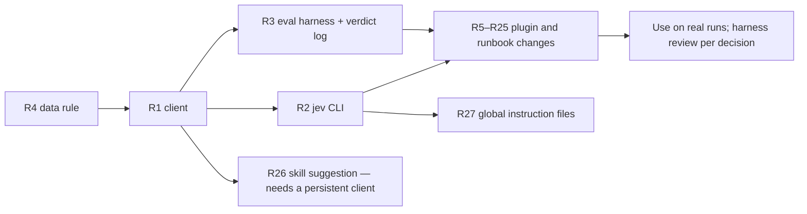

# TypeSafe AI (Jev) — research and integration recommendations for the Infiquetra agent fleet

- **Date:** 2026-09-18
- **Status:** Research and recommendations only. Nothing in any repository, plugin, or global
  instruction file was changed. This document exists to feed a plan.
- **Scope:** the `infiquetra-claude-plugins` repository (saga, orchestrate, mission-control,
  team-execution, fleet-core, agent-launcher, codex, agy, deploy), the
  `infiquetra-agent-operations` repository (daily operating loop, runbooks, handoffs), the global
  instruction files (`~/.claude/CLAUDE.md`, `~/.gemini/GEMINI.md`, `~/.codex/AGENTS.md`), and
  every coding-agent harness the `agents` launcher can start.
- **Inputs:** five research briefs written by Sonnet subagents on 2026-09-18 (TypeSafe's
  documentation, public prior art, community coding-agent integrations, this repository's decision
  points and harness inventory, and the agent-operations repository), plus live calls to the
  TypeSafe API made from this machine. Every number in section 2 was measured here; every
  vendor or community number is labelled as such.

---

## 0. Summary

**Jev is a small hosted model that answers typed questions about a block of text in about a third
of a second, for a fraction of a cent, without generating any prose.** You give it "state" (text or
JSON, up to 32k tokens) and a map of questions; each question is one of three shapes — a yes/no
probability (**noul**), a pick from a fixed set with a full probability distribution (**choice**),
or a position on an ordered rubric (**score**). It is trained for calibrated probabilities, not for
writing. It is bad at arithmetic, date comparison, adversarial input, and anything it was not asked
literally.

What that buys us, in one sentence: **every place our plugins or daily runbooks currently make a
repeated small judgment by regex, by a hand rule, by a reasoning-model reading a whole document, or
by you reading a paragraph, can become one batched typed call whose answer code can threshold.**

Headline findings:

1. **It works from this machine today.** The `typesafe-ai` skill loads, `TYPESAFE_API_KEY` reaches
   every login shell through `~/bin/keychain-env` (sourced from `~/.bash_profile`), and live calls
   return in 330–430 ms regardless of state size up to the limit.
2. **Subagent model-tier selection is the strongest immediate fit.** With your CLAUDE.md tiering rule
   passed in as policy text, Jev agreed with the rule on 10 of 10 test tasks, and did so for all
   ten in one 388 ms batched request for 1,646 input tokens.
3. **Issue-type triage is a "suggest, don't decide" fit.** Against 30 of this repository's own
   closed issues, Jev's type matched the applied label on 17/30 with generic criteria and 19/30
   when the repository's own issue-types reference was passed as policy. Most misses are places
   where the labels themselves are inconsistent; the ceiling is label noise, not the model. Priority
   agreed on only 3/9 — priority needs context the text does not carry.
4. **The highest-leverage code paths already say they want this.** The saga review-lens registry
   states "keyword matching may inform that judgment but never selects a lens by itself"; the
   orchestrate review-detection docstring says no regex can carry that decision; the tier resolver
   docstring says the work-shape heuristic is "prose-only". Those are the first plug-in points.
5. **The daily operations loop is the highest-frequency fit.** The four-way queue bucket, the
   seven-word session status, journal routing at closeout, unattended-run preflight, and the lead
   handoff roster check are repeated every day by hand and are all clean text-to-label judgments.
6. **The community converged on one architecture in three days:** code owns control flow, Jev
   returns probabilities, thresholds have three bands with the uncertain middle resolving to the
   cheaper mistake, hard-coded patterns set a floor that Jev can only raise, every verdict is logged
   with the pinned model version, and hooks fail open by explicit policy.
7. **Do not use it for:** per-turn routing of your main session (your standing policy is that the
   live session model and effort are operator-authoritative), ranking controller models from
   benchmark tables (the agent-operations reference explicitly forbids that data from deciding
   staffing), secret scanning, anything requiring date arithmetic, or any gate where a wrong answer
   acts without a human or a deterministic floor.
8. **Vendor risk is real but bounded.** TypeSafe launched publicly on 2026-09-15 — three days before
   this research. Its SDKs are days old and still shipping breaking changes (use a stdlib client,
   not the SDK). Rate limits are self-described as dynamic. There is no self-hosting. Its privacy
   policy commits to not training on inputs; zero-data-retention is enterprise-only.

The recommended shape is one body of work built together — a stdlib client, a `jev` command-line
tool, and an evaluation harness in fleet-core, then every plugin and runbook change in section 5 —
followed by using the plugins on real runs and reading the verdict logs to see how each judgment
holds up. There are no phases; the client is a build-order dependency, not a gate.

---

## 1. What TypeSafe and Jev are

### 1.1 The model

TypeSafe AI is a San Francisco lab founded by Diogo Almeida (co-inventor of RLHF, Reinforcement
Learning from Human Feedback, at OpenAI), Erik Gafni, and Sasha Sheng. It launched its first model,
**Jev**, on 2026-09-15 with a reported $40M seed round led by DCVC (press coverage only; the primary
release could not be fetched). *(Source: prior-art brief, fetched from typesafe.ai/team and blog.)*

Jev is what the vendor calls a **System One model** (after Kahneman's fast, intuitive "System 1").
Its documentation is explicit: "System One models do not write replies, produce code, or generate
explanations of their reasoning." It is trained with a vendor-coined method, RLCD (Reinforcement
Learning for Calibrated Decisions), so that a returned probability of 0.8 is right about 80% of the
time **across groups of predictions** — calibration is an aggregate property, never a guarantee about
one answer. The current release is `jev-1.13.0`; the alias `jev-latest` resolves to it (confirmed in
every live response this session). Input is text only, English primary. *(Source: docs brief,
concepts/system-one, introduction/machine-learning-primer, models.)*

### 1.2 The three primitives

| Primitive | Question shape | Returns | Read it as |
|---|---|---|---|
| **noul** | "Does condition X hold?" with optional true/false descriptions | `noul` ∈ [0,1] | Probability of yes. No separate confidence. 0.5 means "as likely yes as no", **not** "moderately". |
| **choice** | Pick one of N named options, each with a description | `choice`, `probabilities` over all options, `confidence` | The distribution is the useful part; `confidence` measures how peaked it is. |
| **score** | Position on 2–10 ordered, described levels | `score` (probability-weighted mean of level indices), `legend`, `probabilities`, `confidence` | A fractional position on the rubric, e.g. 1.3 on a 0/1/2 scale. |

Instructions and criteria may be strings, JSON objects, or arrays; structured criteria (a "what",
a "not_for", examples) sharpen boundaries. Nested state is referenced with backticked paths such as
`` `issue.body` `` or `` `tasks[3].text` ``. Question IDs are for code only and are not seen by the
model, so each question must carry its full meaning.

### 1.3 The contract

- `POST https://api.typesafe.ai/v1/systemone`, `Authorization: Bearer <key>`, JSON body
  `{state, model, questions}`; response `{model, answers, usage}`.
- **Limits:** 64k tokens per request; 32k for state plus the longest question. Confirmed here: a
  40,000-character diff (12,361 tokens) succeeded; a 150,000-character diff returned
  `HTTP 400 {"error_type":"max_tokens_exceeded"}`.
- **Batching:** many questions per request run in parallel with flat latency. No documented maximum
  question count. Confirmed here: 10 questions in 388 ms; 32 questions (one of four ranking
  batches) in about 400 ms.
- **Price:** $0.042 per million input tokens; output tokens free. Every probe in this session
  together — roughly 170,000 input tokens — cost under one cent.
- **Rate limits:** 250,000 tokens per second and 1,200 requests per minute, described by the vendor
  as dynamic and subject to change.
- **Errors:** standard HTTP statuses plus `529` "temporarily overloaded" (back off exponentially).
- **SDKs:** `typesafe-sdk` (Python, first release 2026-09-14, already two breaking changes) and
  `@typesafe-ai/sdk` (JavaScript). **Recommendation: do not depend on either yet**; the API is one
  endpoint and a stdlib client is fifty lines (section 7.2).
- **No MCP server and no command-line tool from the vendor.** The vendor ships an "agent skill" (the
  one installed here) that points agents at the live docs. Community MCP servers exist (section 3).
- **Privacy:** the vendor will not train on customer input; hosting is in the United States;
  zero-data-retention is available to enterprise customers on request. No self-hosting.

### 1.4 Documented weaknesses ("jaggedness" page for jev-1.13)

Literal reading (it answers the question you wrote, negations included); weak arithmetic and
counting; dates read as text, not ordered quantities; accuracy drops with multi-hop indirection and
with irrelevant content in the state; not adversarially robust — injected text is not treated as
hostile; confused by contradictory criteria; no guaranteed structural invariants (complementary
yes/no questions need not sum to one); useless for text generation. **Every recommendation in this
document is checked against this list.**

### 1.5 Critiques worth carrying

- The vendor's headline "193.6× faster, 444.6× cheaper" figure was produced by its own team and
  compares against LLMs wrapped in a constrained adapter it admits "may be slower and more expensive".
- Its 67.8% accuracy figure is agreement with two frontier LLMs, not ground truth. No independent
  ground-truth benchmark exists yet.
- The media company Every ran 777 judgments: fast and cheap as advertised, but it missed one of seven
  planted defects that Claude Fable 5.1 caught. Their conclusion — "an early warning system, not a
  final judge" — is the right operating stance for us.
- The Hacker News launch thread (1,892 points) objects that a typed wrong answer is still wrong; the
  "cannot hallucinate" framing is marketing.

---

## 2. What we measured here (2026-09-18, jev-1.13.0, from this machine)

All scripts are in the session scratchpad (`jev.py`, `tier_probe.py`, `probes2.py`, `probe3.py`,
`rank.py`, `ideas.json`). Latencies are wall-clock from Python `urllib`, including TLS.

| Probe | Setup | Result | Read |
|---|---|---|---|
| Smoke | 3 questions (noul/choice/score) on a fake issue | HTTP 200, 378 ms, 578 in / 87 out tokens | Works end to end. |
| **Subagent tier** | 10 task descriptions; your CLAUDE.md tiering rule passed as `policy` in the instructions; choice over haiku/sonnet/opus + choice over low/medium/high/max + noul "needs judgment" | **Model 10/10** agreement with the rule; effort 7/10 (disagreements arguable: it rated "rename across 12 files" medium, not low); mean 332 ms | Strong fit. Confidence was 1.00 on 9/10; the 0.51 was the survey-vs-mechanical boundary ("list every file:line that reads X"). |
| **Tier, batched** | Same 10 tasks in one request, `tasks[i].text` references | **10/10**, 388 ms, 1,646 input tokens | Batching did not degrade quality; ~6× cheaper and ~9× faster than ten calls. |
| **Issue type vs labels** | 30 closed issues of this repo with exactly one of defect/enhancement/capability; generic criteria | **17/30** | Misses cluster on capability-vs-enhancement (labels inconsistent) and on "maintenance: repair stale prose" labelled enhancement where Jev says context-update at 1.00 — in a skills repo, prose *is* behavior, which generic criteria do not say. |
| Issue type, with policy | Same 30, the repo's `issue-types.md` (309 lines) passed as `policy` state | **19/30**, 352 ms, 3,767 input tokens/call; accuracy 16/23 (70%) when confidence ≥ 0.6 vs 3/7 below | Policy text helps modestly; confidence separates weakly. Ceiling is label noise: several Jev calls are more defensible than the label. |
| Priority vs labels | 9 issues with high/medium/low-priority | **3/9**; Jev skews higher | Priority depends on board context the text lacks. Not a fit as an automatic decision. |
| Reviewer selection | A CDK+IAM+DynamoDB+pytest+OpenAPI+runbook plan; one noul per optional team-execution reviewer | api 0.86, infra 0.92, testing 0.85, clarity 0.67, code-quality 0.59, privacy 0.42, ai-usefulness 0.41; 345 ms | Sensible; matches what the keyword rule would pick and adds a graded middle. |
| Saga command routing | 5 raw asks → choice over 11 saga commands | investigate 1.00; office-hours 0.87; work 1.00; retro 1.00; spec 0.39 (brainstorm 0.18) | Clear asks route confidently; the genuinely ambiguous one shows as ambiguous — which is the point. |
| Diff size | Real PR diff, 10k/40k/150k chars; noul release-surface, choice plugin, score risk | 345 ms/3,850 tok; 428 ms/12,361 tok; HTTP 400 at 150k | Latency flat with size. Truncation changed the plugin answer (saga at 10k, orchestrate at 40k — the PR was orchestrate), so truncation strategy matters. |
| **Self-ranking** | 32 candidate ideas × 4 questions (value, effort, risk, fit) in 4 batched requests | 1,598 ms total, 14,977 tokens, ≈ $0.0006 | See section 10. Useful, and wrong in instructive ways. |

Two lessons from the numbers: **pass the policy as state and the decision improves; write the
criteria from the repository's actual practice or the model will apply the generic meaning** (the
context-update miss is exactly the "literal reading" weakness).

---

## 3. How others use it

### 3.1 Patterns (vendor-named and observed)

Vendor patterns: **speculative fan-out** (ask every plausible question up front, in one request),
**confidence-gated routing** (act / confirm / escalate bands, per-action thresholds), **composite
scoring** (score dimensions once, combine with code-owned weights; re-weighting needs no re-inference),
**intent routing**. Eighteen cookbooks; the ones that map directly onto our work are *skill
suggestion* (rank a large skill roster, deep-check the top three, suggest at most one — wrong loads
16.8% → 7.3% on 488 requests), *function calling*, *SDE cascade* (cheap extract → Jev verifies per
field → expensive model redoes only flagged records), *citation check*, *self-consistency* (standard
deviation 0.01 across repeated identical calls), and *hierarchical classification* (beam search over a
taxonomy).

Observed across ~250 community builds (madewithjev.com lists 133; awesome-jev adds more): routing at
every layer (intent, model, skill); "the LLM plans, Jev decides"; judgments as numeric features;
verification gates on another agent's actions; context compaction by relevance scoring.

### 3.2 The coding-agent cluster — mechanisms that matter for us

| Project | Hooks into | What it asks | Threshold policy | Evidence quality |
|---|---|---|---|---|
| `codex-context-diet` (Codex) | `hooks.json`: `PostToolUse`, `SessionStart`, `UserPromptSubmit` — **same names and JSON shape as Claude Code classic hooks** | 5 nouls per tool result (keep call? keep verbatim? …); 2 nouls per prompt (`touches_production`, `irreversible`) | 0.7; uncertainty resolves to the side that costs tokens, never the side that loses information | Measured hook cost **1.07–1.94 s per cold invocation**; an earlier 2 s deadline silently timed out on 2 of 8 real runs |
| `pi-heed` (Pi agent) | pre-tool-call | "does this call violate the user's stated constraints?" — intent, not a taxonomy | structured DENY/ALLOW/CONFIRM policy that Jev updates, never authors | 211 labelled decisions; accuracy 71% → 93% by asking about intent; 1/4/8 questions in one call: 274/273/276 ms (flat); 8 separate parallel calls ~650 ms |
| `pi-warden` (Pi) | pre-call + post-write | rules from a project `pi-warden.md` | **patterns set the floor, Jev can only raise it**; `irreversible` ≥ 0.7 | 17,160 guarded calls, 42 holds, 37 stood; 0 violations with the guard vs 5/60 and 1/90 without |
| `Bicameral` (Pi) | `message_update` (prefetch while the model is still streaming), `tool_call`, `turn_end` | exfiltration, destructive, scope | allow/confirm/block/warn/steer in deterministic policy | Only project that **redacts secrets by pattern** before sending state; audit log kept out of model context |
| `jev-router` (Claude Code/Codex) | loopback proxy wrapper, not a hook | per-turn tier fast/balanced/strong/long | — | Writes prompt text and raw Jev I/O to plaintext temp files — **do not copy** |
| `jev-codex-router` | local server behind a third-party "Codex Router" provider | per-turn tier | 0.5 confidence → fall back to the *middle* tier (frontier fallback "eats ~80% of the savings") | ≈ $0.00003 and ≈ 0.6 s per turn; −60% cost on a 237-turn replay |
| `fast-jev-compaction` (Claude Code, 3.3k stars) | **early-access "function hooks"** (`session.compact`, `turn.complete`, `CLAUDE_CODE_ENABLE_FUNCTION_HOOKS=1`) — classic hooks cannot rewrite messages | 2 nouls per tool call (keep call? keep result verbatim?) | staged truncation ladder to fit a 25k-token budget | Surface documented as unstable across releases |
| `DiffJury`, `jev-review-action` | web app / GitHub Action | 9 parallel questions on a PR: risk, review depth, needs design, needs security, merge blocker, missing tests, docs debt, blast radius, verdict | maintainer-authored JSON policy | thresholds self-described as provisional |
| `routeKit` | library | 4 normalized signals: difficulty, reasoning need, ambiguity, tool complexity | "Jev does not choose the model. It produces normalized task requirements." | — |
| `jev-mcp` (Node, 73★), `jev-mcp` (Python), `typesafe-mcp` (Go, 73★) | MCP servers; the Go one registers with Claude Code, Claude Desktop and Codex in one command | verify / screen / rerank / classify / decide … | mechanical: "injection 0.99 ≥ block 0.75" | Warns that some MCP clients strip env vars and silently drop the key |
| `codex-skills` issue 66 | proposal only, zero comments | "Jev as a calibrated judgment tier for workflow gates" | log `{question, noul/score, threshold, model version}`; pin `jev-1.13.0` | Unimplemented; the clearest statement of the pattern |

**Rules the good projects share** (adopt all of them — section 8): code owns control flow; three
bands, uncertain middle → cheaper mistake; patterns as a floor Jev can only raise; one literal
condition per question ("explicitly forbidden" ≠ "implied" fixed 27 false positives in pi-heed);
batch all questions about one state; prefetch while the model streams; redact by pattern, not by
length; log every verdict with the pinned model version, outside model context; fail open by
documented policy; a persistent local process for anything firing on every tool call (per-call
process spawn is the 1–2 s, not the API).

No project integrates Jev with Gemini/Antigravity or Qwen yet. Nothing is first-party in any vendor's
agent.

---

## 4. Where it fits in our fleet

### 4.1 The decision-point inventory (condensed)

The full survey has 36 rows for this repository and 22 for agent-operations (scratchpad briefs). The
rows that matter, grouped by what makes the decision today:

**Regex or keyword lists standing in for a judgment**

| Where | Decision | Today | Proposed |
|---|---|---|---|
| `plugins/saga/scripts/parse_issue.py:16-23` | security / api / infra / privacy / refactor flags → feed the **mandatory** test gate and backend pick | five word-list regexes | noul per flag, **widen-only**: flag = regex OR noul ≥ t |
| `plugins/orchestrate/scripts/orchestrate.py:189,1187-1209` | is this unit a bespoke review request? | single-word `review` regex; docstring says wording "cannot carry this decision" | noul over unit text, regex kept as floor |
| `plugins/fleet-core/scripts/fleet_commons/delegation_audit.py:227-240` | is this shell command a genuine engine invocation? | six OR'd substrings feeding a real-vs-faked verdict | noul beside the regex, surfaces disagreement as advisory |
| `plugins/saga/scripts/journal_nudge_hook.py:29` | does this commit deserve a journal nudge? | `feat`/`fix` prefix | noul "non-obvious fix or pattern decision" over message + diffstat |
| `plugins/mission-control/scripts/sdlc_manager.py:1730-1751` | auto-labels from issue text | `auto_label_rules` regex, documented as legacy | noul per label |
| `plugins/saga/skills/ideate/SKILL.md:161-163` | tactical-scope ask? | keyword list | noul |

**A reasoning model reading a whole artifact to answer a small closed question**

| Where | Decision | Today | Proposed |
|---|---|---|---|
| `plugins/saga/references/lens-roster.json` + `team-execution/.../reviewer-registry.md` | which of the **ten conditional review lenses** apply | full model read per review; registry text: "keyword matching may inform that judgment but never selects a lens by itself" | one request: diff (truncated by a documented ladder) + ten nouls keyed to each lens's guidance text; clear yes/no bands decided by threshold, the uncertain band goes to the model; mandatory lenses widen-only |
| `plugins/saga/skills/plan/SKILL.md:476-490` + `fleet-core/.../tier_resolver.py` | work-shape → `{model, effort}` per unit | "prose-only heuristic table", applied by the planning model per unit | one batched choice request over all units with the tiering policy as state; code maps shape → tier; low confidence → ask |
| `plugins/team-execution/.../reviewer-registry.md` | plan is code / docs / mixed | prose | choice |
| `plugins/saga/skills/loop/SKILL.md:142-149` | turn is Route / Drive / Resume | prose | choice with a fallback option |
| `plugins/saga/skills/office-hours/SKILL.md` | Startup vs Builder mode | prose rubric | choice, overridable |
| `plugins/saga/skills/handoff/SKILL.md:98` | does the text say execution should wait? | prose | noul |
| `plugins/saga/skills/ideate/SKILL.md:562-566` | which generated ideas survive critique | full critique per idea | score pre-rank so the critique budget goes to the top slice; never silently drop |
| `plugins/saga/scripts/execution_spec.py:95-96` | is a finding refuted (refute-N panel) | N full agent calls at the unit's tier | noul pre-screen / extra vote — **never** the sole refuter |
| `plugins/saga/skills/code-review/SKILL.md:316-379` | suppress a finding below self-reported confidence 75 | the reviewer's own number | independent score as a cross-check; flag disagreements |

**The operator deciding by hand, repeatedly** (agent-operations)

| Where | Decision | Today | Proposed |
|---|---|---|---|
| `docs/operations/session-queue.md:95-141`, `end-of-day-closeout.md:51-58` | queue bucket: Needs Operator / In Progress / Waiting / Parked | read a paragraph per workstream, twice a day | choice over latest status text |
| `docs/operations/tooling.md:125-138` | seven-word session status | lifecycle label + last output, by hand | choice; **never from the lifecycle label alone** (idle/done ≠ success) |
| `end-of-day-closeout.md:88-97` | journal destination (LEARNINGS / DECISIONS / QUEUED / ARCHIVE / write-up) | by hand nightly | choice |
| `unattended-orchestration.md:107-134` | parent issue decision-complete (9 questions); monitor misconfigured (5 patterns) | checklist by hand; documented failures 2026-09-09 and 2026-09-11 | noul batches at preflight |
| `lead-handoff-role-boundaries.md:255-256,137-146` | handoff roster matches approved roster; correction scope ambiguous; completion claim has evidence | compared by hand; already failed once ("expert reviews" wording implied an unapproved reviewer) | noul batch after the incoming lead's first reply |
| `operating-model.md:43-58` | requirement / suspected gap / verified defect | three-way prose rule under delivery pressure | choice, **advisory only** |
| `docs/reference/models/README.md:58-69` | roster row is Launchable / Capable / Behaves | three files read by hand | three nouls over the three rows |
| `workspaces.md:175-180` | workspace stale/leaked | no signal today | score over *code-computed* elapsed days + last stated reason |
| `mission-control commands/triage.md` | issue type, risk, Initiative/Objective, board status | you, asked directly | choice/score suggestions with distribution shown; auto-apply only above a tuned threshold |

### 4.2 Not recommended (and why)

| Idea | Why not |
|---|---|
| Per-turn model router for the main session (`jev-router` style) | Your standing policy: the live session's model and effort are operator-authoritative. Fine for **subagents**, not for the session you are driving. |
| Ranking controller models from benchmark tables | The agent-operations reference says its own table "has no reproducible evaluation record and must not determine staffing defaults." A Jev ranking of the same data launders a rejected use through a new interface. |
| Secret / privacy sweep before commit | Adversarial-shaped and expensive to get wrong — the documented weakness. A deterministic scanner is cheaper and more trustworthy. |
| Elapsed-time, timeout, or cost arithmetic | Documented weakness. Compute in code; hand Jev the number or category. |
| Anything gated on live external state (PR merged? CI green at the final SHA?) | Needs a real tool call. A *reported* outcome fed to Jev produces a fast, confidently wrong answer. |
| PreToolUse intent guard blocking every Bash call | Highest risk score in the inventory (Jev itself scored it 2.84/3); hook cost 1–2 s per call unless a daemon is built; adversarial surface. Revisit as an **advisory, narrow, destructive-command** check once a persistent local client exists. |
| Context compaction plugin | Needs the unstable function-hooks surface; Claude Code already compacts; your sessions run 1M context. Low value for the risk. |

---

## 5. Recommendations — the full set, built together

There are no phases. Everything below is built as one body of work, the plugins are then used on
real runs, and the verdict logs show how each judgment holds up. One build-order dependency exists
inside that work: the client, the command-line tool, and the evaluation harness (R1–R3) must exist
before anything can call them, so they are written first — a dependency, not a gate.

**How "use them and see how they hold up" works.** Every Jev-backed judgment ships in suggest mode
with its verdict logged (R3), and every operator override is logged beside it. After an agreed number
of real uses per decision (30 is enough for a first read) the harness prints agreement and accuracy
per confidence band. Each decision then stays advisory, becomes automatic above a band, or is removed.
That review is the only checkpoint, and it is data, not a phase gate.

### Foundation — fleet-core, written first within the same effort

| # | Change | Detail |
|---|---|---|
| R1 | `typesafe_client.py` in `plugins/fleet-core/scripts/fleet_commons/` | Modelled on `plugins/saga/scripts/engine_bridge_http.py`: stdlib `urllib`; injectable `urlopen` / `getenv` / `clock` seams (tests pass fakes, zero live network); the secret is named by env var, resolved once at request-build time, placed only in the header, never logged; closed status vocabulary (`ok` / `error` / `timeout` / `malformed`); retry on 429/529 with backoff; every result records the resolved model (`jev-1.13.0`). Loaded the house way: `fleet_commons_shim.load("typesafe_client")`. Release surfaces: fleet-core version, marketplace, CHANGELOG, drift-guard test. |
| R2 | `jev` command-line tool in the same module | argparse, Python 3.12, stdlib. `jev ask --state-file --questions` (raw) plus named verbs that carry our policy text in one place each: `jev tier`, `jev triage`, `jev lenses`, `jev bucket`, `jev status`, `jev journal-route`, `jev preflight`, `jev monitor-check`, `jev handoff-check`, `jev roster-check`, `jev dedupe`, `jev readiness`. Any harness that can run a shell command can use it without the skill being visible. |
| R3 | Evaluation harness and verdict log (`jev eval`, `jev log`) | Cache answers keyed by `(state hash, question hash, model)` so re-runs cost nothing; log every verdict as `{decision_id, question hash, state hash, answer, confidence, threshold, resolved model, timestamp}` outside model context; log operator overrides beside verdicts; print agreement against labelled history and accuracy per confidence band; choose thresholds from that, never from a cookbook. |
| R4 | Data rule | State sent to TypeSafe leaves the machine. Decide once and record it in `DECISIONS.md`: issue bodies and diffs from private repositories may be sent (we already send them to Anthropic, OpenAI, DeepSeek, and Ollama Cloud through `engine_bridge_http`) **after** pattern redaction of keys, tokens, and high-entropy strings; never raw transcripts. |

### saga

| # | Change | Primitive and state | Safeguard | Evidence so far |
|---|---|---|---|---|
| R5 | **Subagent tier selection**: `tier_resolver.py` gains `classify_shape(task_text)` backed by `jev tier`; the plan emitter and the orchestrate planner call it batched across all units; per-unit log | choice over work shapes with the tiering policy as state; code maps shape → `{model, effort}` | confidence below 0.6 → ask, never guess; the operator's `/saga:tier` ceiling still clamps | 10/10 on a 10-task probe; batched 10/10 |
| R6 | **Review-lens pre-screen** in code-review, shared by team-execution reviewer selection | ten nouls over the truncated diff plus each lens's guidance text | three bands: ≥ t_high select, ≤ t_low skip, middle → model judgment; mandatory lenses widen-only | reviewer-selection probe sensible; the registry already demands judgment |
| R7 | **`parse_issue.py` flags** (security / api / infra / privacy / refactor) | noul each | flag = regex OR noul ≥ t; the regex stays the floor because the flags feed a mandatory gate | code comment |
| R8 | **Journal nudge** (`journal_nudge_hook.py`) | noul "non-obvious fix or pattern decision" over the message and diffstat | the prefix regex stays the floor | — |
| R9 | **Loop turn** (Route / Drive / Resume), **office-hours mode** (Startup / Builder), **handoff "should wait"** | choice / choice / noul | a fallback option; overridable; low confidence → ask | routing probe: clear asks route at 0.87–1.00, the ambiguous one shows as ambiguous |
| R10 | **Verify-panel extra vote** in `execution_spec.py` | noul per finding ("plausibly refutable given the diff?") recorded as one additional vote at zero marginal cost | the panel still runs; "a finding survives unless refuted" is unchanged; never the sole refuter | — |
| R11 | **Finding confidence cross-check** in code-review | score per finding over the finding and its diff hunk | disagreements with the reviewer's self-reported number are flagged; nothing is suppressed on Jev alone | — |
| R12 | **Ideate** — the table below | — | respects "explicit rejection with reasons, not optimistic ranking" (`ideate/SKILL.md:26-27`); Jev drops nothing | — |
| R13 | **Brainstorm** — the table below | — | consistency and one gate; the dialogue is untouched | — |

**Ideate (R12).** Ideate is a volume problem: up to six frame agents generate, the skill merges and
dedupes the candidates (`ideate/SKILL.md:532-549`), refills empty axes with a recovery frame, then
critiques every candidate. Jev must not cut ideas; it does the mechanical judgment work around the
critique, at volume, consistently:

| Judgment in ideate | Today | Jev shape | Why it helps |
|---|---|---|---|
| Merge and dedupe candidates (`:532`, `:549`) | the orchestrating model eyeballs the list | pairwise noul "same idea?" batched (`jev dedupe`) | dedupe quality decides whether critique budget is spent on twins; 40 candidates is 780 pairs in a few requests |
| Axis coverage — "any axis with zero ideas" (`:545`) | the model assigns by reading | choice per candidate over the axis list | the recovery frame fires on real gaps, not mislabelled ones |
| Grounding-fit gate — "ASK when unsure, never silently auto-route" (`:80`) | prose rubric | choice with a confidence floor | the act / confirm / escalate band the skill already mandates |
| Tactical-scope ask lowers the ambition floor (`:163`) | keyword list | noul | catches phrasings the list misses |
| Critique rubric scores | critics write prose verdicts | score per rubric dimension beside each verdict | survivors become comparable numbers; re-weighting needs no re-critique; the revivable cut gets a stable order |
| Revival "with new evidence" (`:32`) | prose | noul "does this evidence address the recorded rejection reason?" | a cheap, consistent re-entry check |

Evaluation here is nearly free: log dedupe pairs and rubric scores during a normal run without acting
on them, then compare with what the full critique actually kept.

**Brainstorm (R13).** Brainstorm is one idea, depth-first, one question at a time by rule; the value
is the dialogue, which Jev cannot do. It can make four internal judgments consistent across sessions:

| Judgment in brainstorm | Today | Jev shape |
|---|---|---|
| Scope tier — Lightweight / Standard / Deep-feature / Deep-product (`brainstorm/SKILL.md:129-151`) | prose assessment | choice; low confidence → ask |
| Consequence factors — data sensitivity, legal or operational consequence, recovery expectations, auditability and consent (`:153-160`) | prose, internal | one noul per factor |
| Question selection — "prefer the greatest combination of consequence and uncertainty" (`:287`) | prose | two scores per candidate question; code orders them |
| Readiness before the Phase 4 `/doc-review` handoff | a full review | noul batch over the requirements doc's sections (`jev readiness`), the same shape as the unattended-run preflight |

### mission-control

| # | Change | Primitive and state | Safeguard | Evidence so far |
|---|---|---|---|---|
| R14 | **Triage suggestions**: `triage` and `issue create` show a type distribution, a risk score, an Objective suggestion, and a board-status suggestion; overrides logged | choice with `issue-types.md` as policy; score for risk; choice over the live Objective option list | suggestion-only until the harness shows the band is reliable; priority is **not** suggested | 19/30 vs noisy labels; 70% at confidence ≥ 0.6; priority 3/9 |
| R15 | **Auto-labels** (`sdlc_manager.py` `auto_label_rules`, documented as legacy) | noul per label | regex OR noul; the regex stays the floor | — |

### orchestrate and team-execution

| # | Change | Primitive and state | Safeguard |
|---|---|---|---|
| R16 | **Review-shaped detection** (`orchestrate.py` `_REVIEW_SHAPED`) | noul over the unit text | regex OR noul; the docstring already says no regex can carry it |
| R17 | **Dynamic workflow shaping**: per planned unit, batched — parallel-safe? needs a verify panel? panel size 1 / 3 / 5? risk level? — and code assembles the DAG and panel sizes | noul ×2, choice, score per unit; one request per plan | low confidence → the conservative shape (serial, larger panel); never concurrency arithmetic or timestamps |
| R18 | **Plan is code / docs / mixed** (reviewer registry) | choice | mixed is a real option, not a fallback |

### fleet-core governance

| # | Change | Primitive | Safeguard |
|---|---|---|---|
| R19 | **Delegation audit** `_looks_like_engine_command` | noul beside the six-substring regex | advisory; disagreements surfaced, the regex verdict stands |

### agent-operations (the daily loop)

| # | Change | Shape |
|---|---|---|
| R20 | `jev bucket` and `jev status` in the voice-console start step and closeout step 3; runbooks gain an optional "typed judgment" sub-step quoting the exact command | choice (4) / choice (7) over the pasted status text; **never** the Herdr lifecycle label alone |
| R21 | `jev journal-route` at closeout step 6 | choice (5) |
| R22 | `jev preflight --issue N` before an unattended run (nine decision-completeness nouls); `jev monitor-check` over a monitor's recent turns (five misconfiguration nouls) | noul batches; any "no" is stop-and-ask |
| R23 | `jev handoff-check` after an incoming lead's first reply: roster match, correction-scope ambiguity, claim-versus-evidence | noul batch |
| R24 | **Judgment Provenance convention**: a trailing section (or a parenthetical beside the line) recording `decision, answer, confidence, jev-1.13.0, threshold`; `scripts/check_docs.py` enforces nothing about handoff sections; no new table columns | documentation convention |
| R25 | `jev roster-check` for the models reference: Launchable / Capable / Behaves | three nouls over the three reference rows |

### Session-level and global

| # | Change | Shape | Note |
|---|---|---|---|
| R26 | **Skill suggestion** on `UserPromptSubmit`: shortlist the installed roster (about 90 skills here) with nouls, deep-check the top three, suggest at most one | cookbook pattern | the one item whose viability is unproven: it needs a persistent local client, and hook latency must be measured here |
| R27 | **Global instruction files**: a short shared-register section in `~/.claude/CLAUDE.md` (mirrored to `GEMINI.md`, two lines in `AGENTS.md`): use a plugin's Jev-backed suggestion rather than re-deriving by prose; `jev tier` when spawning, ask below 0.6; the do-not list; a typed answer is evidence, never the decision | prose | depends on R2 existing |
| R28 | **Skill propagation**: `npx skills add typesafe-ai/skills --skill typesafe-ai` for Codex and Gemini; Grok through its plugin mirror; Hermes through the asgard-skills sync | install | only matters for agents reaching for Jev on their own initiative |

### Build dependencies (not phases)

---

## 6. Your questions, answered directly

**Which plugins should we update?** In order: **fleet-core** (client, CLI, harness — everything else
loads it through the shim), **saga** (tier classification, review lenses, parse_issue flags, journal
nudge, verify pre-screen, loop/office-hours/handoff choices), **mission-control** (triage
suggestions, auto-labels, risk pre-fill, Objective suggestion), **orchestrate** (review-shaped
detection, workflow shaping), **team-execution** (reviewer selection shares the lens roster). Not
needed: deploy, unifi, redis-channel, home-lab-ops, agent-launcher (the `agents` wrapper loads no
skills; tiering happens before launch). agy and codex plugins only need their delegation envelopes
to accept a tier chosen upstream.

**Should global CLAUDE.md / AGENTS.md / GEMINI.md change?** Yes, but small, and only after the CLI
exists. A shared-register section (mirrored to GEMINI.md, a two-line version in AGENTS.md) that says:
(a) when a plugin exposes a Jev-backed suggestion, use it rather than re-deriving by prose;
(b) when spawning a subagent, `jev tier` gives the model and effort, ask below confidence 0.6;
(c) do not use it for arithmetic, dates, adversarial content, live external state, or generation;
(d) a typed answer is evidence for a decision, never the decision. Do **not** write "use Jev for
decisions" in general: most in-conversation decisions are one-off and the reasoning model is
already there. Jev earns its place where a judgment is repeated, needs consistency across
sessions, sits in a code path, or needs a probability a threshold can consume.

**Can we reduce work / make things more efficient?** Three real mechanisms, none yet measured:
(1) replace repeated whole-artifact reads by a reasoning model with one batched typed call (review
lenses, tier classification, triage); (2) pre-screen before expensive fan-outs (verify panels, ideate
critique) so the budget goes where it matters; (3) turn your own repeated labelling in the daily loop
into instant, consistent suggestions with a provenance trail. A fourth, softer one: **fewer questions
to you** — a tier call with a confidence floor asks only when it is genuinely unsure. The evaluation
harness (R3) is what turns "should save" into a number; until then treat every gain as a hypothesis.

**Subagent model and effort selection?** The best-evidenced fit in this document (10/10, batched,
policy-as-state). Build it as `jev tier`, wire it into `tier_resolver.py` and the emitters, keep the
operator's `/saga:tier` ceiling as a clamp, and log `{task, shape, model, effort, confidence,
jev-1.13.0}` per unit so the harness can score it against outcomes later. Effort agreement was 7/10
on a loose rubric — write the effort criteria from your own practice, with examples, before trusting
it.

**Dynamic workflow generation?** Yes, as R17: per-unit batched questions feeding a code-owned DAG
builder, with low confidence defaulting to the conservative shape (serial, larger panel). Do not let
it choose concurrency numbers (arithmetic) or read timestamps; hand it categories.

**Other harnesses — Codex, Antigravity, Qwen, Muse, Grok, Hermes, OpenCode, Cursor?** Two different
questions hide here. *For plugin code paths* the harness is irrelevant: every decision point above is
Python invoked over a shell tool, and `TYPESAFE_API_KEY` reaches any process descended from a login
shell. *For an agent reaching for Jev on its own initiative* it needs the skill or an MCP server:

| Harness | Skill visible today | Route |
|---|---|---|
| Claude Code (`~/.claude`, `~/.claude-company`) | yes (symlink to `~/.agents/skills/typesafe-ai`) | CLI + skill; note the two trees drift (memory: registry skew) |
| Codex (`~/.codex`) | **no** — separate, non-symlinked skills path | `npx skills add typesafe-ai/skills --skill typesafe-ai -a codex`; hooks proven (`codex-context-diet`) |
| Gemini / Antigravity (`~/.gemini`, `agy`) | **no** — skills dir empty | same installer with the gemini target; no community precedent yet |
| Qwen (`~/.qwen`) | yes (symlink) | CLI works; no community precedent |
| Grok (`~/.grok`) | **no** — own marketplace mirroring our saga/orchestrate/mission-control/deploy plugins as pinned snapshots | ship the client *inside* those plugins and the mirror carries it on refresh |
| Hermes (`~/.hermes`) | unconfirmed; uses `asgard-skills` + its own sync script | add to the sync; Hermes profile edits stay governed by `hermes-profile-evolution` |
| Muse, OpenCode, Cursor | not installed at home-dir level here; the `agents` launcher supports them | CLI only |

The community MCP servers (`typesafe-mcp` registers with Claude Code, Claude Desktop, and Codex in one
command) are an option for interactive use, with one caveat from their own README: some MCP clients
strip environment variables and silently drop the key. The CLI avoids that.

**The agent-operations repository specifically?** R20–R25 in section 5: runbook sub-steps quoting the exact
`jev` command, a "Judgment Provenance" trailing section in handoffs, and preflight/handoff/roster
checks that already have a documented failure behind them.

---

## 7. Delivery mechanics

### 7.1 The key

`TYPESAFE_API_KEY` is provisioned by `~/bin/keychain-env`, whose `~/.config/keychain-env/vars.json`
names it, evaluated from `~/.bash_profile` lines 112–116. Every bash login shell exports it; the
process chain here is launchd → herdr → bash → claude, so every Herdr-launched harness inherits it.
(The landscape survey reported the key as "not found" because it grepped for the literal name in
profiles and checked the keychain under the wrong service name — a false negative worth remembering
when a subagent reports an env var as missing.)

### 7.2 Client design (fifty lines, no SDK)

The API is one endpoint. The SDKs are days old and have shipped two breaking changes in a week. Use
`urllib.request` exactly as `engine_bridge_http.py` does; add the SDK later if it stabilises and
offers something the raw call does not (its `response_model` typing is the only candidate).

### 7.3 Latency budget

The API call is ~0.3–0.4 s from here. A **cold Python process plus TLS** on top is what
`codex-context-diet` measured at 1.07–1.94 s. For anything firing on every tool call, run a
persistent local client (a small daemon the hook talks to over a socket) or accept a 5–10 s hook
timeout with fail-open. For once-per-plan, once-per-review, once-per-turn calls, a fresh process is
fine.

### 7.4 Truncation ladder

State over 32k tokens fails. Copy `fast-jev-compaction`'s staged ladder (cut tool outputs, then
abridge head/tail, then collapse to counts), and make the ladder deterministic and logged, because
truncation changed an answer in the diff probe.

### 7.5 Logging and pinning

Every verdict: `{decision_id, question hash, state hash, answer, confidence, threshold, resolved
model, timestamp}` to a local JSON log outside model context. Call with `jev-latest`, record the
resolved `jev-1.13.0`, and re-judge when the alias moves.

---

## 8. House rules for any Jev use (proposed `DECISIONS.md` entry)

1. Code owns control flow; Jev returns a probability; a typed answer never executes an action by
   itself.
2. Three bands per decision (act / confirm / escalate); the uncertain middle resolves to the
   cheaper mistake; thresholds come from the evaluation harness, never from a cookbook.
3. Any existing regex or hard-coded pattern is a **floor**; Jev may only widen what triggers a
   mandatory gate.
4. One literal condition per question; policy text passed as state; criteria written from the
   repository's actual practice, with examples.
5. Batch every question about one state into one request; pass array items by `items[i]` paths.
6. Redact secrets by pattern before sending; never send raw transcripts; obey the data rule (R4).
7. Log every verdict with the resolved model version, outside model context; pin for re-judging.
8. Fail open by documented policy, per gate, and say which side fails open.
9. Never: arithmetic, counting, date comparison, adversarial screening, live external state,
   generation, main-session model routing, controller staffing from benchmark tables.
10. Suggest first; a decision becomes automatic only after a recorded harness run at the chosen
    band, and the operator can always override.

---

## 9. Risks and unknowns

| Risk | Exposure | Mitigation |
|---|---|---|
| Vendor is three days old; pricing, limits, availability may change | everything | stdlib client behind one module; every use degrades to the pre-Jev path (fail open); no gate depends on Jev alone |
| SDK churn | none if we skip the SDK | skip it |
| Accuracy is self-reported or LLM-agreement based; no ground truth yet | R6, R14 | our own harness on our own labels; suggest-only until measured |
| Label noise in our history caps measurable agreement (19/30) | R14 | log operator overrides to build a clean adjudicated set; treat disagreements as label-quality findings |
| Privacy: private issue text and diffs leave the machine | all | data rule R4; pattern redaction; enterprise ZDR if volume justifies |
| Hook latency (1–2 s cold) | R26, any per-tool hook | persistent client or avoid per-tool hooks |
| Literal reading: a mis-posed question yields a confident wrong answer | all | one condition per question; harness; the self-ranking below is the cautionary example |
| Two Claude plugin trees drift after releases | fleet-core bump | existing memory: verify both trees after each release |

---

## 10. Jev's own ranking of the 32 ideas, and where I disagree

Jev scored every candidate on value (0–3), effort (0–3), risk if wrong (0–3), and fit (noul), in four
batched requests (1.6 s, 14,977 tokens, ≈ $0.0006). Composite = value × fit − 0.5 × effort − 0.6 ×
risk, with weights owned by code. Full table in `jev_ranking.md` in the scratchpad.

| Jev rank | Idea | Value | Effort | Risk | Fit | Where it sits in section 5 | Why we differ |
|---|---|---|---|---|---|---|---|
| 1 | verify-prescreen | 2.58 | 1.13 | 1.69 | 0.75 | R10 | Agree it is cheap and valuable; it is an extra vote, not a replacement, so it follows the client. |
| 2 | global-md | 1.86 | 0.11 | 1.55 | 0.63 | R27, after R2 | Cheap, yes; but it is worthless before the CLI exists. |
| 3 | compaction | 2.41 | 1.82 | 1.37 | 0.76 | not now | Unstable hook surface; low value at 1M context. |
| 17 | lens-select | 2.42 | 1.90 | 1.77 | 0.68 | R6 | Jev priced the false-negative risk highly; the three-band design and widen-only mandatory lenses cap it. |
| 21–22 | spawn-tier-cli / tier-choice | 2.42 / 2.37 | 1.93 / 1.98 | 1.82 / 1.93 | 0.60 / 0.63 | R5 | The only idea with a 10/10 probe behind it; Jev had no access to that evidence. |
| 27, 29, 32 | eval-harness, client-module, skill-propagation | 2.26 / 1.87 / 1.72 | — | — | **0.42 / 0.17 / 0.21** | R1–R3 | **Mis-posed question.** I asked whether each idea "is a good fit for Jev's strengths"; infrastructure is not a judgment, so Jev answered literally: no. The composite then buried the prerequisites. |
| 31 | tool-intent-guard | 2.10 | 1.91 | **2.84** | 0.58 | not now | Full agreement on the risk. |

The lesson is the one the docs give: the per-dimension scores are reusable and mostly sensible; the
composite is only as good as the question wording and the weights; and an ill-posed "fit" question
produced confident nonsense for three rows without any signal that it had. That is exactly why rule
10 in section 8 exists.

---

## 11. Inputs for the plan

Everything is one body of work. The candidate issues below are in build order — the dependency order
the diagram in section 5 shows — not in phases, and they can be filed as one parent with sub-issues
(types per the mission-control taxonomy):

1. **capability** — fleet-core: `typesafe_client.py` + `jev` CLI + evaluation harness and verdict log
   + data rule (R1–R4). Acceptance: fake-`urlopen` tests; `jev ask` round-trips a smoke request;
   `jev eval` reproduces the 30-issue benchmark from cached answers; release surfaces bumped.
2. **enhancement** — saga/fleet-core: `jev tier` wired into `tier_resolver.py` and both emitters,
   batched per plan, confidence floor, per-unit log; CLAUDE.md tiering section updated (R5, R27).
3. **enhancement** — saga + team-execution: review-lens pre-screen with three bands and widen-only
   mandatory lenses (R6); plan code / docs / mixed choice (R18).
4. **enhancement** — mission-control: triage suggestions with distribution, risk pre-fill, Objective
   and board-status suggestions, override logging (R14); auto-labels union (R15).
5. **enhancement** — regex-to-noul widen-only unions: parse_issue flags (R7), journal nudge (R8),
   orchestrate review detection (R16), delegation audit (R19). Can be split per plugin.
6. **enhancement** — saga: loop / office-hours / handoff choices (R9), verify-panel extra vote (R10),
   finding cross-check (R11), ideate dedupe / axis coverage / gate / rubric scores / revival check
   (R12), brainstorm tier / consequence factors / question ordering / readiness (R13).
7. **enhancement** — orchestrate: workflow shaping from batched per-unit questions (R17).
8. **capability** — agent-operations: `jev bucket / status / journal-route / preflight /
   monitor-check / handoff-check / roster-check` sub-steps in the runbooks; the Judgment Provenance
   convention; `check_docs.py` unchanged (R20–R25).
9. **exploration** — skill suggestion on `UserPromptSubmit` with a persistent local client; hook
   latency measured here (R26).
10. **context-update** — global CLAUDE.md / GEMINI.md / AGENTS.md shared-register section (R27);
    skill propagation to Codex and Gemini, Grok via the plugin mirror, Hermes via asgard-skills sync
    (R28).

After the build: every decision runs in suggest mode with verdicts and overrides logged; after about
30 real uses per decision, `jev eval` reports agreement per confidence band and the decision is kept
advisory, promoted to automatic above a band, or removed — each outcome recorded in `LEARNINGS.md`.

Decisions only you can make before planning: the data rule (R4); whether suggestions in
mission-control may ever auto-apply; whether the daily loop adopts the provenance convention; and
whether the agent-operations changes are filed in that repository or driven from here.

---

## Appendix — sources

- Research inputs, preserved beside this file in `docs/analysis/2026-09-18-typesafe-jev-research-inputs/` (originally the session scratchpad): `research-docs.md` (4,200 words, every docs page),
  `research-prior-art.md` (3,900 words, madewithjev.com + awesome-jev + press),
  `research-coding-agent-integrations.md` (3,100 words, 19 repos read), `research-local-landscape.md`
  (3,700 words, 36 decision points, harness table), `research-agent-operations.md` (3,900 words, 22
  decisions, runbook inventory, handoff format), `jev_ranking.md`, probe scripts.
- Vendor: https://docs.typesafe.ai/llms.txt (index), `/api`, `/models`, `/confidence`,
  `/model-jaggedness/jev-1.13`, `/patterns/*`, `/cookbooks/*`, `/agent-skill`, `/legal`.
- Community: https://madewithjev.com/, https://github.com/kraayenjon/awesome-jev,
  `codex-context-diet`, `pi-heed`, `pi-warden`, `Bicameral`, `fast-jev-compaction`,
  `jev-codex-router`, `routeKit`, `typesafe-mcp`, `jev-mcp`, `future3OOO/codex-skills` issue 66.
