# Filing plan: the improve-claude-plugins objective after the two reviews

Date: 2026-09-19. Status: proposed; nothing on GitHub or the Operations board has been changed. Sources: the TypeSafe integration research (`docs/analysis/2026-09-18-typesafe-jev-integration-research.md`) and the saga simplification review (`docs/analysis/2026-09-19-saga-simplification-review.md`), both with the decisions you gave on 2026-09-19. Target: an issue tree under the Operations board objective `improve-claude-plugins` that a single `/goal` can drive to completion, with every open card either inside that tree or closed with a reason.

## 0. Do the documents need a brainstorm first?

No, with one exception. The card contract needs nine fields on every actionable card (objective, intent, non-goals, files expected to change, tests, context links, checklist acceptance criteria with at least one executable check, a fenced verification block, and a risk tier). Both documents already carry decided directions, named files, and acceptance shapes for every candidate, so the bodies below are written straight from them; `/plan` does the design work per card, and `/spec` remains available to any planner who wants it. The exception is the `/qa` redesign as prescribed testing strategies, which you said is not thought through yet; it is filed as an `exploration`, the non-actionable type whose deliverable is a brainstorm or spec, and the `/goal` routes it through `/brainstorm` before any planning. The staffing component is bounded enough to plan directly.

One precondition: the two analysis documents and their input folders are untracked. Card bodies link to them, so they are committed and pushed before any card is created (step 1 of section 6).

## 1. The tree

Two capability parents under the objective, one existing parent kept, and every open card placed. Types follow the mission-control taxonomy; the repository is `infiquetra-claude-plugins` unless stated; the board is Operations; new actionable cards enter at the Shaping stage with status Ready for Planning and maturity `requirements-ready`, so the `/goal` starts with `/plan`.

```mermaid
graph TD
    O["Objective: improve-claude-plugins"]
    O --> A["A. Saga simplification (capability, new)"]
    O --> B["B. TypeSafe Jev integration (capability, new)"]
    O --> P["1005 Plan save-contract residuals (existing, kept)"]
    A --> A1["A1 sdlc amendments (infiquetra-sdlc)"]
    A --> A2["A2 mission-control vocabulary drift"]
    A --> A3["A3 staffing component (fleet-core)"]
    A --> A4["A4 roles library"]
    A --> A5["A5 run record + admission"]
    A --> A6["A6 roster helper"]
    A --> A7["A7 orchestrate slim (8 kept cards re-parented)"]
    A --> A8["A8 code review = card 1001 rewritten (6 cards re-parented)"]
    A --> A9["A9 plan continues into plan review (4 cards re-parented)"]
    A --> A10["A10 build loop"]
    A --> A11["A11 integrate, release, test, close"]
    A --> A12["A12 continuation mechanics"]
    A --> A13["A13 removals and release 1.0.0"]
    A --> A14["A14 instructions and runbooks (agent-operations)"]
    A --> A15["A15 /qa testing strategies (exploration)"]
    B --> B1["B1 client, CLI, harness, data rule (fleet-core)"]
    B --> B2["B2 tier suggestion in staffing"]
    B --> B3["B3 lens proposal, dedupe, severity flag in code review"]
    B --> B4["B4 mission-control triage and labels"]
    B --> B5["B5 parse_issue flags and journal nudge"]
    B --> B6["B6 ideate, brainstorm, office-hours judgments"]
    B --> B7["B7 agent-operations runbook judgments (agent-operations)"]
    B --> B8["B8 skill suggestion on prompt submit (exploration)"]
    B --> B9["B9 global instructions and skill propagation (context-update)"]
```



| Card | Type | Repository | Depends on | Source |
|---|---|---|---|---|
| A | capability | infiquetra-claude-plugins | none | simplification review, sections 5 and 6 |
| A1 | enhancement | infiquetra-sdlc | none | R21, R22, R23 |
| A2 | enhancement | infiquetra-claude-plugins | none | R18 |
| A3 | capability | infiquetra-claude-plugins (fleet-core) | none | R29 |
| A4 | capability | infiquetra-claude-plugins (agent-launcher) | none | R12 |
| A5 | capability | infiquetra-claude-plugins (saga) | A3, A4 | R1, R2 |
| A6 | capability | infiquetra-claude-plugins (agent-launcher) | A3, A4, A5 | R13 |
| A7 | capability | infiquetra-claude-plugins (orchestrate) | A5 | R16, R17; cards 879, 990, 874, 876, 944, 960, 979, 991 re-parented; 891, 901 rewritten |
| A8 | capability | infiquetra-claude-plugins (saga) | A3, A4, A5, A6, A1 | R5, R24; card 1001 rewritten into this card; 938 re-parented; 935, 937, 939, 885, 946 rewritten |
| A9 | enhancement | infiquetra-claude-plugins (saga) | A5, A6 | R3; cards 931, 932, 934 re-parented; 933 rewritten |
| A10 | capability | infiquetra-claude-plugins (saga) | A5, A7 | R4 |
| A11 | capability | infiquetra-claude-plugins (saga, deploy) | A2, A5, A7 | R6, R7, R19 |
| A12 | enhancement | infiquetra-claude-plugins (saga) | A5 | R8 |
| A13 | capability | infiquetra-claude-plugins (saga, team-execution, fleet-core, orchestrate) | A5 through A12, A3 | R10, R11, R14, R15, R26, R28 |
| A14 | context-update | infiquetra-agent-operations | A13 | R9, R27 (the global instruction files are operator-owned; the card records the exact edits) |
| A15 | exploration | infiquetra-claude-plugins (saga) | A11 | R30 |
| B | capability | infiquetra-claude-plugins | none | TypeSafe research, section 5 |
| B1 | capability | infiquetra-claude-plugins (fleet-core) | none | TypeSafe R1 to R4 (its issue 1) |
| B2 | enhancement | infiquetra-claude-plugins (fleet-core) | A3, B1 | TypeSafe R5 moved into the staffing component |
| B3 | enhancement | infiquetra-claude-plugins (saga) | A8, B1 | TypeSafe R6 and R11 moved into the code review |
| B4 | enhancement | infiquetra-claude-plugins (mission-control) | B1 | TypeSafe R14, R15 (its issue 4) |
| B5 | enhancement | infiquetra-claude-plugins (saga) | B1 | TypeSafe R7, R8 (its issue 5, minus the two dropped targets) |
| B6 | enhancement | infiquetra-claude-plugins (saga) | B1 | TypeSafe R12, R13, and the office-hours part of R9 (its issue 6, minus the dropped targets) |
| B7 | capability | infiquetra-agent-operations | A14, B1 | TypeSafe R20 to R25 (its issue 8) |
| B8 | exploration | infiquetra-claude-plugins | B1 | TypeSafe R26 (its issue 9) |
| B9 | context-update | infiquetra-agent-operations (records the global-file edits) | B1 | TypeSafe R27, R28 (its issue 10) |

## 2. How the simplification changes the TypeSafe plan

The TypeSafe research proposed ten issues. Reconciled against the simplification:

| TypeSafe item | What the simplification does to it | Where it lands |
|---|---|---|
| R1 to R4, client, CLI, harness, data rule | Unchanged | B1 |
| R5, subagent tier selection wired into `tier_resolver.py` and both emitters | The emitters and `/tier` are removed; the tier resolver becomes the staffing component | B2, as an advisory input to A3 |
| R6, review-lens pre-screen with widen-only mandatory lenses | The private roster is removed; lenses come from the sdlc declaration, so the pre-screen becomes the conditional-lens proposal at admission and review | B3 |
| R7, `parse_issue` flags; R8, journal nudge | Unchanged | B5 |
| R9, loop, office-hours, and handoff choices | `/loop` and `/handoff` are removed; only the office-hours routing choice survives | B6 |
| R10, verify-panel extra vote | Verify panels and the readonly-verifier agent are removed | Dropped |
| R11, finding cross-check | Becomes the dedupe and severity flag inside the rewritten code review | B3 |
| R12, R13, ideate and brainstorm judgments | Unchanged | B6 |
| R14, R15, mission-control triage suggestions and auto-labels | Unchanged | B4 |
| R16, orchestrate review-shaped detection | The typed `review_result.v2` and the slim driver make the detection unnecessary | Dropped |
| R17, dynamic workflow shaping from batched per-unit questions | The Workflow backend is relocated and per-unit staffing moves to the run record | Dropped; B2 covers per-unit staffing |
| R18, plan code, docs, or mixed choice | Unchanged, part of admission | A5 carries it as an admission question; B6 supplies the judgment |
| R19, delegation audit | Removed with `/delegation-audit` | Dropped |
| R20 to R25, agent-operations daily loop and provenance convention | The runbooks shrink first (A14), then the judgment sub-steps are added | B7 |
| R26, skill suggestion on prompt submission | Unchanged | B8 |
| R27, R28, global instructions and skill propagation | Unchanged; the global instruction edits are coordinated with A14 | B9 |
| New from the simplification | Admission tier suggestion (B2); conditional-lens proposal (B3); readiness checks in brainstorm (B6); `/qa` strategy and tool selection (A15) | as listed |

## 3. What happens to the 38 open cards

Buckets are the ones in section 8 of the simplification review. "Closed as superseded" cards get one closing comment naming the new card whose acceptance criteria carry their concern.

**Rewritten into or under a new card (9).** Card 1001 becomes A8 itself (its number is kept; its title, body, and labels are rewritten to the A8 body below). Cards 891 and 901 are rewritten as children of A7 (bounded wait on herdr events; the width number in the run record). Card 933 is rewritten as a child of A9 (the automatic plan-review loop is the repair protocol). Cards 935, 937, 939, 885, and 946 are rewritten as children of A8 (one pull-request comment with the reviewed revision bound; tiers and lenses from admission and the declaration; dedupe by fingerprint; residuals filed at the cap; one review history per unit).

**Re-parented unchanged (16).** Under A7: 879, 990, 874, 876, 944, 960, 979, 991. Under A9: 931, 932, 934. Under A8: 938. Card 1005 with its children 996, 997, 998 becomes a child of A.

**Closed as superseded (13).** 909 and 910 (run-contract parents; children re-parented, concerns in A7), 886 (fresh worktree per launch, A7; its fifth finding is a design constraint of A5), 900 (A7 with 990), 988 and 992 (`redrive` replaced by relaunch, A7), 875 (the collect path is removed, A11 merge rule), 878 (one run record per issue, A5), 975 and 989 (run-record acceptance criteria, A5), 920 and 921 (run-contract parents; children re-parented), 936 (the run record is canonical, A5 and A8).

## 4. Board hygiene, in the same pass

- Move the 35 closed cards that still sit in Capturing (29), Implementing (1002), Ready to merge (1003), and Closeout (942, 999, 1000, 1004) to Ready to close.
- Archive the 50 closed cards under the sibling objective defects-claude-plugins that sit in Ready to close; this is optional and separate from the objective, included because the same script pass reaches them.
- Set the Objective field on every new card; the prepared-issue path does not set it.

## 5. The goal, once the tree exists

A paste-ready `/goal`, in the shape the September runs used:

```text
/goal Complete every open issue on the Operations board with Objective improve-claude-plugins: the two capability parents <A> and <B> and their sub-issues, plus <1005>. Work in dependency order as the parents' bodies state. For each actionable child run the installed saga /plan, /doc-review, /work, and /code-review; file the /qa redesign exploration (<A15>) through /brainstorm before planning it. Report to Jeff at each plan-review pass and at each merge; stop for a genuine operator decision, never invent one.
```

## 6. Execution order and who does it

1. Commit and push both analysis folders (`docs(analysis): typesafe jev research and saga simplification review`), so the links in card bodies resolve. Operator decision: yes on "go".
2. From the repository root, for each new card in sections 7 and 8: `issue prepare` with the type, risk, and title, replace the draft body with the body below, `issue create-prepared --yes --skip-approval`, then `flow set-field --field Objective --option improve-claude-plugins` and `flow link-sub-issue` to its parent. Parents first (A, B), then children in table order. A Sonnet agent does this mechanically from this document; the bodies are already written.
3. Rewrite the nine cards (`gh issue edit` with the bodies in section 9, plus label changes), re-parent the sixteen, and close the thirteen with their comments.
4. Run the hygiene moves.
5. Verify: every open issue in the repository is A, B, 1005, or a sub-issue of one of them; the board shows the objective's open cards in Ready for Planning; the `/goal` text has its numbers filled in.

Three things this plan does not do: it does not touch the 24 uncommitted files in agent-operations (the two cards there are created on GitHub only); it does not create cards in the sdlc repository's own board beyond the Operations card A1; and it does not run the `/goal`.

## 7. Bodies for the simplification cards

Conventions used in every body: `SR` is the simplification review at `https://github.com/infiquetra/infiquetra-claude-plugins/blob/main/docs/analysis/2026-09-19-saga-simplification-review.md`, `TR` is the TypeSafe research at `https://github.com/infiquetra/infiquetra-claude-plugins/blob/main/docs/analysis/2026-09-18-typesafe-jev-integration-research.md`, and `SDLC` is `https://github.com/infiquetra/infiquetra-sdlc/blob/main`. Every body ends with `### Risk` carrying the tier and one sentence. The filing agent copies each body verbatim into the prepared draft, keeping the `### ` headers.

### A. Saga simplification: one automatic run per issue, roles as herdr sessions, simple worktree and merge

Type: capability. Labels: capability, needs-plan. Risk: high.

```markdown
### Objective

Replace saga's operator-invoked, gate-and-refusal lifecycle with one automatic run per issue in the shape the sdlc defines: admission questions once, then plan, plan review, a build-until-it-works loop, an up-front-lensed mechanical code review, merge turn, release, functional test, close, and retro capture. Roles run as herdr sessions from a roles library; worktree, branch, and merge handling is the simple model orchestrate already implements; eleven commands and the machinery behind them are removed in the same release.

### Intent

The sdlc (the source of truth for the lifecycle) is lighter than the plugins on every axis checked: five gates plus a floor of five, merge turns with no lock service, no global concurrency cap, no machine-validated handoffs, and a run model it marks "not implemented anywhere yet." The operating record shows four saga commands in live use and a hand-written coordinator prompt doing the chaining. Saga is 91,064 lines, 68 percent scripts, and three unused subsystems are 54 percent of that script code. Decisions taken 2026-09-19 (SR section 0): the narrow reading of "working software before review"; orchestrate slimmed, not retired; eleven commands removed in the same release; floor gates stay blocking but automatic; one staffing component in fleet-core; `/qa` kept and redesigned.

### Out-of-scope / non-goals

- No change to the sdlc's stage and status vocabulary, gate floor, or board-write authority (mission-control stays the only writer).
- No removal of `/qa`, `/retro`, `/strategy`, `/founder-review`, or the five shaping commands.
- No phased rollout: the children ship together as saga 1.0.0 and are judged in use.
- No new lease, reservation, receipt, or ledger mechanism, whatever a child finds.

### Files expected to change

Owned by the children; this parent changes no file. The surfaces are `plugins/saga/`, `plugins/orchestrate/`, `plugins/agent-launcher/`, `plugins/fleet-core/`, `plugins/team-execution/` (archived), `plugins/mission-control/config/`, `.claude-plugin/marketplace.json`, `tests/`, and the sdlc documents named in A1.

### Tests to add or update

Per child. The parent's own check is the release: the gate green at the release commit, both plugin trees at the same version, and one real issue run through the chain end to end.

### Context library links

- architecture_decisions: https://github.com/infiquetra/infiquetra-sdlc/blob/main/docs/adrs/adr-001-code-review-executor-boundary.md
- coding_standards: _none_

General references:
- SR sections 5, 6, 7, and 11
- SDLC/docs/lifecycle/run-model.md, SDLC/docs/process/gates.md, SDLC/docs/process/parent-branch-integration.md

### Acceptance criteria

- [ ] Every child listed in SR section 11 (as filed under this parent) is closed with its pull request merged: `gh api graphql -f query='{repository(owner:"infiquetra",name:"infiquetra-claude-plugins"){issue(number:<A>){subIssues(first:50){nodes{number state}}}}}'` shows every node `CLOSED`.
- [ ] One real issue has been run through `/plan issue <N>` and reached a merged pull request with a non-production deployment and a functional-test record in its run record, without the operator typing any lifecycle command after admission.
- [ ] `ls plugins/saga/commands | wc -l` prints 14 and none of the eleven removed commands exists.
- [ ] `GATE_LOG_DIR=/tmp/gate-run bash scripts/gate.sh` exits 0 at the release commit, and `jq -r .version plugins/saga/.claude-plugin/plugin.json` prints `1.0.0`.

### Verification

```bash
gh api graphql -f query='{repository(owner:"infiquetra",name:"infiquetra-claude-plugins"){issue(number:<A>){subIssues(first:50){totalCount nodes{number state}}}}}'
ls plugins/saga/commands | wc -l
jq -r .version plugins/saga/.claude-plugin/plugin.json ~/.claude/plugins/marketplaces/infiquetra-plugins/plugins/saga/.claude-plugin/plugin.json ~/.claude-company/plugins/marketplaces/infiquetra-plugins/plugins/saga/.claude-plugin/plugin.json
```

### Failure modes / pre-mortem

Subtraction removes something a recorded collision needed (each of the five recorded collisions is mapped to a line in A7); automatic chaining runs away (bounded by the sdlc's 3 plus 2 cycle allowances and the floor gates); the two plugin trees diverge on install (hand-repair step in the release note); the plugin gets ahead of the sdlc (A1 lands first).

### Stop conditions

Stop and report if a child would need a lock, lease, reservation, or receipt to pass its own tests; if the sdlc amendment in A1 is refused; or if the first real run cannot reach a merged pull request without an operator lifecycle command.

### Risk

high — it removes about 50,000 lines and changes how every issue is delivered; the mitigation is that the removed machinery has no caller in the September record and the chain is used on one real issue before the release is called done.
```

### A1. Amend the sdlc for the run: working-software exit criterion, role hosting, element count, crosswalk, and pin

Type: enhancement (repository `infiquetra-sdlc`). Labels: enhancement, needs-plan. Risk: low.

```markdown
### Objective

Make the source of truth say what the simplified plugins will do: the implement step's exit criterion includes a branch preview deployment and scenario smoke where a repository declares a preview (the narrow reading decided 2026-09-19); roles are hosted as separate agent sessions by default with the roles library as the hosting contract; the scanner, validator, and monitor rows of the gate catalogue give way to the mechanical baseline; the run model's element count is made consistent (133 versus 117); the saga crosswalk is regenerated for the 14-command set; the saga pin moves from 0.157.1 to the release that ships this; and the gates table records the multi-lens code review as the authoritative pre-merge gate once the plugin consumes the generated roster.

### Intent

ADR-001 warns that the plugin must not get ahead of the sdlc. The plugin work in the parent card changes step 5, role hosting, and gate authority, so the sdlc moves first or in the same window (SR R21 to R23).

### Out-of-scope / non-goals

- No change to the post-merge functional test as the Verify entry.
- No change to the lens catalogue, thresholds, or the fifteen roles' names.
- No new open questions; the register stays empty or gains only what this card cannot settle.

### Files expected to change

- `docs/lifecycle/run-model.md` (step 5 text, the element-count table)
- `docs/roles/run-roles.md` (hosting default and the roles library reference)
- `docs/process/gate-catalogue.md` (scanner, validator, monitor rows)
- `docs/process/gates.md` (code review authority note)
- `docs/lifecycle/saga-crosswalk.md` (regenerated)
- `config/saga-plugin-pin.yaml`, `config/saga-docs-model.yaml`

### Tests to add or update

The documentation gate workflow (frontmatter, links, schema parity, generated regions) must stay green; the crosswalk generator's check must pass against the new command set.

### Context library links

- architecture_decisions: https://github.com/infiquetra/infiquetra-sdlc/blob/main/docs/adrs/adr-001-code-review-executor-boundary.md
- coding_standards: _none_

General references:
- SR sections 3, 6E, and 9 (question 1)

### Acceptance criteria

- [ ] `grep -n "preview" docs/lifecycle/run-model.md` shows the step 5 exit criterion naming a branch preview deployment and scenario smoke where a repository declares a preview.
- [ ] `grep -c "133" docs/lifecycle/run-model.md` and the coverage table agree on one total.
- [ ] `grep -n "plugin_version" config/saga-plugin-pin.yaml` shows the new saga version.
- [ ] The documentation gate workflow is green on the pull request.

### Verification

```bash
git -C ~/workspace/infiquetra/infiquetra-sdlc grep -n "preview" docs/lifecycle/run-model.md
git -C ~/workspace/infiquetra/infiquetra-sdlc grep -n "plugin_version" config/saga-plugin-pin.yaml
gh pr checks --repo infiquetra/infiquetra-sdlc <PR>
```

### Risk

low — documentation edits behind a documentation gate; the only consequence of error is a stale sentence.
```

### A2. Mission-control: fix the board vocabulary drift

Type: enhancement. Labels: enhancement, needs-plan. Risk: low.

```markdown
### Objective

Regenerate `plugins/mission-control/config/board-schema.json` from the live boards and correct the Operations and Asgard section of the board reference, so that every consumer sees the sdlc stage-flow vocabulary (Capturing, Discovering, Ready for Planning, Implementing, Ready to merge, Closeout, Ready to close, and the rest) and the CAMPPS Stage field.

### Intent

The cached schema was last touched 2026-07-14, before two migrations; it carries the retired six-value status set for Operations and Asgard and no Stage field for CAMPPS. The board reference admits its own staleness for two of three boards. The automatic board moves in A11 read this schema (SR section 2.4, R18).

### Out-of-scope / non-goals

- No change to `sdlc-schema.json`, which is current.
- No change to which moves saga may submit.

### Files expected to change

- `plugins/mission-control/config/board-schema.json`
- `plugins/mission-control/skills/board/references/kanban-workflow.md`
- `plugins/mission-control/.claude-plugin/plugin.json`, `.claude-plugin/marketplace.json`, `plugins/mission-control/CHANGELOG.md`

### Tests to add or update

A drift-guard test that fails when `board-schema.json` disagrees with the live project field options for the three boards (run under a recorded fixture in CI, live under an opt-in flag).

### Context library links

- coding_standards: _none_

General references:
- SR section 2.4; `research-plugin-census.md` section 11 in the inputs folder

### Acceptance criteria

- [ ] `jq -r '.boards.operations.fields.Status.options[].name' plugins/mission-control/config/board-schema.json` lists the stage-flow statuses and none of `Idea, Ready, Active, Done`.
- [ ] `jq -r '.boards.campps.fields | keys[]' plugins/mission-control/config/board-schema.json` includes `Stage`.
- [ ] `grep -n "retired" plugins/mission-control/skills/board/references/kanban-workflow.md` returns nothing.
- [ ] `uv run pytest tests/test_board_schema_drift.py -q` passes.

### Verification

```bash
jq -r '.boards.operations.fields.Status.options[].name' plugins/mission-control/config/board-schema.json
uv run pytest tests/test_board_schema_drift.py -q
```

### Risk

low — a cached file and a reference document; the live board is the source and is unchanged.
```

### A3. Fleet-core: one staffing component for subagents, workflow units, and herdr roles

Type: capability. Labels: capability, needs-plan. Risk: medium.

```markdown
### Objective

One data file and one resolver in fleet-core that answer "role or work shape, and for review the lens, → vendor, model, effort," merging the work-shape tier policy and model palette (fleet-core), the committed per-repository overlay (saga `tier_defaults.py`), the capability ratings per model family and trust tiers (saga `references/engine-registry.yaml`), and the sdlc's executor-verification ledger. The palette covers every vendor the roster helper can launch, not only Claude models.

### Intent

Choosing a subagent's model, a workflow unit's tier, and a herdr role's vendor and model are one decision whose inputs sit in four places today. The global instructions state the rule (classify every launch; least costly setting that reliably completes; judgment → Opus; the concurrency cap); this component is the rule's executable defaults so no session re-derives them. Decided 2026-09-19 (SR R29; `/tier` and `/engines` are removed in A13 and their knowledge lands here).

### Out-of-scope / non-goals

- No dispatch, bridge, calibration, or promotion machinery; the component answers a question and logs the answer.
- No automatic promotion of a suggestion to a choice; the typed-judgment input (B2) is advisory.
- No change to the global instruction files.

### Files expected to change

- `plugins/fleet-core/scripts/fleet_commons/staffing.py` (new resolver)
- `plugins/fleet-core/scripts/fleet_commons/staffing.json` (new data; absorbs `tier_policy.json`, `models.json`, the engine-registry ratings)
- `plugins/fleet-core/references/staffing.md` (new; supersedes `tier-palette.md` and `effort-convention.md`)
- `plugins/saga/scripts/tier_defaults.py` (moves or is replaced), `plugins/saga/references/engine-registry.yaml` (ratings migrate, file removed in A13)
- `plugins/fleet-core/.claude-plugin/plugin.json`, `.claude-plugin/marketplace.json`, `plugins/fleet-core/CHANGELOG.md`

### Tests to add or update

- `tests/test_staffing.py`: resolver returns the policy default per work shape; the repository overlay wins over the default; an off-palette model or an unsupported model-effort pair fails loud; a lens with no qualified executor returns the catalogue's documented-policy marker; every vendor in agent-launcher's kind list has a palette entry.
- Update `tests/test_tier_vocab_single_source.py` to point at the new single source.

### Context library links

- coding_standards: _none_

General references:
- SR R29 and section 9; TR R5; SDLC/config/executor-verifications.json; `plugins/fleet-core/references/tier-palette.md`

### Acceptance criteria

- [ ] `uv run python plugins/fleet-core/scripts/fleet_commons/staffing.py resolve --shape judgment` prints `opus/high` and `--shape read-only-survey` prints `sonnet/low`, matching the current policy.
- [ ] `uv run python plugins/fleet-core/scripts/fleet_commons/staffing.py resolve --role lens-reviewer --lens security` prints a vendor, model, and effort and the qualification status from the ledger.
- [ ] `uv run python plugins/fleet-core/scripts/fleet_commons/staffing.py explain --role functional-tester` lists the candidates in rating order with their ratings.
- [ ] `uv run pytest tests/test_staffing.py tests/test_tier_vocab_single_source.py -q` passes.

### Verification

```bash
uv run python plugins/fleet-core/scripts/fleet_commons/staffing.py resolve --shape judgment
uv run python plugins/fleet-core/scripts/fleet_commons/staffing.py explain --role lens-reviewer --lens correctness
uv run pytest tests/test_staffing.py -q
```

### Risk

medium — every spawn will read it, so a wrong default mis-tiers work; the guard is the single-source test and the fail-loud rule on off-palette values.
```

### A4. Roles library in the sdlc's role vocabulary

Type: capability. Labels: capability, needs-plan. Risk: low.

```markdown
### Objective

A `roles/` directory (in agent-launcher, which already creates sessions) with one prompt per sdlc role: Planner, Plan Reviewer, Review Controller, Lens Reviewer parameterized by lens, Standard and Expert Repair Implementer, Release Worker, Functional Tester, Investigator, Issue Reviewer, Architect, Product, Delivery Manager. Each prompt states the role, its inputs from the run record, its output contract (the sdlc handoff comment shape), and its stop rule. The 25 team-execution agent prompts and two checklists (2,570 lines) are the source material.

### Intent

Roles already run as named herdr panes across seven agent kinds; what is missing is a reusable prompt per role in the vocabulary the sdlc uses, so a roster can be stood up from a plan instead of a hand-written handoff (SR R12; team-execution's structure is archived in A13).

### Out-of-scope / non-goals

- No spawning, ordering, gating, or aggregation logic; that is the roster helper (A6) and the chain.
- No scanner, validator, or monitor roles: scanners become baseline checks in A10, monitors become wait steps in A11.
- No new role the sdlc does not name.

### Files expected to change

- `plugins/agent-launcher/roles/*.md` (new, one per role; lens reviewers as one template plus per-lens sections keyed to the catalogue ids)
- `plugins/agent-launcher/roles/README.md` (the contract each prompt follows)
- `plugins/team-execution/agents/*.md`, `review-criteria.md`, `validator-criteria.md` (content migrated, files removed in A13)
- `plugins/agent-launcher/.claude-plugin/plugin.json`, `.claude-plugin/marketplace.json`, `plugins/agent-launcher/CHANGELOG.md`

### Tests to add or update

- `tests/test_roles_library.py`: every sdlc role has a prompt; every prompt names its inputs, output contract, and stop rule; every catalogue lens id has a lens-reviewer section; no prompt references team-execution.

### Context library links

- coding_standards: _none_

General references:
- SDLC/docs/roles/run-roles.md; SDLC/docs/process/run-contracts.md; SDLC/config/lens-catalogue.json; SR R12

### Acceptance criteria

- [ ] `ls plugins/agent-launcher/roles/*.md | wc -l` is at least 14 (thirteen roles plus the README).
- [ ] `grep -L "### Stop rule" plugins/agent-launcher/roles/*.md` prints nothing except the README.
- [ ] `uv run pytest tests/test_roles_library.py -q` passes.

### Verification

```bash
ls plugins/agent-launcher/roles/
uv run pytest tests/test_roles_library.py -q
```

### Risk

low — prompt files with a structural test; no runtime behavior changes until A6 consumes them.
```

### A5. Saga: the run record and the admission questionnaire

Type: capability. Labels: capability, needs-plan. Risk: medium.

```markdown
### Objective

One JSON run record per issue, stored outside any worktree in the primary checkout's saga store and referenced by absolute path, holding the admission answers, the thirteen sdlc run-configuration parameters, the roster with pane identifiers, the units with worktree, branch, and merge-turn state, review results by cycle, and `next_step`. An admission step (`saga admit <issue>`, also the first thing `/plan issue` does) that runs the card validator, fills every defaultable parameter from a per-repository profile and the staffing component, and asks the operator only for the rest in one message: Risk tier and justification, the seven approval-boundary scopes, the destination, staffing overrides, the lens declaration (four always on, conditional lenses proposed), repair allowances, the response to unfinished functional testing, whether the repository has a branch preview, whether `main` is consumed directly, and code, docs, or mixed.

### Intent

The sdlc already enumerates the up-front questions (card contract, Risk, approval boundaries, six issue-review checks, thirteen parameters); nothing implements them, and saga keeps state in ledgers, envelopes, and receipts instead of one record. The record replaces the run-fact, evidence-custody, dispatch-settlement, and effort ledgers, the envelope tokens, and the ship receipts (SR R1, R2). Card 886's fifth finding (a worktree cannot see the primary checkout's git-ignored store) is why the record lives outside worktrees; cards 975 and 989 (unknown record version, unknown fields) are acceptance criteria here.

### Out-of-scope / non-goals

- No board write (A11 submits moves through mission-control).
- No roster creation (A6).
- No second store: the spore hooks freeze and re-inject this record and nothing else.

### Files expected to change

- `plugins/saga/scripts/run_record.py` (new), `plugins/saga/scripts/admission.py` (new)
- `plugins/saga/skills/plan/SKILL.md` (admission at the start of `/plan issue`)
- `plugins/saga/hooks/precompact_spore_hook.py`, `compact_spore_session_hook.py` (read the record)
- `plugins/saga/scripts/saga.py` (state engine reads and writes the record)
- `plugins/saga/references/run-record.md` (new; the schema), `plugins/saga/references/repository-profile.md` (new)
- release surfaces

### Tests to add or update

- `tests/test_run_record.py`: round-trips unknown top-level fields; an unknown record version yields a one-line refusal and exit 3, never a traceback; the record path is absolute and outside any worktree; `next_step` survives freeze and re-inject.
- `tests/test_admission.py`: a card failing the validator stops with the missing fields named; every defaultable parameter is filled without a question; the operator is asked exactly once for the non-defaultable set; answers persist and are not re-asked.

### Context library links

- coding_standards: _none_

General references:
- SDLC/docs/lifecycle/run-model.md (the thirteen parameters, lines 129 to 156); SDLC/docs/process/human-intent-intake.md; SDLC/docs/process/card-schema.md; SR section 5 and R1, R2; TR R5, R18

### Acceptance criteria

- [ ] `uv run python plugins/saga/scripts/admission.py --issue <N> --dry-run` prints the questions it would ask and the defaults it filled, and asks nothing already answered in the record.
- [ ] `uv run python plugins/saga/scripts/run_record.py show <issue>` prints the record with `next_step`, and `run_record.py show` on a record with an unknown version exits 3 with one line.
- [ ] A worktree created by `git worktree add /tmp/wt` can read the record by the absolute path the admission step printed.
- [ ] `uv run pytest tests/test_run_record.py tests/test_admission.py -q` passes.

### Verification

```bash
uv run python plugins/saga/scripts/admission.py --issue <N> --dry-run
uv run python plugins/saga/scripts/run_record.py show <N>
uv run pytest tests/test_run_record.py tests/test_admission.py -q
```

### Risk

medium — every other child reads this record; a schema mistake ripples, so the schema is a reference document with a round-trip test before any consumer lands.
```

### A6. Roster helper: stand up and tear down role sessions in herdr

Type: capability. Labels: capability, needs-plan. Risk: medium.

```markdown
### Objective

`saga roster up` reads the run record's staffing plan and creates one named herdr pane per role through agent-launcher's `go` (or `agent-herdr crew` for a whole workspace), prompts each role from the roles library, waits with `herdr agent wait` or an `events.subscribe` stream, and reads results with `herdr agent read`; `saga roster down` closes only what it created. The coordinator must run inside a herdr pane.

### Intent

The hand-written coordinator prompt in agent-operations does this by instruction today; the live roster shows 26 agent panes across seven kinds with role-shaped titles. Herdr's socket API exposes pane creation, agent start, prompt, wait, read, and event subscriptions, and agent-launcher already knows eight agent kinds with model, provider, permissions, working directory, and machine (SR R13; card 891's bounded wait lands here).

### Out-of-scope / non-goals

- No worktree creation (A7's driver does that per unit).
- No closing of panes the helper did not create.
- No control of a herdr session from outside a herdr pane.

### Files expected to change

- `plugins/agent-launcher/skills/agent-launcher/scripts/roster.py` (new)
- `plugins/agent-launcher/skills/agent-launcher/SKILL.md`
- `plugins/saga/skills/work/SKILL.md`, `plugins/saga/skills/code-review/SKILL.md` (call the helper)
- release surfaces

### Tests to add or update

- `tests/test_roster.py` with a fake herdr command runner: one pane per role with the staffing plan's kind and model; prompts come from the roles library; a blocked agent is reported, not answered; `down` removes only recorded panes; a wait uses the settled-state defaults and a caller timeout.

### Context library links

- coding_standards: _none_

General references:
- `herdr-live-evidence.md` in the inputs folder; the herdr socket API and plugin docs (v0.9.1); SR R13; agent-operations `docs/operations/single-issue-delivery.md`

### Acceptance criteria

- [ ] `uv run python plugins/agent-launcher/skills/agent-launcher/scripts/roster.py up --record <path> --dry-run` prints the panes, kinds, models, and prompts it would create.
- [ ] Inside a herdr pane, `roster.py up` for a two-role plan creates two named panes visible in `herdr agent list`, and `roster.py down` removes exactly those two.
- [ ] `uv run pytest tests/test_roster.py -q` passes.

### Verification

```bash
test "${HERDR_ENV:-}" = 1 && uv run python plugins/agent-launcher/skills/agent-launcher/scripts/roster.py up --record <path> --dry-run
herdr agent list | jq '.result.agents | length'
uv run pytest tests/test_roster.py -q
```

### Risk

medium — it creates and closes terminal panes on the operator's server; the guards are the record of what it created and the rule never to close anything else.
```

### A7. Orchestrate: slim to the run driver, fresh worktrees, parent branches

Type: capability. Labels: capability, needs-plan. Risk: high.

```markdown
### Objective

Keep orchestrate's good half (worktree and branch per unit, launch through agent-launcher, send the unit's command, wait, merge back, clean) and remove its protective layer: the fixed-path run record (the A5 record replaces it, one per issue, so runs coexist), launch reservations, landing reservations, `redrive` and its state machine (recovery is a relaunch from the unit's branch), the receipt and writeback records, the `collect` path that can regress `main`, and the companion version floor's refusal of mutating subcommands (warn instead). Add: a fresh worktree on every launch, a virtual-environment step in the worktree helper, remove-worktree-before-delete-branch, one repair owner per shared blocker as a run-record field, a parent branch for a parent issue with children merging onto it by merge turn, and the one useful fleet-doctor check (managed worktrees with no live session) in the clean step.

### Intent

Orchestrate already implements the model the operator wants over herdr; its open defects are almost all in the protective layer, and the five collisions actually recorded (duplicate repairs, a shared JSONL file, a stale worktree relaunch, a remote branch held by a worktree, missing virtual environments) each map to one simple line above. Decided 2026-09-19 (SR R16, R17, question 2). Cards re-parented here keep their fixes; the superseded cards' concerns are acceptance criteria below.

### Out-of-scope / non-goals

- No lock, lease, reservation, or receipt, whatever a test would like.
- No global concurrency cap beyond the width number the run record carries for the account rate limit.
- No change to agent-launcher's pane-write door.

### Files expected to change

- `plugins/orchestrate/skills/orchestrate/scripts/orchestrate.py` (6,450 lines today; expected to lose the run record, reservation, landing, redrive, receipt, and collect code)
- `plugins/orchestrate/skills/orchestrate/scripts/herdr_events.py`
- `plugins/orchestrate/skills/orchestrate/SKILL.md`, `plugins/orchestrate/commands/orchestrate.md`
- `tests/test_orchestrate*.py`
- release surfaces (orchestrate 5.0.0)

### Tests to add or update

- Relaunching a unit always creates a fresh worktree from the unit's branch and never reuses a path (card 886).
- Two `go` calls in the launch window launch one unit once because the launch is persisted immediately (cards 900, 990).
- The width number in the run record bounds concurrent launches across calls (card 901).
- A merge that would revert a newer `main` file is refused by name (card 875, as a merge-turn rule).
- Cleanup runs for every unit even when one path cannot be removed, and names the leftovers (cards 960, 979, 991).
- The protected-branch check casefolds and strips before comparing (card 874); the close-failure record is kept (card 944); a plan is validated without mutation (card 879); workspaces and worktrees created by a run are released at merge (card 876).

### Context library links

- coding_standards: _none_

General references:
- SR R16, R17, section 8; SDLC/docs/process/parent-branch-integration.md; `research-board-cards.md` cluster A and B

### Acceptance criteria

- [ ] `uv run python plugins/orchestrate/skills/orchestrate/scripts/orchestrate.py --help` lists no `redrive`, `collect`, or `land` subcommand and does list `plan-check`, `start`, `go`, `merge`, and `clean`.
- [ ] `grep -c -E "reserved_landing_paths|launch_reservation|record_writeback_outcome" plugins/orchestrate/skills/orchestrate/scripts/orchestrate.py` prints 0.
- [ ] `uv run pytest tests/test_orchestrate*.py -q` passes with the tests above present.
- [ ] Two runs for two issues can be started in one repository at once and each has its own run record.

### Verification

```bash
uv run python plugins/orchestrate/skills/orchestrate/scripts/orchestrate.py --help
grep -c -E "reserved_landing_paths|launch_reservation|record_writeback_outcome" plugins/orchestrate/skills/orchestrate/scripts/orchestrate.py
uv run pytest tests/test_orchestrate*.py -q
```

### Failure modes / pre-mortem

A removed protection turns out to have been load-bearing for a case not in the record; the answer is to add the simplest mechanism that covers the demonstrated case, not to restore the layer.

### Stop conditions

Stop if the slim driver cannot pass the fresh-worktree and immediate-persist tests without a reservation, or if a merge-turn rule cannot express the `main` regression guard.

### Risk

high — it rewrites the driver that launches every unit; the guard is the test list above, each tied to a recorded collision or an open card.
```

### A8. Saga code review consumes the sdlc roster, runs lens sessions, and computes the verdict (rewrite of card 1001)

Type: capability (card 1001 rewritten in place; keep its number). Labels: capability, needs-plan. Risk: high.

```markdown
### Objective

Code review reads the Planner's `applicability_declaration.v1` from the run record, generates `review_roster.v1` with the sdlc's `tools/docs/gen_review_roster.py`, runs one Lens Reviewer per selected lens on a verified executor (a roster session from A6, or a subagent when no roster is wanted), computes the verdict in code from the catalogue's strictness ladder (every selected lens meets its own threshold, or repairs are requested), emits `review_result.v2`, and publishes findings as one pull-request comment bound to the reviewed revision, never an approving review. Repair follows the sdlc allowances (3 standard cycles, then 2 escalated) with residuals filed as linked defects at the cap. Saga's private fourteen-lens roster, the publication lane's consent machinery beyond one confirmation, and the external-engine second opinion are removed.

### Intent

ADR-001 makes the plugin a policy-free executor and records that it does not yet consume the generated roster; the sdlc ships the catalogue, profile, generator, and verification ledger (its pull request 159). The acceptance rule in use passed 4 of 29 and 17 of 52 score-bearing cycles while runs merged anyway. Decided 2026-09-19: lenses fixed up front, verdict mechanical, floor gate kept (SR R5, R24, question 4). Cards 935, 937, 939, 885, and 946 are rewritten as children; 938 is re-parented; 921 and 936 are closed as superseded with their concerns below.

### Out-of-scope / non-goals

- No scoring by the typed-judgment model; its jobs (lens proposal, dedupe, severity flag) are B3 and advisory.
- No change to the catalogue, thresholds, or the four always-on lenses; the eleven conditional lenses report findings without scores until fixtures exist.
- No approving review on any pull request.

### Files expected to change

- `plugins/saga/skills/code-review/SKILL.md` and `references/` (rewritten around the roster and the verdict)
- `plugins/saga/scripts/review_consensus.py` (rewritten to the catalogue), `plugins/saga/scripts/review_roster.py` (new: declaration → roster via the sdlc generator), `plugins/saga/scripts/review_result.py` (new: `review_result.v2` writer)
- `plugins/saga/references/lens-roster.json` (removed), `plugins/saga/scripts/evidence_ledger.py` (no longer read here)
- `plugins/agent-launcher/roles/lens-reviewer.md` (consumed)
- release surfaces

### Tests to add or update

- Roster generation from a declaration matches the sdlc generator's output byte for byte for the same inputs.
- Verdict: all lenses at threshold → accepted; one below → repairs requested; cap reached → cycle cap best available with residual issues listed.
- The reviewed revision is bound in the result and the comment; a later commit never carries a prior approval (card 937).
- One review history per unit; a fresh history for the same unit is refused (card 946).
- Findings are deduplicated by fingerprint (card 939); at the cap, residuals are filed and the run proceeds (card 885).
- Publication writes exactly one comment and no review approval; the evidence lands in the run record (card 935).

### Context library links

- architecture_decisions: https://github.com/infiquetra/infiquetra-sdlc/blob/main/docs/adrs/adr-001-code-review-executor-boundary.md
- coding_standards: _none_

General references:
- SDLC/docs/reviewers/code-review-lenses.md; SDLC/docs/reviewers/verdicts-and-consensus.md; SDLC/docs/reviewers/repair-planning.md; SDLC/tools/docs/gen_review_roster.py; SR R5, section 8 cluster D

### Acceptance criteria

- [ ] `uv run python plugins/saga/scripts/review_roster.py --declaration <decl.json>` prints a `review_roster.v1` whose content hash matches the sdlc generator's for the same declaration.
- [ ] `uv run python plugins/saga/scripts/review_consensus.py --result <result.json>` prints `accepted`, `repairs_requested`, `cycle_cap_best_available`, or `review_incomplete` from the catalogue thresholds and nothing else.
- [ ] `test ! -f plugins/saga/references/lens-roster.json`
- [ ] `uv run pytest tests/test_review_roster.py tests/test_review_consensus.py tests/test_review_result.py -q` passes.
- [ ] One real review on a pull request produced one comment, no approving review, and a `review_result.v2` in the run record.

### Verification

```bash
uv run python plugins/saga/scripts/review_roster.py --declaration <decl.json> | jq -r '.schema, .content_hash'
uv run pytest tests/test_review_roster.py tests/test_review_consensus.py tests/test_review_result.py -q
gh pr view <PR> --json reviews,comments --jq '{reviews: (.reviews|length), comments: (.comments|length)}'
```

### Failure modes / pre-mortem

Scores from different vendors are not comparable; start with the four always-on lenses on executors recorded in the verification ledger (A1 records the first qualifications) and let conditional lenses report without scoring.

### Stop conditions

Stop if the sdlc generator cannot be invoked from the plugin without vendoring it, or if a verdict rule would need a judgment call code cannot express.

### Risk

high — it replaces the pre-merge gate; the mitigation is that the rule is the sdlc's own and the first real review is watched.
```

### A9. Plan continues into plan review

Type: enhancement. Labels: enhancement, needs-plan. Risk: medium.

```markdown
### Objective

`/plan` ends by dispatching `/doc-review` to the Plan Reviewer (a roster pane when one exists, else the same session in review-only mode), repairing, and looping until no P0 or P1 finding remains or the operator overrides with a word; the loop is the repair protocol. The Workflow-backend and team-execution-emission prose leave `/plan` and `/work` (relocated to a reference file per card 808), with `execution_spec.py`, `team_emitter.py`, and the spec table removed.

### Intent

Today `/plan` recommends `/doc-review` and stops; `/work` asks whether to run it and blocks on P0 or P1 unless overridden. The document-review floor gate stays blocking (decided 2026-09-19, question 4) but runs by itself. The Workflow backend occupies 44.9 percent of `/plan`'s instructions for a path used in 0 of 137 saved plans (SR R3). Cards 931, 932, 934 re-parent here unchanged; 933 is rewritten as a child; 920 closes as superseded.

### Out-of-scope / non-goals

- No change to the review rubric's content or severities.
- No automatic override: the operator's word is the only way past an unresolved P0 or P1.

### Files expected to change

- `plugins/saga/skills/plan/SKILL.md`, `plugins/saga/skills/doc-review/SKILL.md`, `plugins/saga/skills/work/SKILL.md`
- `plugins/saga/references/workflow-backend.md` (new home of the relocated prose)
- `plugins/saga/scripts/execution_spec.py`, `team_emitter.py`, `spec_table.py` (removed)
- release surfaces

### Tests to add or update

- The plan skill's instructions contain no Workflow or team-execution backend section and reference the relocated file.
- The rubric command resolves from any working directory and fails loud when a rubric is missing (card 932).
- A plan with an unresolved P0 finding stops with the finding named and a one-word override path (card 933).

### Context library links

- coding_standards: _none_

General references:
- SR R3, section 8 cluster C; SDLC/docs/reviewers/plan-review.md; `saga-plan-evidence-package.md` and `saga-document-review-evidence-package.md` in agent-operations

### Acceptance criteria

- [ ] `grep -c -i "workflow backend" plugins/saga/skills/plan/SKILL.md` prints 0 and `test -f plugins/saga/references/workflow-backend.md`.
- [ ] `test ! -f plugins/saga/scripts/execution_spec.py`
- [ ] `uv run pytest tests/test_doc_review*.py tests/test_plan*.py -q` passes.
- [ ] A real `/plan issue <N>` run ends in a plan-review pass or a named P0/P1 without the operator typing `/doc-review`.

### Verification

```bash
grep -c -i "workflow backend" plugins/saga/skills/plan/SKILL.md
uv run pytest tests/test_doc_review*.py tests/test_plan*.py -q
```

### Risk

medium — it changes the entry of every run; the floor gate's blocking behavior is preserved and tested.
```

### A10. The build loop with a written exit criterion

Type: capability. Labels: capability, needs-plan. Risk: medium.

```markdown
### Objective

`/work` becomes the build loop: one worktree and branch per unit (through A7's driver); implement; run the mechanical baseline from the staffing profile and the sdlc catalogue's check map (for Python: ruff, strict mypy, bandit, pytest with coverage; plus the security and dependency scanners as baseline entries: bandit, pip-audit, gitleaks or detect-secrets, semgrep where configured); run the plan's child-scoped functional checks; deploy to the branch preview where the repository declares one; run the plan's scenario smoke; repeat until green; then hand to code review. The exit criterion is written in the plan at admission. The confirmed-only merge, the ship ceremony, and the risk-gated test prose are removed; the repository's own pre-push gate stays.

### Intent

The narrow reading decided 2026-09-19 (question 1): working software is a fact the worker checks before review, and review stays before merge. Team-execution's scanners become checks, not roles (SR R4).

### Out-of-scope / non-goals

- No deployment to the non-production destination (A11).
- No new gate: a failing check is a loop iteration, not a refusal.

### Files expected to change

- `plugins/saga/skills/work/SKILL.md` (1,121 lines today; the loop replaces the round-N pull-request ceremony)
- `plugins/saga/scripts/build_loop.py` (new: runs the baseline and the plan's checks, records results in the run record)
- `plugins/saga/scripts/ship_ceremony.py`, `ceremony_hazards.py`, `ship_receipt.py`, `ship_teardown.py`, `ship_undo.py` (removed)
- `plugins/saga/references/mechanical-baseline.md` (new)
- release surfaces

### Tests to add or update

- The baseline for a Python repository runs the four tools and records each result in the run record.
- A declared preview deployment is invoked and its result recorded; an undeclared one is skipped with a record entry, never an error.
- The loop exits only when every check and the scenario smoke are green, and hands to code review with the exact revision.

### Context library links

- coding_standards: _none_

General references:
- SDLC/docs/lifecycle/run-model.md (step 5); SDLC/config/lens-catalogue.json (`mechanical_checks`); SR R4, section 5

### Acceptance criteria

- [ ] `uv run python plugins/saga/scripts/build_loop.py --record <path> --dry-run` prints the checks it would run for this repository and whether a preview deployment is declared.
- [ ] `test ! -f plugins/saga/scripts/ship_ceremony.py`
- [ ] `uv run pytest tests/test_build_loop.py -q` passes.
- [ ] A real unit reached code review with a green baseline, its functional checks, and a preview record in the run record.

### Verification

```bash
uv run python plugins/saga/scripts/build_loop.py --record <path> --dry-run
uv run pytest tests/test_build_loop.py -q
```

### Risk

medium — it rewrites the heaviest skill; the repository gate and the code review still stand behind it.
```

### A11. Integrate, release, functional test, close, and retro capture as automatic steps, with the six board moves

Type: capability. Labels: capability, needs-plan. Risk: high.

```markdown
### Objective

After an accepted review: the merging worker takes the merge turn (a run-record field), merges onto the parent branch or `main` per the destination, resolves ordinary conflicts, and re-integrates `main` into surviving branches; the Release Worker merges the parent through the repository's pull-request path, waits for required checks on the exact head, and deploys to the non-production destination through the deploy plugin's existing handoff; the Functional Tester runs the plan's scenarios (through `/qa`) against the real environment, and a failure re-enters the build loop under the post-merge allowance; the closing comment carries the sdlc's links; the journal entries are written in the shipping commit; and at each real boundary saga submits the one board move the sdlc allows it through mission-control's constrained lifecycle-field mutation (admission exit, plan-review pass, build start, review acceptance, merge plus deploy, close).

### Intent

Saga has written zero of the six board rungs since releases W7 and W8 and "names the move and invokes nothing"; `/work` stops after merge and routes to `/qa` advisorily. The sdlc's merge-turn design has no lock service and no integration worker (SR R6, R7, R19). Card 875's concern (never revert a newer `main`) is a merge-turn rule here.

### Out-of-scope / non-goals

- No board write by saga itself: every move goes through mission-control.
- No production deployment; the destination is non-production.
- No change to `/qa`'s content (A15 redesigns it later); it reads the run record instead of the ledgers.

### Files expected to change

- `plugins/saga/skills/work/SKILL.md` (integrate and release steps), `plugins/saga/skills/qa/SKILL.md` (reads the run record), `plugins/saga/skills/retro/SKILL.md` (journal capture; engine, ledger, spend, and tier-efficacy readers removed)
- `plugins/saga/scripts/merge_turn.py` (new), `plugins/saga/scripts/board_progression.py` (rewritten thin: the six moves via mission-control), `plugins/saga/scripts/deploy_handoff.py` (kept)
- `plugins/saga/scripts/evidence_ledger.py`, `run_ledger.py`, `dispatch_settlement.py`, `effort_ledger.py` and the override readers (removed)
- release surfaces

### Tests to add or update

- Merge turn: only the holder merges; a merge that would revert a newer `main` file is refused by name; `main` is re-integrated into surviving branches after each merge.
- Board moves: each boundary submits exactly its one allowed move through mission-control's mutation entry point and nothing else; a refused move is reported, not retried silently.
- Functional test failure re-enters the loop and is counted against the post-merge allowance.

### Context library links

- coding_standards: _none_

General references:
- SDLC/docs/process/parent-branch-integration.md; SDLC/docs/process/saga-board-write-authority.md; SDLC/docs/process/terminal-outcomes.md; SR R6, R7, R19

### Acceptance criteria

- [ ] `uv run python plugins/saga/scripts/board_progression.py --record <path> --boundary review-accepted --dry-run` prints the single mission-control move it would submit.
- [ ] `test ! -f plugins/saga/scripts/evidence_ledger.py`
- [ ] `uv run pytest tests/test_merge_turn.py tests/test_board_progression.py -q` passes.
- [ ] A real run moved its card through Implementing, Ready to merge, and Closeout on the Operations board without an operator board edit, and its closing comment carries the pull request and deployment links.

### Verification

```bash
uv run python plugins/saga/scripts/board_progression.py --record <path> --boundary review-accepted --dry-run
uv run pytest tests/test_merge_turn.py tests/test_board_progression.py -q
gh project item-list 3 --owner infiquetra --format json --limit 600 | jq -r '.items[] | select(.content.number==<N>) | .status'
```

### Failure modes / pre-mortem

A board move at the wrong boundary misfiles a card; mission-control's all-boards-or-none write and the dry-run make each move inspectable.

### Stop conditions

Stop if a merge-turn case would need a lock to be correct, or if mission-control refuses a move the sdlc allows.

### Risk

high — it merges, deploys, and writes the board; every step is dry-runnable and the deploy uses the existing handoff.
```

### A12. Continuation mechanics: skills continue, the spore injects the next step, the prompt suggestion names the command

Type: enhancement. Labels: enhancement, needs-plan. Risk: low.

```markdown
### Objective

Every lifecycle skill ends by doing the next step in the same turn; the run record's `next_step` is injected at session start by the existing spore hook (and suppressed when the record says the step is done, so stale state cannot leak); the prompt-submission suggestion names the command when the operator's text is about a step. `/loop`, `/resume`, and `/handoff` and the handoff and intent envelope machinery are removed in A13; the run record does their job.

### Intent

The chain is operator-invoked today except `/work` → `/code-review`; `/loop`'s Drive mode is the only chaining and must be chosen. This session itself started with a stale `next_step` from an old saga tick, which is why suppression is part of the change (SR R8).

### Out-of-scope / non-goals

- No hook that blocks or refuses on the chain.
- No new state: `next_step` lives in the run record only.

### Files expected to change

- `plugins/saga/hooks/compact_spore_session_hook.py`, `precompact_spore_hook.py` (read `next_step` from the run record; suppress when done)
- `plugins/saga/skills/{plan,doc-review,work,code-review,qa}/SKILL.md` (each ends by invoking the next step)
- `plugins/saga/hooks/hooks.json` (a `UserPromptSubmit` entry for the suggestion, shared with B8)
- release surfaces

### Tests to add or update

- The session-start hook injects `next_step` for an active run and injects nothing for a closed run or when no record exists.
- Each lifecycle skill's instructions end with the invocation of the next step, not a recommendation (a structural test over the skill files).

### Context library links

- coding_standards: _none_

General references:
- SR R8, section 5 ("How automatic works mechanically"); TR R26

### Acceptance criteria

- [ ] `grep -n -i "recommended next" plugins/saga/skills/*/SKILL.md` prints nothing.
- [ ] `uv run pytest tests/test_spore_hooks.py -q` passes with the suppression case present.
- [ ] Starting a new session in a repository with an active run prints the run's `next_step` in the session-start context, and none for a closed run.

### Verification

```bash
grep -n -i "recommended next" plugins/saga/skills/*/SKILL.md
uv run pytest tests/test_spore_hooks.py -q
```

### Risk

low — hook text and skill endings; nothing here can block a turn.
```

### A13. The removals: eleven commands and their families, team-execution archived, hooks and rules retired, tests shrunk, release as saga 1.0.0

Type: capability. Labels: capability, needs-plan. Risk: high.

```markdown
### Objective

In one release with the chain: remove `/outcome`, `/loop`, `/resume`, `/handoff`, `/optimize`, `/pulse`, `/delegation-audit`, `/promote`, `/engines`, `/tier`, and `/fleet-doctor` with their script families (the outcome coordinator, the engine registry family after its ratings migrate to A3, the concurrency, lease, envelope, ceremony, receipt, teardown, and undo family, the reversibility certificate, the ledgers, the closure and completeness gates except the consensus scorer, the execution spec and team emission, the spend readers, the delegation audit), the delegation tripwire and stop-audit hooks, the team-spawn residency and team-teardown hooks, the mechanical-executor and readonly-verifier agents, saga's private lens roster, the four SVG assets and the docs model of the old atlas, and the tests of every removed module; archive the team-execution plugin with a final changelog entry pointing at the roles library and remove its vendored shim; replace the project instruction that review-class spawns must use `saga:readonly-verifier` with a worktree (and delete `references/sandbox-spawn-sites.md`) by "review roles run as roster sessions in their own worktrees"; shrink fleet-core to the modules still imported plus the staffing component; bump every release surface (saga 1.0.0, orchestrate 5.0.0, agent-launcher, fleet-core, mission-control, the marketplace, changelogs, drift-guard tests); install into both plugin trees and verify both.

### Intent

Thirteen commands remain: `/plan`, `/doc-review`, `/work`, `/code-review`, `/qa`, `/retro`, `/office-hours`, `/ideate`, `/brainstorm`, `/spec`, `/investigate`, `/strategy`, `/founder-review` with its alias. Decided 2026-09-19 (SR R10, R11, R14, R15, R26, R28, question 3): everything goes in the same release, nothing deferred. About 50,000 of saga's 61,856 script lines and 5,300 of team-execution's 8,877 lines are removed or archived.

### Out-of-scope / non-goals

- No removal of the shaping commands, `/qa`, `/retro`, `/strategy`, or `/founder-review`.
- No weakening of the gate's coverage contract; tests are deleted with their modules, not marked advisory.
- No phased rollout.

### Files expected to change

- `plugins/saga/commands/` (24 files to 14), `plugins/saga/skills/{outcome,loop,resume,handoff,optimize,pulse,delegation-audit,promote,fleet-doctor}/` (removed), `plugins/saga/scripts/` (the families listed), `plugins/saga/hooks/` (four hook files and their registrations), `plugins/saga/agents/`, `plugins/saga/references/` (lens roster, engine registry, sandbox-spawn-sites), `plugins/saga/docs/assets/`
- `plugins/team-execution/` (archived), `plugins/fleet-core/scripts/fleet_commons/` (shrunk)
- `CLAUDE.md` (the sandbox-spawn rule), `.claude-plugin/marketplace.json`, every touched plugin's `plugin.json` and `CHANGELOG.md`
- `tests/` (every test of a removed module)

### Tests to add or update

- `tests/test_command_surface.py`: exactly the thirteen commands (fourteen files) exist and each loads its skill.
- `tests/test_no_lease_broker_readd.py` stays; a sibling asserts none of the removed script modules is importable.
- The gate's coverage check against `ci.yml` stays green; coverage stays at or above 80 percent on the remaining code.

### Context library links

- coding_standards: _none_

General references:
- SR sections 6A, 7; `research-plugin-census.md` sections 1, 5, 6, 7 in the inputs folder; the plugin-install registry skew memory (both trees must be verified)

### Acceptance criteria

- [ ] `ls plugins/saga/commands | wc -l` prints 14, and `for c in outcome loop resume handoff optimize pulse delegation-audit promote engines tier fleet-doctor; do test ! -e plugins/saga/commands/$c.md || echo "$c still present"; done` prints nothing.
- [ ] `test ! -d plugins/team-execution` and `jq -r '.plugins[].name' .claude-plugin/marketplace.json | grep -c team-execution` prints 0.
- [ ] `grep -c "readonly-verifier" CLAUDE.md` prints 0 and `test ! -f plugins/saga/references/sandbox-spawn-sites.md`.
- [ ] `find plugins/saga/scripts -name '*.py' | xargs cat | wc -l` prints under 15,000.
- [ ] `GATE_LOG_DIR=/tmp/gate-run bash scripts/gate.sh` exits 0, and both installed trees report the same versions as the repository.

### Verification

```bash
ls plugins/saga/commands | wc -l
find plugins/saga/scripts -name '*.py' | xargs cat | wc -l
cat /tmp/gate-run/result.txt
for r in ~/.claude ~/.claude-company; do jq -r .version $r/plugins/marketplaces/infiquetra-plugins/plugins/saga/.claude-plugin/plugin.json; done
```

### Failure modes / pre-mortem

A surviving skill imports a removed module (the importability test catches it); the release-surface drift guard demands a second bump when the work splits across stacked pull requests (bump again); one plugin tree self-updates and the other does not (hand-repair, then verify both).

### Stop conditions

Stop if the gate cannot stay green without marking a step advisory, or if a surviving command needs a removed module and no thin replacement exists.

### Risk

high — the largest deletion in the repository's history; every removal is tied to a decision in SR section 0 and guarded by the command-surface, importability, and gate checks.
```

### A14. Instructions and runbooks after the release

Type: context-update (repository `infiquetra-agent-operations`). Labels: context-update. Risk: low.

```markdown
### Context Summary

After saga 1.0.0 ships, the instruction files and runbooks that describe the old mechanics are corrected: the global Claude instructions' delegation and tiering sections name roster roles and the staffing component instead of team-execution and "team teammate" units, with the Gemini and Codex mirrors following; the agent-operations coordinator prompt in `docs/operations/single-issue-delivery.md` shrinks to "run `/plan issue N` in the coordinator pane and answer the admission questions," with the roster section pointing at the roster helper; `lead-handoff-role-boundaries.md` references the roles library for role definitions. The global files live outside any repository and are edited by the operator; this card records the exact edits and their date.

### What Changed

Saga's chain became automatic (parent card A), roles became roster sessions (A4, A6), and eleven commands were removed (A13).

### Affected Surfaces

- `~/.claude-company/CLAUDE.md` and `~/.claude/CLAUDE.md` ("Delegation & Context Economy", "Model & effort tiering"), `~/.gemini/GEMINI.md`, `~/.codex/AGENTS.md`
- `docs/operations/single-issue-delivery.md`, `docs/operations/lead-handoff-role-boundaries.md`, `docs/operations/tooling.md`

### Acceptance criteria

- [ ] `grep -c "team-execution" ~/.claude-company/CLAUDE.md` prints 0.
- [ ] `grep -c "/plan issue" docs/operations/single-issue-delivery.md` prints at least 1 and `wc -l docs/operations/single-issue-delivery.md` is under 80.
- [ ] The engineering journal in agent-operations carries a decision entry for the change with the date.

### Verification

```bash
grep -c "team-execution" ~/.claude-company/CLAUDE.md
wc -l docs/operations/single-issue-delivery.md
```

### Risk

low — documentation; nothing executes it.
```

### A15. `/qa` as prescribed testing strategies (exploration)

Type: exploration. Labels: exploration. Risk: not applicable (non-actionable).

```markdown
### Research Question

What set of prescribed testing strategies should `/qa` offer, chosen by situation, so that the functional-test step can verify working software end to end with more tools than a browser (browser automation, device emulators such as an iPhone simulator for Auralis, API contract runs, command-line smoke, data checks), and how should a typed-judgment model help decide which strategy and which tool apply to a given change and environment?

### Context

`/qa` today is a gate-only verdict command that reads the evidence ledgers; those ledgers are removed (A11) and `/qa` reads the run record instead until this redesign lands. The sdlc's functional-test step runs after the non-production deployment against the real environment. The operator wants the strategies prescribed, not improvised, and sees typed judgments (TypeSafe's Jev) as useful for choosing among them (SR R30).

### Success Criteria

- A catalogue of testing strategies, each with its situation triggers, its tools, its evidence shape, and its thresholds, owned by code.
- A decision procedure (which strategy, which tool) that a typed judgment can answer from the change shape and the environment, with a logged suggestion and override.
- A spec that `/plan` can consume for the implementing card.

### Timebox

Two working sessions: one `/brainstorm` run producing the requirements document, one `/spec` run producing the specification.

### Deliverables

- `docs/brainstorms/<date>-qa-testing-strategies.md`
- `docs/specs/<date>-qa-testing-strategies.md`
- A follow-up capability card under parent A with the implementing work.

### Key Questions to Answer

- Which situations recur across the repositories (web app, Flutter and native macOS app, Python plugins, infrastructure) and which tool serves each?
- What evidence does each strategy leave in the run record, and what threshold turns evidence into a pass?
- Where does the typed judgment add value beyond a lookup table (ambiguous change shapes, mixed changes), and where would it mislead?
- How does the Functional Tester role invoke a strategy in its own herdr session?

### Related Issues

- Parent A; A11; B1 (the judgment client); TR section 5 for the judgment patterns.
```

## 8. Bodies for the TypeSafe cards

### B. TypeSafe Jev integration: typed judgments in the lifecycle

Type: capability. Labels: capability, needs-plan. Risk: medium.

```markdown
### Objective

Put TypeSafe's System One model Jev (`jev-1.13.0`, alias `jev-latest`) to work as typed judgments inside the lifecycle: a stdlib client and command-line tool in fleet-core with an evaluation harness and verdict log; then the judgment points that survive the saga simplification: the tier suggestion in the staffing component, the conditional-lens proposal, finding dedupe, and severity flag in code review, triage and labels in mission-control, the widen-only flag and journal-nudge unions, the ideate, brainstorm, and office-hours judgments, the agent-operations runbook judgments with a provenance convention, the prompt-submission skill suggestion, and the global instruction section with skill propagation. Every judgment ships in suggest mode with verdicts and overrides logged; after about 30 real uses per decision the harness reports agreement per confidence band and the decision is kept advisory, promoted, or removed.

### Intent

Live calls return in 330 to 430 milliseconds at 0.042 dollars per million input tokens; a tier-selection probe scored 10 of 10 and an issue-type probe 19 of 30 with repository policy in the state. Code owns control flow; Jev returns probabilities (TR sections 1 to 5). The simplification removed five of the original targets (`/loop`, `/handoff`, verify panels, orchestrate review detection, delegation audit) and moved two (tier selection into the staffing component, the lens pre-screen into the roster-based code review); see the filing plan's section 2.

### Out-of-scope / non-goals

- No automatic action from a judgment until the harness shows agreement above a band for that decision.
- No vendor SDK; the client is stdlib `urllib`.
- No secrets in any log or prompt; state is redacted by pattern before sending.

### Files expected to change

Owned by the children: `plugins/fleet-core/scripts/fleet_commons/typesafe_client.py` and the `jev` tool, the staffing component, saga's code-review, ideate, brainstorm, office-hours, and parse-issue paths, mission-control's issue and labels paths, agent-operations runbooks, and the global instruction files.

### Tests to add or update

Per child; the parent's own check is the verdict log: every shipped judgment writes a verdict with the pinned model version, and `jev eval` runs against the cached answers.

### Context library links

- coding_standards: _none_

General references:
- TR sections 5, 8, 11; https://docs.typesafe.ai/llms.txt

### Acceptance criteria

- [ ] Every child under this parent is closed with its pull request merged: `gh api graphql -f query='{repository(owner:"infiquetra",name:"infiquetra-claude-plugins"){issue(number:<B>){subIssues(first:50){nodes{number state}}}}}'` shows every node `CLOSED`.
- [ ] `jev eval --summary` reports at least one decision with 30 or more logged verdicts and its agreement per confidence band.
- [ ] `grep -rn "TYPESAFE_API_KEY" plugins/ | grep -v getenv | wc -l` prints 0 (the key is read from the environment only).

### Verification

```bash
gh api graphql -f query='{repository(owner:"infiquetra",name:"infiquetra-claude-plugins"){issue(number:<B>){subIssues(first:50){totalCount nodes{number state}}}}}'
jev eval --summary
```

### Risk

medium — advisory everywhere by construction; the risk is a suggestion trusted before its band is measured, which the suggest-mode rule prevents.
```

### B1. Fleet-core: the TypeSafe client, the `jev` tool, the evaluation harness, and the data rule

Type: capability. Labels: capability, needs-plan. Risk: low.

```markdown
### Objective

`typesafe_client.py` in fleet-core (stdlib `urllib`, injectable `urlopen`, `getenv`, and clock, the key resolved once from `TYPESAFE_API_KEY` and never logged, a closed status vocabulary, HTTP 529 and rate-limit handling, a deterministic truncation ladder under the 32k-token state limit); a `jev` command-line tool with the verbs the judgment points need (`ask`, `tier`, `triage`, `lenses`, `bucket`, `status`, `journal-route`, `preflight`, `handoff-check`, `roster-check`, `dedupe`, `readiness`, `eval`); an evaluation harness that replays cached answers against labeled outcomes and reports agreement per confidence band; a verdict log with the pinned model version kept outside model context; and the data rule (what may be sent: issue bodies, plan text, diffs after secret redaction; never credentials, transcripts, or customer content).

### Intent

The foundation every other TypeSafe card depends on (TR R1 to R4). Yesterday's probes used a 30-line client (`docs/analysis/2026-09-18-typesafe-jev-research-inputs/jev.py`); the vendor SDKs are days old with breaking changes, so the plugin owns its client.

### Out-of-scope / non-goals

- No judgment point wired into a skill (B2 onward).
- No caching of answers across state changes; freshness is checked before reuse.

### Files expected to change

- `plugins/fleet-core/scripts/fleet_commons/typesafe_client.py` (new), `plugins/fleet-core/scripts/jev.py` (new), `plugins/fleet-core/scripts/fleet_commons/jev_eval.py` (new), `plugins/fleet-core/references/typesafe.md` (new: the data rule and the verdict log format)
- release surfaces

### Tests to add or update

- `tests/test_typesafe_client.py` with a fake `urlopen`: request shape (`questions` is a dictionary keyed by id), bearer header from the environment, 200, 400, 422, 429, and 529 handling, truncation ladder, no key in any error message.
- `tests/test_jev_cli.py`: each verb round-trips a recorded response; `eval` reproduces the 30-issue benchmark from cached answers.

### Context library links

- coding_standards: _none_

General references:
- TR sections 1, 2, 5 (R1 to R4), 7, 8; https://docs.typesafe.ai/api.md; the probe scripts in `docs/analysis/2026-09-18-typesafe-jev-research-inputs/`

### Acceptance criteria

- [ ] `TYPESAFE_API_KEY=x uv run python plugins/fleet-core/scripts/jev.py ask --state '{"x":"hello"}' --noul 'Is `x` a greeting?' --dry-run` prints the request body and no key.
- [ ] `uv run python plugins/fleet-core/scripts/jev.py ask --state '{"x":"hello"}' --noul 'Is `x` a greeting?'` returns a probability in under 2 seconds with the live key from the environment.
- [ ] `uv run python plugins/fleet-core/scripts/jev.py eval --cached docs/analysis/2026-09-18-typesafe-jev-research-inputs/` reproduces the tier probe's 10 of 10.
- [ ] `uv run pytest tests/test_typesafe_client.py tests/test_jev_cli.py -q` passes.

### Verification

```bash
uv run python plugins/fleet-core/scripts/jev.py ask --state '{"x":"hello"}' --noul 'Is `x` a greeting?'
uv run pytest tests/test_typesafe_client.py tests/test_jev_cli.py -q
```

### Risk

low — a client and a tool with no callers yet; the data rule is the only policy it carries.
```

### B2. The tier suggestion inside the staffing component

Type: enhancement. Labels: enhancement, needs-plan. Risk: low.

```markdown
### Objective

The staffing component (A3) consults `jev tier` for each role or unit at admission, batched per run, with a confidence floor below which the policy default stands, and logs the suggestion, the chosen value, and any override to the verdict log. The suggestion never changes a value on its own.

### Intent

The tier-selection probe scored 10 of 10 on saga's work-shape policy, batched at 388 milliseconds for ten units (TR R5). With `/tier` and the emitters removed, the staffing component is the one place tiers are resolved (SR R29).

### Out-of-scope / non-goals

- No automatic promotion above a band until the harness shows it.
- No change to the policy defaults themselves.

### Files expected to change

- `plugins/fleet-core/scripts/fleet_commons/staffing.py` (calls the client; logs)
- `plugins/saga/scripts/admission.py` (shows the suggestion beside the default)
- release surfaces

### Tests to add or update

- With a fake client: a suggestion above the floor is shown and logged; below the floor the default stands and the log says why; a client failure falls open to the default with a logged reason.

### Context library links

- coding_standards: _none_

General references:
- TR R5, section 2 (the tier probe); SR R29

### Acceptance criteria

- [ ] `uv run python plugins/fleet-core/scripts/fleet_commons/staffing.py resolve --shape judgment --suggest` prints the default, the suggestion, its confidence, and which one applies.
- [ ] `uv run pytest tests/test_staffing_suggest.py -q` passes.
- [ ] The verdict log records one entry per suggested role after a real admission.

### Verification

```bash
uv run python plugins/fleet-core/scripts/fleet_commons/staffing.py resolve --shape judgment --suggest
uv run pytest tests/test_staffing_suggest.py -q
```

### Risk

low — advisory and logged; the default always stands when in doubt.
```

### B3. Conditional-lens proposal, finding dedupe, and severity flag in the code review

Type: enhancement. Labels: enhancement, needs-plan. Risk: low.

```markdown
### Objective

Three advisory judgments inside the roster-based code review (A8): at admission, propose which of the eleven conditional lenses apply from the change shape (one noul per lens; the four always-on lenses are never proposed away, and a proposal can only add lenses to the Planner's declaration, never remove them); across lens results, dedupe findings that describe the same defect (pairwise noul over candidate pairs found by code); flag a finding whose stated severity looks out of line with its text (a score against the catalogue's severity anchors), for a second look. All three log their suggestion and the outcome; none scores a lens.

### Intent

TR R6 (the lens pre-screen) and R11 (the finding cross-check) survive the simplification in this form; the private roster they targeted is gone (filing plan section 2).

### Out-of-scope / non-goals

- No lens scoring, verdict, or threshold by the judgment model.
- No removal of a finding by the dedupe; duplicates are grouped and shown.

### Files expected to change

- `plugins/saga/scripts/review_roster.py` (proposal at declaration time), `plugins/saga/scripts/review_result.py` (dedupe and flag over results)
- `plugins/saga/skills/code-review/SKILL.md`
- release surfaces

### Tests to add or update

- With a fake client: a proposal adds a lens and never removes one; dedupe groups two findings with the same fingerprint and keeps both; a severity flag is attached, not applied.

### Context library links

- coding_standards: _none_

General references:
- TR R6, R11; SDLC/config/lens-catalogue.json (`finding_schema`, `scoring`)

### Acceptance criteria

- [ ] `uv run python plugins/saga/scripts/review_roster.py --declaration <decl.json> --propose` prints the proposed additions with probabilities and leaves the declaration's lenses intact.
- [ ] `uv run pytest tests/test_review_judgments.py -q` passes.

### Verification

```bash
uv run python plugins/saga/scripts/review_roster.py --declaration <decl.json> --propose
uv run pytest tests/test_review_judgments.py -q
```

### Risk

low — additive and advisory inside a review whose verdict is computed by code.
```

### B4. Mission-control: triage suggestions, risk pre-fill, objective and status suggestions, override logging, and auto-labels

Type: enhancement. Labels: enhancement, needs-plan. Risk: low.

```markdown
### Objective

`issue prepare` shows a suggested issue type with its full distribution (using the repository's issue-type policy as state, which lifted the probe from 17 to 19 of 30), a suggested Risk tier, and suggested Objective and board Status, each accepted or overridden by the operator with the override logged; `labels` suggests content labels as a widen-only union over the existing rules. Nothing auto-applies.

### Intent

TR R14 and R15; the issue-type probe's ceiling is label noise in the training set, which is why the distribution is shown rather than a single answer.

### Out-of-scope / non-goals

- No auto-apply of any suggestion.
- No change to the card validator.

### Files expected to change

- `plugins/mission-control/scripts/sdlc_manager.py` (prepare path), `plugins/mission-control/skills/labels/` (union)
- release surfaces

### Tests to add or update

- With a fake client: the prepare draft carries the suggestions and the operator's choice; the labels union never removes a rule-derived label; a client failure leaves the draft unchanged with a note.

### Context library links

- coding_standards: _none_

General references:
- TR R14, R15, section 2 (the triage probe); `plugins/mission-control/skills/issues/references/issue-types.md`

### Acceptance criteria

- [ ] `python3 plugins/mission-control/scripts/sdlc_manager.py issue prepare --repo infiquetra-claude-plugins --type defect --title t --from <file> --suggest` writes a draft whose sidecar carries `type_suggestion` with a distribution and `risk_suggestion`.
- [ ] `uv run pytest tests/test_mission_control_suggest.py -q` passes.

### Verification

```bash
uv run pytest tests/test_mission_control_suggest.py -q
```

### Risk

low — suggestions in a draft the operator already reviews before creation.
```

### B5. Widen-only unions: `parse_issue` flags and the journal nudge

Type: enhancement. Labels: enhancement, needs-plan. Risk: low.

```markdown
### Objective

Two regex-floored judgments where the model can only add, never remove: `parse_issue.py`'s flags (destructive, credentials, production, and the other approval-boundary categories) gain a noul per category over the issue body, unioned with the regex result; the journal-nudge hook gains a noul "does this commit deserve a learning or decision entry" unioned with the feat/fix rule, still advisory on stderr. The orchestrate review-detection and delegation-audit targets from the original list are dropped with the machinery they targeted.

### Intent

TR R7 and R8; the widen-only rule is the community's and the vendor's own guidance for pattern floors.

### Out-of-scope / non-goals

- No narrowing of any regex result.
- No blocking behavior in the hook.

### Files expected to change

- `plugins/saga/scripts/parse_issue.py`, `plugins/saga/hooks/journal_nudge_hook.py`
- release surfaces

### Tests to add or update

- With a fake client: a flag set by regex stays set whatever the model says; a flag the model raises is added and logged; the hook exits 0 in every case.

### Context library links

- coding_standards: _none_

General references:
- TR R7, R8; SDLC/docs/process/operator-escalations.md (the seven categories)

### Acceptance criteria

- [ ] `uv run python plugins/saga/scripts/parse_issue.py --issue <N> --flags` prints each category with its regex result, the model's probability, and the union.
- [ ] `uv run pytest tests/test_parse_issue_flags.py tests/test_journal_nudge.py -q` passes.

### Verification

```bash
uv run python plugins/saga/scripts/parse_issue.py --issue <N> --flags
uv run pytest tests/test_parse_issue_flags.py tests/test_journal_nudge.py -q
```

### Risk

low — widen-only by construction.
```

### B6. Ideate, brainstorm, and office-hours judgments

Type: enhancement. Labels: enhancement, needs-plan. Risk: low.

```markdown
### Objective

In `/ideate`: pairwise dedupe of generated ideas, axis-coverage choice, a grounding-fit gate, a tactical-scope noul, rubric scores, and a revival check, with the rule that a judgment drops nothing and the critique stays generative. In `/brainstorm`: a scope-tier choice, consequence-factor nouls, question-ordering scores, and a readiness noul batch, with the dialogue untouched. In `/office-hours`: the routing choice among the shaping commands and `/plan`, shown with its distribution. The `/loop` and `/handoff` choices from the original list are dropped with those commands; the verify-panel vote is dropped with the panels.

### Intent

TR R12, R13, and the surviving part of R9; the operator's recorded rule for brainstorm is "add no rigidity without demonstrated value," which is why every judgment here is advisory and none becomes a gate.

### Out-of-scope / non-goals

- No preset number of critique rounds; no assurance levels.
- No saga tick written by these commands (they become stateless in A13's release).

### Files expected to change

- `plugins/saga/skills/ideate/SKILL.md`, `plugins/saga/skills/brainstorm/SKILL.md`, `plugins/saga/skills/office-hours/SKILL.md` and their references
- `plugins/saga/scripts/shaping_judgments.py` (new; batches the questions per state)
- release surfaces

### Tests to add or update

- With a fake client: dedupe groups without dropping; the readiness batch returns one probability per criterion; the office-hours choice shows a distribution and never auto-routes.

### Context library links

- coding_standards: _none_

General references:
- TR R9, R12, R13 and its section 6; `saga-brainstorm-change-candidates.md` in agent-operations

### Acceptance criteria

- [ ] `uv run python plugins/saga/scripts/shaping_judgments.py readiness --doc <brainstorm.md>` prints one probability per readiness criterion.
- [ ] `uv run pytest tests/test_shaping_judgments.py -q` passes.

### Verification

```bash
uv run python plugins/saga/scripts/shaping_judgments.py readiness --doc <brainstorm.md>
uv run pytest tests/test_shaping_judgments.py -q
```

### Risk

low — advisory inside conversational commands.
```

### B7. Agent-operations: judgment sub-steps in the runbooks and the Judgment Provenance convention

Type: capability (repository `infiquetra-agent-operations`). Labels: capability, needs-plan. Risk: low.

```markdown
### Objective

Add the `jev bucket`, `status`, `journal-route`, `preflight`, `handoff-check`, and `roster-check` sub-steps to the daily runbooks (session-queue reconciliation, end-of-day closeout, lead handoff, workspace planning) as suggestions the operator or lead accepts, and adopt the Judgment Provenance convention: any record that used a typed judgment names the verb, the model version, and whether the suggestion was accepted. `check_docs.py` is unchanged.

### Intent

TR R20 to R25; the daily loop is where the operator's time goes, and the records already batch decisions up front. Sequenced after A14 so the runbooks are the shrunk ones.

### Out-of-scope / non-goals

- No automatic edit to any record; the sub-steps propose, the lead writes.
- No change to the closeout's nine steps beyond adding the sub-steps.

### Files expected to change

- `docs/operations/end-of-day-closeout.md`, `docs/operations/session-queue.md`, `docs/operations/lead-handoff-role-boundaries.md`, `docs/operations/workspaces.md`, `docs/operations/operating-model.md` (the convention)
- `docs/engineering-journal/DECISIONS.md` (the convention's decision entry)

### Tests to add or update

`scripts/check_docs.py` stays green; a runbook lint that every judgment sub-step names its verb and the provenance line.

### Context library links

- coding_standards: _none_

General references:
- TR R20 to R25; `research-agent-operations.md` in the 2026-09-18 inputs folder

### Acceptance criteria

- [ ] `grep -c "jev " docs/operations/end-of-day-closeout.md` prints at least 2.
- [ ] `grep -n "Judgment Provenance" docs/operations/operating-model.md docs/engineering-journal/DECISIONS.md` prints one entry each.
- [ ] `uv run python scripts/check_docs.py` exits 0.

### Verification

```bash
grep -c "jev " docs/operations/end-of-day-closeout.md
uv run python scripts/check_docs.py
```

### Risk

low — runbook text.
```

### B8. Skill suggestion on prompt submission with a persistent local client (exploration)

Type: exploration. Labels: exploration.

```markdown
### Research Question

Can a `UserPromptSubmit` hook suggest the right saga command from the operator's text within a latency the operator does not notice, given that a cold-process hook costs 1.07 to 1.94 seconds while the API answers in about 0.3 seconds, and what persistent local client shape (a socket-served process, a warm interpreter, a cache) makes that true?

### Context

TR R26 and section 7; the vendor's skill-suggestion cookbook; the codex-context-diet measurement of cold hook cost. A12 adds the hook registration; this exploration decides whether the hook can be fast enough to keep.

### Success Criteria

- A measured per-prompt latency under 400 milliseconds at the 95th percentile for the hook, or a documented reason it cannot be reached.
- A recommendation to keep, defer, or drop the suggestion.

### Timebox

One working session.

### Deliverables

- `docs/analysis/<date>-prompt-suggestion-latency.md` with the measurements and the recommendation.
- If kept, a capability card under parent B for the implementation.

### Key Questions to Answer

- Does a persistent process survive Claude Code's hook lifecycle and the two plugin trees?
- What state does the suggestion need (the run record's `next_step`, the command list) and how is it kept fresh?
- How is a wrong suggestion surfaced and overridden without noise?

### Related Issues

- Parent B; B1; A12.
```

### B9. Global instructions section and skill propagation (context-update)

Type: context-update (repository `infiquetra-agent-operations`, recording edits to files outside any repository). Labels: context-update.

```markdown
### Context Summary

A short shared-register section in the global Claude instructions, mirrored to the Gemini and Codex files, says when to reach for a typed judgment (a bounded yes-no, choice, or score over text that code will consume), the three-band rule (act, confirm, escalate), the data rule, and that the key comes from the environment through keychain-env; and the `typesafe-ai` skill is propagated to the harnesses that cannot see the Claude skill tree (Codex and Gemini by file, Grok through its plugin mirror, Hermes through the asgard-skills sync). The global files are operator-owned; this card records the exact text and date, as A14 does for its edits, and is sequenced with A14 so the two edits land together.

### What Changed

The TypeSafe client and tool exist (B1) and the judgment points are wired (B2 to B7).

### Affected Surfaces

- `~/.claude-company/CLAUDE.md`, `~/.claude/CLAUDE.md`, `~/.gemini/GEMINI.md`, `~/.codex/AGENTS.md`
- The skill mirrors for Codex, Gemini, Grok, and Hermes

### Acceptance criteria

- [ ] `grep -c "typed judgment" ~/.claude-company/CLAUDE.md ~/.gemini/GEMINI.md ~/.codex/AGENTS.md` prints 1 for each.
- [ ] `ls ~/.codex/skills/typesafe-ai ~/.gemini/skills/typesafe-ai` both exist.

### Verification

```bash
grep -c "typed judgment" ~/.claude-company/CLAUDE.md ~/.gemini/GEMINI.md ~/.codex/AGENTS.md
```

### Risk

low — instruction text.
```

## 9. Rewrites for the eight existing cards that stay open

Each keeps its number, gets the new title, a body in the same nine-field shape (the filing agent expands the compressed form below into the full headers, copying the parent's context links), the labels shown, and a native parent link. Card 1001 is rewritten to the A8 body above and is not repeated here.

| Card | New title | Parent | Labels | Objective and intent, compressed | Acceptance criteria (executable) |
|---|---|---|---|---|---|
| 891 | Orchestrate waits on herdr agent state and events, not a polling sentinel | A7 | defect, needs-plan | Replace the missing multi-unit settlement watch with a wait over `herdr agent wait` and an `events.subscribe` stream (`pane.agent_status_changed`) with a caller timeout, so an unattended run notices every finished worker without a hand-rolled loop. | `uv run pytest tests/test_orchestrate_wait.py -q` passes with a fake event stream; a two-unit run reports both settlements in the run record. |
| 901 | The run record's width number bounds concurrent launches across calls | A7 | defect, needs-plan | `--limit` is a per-call slice; the cap is the width field in the run record (from admission, default from the account rate limit), enforced across repeated `go` calls. | `uv run pytest tests/test_orchestrate_width.py -q` passes; three `go` calls with width 2 never exceed two live units. |
| 933 | Plan review loops on repair and re-check; an explicit submission is always reviewed | A9 | enhancement, needs-plan | The automatic plan-review loop (A9) is the repair protocol: one repair pass, re-check, until no P0 or P1 or the operator's word; a document the operator submits explicitly is reviewed, never redirected. | `uv run pytest tests/test_doc_review_loop.py -q` passes; a submitted spec path is reviewed as given. |
| 935 | Publish the review as one pull-request comment bound to the reviewed revision, with the evidence in the run record | A8 | defect, needs-plan | Publication no longer advances the branch or breaks the freshness check; the comment names the exact reviewed revision; the evidence file lands in the run record; one confirmation, never an approving review. | `gh pr view <PR> --json reviews --jq '.reviews|length'` prints 0 after a publish; `uv run pytest tests/test_review_publish.py -q` passes. |
| 937 | Reviewer tiers come from admission and lenses from the declaration; no silent carry-over between commits | A8 | enhancement, needs-plan | Every lens seat resolves from the staffing plan (A3, A5); the lens set is the Planner's declaration; a new commit gets a fresh review bound to it, with no per-commit manual reconfirmation. | `uv run pytest tests/test_review_seats.py -q` passes; a result names its revision and staffing source. |
| 939 | Code review maintenance: citations, the naming collision, the top-finding sentence, and dedupe by fingerprint | A8 | enhancement, needs-plan | Correct the stale citations, rename the colliding surface, state how a top finding forces a failing score, and dedupe findings by fingerprint (B3 adds the judgment on top). | `uv run pytest tests/test_review_result.py -q` passes with the fingerprint case. |
| 885 | At the cycle cap, file residuals and proceed; no fourth cycle | A8 | defect, needs-plan | The sdlc rule: exhausting the standard and escalated allowances files the open findings as linked defect issues and the run proceeds with `cycle_cap_best_available`, unless reproduced data loss or a security exposure blocks the merge. | `uv run pytest tests/test_review_consensus.py -q -k cap` passes; a capped run lists its residual issue numbers in the result. |
| 946 | One review history per unit, lens set frozen by the declaration, comparable scores across revisions | A8 | defect, needs-plan | The run record holds one history per unit; a fresh history for the same unit is refused; scores are compared only within the declared lens set. | `uv run pytest tests/test_review_result.py -q -k history` passes. |

## 10. Closing comments for the thirteen superseded cards

Posted verbatim (with numbers filled in), then the card is closed with reason "not planned" and the board card moved to Ready to close.

| Card | Comment |
|---|---|
| 909 | Closed as superseded by the orchestrate run-driver card <A7> under the saga simplification parent <A>. The children that remain valid are re-parented there; the run-contract wrapper is not carried forward. |
| 910 | Closed as superseded by <A7>. The plain correctness fixes among its children are re-parented there; the serialization order is replaced by independent per-unit branches and merge turns. |
| 886 | Closed as superseded by <A7>, which makes every launch a fresh worktree; the fifth finding (the run directory unreachable from a worktree) is a design constraint of the run record card <A5>. |
| 900 | Closed as superseded by <A7>: the launch is persisted immediately (card 990) and every launch gets a fresh worktree, so no reservation is needed. |
| 988 | Closed as superseded by <A7>: `redrive` is removed and recovery is a relaunch from the unit's branch. |
| 992 | Closed as superseded by <A7>, for the same reason as 988. |
| 875 | Closed as superseded by <A11>: the collect path is removed; "never revert a newer `main` file" is a merge-turn rule there. |
| 878 | Closed as superseded by <A5>: one run record per issue, so runs coexist by construction. |
| 975 | Closed as superseded by <A5>, whose acceptance criteria require an unknown record version to produce a one-line refusal. |
| 989 | Closed as superseded by <A5>, whose acceptance criteria require unknown fields to round-trip. |
| 920 | Closed as superseded by the plan-review card <A9>; its children 931, 932, and 934 are re-parented there and 933 is rewritten there. |
| 921 | Closed as superseded by the code-review card <A8> (card 1001 rewritten); its children are re-parented or rewritten there. |
| 936 | Closed as superseded by <A5> and <A8>: the run record is canonical and the typed result field is read first. |

## 11. The filing agent's brief

One Sonnet agent, run from the repository root, after step 1 of section 6. It creates parents A and B first (capturing their numbers), then each child in table order, then rewrites, re-parents, closures, and hygiene, and finishes with the verification in step 5. Commands, per card:

```bash
# new card
python3 plugins/mission-control/scripts/sdlc_manager.py issue prepare \
  --repo infiquetra-claude-plugins --type <type> --project operations --risk <risk> \
  --title "<title>" --maturity requirements-ready
# replace the draft body under docs/sdlc-issue-drafts/ with the body from this plan, then:
python3 plugins/mission-control/scripts/sdlc_manager.py issue create-prepared docs/sdlc-issue-drafts/<draft>.md --yes --skip-approval
python3 plugins/mission-control/scripts/sdlc_manager.py flow set-field --project operations --repo infiquetra-claude-plugins --number <N> --field Objective --option improve-claude-plugins
python3 plugins/mission-control/scripts/sdlc_manager.py flow link-sub-issue --parent-repo infiquetra-claude-plugins --parent-number <parent> --child-repo <repo> --child-number <N>
# rewrite
gh issue edit <N> --repo infiquetra/infiquetra-claude-plugins --title "<new title>" --body-file <body.md> --add-label <labels> --remove-label <old labels>
# close superseded
gh issue close <N> --repo infiquetra/infiquetra-claude-plugins --reason "not planned" --comment "<comment>"
# hygiene: Status is a lifecycle field, so it moves through the constrained cross-board mutation
python3 plugins/mission-control/scripts/sdlc_manager.py flow set-field --project operations --repo infiquetra-claude-plugins --number <N> --field Status --option "Ready to close"
# the 50 closed defects-claude-plugins cards: preview, then archive terminal items
python3 plugins/mission-control/scripts/sdlc_manager.py board archive --project operations --dry-run
```

Known mechanics from earlier filings and confirmed against the script today: the script is `plugins/mission-control/scripts/sdlc_manager.py` and is run from the repository root (it writes drafts relative to its own working directory); `--from` does not map headings onto template sections, so the body is pasted whole; `create-prepared` never sets Objective; the Operations objective for non-defect types is `improve-claude-plugins`; `flow set-field` with `--field Status` routes through the cross-board lifecycle mutation (all carrying boards or none); `board archive` archives terminal items for a project and takes `--dry-run`.
