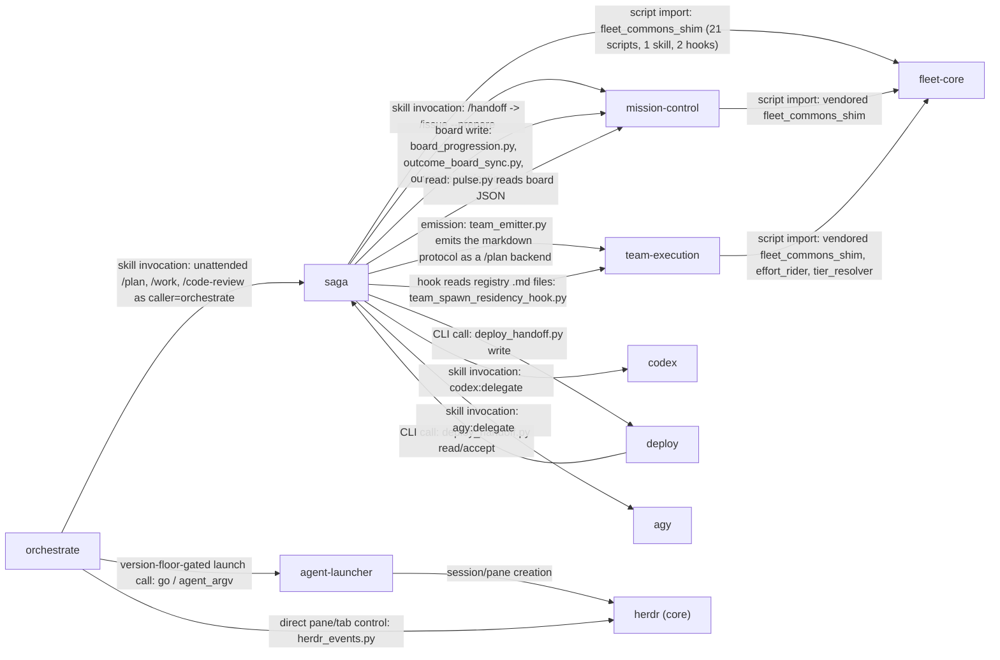

# Plugin census for saga simplification

Read-only inventory of `plugins/saga` and the plugins it leans on (`fleet-core`, `team-execution`,
`orchestrate`, `agent-launcher`, `mission-control`), gathered to support a decision about what to
cut, keep, or rewrite. Every count below comes from `find`/`wc`/`grep` run directly against the
repository at commit `fb69f6b3` on 2026-09-19; nothing here is estimated. Where a judgment call is
required (Section 6's "would worktree-per-unit remove this" column, Section 3's
GUIDANCE/PROTECTION split), it is marked as a reading, not a measurement.

## 1. Saga weight map

Saga's pre-measured total (91,064 lines) covers every `.md`/`.py`/`.json` file under
`plugins/saga` excluding `__pycache__` — there are no `.sh` files. Confirmed by direct
recount. The eight categories below are mutually exclusive and sum to exactly 91,064:

| Category | Lines | % |
|---|---:|---:|
| Scripts, excluding tests (105 `.py` files directly in `scripts/`; none are tests — saga's tests all live in the repo-root `tests/`) | 61,856 | 67.9% |
| Skill references (35 files under `skills/*/references/`, plus 48 `.md` files under the top-level `references/` — rubrics, engine-dispatch notes, sandbox-spawn-sites, etc.) | 11,256 | 12.4% |
| Skill prose (22 `SKILL.md` files) | 7,621 | 8.4% |
| Docs (`docs/*.md`, plus plugin-root `README.md` and `CHANGELOG.md`) | 5,877 | 6.5% |
| Hooks (`hooks/*.py` x10 + `hooks.json`) | 2,077 | 2.3% |
| JSON/config (`plugin.json`, `scripts/gate_absence_baseline.json`, `references/bridge-signatures.json`, `references/lens-roster.json`) | 1,440 | 1.6% |
| Command files (24 files under `commands/`) | 638 | 0.7% |
| Agent definitions (`agents/mechanical-executor.md`, `agents/readonly-verifier.md`) | 299 | 0.3% |
| Tests physically inside `plugins/saga` | 0 | 0.0% |
| **Total** | **91,064** | **100%** |

Two things this table doesn't show because they fall outside the `.md`/`.py`/`.json` filter the
91,064 figure uses: saga also carries 1,659 lines of YAML config (6 files: `engine-registry.yaml`,
`effort-policy.yaml`, `model-releases.yaml`, `benchmark-suite.yaml`, `plan-save-contract.yaml`,
`docs/model/saga-docs-model.yaml`), and four SVG diagrams under `docs/assets/`.

**The test suite that targets saga is larger than saga itself.** Saga has zero test files inside
its own plugin directory; every test lives in the repo-root `tests/`. Filtering that directory for
files that construct a path through `plugins/saga/{scripts,hooks,skills,commands,agents}` (the
`_load()` pattern every saga test uses, e.g. `tests/test_closure_gate.py:21-22`) finds 177 files
totaling 95,334 lines — more than the entire saga plugin (91,064 lines). A looser match (any file
that mentions "saga" at all) reaches 192 files and 103,928 lines. For scale: the repo-root
`tests/` directory holds 270 test files and 138,761 lines total, so saga-related tests are roughly
71% of all test files and 75% of all test lines in the repository.

## 2. Saga command inventory

Every command file in `plugins/saga/commands/` is a thin wrapper: its whole job is
`Load saga/skills/<name>/SKILL.md` plus a short restatement of purpose and boundary. `/engines` is
the one exception — it calls `scripts/engine_registry_cli.py` directly with no `SKILL.md` at all.

| Command | Skill (SKILL.md / refs lines) | Purpose | Names as "next" | Scripts it calls |
|---|---|---|---|---|
| `/brainstorm` | brainstorm (457/187) | Deep-dive one idea into a requirements doc | `/plan` | `saga.py` |
| `/ceo-review` | founder-review (alias) | Same engine as `/founder-review` | `/plan` | — |
| `/code-review` | code-review (581/557) | Pre-PR quality gate; hands findings back, never fixes | operator decides | `evidence_ledger.py`, `manifest_reader.py`, `review_consensus.py`, `saga.py` |
| `/doc-review` | doc-review (245/0) | Reviews a plan/requirements doc for readiness, applies safe fixes only | `/work` (recommended) | `lifecycle_review.py` |
| `/engines` | none (direct script) | Inspect/pin/deprecate external-engine routing, dry-run only | — | `engine_registry_cli.py` |
| `/fleet-doctor` | fleet-doctor (57/0) | Read-only cross-source audit for leaked resources / unledgered spawns | operator (never repairs) | `fleet_doctor.py` |
| `/founder-review` | founder-review (260/379) | Challenges scope/ambition; captures a decision, never implements | `/plan` | — |
| `/handoff` | handoff (111/0) | Builds a handoff envelope and routes into mission-control's issue prep | `/issue --prepare` (mission-control) | `deploy_handoff.py`, `handoff_envelope.py` |
| `/ideate` | ideate (575/432) | Multi-agent divergent-convergent idea generation | `/brainstorm` | — |
| `/investigate` | investigate (373/403) | Root-cause debugging under the causal-chain gate | `/work` (real fixes), `/handoff` (defects) | `saga.py` |
| `/loop` | loop (400/312) | Router/resume substrate; dispatches to the one next command | dispatch table (15 routable commands) | `handoff_envelope.py`, `lifecycle_state.py`, `load_saga_context.py`, `parse_issue.py`, `reconcile_controller.py`, `saga.py`, `status_card.py` |
| `/office-hours` | office-hours (234/307) | Frame-finding front door; hard-gated against implementing | `/ideate`, `/brainstorm`, `/plan`, `/strategy` | — |
| `/optimize` | optimize (260/387) | Metric-driven experiment loop | `/work` (winning change) | `outcome_costs.py`, `override_rate_reader.py` |
| `/outcome` | outcome (292/0) | Coordinates a DAG of leaf sagas; routes and dispatches, never executes | native leaf commands (`/resume`, `/work`, `/qa`) | `intent_envelope.py`, `outcome.py`, `spec_table.py`, `status_card.py` |
| `/plan` | plan (718/416) | Interrogates HOW; writes a durable plan + plan saga | `/doc-review`, then `/work` | `effort_ledger.py`, `execution_spec.py`, `parse_issue.py`, `plan_pre_answers.py`, `plan_save_contract.py`, `reconcile_controller.py`, `saga.py`, `spend_estimate.py`, `tier_defaults.py` |
| `/promote` | promote (148/199) | Scans repo journals for cross-repo lessons; propose-diff-and-wait into context-library | — | `promote_scan.py` |
| `/pulse` | pulse (66/49) | Read-only live fleet telemetry | — | `pulse.py` |
| `/qa` | qa (409/325) | Acceptance-evidence gate; ship/no-ship verdict | `/handoff` or `/retro` (pass); `/work` (fail, pre-merge) | `evidence_ledger.py`, `issue_progress.py`, `manifest_reader.py`, `qa_health_score.py`, `saga.py`, `status_card.py` |
| `/resume` | resume (379/207) | Heavy forensic reconstruction, then routes | `/work` or `/handoff` (never back to `/loop`) | `artifact_pointer.py`, `discover_sessions.py`, `extract_session_skeleton.py`, `load_saga_context.py`, `saga.py`, `status_card.py` |
| `/retro` | retro (528/385) | Terminal meta-improvement pass; journal capture + gated self-edit | — (never blocks `/loop`) | `capability_elo.py`, `engine_benchmark.py`, `engine_calibration.py`, `engine_stale_report.py`, `evidence_ledger.py`, `gate_divergence_reader.py`, `manifest_reader.py`, `outcome_costs.py`, `override_rate_reader.py`, `provider_control_chart.py`, `saga.py`, `spend_retro.py`, `tier_efficacy.py` |
| `/spec` | spec (176/232) | Interrogates a vague ask into a precise WHAT | operator (onward, no issue filing) | `lifecycle_review.py` |
| `/strategy` | strategy (152/249) | Interview-driven root `STRATEGY.md` maintenance | — | — |
| `/tier` | none listed (command-only, 63 lines) | Sets a run-scoped model/effort ceiling or mid-run patch | — | `tier_session.py`, `execution_spec.py`, `spec_table.py` |
| `/work` | work (1,121/534) | Executes a plan to PR-ready; owns the round-N PR loop | `/qa` (advisory, after merge) | `artifact_pointer.py`, `dispatch_settlement.py`, `execution_spec.py`, `intent_envelope.py`, `issue_progress.py`, `lifecycle_state.py`, `parse_issue.py`, `reconcile_controller.py`, `saga.py`, `ship_ceremony.py`, `spec_table.py`, `status_card.py` |

**Is plan -> doc-review -> work -> code-review -> qa -> handoff automatic or operator-invoked?**
Mostly operator-invoked, with exactly one documented exception.

- `/plan` does not call `/doc-review` itself — it stops and recommends: *"When the plan is
  written, `/plan` recommends `/doc-review` (the review phase) before `/work`"*
  (`skills/plan/SKILL.md:27-28`), and again at line 708: *"`/doc-review` (recommended next)."*
- `/doc-review` does not call `/work`. Instead, `/work` itself checks: *"`/doc-review` is explicit
  by default. `/work` should ask whether to run it before executing"* and *"If `/doc-review` runs
  and unresolved `P0` or `P1` findings remain, `/work` blocks unless the user explicitly
  overrides"* (`skills/doc-review/SKILL.md:213-217`).
- `/work` **does** call `/code-review` automatically, in the same turn, with no operator action:
  *"For its own pre-PR gate, `/work` calls `/code-review` programmatically and reads the returned
  envelope directly"* (`skills/work/SKILL.md:18-19`; the actual call site is documented at
  `skills/work/SKILL.md:994-996`). There is no harness-level "call another slash command" tool in
  use — no occurrence of a `SlashCommand`-style tool exists anywhere in saga's skills or
  references — so this "programmatic call" means `/work`'s own instructions tell the model to also
  run `/code-review`'s logic inline, in report-only mode, rather than stopping and asking the
  operator to type `/code-review` next.
- `/work` does not call `/qa`. It stops after merge: *"`/qa` answers: 'Does the shipped thing
  actually work?' (`/work` routes here **advisorily** after merge)"* (`skills/work/SKILL.md:30`).
- `/qa` does not call `/handoff` or `/retro`. Its own section heading says so: *"6. **Route, don't
  execute.** PASS routes to `/handoff` or `/retro`"* (`skills/qa/SKILL.md:73`).
- The one place true automatic chaining exists is `/loop`'s own "Drive" mode, a separate top-level
  command the operator must choose to invoke: *"route -> dispatched-command-runs -> tick -> next,
  pausing at every hard gate and handoff"* (`skills/loop/SKILL.md:147`). Running `/plan` directly
  does not get this; the operator has to run `/loop` and pick Drive mode for the chain to advance
  without retyping each command.

## 3. Refusals and gates inside saga skills

Grepped all 22 `SKILL.md` files plus their `references/` for `refuse`, `MUST` (case-sensitive —
lowercase "must" is used constantly as ordinary description and was excluded), `must not`,
`block(ed/ing/s)`, `gate(d/s/way)`, `do not proceed`, `halt(s/ed/ing)`, `abort(s/ed/ing)`,
`forbidden`, and `never`, then de-duplicated to distinct matching lines per skill.

| Skill | Hard-stop lines | Skill | Hard-stop lines |
|---|---:|---|---:|
| work | 228 | office-hours | 35 |
| retro | 117 | promote | 35 |
| plan | 111 | ideate | 63 |
| code-review | 108 | outcome | 63 |
| loop | 90 | optimize | 62 |
| investigate | 83 | resume | 58 |
| qa | 77 | brainstorm | 53 |
| founder-review | 35 | spec | 27 |
| doc-review | 20 | strategy | 9 |
| fleet-doctor | 9 | delegation-audit | 8 |
| pulse | 7 | handoff | 13 |
| — | — | **Total (22 skills)** | **1,311** |

**Five most consequential gates, in plain words:**

1. **No fix without proof.** `/investigate` will not let a fix be proposed until the model can
   state the complete chain from trigger to symptom with no unexplained jumps — "the IRON LAW"
   (`skills/investigate/SKILL.md:48-49`).
2. **No spec before interrogation.** `/spec` is not allowed to write a specification document
   after its first reply; it must keep asking clarifying questions first
   (`skills/spec/SKILL.md:46`).
3. **No building from an office-hours session.** `/office-hours` may never implement code, write a
   plan, scaffold a project, or file a tracking issue — its only output is a chosen frame and a
   route to a different command (`skills/office-hours/SKILL.md:47`).
4. **Plan review can stop execution.** If `/doc-review` finds unresolved top-severity (P0) or
   second-severity (P1) problems in a plan, `/work` refuses to start building until the operator
   explicitly overrides that block (`skills/doc-review/SKILL.md:216-217`).
5. **The journal can only grow on its own.** `/retro` may automatically add a brand-new entry to
   the engineering journal, but any change that deletes, edits, or moves existing journal text,
   the auto-memory file, or the lifecycle skill files themselves must be shown to the operator as a
   proposed difference and wait for an explicit decision (`skills/retro/SKILL.md:54-55,86`).

**Classification — mostly GUIDANCE (shapes how the model does the step) vs mostly PROTECTION
(stops the model from doing something):**

| Skill | Class | Why |
|---|---|---|
| brainstorm | GUIDANCE | Pressure-tests one idea; boundaries are about scope, not stopping the model |
| code-review | PROTECTION | Self-described "gate, not a fixer"; never mutates reviewed code |
| delegation-audit | PROTECTION | Exists solely to catch a faked delegation claim |
| doc-review | PROTECTION | Its P0/P1 finding is what blocks `/work` |
| fleet-doctor | PROTECTION | Entire purpose is refusing to repair anything it finds |
| founder-review | GUIDANCE | Socratic scope challenge; captures a decision, never blocks |
| handoff | GUIDANCE | Thin envelope-builder with no refusal logic of its own |
| ideate | GUIDANCE | Divergent-convergent generation; critique is generative |
| investigate | PROTECTION | The causal-chain "iron law" blocks any fix pre-root-cause |
| loop | GUIDANCE | Mostly about picking the right next command; carries one hard gate |
| office-hours | PROTECTION | Absolute hard gate against implementing anything |
| optimize | PROTECTION | Hard gate on spec/scope plus mandatory gates before any LLM judgment |
| outcome | GUIDANCE | Coordinates and routes; structurally cannot execute leaf work itself |
| plan | GUIDANCE | Interrogates and writes; ends in a recommendation, not a block |
| promote | PROTECTION | Manual, gated, propose-diff-and-wait before writing the shared journal |
| pulse | GUIDANCE | Pure read-only telemetry rendering |
| qa | PROTECTION | Self-described "gate-only"; produces a ship/no-ship verdict |
| resume | GUIDANCE | Reconstructs what happened; boundaries protect its own read-only scope |
| retro | PROTECTION | The self-edit gate is the load-bearing mechanism |
| spec | PROTECTION | Hard gate against writing a spec before interrogation completes |
| strategy | GUIDANCE | Interview-driven recording; no blocking behavior |
| work | PROTECTION | Heaviest gate in saga: review gate, risk-gated tests, confirmed-only merge |

## 4. Hooks

`plugins/saga/hooks/hooks.json` wires 13 registrations across 7 harness events, covering 10 Python
hook files plus one direct script call. 4 of the 10 hook scripts can hard-block (exit code 2); the
other 6 are advisory or best-effort only, always exiting 0.

| Hook (event) | Enforces / nudges | Blocks? | Prevents |
|---|---|---|---|
| `stale_main_session_hook.py` (SessionStart) | Warns or auto-fast-forwards a local default branch left behind by a squash-merge | No | Building on a stale local main after an upstream squash-merge |
| `compact_spore_session_hook.py` (SessionStart, on compact) | Re-injects the frozen saga summary after auto-compaction | No | Losing saga context across compaction |
| `scripts/ship_teardown.py reclaim` (SessionStart, direct script — not one of the 10 hook files) | Best-effort reclaim of worktrees/branches idle 24h+ | Mutates, but bounded; not a gate | Leaked worktrees/branches from abandoned sessions |
| `team_teardown_hook.py` (SessionStart + SessionEnd) | Records a teardown intent at end; recovers runs whose worktree already vanished at start | No | A team-execution run "open" forever after its worktree is gone |
| `precompact_spore_hook.py` (PreCompact) | Freezes the saga into a structured spore under a 1.5s deadline | No | Same context loss, pre-emptively |
| `validate_json_hook.py` (PreToolUse: Edit/Write/MultiEdit) | Parses `marketplace.json`/`plugin.json` before the write lands | **Yes — exit 2** | Committing a syntactically broken plugin manifest |
| `pre_push_gate_hook.py` (PreToolUse: Bash, `git push`) | Runs every step in the repo's one gate manifest | **Yes — exit 2** | Pushing code that fails the repo's own gate |
| `team_spawn_residency_hook.py` (PreToolUse: Agent/Task) | Warns when a reviewer/tester is spawned without the named-persistent "resident teammate" shape | No | Losing the residency/reuse contract |
| `delegation_tripwire_hook.py` (PreToolUse: Write/Edit/MultiEdit/NotebookEdit) | Blocks file edits while a delegation is marked armed with no proof a real external run started | **Yes — exit 2** | The model quietly doing delegated work itself instead of dispatching it |
| `delegation_stop_audit_hook.py` (Stop + SubagentStop) | Classifies the transcript at turn-end to confirm a claimed delegation really happened | **Yes — exit 2** (one-time forced-continuation loop guard) | A fabricated delegation claim going unnoticed |
| `journal_nudge_hook.py` (PostToolUse: Bash, `git commit`) | Nudges on stderr when a feat/fix commit has no journal entry | No | Silently skipping the engineering-journal convention |

**fleet-core has zero hooks** — no `hooks.json`, no hook files; confirmed by a full file-tree
listing. Its README says plainly: "no skills, commands, agents, or hooks."

**team-execution has zero hooks** — same confirmation. Whatever enforcement it does runs through
spawned validator agents and its own `SKILL.md` orchestration logic, never through the Claude Code
hook system; the only hook that touches team-execution at all is saga's own
`team_spawn_residency_hook.py`, reaching in from the outside to read team-execution's registries.

## 5. Scripts grouped by concern

All 105 scripts (61,856 lines) assigned to exactly one group:

| Group (files) | Lines | % | What it does | Called by |
|---|---:|---:|---|---|
| Engine registry/dispatch/bridge/calibration/promotion (20) | 11,288 | 18.2% | Maintains the catalogue of external AI engines (codex, agy, ollama-cloud, deepseek) saga can route work to; resolves which engine serves a capability and dispatches through one generic HTTP bridge; scores, calibrates, and promotes/demotes engines from real run outcomes. | `/retro` (benchmark, calibration, staleness, Elo, control-chart), `/engines` (registry-cli, direct), `/code-review`/`/doc-review` (second-opinion dispatch) |
| Concurrency/governor/leases/envelopes/hazards (16) | 11,267 | 18.2% | Bounds parallel wave width; gates risky autonomous writes behind a reversibility check; runs and can undo the multi-step "ship ceremony" (commit, PR, merge, branch-delete) with a hazard preflight and a reality-checked teardown. | `/work` (ship ceremony, envelopes), `/outcome`/`/loop` (reconcile controller), the team-teardown hook |
| Outcome coordinator — DAG of leaf sagas (16) | 11,142 | 18.0% | Runs a whole multi-part initiative as a graph of smaller sagas across worktrees and machines; dispatches each ready leaf to its backend and reconstructs status by re-reading the committed spec plus GitHub, never a cached field. | `/outcome` exclusively |
| Anything else — plan/lifecycle/utility/doc helpers (17) | 9,654 | 15.6% | `saga.py` (the unified state engine every phase-owning skill restores/saves through) plus small single-purpose helpers: status-glyph rendering, lifecycle-phase classification, issue-body parsing, plan-document conformance, journal-lesson scanning, doc-visual rendering, and the fleet-core resolution shim. | Nearly every skill |
| Ledgers and evidence (9) | 5,458 | 8.8% | Three append-only records — the run-fact ledger, the evidence-custody ledger, the dispatch-settlement ledger — plus manifest/provenance readers and two "how often did the operator just rubber-stamp this" readers. | `/code-review`, `/qa`, `/retro`, `/work`, `/plan` |
| Closure and completeness gates (5) | 3,956 | 6.4% | Decides from committed evidence, not a self-report, whether a leaf is really done and whether a deliverable has an omission; scores code-review's multiple lenses into one verdict; computes QA's deterministic health score. | `/outcome`, `/qa`, `/code-review` |
| Execution spec and workflow emission (3) | 3,827 | 6.2% | The one structured plan format `/plan` authors, emitting either a runnable Claude Code Workflow script or the team-execution markdown protocol from the same source, plus the operator-facing approval-table renderer. | `/plan`, `/work`, `/tier` |
| Board progression and deploy handoff (7) | 2,728 | 4.4% | Writes to the mission-control board under a reversibility check; detects the repo's deploy strategy; hands a merged saga to the deploy plugin with an acknowledgment token. | `/outcome`, `/work`, `/loop` |
| Spend/budget (4) | 1,011 | 1.6% | Estimates spend before a run, prices the tier actually used after, rolls up spend-vs-outcome across runs. | `/plan`, `/retro` |
| Spores and session re-grounding (4) | 909 | 1.5% | Freezes/restores a structured saga summary across auto-compaction; discovers and extracts prior session files for `/resume`'s fallback path. | `/loop`, `/resume`, `/plan` |
| Tier resolution (3) | 536 | 0.9% | Resolves and persists which model/effort a unit runs at; mines completed-run history for evidence-based defaults. | `/plan`, `/work`, `/retro`, `/tier` |
| Delegation audit (1) | 80 | 0.1% | Reconciles the durable delegation-audit store into one verdict per run. | `/delegation-audit` |

The three largest groups (engine routing, concurrency/hazards, outcome coordination) are each
about 11,100-11,300 lines and together are 54.4% of all saga script code.

## 6. The protections catalogue

Twelve of the most substantial mechanisms that exist to prevent races, double dispatch, lease
conflicts, stale sessions, worktree leaks, delegation-integrity failures, evidence-integrity
failures, or unauthorized board writes. The last column is my own reading of whether a
worktree-per-unit + branch + merge model removes the need for it — marked as such, not measured.

| Mechanism | Guards against | Where (`file:line`) | Lines | Worktree-per-unit makes it unnecessary? |
|---|---|---|---:|---|
| `wave_file_conflicts()` | Two Task-tool units sharing ONE working tree silently overwriting the same file | `scripts/execution_spec.py:1605` | part of 3,827 | **Reading: yes.** Docstring says "concurrent agents share one working tree" — per-unit worktrees remove the shared-tree precondition entirely; only an ordinary merge conflict remains, which git already surfaces. |
| `concurrency_governor.py` | Launching more parallel agents than the operator's concurrency ceiling | `scripts/concurrency_governor.py` | 348 | **Reading: partially.** Removes the file-collision motive, but a separate rate-limit/cost motive for capping width is independent of tree isolation. |
| Fleet lease broker (**already deleted**) | Two dispatches claiming the same scarce resource at once | `plugins/fleet-core/CHANGELOG.md:80` | was 4,731 (+1,578 orphan-evidence, +3,894 tests) | **Already moot.** Deleted whole in campaign #677 unit U7 (issue #684) and replaced by the lighter `wave_file_conflicts()` static check — the fleet already did this simplification once. |
| `test_no_lease_broker_readd.py` | A future change silently reintroducing the deleted broker via a vendored shim copy | `tests/test_no_lease_broker_readd.py` | 173 | Reading: stays cheap and useful regardless of the concurrency model chosen. |
| `delegation_tripwire_hook.py` + `delegation_stop_audit_hook.py` | The model claiming it delegated to an external engine (agy/codex) when it did the work itself | `plugins/saga/hooks/delegation_tripwire_hook.py`, `delegation_stop_audit_hook.py` | 154 + 206 | **Reading: no.** This is about truthful attribution of who did the work, orthogonal to file/tree isolation. |
| Ship ceremony family (`ship_ceremony.py`, `ceremony_hazards.py`, `ship_receipt.py`, `ship_teardown.py`, `ship_undo.py`) | A merge ceremony dying mid-sequence with no record of what was opened/closed, and no rollback | `plugins/saga/scripts/ship_ceremony.py` (issue #345) | 1,714+372+291+1,003+660 = 4,040 | **Reading: partially.** `orchestrate`'s own worktree-per-unit model already collapses most of this into plain `git worktree add`/merge/`remove`; this heavier layer exists because `/work` runs ceremony steps as loose git commands inside one long-lived shared session. |
| Envelope family (`adjustment_envelope.py`, `envelope_token.py`, `handoff_envelope.py`, `intent_envelope.py`) | An operator's run-start posture or mid-run adjustment being ignored or forged; an unauthorized merge | `scripts/envelope_token.py` ("the revocable merge-authorization credential") | 540+825+871+260 = 2,496 | **Reading: no.** An authorization/consent record; orthogonal to tree layout. |
| `outcome_worktrees.py` | Two concurrent sub-outcomes colliding on one working tree | `scripts/outcome_worktrees.py:2-8` | 729 | **This module already IS a worktree-per-unit model** — just scoped to nested sub-outcomes, not plain leaves, which today "run in the ambient outcome worktree" per its own docstring. Broadening that scope is close to exactly what's being asked for. |
| `run_ledger.py` | Undetected tampering or silent truncation of realized-run telemetry | `scripts/run_ledger.py` | 416 | Reading: no — a ledger-integrity problem is independent of tree isolation. |
| `reversibility_certificate.py` | An autonomous write (board write, merge) happening when it can't be safely reversed | `scripts/reversibility_certificate.py` | 580 | Reading: no — reversibility is a property of the action, not of tree isolation. |
| `board_progression.py` | The model writing to the mission-control board twice, or without authorization | `scripts/board_progression.py` | 864 | Reading: no. |
| `team_spawn_residency_hook.py` | A team-execution reviewer/tester spawned anonymously instead of as a named, reusable resident | `plugins/saga/hooks/team_spawn_residency_hook.py` | 300 | Reading: no — orthogonal to file isolation. |

## 7. team-execution

**Spawn primitive:** the Agent tool, not a distinct "Claude Code teams" primitive and not a
Workflow by default. `skills/team-execution/SKILL.md:386` directs: "Spawn exactly one named,
persistent teammate per resident worker (segment) using an Agent with a specific `name` ... and
`run_in_background` enabled" — reused across units via `SendMessage` rather than re-spawned
(line 387). Two alternate spawn kinds exist for the same roster: `workflow` (a Claude Code
Workflow) and `external-engine` (agy/codex delegation), both routed through the same effort-rider
seam so tier injection doesn't double up.

**Roster (25 agent files, `plugins/team-execution/agents/`):**

| Category | Count | Trigger | Members |
|---|---:|---|---|
| Base reviewers (always spawned) | 3 | Every plan execution | architecture-reviewer, devils-advocate-reviewer, security-reviewer |
| Optional reviewers | 7 | Plan content matches a keyword set | ai-usefulness-reviewer, api-reviewer, clarity-reviewer, code-quality-reviewer, infra-reviewer, privacy-reviewer, testing-reviewer |
| Scanners (validators) | 4 | Task context ("do not spawn the full validator roster by default," `SKILL.md:38`) | api-compat-scanner, dependency-scanner, iac-cost-scanner, security-scanner |
| Testers (validators) | 8 | Task context | api-contract-tester, concurrency-tester, event-flow-tester, performance-tester, scenario-tester, sdk-regression-tester, smoke-tester, ui-regression-tester |
| Monitors (validators) | 2 | Task context, post-dispatch | github-actions-monitor, runtime-monitor |
| Operational | 1 | Allowed nonprod/publish-nonprod workflows only, after every required gate passes | deploy-watcher |

**Content vs. glue (8,877 lines total, matches the pre-measured figure exactly):**

| | Lines | % | What's in it |
|---|---:|---:|---|
| Pure role content (reusable as a standalone session prompt) | 2,570 | 29.0% | 25 `agents/*.md` files (2,456 lines) + the two shared checklists `review-criteria.md` (27) and `validator-criteria.md` (87) |
| Structural glue (spawning, ordering, gating, aggregation) | 5,322 | 60.0% | `skills/team-execution/SKILL.md` (637) + 12 other reference files — registries, consensus protocol, spawn quirks, liveness protocol, teardown-reclamation, worker manifest, andon-cord (1,804) + 6 scripts — artifact pointer, consensus advisory, dispatch-settlement adapter, liveness protocol, posture check, fleet-commons shim (2,832) + `commands/team-execute.md` (49) |
| Other (a separate optional skill, README, CHANGELOG, plugin.json) | 985 | 11.1% | `skills/appsec-audit/SKILL.md` (70, itself pure content) + README (206) + CHANGELOG (687) + plugin.json (22) |

Roughly two-thirds of team-execution by line count is the spawning/ordering/aggregation machine,
not the reviewer content itself — consistent with the operator's plan to keep the role prompts
(now runnable as standalone `herdr` terminal-session prompts) and discard the surrounding harness.

## 8. orchestrate and agent-launcher

**orchestrate** (19,957 lines: `skills/orchestrate/SKILL.md` 573, `scripts/orchestrate.py` 6,450,
`scripts/herdr_events.py` 133, `commands/orchestrate.md` 538, plus README/CHANGELOG/tests) plans
work as a set of units across `herdr` agent sessions and runs it. Its own docstring: "creates a
worktree and branch per unit, launches the requested agent there, sends the unit's saga command,
waits, merges the branches back, and cleans up" (`scripts/orchestrate.py:2-6`) — this is already
the worktree-per-unit + branch + merge model the operator wants, running today, not hypothetical.
It drives `herdr` panes directly (`herdr_events.py`) and launches every session through the
`agent-launcher` plugin's `go` command, never by calling the underlying `agents` wrapper itself
(`skills/orchestrate/SKILL.md:78-79`: "must launch only through `go` via the shared `agent-launcher`
plugin... Never create worktrees manually or invoke `agents` directly"). It relates to saga by
spawning `herdr` sessions that run `/plan`, `/work`, and `/code-review` as an unattended caller
named `"orchestrate"` — saga's own `plan_pre_answers.py:10` and `review_consensus.py:110,296`
recognize `"orchestrate"` as a distinct caller identity alongside `"operator"` and `"caller"`, and
`skills/work/SKILL.md:292` adapts its blocking behavior when it detects it is running under
`/orchestrate`. Protective machinery: a `Run` state record (`scripts/orchestrate.py:416`), landing
functions (`landing_merge`, `landing_merges`, `landed`, `landed_by_merge`), a `redrive` subcommand
to retry a failed unit, `reserved_landing_paths` to stop two units from claiming the same merge
target, and `record_branch_advance`/`record_writeback_outcome` receipts. Orchestrate also declares
a minimum required version of `agent-launcher` ("its Agent Launcher floor") and refuses the seven
mutating subcommands (`start`, `expand`, `go`, `review-result`, `land`, `clean`, `redrive`) if the
installed companion is below that floor or missing.

**agent-launcher** (small: `SKILL.md` 239, `composer.py` 440, `launcher.py` 2,182, plus
README/CHANGELOG) creates named coding-agent sessions — Claude, Codex, Grok, Muse, OpenCode, Qwen,
Agy, or Hermes — as tabs, panes, crews, or fleet layouts inside `herdr`, taking model, provider,
permissions, working directory, and machine routing as arguments. It drives `herdr` exclusively
(`launcher.py` references `herdr`/`herdr_workspace` in over a dozen places) and has only one, minor
reference to saga. It is orchestrate's session-creation dependency, not a saga dependency in its
own right; its main "protective machinery" relative to this census is the version floor orchestrate
checks against it, not anything it enforces on its own side.

## 9. fleet-core

What remains after the lease-broker deletion is a pure scripts-only library — "no skills,
commands, agents, or hooks" (README.md) — of 14 stdlib-only Python modules plus 3 JSON data files
under `scripts/fleet_commons/` (4,738 lines total), the canonical `fleet_commons_shim.py`
(169 lines) sibling plugins vendor byte-identically, and two reference docs
(`effort-convention.md` 91, `tier-palette.md` 74). The modules: `audit_store.py` (delegation audit
persistence), `bridge_receipt.py` (proof-of-execution contract), `concurrency_policy.py` (shared
admission limits), `cost_weights.py`, `delegation_audit.py`, `delegation_state.py`,
`effort_rider.py`, `intent_envelope.py` (canonical schema), `liveness_engine.py`,
`output_attestation.py`, `plugin_resolution.py`, `render_tier_table.py`, `retry_backoff.py`,
`tier_palette.py`, `tier_resolver.py`. The deleted lease broker
(`scripts/fleet_commons/lease_broker.py`, 4,731 lines) and its orphan-evidence companion
(1,578 lines), plus their two test suites (2,709 + 1,185 lines) — 10,203 lines total — were removed
whole in campaign #677 unit U7 (issue #684); `fleet-core/CHANGELOG.md:80` records "no
shim-resurrected broker survives." One stale trace remains: `concurrency_policy.py:5` still reads
"the lease broker records and enforces after resolution" in present tense, describing a component
that no longer exists in this plugin.

**Saga call sites** (24 total): 21 scripts import `fleet_commons_shim` or a `fleet_commons.*`
module (`board_progression.py`, `bridge_signatures.py`, `concurrency_governor.py`,
`delegation_audit_query.py`, `engine_bridge_http.py`, `engine_dispatch.py`, `execution_spec.py`,
`fleet_commons_shim.py` itself, `intent_envelope.py`, `lifecycle_state.py`, `liveness_events.py`,
`outcome_liveness.py`, `outcome_spec.py`, `plan_save_contract.py`, `plan_save_proof.py`,
`reconcile.py`, `spend_authority.py`, `spend_estimate.py`, `team_emitter.py`, `tier_defaults.py`,
`tier_session.py`), one skill (`skills/plan/SKILL.md`), and two hooks
(`delegation_stop_audit_hook.py`, `delegation_tripwire_hook.py`). The same shim is also vendored
byte-identically into `mission-control` (`scripts/fleet_commons_shim.py`, plus
`sdlc_manager.py`/`executor_profile_lint.py`/`skills/issues/SKILL.md` importing from it) and into
`team-execution` (`skills/team-execution/scripts/fleet_commons_shim.py`).

## 10. Cross-plugin dependency map

## 11. Documentation drift

Three files carry three different vocabularies for the same boards, and they disagree with each
other in a specific, checkable way.

- **`plugins/mission-control/config/sdlc-schema.json`** (2,443 lines, last touched 2026-09-13) is
  the actively-maintained schema and documents its own migration history inline. As of its
  2026-08-29 entry, all three active boards (`operations`, `asgard`, `campps`) share one
  `workflows.stage_flow` with six Stage columns — Intake, Shaping, Planning, Active, Verify,
  Retro — and 26 distinct per-stage Status values (line 147 lists them:  Capturing, Needs
  clarification, Triage, Backlog, Discovering, Defining requirements, Ready for Planning,
  Designing, Design review, Execution planning, Ready for Active, Implementing, Integrating, Code
  review, Repairing, Ready to merge, Deploying to non-production, Awaiting verification,
  Verifying, Verification failed, Closeout, Ready to close, Gathering evidence, Awaiting operator
  input, Capturing learnings, plus the cross-cutting Blocked). Line 170 confirms `campps`'s field
  list includes `"Stage"`. The older `workflows.intent_flow` (Idea/Shaping/Ready/Active/Verify/Done)
  is recorded as `canonical_for: []` — canonical for no board any more.
- **`plugins/mission-control/skills/board/references/kanban-workflow.md`** (the prose reference
  skills actually read) correctly documents the current CAMPPS `stage_flow` vocabulary in its
  "CAMPPS" section, matching sdlc-schema.json exactly. But its "Operations And Asgard" section
  still shows `Idea -> Shaping -> Ready -> Active -> Verify -> Done` — the retired `intent_flow` —
  and says so itself: "the Operations and Asgard section above still shows the retired `intent_flow`
  names; correcting them is tracked as a separate change and is not done here." The file is aware
  of its own staleness for two of three boards and has not yet been fixed.
- **`plugins/mission-control/config/board-schema.json`** (591 lines, a cached snapshot of GitHub's
  live field/option IDs, last touched 2026-07-14 — before either the 2026-08-16 or 2026-08-29
  migration recorded in sdlc-schema.json) is the stalest of the three. Its Operations and Asgard
  "Status" field options are `Active, Done, Idea, Ready, Shaping, Verify` — the old six-value
  `intent_flow`, matching kanban-workflow.md's admittedly-stale section. Its CAMPPS "Status" field
  is a flat three-value `Done, In Progress, Todo` with **no "Stage" field present at all** —
  predating even the 2026-08-16 migration onto `intent_flow`, let alone the 2026-08-29 move to
  `stage_flow`. A consumer that trusts `board-schema.json` for CAMPPS today would look for a
  "Stage" field that isn't there.
