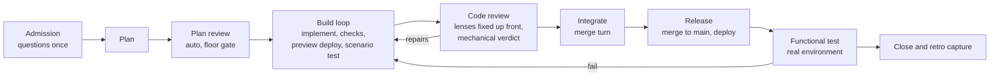
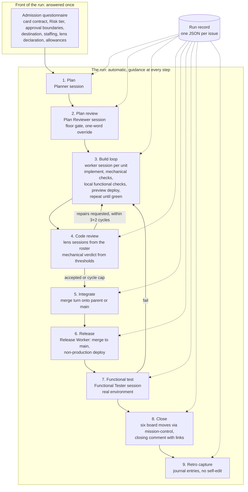
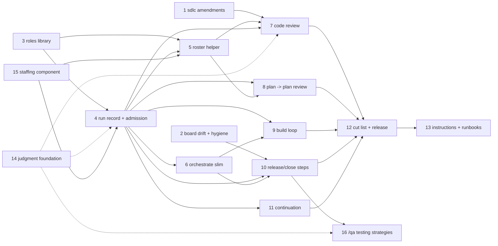

# Saga simplification review: automate the lifecycle, subtract the machinery

Date: 2026-09-19. Status: analysis for planning; nothing has been changed. Repository: `infiquetra-claude-plugins` at commit `fb69f6b3` (saga 0.159.0, team-execution 3.1.1, orchestrate 4.5.0, fleet-core 0.25.3, mission-control 2.16.0, agent-launcher 1.5.2). Source of truth for the lifecycle: `infiquetra-sdlc` at commit `67845cdd` on `main`, fetched clean today. Operating record: `infiquetra-agent-operations` at `origin/main` plus its 24 uncommitted working-tree files, read but untouched. Research inputs, including four subagent briefs, a typed-judgment triage of the open board cards, and the live herdr roster, are in `docs/analysis/2026-09-19-saga-simplification-inputs/`.

## 0. Summary

**The saga plugin family enforces a lifecycle that the source of truth does not require and the operator does not run.** The lifecycle documentation in `infiquetra-sdlc` is lighter than the plugins in every dimension this review checked: it names five gates and a floor of five, no lock service, no global concurrency cap, no work-in-progress limit, no machine validation of handoff contracts (by decision), and it marks its own run model as "not implemented anywhere yet." The operator's daily record shows a herdr roster of named role sessions across seven agent kinds, four saga commands in live use (`/plan`, `/doc-review`, `/work`, `/code-review`), a hand-rendered sixty-line coordinator prompt doing the chaining that the plugin should do, and a standing rule that "subtraction is a legitimate outcome." Meanwhile saga carries 91,064 lines, 68 percent of them scripts, of which more than half belong to three subsystems (external-engine routing, concurrency and ceremony protections, and the outcome coordinator) that the daily record never invokes; 1,311 lines in its skills are hard stops; and its main chain still ends each step by recommending the next command instead of running it.

The recommendation is one automatic run per issue, shaped by the sdlc's own twelve steps and thirteen run-configuration parameters, with the operator answering the sdlc's admission questions once and the plugin carrying the answers through plan, plan review, a build-until-it-works loop, an up-front-lensed mechanical code review, merge, release, functional test, close, and retro capture. Roles are herdr sessions launched from a roles library that uses the sdlc's role vocabulary, so the team-execution plugin's structure goes and its reviewer and tester content survives as prompts. Worktree, branch, and merge handling is the simple model orchestrate already implements, kept and slimmed; the lease, envelope, ceremony, ledger, outcome, and engine machinery is removed in the same release, together with eleven commands the record shows unused; thirteen commands remain, and the knowledge behind `/tier` and `/engines` survives as one staffing component in fleet-core. Board moves are submitted to mission-control automatically at each real boundary, which finishes a handoff that two releases ago was left half built. The changes to the sdlc itself are small and listed, and one of them needs your answer before it is written.

Read section 5 for the shape, section 6 for the numbered recommendations, section 8 for the board cards, and section 9 for the questions only you can answer.

**Decisions taken on 2026-09-19**, in answer to the four gating questions in section 9:

- **Question 1, the ordering: the narrow reading.** A branch preview deployment and scenario smoke, where a repository has a preview, join the build loop's exit criterion before code review; code review stays before merge and becomes the real gate; the post-merge functional test remains the authoritative Verify entry. R21 is written accordingly.
- **Question 2, orchestrate: slim it.** It becomes the run driver as R16 describes, including the replacement of `redrive` by relaunch from the unit's branch.
- **Question 3, the side commands: eleven go, in the same release as the chain.** Removed: `/outcome`, `/loop`, `/resume`, `/handoff`, `/optimize`, `/pulse`, `/delegation-audit`, `/promote`, `/engines`, `/tier`, `/fleet-doctor`. Kept: the chain (`/plan`, `/doc-review`, `/work`, `/code-review`, `/qa`, `/retro`), the shaping commands (`/office-hours`, `/ideate`, `/brainstorm`, `/spec`, `/investigate`), and `/strategy` and `/founder-review` with its alias, because they set early-stage thinking that is reused later and their low frequency of use does not indicate low value.
- **The staffing component lives in fleet-core.** The knowledge behind `/tier` and `/engines` (the work-shape tier policy, the model palette, the per-repository overlay, the capability ratings per model family, and the lens qualifications from the sdlc) merges into one data file and one resolver that admission, the roster helper, the roles library, and subagent spawns all consume (R29).
- **`/qa` is kept and redesigned.** It becomes a set of prescribed testing strategies chosen by situation, end-to-end in shape but with more tools (browser automation, device emulators, API contract runs, command-line smoke), with the typed-judgment model helping decide which strategy and which tool apply. Not designed yet; R30 files it as an exploration first.
- **Question 4, the floor gates: they stay in.** Document review and code-review acceptance remain blocking, run automatically, and yield to one word of override.

## 1. The direction, restated and checked

Your message set four positions and one general stance. This section restates them as seven testable principles and checks each against the source of truth and against your own operating record, so that the recommendations below build on agreement rather than on assertion.

| Principle | What the sdlc says | What the operating record says | Verdict |
|---|---|---|---|
| P1. Lifecycle concepts and slash commands stay; they kick in automatically as guidance, not as gates and refusals. | Five canonical gates, of which two are advisory; a floor of five that every team keeps; the Stage and Status table is "descriptive, not mechanically enforced"; handoff contracts are "machine-readable, but no tool validates an instance yet," by decision (`docs/process/gates.md`, `docs/process/run-contracts.md:13`). | Only four commands are in live use; the chaining is done by a hand-written coordinator prompt; "do not add hypothetical failure machinery or new approval layers" (lifecycle-redesign discussion, 2026-09-02). | Aligned. Plugin gates beyond the floor are plugin invention. |
| P2. Code review is mechanical, with the lenses specified up front. | The Planner writes a per-unit lens applicability declaration before implementation; four lenses are always on and cannot be declared away; thresholds and consensus are numbers, "every selected lens meets its own threshold"; a roster generator turns the declaration into a `review_roster.v1` (`docs/lifecycle/run-model.md:212`, `tools/docs/gen_review_roster.py`). | Saga code review is the near-universal pre-merge gate, run in its own herdr pane; the acceptance rule passed 4 of 29 cycles (2026-08-31) and 17 of 52 (2026-09-02) while seven of eight runs merged anyway. | Aligned. The plugin lags the sdlc: it scores against its own fourteen-lens roster and does not consume the generated one (ADR-001). |
| P3. Implement, deploy, and test in a loop until working software, then review. | Step 5 already requires mechanical checks plus locally runnable child-scoped functional checks before review; deployment and the prescribed functional test come after merge; Verify entry needs a merge plus a succeeded non-production deployment (`run-model.md:210,517`, `verify-entry.md:21-33`). | "Local widget green is not deployed proof"; the Functional Tester exercises the real deployed build; "review integration waves, not every worker unit." | Partly aligned. A pre-review preview deployment is not in the sdlc. Question 1 in section 9. |
| P4. Drop the team-execution structure; keep the roles as herdr sessions. | Fifteen roles; hosting a lens "as a session of its own" is an allowed hosting shape; "scanner," "validator," and "monitor" are team-execution vocabulary, not sdlc roles (`code-review-lenses.md:568-573`, `gate-catalogue.md:351-390`). | Every role already runs as a named herdr pane on whatever vendor you chose that day; the live roster today has 26 agent panes across seven kinds. | Aligned. Rename the surviving roles to the sdlc vocabulary. |
| P5. Simple worktree, branch, and merge handling instead of race machinery. | One branch per unit, "ideally in a separate worktree"; merge turns one at a time; "a dedicated lock service was considered and explicitly rejected as overcomplicated race management"; no global concurrency cap; no work-in-progress limit (`parent-branch-integration.md:27,43`, `run-roles.md:84-86`). | "He explicitly rejected an overcomplicated race-management process"; the collisions that actually happened were shared-file and shared-data collisions, not git races. | Aligned. Orchestrate already implements this model. |
| P6. The operator answers questions up front, then the run proceeds. | Admission: the fourteen-field card contract, a Risk tier, seven approval-boundary categories, six issue-review checks. Run setup: thirteen run-configuration parameters, nine chosen by the Delivery Manager and four by the Planner, "once, at orchestration setup" (`human-intent-intake.md`, `run-model.md:129-156`). | "Make the parent issue decision-complete" is a real runbook step; "false operator-only acceptance boundaries" are the recorded complaint, so the boundary needs drawing, not widening. | Aligned. The questionnaire exists on paper; nothing implements it. |
| P7. The sdlc is the source of truth and gets amended where the direction changes it. | The run model is the target design "no tooling implements"; the six governing chapters rule where the two differ. | The 2026-09-12 companion change demoted the run model to reference status and named six governing chapters. | Aligned. Section 6E lists the amendments. |

Two things the check surfaced that were not in your message. First, the sdlc has already done part of this subtraction: the fleet lease broker (10,203 lines with tests) was deleted in campaign 677, and the September 11 research explicitly rejected continuous integration as an admission gate. Second, the sdlc's own count of what is undecided is inconsistent: the run model says all 133 elements are settled, and a table later in the same file says 117 elements with 11 deferred and one undefined. That is a documentation defect in the sdlc, not a lifecycle question, and it is listed as an amendment.

## 2. What exists today

The census brief (`research-plugin-census.md`) measured everything below at commit `fb69f6b3`; the numbers were spot-checked from this thread.

### 2.1 Where saga's weight sits

| Part of saga | Lines | Share |
|---|---:|---:|
| Scripts (105 files under `scripts/`, no tests among them) | 61,856 | 67.9% |
| Skill references (83 files) | 11,256 | 12.4% |
| Skill prose (22 `SKILL.md` files) | 7,621 | 8.4% |
| Docs, README, CHANGELOG | 5,877 | 6.5% |
| Hooks (10 scripts plus `hooks.json`) | 2,077 | 2.3% |
| JSON, commands, agent definitions | 2,377 | 2.6% |
| Total | 91,064 | 100% |

The test suite that exercises saga is larger than saga. Of the repository's 274 test files (139,983 lines), 206 files (112,602 lines) mention saga. Every cut below shrinks that suite in proportion, and the gate's coverage contract has to hold on what remains.

### 2.2 Where the scripts go

| Script group | Lines | Called by | Disposition in this review |
|---|---:|---|---|
| External-engine registry, dispatch, bridge, calibration, promotion (20 files) | 11,288 | `/retro`, `/engines`, second-opinion offers | Remove. The ratings in `engine-registry.yaml` migrate into the staffing component (R29); `/retro` loses its engine readers (R7). |
| Concurrency governor, leases, envelopes, ceremony hazards, ship ceremony and undo (16 files) | 11,267 | `/work`, `/outcome`, `/loop`, teardown hook | Remove all but a width number in the run record; every caller is rewritten or removed. |
| Outcome coordinator, a graph of leaf sagas (16 files) | 11,142 | `/outcome` only | Remove. The sdlc crosswalk already expects `/outcome` to go. |
| Plan, lifecycle, utility, and doc helpers, including `saga.py` (17 files) | 9,654 | nearly every skill | Keep the state engine; prune helpers with their callers. |
| Ledgers and evidence: run-fact, evidence-custody, dispatch-settlement, override readers (9 files) | 5,458 | code review, QA, retro, work, plan | Replace with one run record per issue; `/qa` and `/retro` read the record. |
| Closure and completeness gates, review consensus scorer, QA health score (5 files) | 3,956 | outcome, QA, code review | Keep the consensus scorer, rewritten to the catalogue; remove the rest. |
| Execution spec and Workflow or team-execution emission (3 files) | 3,827 | plan, work, tier | Remove; the Workflow backend prose moves to a reference file (card 808 ruled against retiring it, and it appears in 0 of 137 saved plans). |
| Board progression and deploy handoff (7 files) | 2,728 | outcome, work, loop | Rewrite thin: submit the six allowed moves to mission-control. |
| Spend and budget, spores, tier resolution, delegation audit (12 files) | 2,536 | plan, retro, resume, loop | Keep spores; the tier defaults migrate into the staffing component; remove the rest. |

The three largest groups are within 150 lines of one another and together are 54 percent of all saga script code. None of the three appears as an invoked capability in the September operating record.

### 2.3 Hard stops and the chain

The 22 skills and their references carry 1,311 distinct lines that refuse, block, gate, halt, or forbid; `/work` alone has 228, `/retro` 117, `/plan` 111, `/code-review` 108. The census classified 13 of the 22 skills as mostly protection and 9 as mostly guidance.

The main chain is operator-invoked. `/plan` ends by recommending `/doc-review`; `/work` asks whether to run `/doc-review` and blocks on unresolved P0 or P1 findings unless overridden; `/work` does run `/code-review` inline as its own pre-PR gate; `/work` routes to `/qa` "advisorily after merge"; `/qa` routes to `/handoff` or `/retro` and does not run them. True chaining exists only in `/loop`'s Drive mode, a separate command the operator must choose. The coordinator prompt in `single-issue-delivery.md` exists precisely because the plugin does not chain: it tells the model, step by step, to run `/plan`, send the plan revision to the doc-review pane, run `/work`, freeze the revision, send it to the code-review pane, repair, resubmit, open the pull request, merge, and clean up.

Hooks: 13 registrations across seven events. Four can block (manifest JSON validation on write, the pre-push gate, the delegation tripwire on edits, and the delegation stop audit); the rest nudge or re-ground. The spore pair (freeze on pre-compact, re-inject on session start) is the one mechanism that already carries "what comes next" across a session boundary; this session started with its `next_step` line from a stale saga tick, which shows both that the mechanism works and that stale state leaks.

### 2.4 The siblings

- **team-execution** (8,877 lines) spawns one named persistent Agent-tool teammate per resident worker and reuses it by message. Only 29 percent of it (2,570 lines: 25 agent prompts and two checklists) is role content; 60 percent (5,322 lines) is spawning, ordering, gating, and aggregation. The roster: three always-on reviewers, seven keyword-triggered reviewers, four scanners, eight testers, two monitors, one deploy watcher.
- **orchestrate** (19,957 lines; the driver script is 6,450) already "creates a worktree and branch per unit, launches the requested agent there, sends the unit's saga command, waits, merges the branches back, and cleans up," over herdr panes, launching only through agent-launcher's `go`. Its protective layer is the run record at a fixed path, launch reservations, landing reservations, redrive, and receipts. Most of the 38 open board cards are about that layer.
- **agent-launcher** (launcher 2,182 lines) creates named sessions of eight agent kinds as herdr tabs, panes, crews, or fleet layouts. It is the right substrate for a roles library.
- **fleet-core** (4,738 lines of modules) is a scripts-only library after the lease broker deletion; 21 saga scripts, one skill, and two hooks import its shim, as do mission-control and team-execution.
- **mission-control** is the only writer of board Stage and Status. Its cached `board-schema.json` (last touched 2026-07-14) still carries the retired six-value status vocabulary for Operations and Asgard and no Stage field for CAMPPS; its board reference admits the same staleness for two of three boards. The live Operations board uses the sdlc's stage-flow statuses (Capturing, Discovering, Ready for Planning, Implementing, Ready to merge, Closeout, Ready to close, and the rest).

## 3. What the source of truth says

The sdlc brief (`research-sdlc-target.md`) extracts the lifecycle with citations; this section keeps only what the design below consumes. Five citations were re-read from the sdlc checkout in this thread and matched.

**Stages and statuses.** Six Stages (Intake, Shaping, Planning, Active, Verify, Retro) with 26 Statuses inside them and one cross-cutting Blocked, shared by every board; the table is descriptive and nothing mechanically prevents a wrong Status. Leaving Planning requires the card contract to pass one organization-wide readiness rule; entering Verify requires a merge plus a succeeded non-production deployment, and "pre-merge continuous integration, tests, code review, and pull-request readiness never advance the Stage."

**The run model** is the target design, explicitly unimplemented: twelve steps (understand, plan and define evaluation, plan review before any code, orchestration setup, implement, integrate lanes onto a parent branch, code review of the built result before merge, repair planning and repair, merge to main, deploy or install, functional test, close the parent). Step 5 already includes mechanical checks and locally runnable child-scoped functional checks before review. Handoffs are short structured comments on the issue; sixteen contracts are defined and none is machine-validated, by decision.

**Thirteen run-configuration parameters**, settled as to who chooses and when: staffing, models, and efforts; concurrency; standard repair allowance (3 cycles); escalated repair allowance (2 cycles); the escalation trigger; the non-production destination; the response to unfinished functional testing (two modes, chosen before implementation); which lenses apply (Planner, assessed by the Architect); per-lens thresholds (baseline 8.0 overall and 6 per dimension, standard 9.0 and 7, elevated 9.5 and 8); the mechanical tool baseline (for Python: ruff, strict mypy, bandit, pytest coverage; a failing required check caps its dimension at 5); lens execution recovery (two retries, then one substitution); repair custody; preflight checks.

**Admission.** The card contract has fourteen fields, nine required, enforced by a validator in `home-lab`; the issue needs a Risk tier with a one-sentence justification; the operator records scope for seven approval-boundary categories (production changes, destructive operations, secrets, permissions, billing, external commitments, process-authority changes); an Issue Reviewer returns ready or not ready on six checks. None of this is tooled today.

**Review.** Fifteen lenses in a machine-readable catalogue (`config/lens-catalogue.json`, with scoring, strictness ladder, mechanical checks, finding schema, and fixtures); four always on; eleven conditional and currently unscorable for want of fixtures; a default quality profile; a roster generator (`tools/docs/gen_review_roster.py --declaration run.json --out roster.json`) that emits `review_roster.v1`; an executor-verification ledger that says which vendor, model, and effort has been qualified against which lens. The live result contract is `review_result.v1` with four outcomes (accepted, repairs requested, cycle cap best available, review incomplete); the target is `review_result.v2` shared by issue, plan, and code review. ADR-001 makes the saga code review a policy-free executor and records that it does not yet consume the generated roster. The sdlc pins saga at 0.157.1; 0.159.0 is installed in both plugin trees.

**Gates.** Five canonical gates: internal code review (advisory), plan document review (blocking), plan readiness review (blocking), the quality-assurance verdict (advisory), and the team-owned pull-request review (blocking). A floor of five that no team may drop: planning-to-active, document review, code-review acceptance, verify evidence, approval-boundary safety. A 48-row gate census sits beside these with 35 blocking, 6 advisory, 7 unclassified, and 33 with no named owner; that census is the sdlc's own open debt.

**Branching.** One branch per unit, ideally its own worktree; a parent branch for a parent issue; merge turns one at a time as ordinary execution state; the merging worker resolves ordinary conflicts; no lock service, no integration worker, no global concurrency cap, no work-in-progress limit; a mechanical merge failure "raises no question for anyone" and is retried.

**Board writes.** Mission-control is the only routine writer of Stage and Status; saga and orchestrate may submit exactly six approved moves through it; every other field is outside the boundary.

**Roles.** Fifteen: Product, Issue Reviewer, Planner, Architect, Delivery Manager, Initial Implementation Worker, Plan Reviewer, Review Controller, Lens Reviewer, Standard and Expert Repair Implementers, Release Worker, Functional Tester, Investigator, Human Operator. A subordinate session is never compacted in place; a reset is a fresh session from durable inputs. Lenses may be hosted as subagents of one review-controller session or as sessions of their own.

## 4. What the operating record says

The agent-operations brief (`research-agent-ops-lifecycle.md`) is the ground truth for how you actually work; four of its quoted claims were re-read from the source files in this thread and matched.

**The real flow for one issue.** Work is admitted from an existing issue hierarchy into a herdr workspace; a named role roster is dispatched across the vendors you picked that day (the L7 web-app run mixed Antigravity, Claude Code, Codex, Muse, Cursor, and Ollama Cloud); saga's `/plan`, `/doc-review`, `/work`, and `/code-review` run inside that roster; a Release Worker merges through the ordinary pull-request path; a Functional Tester verifies the real deployed build; a dated closeout promotes lessons into the engineering journal. The live roster at capture time today: 26 agent panes across claude (7), codex (7), cursor (4), muse (3), grok (2), opencode (2), and agy (1), with pane titles such as "plan review," "architecture contracts," "Test Author," "Issue Readiness Review," and "review verdict."

**Commands in use.** After correcting for path-name false positives, only `/plan`, `/doc-review`, `/work`, and `/code-review` appear as invoked commands in the September record. `/retro`, `/ideate`, `/spec`, `/investigate`, `/outcome`, `/loop`, `/resume`, and the `/handoff` skill show no genuine invocation; `/brainstorm` ran once, to review itself. The saga current-behavior review program lists those commands as "not reviewed in this program."

**Decisions already recorded** (lifecycle redesign, 2026-09-02, and after):

- "Subtraction is a legitimate outcome. Do not default to proposing more gates, more reviewers, more required artifacts, or more status fields."
- "He explicitly rejected an overcomplicated race-management process and suggested that the controller indicate when a worker may merge."
- "Jeff explicitly rejected turning handoffs into extra receipt-validation process."
- "Keep the process simple and increase complexity only when a demonstrated need emerges."
- A dedicated integration-worker role was proposed and not adopted; the four-part separation is Controller, Orchestrator, Planner, and workers, reviewers, testers.
- The September 11 research: "selective adoption, not a wholesale rewrite"; continuous integration as an admission gate rejected.

**Measured pain.** The acceptance rule passed 4 of 29 score-bearing cycles (learning entry, 2026-08-31: "a formality that work routes around") and 17 of 52 while seven of eight runs merged (synthesis, 2026-09-02). Coordination was 42.7 percent of derived spend. The Claude Code Workflow backend occupies 44.9 percent of `/plan`'s instructions and 247 of 886 lines of `/work`'s for a path recorded in 0 of 137 saved plans. After saga releases W7 and W8 (0.145.0 and 0.146.0) "saga now writes zero of the six board rungs; Ready has no automated writer at all," and the plan and work packages found "Plan and Work now name the move and invoke nothing." The external-engine second opinion is "dead-but-maintained machinery," and your recorded disposition is to remove it.

**Collisions that actually happened**, each with the simple remedy already adopted or obvious: two units patching the same shared test at once (one repair owner per shared blocker); four lanes rewriting one JSONL file (no shared append files; one file per lane); a relaunched unit reusing a stale worktree (fresh worktree per launch; open card 886); a merge-time branch delete that left the remote branch because a worktree still held it (remove the worktree before deleting the branch); fresh worktrees without a virtual environment (an environment step in the worktree helper). None of these needed a lock, a lease, or a reservation.

**The gap in one sentence.** Everything the coordinator prompt spells out by hand, the plugin knows how to do already; it just stops after each step and hands the baton back.

## 5. The target shape: one automatic run per issue

The shape is the sdlc's twelve steps, run by the plugin, with the operator's decisions taken once at the front. It keeps the names you already use. Every step below says who acts, what starts it, what it stores, and what remains a gate.

**Admission** (once). The plugin reads the issue, runs the card validator, and asks only for what is missing or not defaultable: Risk tier and justification; the seven approval-boundary scopes; the destination (plan only, pull request, merge, or non-production deploy, which are saga's existing destinations); staffing per role, with a suggested tier from the typed-judgment model and defaults from a profile; the lens declaration (four always on, conditional lenses proposed from the change shape, the Planner confirms); repair allowances (3 and 2 unless lowered); the response to unfinished functional testing; whether the repository has a branch preview deployment; whether `main` is consumed directly. The answers go into the run record and are never asked again. This is the sdlc's admission plus its thirteen parameters, no more.

**Plan.** `/plan` as today, minus the Workflow and team-execution backends. It ends by starting plan review, not by recommending it.

**Plan review.** A Plan Reviewer session (a herdr pane, or the same session in review-only mode when no roster is wanted) runs `/doc-review`; the Planner repairs; the loop continues until no P0 or P1 remains or you say "go anyway." This is the document-review floor gate, kept because the sdlc keeps it, but it runs by itself.

**Build loop.** One worktree and branch per unit. The worker implements, runs the mechanical baseline (for Python: ruff, strict mypy, bandit, pytest with coverage; the security and dependency scanners from team-execution become entries in this baseline, not roles), runs the child-scoped functional checks the plan named, deploys to a branch preview where the repository has one, exercises the scenario smoke the plan named, and repeats until green. The exit criterion is written in the plan at admission, so "working software" is a fact the worker checks, not a judgment. Nothing else in saga blocks here; the pre-push gate hook stays because the repository's own gate is the repository's rule.

**Code review.** The roster is generated from the Planner's declaration through the sdlc's generator, so the lenses are known before the first line of code. Each lens runs as a Lens Reviewer session or subagent on a verified executor; the always-on four are scorable today and the conditional eleven report findings as documented policy until fixtures exist. The verdict is computed by code from the catalogue's thresholds: every selected lens meets its own threshold or the outcome is repairs requested; the Planner writes the repair amendment; the allowances are 3 standard cycles then 2 escalated; at the cap the run proceeds with residuals filed as linked defect issues unless reproduced data loss or a security exposure is on the table. The typed-judgment model dedupes findings across lenses and flags severity outliers for a second look; it never scores. Findings publish as one pull-request comment, never an approving review. The result is `review_result.v2`.

**Integrate.** The merging worker takes the merge turn (a field in the run record), merges onto the parent branch or `main` per the destination, resolves ordinary conflicts itself, and re-integrates `main` into surviving branches. A mechanical failure is retried, not escalated.

**Release.** The Release Worker merges the parent to `main` through the repository's pull-request path, waits for required checks on the exact head, and deploys to the non-production destination through the deploy plugin.

**Functional test.** The Functional Tester runs the prescribed scenarios against the real environment; failure goes back to the build loop under the post-merge repair allowance; the two unfinished-testing modes chosen at admission decide whether a stall comes to you.

**Close.** The six allowed board moves are submitted through mission-control at each real boundary, automatically; the closing comment carries the links the sdlc's terminal-outcomes rule wants; a parent closes when its children have merge and deployment evidence read back.

**Retro capture.** The journal entries the global instructions already require are written in the shipping commit; the self-editing half of `/retro` is dropped.

**How "automatic" works mechanically.** Three mechanisms, all of which exist in the harness or the plugin today: a skill continues into the next step in the same turn (as `/work` already does for `/code-review`); the run record's `next_step` is injected at session start by the existing spore hook, so a fresh session or another role resumes without being told; and a suggestion at prompt submission (yesterday's R26) names the command when you start typing about a step. No hook refuses anything on the chain; the four blocking hooks shrink to two (manifest validation and the pre-push gate).

**What stays a gate.** The sdlc floor: planning-to-active readiness (the admission questionnaire), document review (automatic, one-word override), code-review acceptance (mechanical), verify evidence (the functional test), approval-boundary safety (the seven scopes, checked when a step would cross one). Everything else is guidance.

## 6. Recommendations

One flat set, built together, as with yesterday's document. Each recommendation names its target, what it removes or adds, and what it depends on. The letters group them by target; the numbers are for reference in the plan.

### 6A. The run and its chain (saga)

**R1. One run record per issue, and nothing else as state.** A single JSON file per issue under the existing saga store holding the admission answers, the thirteen parameters, the roster with pane identifiers, the units with their worktree, branch, and merge-turn state, review results by cycle, and `next_step`. It replaces the run-fact ledger, the evidence-custody ledger, the dispatch-settlement ledger, the effort ledger, the envelope tokens, and the ship receipts (about 8,000 lines of scripts). The spore hooks keep freezing and re-injecting it. The record must live outside any worktree, in the primary checkout's saga store referenced by absolute path, because a unit's worktree cannot see a repository-relative, git-ignored directory of the primary checkout (the fifth finding of card 886). Depends on nothing; everything else reads it.

**R2. The admission questionnaire, asked once.** A `saga admit <issue>` step (also the first thing `/plan issue` does) that runs the card validator, reads the issue, fills every defaultable parameter from a per-repository profile, and asks you only the rest, in one message, with the typed-judgment model proposing the tier per role and the conditional lenses from the change shape. Its output is the run record's front section and an issue comment in the sdlc's handoff shape. This is where "answer questions up front" lives. Depends on R1.

**R3. Plan continues into plan review.** `/plan` ends by dispatching `/doc-review` to the Plan Reviewer (a roster pane if one exists, else the same session in review-only mode), repairing, and looping until no P0 or P1 remains or you override with a word. The Workflow-backend and team-execution-emission prose leaves `/plan` and `/work` entirely (about 45 percent and 28 percent of their instructions respectively) along with `execution_spec.py`, `team_emitter.py`, and the spec table. Depends on R1, R12.

**R4. The build loop with a written exit criterion.** `/work` becomes: one worktree and branch per unit; implement; run the mechanical baseline from the sdlc catalogue's check map (ruff, strict mypy, bandit, pytest coverage for Python; the equivalents named per stack in the profile); run the plan's child-scoped functional checks; deploy to the branch preview if the repository declares one; run the plan's scenario smoke; repeat until green; then hand to code review. The team-execution security and dependency scanners become baseline entries (bandit, pip-audit, gitleaks or detect-secrets, semgrep where configured). The confirmed-only merge, the ship ceremony, and the risk-gated test prose go; the repository's own gate stays. Depends on R1, R16.

**R5. Code review consumes the sdlc roster and computes the verdict.** Implement open card 1001: read the Planner's `applicability_declaration.v1`, generate `review_roster.v1` with the sdlc's generator, run one Lens Reviewer per selected lens on a verified executor, compute the verdict in code from the catalogue's strictness ladder, emit `review_result.v2`, publish findings as one pull-request comment, never an approving review. Delete the plugin's private fourteen-lens roster, the publication lane's consent machinery beyond a single confirmation, and the external-engine second-opinion path. The typed-judgment model has three jobs here, all advisory and logged: propose conditional lenses at admission, dedupe findings across lenses, and flag a finding whose severity looks out of line with its text. Depends on R1, R12, and the sdlc's fixture status (the eleven conditional lenses report without scoring until fixtures exist).

**R6. Integrate, release, and functional test as automatic steps.** The merge turn is a field in the run record; the merging worker resolves ordinary conflicts; `main` is re-integrated into surviving branches after each merge; the Release Worker merges the parent and deploys through the deploy plugin's existing handoff; the Functional Tester runs the plan's scenarios against the real environment and a failure re-enters the build loop under the post-merge allowance. The functional-test step invokes `/qa`, which stays a command and is redesigned as prescribed testing strategies (R30). Depends on R1, R12, R16.

**R7. Close and retro capture without ceremony.** The closing comment with links, the six board moves (R19), and the journal entries in the shipping commit. `/retro` stays a command for the deeper pass; its engine benchmark, calibration, staleness, capability Elo, control-chart, spend, and tier-efficacy readers go with the machinery they read, and it reads the run record and the journal instead. Depends on R1, R19.

**R8. "What comes next" as continuation, not recommendation.** Every lifecycle skill ends by doing the next step; the run record's `next_step` is injected at session start by the spore hook; the prompt-submission suggestion names the command when your text is about a step. `/loop`, `/resume`, and `/handoff` are removed with the handoff envelope machinery; the run record does their job. Depends on R1.

**R9. Retire the coordinator prompt.** Once R2 through R8 land, `single-issue-delivery.md` in agent-operations shrinks to "run `/plan issue N` in the coordinator pane and answer the admission questions"; the roster part moves to R13. This is a docs change in agent-operations after the plugin ships. Depends on R2 through R8.

**R10. The removals, executed with the release.** Eleven commands go, by your decision on question 3: `/outcome` (with the outcome coordinator, 11,142 lines), `/loop`, `/resume`, `/handoff` (with the handoff and intent envelopes), `/optimize`, `/pulse`, `/delegation-audit` (with the audit query and both delegation hooks), `/promote`, `/engines` (with the engine registry, dispatch, bridge, calibration, and promotion family, 11,288 lines, after its ratings migrate into R29), `/tier` (with the session override; the work-shape policy, palette, and per-repository overlay migrate into R29), and `/fleet-doctor` (its one useful check, managed worktrees without a live session, moves into the run driver's clean step). With them go the concurrency governor, leases, envelopes, ceremony hazards, ship ceremony, receipt, teardown, and undo family (11,267 lines), the reversibility certificate, the ledgers, the closure and completeness gates except the consensus scorer, the execution spec and team-execution emission, the team-spawn residency and team-teardown hooks, the mechanical-executor and readonly-verifier agents, saga's private fourteen-lens roster and the `/work` second-opinion machinery (card 938), the spend readers, the four SVG assets and the docs model that describe the old atlas, and the tests of each removed module. The Workflow-backend prose in `/plan` and `/work` is relocated to a reference file, per card 808. Thirteen commands remain: `/plan`, `/doc-review`, `/work`, `/code-review`, `/qa`, `/retro`, `/office-hours`, `/ideate`, `/brainstorm`, `/spec`, `/investigate`, `/strategy`, and `/founder-review` with its `/ceo-review` alias. Section 7 gives the totals. Depends on R1 through R8 and R29 being in place in the same release.

**R11. Shaping commands become stateless guidance.** `/office-hours`, `/ideate`, `/brainstorm`, `/spec`, and `/investigate` stay as skills that help think, produce their artifacts, and hand a maturity to admission; they stop writing saga ticks and stop carrying hard stops beyond their own scope statement. `/strategy` and `/founder-review` with its alias stay unchanged: they set early-stage thinking that is sometimes reused later, and frequency of use does not indicate their value (question 3). `/optimize` goes with R10. Yesterday's R12 and R13 (ideate and brainstorm judgment points) still apply to the survivors.

### 6B. Roles as herdr sessions

**R12. A roles library in the sdlc's vocabulary.** A `roles/` directory in saga (or agent-launcher; question 2) with one prompt per sdlc role: Planner, Plan Reviewer, Review Controller, Lens Reviewer (parameterized by lens from the catalogue), Standard and Expert Repair Implementer, Release Worker, Functional Tester, Investigator, Issue Reviewer, Architect, Product, Delivery Manager. The 25 team-execution agent prompts and two checklists (2,570 lines) are the source material: base and optional reviewers fold into Lens Reviewer prompts keyed to catalogue lenses; scenario, smoke, contract, and UI regression testers fold into Functional Tester variants; monitors and the deploy watcher become the Release Worker's wait steps; scanners become R4 baseline entries. Each prompt states the role, its inputs from the run record, its output contract (the sdlc handoff comment), and its stop rule. Depends on nothing; unblocks R3, R5, R6.

**R13. A roster helper that stands up sessions.** `saga roster up` reads the admission staffing answers and creates one named herdr pane per role through agent-launcher's `go` (which already knows eight kinds, model, provider, permissions, working directory, and machine), or through `agent-herdr crew` for a whole workspace, then prompts each role from the library, waits with `herdr agent wait`, and reads results with `herdr agent read`. `saga roster down` closes what it created and nothing else. Herdr's socket API and events (`pane.agent_status_changed`, `worktree.created`) are the substrate; the coordinator must run inside a herdr pane, which yours do. Depends on R12.

**R14. Archive the team-execution plugin.** Remove it from the marketplace with a final changelog entry pointing at R12, delete its vendored shim, and drop saga's residency and teardown hooks that read its registries. The appsec-audit skill (70 lines, pure content) moves into the roles library as an Investigator variant. Depends on R12, R13.

**R15. Replace the sandbox-spawn rule.** The project instruction that any review-class Agent spawn must use `saga:readonly-verifier` with a worktree, and the spawn-site inventory behind it, are replaced by "review roles run as roster sessions in their own worktree"; the fallback ladder goes with it. This is a CLAUDE.md change in this repository plus the deletion of `references/sandbox-spawn-sites.md`. Depends on R13.

### 6C. Worktrees, branches, merges

**R16. Orchestrate becomes the run driver, slimmed.** Keep the parts that are the model you want: worktree and branch per unit, launch through agent-launcher, send the unit's command, wait, merge back, clean. Remove: the fixed-path run record (the run record of R1 replaces it, one per issue, so two runs can coexist), launch reservation, landing reservation and redrive, the receipt and writeback records, the companion version floor's refusal of mutating subcommands (warn instead), and the "collect" path that can regress `main`. Add: fresh worktree on every launch (card 886), a virtual-environment step in the worktree helper, remove-worktree-before-delete-branch, and one repair owner per shared blocker as a run-record field. The F-series findings from the issue 907 review are re-triaged in section 8; most describe the machinery this removes. Decided on 2026-09-19 (question 2). Depends on R1; unblocks R4, R6.

**R17. Parent branches for parents.** A parent issue with children gets a parent branch; children merge onto it by merge turn; the Release Worker merges the parent to `main` once. This is the sdlc's integration design and is a small addition to R16. Depends on R16.

### 6D. Mission-control

**R18. Fix the vocabulary drift.** Regenerate `config/board-schema.json` from the live boards (the cached copy predates two migrations and has no Stage field for CAMPPS), and correct the Operations and Asgard section of the board reference that admits it still shows the retired flow. Independent of everything else; do it first because the automatic moves in R19 read that schema.

**R19. Finish the half-built handoff: saga submits the six moves automatically.** At each real boundary (admission exit, plan-review pass, build start, code-review acceptance, merge plus deploy, close) saga calls mission-control's constrained lifecycle-field mutation for the one move the sdlc allows it; mission-control stays the only writer. This closes the "names the move and invokes nothing" finding. Depends on R1, R18.

**R20. Board hygiene, once.** Move the 31 cards whose GitHub issue is closed but whose board status is still Capturing, Implementing, or Ready to merge to Ready to close (or off the board), archive the 50 closed defects-claude-plugins cards sitting in Ready to close, and re-file the open cards per section 8. A mission-control script can do it in one pass. Independent.

### 6E. Amendments to the sdlc (the source of truth moves first)

**R21. Step 5, working software.** Add to the run model's implement step: a branch preview deployment and scenario smoke, where the repository declares a preview, are part of the unit's exit criterion before code review; the post-merge functional test remains the authoritative Verify entry. Decided on 2026-09-19 (question 1, the narrow reading); write it as stated.

**R22. Role hosting and vocabulary.** State that roles are hosted as separate agent sessions by default (herdr panes), name the roles library as the hosting contract, and retire the scanner, validator, and monitor rows of the gate catalogue in favor of the mechanical baseline. Also fix the run model's 133-versus-117 element count.

**R23. Crosswalk, pin, and gate naming.** Regenerate the saga crosswalk from the new command set, bump the saga pin from 0.157.1 to the release that ships this, and record in the gates table that the multi-lens code review is the authoritative pre-merge gate once R5 lands, replacing the team-owned pull-request review for repositories where the team is you. Depends on R5.

**R24. Executor verifications.** Record the first qualification runs for the four always-on lenses on the executors you actually staff (Claude, Codex at minimum), so R5's verdicts rest on qualified scores; the ledger file exists and is empty of entries. Depends on R5.

### 6F. Judgment points (from yesterday's document)

**R25. Carry over, unchanged, the foundation and the points that survive:** the stdlib client and CLI (yesterday's R1 and R2), the eval harness and verdict log (R3), the data rule (R4), tier selection (R5, now the admission tier suggestion), the review-lens pre-screen (R6, now the conditional-lens proposal), finding cross-check (R11, now the dedupe and severity flag), the journal nudge (R8), the skill suggestion at prompt submission (R26), ideate and brainstorm (R12, R13). Drop from yesterday's list anything that targeted `/loop`, `/outcome`, `/handoff`, `/resume`, delegation audit, or team-execution; those targets are removed here. Yesterday's tier selection (its R5) moves into the staffing component (R29), and the `/qa` redesign (R30) is a new judgment point: which testing strategy and which tool apply to a situation. Yesterday's document should get a short addendum saying so rather than a rewrite.

### 6G. Staffing and testing (decided 2026-09-19)

**R29. One staffing component, in fleet-core.** A single data file and resolver that answer "role or work shape, and for review the lens, → vendor, model, effort." The data merges what exists today in four places: the work-shape tier policy and the model palette with ranks and effort ceilings (fleet-core), the committed per-repository overlay that `/plan` proposes from (saga), the capability ratings per model family and trust tiers per engine row (saga's `engine-registry.yaml`, 584 lines), and the sdlc's executor-verification ledger of which vendor, model, and effort is qualified per lens. The palette grows to every vendor the roster helper can launch (the eight agent-launcher kinds and the herdr integrations), not only the Claude models. The resolver is consumed by admission (R2) for the staffing answers, by the roster helper (R13) when it creates panes, by the roles library (R12) for per-role defaults, by every Agent-tool spawn for subagent tiers, and by workflow emission if cc-workflows is ever used again. The typed-judgment tier suggestion (yesterday's R5, probe 10 of 10) is an advisory input, logged with the choice. Your global instructions remain the rule (classify every launch, choose the least costly setting that reliably completes, judgment → Opus, the concurrency cap); the component is that rule's executable defaults, so a session never re-derives which model ranks where or which vendor is strong at review. A staffing plan also defines the herdr workspace: roles → panes, using the crews and layouts `agent-herdr` already defines. Depends on nothing; unblocks R2, R12, R13.

**R30. `/qa` becomes prescribed testing strategies.** The command stays and is redesigned: a catalogue of testing strategies chosen by situation, end-to-end in shape but with more tools than a browser, such as browser automation, device emulators (an iPhone simulator for Auralis), API contract runs, command-line smoke, and data checks, each with its evidence shape. The typed-judgment model helps decide which strategy and which tool apply to a given change and environment; code owns the catalogue and the thresholds. In the chain, the functional-test step invokes it after the non-production deployment, and the Functional Tester role runs it. This is not designed yet: it is filed as an exploration first, with the current `/qa` reading the run record instead of the ledgers until the redesign lands. Depends on R1, R6, and yesterday's foundation.

### 6H. Tests, instructions, and release

**R26. Shrink the test suite with the code.** Delete tests with their modules; keep the gate's coverage contract; expect the saga-related suite to fall from roughly 206 files to well under half; measure before and after and record it in the changelog.

**R27. Global instructions.** The delegation section of the global CLAUDE.md that names team-execution and the tiering rule for "team teammate" units should name roster roles instead; the mirror files for Gemini and Codex follow. The typesafe section proposed yesterday (R27 there) is unaffected.

**R28. Release as a new major.** saga 1.0.0, orchestrate 5.0.0, fleet-core shrunk to what saga and mission-control still import (tier palette, plugin resolution, retry backoff, intent envelope schema if the admission comment keeps it), team-execution archived. All release surfaces (plugin manifests, marketplace, changelogs, drift-guard tests) in the same pull request, per the repository rule. No phased rollout: build, install in both plugin trees (they have diverged before), and run the next real issue through it.

## 7. What gets cut, in numbers

Decided on 2026-09-19: everything below goes in the same release as the new chain. Nothing is deferred.

| Component | Lines today | Disposition | Replaced by |
|---|---:|---|---|
| Outcome coordinator scripts and `/outcome` | 11,142 + 292 skill | Remove | R16 run driver plus R17 parent branches |
| External-engine registry family and `/engines` | 11,288 + YAML | Remove; ratings migrate | The staffing component (R29); roles on other vendors as herdr sessions (R12, R13) |
| Concurrency, leases, envelopes, ceremony, receipts, undo | 11,267 | Remove | Merge turn and width fields in the run record (R1, R6) |
| Ledgers and evidence readers | 5,458 | Remove | The run record (R1) and pull-request comments |
| Execution spec and Workflow or team-execution emission | 3,827 | Remove | Plain plan document plus admission answers (R2, R3); Workflow prose relocated per card 808 |
| Closure and completeness gates (except the consensus scorer) | about 3,000 of 3,956 | Remove | Verdict computation from the catalogue (R5) |
| `/loop`, `/resume` reconstruction, `/handoff` envelopes | 400 + 379 + 111 skill, 871 script | Remove | `next_step` and admission in the run record (R2, R8) |
| `/tier` session override and `/fleet-doctor` | 63 command + 146 script; 57 skill + 1,786 script | Remove; tier policy migrates | The staffing component (R29); the clean step of the run driver (R16) |
| `/pulse`, `/delegation-audit`, `/promote`, `/optimize` | about 1,500 skill and reference, 80 script | Remove | Nothing needed |
| Delegation tripwire, stop audit, residency, teardown hooks | about 900 | Remove | Herdr agent state as evidence |
| `/retro` engine, ledger, spend, and tier-efficacy readers | part of the families above | Remove | `/retro` reads the run record and the journal (R7) |
| Workflow-backend prose in `/plan` and `/work` | about 570 lines of instructions | Relocate to a reference file | Nothing needed; card 808 ruled against retiring it |
| team-execution plugin | 8,877 | Archive | Roles library (R12); 2,570 lines of content migrate |
| Orchestrate protective layer | part of 6,450 | Slim | Fresh-worktree launch, one JSON per issue (R16) |
| fleet-core modules | 4,738 | Shrink, then grow by one component | The four or five modules still imported, plus the staffing component (R29) |

Roughly 50,000 of saga's 61,856 script lines and 5,300 of team-execution's 8,877 lines are removed or archived, and the command surface goes from 24 files to 14. The skills that remain lose their backend prose and most of their 1,311 hard-stop lines. What is added is small by comparison: the run record, the admission questionnaire, the roles library, the roster helper, the roster-consuming code review, the six automatic board moves, the staffing component, and, later, the testing-strategy catalogue.

## 8. The board cards under the objective improve-claude-plugins

The Operations board (GitHub project 3) carries 87 cards under this objective. 49 are closed on GitHub and 38 are open. The card brief (`research-board-cards.md`) read every open body and grouped the closed ones by what shipped; the typed-judgment triage (`jev_card_triage.md`) gave an independent second opinion per open card; the dispositions below are mine, made against the recommendations in section 6, and they are the ones to file from.

### 8.1 What closed in the last week, for context

All 49 closed cards shipped between 2026-09-13 and 2026-09-17: the mission-control schema alignment (four cards, pull request 1006, mission-control 2.16.0 and saga 0.158.0); the team-execution effort-marker comment (one card); the agent-launcher pane-write door, receipts, and retry findings (22 cards, the F-series, pull requests 1013 and 1014, agent-launcher 1.5.0 and 1.5.1); the orchestrate and agent-launcher companion-contract findings (nine cards, pull request 1015, orchestrate 4.4.0); and the code-review result and repair-lifecycle integrity run (13 cards, pull request 1016, orchestrate 4.5.0 and saga 0.159.0). The last group is worth noticing: a whole release train went into hardening the multi-cycle review-and-repair negotiation and the launcher's pane-write protections, which is the machinery sections 5 and 6 simplify. That work is not wasted (the pane-write door and the result-slot integrity survive in the slim driver), but it is the clearest sign that the backlog has been feeding the protections rather than the lifecycle.

### 8.2 The 38 open cards

Rule used for the buckets: KEEP means the fix applies as written; REWRITE means the concern survives but the fix must target the simplified design; SUPERSEDE means the mechanism the card fixes is removed by a numbered recommendation, and the card closes as a duplicate of the sub-issue that removes it, with any residual concern carried into that sub-issue's acceptance criteria. Where my bucket differs from the card brief's, the brief's bucket is in parentheses; the typed-judgment column shows the model's choice and its confidence.

| Card | Concern in one line | Mine | Brief | Jev (confidence) | Where it lands |
|---|---|---|---|---|---|
| 909 | Parent for the launch, relaunch, and recovery defects, written as a run contract | SUPERSEDE | REWRITE | SUPERSEDE (0.53) | Closes when plan issue 6 (R16) lands; children re-parented |
| 879 | No non-mutating plan validator; a bad plan is found by starting a run | KEEP | KEEP | REWRITE (0.63) | Plan issue 6 |
| 886 | Relaunch reuses a stale worktree, strands prompts, duplicates controllers | SUPERSEDE | SUPERSEDE | REWRITE (0.80) | R16: fresh worktree per launch; its finding that the run directory is unreachable from a worktree becomes a design constraint of R1 (the run record must live outside any worktree) |
| 891 | No bounded multi-unit settlement watch; unattended runs need a hand-rolled sentinel | REWRITE | SUPERSEDE | REWRITE (0.62) | R13 and R16: wait on herdr agent state and `events.subscribe`, not a polling sentinel |
| 900 | `go` has no launch reservation; a repeated call double-launches into one worktree | SUPERSEDE | SUPERSEDE | REWRITE (0.32) | R16 plus card 990's simple fix (persist the launch immediately) |
| 901 | `--limit` is a per-call slice, not a concurrency cap | REWRITE | SUPERSEDE | REWRITE (0.62) | R1: the width number in the run record, because the account rate limit is real |
| 988 | `redrive` has no documentation | SUPERSEDE | KEEP | REWRITE (0.50) | R16 removes redrive; recovery is relaunch from the unit's branch. Reverts to KEEP if Q2 keeps redrive |
| 990 | `go` does not persist the session identity until after delivery | KEEP | SUPERSEDE | REWRITE (0.66) | R16: this is the simple mechanism that makes a reservation unnecessary |
| 992 | A failed `redrive` demotes the unit out of the state redrive can act on | SUPERSEDE | KEEP | REWRITE (0.53) | Same as 988 |
| 910 | Parent for run record, integration, and cleanup defects, written as a run contract | SUPERSEDE | REWRITE | REWRITE (0.82) | Closes when plan issue 6 lands; children re-parented |
| 874 | Protected-branch denylist misses whitespace and case variants | KEEP | KEEP | KEEP (0.16) | Plan issue 6; delete safety stays |
| 875 | `collect` can silently regress `main` | SUPERSEDE | REWRITE | REWRITE (0.24) | R6 and R16 remove the collect path; "never revert a newer `main`" becomes a merge-turn rule |
| 876 | Cleanup leaves lane workspaces and cannot release a worktree at merge | KEEP | KEEP | REWRITE (0.65) | R13 roster down and R16 remove-worktree-before-delete-branch |
| 878 | One run record at a fixed path blocks the next run | SUPERSEDE | KEEP | REWRITE (0.12) | R1: one record per issue, by construction |
| 944 | Orchestrate erases the launcher's close-failure record | KEEP | KEEP | REWRITE (0.46) | Plan issue 6 |
| 960 | `land --clean` skips reaping when one path cannot be removed | KEEP | KEEP | REWRITE (0.76) | R16 cleanup |
| 975 | An unknown run-file contract surfaces as a traceback | SUPERSEDE | KEEP | REWRITE (0.43) | R1 acceptance criterion: unknown record version yields a one-line refusal |
| 979 | A worktree-removal failure during an exception is never reported | KEEP | KEEP | REWRITE (0.55) | R16 cleanup |
| 989 | Unknown top-level run-file keys are dropped silently on save | SUPERSEDE | KEEP | REWRITE (0.30) | R1 acceptance criterion: unknown fields round-trip |
| 991 | The cleanup-failure test proves a different path per operating system | KEEP | KEEP | REWRITE (0.44) | R16 cleanup tests |
| 920 | Parent for document-review fixes, written as a staffed run | SUPERSEDE | REWRITE | REWRITE (0.64) | Closes when plan issue 8 lands; children re-parented |
| 931 | Transport clause names deleted scripts; the test checks a string | KEEP | KEEP | REWRITE (0.80) | Plan issue 8 |
| 932 | The rubric command degrades silently from the wrong directory | KEEP | KEEP | REWRITE (0.57) | Plan issue 8; fail loudly |
| 933 | No bounded repair-and-reverify; an explicit submission can be redirected | REWRITE | REWRITE | REWRITE (0.72) | R3: the automatic plan-review loop is the repair protocol |
| 934 | Document-review maintenance: a never-entered phase, matching rules, stale paths | KEEP | KEEP | REWRITE (0.90) | Plan issue 8 |
| 921 | Parent for code-review fixes, written as a run contract | SUPERSEDE | REWRITE | REWRITE (0.93) | Closes when plan issue 7 lands; children re-parented |
| 935 | Publishing a review advances the branch and breaks freshness; the evidence file never lands | REWRITE | KEEP | REWRITE (0.86) | R5: one pull-request comment, reviewed revision bound, evidence in the run record |
| 936 | Consumers misread the verdict; the ledger should be canonical | SUPERSEDE | KEEP | REWRITE (0.88) | R1 and R5: the run record is canonical and the typed field is read first |
| 937 | Reviewer tier is whatever hosts the session; approved lenses carry silently | REWRITE | REWRITE | REWRITE (0.82) | R2 tiers at admission; R5 lenses from the declaration; no per-commit reconfirmation |
| 938 | Remove the in-process second-opinion offer and its machinery | KEEP | KEEP | REWRITE (0.73) | R5 and R10 |
| 939 | Stale citations, a naming collision, no dedupe | REWRITE | KEEP | REWRITE (0.84) | R5: dedupe by the typed-judgment model; docs rewritten with the skill |
| 885 | No closure path after the cycle cap | REWRITE | SUPERSEDE | REWRITE (0.92) | R5: at the cap, file residuals and proceed, which is the sdlc's rule; no fourth cycle |
| 946 | A fresh review history resets the cap and shows incomparable scores | REWRITE | SUPERSEDE | REWRITE (0.93) | R1 and R5: one history per unit in the run record, lens set frozen by the declaration |
| 1001 | Consume the sdlc roster and emit `review_result.v2` | REWRITE | REWRITE | REWRITE (0.68) | Becomes the core of R5, with the judgment points added |
| 1005 | Parent for plan save-contract residuals, plain grouping | KEEP | KEEP | KEEP (0.55) | Stays |
| 996 | A base exception escapes the plan-save JSON envelope | KEEP | KEEP | KEEP (0.34) | Stays |
| 997 | Missing PyYAML crashes plan-save outside its envelope | KEEP | KEEP | KEEP (0.49) | Stays |
| 998 | The plan-save proof tool has no command-line entry point | KEEP | KEEP | KEEP (0.72) | Stays |

Totals: mine KEEP 16, REWRITE 9, SUPERSEDE 13; the brief KEEP 23, REWRITE 8, SUPERSEDE 7; the typed-judgment model KEEP 5, REWRITE 32, SUPERSEDE 1. The three disagree in an instructive way. The model, given a direction that says the machinery "changes," reached for REWRITE almost everywhere and was right on the cards where a real concern survives a removed mechanism (885, 946, 935); it was too timid on the cards that a numbered recommendation removes outright (878, 900, 886). The brief, reading each card on its own terms, kept the plain bugs, which is correct until one asks whether the code they live in survives. My column asks that question. Question 2 was answered as slim on 2026-09-19, so the six SUPERSEDE calls that depended on removing `redrive` and the fixed-path run record (878, 975, 988, 989, 992, 936) stand.

Three housekeeping facts from the brief. The four parents 909, 910, 920, and 921 are written as bounded runs with ordering rules; 1005 was filed as plain grouping and is the shape the others should have. Several open cards cite 908, 1002, and 1003 as open "do not duplicate" references; all three closed between 2026-09-16 and 2026-09-17. The oldest open card is 874 (2026-08-27), and its neighbor 875 has had no comment or edit since filing.

### 8.3 Board hygiene

35 closed issues are not in Ready to close: 29 in Capturing (the F-series findings from the agent-launcher review, shipped three days ago), four in Closeout (the mission-control alignment cards, arguably fine), one in Implementing (1002), one in Ready to merge (1003). No open issue sits in a closed-looking status. Separately, all 50 cards under the sibling objective defects-claude-plugins are closed on GitHub and sit in Ready to close. R20 moves the 35, archives the 50, and re-files the 38 per the table above, in one mission-control pass after the simplification parent exists (Q8).

## 9. Questions for you

These are the decisions the research could not settle. Each carries my recommendation so that "go" is a complete answer. Questions 1 through 4 were answered on 2026-09-19, and question 5 is resolved by the answer to question 3; the answers are recorded at the top of section 0 and noted here for the record. Questions 6 through 9 remain open.

**Q1, answered: the narrow reading. What does "deploy and test before code review" mean for the sdlc's ordering?** Two readings. (a) The build loop's exit criterion includes a branch preview deployment and scenario smoke where a repository has a preview, code review stays before merge, and the authoritative functional test stays after merge as the Verify entry; this needs only the small amendment in R21. (b) The full deployment and functional test move before code review, and review happens on tested, merged software; this rewrites the run model's step order and the Verify-entry rule, and it makes the code review a post-merge advisory again, which is the gate shape your records call a formality. I recommend (a). If you mean (b), say so and R21 becomes a run-model rewrite.

**Q2, answered: slim. Slim orchestrate into the run driver, or retire it and let saga call herdr directly?** Orchestrate already implements the worktree, branch, launch, wait, merge model over herdr, and its defects are almost all in the protective layer this review removes. I recommend slimming it (R16) and making agent-launcher the home of the roles library and roster helper (R12, R13), because both already speak herdr. Retiring it would mean rewriting the 6,450-line driver's good half inside saga.

**Q3, answered: eleven removed in the same release; `/qa`, `/strategy`, and `/founder-review` kept. Which shaping and side commands survive?** Recommended keep as stateless guidance: `/office-hours`, `/ideate`, `/brainstorm`, `/spec`, `/investigate`. Recommended remove: `/strategy`, `/founder-review` and `/ceo-review`, `/optimize`, `/promote`, `/pulse`, `/fleet-doctor`, `/delegation-audit`, `/engines`, `/tier`, `/outcome`, `/loop`, `/resume`, `/handoff` as a command (admission absorbs its job), `/qa` as a command (the functional-test step absorbs it). The record shows none of the removals invoked in September; say which of them you actually use.

**Q4, answered: they stay in. Is a floor gate that runs by itself, with a one-word override, acceptable as "not a protection"?** Document review and code-review acceptance are sdlc floor gates, so they remain blocking on paper. My reading of your direction is that the objection is to gates that stop and wait for the operator to type the next command, not to a check that runs automatically and yields to "go anyway." If you want them advisory as well, that is an sdlc floor change, and R23 should say so.

**Q5, resolved by the answer to question 3: the hooks go with the engine bridges. Delegation-integrity hooks: drop them?** The tripwire and stop-audit hooks exist to catch a model claiming it delegated when it did the work itself. With roles as herdr sessions, whether a session ran is visible in herdr's own state and transcript, so I recommend dropping both hooks (R10) and treating herdr agent state as the evidence. Keep them if you still delegate through in-process engine bridges, which this review removes.

**Q6. New major of saga, or a new plugin name?** I recommend saga 1.0.0 with the command names kept, because the names are in your muscle memory, your runbooks, and the sdlc crosswalk. A new name would only help if you want the old plugin installable alongside for a while, which the two-tree install problem argues against.

**Q7. The coordinator must be a harness that can see saga's skills.** Roles can run on any of the seven kinds you use, but the coordinator that runs `/plan issue N` has to be Claude Code or Qwen Code (the two harnesses that load the skill tree; Codex and Gemini do not). Is that constraint acceptable, or do you want the admission and chaining logic exposed as a command-line tool so a Codex coordinator could drive it too? The latter is more work and I would not do it first.

**Q8. When do the 38 open cards get rewritten?** I recommend filing the simplification parent and its sub-issues from section 11 first, then in one pass relabeling, rewriting, or closing the 38 per section 8, with each superseded card closed as a duplicate of the sub-issue that removes its machinery. Doing it before the parent exists leaves nothing to point the closures at.

**Q9. The typed-judgment model inside code review.** Yesterday's stance was suggest mode with verdict and override logs, review after about 30 uses. R5 keeps it there (lens proposal, dedupe, severity flag; never scoring). Confirm that this is still the line.

## 10. Pre-mortem

The most likely ways this fails, and what in the design answers each.

- **Subtraction removes something a real incident needed.** The five recorded collisions each map to a line in R16 (fresh worktree per launch, worktree removal before branch delete, environment setup, one repair owner, no shared append files). None of them was a git race, and the sdlc rejected lock services on purpose. If a new collision class appears, the rule from your own record applies: add the mechanism when the need is demonstrated.
- **Automatic chaining runs away.** The bounds are the sdlc's allowances (3 standard and 2 escalated cycles per repair loop, the two unfinished-testing modes) and the floor gates that stop for a word. A run that hits a cap files residuals and stops; it does not retry indefinitely.
- **The evidence trail thins out.** Ledgers go, but the run record plus the sdlc's handoff comments on the issue and the pull-request review comment are exactly what the verify-evidence floor gate asks for. The retro step reads those, not a ledger.
- **Lens scores across vendors are not comparable.** The executor-verification ledger exists for this reason; R24 fills it for the four always-on lenses on the executors you staff, and the conditional eleven report without scoring until fixtures land. Start reviews with the always-on four.
- **Nudges become noise.** One line at session start from the run record, one suggestion on prompt submission, both silent when the run record says the step is done.
- **The plugin gets ahead of the sdlc again.** ADR-001 warns about exactly this. R21 through R24 are written first or in the same window, and the sdlc's saga pin is bumped in the same release.
- **The two plugin trees diverge on install.** They have six times before. The release note carries the hand-repair step, and the first real run checks `plugin_resolution` against both roots.
- **The 206-file test suite fights the cut.** Delete tests with their modules in the same commits; the gate's coverage contract is about what remains. Expect the drift-guard tests for release surfaces to need a second bump if the work splits across stacked pull requests.

## 11. Inputs for the plan

Candidate issues in build order, fileable as one parent (a capability under the objective improve-claude-plugins) with sub-issues. Dependencies are stated; nothing here is a phase.

| # | Issue | Recommendations | Repository | Depends on |
|---|---|---|---|---|
| 1 | Amend the sdlc: step 5 working-software exit criterion, role hosting and vocabulary, element-count fix, crosswalk regeneration, pin bump | R21, R22, R23 | infiquetra-sdlc | Q1 answered |
| 2 | Fix mission-control's board vocabulary drift and run the board hygiene pass | R18, R20 | infiquetra-claude-plugins | none |
| 3 | Roles library in the sdlc vocabulary, migrating team-execution content | R12 | infiquetra-claude-plugins | none |
| 4 | The run record and the admission questionnaire | R1, R2 | infiquetra-claude-plugins | 3 (for staffing names) |
| 5 | Roster helper over agent-launcher and herdr | R13 | infiquetra-claude-plugins | 3, 4 |
| 6 | Orchestrate slimmed to the run driver, fresh worktrees, parent branches | R16, R17 | infiquetra-claude-plugins | 4 |
| 7 | Code review consumes the sdlc roster and computes the verdict (absorbs cards 885, 921, 935, 936, 937, 939, 946, 1001) | R5, R24 | infiquetra-claude-plugins | 3, 4, 5 |
| 8 | Plan continues into plan review; doc-review cards folded (920, 931, 932, 933, 934) | R3 | infiquetra-claude-plugins | 4, 5 |
| 9 | The build loop with the written exit criterion; scanners as baseline entries (absorbs 938) | R4 | infiquetra-claude-plugins | 4, 6 |
| 10 | Integrate, release, functional test, close, retro capture as automatic steps; six board moves | R6, R7, R19 | infiquetra-claude-plugins | 2, 4, 6 |
| 11 | Continuation mechanics: skills continue, spore injects next step, prompt suggestion | R8, R25 | infiquetra-claude-plugins | 4 |
| 12 | The removals: eleven commands and their families, team-execution archive and its hooks, sandbox-spawn rule replacement, Workflow prose relocation, test-suite shrink, release as saga 1.0.0 | R10, R11, R14, R15, R26, R28 | infiquetra-claude-plugins | 4 through 11, 15 |
| 13 | Global instruction updates and the agent-operations runbook shrink | R9, R27 | dotfiles, infiquetra-agent-operations | 12 |
| 14 | Typed-judgment foundation from yesterday's document (client, CLI, harness, data rule) | R25 | infiquetra-claude-plugins | none; unblocks the judgment points in 4, 7 |
| 15 | The staffing component in fleet-core: data file, resolver, migration of the tier policy, palette, overlay, engine ratings, and lens qualifications | R29 | infiquetra-claude-plugins | none; unblocks 4, 5 |
| 16 | `/qa` redesign as prescribed testing strategies with typed-judgment strategy and tool selection: an exploration first, then a spec | R30 | infiquetra-claude-plugins | 10, 14 |

Questions 1 through 5 are answered (section 0), so nothing gates filing. Questions 6 through 9 can be answered during planning.

## Appendix: method and inputs

Four Sonnet research agents produced the briefs in the inputs folder (sdlc target model, plugin census, agent-operations lifecycle record, board-card classification); the main thread spot-checked five citations from the sdlc brief, four from the operations brief, and six counts from the census against the sources, and all matched. One Sonnet agent's line count for orchestrate's driver script was given with a wrong path in its summary; the file is `plugins/orchestrate/skills/orchestrate/scripts/orchestrate.py` and the count (6,450) was correct. The typed-judgment triage (`jev_card_triage.md`, `jev_card_triage.json`, `card_triage.py.txt`) ran 38 requests against `jev-1.13.0` with four questions each, 95,681 input tokens in total, mean latency 347 milliseconds. The live herdr roster is in `herdr-live-evidence.md`. No plugin file, instruction file, sdlc file, or agent-operations file was modified; the only new files are this document and its inputs folder.
