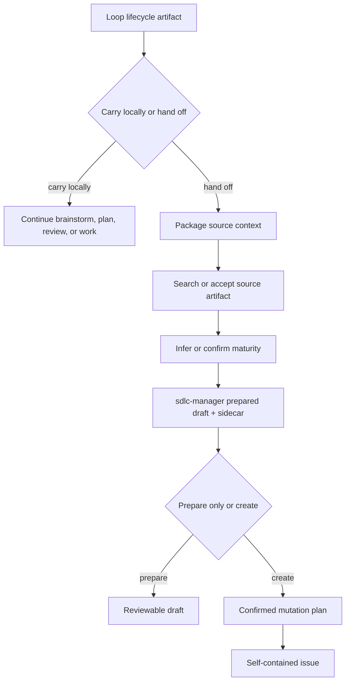

# Requirements: Infiquetra Loop SDLC Handoff

## Summary

Add a handoff path from `infiquetra-loop` lifecycle artifacts into `sdlc-manager` issue artifacts.
`infiquetra-loop` owns lifecycle exit detection and source-context packaging; `sdlc-manager` owns
`/create-issue`, prepared drafts, GitHub/project mutation, and self-contained issue bodies that a
recipient can execute without `infiquetra-loop` installed.

---

## Problem Frame

The current loop is good at carrying work forward inside one human or agent session. It is weaker
when the work should leave that session and be picked up by another team, another agent, or a later
operator. The receiving side needs an issue that stands on its own: what changed, why it matters,
what artifact it came from, what maturity it has, and what action is safe next.

`sdlc-manager` already has the prepared-issue boundary: a markdown draft, JSON sidecar, readiness
checks, and a confirmed create path. The missing product layer is the natural handoff experience:
plain `/create-issue` naming, source-artifact discovery, lifecycle-aware maturity, and a thin
`/handoff` command that routes rather than creating issues itself.

One prerequisite must be handled before implementation. Current `infiquetra-sdlc` and synced
`sdlc-manager` materials still describe Asgard as a feeder or promotion lane for Mount Olympus.
The desired model is different: Asgard and Olympus are sibling target teams/boards. Either can
carry work to completion, and cross-team movement is explicit operator action only.

The Mimir orchestration reconsideration points at the same design principle: do not rebuild the
downstream execution substrate. Use the native issue, board, and lifecycle mechanisms, then add
only the context and readiness metadata the handoff recipient needs.

---

## Key Decisions

- **`sdlc-manager` owns issue artifacts.** It owns `/create-issue`, prepared drafts, sidecars,
  readiness checks, mutation plans, and GitHub/project side effects.
- **`infiquetra-loop` owns lifecycle handoff.** It detects when local lifecycle work should stop,
  packages source context, and routes to `/create-issue` or tells the operator the next loop action.
- **`/create-issue` is the primary issue command.** `/sdlc-create` remains as a compatibility or
  namespaced alias.
- **Prepare is the safe no-mutation mode.** `--prepare` is canonical, `--draft` is an alias, and
  explicit create intent still shows a mutation plan before side effects.
- **Source artifacts are first-class.** `/create-issue --from <artifact>` is supported, and natural
  language that implies an existing artifact should trigger repo-local artifact search before
  asking the user for a path.
- **Maturity is visible and machine-readable.** Handoff maturity appears in both the issue body and
  the JSON sidecar.
- **`/handoff` is thin.** It infers the active artifact and maturity when it can, asks only when
  uncertain, and delegates issue creation to `sdlc-manager`.

---

## Actors

- A1. Operator - the human deciding whether to carry work forward locally or hand it to another
  team/session.
- A2. `infiquetra-loop` - lifecycle command layer that manages ideation, brainstorm, planning,
  review, work, retro, durable artifacts, and active pointers.
- A3. `sdlc-manager` - issue command layer that prepares drafts, validates readiness, builds
  mutation plans, and creates issues.
- A4. Recipient team or agent - Asgard, Olympus, Jeff/operator, or another execution context that
  must be able to use the issue without local loop assumptions.
- A5. GitHub and project boards - repositories, issues, labels, project items, fields, and board
  statuses.
- A6. Canonical SDLC model - `infiquetra-sdlc` and synced plugin materials that define team,
  issue-type, and board semantics.

---

## Requirements

**Prerequisite Model Correction**

- R1. The implementation plan generated from this requirements document must begin with a
  prerequisite workstream to correct the stale Asgard-to-Olympus promotion model in canonical
  `infiquetra-sdlc` materials.
- R2. The same prerequisite workstream must sync the corrected model into vendored `sdlc-manager`
  materials, prepared-issue wording, readiness checks, and tests.
- R3. Corrected language must state that Asgard and Olympus are sibling target teams/boards, not
  maturity stages in one funnel.
- R4. Corrected behavior must treat cross-team movement, cloning, or linked issue creation as an
  explicit operator action only.
- R5. Readiness checks may warn that an issue does not fit a target team's profile, but they must
  not imply automatic Asgard-to-Olympus promotion.

**Command Surface And Ownership**

- R6. `sdlc-manager` provides `/create-issue` as the primary operator-facing issue command.
- R7. `/sdlc-create` remains available as a compatibility alias or namespaced form for existing
  users and docs.
- R8. `/create-issue` supports natural-language issue creation plus explicit flags for repo, team,
  project, issue type, maturity, source artifact, and prepare mode.
- R9. `/create-issue --prepare` writes the prepared markdown draft and JSON sidecar without
  GitHub/project mutation.
- R10. `/create-issue --draft` behaves as an alias for `--prepare`.
- R11. Explicit create intent builds and displays the final mutation plan, then performs side
  effects only after confirmation.
- R12. `infiquetra-loop` must not create GitHub issues directly; it routes to `/create-issue` or
  prepares the context needed by that command.
- R13. `infiquetra-loop` provides a thin `/handoff` command for the current lifecycle artifact.

**Source Artifact Discovery**

- R14. `/create-issue --from <artifact>` accepts explicit source paths or URLs for ideation docs,
  brainstorm requirements, plans, doc-review artifacts, work-session summaries, prepared drafts,
  existing issues, PRs, branches, or equivalent resume state.
- R15. Natural-language prompts that imply an existing source artifact must trigger local artifact
  search before asking the user for a path.
- R16. Artifact search covers the repo's durable lifecycle locations, including ideation,
  brainstorms, plans, reviews, work-session summaries, prepared issue drafts, and the active
  `infiquetra-loop` pointer when present.
- R17. When artifact search finds exactly one confident match, the command may use it and report
  the selected source in the draft or mutation plan.
- R18. When artifact search finds multiple plausible matches, the command presents the candidates
  and asks the operator to choose.
- R19. When artifact search finds no plausible match, the command asks for a source path or enough
  source text to continue.
- R20. The source artifact type informs default handoff maturity, but explicit operator language or
  `--maturity` can override the default.

**Handoff Maturity And Issue Content**

- R21. Every handoff issue draft includes a handoff maturity marker in both the issue body and JSON
  sidecar.
- R22. Supported maturity values are `idea-ready`, `requirements-ready`, `plan-ready`,
  `resume-ready`, and `deferred-context`.
- R23. The issue body is self-contained: target repo/surface, team/board/project, issue type,
  maturity, source artifact links or excerpts, criteria appropriate to maturity, non-goals, risks,
  blockers, open questions, and suggested next action.
- R24. Optional `infiquetra-loop` next-action hints may appear in the issue body, but the issue
  must remain executable without `infiquetra-loop`.
- R25. `requirements-ready` issues suggest planning as the next action, not execution.
- R26. `plan-ready` and `resume-ready` issues may suggest `/work <issue>` only when the issue body
  contains or links a plan-grade execution contract.
- R27. `/loop <issue>` is not suggested to agent teams by default; it is reserved for human or
  operator lifecycle routing.

**Lifecycle Handoff Behavior**

- R28. `infiquetra-loop` offers handoff at natural lifecycle boundaries: post-ideation when intent
  should be preserved, post-brainstorm when requirements are ready, post-plan when execution can
  move elsewhere, and mid-work when another session must resume.
- R29. The default after raw ideation is to continue shaping locally unless the operator explicitly
  wants to preserve, defer, or route the idea.
- R30. The first normal handoff point is post-brainstorm or post-requirements, where the likely next
  action is `/plan <issue>`.
- R31. Post-plan handoff is the normal implementation-team handoff, where the likely next action is
  `/work <issue>` if review gates are satisfied.
- R32. Mid-work handoff includes branch or PR state, completed phases, checks run, blockers,
  remaining acceptance criteria, and review status.
- R33. `/handoff` asks whether work is being carried forward locally or handed off when that cannot
  be inferred from the operator's prompt.
- R34. Cross-team transfer is supported only when explicitly requested; readiness alone must not
  cause an Asgard issue to become an Olympus issue or vice versa.

**Planning And Work Integration**

- R35. `/plan <issue>` can consume a `requirements-ready` handoff issue, write a durable
  `docs/plans/` artifact, and sync a compact plan summary plus link back to the issue.
- R36. `/work <issue>` can consume a `plan-ready` or `resume-ready` issue when the issue links or
  contains the required plan/resume contract.
- R37. When a plan still needs review, the handoff issue may suggest `/doc-review <plan>` before
  `/work <issue>`.
- R38. Existing prepared-draft creation remains the deterministic base; the new handoff behavior
  extends it with source artifact discovery, maturity, and clearer command names.

**Validation And Documentation**

- R39. Command docs and skills document `/create-issue`, `--prepare`, `--draft`, `--from`,
  `/handoff`, maturity values, and the `/sdlc-create` compatibility path.
- R40. Tests cover prepare/draft aliasing, explicit create confirmation, source-artifact search,
  maturity sidecar/body output, `/plan <issue>` summary sync, and blocked creation when required
  maturity inputs are missing.
- R41. Tests or doc checks cover the stale Asgard/Olympus model correction so promotion-lane
  language does not reappear in active `sdlc-manager` materials.

---

## Handoff Shape

The diagram is conceptual. The important boundary is that the loop packages context and
`sdlc-manager` owns the issue artifact and mutation path.

---

## Key Flows

- F1. Create from an explicit artifact
  - **Trigger:** Operator runs `/create-issue --from docs/plans/example.md`.
  - **Actors:** A1, A3, A5.
  - **Steps:** Read the artifact, infer maturity from the artifact type, prepare the draft and
    sidecar, show the mutation plan when creation is intended, and create only after confirmation.
  - **Outcome:** The issue is created or drafted from the named source.
  - **Covers:** R8-R11, R14, R20-R24.

- F2. Create from natural-language artifact reference
  - **Trigger:** Operator says, "Turn the plan we just made into an Olympus issue."
  - **Actors:** A1, A2, A3.
  - **Steps:** Search likely lifecycle artifacts, select or ask about the matching plan, infer
    `plan-ready`, prepare the issue, and show the confirmed create flow.
  - **Outcome:** Natural language reaches the same artifact-backed path as explicit `--from`.
  - **Covers:** R15-R20, R38.

- F3. Handoff after requirements
  - **Trigger:** Brainstorm or requirements work is complete and another team should plan it.
  - **Actors:** A1, A2, A3, A4.
  - **Steps:** `/handoff` packages the requirements artifact, sets `requirements-ready`, routes to
    `/create-issue`, and suggests `/plan <issue>`.
  - **Outcome:** The recipient can plan from the issue without reading chat history.
  - **Covers:** R23-R25, R28-R30, R35.

- F4. Handoff after plan
  - **Trigger:** A plan exists and the implementation team or agent should execute it.
  - **Actors:** A1, A2, A3, A4.
  - **Steps:** `/handoff` packages the plan, sets `plan-ready`, routes to `/create-issue`, and
    suggests review/work entrypoints as appropriate.
  - **Outcome:** The recipient gets an execution-ready issue with the plan linked or embedded.
  - **Covers:** R26, R31, R36, R37.

- F5. Resume handoff after partial work
  - **Trigger:** Work has started but another session must resume it.
  - **Actors:** A1, A2, A3, A4.
  - **Steps:** Package branch/PR state, work-session summary, checks, blockers, and remaining
    criteria; set `resume-ready`; create or prepare the issue.
  - **Outcome:** A later session can resume from durable state rather than chat memory.
  - **Covers:** R22, R26, R32, R36.

- F6. Explicit cross-team movement
  - **Trigger:** Operator explicitly asks to move or clone an issue from one team board to another.
  - **Actors:** A1, A3, A5, A6.
  - **Steps:** Treat the target team as an explicit operator choice, run target-team readiness, and
    show any warnings without implying automatic promotion.
  - **Outcome:** Cross-team movement is possible but never inferred from readiness alone.
  - **Covers:** R3-R5, R34.

---

## Acceptance Examples

- AE1. Natural language finds the recent plan
  - **Covers R15-R20.**
  - **Given:** A recent plan exists under `docs/plans/`.
  - **When:** The operator says, "Turn the plan we just made into an Olympus issue."
  - **Then:** The command searches lifecycle artifacts before asking for a path, selects or
    presents the likely plan, and prepares a `plan-ready` issue.

- AE2. Prepare does not mutate GitHub
  - **Covers R9, R10.**
  - **Given:** The operator runs `/create-issue --prepare --from docs/brainstorms/example.md`.
  - **When:** The command completes.
  - **Then:** A draft and sidecar exist, and no GitHub issue or project item was created.

- AE3. Create intent still requires confirmation
  - **Covers R11.**
  - **Given:** The operator says, "Create an issue for this plan."
  - **When:** The source artifact and target are resolved.
  - **Then:** The command shows all planned side effects and waits for confirmation before creating
    the issue.

- AE4. Requirements-ready issue points to planning
  - **Covers R21-R26, R30.**
  - **Given:** A brainstorm requirements artifact is handed off.
  - **When:** The issue is prepared.
  - **Then:** The issue carries `requirements-ready` maturity and suggests `/plan <issue>`, not
    `/work <issue>`.

- AE5. Plan-ready issue points to work
  - **Covers R26, R31, R36, R37.**
  - **Given:** An approved plan artifact is handed off.
  - **When:** The issue is prepared.
  - **Then:** The issue carries `plan-ready` maturity, links the plan, and may suggest
    `/doc-review <plan>` followed by `/work <issue>` when review has not already passed.

- AE6. Asgard issue does not imply Olympus promotion
  - **Covers R1-R5, R34, R41.**
  - **Given:** The target team is Asgard.
  - **When:** The issue is prepared and readiness is evaluated.
  - **Then:** The body and sidecar describe Asgard readiness without "Olympus promotion gaps" or
    other feeder-lane language.

- AE7. Recipient does not need `infiquetra-loop`
  - **Covers R23, R24, R27.**
  - **Given:** The recipient team lacks `infiquetra-loop`.
  - **When:** They open the issue in GitHub.
  - **Then:** The issue still contains enough context, criteria, source links, and next action to
    proceed through normal SDLC surfaces.

- AE8. `/plan <issue>` upgrades maturity through a durable plan artifact
  - **Covers R35.**
  - **Given:** A `requirements-ready` issue exists.
  - **When:** `/plan <issue>` produces an approved plan.
  - **Then:** A durable plan file exists under `docs/plans/`, and the issue receives a compact
    plan summary plus link.

---

## Success Criteria

- The next planning pass can produce implementation work without inventing command names,
  ownership boundaries, maturity semantics, or handoff timing.
- The first implementation workstream corrects the stale Asgard/Olympus model before adding new
  handoff behavior.
- Operators can say "create an issue," "prepare an issue," "draft an issue," or "hand this off"
  without knowing the internal prepare/create state machine.
- Natural-language references to existing artifacts find likely durable sources before asking the
  operator to restate context.
- Every created handoff issue is useful to a recipient that does not have `infiquetra-loop`.
- No GitHub or project mutation occurs before a visible mutation plan is confirmed.
- `/work <issue>` is suggested only when the issue is plan-ready or resume-ready.

---

## Scope Boundaries

- Implementing `/create-issue`, `/handoff`, or the SDLC model correction is out of scope for this
  brainstorm artifact.
- Replacing the existing six SDLC issue types is out of scope.
- Making `/loop` the only issue-creation surface is out of scope.
- Suggesting `/loop <issue>` to agent teams by default is out of scope.
- Requiring the recipient to have `infiquetra-loop` is out of scope.
- Auto-moving issues to `Ready` is out of scope.
- Auto-promoting Asgard work to Olympus is out of scope.
- Reworking Mimir orchestration is out of scope; only its "lean into native substrate" lesson is
  applied here.

---

## Dependencies And Assumptions

- `sdlc-manager` prepared drafts remain the base issue artifact mechanism.
- `infiquetra-loop` lifecycle commands keep writing durable artifacts and active pointers that can
  be searched.
- The target repository has, or can receive, the SDLC labels/templates and project mappings needed
  by `sdlc-manager`.
- The operator or agent session has repository filesystem access for source-artifact discovery.
- GitHub/project mutation uses the existing confirmed `sdlc-manager` mutation-plan boundary.
- Canonical `infiquetra-sdlc` docs and synced plugin materials can be updated before handoff work
  ships.

---

## Sources

- `docs/ideation/2026-05-30-infiquetra-loop-sdlc-handoff.md`
- `docs/brainstorms/2026-05-30-sdlc-manager-issue-prepare-requirements.md`
- `plugins/infiquetra-loop/commands/plan.md`
- `plugins/infiquetra-loop/commands/work.md`
- `plugins/infiquetra-loop/skills/plan/SKILL.md`
- `plugins/infiquetra-loop/skills/work/SKILL.md`
- `plugins/sdlc-manager/commands/sdlc-create.md`
- `plugins/sdlc-manager/skills/sdlc-issues/SKILL.md`
- `plugins/sdlc-manager/scripts/sdlc_manager.py`
- `plugins/sdlc-manager/config/sdlc-schema.json`
- `plugins/sdlc-manager/tests/test_issue_prepare.py`
- `infiquetra-sdlc: config/sdlc-schema.json`
- `infiquetra-sdlc: docs/process/asgard-operating-model.md`
- `infiquetra-sdlc: docs/process/issue-types.md`
- `home-lab: docs/engineering-journal/narratives/2026-05-30-mimir-orchestration-reconsideration.md`
