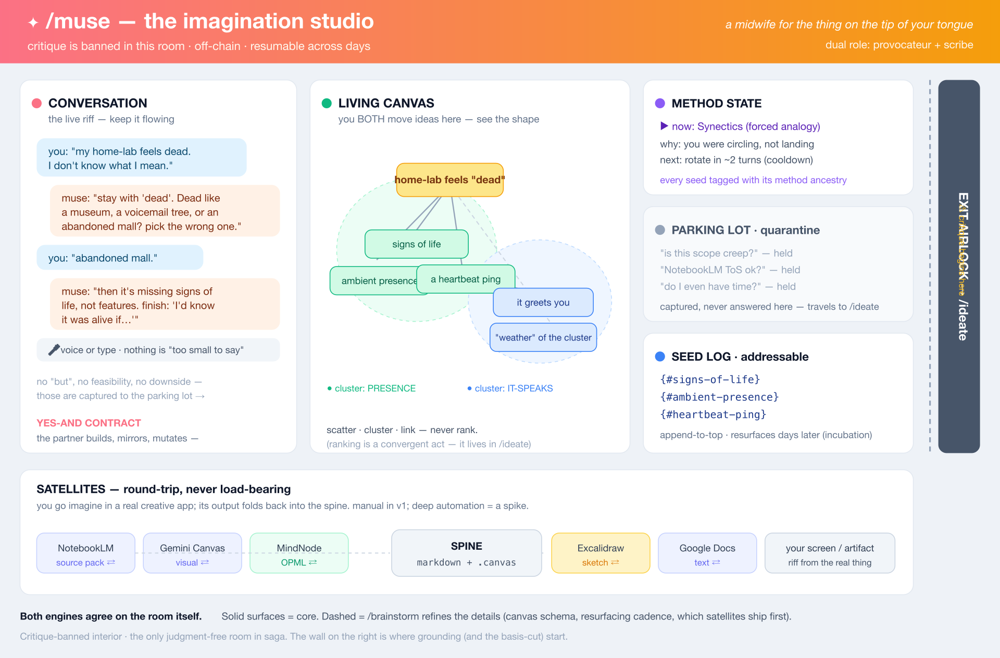
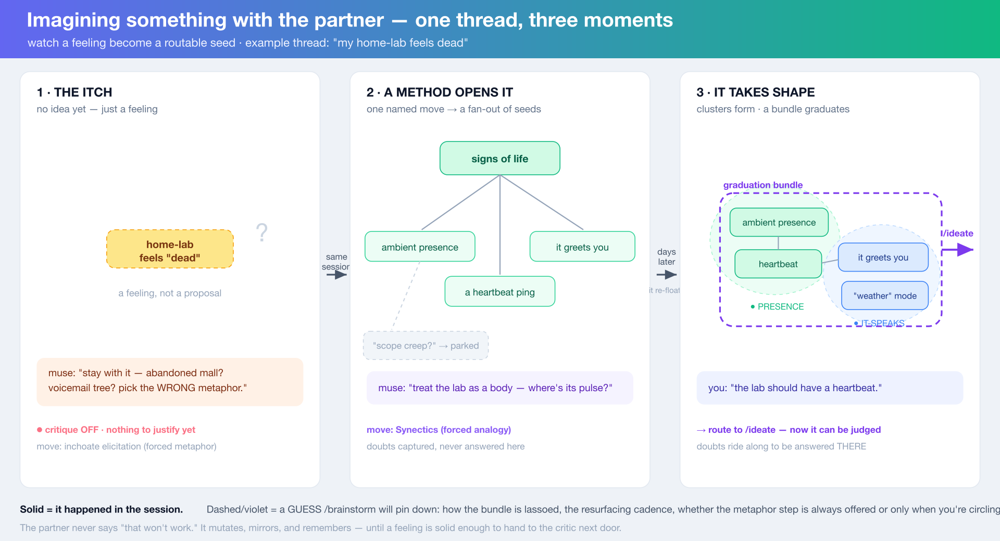

# /muse survivors — head-to-head: prior `/ideate` vs Codex gpt-5.5 (xhigh)

Two engines ran the same 28-seed imagination doc. The operator was dissatisfied with the prior
`/ideate` survivors — they read as "the plugin's job is mostly to *not restrict*," with visualization,
third-party creative apps, and the methodology library stripped or demoted. This compares the two
survivor sets and renders a verdict on whether those moves were sound judgment or bias artifacts.

## The one-line finding

The two engines **agree on the enforcement and continuity machinery** (critique-ban, plain-text source
of truth, incubation, eventual clean handoff to `/ideate`) and **diverge hard on what the tool *is*.**
Prior `/ideate`'s top four survivors are three boundary/contract decisions plus one *removal*; Codex's
top six are all *positive creative capability*. That single contrast is the operator's complaint, made
measurable.

## Side-by-side survivor map

| Theme | Prior `/ideate` | Codex gpt-5.5 @ xhigh | Relationship |
|---|---|---|---|
| Critique-ban | **#1 (92)** structural / ban-by-absence / no scoring code paths | **#1 (97)** yes-and field + doubt quarantine | **Agree** it's #1. Codex: "no code paths" is too implementation-shaped; the contract is *behavior* + quarantine. |
| Inchoate elicitation ("tip of the tongue") | folded into #7 (one method among many) | **#2 (96)** first-class survivor | **Codex elevates.** This is the stated *soul*; prior buried it inside the method registry. |
| Creative method engine | **#7 (78, last)** "registry + silent selection" | **#3 (94)** first-class engine, *visible named moves* | **Diverge hard.** The "no methodologies" complaint, confirmed. |
| Provocateur + scribe loop | folded into #1/#3 | **#4 (93)** own survivor | Codex keeps explicit. |
| Durable muse corpus | **#3 (88)** *no new artifact* — write straight into `/ideate`'s inbox | **#5 (92)** muse gets its *own* corpus; `/ideate` receives a graduated bundle | **Diverge.** Prior applied saga's dead-wiring rule; Codex says the human (across days) is the consumer, so it earns a corpus. |
| Visual / spatial surface | **#2 (90)** CUT → text-only spine | **#6 (91)** **v1** — JSON Canvas + Markmap; D2/Kroki optional | **Diverge hard.** Complaint #1. Both Codex *and* the cited decision (read in full) say this was a bias artifact. |
| 3-driver orchestration | folded into #7 | **#7 (89)** own survivor | Codex keeps explicit. |
| Incubation / resurfacing | **#5 (82)** | **#8 (87)** | **Agree.** |
| Third-party creative apps | deferred → "opt-in spike, **never v1**" (R15) | **#9 (82)** **v1 satellite round-trip protocol**; deep automation = spike | **Diverge on v1**, agree deep automation is a spike. Complaint #2. |
| Session-mode palette | scattered/cut (silent-scribe→R9, swarm→R11) | **#10 (81)** explicit mode palette | Codex consolidates into a feature. |
| Artifact rubric (S12) | folded into #3 | **#11 (79)** own survivor | Codex keeps explicit — the operator asked for this. |
| Journal-as-fuel / auto-seed | **#6 (80)** | folded into #8 | **Agree** it exists; Codex demotes it to "one provocation source among many." |
| Replace `/office-hours` | **#4 (85)** DON'T replace — decouple | **#12 (76, last)** DO replace, thin alias | **Diverge** — and here the prior pass is *better grounded* (see below). |

## The three contested moves — verdict

### 1. Visualization — CUT was a bias artifact (high confidence)
Prior `/ideate` cut the whole visual cluster citing `DECISIONS {#saga-docs-source-model}` as
"diagram deps rejected → text-only spine." Read in full, that decision is **pro-visual**: its title is
"…**and generated SVG visual kit**," saga **ships 4 committed SVGs today**, and its rationale states the
user "explicitly wanted presentation-worthy visuals." What it actually rejected was narrow and about
*saga's own docs*: drift-prone hand-maintained Mermaid/PNG *as a primary source*, and a *heavyweight new
render dependency*. The engine over-generalized a docs-sourcing decision to muse's product UX **and
inverted its meaning.** Codex independently reached the same conclusion ("the documentation decision…
does not transfer to a human imagination workspace"). Saga's own model→SVG generator is in fact a
*template* for doing muse visuals without a fragile live dependency.

The one *legitimate* kernel inside the prior cut: canvas *layout-to-decide* is a convergent act that can
re-engage the self-monitor. That argues the visual surface must be **divergence-shaped** (scatter,
sketch, loose association — not rank/cluster-to-decide), **not** that there should be none. Codex's
position threads this: JSON Canvas + Markmap mind-maps in v1; remote D2/Kroki rendering optional.

### 2. Third-party creative apps — DEFER-ALL was bias; DEFER-DEEP-AUTOMATION was sound (mixed)
Prior `/ideate` pushed NotebookLM/Google/Gemini/MindNode to "opt-in spike, never v1" on a *feasibility*
argument (ToS-gray, brittle) — the exact dimension the seed doc placed **out of frame**. Codex splits
the question correctly: a **manual round-trip protocol** (export a source pack → human works in
NotebookLM/Gemini/MindNode → import notes back → integration ritual distills + logs provenance) belongs
in **v1**; **deep unofficial-API automation** (e.g. `notebooklm-py`) is a **spike**, not v1. That is a
sharper answer than either the prior pass (cut all) or the seed doc (which wanted the automation spike
in scope). It directly answers "why did it remove anything to do with NotebookLM."

### 3. Methodology — DEMOTION was a bias artifact (high confidence)
Prior `/ideate` compressed the ~70-technique, 8-family library (a *pillar* of the seed doc) into one
last-ranked survivor framed as build-risk ("a config burden masquerading as flexibility"). It optimized
the method layer for *build-simplicity*, not *creative richness*. Codex makes the method engine its #3
(conf 94) and the inchoate-elicitation partner its #2 (conf 96), with a concrete Part B: named
techniques per family, three-driver selection, and real example moves (the "abandoned mall" elicitation,
a full SCAMPER pass, a Synectics airport analogy, Six-Hats-minus-Black-Hat). Codex's own reconciliation:
"The survivor should have been the creative method engine itself, with visible named moves… not a
registry."

## Where the prior pass was actually right (don't over-correct)
Being fair to the prior engine — and to the build:
- **Critique-ban as the #1 differentiator** — both engines top-rank it; well-grounded (Diehl & Stroebe
  1987; Limb & Braun 2008). Codex only reframes the *mechanism* (behavior contract over "no code paths").
- **Plain text / JSON as the source of truth** — Codex agrees explicitly; visuals and satellites
  *round-trip back* to the spine, never become load-bearing.
- **Incubation / spaced resurfacing** — both keep; central, not a nice-to-have.
- **A clean, typed handoff to `/ideate` eventually** — both agree the seam matters (they differ only on
  whether muse *also* keeps its own corpus first).
- **Office-hours: DON'T replace for v1 is the safer call.** This is the one place the prior pass beats
  both Codex *and* the seed doc. Its argument is a concrete repo-coupling fact (office-hours is hardcoded
  in tests and referenced as a routing target in `/ideate` ×5 + `/brainstorm`), not an imagination-altitude
  question. Tellingly, Codex ranks "replace office-hours" **last (76)** — its own weakest survivor — so
  even the second opinion implicitly concedes this one.

## Net
Three independent lines of evidence — the prior `/ideate` artifact's own stated reasons, Codex gpt-5.5
at xhigh, and a direct re-read of the cited source decision — converge: the prior pass got the
*enforcement and continuity machinery* right but **mis-ranked the soul**, letting saga-internal
constraints (a misread text-only-docs decision, the dead-wiring rule, and an out-of-frame feasibility
filter) suppress the three things that make `/muse` a creative tool for a *human*: a visual thinking
surface, real third-party creative surfaces, and a first-class methodology engine. The meta-irony:
`/ideate`'s defining move is "cut any idea with no articulated basis," and `/muse` exists precisely to be
the room where that rule does not apply — so running the basis-cutter on the imagination doc reproduced
the very limitation `/muse` was invented to escape.

**Recommended synthesis for the eventual build:** keep prior #1 (reframed as a behavior contract),
prior #5/#6 (incubation, journal-as-fuel), and prior #4 (don't replace office-hours for v1); **promote**
Codex #2/#3 (inchoate-elicitation + first-class method engine), #6 (visual surface, divergence-shaped),
#9 (third-party satellite round-trip, manual in v1 / automation as a spike), and #5 (muse keeps its own
durable corpus). That is `/muse` as an *imagination studio*, not "`/ideate` with critique switched off."

## Visuals — what the synthesized studio looks like

Two views of the corrected studio direction (SVG source + rendered PNG under `assets/`):

- **The studio (anatomy)** — the room and its surfaces: the yes-and conversation, the living visual
  canvas, method state, the quarantine parking lot, the addressable seed log, the satellite round-trip
  ring, and the exit airlock into `/ideate`.
  

- **A session (storyboard)** — a feeling becoming a routable seed in three moments: the itch →
  a method fan-out → clustering into a nameable bundle that graduates to `/ideate`.
  

Solid surfaces are agreed core; dashed/violet elements are the open product decisions `/brainstorm`
pins down (canvas-as-thinking-surface vs render, bundle graduation, resurfacing cadence, mode defaults,
which satellites ship first). Dogfood note: these are committed SVGs — the same model→SVG pattern saga
already uses (`plugins/saga/docs/assets/`), which is exactly the precedent the prior pass's "text-only"
cut overlooked.
