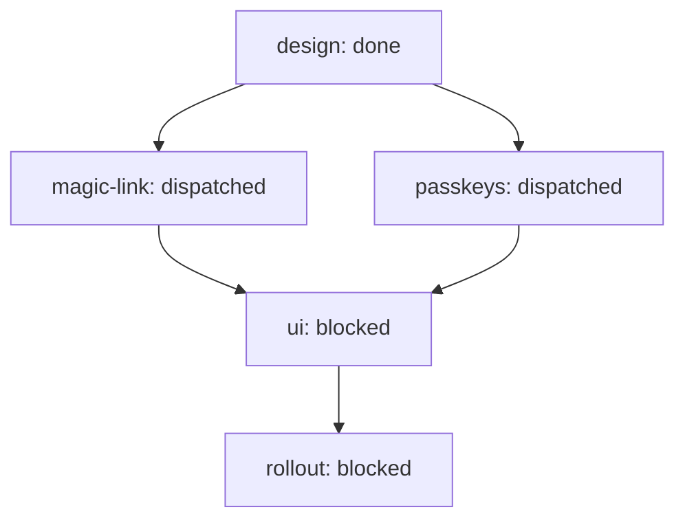

# Outcome: Ship passwordless auth (magic-link + passkeys)

**Outcome ID:** `ship-auth` · **Revision:** 1 · **Progress:** 1/5 (20%)

## Topology

## Attention (consolidated)

Operator attention (1 item, ranked):
1. [gate] passkeys — ready to ship (gated) — operator merges · holds up 2 downstream

## Subplots

| Subplot | State | Evidence | Cost |
| --- | --- | --- | --- |
| `design` | done | issue 101 | no data yet |
| `magic-link` | dispatched | PR 112 | no data yet |
| `passkeys` | dispatched | PR 113 | no data yet |
| `ui` | blocked | — | no data yet |
| `rollout` | blocked | — | no data yet |

## Cost rollup

_no data yet — the realized cost rollup (R24) is populated by U10._

## Decision trail

_—_
