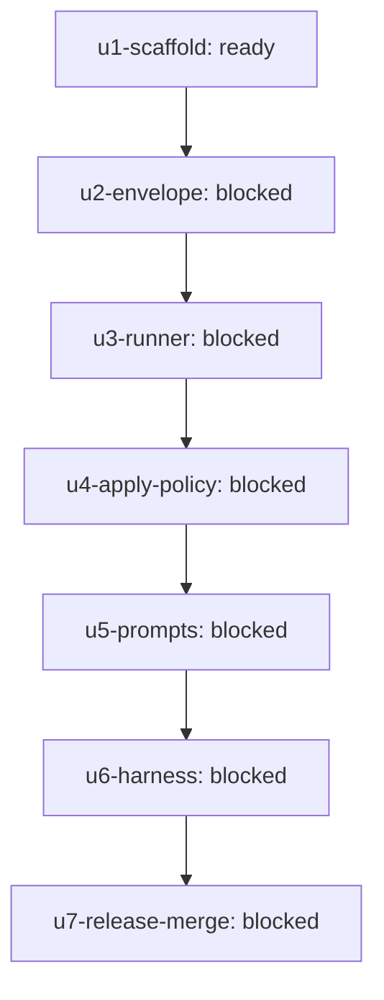

# Outcome: Ship the first-party agy Claude Code plugin with Antigravity-backed coder/reviewer teammates, shared evidence wrapper, write gates, live harness proof, and merged PR.

**Outcome ID:** `antigravity-teammate-plugin` · **Revision:** 2 · **Progress:** 0/7 (0%)

## Topology

## Attention (consolidated)

✓ no operator attention needed — every non-gated leaf is auto-advancing (R17).

## Subplots

| Subplot | State | Evidence | Cost |
| --- | --- | --- | --- |
| `u1-scaffold` | ready | — | no data yet |
| `u2-envelope` | blocked | — | no data yet |
| `u3-runner` | blocked | — | no data yet |
| `u4-apply-policy` | blocked | — | no data yet |
| `u5-prompts` | blocked | — | no data yet |
| `u6-harness` | blocked | — | no data yet |
| `u7-release-merge` | blocked | — | no data yet |

## Cost rollup

_no data yet — the realized cost rollup (R24) is populated by U10._

## Decision trail

- r2: Replace starter design/build graph with reviewed plan U1-U7 implementation DAG.
