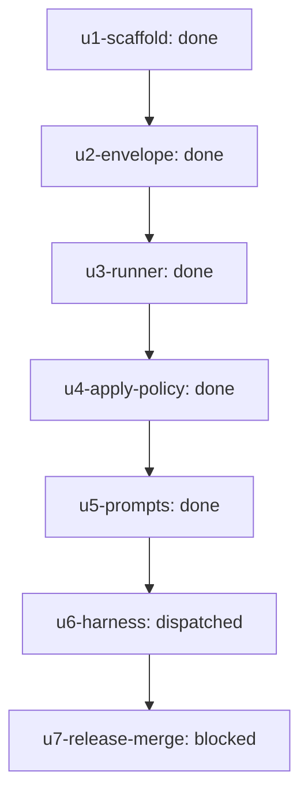

# Outcome: Ship the first-party agy Claude Code plugin with Antigravity-backed coder/reviewer teammates, shared evidence wrapper, write gates, live harness proof, and merged PR.

**Outcome ID:** `antigravity-teammate-plugin` · **Revision:** 2 · **Progress:** 5/7 (71%)

## Topology

## Attention (consolidated)

Operator attention (1 item, ranked):
1. [gate] u6-harness — ready to ship (risky) — operator merges · holds up 1 downstream

## Subplots

| Subplot | State | Evidence | Cost |
| --- | --- | --- | --- |
| `u1-scaffold` | done | — | no data yet |
| `u2-envelope` | done | — | no data yet |
| `u3-runner` | done | — | no data yet |
| `u4-apply-policy` | done | — | no data yet |
| `u5-prompts` | done | — | no data yet |
| `u6-harness` | dispatched | — | no data yet |
| `u7-release-merge` | blocked | — | no data yet |

## Cost rollup

_no data yet — the realized cost rollup (R24) is populated by U10._

## Decision trail

- r2: Replace starter design/build graph with reviewed plan U1-U7 implementation DAG.
