# Outcome: objective: Stand up the external-engine offload lane

**Outcome ID:** `external-engine-offload` · **Revision:** 3 · **Progress:** 14/20 (70%)

## Topology

```mermaid
flowchart TD
    sub-381["sub-381: done"]
    sub-382["sub-382: done"]
    sub-383["sub-383: done"]
    sub-384["sub-384: done"]
    sub-451["sub-451: done"]
    sub-385["sub-385: done"]
    sub-452["sub-452: done"]
    sub-453["sub-453: done"]
    sub-454["sub-454: done"]
    sub-386["sub-386: dispatched"]
    sub-387["sub-387: done"]
    sub-388["sub-388: dispatched"]
    sub-389["sub-389: done"]
    sub-455["sub-455: dispatched"]
    sub-390["sub-390: done"]
    sub-391["sub-391: dispatched"]
    sub-393["sub-393: dispatched"]
    sub-394["sub-394: dispatched"]
    sub-468["sub-468: done"]
    sub-476["sub-476: done"]
    sub-383 --> sub-384
    sub-476 --> sub-384
```

## Attention (consolidated)

✓ no operator attention needed — every non-gated leaf is auto-advancing (R17).

## Subplots

| Subplot | State | Evidence | Cost |
| --- | --- | --- | --- |
| `sub-381` | done | PR https://github.com/infiquetra/infiquetra-claude-plugins/pull/538, issue infiquetra/infiquetra-claude-plugins#381 | no data yet |
| `sub-382` | done | PR https://github.com/infiquetra/infiquetra-claude-plugins/pull/539, issue infiquetra/infiquetra-claude-plugins#382 | no data yet |
| `sub-383` | done | PR https://github.com/infiquetra/infiquetra-claude-plugins/pull/516, issue infiquetra/infiquetra-claude-plugins#383 | no data yet |
| `sub-384` | done | PR https://github.com/infiquetra/infiquetra-claude-plugins/pull/521, issue infiquetra/infiquetra-claude-plugins#384 | no data yet |
| `sub-451` | done | PR https://github.com/infiquetra/infiquetra-claude-plugins/pull/541, issue infiquetra/infiquetra-claude-plugins#451 | no data yet |
| `sub-385` | done | PR https://github.com/infiquetra/infiquetra-claude-plugins/pull/542, issue infiquetra/infiquetra-claude-plugins#385 | no data yet |
| `sub-452` | done | PR https://github.com/infiquetra/infiquetra-claude-plugins/pull/543, issue infiquetra/infiquetra-claude-plugins#452 | no data yet |
| `sub-453` | done | PR https://github.com/infiquetra/infiquetra-claude-plugins/pull/544, issue infiquetra/infiquetra-claude-plugins#453 | no data yet |
| `sub-454` | done | PR https://github.com/infiquetra/infiquetra-claude-plugins/pull/545, issue infiquetra/infiquetra-claude-plugins#454 | no data yet |
| `sub-386` | dispatched | issue infiquetra/infiquetra-claude-plugins#386 | no data yet |
| `sub-387` | done | PR https://github.com/infiquetra/infiquetra-claude-plugins/pull/516, issue infiquetra/infiquetra-claude-plugins#387 | no data yet |
| `sub-388` | dispatched | issue infiquetra/infiquetra-claude-plugins#388 | no data yet |
| `sub-389` | done | PR https://github.com/infiquetra/infiquetra-claude-plugins/pull/537, issue infiquetra/infiquetra-claude-plugins#389 | no data yet |
| `sub-455` | dispatched | issue infiquetra/infiquetra-claude-plugins#455 | no data yet |
| `sub-390` | done | PR https://github.com/infiquetra/infiquetra-claude-plugins/pull/528, issue infiquetra/infiquetra-claude-plugins#390 | no data yet |
| `sub-391` | dispatched | issue infiquetra/infiquetra-claude-plugins#391 | no data yet |
| `sub-393` | dispatched | issue infiquetra/infiquetra-claude-plugins#393 | no data yet |
| `sub-394` | dispatched | issue infiquetra/infiquetra-claude-plugins#394 | no data yet |
| `sub-468` | done | PR https://github.com/infiquetra/infiquetra-claude-plugins/pull/522, issue infiquetra/infiquetra-claude-plugins#468 | no data yet |
| `sub-476` | done | PR https://github.com/infiquetra/infiquetra-claude-plugins/pull/518, issue infiquetra/infiquetra-claude-plugins#476 | no data yet |

## Cost rollup

_no data yet — the realized cost rollup (R24) is populated by U10._

## Decision trail

- r2: prune sub-392
- r3: add-edge sub-384 depends_on [sub-383, sub-476] — tripwires audit needs the receipt schema (#383) and the codex bridge (#476) to exist first
