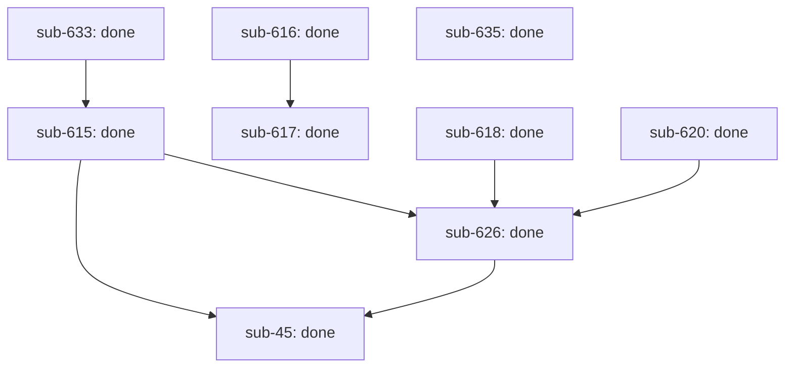

# Outcome: objective: governed execution integrity — self-hosting outcome/workflow substrate

**Outcome ID:** `governed-execution-integrity` · **Revision:** 1 · **Progress:** 9/9 (100%)

## Topology

## Attention (consolidated)

✓ no operator attention needed — every non-gated leaf is auto-advancing (R17).

## Subplots

| Subplot | State | Evidence | Cost |
| --- | --- | --- | --- |
| `sub-615` | done | PR https://github.com/infiquetra/infiquetra-claude-plugins/pull/641, issue infiquetra/infiquetra-claude-plugins#615 | no data yet |
| `sub-616` | done | PR https://github.com/infiquetra/infiquetra-claude-plugins/pull/643, issue infiquetra/infiquetra-claude-plugins#616 | no data yet |
| `sub-617` | done | PR https://github.com/infiquetra/infiquetra-claude-plugins/pull/650, issue infiquetra/infiquetra-claude-plugins#617 | no data yet |
| `sub-618` | done | PR https://github.com/infiquetra/infiquetra-claude-plugins/pull/640, issue infiquetra/infiquetra-claude-plugins#618 | no data yet |
| `sub-620` | done | PR https://github.com/infiquetra/infiquetra-claude-plugins/pull/651, issue infiquetra/infiquetra-claude-plugins#620 | no data yet |
| `sub-626` | done | PR https://github.com/infiquetra/infiquetra-claude-plugins/pull/653, issue infiquetra/infiquetra-claude-plugins#626 | no data yet |
| `sub-633` | done | PR https://github.com/infiquetra/infiquetra-claude-plugins/pull/636, issue infiquetra/infiquetra-claude-plugins#633 | no data yet |
| `sub-635` | done | PR https://github.com/infiquetra/infiquetra-claude-plugins/pull/660, issue infiquetra/infiquetra-claude-plugins#635 | no data yet |
| `sub-45` | done | PR https://github.com/infiquetra/infiquetra-codex-plugins/pull/53, issue infiquetra/infiquetra-codex-plugins#45 | no data yet |

## Cost rollup

_no data yet — the realized cost rollup (R24) is populated by U10._

## Decision trail

_—_
