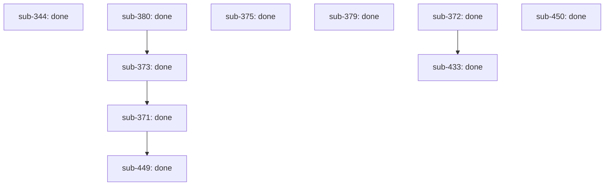

# Outcome: objective: Ship run-start intent envelope for lifecycle autonomy

**Outcome ID:** `intent-envelope-autonomy` · **Revision:** 6 · **Progress:** 10/10 (100%)

## Topology

## Attention (consolidated)

✓ no operator attention needed — every non-gated leaf is auto-advancing (R17).

## Subplots

| Subplot | State | Evidence | Cost |
| --- | --- | --- | --- |
| `sub-344` | done | PR https://github.com/infiquetra/infiquetra-claude-plugins/pull/485, issue infiquetra/infiquetra-claude-plugins#344 | no data yet |
| `sub-371` | done | PR https://github.com/infiquetra/infiquetra-claude-plugins/pull/599, issue infiquetra/infiquetra-claude-plugins#371 | no data yet |
| `sub-372` | done | PR https://github.com/infiquetra/infiquetra-claude-plugins/pull/591, issue infiquetra/infiquetra-claude-plugins#372 | no data yet |
| `sub-373` | done | PR https://github.com/infiquetra/infiquetra-claude-plugins/pull/596, issue infiquetra/infiquetra-claude-plugins#373 | no data yet |
| `sub-375` | done | PR https://github.com/infiquetra/infiquetra-claude-plugins/pull/486, issue infiquetra/infiquetra-claude-plugins#375 | no data yet |
| `sub-379` | done | PR https://github.com/infiquetra/infiquetra-claude-plugins/pull/488, issue infiquetra/infiquetra-claude-plugins#379 | no data yet |
| `sub-380` | done | PR https://github.com/infiquetra/infiquetra-claude-plugins/pull/592, issue infiquetra/infiquetra-claude-plugins#380 | no data yet |
| `sub-433` | done | PR https://github.com/infiquetra/infiquetra-claude-plugins/pull/595, issue infiquetra/infiquetra-claude-plugins#433 | no data yet |
| `sub-449` | done | PR https://github.com/infiquetra/infiquetra-claude-plugins/pull/602, issue infiquetra/infiquetra-claude-plugins#449 | no data yet |
| `sub-450` | done | PR https://github.com/infiquetra/infiquetra-claude-plugins/pull/590, issue infiquetra/infiquetra-claude-plugins#450 | no data yet |

## Cost rollup

_no data yet — the realized cost rollup (R24) is populated by U10._

## Decision trail

- r2: prune sub-374
- r3: prune sub-376
- r4: prune sub-377
- r5: prune sub-378
