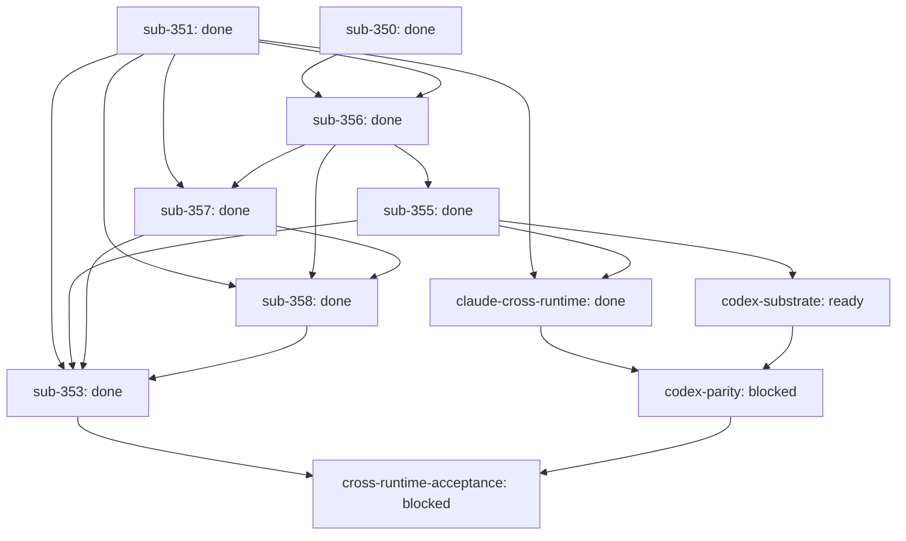

# Outcome: Ship lease-safe cross-runtime Outcome continuity with bounded concurrency, settlement, liveness, and reclamation

**Outcome ID:** `lease-safe-runtime-continuity` · **Revision:** 3 · **Progress:** 8/11 (73%)

## Topology

## Attention (consolidated)

✓ no operator attention needed — every non-gated leaf is auto-advancing (R17).

## Subplots

| Subplot | State | Evidence | Cost |
| --- | --- | --- | --- |
| `sub-350` | done | PR https://github.com/infiquetra/infiquetra-claude-plugins/pull/607, issue infiquetra/infiquetra-claude-plugins#350 | no data yet |
| `sub-351` | done | PR https://github.com/infiquetra/infiquetra-claude-plugins/pull/611, issue infiquetra/infiquetra-claude-plugins#351 | no data yet |
| `sub-356` | done | PR https://github.com/infiquetra/infiquetra-claude-plugins/pull/613, issue infiquetra/infiquetra-claude-plugins#356 | no data yet |
| `sub-355` | done | PR https://github.com/infiquetra/infiquetra-claude-plugins/pull/614, issue infiquetra/infiquetra-claude-plugins#355 | no data yet |
| `sub-357` | done | PR https://github.com/infiquetra/infiquetra-claude-plugins/pull/619, issue infiquetra/infiquetra-claude-plugins#357 | no data yet |
| `sub-358` | done | PR https://github.com/infiquetra/infiquetra-claude-plugins/pull/621, issue infiquetra/infiquetra-claude-plugins#358 | no data yet |
| `claude-cross-runtime` | done | PR https://github.com/infiquetra/infiquetra-claude-plugins/pull/622, issue infiquetra/infiquetra-claude-plugins#604 | no data yet |
| `sub-353` | done | PR https://github.com/infiquetra/infiquetra-claude-plugins/pull/623, issue infiquetra/infiquetra-claude-plugins#353 | no data yet |
| `codex-substrate` | ready | issue infiquetra/infiquetra-codex-plugins#33 | no data yet |
| `codex-parity` | blocked | issue infiquetra/infiquetra-codex-plugins#34 | no data yet |
| `cross-runtime-acceptance` | blocked | issue infiquetra/infiquetra-claude-plugins#605 | no data yet |

## Cost rollup

_no data yet — the realized cost rollup (R24) is populated by U10._

## Decision trail

- r2: set-intent: attach run-start intent envelope
