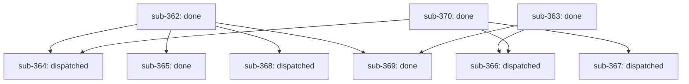

# Outcome: infiquetra/infiquetra-claude-plugins#343

**Outcome ID:** `tier-effort-first-class` · **Revision:** 3 · **Progress:** 5/9 (56%)

## Topology

## Attention (consolidated)

✓ no operator attention needed — every non-gated leaf is auto-advancing (R17).

## Subplots

| Subplot | State | Evidence | Cost |
| --- | --- | --- | --- |
| `sub-362` | done | PR https://github.com/infiquetra/infiquetra-claude-plugins/pull/493, issue infiquetra/infiquetra-claude-plugins#362 | no data yet |
| `sub-363` | done | PR https://github.com/infiquetra/infiquetra-claude-plugins/pull/498, issue infiquetra/infiquetra-claude-plugins#363 | no data yet |
| `sub-364` | dispatched | issue infiquetra/infiquetra-claude-plugins#364 | no data yet |
| `sub-365` | done | PR https://github.com/infiquetra/infiquetra-claude-plugins/pull/504, issue infiquetra/infiquetra-claude-plugins#365 | no data yet |
| `sub-366` | dispatched | issue infiquetra/infiquetra-claude-plugins#366 | no data yet |
| `sub-367` | dispatched | issue infiquetra/infiquetra-claude-plugins#367 | no data yet |
| `sub-368` | dispatched | issue infiquetra/infiquetra-claude-plugins#368 | no data yet |
| `sub-369` | done | PR https://github.com/infiquetra/infiquetra-claude-plugins/pull/500, issue infiquetra/infiquetra-claude-plugins#369 | no data yet |
| `sub-370` | done | PR https://github.com/infiquetra/infiquetra-claude-plugins/pull/499, issue infiquetra/infiquetra-claude-plugins#370 | no data yet |

## Cost rollup

_no data yet — the realized cost rollup (R24) is populated by U10._

## Decision trail

- r2: copy Gate E executor profiles into nodes at start (execution-order doc, model-posture rule 2 — manual stand-in for #362)
- r3: operator graph edit: semantic depends_on edges (substrate trio 362/363/370 first) + flip 362/363 backend to cc-workflows-ultracode (recorded override)
