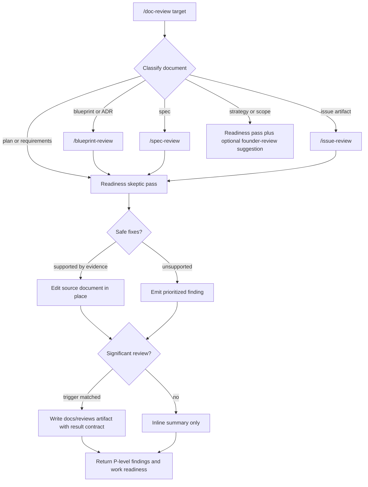
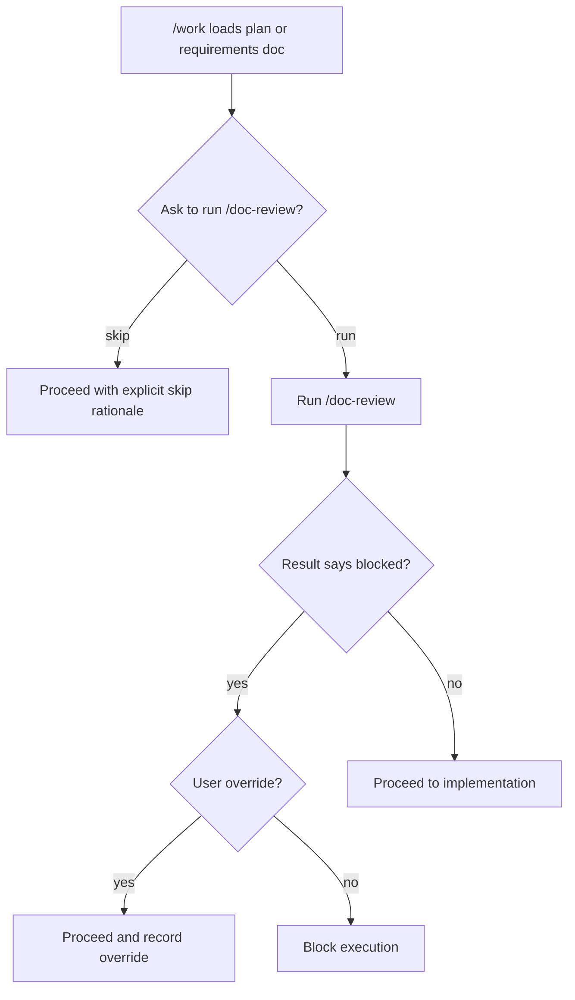

# feat: Add Infiquetra doc-review

## Summary

Add `/doc-review` to `infiquetra-loop` as an implementation-readiness skeptic for plans,
requirements documents, formal SDLC artifacts, and strategy or scope documents that are about
to drive implementation. The command should apply narrow safe fixes in place, report remaining
findings as `P0` / `P1` / `P2` / `P3`, and let `/work` prompt for review before executing from
a plan or requirements document.

---

## Problem Frame

`infiquetra-loop` currently covers ideation, brainstorming, planning, work execution, QA, code
review, founder review, optimization, retro, and resume, but it does not replace the frequent
Compound Engineering `/ce-doc-review` workflow. The missing job is not generic prose review.
It is readiness review for documents that will drive implementation.

The plan is sourced from `docs/brainstorms/2026-05-29-infiquetra-loop-doc-review-requirements.md`.

---

## Requirements

**Command surface**

- R1. `infiquetra-loop` exposes `/doc-review` as the primary command.
- R2. No `/ce-doc-review` compatibility alias is added.
- R3. The command accepts a document path and asks for a path when the target is ambiguous.

**Review behavior**

- R4. `/doc-review` classifies formal SDLC artifacts, plans, requirements documents, and
  strategy or scope documents.
- R5. Formal SDLC artifacts route through the matching `blueprint-reviewer` workflow first,
  then receive the readiness-skeptic pass.
- R6. Plans and requirements documents run the readiness-skeptic pass directly.
- R7. Strategy or scope documents receive readiness review when they are about to drive
  implementation, with `/founder-review` suggested as an optional additional lens when
  product or ambition risk is prominent.
- R8. The readiness-skeptic pass checks verification, assumptions, requirement mappings,
  completeness, open implementation choices, and adversarial failure modes.

**Mutation and output**

- R9. Safe auto-fixes are enabled by default and edit the reviewed document in place.
- R10. Unsafe or unsupported changes are reported as findings instead of applied.
- R11. Remaining findings use `P0` / `P1` / `P2` / `P3` priorities.
- R12. Significant reviews write durable artifacts under `docs/reviews/`.
- R13. Durable review artifacts include a stable review-result contract: target path,
  reviewed revision when available, blocked status, finding priorities and statuses, artifact
  path, and override rationale when applicable.

**Loop integration**

- R14. `/work` asks whether to run `/doc-review` before executing from a plan or requirements
  document.
- R15. Unresolved `P0` or `P1` findings block `/work` unless the user explicitly overrides.
- R16. Issue-attached work can summarize doc-review fixes, findings, block status, and review
  artifact links in progress comments.
- R17. README, changelog, marketplace entry, and plugin metadata make `/doc-review`
  discoverable after installation.

---

## Key Technical Decisions

- **Skill-first implementation with explicit contracts:** Implement `/doc-review` as a command
  plus skill, matching the existing `infiquetra-loop` pattern. v1 uses explicit classification
  precedence and examples in the skill rather than a deterministic classifier script, but it
  does update `scripts/issue_progress.py` because issue-comment rendering is already mechanical.
- **Router plus skeptic pass:** Use routing language inside the skill rather than splitting
  into multiple commands. This preserves one user-facing command while keeping
  `blueprint-reviewer`, `/code-review`, and `/founder-review` ownership clear.
- **No CE alias:** Do not add `/ce-doc-review`. The plugin should migrate daily workflow to the
  Infiquetra command surface rather than preserving CE command names.
- **Safe fixes in place:** The skill should instruct agents to edit the source document only
  when the document itself, linked source, or local repository evidence supports the fix. This
  preserves the useful CE behavior without authorizing speculative rewriting.
- **P-level gate language with durable result shape:** Findings are reported primarily as
  priorities. A readiness summary may be included, but `/work` gating keys on unresolved `P0`
  and `P1` findings from same-session output or the latest matching `docs/reviews/` artifact.
  Overrides require an explicit rationale that can be carried into issue progress or
  work-session notes.
- **Sequential SDLC review:** Formal SDLC artifacts run `blueprint-reviewer` first, then the
  readiness-skeptic pass. After the formal delegate runs, `/doc-review` re-reads the target
  document, collects any review log or delegate artifact, and includes unresolved formal
  findings in the readiness summary without reclassifying them as readiness findings. Joining
  the rubric systems is future work after v1 usage proves the right boundary.
- **Concrete artifact triggers:** v1 treats a review as significant when it has any `P0` or
  `P1`, any safe fix edits the document, any formal SDLC delegate runs, any issue-attached
  lifecycle flow is active, or more than three findings remain after fixes.

---

## High-Level Technical Design





---

## Output Structure

```text
plugins/infiquetra-loop/
  commands/
    doc-review.md
  skills/
    doc-review/
      SKILL.md
  scripts/
    issue_progress.py

docs/
  plans/
    2026-05-29-001-feat-infiquetra-doc-review-plan.md
  reviews/
    <runtime review artifacts with target, revision, blocked, findings, and override fields>
```

---

## Implementation Units

### U1. Add the doc-review command and skill

- **Goal:** Create the primary `/doc-review` command and skill with target resolution,
  document classification, review lenses, safe-fix rules, P-level findings, and durable
  artifact thresholds.
- **Requirements:** R1, R2, R3, R4, R8, R9, R10, R11, R12, R13.
- **Dependencies:** None.
- **Files:**
  - `plugins/infiquetra-loop/commands/doc-review.md`
  - `plugins/infiquetra-loop/skills/doc-review/SKILL.md`
  - `tests/test_infiquetra_loop_plugin.py`
- **Approach:** Follow the existing command wrappers such as
  `plugins/infiquetra-loop/commands/code-review.md` and skill docs such as
  `plugins/infiquetra-loop/skills/code-review/SKILL.md`. The command should load the
  skill and pass through arguments. The skill should be explicit that safe fixes are
  allowed only when evidence supports them. Document a stable review-result contract for
  durable artifacts, including target path, reviewed revision when available, blocked status,
  finding priorities and statuses, artifact path, and override rationale when applicable.
  Define concrete artifact triggers: any `P0` or `P1`, any applied edit, any formal SDLC
  delegate, any issue-attached flow, or more than three remaining findings.
- **Patterns to follow:** Existing `infiquetra-loop` command/skill pairing and frontmatter
  naming conventions.
- **Test scenarios:**
  - Assert `plugins/infiquetra-loop/commands/doc-review.md` exists.
  - Assert `plugins/infiquetra-loop/skills/doc-review/SKILL.md` has frontmatter name
    `doc-review`.
  - Assert the skill text includes safe in-place fixes, unsafe finding behavior,
    `P0` / `P1` / `P2` / `P3`, and `docs/reviews/`.
  - Assert the skill defines the review-result contract fields and concrete artifact triggers.
  - Assert the command set intentionally does not include `ce-doc-review`.
- **Verification:** Contract tests prove the plugin package includes the command and skill,
  and the skill documents the required behavior.

### U2. Document SDLC routing and specialized review ownership

- **Goal:** Make `/doc-review` route formal SDLC artifacts through `blueprint-reviewer`
  first, while keeping readiness review as the second pass.
- **Requirements:** R4, R5, R6, R7.
- **Dependencies:** U1.
- **Files:**
  - `plugins/infiquetra-loop/skills/doc-review/SKILL.md`
  - `tests/test_infiquetra_loop_plugin.py`
- **Approach:** Add routing rules for blueprint sections, ADRs, specs, and issue artifacts.
  Reference `/blueprint-review`, `/spec-review`, and `/issue-review` as the formal rubric
  delegates. Define classification precedence in the skill: explicit user command context first,
  then known SDLC paths or identifiers, then content-shape signals, then path tie-breakers.
  Include representative examples for blueprint/ADR, spec, issue, plan, requirements, and
  strategy/scope documents. Keep the language advisory when a delegate is unavailable: say what
  is missing and continue with readiness review where safe. After any formal delegate runs,
  re-read the target document, collect the delegate artifact or appended review log when present,
  and include unresolved formal findings in the readiness summary without turning them into
  readiness findings.
- **Patterns to follow:** `plugins/blueprint-reviewer/commands/blueprint-review.md`,
  `plugins/blueprint-reviewer/commands/spec-review.md`, and
  `plugins/blueprint-reviewer/commands/issue-review.md`.
- **Test scenarios:**
  - Assert the doc-review skill names `blueprint-reviewer`.
  - Assert the skill references `/blueprint-review`, `/spec-review`, and `/issue-review`.
  - Assert the skill describes the second readiness-skeptic pass after formal review.
  - Assert the skill documents classification precedence and representative route examples.
  - Assert the skill documents the formal-delegate handoff boundary.
  - Assert the skill mentions `/founder-review` as optional for strategy or scope risk.
- **Verification:** Tests prove the route ownership is documented in the package contract.

### U3. Integrate doc-review into loop and work behavior

- **Goal:** Make `infiquetra-loop` offer `/doc-review` before executing from plans or
  requirements documents and block `/work` on unresolved `P0` or `P1` findings unless
  explicitly overridden.
- **Requirements:** R14, R15, R16.
- **Dependencies:** U1.
- **Files:**
  - `plugins/infiquetra-loop/skills/work/SKILL.md`
  - `plugins/infiquetra-loop/skills/loop/SKILL.md`
  - `plugins/infiquetra-loop/scripts/issue_progress.py`
  - `tests/test_infiquetra_loop_plugin.py`
- **Approach:** Update `/work` guidance to prompt before execution when the active artifact
  is a plan or requirements document. Update `/loop` gates so doc-review is part of the
  review vocabulary, while still remaining explicit and user-approved. Extend
  `scripts/issue_progress.py` so rendered progress comments can include doc-review fixes,
  remaining findings, block status, override rationale, and review artifact links. `/work`
  should consume same-session review output or the latest matching `docs/reviews/` artifact;
  when a user overrides a block, the override rationale must be recorded in issue progress or
  work-session notes.
- **Patterns to follow:** Existing `/work` issue-progress and test-gate language in
  `plugins/infiquetra-loop/skills/work/SKILL.md` and existing `/loop` gate wording in
  `plugins/infiquetra-loop/skills/loop/SKILL.md`.
- **Test scenarios:**
  - Assert `/work` says it asks whether to run `/doc-review` before executing from a plan
    or requirements document.
  - Assert `/work` blocks on unresolved `P0` or `P1` findings unless the user overrides.
  - Assert `/loop` mentions doc-review in review gates without making it automatic.
  - Assert `issue_progress.render_issue_comment` can render doc-review fixes, remaining
    findings, block status, override rationale, and review artifact links.
  - Assert issue-progress guidance includes review artifact links and doc-review findings.
- **Verification:** Contract tests cover the prompt and blocking behavior documented in the
  lifecycle skills.

### U4. Update package metadata and user-facing docs

- **Goal:** Make the new command discoverable in plugin metadata, README, changelog, and
  marketplace keywords.
- **Requirements:** R1, R17.
- **Dependencies:** U1, U2, U3.
- **Files:**
  - `plugins/infiquetra-loop/.claude-plugin/plugin.json`
  - `.claude-plugin/marketplace.json`
  - `plugins/infiquetra-loop/README.md`
  - `plugins/infiquetra-loop/CHANGELOG.md`
  - `tests/test_infiquetra_loop_plugin.py`
- **Approach:** Add `doc-review` to keywords and command documentation. Keep the plugin
  version unchanged unless the repository's current release policy requires a version bump
  for command additions. Update tests so marketplace and plugin metadata remain aligned.
- **Patterns to follow:** Current `infiquetra-loop` metadata and README command list.
- **Test scenarios:**
  - Assert plugin metadata includes `doc-review` in keywords.
  - Assert marketplace entry remains version-aligned with plugin metadata.
  - Assert README lists `/doc-review`.
  - Assert changelog mentions the new command and loop/work integration.
- **Verification:** Contract tests and diff review show the command is discoverable.

### U5. Preserve engineering-journal traceability

- **Goal:** Keep the existing journal queue accurate when the feature ships.
- **Requirements:** Repository engineering-journal maintenance policy; no direct origin R-ID.
- **Dependencies:** U1, U2, U3, U4.
- **Files:**
  - `docs/engineering-journal/QUEUED.md`
  - `docs/engineering-journal/ARCHIVE.md`
  - `docs/engineering-journal/DECISIONS.md`
- **Approach:** When implementation completes, split the queued doc-review item rather than
  moving it wholesale if it still contains unshipped ideas. Archive only the shipped `/doc-review`
  scope. Keep or revise unshipped queue items such as compatibility aliases, automatic
  execution, unified rubric work, richer artifacts, or future deterministic classification.
  Add a `DECISIONS.md` entry only if implementation commits a durable plugin-pattern decision
  beyond the requirements already documented here, such as changing plugin version policy.
- **Patterns to follow:** The entry format documented at the top of
  `docs/engineering-journal/QUEUED.md`.
- **Test scenarios:** Test expectation: none -- this is durable documentation maintenance.
- **Verification:** Diff review confirms the queue does not retain the shipped scope, unshipped
  follow-up ideas remain queued or archived as rejected, and any pattern decision is documented.

---

## Scope Boundaries

### In Scope

- `/doc-review` command and skill.
- Safe in-place fixes documented as the default.
- `P0` / `P1` / `P2` / `P3` findings.
- Formal SDLC delegate routing followed by readiness review.
- `/work` prompt and `P0` / `P1` block behavior.
- Review-result contract fields and concrete `docs/reviews/` artifact triggers.
- Issue-progress rendering support for doc-review summaries.
- README, changelog, marketplace/plugin metadata, and contract tests.

### Out Of Scope

- `/ce-doc-review` alias.
- A merged `blueprint-reviewer` plus `/doc-review` rubric engine.
- Generic GitHub helpers, cleanup utilities, or CE plugin management.
- Automatic `/doc-review` execution without asking the user.
- Runtime mutation of issue state by `/doc-review` itself. Issue comments stay owned by
  `sdlc-manager` and loop/work progress behavior; this plan only extends the renderer data
  that loop/work can pass to that owner.

### Deferred to Follow-Up Work

- Join `blueprint-reviewer` and `/doc-review` into a unified review experience after v1
  usage clarifies the right boundary.
- Add a deterministic classification helper only if explicit v1 precedence and examples prove
  too inconsistent in real use.
- Consider richer review artifact templates once real `docs/reviews/` output examples exist.

---

## Risks & Dependencies

- **Ambiguous ownership with `blueprint-reviewer`:** Mitigate by making formal rubric review
  delegate first and readiness review second, with clear wording in the skill.
- **Unsafe auto-fixes:** Mitigate with narrow safe-fix criteria and a hard rule that unsupported
  changes become findings.
- **Classification drift:** Mitigate with explicit precedence and representative examples in the
  skill. Revisit deterministic classification only if real runs route the same artifact
  differently.
- **Gating drift after resume:** Mitigate with the durable review-result contract and `/work`
  reading same-session output or the latest matching `docs/reviews/` artifact.
- **Loop gate friction:** Mitigate by asking before `/doc-review`; do not make it automatic.

---

## Documentation and Operational Notes

- The README command list should include `/doc-review` near `/code-review`.
- The changelog should describe the command as a plan and requirements readiness review.
- Runtime review artifacts belong under `docs/reviews/` in target repositories. v1 does not
  require a static template file, but the skill must document the stable fields every significant
  review artifact contains.
- `.claude/infiquetra-loop/` remains ignored local state and should not hold durable review
  output.

---

## Sources and Research

- Origin requirements: `docs/brainstorms/2026-05-29-infiquetra-loop-doc-review-requirements.md`.
- Idea source: `docs/ideation/2026-05-29-infiquetra-loop-doc-review.md`.
- Current command pattern: `plugins/infiquetra-loop/commands/code-review.md`.
- Current skill pattern: `plugins/infiquetra-loop/skills/code-review/SKILL.md`.
- Loop gate pattern: `plugins/infiquetra-loop/skills/loop/SKILL.md`.
- Work execution pattern: `plugins/infiquetra-loop/skills/work/SKILL.md`.
- Contract test pattern: `tests/test_infiquetra_loop_plugin.py`.
- Formal SDLC review delegates:
  - `plugins/blueprint-reviewer/commands/blueprint-review.md`
  - `plugins/blueprint-reviewer/commands/spec-review.md`
  - `plugins/blueprint-reviewer/commands/issue-review.md`
