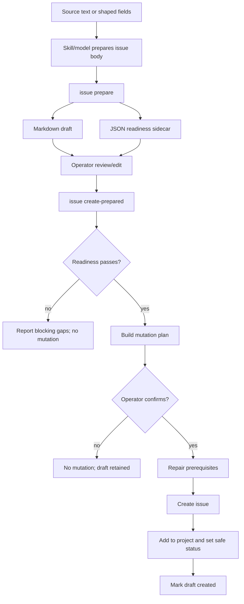
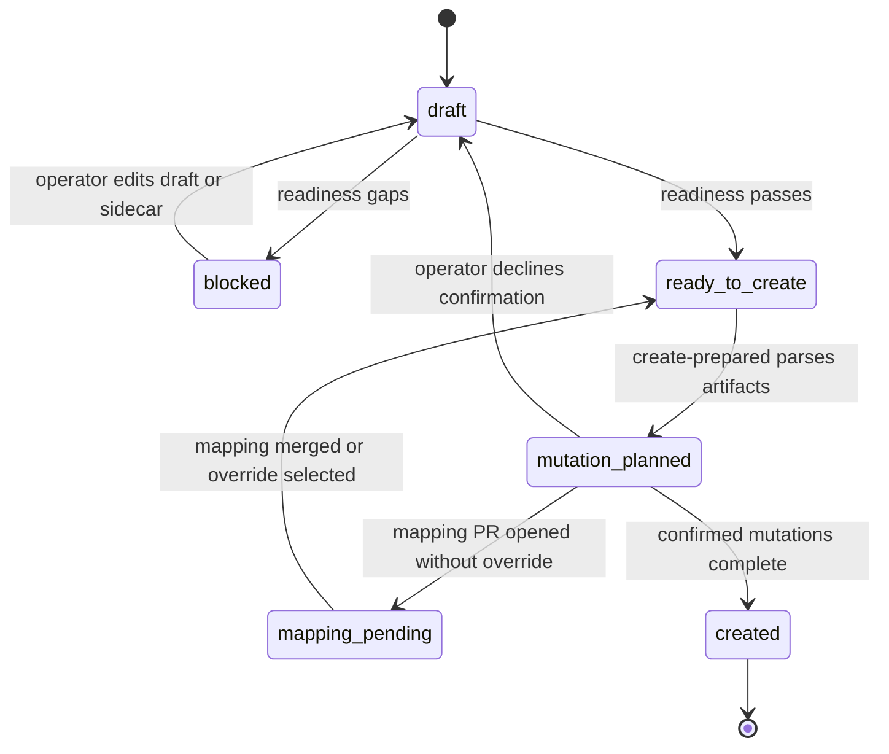

# feat: Add SDLC issue prepare workflow

## Summary

Add a team-aware prepared-issue workflow to `sdlc-manager` so source text can become
reviewable Asgard or Mount Olympus issue drafts before any GitHub mutation. The workflow adds
`issue prepare` for draft/readiness artifacts and `issue create-prepared` for confirmed creation,
repo prerequisite repair, board placement, safe status assignment, and draft state recording.

---

## Problem Frame

`sdlc-manager` already knows about the current Jeff Intent, Asgard, and Mount Olympus boards,
template labels, repo mappings, project fields, and the strict actionable body validator. The
missing path is the one operators actually need before pointing agent teams at work: take rough
source text, make the target team and project explicit, produce a draft that can be reviewed, and
only then create an issue that will not fail the intended team's pre-checks.

The plan is sourced from
`docs/brainstorms/2026-05-30-sdlc-manager-issue-prepare-requirements.md`. It covers the full v1
brainstorm scope, including creation and self-healing repo prerequisites, while keeping rough-source
interpretation in skills/docs and deterministic validation/mutation in the CLI.

---

## Requirements

**Prepared draft artifacts**

- R1. `issue prepare` accepts source from a prompt argument, stdin, or `--source-file`, and writes a
  markdown draft under `docs/sdlc-issue-drafts/`.
- R2. Each prepared draft has a JSON sidecar with repo, issue type, team, project, readiness
  profile, blocking gaps, warnings, and draft lifecycle state.
- R3. Incomplete source still writes a draft and sidecar, but marks blocking readiness gaps.
- R4. Drafts with blocking gaps cannot be created until the markdown and sidecar pass validation.

**Team readiness**

- R5. Asgard readiness accepts shaping-quality issue drafts that state intent, target
  repo/surface, mode, constraints, risk, and promotion gaps.
- R6. Mount Olympus readiness requires the strict actionable issue body shape: required H3
  sections, checklist acceptance criteria, path-like expected files, fenced verification,
  actionable labels, project presence, author risk visibility, and safe status.
- R7. An Asgard-shaped draft is not treated as Olympus-ready unless the Olympus profile passes.
- R8. The workflow never auto-moves a newly created issue to `Ready`; safe defaults are
  `Shaping` for Asgard and `Backlog` for Mount Olympus.

**Confirmed creation and repair**

- R9. `issue create-prepared <draft>` parses the markdown draft and JSON sidecar, then shows a
  complete mutation plan before any GitHub or mapping mutation.
- R10. The mutation plan includes label/template deployment, mapping repair, issue creation, board
  add, status setting, and draft update steps when applicable.
- R11. Missing labels/templates are deployed directly to the target repo after confirmation.
- R12. Missing project mappings trigger a branch-and-PR mapping update flow before issue creation
  continues by default.
- R13. An explicit override can create the issue before the mapping PR merges, using the requested
  project and recording the pending mapping state on the draft.
- R14. Successful creation retains the draft and records issue URL, number, timestamp, and mutation
  summary.

**Natural-language and documentation**

- R15. Natural-language skill guidance routes prompts like "create an Olympus issue from this" to
  prepare plus create-prepared, not directly to the existing browser-backed create flow.
- R16. Team and project are first-class inputs. Skills may infer them from clear language but must
  ask when ambiguous.
- R17. Documentation distinguishes the existing interactive `issue create` flow from the prepared
  draft workflow.

**Validation**

- R18. Parser/readiness tests cover draft parsing, sidecar parsing, Asgard readiness, Olympus
  readiness, blocked create, safe status defaults, and draft lifecycle transitions.
- R19. Mocked mutation tests cover mutation-plan construction, label/template deployment, mapping
  PR flow, issue creation, board add, status setting, override, and draft-created updates.
- R20. Prompt/reference drift tests cover natural-language routing and the new command
  documentation.

---

## Key Technical Decisions

- **Extend the existing `issue` command group instead of adding a separate plugin command group:**
  The current CLI already owns issue creation, project routing, field setting, labels, templates,
  and validation. Adding `issue prepare` and `issue create-prepared` keeps the public surface
  discoverable without disturbing the existing interactive `issue create` flow.
- **Use draft artifacts as the handoff boundary:** The markdown draft is human-editable review
  material. The JSON sidecar is the deterministic contract consumed by `create-prepared`. This
  keeps model-shaped prose out of mutation code while giving the CLI enough structure to block bad
  creates.
- **Treat Asgard and Mount Olympus as readiness profiles, not issue types:** The six existing SDLC
  issue types stay canonical. Team-specific differences live in readiness checks, default status,
  board/project targeting, and draft guidance.
- **Keep source interpretation out of `sdlc_manager.py`:** `issue prepare` accepts already-shaped
  fields and source text, but the skill layer is responsible for turning vague prompts into draft
  content. The CLI validates, serializes, builds mutation plans, and performs confirmed mutations.
- **Centralize mutation planning before side effects:** `create-prepared` should build one
  structured mutation plan and render it for confirmation before running any GitHub or mapping
  operation. This makes direct repo repair, mapping PR work, issue creation, and draft updates
  reviewable as one decision.
- **Repair labels/templates directly, but repair mappings through a PR:** Label and template
  deployment already has direct repo helpers. Project mapping changes affect canonical routing, so
  default behavior should branch, commit, push, and open a PR before issue creation proceeds.
- **Prefer live project field discovery for status setting:** Existing `flow set-field` behavior
  resolves fields/options live. `create-prepared` should reuse that posture for safe status
  assignment rather than caching option IDs.

---

## High-Level Technical Design





---

## Output Structure

```text
docs/
  sdlc-issue-drafts/
    <generated issue drafts and JSON sidecars>

plugins/sdlc-manager/
  scripts/
    sdlc_manager.py
  commands/
    sdlc-create.md
  skills/
    sdlc-issues/
      SKILL.md
      references/
        issue-types.md
  tests/
    test_issue_prepare.py
    test_issue_create_prepared.py
    test_prompt_alignment.py
```

---

## Implementation Units

### U1. Define prepared draft data contracts

- **Goal:** Add deterministic draft, sidecar, readiness result, and mutation plan structures that
  can be used by parser, readiness, and create-prepared code without mixing in GitHub side effects.
- **Requirements:** R1, R2, R3, R4, R9, R10, R14, R18.
- **Dependencies:** None.
- **Files:**
  - `plugins/sdlc-manager/scripts/sdlc_manager.py`
  - `plugins/sdlc-manager/tests/test_issue_prepare.py`
- **Approach:** Introduce small typed structures near the existing issue helpers for prepared
  draft metadata, readiness gaps, lifecycle state, and mutation plan steps. Keep the structures
  serializable with stdlib JSON and compatible with existing zero-extra-dependency CLI style.
  Define lifecycle states such as draft, blocked, ready_to_create, mapping_pending, and created.
  Store only stable data in the sidecar: repo, type, team, project, draft path, readiness profile,
  expected labels, author-visible risk fields, gap lists, timestamps, planned side-effect
  summaries, and created issue result fields.
- **Patterns to follow:** Existing typed exception/data helper style in
  `plugins/sdlc-manager/scripts/sdlc_manager.py`; existing test import pattern in
  `plugins/sdlc-manager/tests/test_issue_create_interactive.py`.
- **Test scenarios:**
  - Serialize and parse a sidecar for an Asgard draft with no blocking gaps.
  - Serialize and parse a sidecar for an Olympus draft with blocking verification and files gaps.
  - Reject sidecar content whose draft path, repo, team, project, or issue type conflicts with the
    markdown draft metadata.
  - Preserve created issue URL, number, timestamp, and mutation summary when marking a draft
    created.
  - Treat missing or malformed sidecar JSON as a blocking create-prepared error with no mutation.
- **Verification:** Unit tests prove the artifact contract round-trips, rejects inconsistent
  state, and can record created-state metadata without GitHub calls.

### U2. Implement draft parsing and team readiness profiles

- **Goal:** Parse prepared markdown drafts and evaluate them against Asgard or Mount Olympus
  readiness without performing mutations.
- **Requirements:** R3, R4, R5, R6, R7, R8, R18.
- **Dependencies:** U1.
- **Files:**
  - `plugins/sdlc-manager/scripts/sdlc_manager.py`
  - `plugins/sdlc-manager/tests/test_issue_prepare.py`
  - `plugins/sdlc-manager/tests/test_card_validator.py`
- **Approach:** Reuse `validate_card_body` for the strict Olympus actionable body checks rather
  than duplicating the H3/checklist/path/code-block rules. Add a separate Asgard profile focused on
  shaping readiness fields and promotion gaps. The readiness result should distinguish blocking
  gaps from warnings and should report Olympus promotion gaps for Asgard drafts without blocking
  Asgard creation. Olympus readiness should also validate expected actionable labels, project
  presence, and author-visible risk fields from the sidecar or draft metadata before treating the
  draft as dispatch-ready. Status validation should enforce safe defaults only and reject `Ready`.
- **Patterns to follow:** Existing card validator shim and tests in
  `plugins/sdlc-manager/tests/test_card_validator.py`; schema-backed status helpers such as
  `_project_workflow` and `_status_order`.
- **Test scenarios:**
  - Covers AE1. Olympus draft without fenced verification fails readiness and cannot create.
  - Covers AE2. Asgard shaping draft with intent, repo, mode, constraints, and risk passes Asgard
    readiness while reporting Olympus promotion gaps.
  - Olympus draft with all required H3 sections, checklist acceptance criteria, path-like files,
    and fenced verification passes readiness.
  - Asgard-shaped draft targeting Mount Olympus fails the Olympus profile.
  - Draft or sidecar requesting `Ready` status fails for both Asgard and Mount Olympus.
  - Olympus sidecar missing expected actionable labels, project, or author-visible risk metadata
    fails readiness before creation.
  - Non-actionable issue types are not accidentally treated as dispatch-ready actionable tasks.
- **Verification:** Readiness unit tests prove the two profiles are visibly different and that
  Olympus checks keep parity with the existing card validator.

### U3. Add `issue prepare` command

- **Goal:** Add the dry-run preparation command that writes markdown and JSON artifacts under
  `docs/sdlc-issue-drafts/`.
- **Requirements:** R1, R2, R3, R4, R5, R6, R15, R16, R18.
- **Dependencies:** U1, U2.
- **Files:**
  - `plugins/sdlc-manager/scripts/sdlc_manager.py`
  - `plugins/sdlc-manager/tests/test_issue_prepare.py`
  - `plugins/sdlc-manager/README.md`
  - `plugins/sdlc-manager/CHANGELOG.md`
- **Approach:** Add an `issue prepare` argparse branch with explicit `--repo`, `--type`, `--team`,
  and `--project` inputs plus source text from an argument, stdin, or `--source-file`. The command
  should normalize inputs, write a stable filename, write the sidecar next to the markdown draft,
  run readiness, and print the draft path plus blocking gaps. Ambiguous team/project inference
  belongs in the skill layer, so the deterministic CLI should require explicit values unless a
  direct flag supplies them.
- **Execution note:** Implement the parser and readiness behavior test-first before adding the CLI
  branch.
- **Patterns to follow:** Existing argparse grouping for `issue create`; README command reference
  style under `plugins/sdlc-manager/README.md`.
- **Test scenarios:**
  - Source text supplied as a positional prompt creates markdown and JSON sidecar with equivalent
    readiness output.
  - Source text supplied through `--source-file` creates the same artifact shape.
  - Stdin source creates the same artifact shape when no prompt or source file is provided.
  - Missing required repo/type/team/project inputs fail before artifact creation in CLI mode.
  - Existing draft filenames are not overwritten accidentally; a unique suffix or timestamp is
    used.
  - Blocking gaps are printed and persisted in the sidecar for incomplete input.
- **Verification:** CLI-level tests and direct helper tests prove preparation is mutation-free,
  writes both artifacts, and reports readiness consistently across input sources.

### U4. Build mutation planning and confirmed `issue create-prepared`

- **Goal:** Add the create command that consumes a prepared draft, blocks invalid drafts, renders a
  full mutation plan, and only mutates after explicit confirmation.
- **Requirements:** R4, R8, R9, R10, R14, R19.
- **Dependencies:** U1, U2, U3.
- **Files:**
  - `plugins/sdlc-manager/scripts/sdlc_manager.py`
  - `plugins/sdlc-manager/tests/test_issue_create_prepared.py`
- **Approach:** Add an `issue create-prepared` argparse branch that loads the markdown and sidecar,
  re-runs readiness, constructs a mutation plan, renders every side effect, and asks for final
  confirmation. The mutation executor should call composable helpers for each step so tests can
  mock GitHub operations. Successful creation should update the sidecar and annotate the markdown
  draft with the created issue result. Project placement and status setting should use the
  requested project from the prepared draft directly, including mapping-override cases, instead of
  falling back to repo-based project discovery after issue creation. A declined confirmation leaves
  the draft unchanged except for any explicit non-mutating validation output.
- **Execution note:** Start with blocked-create and declined-confirmation tests before wiring real
  mutation helpers.
- **Patterns to follow:** Existing `_apply_post_create_metadata` sequencing and isolation; existing
  `flow_set_field`, `board_add`, and label/template deployment helpers.
- **Test scenarios:**
  - Covers AE1. Draft with blocking readiness gaps refuses to create and calls no GitHub helpers.
  - Passing draft renders a mutation plan containing issue creation, board add, safe status, and
    draft update.
  - Operator declines confirmation and no mutation helper is called.
  - Successful Mount Olympus create sets safe status `Backlog`, not `Ready`.
  - Successful Asgard create sets safe status `Shaping`, not `Ready`.
  - Board add and status setting use the prepared draft's requested project even when repo mapping
    is missing or still pending.
  - Issue creation failure does not mark the draft created.
  - Draft update failure is reported after issue creation without hiding the created issue URL.
- **Verification:** Mocked mutation tests prove side effects happen only after confirmation and that
  draft lifecycle updates reflect the actual mutation result.

### U5. Add repo prerequisite repair and mapping PR flow

- **Goal:** Teach create-prepared to repair missing labels/templates directly and handle missing
  project mappings through branch-and-PR work with an explicit override.
- **Requirements:** R10, R11, R12, R13, R19.
- **Dependencies:** U4.
- **Files:**
  - `plugins/sdlc-manager/scripts/sdlc_manager.py`
  - `plugins/sdlc-manager/tests/test_issue_create_prepared.py`
  - `plugins/sdlc-manager/tests/test_project_mappings_resolution.py`
- **Approach:** Factor existing gap-analysis logic into reusable checks for labels, templates, and
  project mapping. Use the existing label/template deployment helpers for direct repo repair. Add
  mapping-repair helpers that prefer the external `infiquetra-sdlc` checkout when available and
  otherwise update the vendored mapping with a warning. Mapping repair should create a branch,
  commit, push, and open a PR before stopping by default. The override path creates the issue using
  the requested project directly and records the pending mapping state.
- **Execution note:** Treat this as high-risk relative to the rest of the feature; keep GitHub and
  git operations behind mocked helper boundaries first.
- **Patterns to follow:** `_resolve_project_mappings`, `_VENDORED_PROJECT_MAPPINGS_PATH`,
  `rollout_gap_analysis`, `rollout_deploy_labels`, `rollout_deploy_templates`, and existing
  `board add --project` support.
- **Test scenarios:**
  - Covers AE3. Missing labels/templates appear in the mutation plan and are deployed after
    confirmation before issue creation.
  - Covers AE4. Missing mapping creates a mapping branch/PR and stops before issue creation when no
    override is selected.
  - Covers AE5. Override creates the issue with the requested project and records pending mapping
    state in the sidecar.
  - External mapping checkout wins over vendored mapping for repair when present.
  - Vendored mapping repair warns clearly when no external checkout is available.
  - Mapping PR creation failure stops issue creation and preserves draft state.
- **Verification:** Mocked tests prove prerequisite repair ordering, mapping stop/override behavior,
  and no hidden default-branch mapping writes.

### U6. Update skill, command, and agent guidance for natural-language routing

- **Goal:** Make natural-language use first-class and prevent agents from bypassing prepared-draft
  readiness checks when the user asks to create Asgard or Olympus issues from text.
- **Requirements:** R15, R16, R17, R20.
- **Dependencies:** U3, U4, U5.
- **Files:**
  - `plugins/sdlc-manager/skills/sdlc-issues/SKILL.md`
  - `plugins/sdlc-manager/commands/sdlc-create.md`
  - `plugins/sdlc-manager/agents/sdlc-operator.md`
  - `plugins/sdlc-manager/tests/test_prompt_alignment.py`
- **Approach:** Update prompt guidance to describe two issue-creation paths: existing interactive
  browser-backed creation for already-known work, and prepared-draft creation for source-text or
  team-readiness-driven work. Add examples for "create an Asgard issue from this text" and "create
  an Olympus issue from this text" that route through prepare plus create-prepared. Make team and
  project inference rules explicit and require an ask when ambiguous.
- **Patterns to follow:** Existing prompt/reference drift guards in
  `plugins/sdlc-manager/tests/test_prompt_alignment.py`.
- **Test scenarios:**
  - Prompt alignment test asserts natural-language Asgard/Olympus issue creation routes through
    prepared draft workflow.
  - Prompt alignment test asserts existing `issue create` remains documented for interactive
    template creation.
  - Prompt alignment test asserts ambiguous team/project prompts must ask rather than guess.
  - Command documentation includes both `issue prepare` and `issue create-prepared` examples.
- **Verification:** Drift guard tests prove docs and prompts teach the new route without erasing
  the old route.

### U7. Update release metadata and operator docs

- **Goal:** Make the new workflow discoverable after plugin installation and keep release metadata
  consistent.
- **Requirements:** R17, R20.
- **Dependencies:** U3, U4, U5, U6.
- **Files:**
  - `plugins/sdlc-manager/README.md`
  - `plugins/sdlc-manager/CHANGELOG.md`
  - `plugins/sdlc-manager/.claude-plugin/plugin.json`
  - `.claude-plugin/marketplace.json`
  - `plugins/sdlc-manager/tests/test_prompt_alignment.py`
- **Approach:** Add README examples for prepare and create-prepared, document the draft directory,
  summarize safe statuses and mapping-repair behavior, and add a changelog entry. If this ships as
  a plugin release, bump the plugin manifest and marketplace entry together and update the metadata
  drift guard to the new version.
- **Patterns to follow:** The `1.5.0` changelog/metadata bump pattern and existing marketplace
  drift guard in `plugins/sdlc-manager/tests/test_prompt_alignment.py`.
- **Test scenarios:**
  - Metadata test asserts plugin manifest and marketplace versions match after any bump.
  - README contains prepare/create-prepared usage and draft directory guidance.
  - Changelog documents the new workflow, safe defaults, and mapping PR behavior.
  - Marketplace description remains under validator limits and mentions prepared issue workflow
    only if the description still reads cleanly.
- **Verification:** Prompt alignment and metadata tests prove installed plugin docs, manifest, and
  marketplace registration stay in sync.

---

## Acceptance Examples

- AE1. **Olympus draft blocks on missing verification:** A draft with no fenced verification command
  is written with blocking gaps, and `issue create-prepared` refuses to mutate.
- AE2. **Asgard draft accepts shaping-quality input:** A draft with intent, repo, mode,
  constraints, and risk can pass Asgard readiness while listing Olympus promotion gaps.
- AE3. **Create deploys missing labels/templates after confirmation:** The mutation plan lists
  prerequisite repair and runs it only after confirmation.
- AE4. **Missing mapping opens PR and stops:** Mapping repair is opened as a PR and issue creation
  waits by default.
- AE5. **Mapping override creates before merge:** Explicit override creates the issue and records
  pending mapping state.
- AE6. **Natural-language creation uses the same path:** Agent guidance routes Asgard/Olympus issue
  creation from source text through prepare plus create-prepared.

---

## System-Wide Impact

- **Public CLI surface:** Adds new subcommands under `issue`, so command docs, README examples, and
  prompt alignment tests need to change with the CLI.
- **GitHub side effects:** `create-prepared` can create issues, deploy labels/templates, add cards
  to projects, set fields, push mapping branches, and open PRs. The mutation plan and confirmation
  gate are the safety boundary.
- **Project routing:** Missing mapping behavior changes from "warn and manual repair" to a
  first-class repair plan. Default behavior still avoids hidden direct default-branch edits.
- **Team workflow semantics:** Asgard and Mount Olympus get explicit readiness profiles and safe
  starting statuses, which reduces accidental early routing to `Ready`.

---

## Scope Boundaries

- Dedicated `QUEUED.md` parsing is out of scope; queued entries are source text.
- Auto-moving issues to `Ready` is out of scope.
- Direct LLM calls from `sdlc_manager.py` are out of scope.
- Replacing the six SDLC issue types is out of scope.
- Hidden repo setup, hidden mapping edits, and direct default-branch mapping pushes are out of
  scope.
- Joining Asgard and Mount Olympus into one issue-readiness profile is out of scope.

### Deferred to Follow-Up Work

- Batch creation from multiple prepared drafts.
- A richer review UI for prepared drafts.
- A deterministic source-text-to-body generator inside the CLI if a future non-model use case
  requires it.
- End-to-end tests against a fixture GitHub project; v1 relies on unit and mocked mutation tests.

---

## Risks & Dependencies

- **GitHub auth and scopes:** Project writes, issue creation, content updates, and PR creation may
  require different `gh` scopes. Mitigate by surfacing failures per mutation step and leaving draft
  state uncreated when critical operations fail.
- **Canonical mapping location drift:** The external `infiquetra-sdlc` checkout may or may not
  contain `config/project-mappings.json`. Keep resolution order explicit and warn when falling back
  to vendored mapping repair.
- **Template drift:** Olympus readiness should reuse `validate_card_body` and existing template
  drift guards so body validation does not fork silently.
- **Partially successful mutation:** Issue creation may succeed while draft annotation fails.
  Preserve and print the issue URL/number so the operator can recover.
- **Prompt overreach:** Natural-language docs must not imply the CLI can infer vague user intent
  without the skill/model layer. Keep deterministic CLI requirements explicit.

---

## Documentation And Operational Notes

- Update `sdlc-issues` guidance to describe when to use existing interactive creation versus
  prepared-draft creation.
- Update `/sdlc-create` docs so natural-language issue creation from source text routes through the
  prepared workflow.
- Document that prepared drafts are durable repo files and may be edited before creation.
- Document that `create-prepared` asks for final confirmation before GitHub or mapping mutations.
- Document the safe default statuses: Asgard `Shaping`, Mount Olympus `Backlog`.

---

## Sources & Research

- `docs/brainstorms/2026-05-30-sdlc-manager-issue-prepare-requirements.md` is the origin and source
  of product scope.
- `docs/ideation/2026-05-30-sdlc-manager-asgard-olympus-issue-readiness.md` records the earlier
  feasibility and design rationale.
- `plugins/sdlc-manager/scripts/sdlc_manager.py` contains the existing issue, board, field, label,
  template, project mapping, and card validator helpers this plan extends.
- `plugins/sdlc-manager/config/sdlc-schema.json` defines current teams, boards, workflows, fields,
  gates, and safe target statuses.
- `plugins/sdlc-manager/config/project-mappings.json` is the current vendored mapping fallback.
- `plugins/sdlc-manager/tests/test_issue_create_interactive.py`,
  `plugins/sdlc-manager/tests/test_card_validator.py`,
  `plugins/sdlc-manager/tests/test_flow_subcommands.py`, and
  `plugins/sdlc-manager/tests/test_project_mappings_resolution.py` show the local test style and
  helper seams to extend.
- `docs/engineering-journal/LEARNINGS.md` records prior prompt/template drift lessons for
  `sdlc-manager`, including the rule that generated/template-backed contracts need drift guards.
