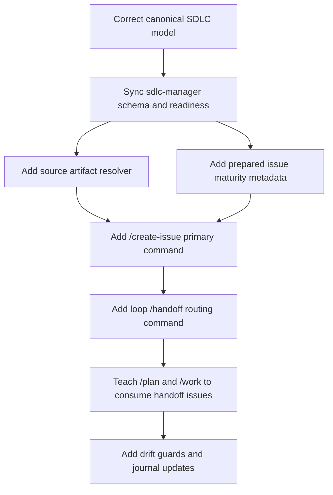
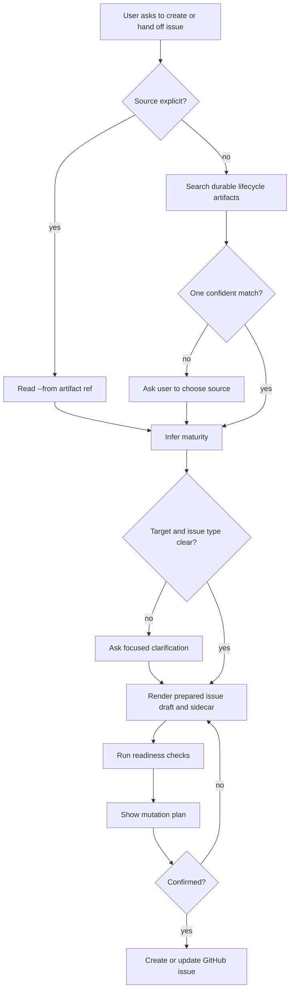

# feat: Add SDLC handoff flow

## Summary

Add a handoff path that lets durable `infiquetra-loop` artifacts become self-contained
SDLC issue artifacts owned by `sdlc-manager`.

The implementation must preserve the ownership boundary:

- `infiquetra-loop` owns lifecycle state, active artifact selection, source-context
  packaging, and "carry forward or hand off" prompts.
- `sdlc-manager` owns issue drafting, readiness, sidecars, confirmation, GitHub mutation,
  labels, board fields, and SDLC schema semantics.
- The canonical SDLC model in `infiquetra-sdlc` must be corrected before the plugin surfaces
  are extended, so the new handoff flow does not encode a stale Asgard to Olympus promotion
  model.

Target repositories:

- Current repo: `infiquetra-claude-plugins`.
- Sibling repo: `infiquetra-sdlc`. Paths prefixed with `infiquetra-sdlc:` are relative to
  that repository root.

This is an epic/parent plan. Individual implementation PRs should ship in the delivery slices
below rather than as one oversized cross-repo change.

Primary source:

- Brainstorm requirements: [docs/brainstorms/2026-05-30-infiquetra-loop-sdlc-handoff-requirements.md](../brainstorms/2026-05-30-infiquetra-loop-sdlc-handoff-requirements.md)

Related context:

- Ideation: [docs/ideation/2026-05-30-infiquetra-loop-sdlc-handoff.md](../ideation/2026-05-30-infiquetra-loop-sdlc-handoff.md)
- Local learning: prepared issue creation needs a reviewable artifact boundary before mutation.
- Home-lab orchestration lesson: do not reimplement native issue and board primitives; add
  source context and readiness around them.

## Problem Frame

The loop currently carries work naturally from ideation to brainstorm to plan to work when
the same human or agent continues the thread. That breaks down when another team or agent
team needs to pick up the work, especially if they do not have `infiquetra-loop` installed.

The desired behavior is not a second lifecycle system. It is a clean handoff bridge:

1. Discover the durable source artifact.
2. Infer or ask for the handoff maturity.
3. Prepare a self-contained SDLC issue artifact.
4. Confirm before mutating GitHub.
5. Let the recipient work the issue with or without `infiquetra-loop`.

This plan also fixes a prerequisite model error: Asgard and Olympus are sibling execution
targets, not a staged Asgard to Olympus funnel. Asgard can carry work to completion. Olympus
can carry work to completion. Cross-team movement happens only when the human explicitly
decides to move an issue.

## Requirements

R1. Correct the canonical Asgard/Olympus model first.

- Active `infiquetra-sdlc` docs and schema must no longer imply that Asgard normally promotes
  work to Olympus.
- Asgard and Olympus must be described as sibling work targets with explicit, human-directed
  transfer when needed.
- Historical dated artifacts may remain historical unless they are reused as active guidance.

R2. Sync the corrected model into `sdlc-manager`.

- `sdlc-manager` schema, prepared issue body rendering, readiness warnings, command docs, skill
  prompts, README, and tests must stop using default Asgard to Olympus promotion language.
- Any remaining cross-team transfer wording must be neutral and explicit.

R3. Make `/create-issue` the primary issue command.

- Add `/create-issue` as the natural user-facing command for creating or preparing issues.
- Keep `/sdlc-create` as a compatibility alias or compatibility command.
- The command should infer the issue type when the user is natural-language casual and should
  accept explicit flags when the user wants to be absolute.

R4. Keep preparation and mutation separate.

- `--prepare` is the canonical non-mutating mode.
- `--draft` is an alias for `--prepare`.
- Creating from a prepared artifact must still show a mutation plan and require confirmation.

R5. Add source artifact input.

- `--from <artifact-ref>` must read an explicit source artifact, including local path,
  GitHub issue/PR URL, branch ref, or resume-state reference.
- Natural language that implies an existing artifact, such as "from the brainstorm" or
  "handoff the plan", must trigger deterministic repo-local artifact search before asking
  the user for a path.
- Ambiguous matches must be surfaced for user selection rather than guessed.

R6. Capture handoff maturity.

- The issue artifact must include enough maturity context for a recipient who does not have
  `infiquetra-loop`.
- Maturity must appear in both the issue body and the prepared issue sidecar.
- Supported maturity values are `idea-ready`, `requirements-ready`, `plan-ready`,
  `resume-ready`, and `deferred-context`.

R7. Make issues self-contained but plugin-aware.

- The body must include source summary, decision context, constraints, acceptance checks,
  next action, and relevant links.
- A short optional hint may say what to run when the recipient does have `infiquetra-loop`,
  for example `/plan <issue>` or `/work <issue>`.
- `/loop` must not be suggested for normal team handoff. It is a human lifecycle command, not
  a recipient execution command.

R8. Add a thin loop-side handoff command.

- `/handoff` should find the current durable artifact, infer maturity, and route to
  `sdlc-manager` issue preparation.
- It must not own issue body templates or GitHub mutation.
- It should ask only when the source artifact, maturity, target repository, target board, or
  target team cannot be inferred with confidence.

R9. Make `/plan <issue>` and `/work <issue>` first-class consumers of handoff issues.

- `/plan <issue>` should recognize issue maturity and create or update a durable plan from
  the issue.
- `/work <issue>` should recognize when the issue is `plan-ready` or `resume-ready` and
  proceed from the issue context.
- When useful, these commands should sync compact status back to the issue without duplicating
  the full plan or work log.

R10. Add drift guards.

- Tests must protect the new command names, preparation behavior, source discovery behavior,
  maturity metadata, and corrected Asgard/Olympus language.
- Validation must include a scoped stale-language scan so "promotion" survives only where it
  means something other than Asgard to Olympus workflow movement.

## Key Decisions

D1. Correct source-of-truth SDLC first, plugin second.

The plugin should not paper over stale canonical language. The first implementation unit
updates active `infiquetra-sdlc` docs and schema so downstream `sdlc-manager` changes can
sync from the corrected model.

D2. Reuse the prepared issue artifact boundary.

`sdlc-manager` already has prepared issue drafts, sidecars, readiness checks, mutation plans,
and create-after-confirmation behavior. The handoff feature should extend that system rather
than create a parallel issue artifact format.

D3. Put artifact discovery in support code, not only prompt prose.

Natural language can decide when to invoke discovery, but deterministic search and ambiguity
handling belong in testable `sdlc-manager` support code.

D4. Treat `/handoff` as a routing command.

The loop plugin should own the user moment: "carry forward here or hand this to someone else?"
It should then call the SDLC issue preparation path. It should not generate its own issue
template or mutate GitHub directly.

D5. Do not introduce implicit Asgard to Olympus promotion.

Any cross-team transfer must be a user decision. The implementation must not ask whether an
Asgard issue should become usable by Olympus, because all well-formed issues should be usable
by any capable target team after the human chooses to route them there.

D6. Avoid live board mutation in this feature unless explicitly approved.

Docs and schema can rename or deprecate stale "Promotion Target" concepts, but changing live
GitHub Project field names or moving cards is a separate operational action. If the live board
still has a legacy field, document the compatibility mapping and queue the live migration.

D7. Back natural slash-command flags with a deterministic command contract.

`/create-issue --prepare` and `/create-issue --draft` can route through slash-command behavior,
but `--from` and `--maturity` must land in testable `sdlc-manager` support code. Existing
`issue prepare --source-file` behavior must remain compatible while the primary user-facing
surface becomes `/create-issue --from`.

## Technical Design

### Flow

### Handoff Preparation

### Artifact Search Order

The resolver should search likely durable lifecycle locations in priority order:

1. Active loop state pointers under `.claude/infiquetra-loop/`, when present.
2. `docs/plans/`
3. `docs/brainstorms/`
4. `docs/ideation/`
5. `docs/reviews/`
6. `docs/work-sessions/`
7. Existing prepared issue drafts under `docs/sdlc-issue-drafts/`, if present.
8. Current branch or PR/resume state when the source hint names work in progress.

The resolver should prefer recent matching artifacts but must not silently choose between
multiple plausible matches.

## Implementation Units

### U1. Correct Canonical SDLC Team Model

Repository: `infiquetra-sdlc`

Goal: remove active Asgard to Olympus promotion assumptions and replace them with sibling
target-team semantics.

Likely files:

- `infiquetra-sdlc:config/sdlc-schema.json`
- `infiquetra-sdlc:AGENTS.md`
- `infiquetra-sdlc:CLAUDE.md`
- `infiquetra-sdlc:README.md`
- `infiquetra-sdlc:docs/process/asgard-operating-model.md`
- `infiquetra-sdlc:docs/process/human-intent-intake.md`
- `infiquetra-sdlc:docs/process/kanban-workflow.md`
- `infiquetra-sdlc:docs/process/board-topology.md`
- `infiquetra-sdlc:docs/process/issue-types.md`
- `infiquetra-sdlc:docs/process/index.md`
- `infiquetra-sdlc:docs/operations/team-registry.md`
- `infiquetra-sdlc:docs/operations/operational-reference.md`
- `infiquetra-sdlc:docs/engineering-journal/DECISIONS.md`
- `infiquetra-sdlc:docs/engineering-journal/QUEUED.md`
- `infiquetra-sdlc:docs/engineering-journal/ARCHIVE.md`

Implementation notes:

- Replace `asgard_to_olympus_rule` with a neutral transfer or target-selection rule.
- Replace "Promotion Target" guidance with neutral routing or transfer guidance.
- Update diagrams that show Asgard feeding Olympus as a default path.
- Preserve any valid "promotion" language that refers to release promotion, environment
  promotion, or unrelated knowledge promotion.
- If a prior journal decision explicitly encoded the stale model, update it per the repo
  journal rules and archive the superseded wording.

Test scenarios:

- The schema remains valid JSON.
- Active docs describe Asgard and Olympus as sibling targets.
- Active docs do not say Asgard work normally promotes to Olympus.
- Any live-board field compatibility note is clearly described as legacy compatibility, not
  the desired SDLC model.

Verification outcomes:

- Scoped stale-language scan finds no active default Asgard to Olympus promotion guidance.
- The correction is understandable from the active docs without reading this plan.

### U2. Sync `sdlc-manager` Schema And Readiness Wording

Repository: `infiquetra-claude-plugins`

Goal: align plugin behavior with the corrected SDLC model.

Likely files:

- `plugins/sdlc-manager/config/sdlc-schema.json`
- `plugins/sdlc-manager/scripts/sdlc_manager.py`
- `plugins/sdlc-manager/tests/test_issue_prepare.py`
- `plugins/sdlc-manager/tests/test_prompt_alignment.py`
- `plugins/sdlc-manager/README.md`
- `plugins/sdlc-manager/CHANGELOG.md`

Implementation notes:

- Remove default "Promotion gaps" sections from Asgard issue rendering.
- Replace default Olympus readiness warnings with neutral handoff or routing checks.
- Preserve explicit cross-team transfer support when the user names a target.
- Avoid treating Olympus as the automatic next stage for Asgard issues.

Test scenarios:

- Preparing an Asgard issue does not emit `Promotion gaps`.
- Readiness warnings do not mention Olympus unless the user explicitly selected Olympus or
  supplied an Olympus-specific target.
- The prompt-alignment test rejects stale Asgard to Olympus promotion language in active
  command and skill docs.

Verification outcomes:

- Prepared Asgard issue bodies remain useful and complete.
- Existing issue creation and prepared issue tests still pass after terminology changes.

### U3. Add Handoff Maturity To Prepared Issue Artifacts

Repository: `infiquetra-claude-plugins`

Goal: make prepared issues carry enough lifecycle state for a recipient without
`infiquetra-loop`.

Likely files:

- `plugins/sdlc-manager/scripts/sdlc_manager.py`
- `plugins/sdlc-manager/tests/test_issue_prepare.py`
- `plugins/sdlc-manager/tests/test_issue_create_prepared.py`
- `plugins/sdlc-manager/tests/test_prompt_alignment.py`

Implementation notes:

- Extend the prepared issue model and sidecar with `handoff_maturity`.
- Render a concise `Handoff maturity` section in the issue body.
- Include the suggested next action, such as plan from issue or work from issue.
- Add a handoff body-rendering contract that includes target repo/surface, team/board/project,
  issue type, maturity, source links or excerpts, criteria appropriate to maturity, non-goals,
  risks, blockers, open questions, and suggested next action.
- Infer maturity from source artifact type when available:
  - `docs/ideation/` -> `idea-ready`
  - `docs/brainstorms/` -> `requirements-ready`
  - `docs/plans/` -> `plan-ready`
  - work-session, branch, PR, or resume-state source -> `resume-ready`
  - explicit preserve/defer language -> `deferred-context`
- Allow explicit user override.

Test scenarios:

- Prepared issue sidecar contains maturity metadata.
- Issue body contains maturity and next-action text.
- Issue body contains the required self-contained handoff sections.
- Explicit maturity overrides inferred maturity.
- Missing maturity is inferred from source path when possible.
- `resume-ready` and `deferred-context` are accepted and rendered.

Verification outcomes:

- A prepared issue can be reviewed cold and the recipient can tell whether to plan, work,
  or clarify.

### U4. Implement Source Artifact Resolution

Repository: `infiquetra-claude-plugins`

Goal: support explicit and natural-language source references before issue preparation.

Likely files:

- `plugins/sdlc-manager/scripts/sdlc_manager.py`
- `plugins/sdlc-manager/tests/test_issue_source_artifacts.py`
- `plugins/sdlc-manager/tests/test_prompt_alignment.py`
- `plugins/sdlc-manager/skills/sdlc-issues/SKILL.md`

Implementation notes:

- Add a small `SourceArtifact` model with type, path, URL, branch/ref, title, summary/content,
  and inferred maturity.
- Add `--from` support to the relevant prepare and create command paths, and keep
  `--source-file` as a compatibility input.
- For local paths, read the artifact content directly.
- For GitHub issue and PR URLs, fetch title/body/description through the existing GitHub CLI
  wrapper pattern where possible; if fetch fails, block readiness unless the operator accepts
  a link-only draft.
- For branch or resume-state sources, capture branch name, HEAD, upstream/PR reference when
  discoverable, active loop pointer, checkpoint/work-session links, blockers, checks run, and
  remaining criteria.
- Add a search helper that accepts natural-language hints and searches durable lifecycle
  locations.
- Return "no match", "one match", or "ambiguous matches" explicitly.

Test scenarios:

- `--from docs/brainstorms/example.md` reads the source and infers requirements maturity.
- Natural language "from the brainstorm" searches brainstorm artifacts.
- Natural language "handoff the plan" searches plan artifacts.
- `--from <issue-or-pr-url>` fetches enough content to prepare a self-contained draft or reports
  a readiness blocker.
- `--from <branch-or-resume-ref>` captures branch/resume context and infers `resume-ready`.
- Ambiguous matches produce a deterministic list rather than selecting one.
- Missing source gives a focused error with the searched locations.

Verification outcomes:

- The resolver is testable without relying on prompt behavior.
- The issue preparation path can use the same resolver for `/create-issue` and `/handoff`.

### U5. Add Primary `/create-issue` Command

Repository: `infiquetra-claude-plugins`

Goal: make issue creation natural while preserving existing `sdlc-manager` semantics.

Likely files:

- `plugins/sdlc-manager/commands/create-issue.md`
- `plugins/sdlc-manager/commands/sdlc-create.md`
- `plugins/sdlc-manager/skills/sdlc-issues/SKILL.md`
- `plugins/sdlc-manager/agents/sdlc-operator.md`
- `plugins/sdlc-manager/README.md`
- `plugins/sdlc-manager/CHANGELOG.md`
- `plugins/sdlc-manager/.claude-plugin/plugin.json`
- `.claude-plugin/marketplace.json`
- `plugins/sdlc-manager/tests/test_prompt_alignment.py`

Implementation notes:

- Add `/create-issue` as the primary command documentation and packaged command.
- Keep `/sdlc-create` as a compatibility alias that points users to `/create-issue`.
- Define the command contract from slash-command flags to deterministic implementation paths:
  - `/create-issue --prepare` and `/create-issue --draft` route to non-mutating issue prepare.
  - `/create-issue --from <artifact>` populates the source resolver.
  - `/create-issue --maturity <value>` overrides inferred maturity.
  - explicit create intent routes through prepared issue creation and confirmation.
- Document natural-language examples:
  - `/create-issue --prepare from the brainstorm for Asgard`
  - `/create-issue --draft --from docs/plans/example.md`
  - `/create-issue from this plan as a plan-ready issue`
- Preserve the create-after-confirmation mutation plan for prepared drafts.
- Update plugin metadata and marketplace entries if the repo convention requires feature
  version bumps for new command surfaces.

Test scenarios:

- Prompt-alignment tests confirm `/create-issue` is documented as primary.
- `/sdlc-create` remains discoverable as a compatibility command.
- Slash-command prepare/draft/from/maturity inputs map to testable CLI or support-code behavior.
- Prepared mode does not mutate GitHub.
- Create mode from a prepared artifact requires confirmation.

Verification outcomes:

- Users can say "create an issue from the plan" without learning internal SDLC command names.
- Existing users of `/sdlc-create` are not broken.

### U6. Add Loop-Side `/handoff` Routing

Repository: `infiquetra-claude-plugins`

Goal: give the loop a natural exit from lifecycle work into SDLC issue preparation.

Likely files:

- `plugins/infiquetra-loop/commands/handoff.md`
- `plugins/infiquetra-loop/skills/handoff/SKILL.md`
- `plugins/infiquetra-loop/skills/loop/SKILL.md`
- `plugins/infiquetra-loop/skills/resume/SKILL.md`
- `plugins/infiquetra-loop/README.md`
- `plugins/infiquetra-loop/CHANGELOG.md`
- `plugins/infiquetra-loop/.claude-plugin/plugin.json`
- `.claude-plugin/marketplace.json`
- `tests/test_infiquetra_loop_plugin.py`

Implementation notes:

- `/handoff` should inspect active loop state and durable artifacts, then invoke or instruct
  the `sdlc-manager` `/create-issue --prepare` path.
- Build a small loop handoff envelope before routing: selected source path or URL, active pointer,
  lifecycle phase, inferred maturity, handoff reason, blockers/open questions, branch/PR or
  checkpoint state when present, and suggested next command.
- If multiple durable artifacts are plausible, ask the user to choose.
- If the source artifact is clear but the target is unclear, ask only for the target.
- If the target has `sdlc-manager` installed, the suggested next command may be
  `/create-issue --prepare --from <source>`.
- If the target may not have `sdlc-manager`, the prepared issue body still needs to be
  sufficient on its own.
- Do not embed SDLC issue templates in `infiquetra-loop`.

Test scenarios:

- The loop plugin packages a `handoff` command and skill.
- Loop docs describe handoff as routing to `sdlc-manager`, not owning issue mutation.
- Loop tests cover the handoff envelope fields and verify SDLC body rendering remains outside
  `infiquetra-loop`.
- Tests guard against `/handoff` suggesting `/loop` for recipient execution.

Verification outcomes:

- A user finishing brainstorm or planning can naturally branch into handoff without leaving
  the lifecycle context.

### U7. Teach `/plan <issue>` And `/work <issue>` Handoff Consumption

Repository: `infiquetra-claude-plugins`

Goal: make handoff issues usable when the target also has `infiquetra-loop`.

Likely files:

- `plugins/infiquetra-loop/commands/plan.md`
- `plugins/infiquetra-loop/commands/work.md`
- `plugins/infiquetra-loop/skills/plan/SKILL.md`
- `plugins/infiquetra-loop/skills/work/SKILL.md`
- `plugins/infiquetra-loop/scripts/parse_issue.py`
- `plugins/infiquetra-loop/scripts/issue_progress.py`
- `tests/test_infiquetra_loop_plugin.py`

Implementation notes:

- Extend issue parsing to recognize handoff maturity and suggested next action.
- `/plan <issue>` should create a durable plan when the issue is `requirements-ready` or
  `idea-ready`.
- `/work <issue>` should proceed when the issue is `plan-ready` or `resume-ready`, or when it
  already links a plan-grade execution contract.
- When a plan is created from an issue, sync a compact comment or status update back to the
  issue; extend `issue_progress.py` minimally if the existing helper does not cover the event.
- Do not duplicate full durable plan content into issue comments.

Test scenarios:

- Plan skill docs explicitly support `issue` input.
- Work skill docs explicitly support `plan-ready` and `resume-ready` issue input.
- Issue parsing handles maturity sections and missing maturity gracefully.
- Progress rendering links a plan without pasting the entire plan.

Verification outcomes:

- A recipient can run `/plan <issue>` or `/work <issue>` based on the issue body hint.

### U8. Add Drift Guards, Release Notes, And Journal Updates

Repository: `infiquetra-claude-plugins`

Goal: keep the feature from regressing and preserve the rationale for future agents.

Likely files:

- `plugins/sdlc-manager/tests/test_prompt_alignment.py`
- `plugins/sdlc-manager/tests/test_issue_prepare.py`
- `plugins/sdlc-manager/tests/test_issue_create_prepared.py`
- `plugins/sdlc-manager/tests/test_issue_source_artifacts.py`
- `tests/test_infiquetra_loop_plugin.py`
- `plugins/sdlc-manager/CHANGELOG.md`
- `plugins/infiquetra-loop/CHANGELOG.md`
- `docs/engineering-journal/LEARNINGS.md`
- `docs/engineering-journal/DECISIONS.md`
- `docs/engineering-journal/QUEUED.md`
- `docs/engineering-journal/ARCHIVE.md`

Implementation notes:

- Add a scoped stale-language assertion for active plugin docs.
- Add changelog entries for `sdlc-manager` and `infiquetra-loop`.
- Move the queued Asgard/Olympus prerequisite item to archive when it ships.
- Add a decision entry for the handoff ownership boundary.
- Add a learning if implementation exposes non-obvious command, packaging, or artifact
  discovery behavior.

Test scenarios:

- Full relevant plugin test suite passes.
- Active docs and prompts do not reintroduce default Asgard to Olympus promotion language.
- New command docs are packaged and aligned with README examples.

Verification outcomes:

- The repo contains both behavior guards and a short durable rationale.

## Sequencing

1. U1 must happen first because it corrects the SDLC source of truth.
2. U2 should happen immediately after U1 to sync `sdlc-manager` with the corrected model.
3. U3 and U4 can be built together because maturity inference depends on source artifacts.
4. U5 depends on U3 and U4 because `/create-issue` exposes those paths.
5. U6 depends on U5 because `/handoff` should route to `/create-issue`.
6. U7 depends on U3 because issue consumption needs maturity metadata.
7. U8 runs throughout, with final journal and changelog updates after behavior is in place.

## Delivery Slices

Slice 1: canonical model correction.

- Includes U1 and the `infiquetra-sdlc` validation outcomes.
- Shippable on its own because it corrects source-of-truth guidance.

Slice 2: SDLC handoff issue foundation.

- Includes U2, U3, U4, and U5.
- This is a foundation-only slice until `/handoff` exists; release notes should not claim the
  natural lifecycle handoff moment is complete.

Slice 3: user-facing lifecycle handoff.

- Includes U6 plus the minimum U8 docs/tests/release updates.
- This is the first slice that satisfies the product goal of handing off from loop lifecycle
  boundaries.

Slice 4: issue consumption by loop.

- Includes U7 and remaining U8 validation.
- This completes recipient-side `/plan <issue>` and `/work <issue>` behavior.

## Validation Plan

Minimum validation for `infiquetra-sdlc`:

- Active SDLC schema remains valid JSON.
- Scoped stale-language scan confirms active docs do not present Asgard as an Olympus intake
  or promotion stage.
- Active docs still explain how a human can explicitly route or transfer work between teams.

Minimum validation for `infiquetra-claude-plugins`:

- `sdlc-manager` issue preparation tests pass.
- `sdlc-manager` prepared issue creation tests pass.
- `sdlc-manager` prompt-alignment tests pass.
- `infiquetra-loop` packaging and command tests pass.
- Markdown diff check passes for changed docs.
- Changelog and marketplace metadata are consistent with any version bumps.

Manual acceptance examples:

- `/create-issue --prepare from the brainstorm for Asgard` finds the brainstorm, prepares a
  `requirements-ready` issue, and does not mutate GitHub.
- `/create-issue --draft --from docs/plans/example.md` prepares a `plan-ready` issue and
  writes maturity to the sidecar.
- Creating from that prepared issue shows a mutation plan and waits for confirmation.
- `/handoff` from an active brainstorm offers to prepare an issue rather than continue work
  locally.
- `/plan <issue>` can consume a `requirements-ready` handoff issue.
- `/work <issue>` can consume a `plan-ready` or `resume-ready` handoff issue.
- An Asgard issue body no longer says it needs Olympus promotion gaps.

## Risks

Risk: the live GitHub Project board may still have legacy field names.

Mitigation: keep this feature to docs, config, prepared artifacts, command behavior, and tests.
Queue or separately approve live board field mutation if needed.

Risk: natural-language source search could choose the wrong artifact.

Mitigation: return ambiguous matches instead of guessing. Prefer active loop pointers, then
recent durable artifacts, and make the selected source visible in the prepared issue.

Risk: issue bodies become too dependent on `infiquetra-loop` conventions.

Mitigation: keep the issue self-contained first, with plugin hints as optional final guidance.

Risk: the handoff command drifts into owning SDLC templates.

Mitigation: tests and docs should state that `/handoff` routes to `sdlc-manager` issue
preparation and does not mutate GitHub directly.

## Non-Goals

- Do not build a second lifecycle tracker inside `sdlc-manager`.
- Do not make `/loop` a normal recipient instruction.
- Do not auto-transfer Asgard work to Olympus.
- Do not mutate live GitHub Project fields without a separately approved operational step.
- Do not rewrite historical dated brainstorms or plans unless they are currently cited as
  active guidance.

## Open Items

- Choose final neutral replacement wording for the legacy "Promotion Target" concept after
  inspecting current live board compatibility needs.
- Decide exact plugin version bump timing for the delivery slices once implementation PR
  boundaries are chosen.
