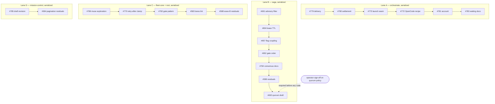

# defects-claude-plugins unattended run — implementation plan (issue #787, 20 leaves)

## Summary

One plan covering all 20 retained open leaves of the Operations-board Objective
`defects-claude-plugins`, executed as four mutually independent serialized lanes under the #787
execution contract. Every unit records its smallest viable fix, the repository mechanism it
reuses, any new moving part with the in-scope failure that justifies it, the larger alternative
rejected, owned paths, tests, and the mapping to its leaf's acceptance criteria. The execution
backend is `inline` for all work units (contract-fixed); worker pools are assigned at dispatch by
the contract's deterministic rule, never by this plan.

## Problem Frame

The Objective was audited and curated on 2026-08-24: 20 decision-complete leaves remain open, every
anchor re-verified at repo HEAD `818fd684`. Issue #787 is the authoritative execution contract —
ordering, lanes, collision rules, gates, and completion evidence. This plan is the S1 artifact that
contract requires: the per-unit HOW, honoring the contract exactly, so the unattended run can
execute each leaf without re-deriving decisions.

## Operating context and proportionality (constraints carried forward)

- Single-user developer-tool plugin suite operated by Jeff. No multi-tenancy, internet-scale,
  high-availability, regulated-environment, or hostile-co-tenant design unless a leaf requires it.
- Smallest change that fixes the verified defect and satisfies the leaf's acceptance criteria;
  reuse existing repository mechanisms and patterns.
- A new abstraction, service, background process, persistent state, lock/lease/retry framework,
  dependency, compatibility layer, generalized refactor, cross-plugin change, or extra operator
  workflow is permitted only when the unit names the current in-scope failure it prevents and why a
  smaller change cannot work. Every unit below carries that record.
- Security/reliability reasoning names the actual trust boundary or failure mode; hypothetical
  scale is not a finding. Justified safeguards around credentials, shell/process execution,
  filesystem/Git mutation, external input, and destructive operations are not relaxed.

## Repository freshness and baseline

- Plan authored in worktree `orch-plan-fable`, branch `orch/orch-2026-08-24-787-plan-fable`,
  based at `818fd684` — verified equal to `origin/main` after `git fetch` on 2026-08-24. Clean tree.
- Hard rule for every unit (from the contract): fetch origin before creating the unit branch or
  worktree and base on current `origin/main`; when earlier merges advance main while a candidate
  waits, rebase onto current `origin/main` before final verification, freeze, and Saga Code Review,
  and rerun integration-affected checks. Record base SHA, frozen reviewed SHA, and merged SHA per
  unit. A stale or dirty revision is never reviewed or merged.
- Verified path corrections against the live tree (the contract's inventory table drifted):
  `check_pagination.py` and `board_census.py` live at `plugins/mission-control/scripts/`, not the
  repo-root `scripts/`; mission-control unit tests live in `plugins/mission-control/tests/`, not
  the repo-root `tests/`. Units U19/U20 use the verified paths.

## Requirements

- R1. All 20 leaves reach merged-and-closed with their own verification evidence — except #692
  (U13), which may park awaiting operator sign-off; 19/20 with #692 parked is a successful run.
- R2. Lane serialization and dependency edges are honored exactly as the contract's graph states;
  lanes are mutually independent and may start concurrently.
- R3. Shared-file collision rules are hard: `plugins/orchestrate/**` lane A only;
  `plugins/saga/**` release surfaces lane B only; `plugins/mission-control/scripts/sdlc_manager.py`
  lane D only (U19 before U20); `.github/workflows/ci.yml` written only by #588 (U18); `CLAUDE.md`
  written only by #782 (U16); `.claude-plugin/marketplace.json` resolved by global merge
  serialization, one PR at a time, with version re-resolution at merge time.
- R4. Proportionality: every unit ships the smallest viable fix, reuses existing mechanisms, and
  adds no speculative defense; each new moving part is justified in this plan.
- R5. Repository freshness per the section above, for every unit.
- R6. Per-unit: implement to the leaf's acceptance criteria, run its Verification block, run
  `scripts/gate.sh` (backgrounded — manually with output redirection until U16 merges, then per the
  pattern U16 lands), exactly one Saga Code Review process at the frozen head under the contract's
  review terms; merge only on `accepted` or `cycle_cap_best_available` with shortfalls disclosed.
- R7. Release-surface parity for every plugin-touching PR: `plugins/<plugin>/.claude-plugin/plugin.json`,
  `plugins/<plugin>/CHANGELOG.md`, `.claude-plugin/marketplace.json`, and drift-guard tests in the
  same PR. Sibling same-version bumps auto-merge silently — re-resolve versions at merge time.
- R8. Journal obligations (LEARNINGS/DECISIONS) ship in the same commit where a leaf's mechanism
  warrants it, per the repo rule.
- R9. #692 (U13): no behavior change to the 36 committed n=3 panels without recorded operator
  sign-off. The unit drafts options and parks.
- R10. #786 (U14): read-only toward the muse CLI except one scratch install target; repo changes
  limited to the findings document; any correction is a follow-up filing.
- R11. `backend: inline` for all work units. This plan assigns no vendors, models, or pools —
  dispatch binding is the contract's deterministic rule at dispatch time.

## Key Technical Decisions

- KTD1 (U7, #691): fix advisory cross-unit bleed by **filtering at attach time on the existing
  per-entry `unit` tag**, not by resetting the accumulator at unit boundaries. Every pushed entry
  already carries `unit: unitId` (`execution_spec.py:812`); a boundary reset (`__advisories.length
  = 0`) is racy when units run concurrently in the same wave, and per-unit array maps are more
  moving parts than a filter over data already keyed correctly.
- KTD2 (U8, #694): keep the lease payload and **derive `execution_ttl_seconds` from the run's
  expected scale** (curation fix shape (a)), rather than retiring the TTL semantics (shape (b)).
  Post-#677 the broker is gone and the surface is emit-time only; an honest derived value is the
  smaller diff and keeps `workflow_emitter.py:94-95` validation unchanged. The unit first verifies
  what (if anything) consumes teardown/release results post-broker; if nothing does, it records
  that and explicitly drops the original teardown-distinguishability criterion, per the curation
  comment. Revisit toward shape (b) if implementation finds the payload has zero consumers at all.
- KTD3 (U9, #657): combine the issue's fix shapes 2+3 — **amend the CLI help to name the
  dependency and make the halt reason explicit** ("cc-workflows-ultracode unavailable:
  --workflow-available requires --host-capable"). Shape 1 (implying `--host-capable`) is rejected:
  it weakens the conservative-default contract `resolve_available`'s docstring pins ("the
  coordinator never claims a host-dependent backend it cannot verify").
- KTD4 (U10, #652): **evaluate the certificate gate before resolving the mission-control root**
  (lazy resolution only on the non-gated path), rather than mapping unresolvable-root errors on
  would-be-gated ops to `gated`. A gated verdict needs no writer; post-hoc error mapping keeps the
  unused eager work and muddies the error surface.
- KTD5 (U11, #784): option (a) — **docstrings + worked example + guard test**, not option (b) (a
  new CLI subcommand). The observed failure (six failed direct-drive attempts) is cured by
  documentation; a CLI adds surface with no current consumer. Verified correction to the leaf:
  at `818fd684` only `record_cycle` lacks a docstring; `ReviewFinding` (dataclass) and
  `evaluate_review_readiness` already carry one — so the guard test must assert *meaningful*
  content (inputs, call order, return types), not mere `__doc__` truthiness, which is already
  vacuously true for the dataclass.
- KTD6 (U12, #598 item 2): **document the set-intent/repost approval-carry-forward asymmetry and
  pin current behavior with a test**, rather than extending carried-forward provenance to
  pure-tightening live attaches. The current direction is conservative (costs one extra
  re-approval, never skips one); changing approval machinery is a behavior change the defect does
  not require.
- KTD7 (U20, #584 R3-residual): the parity `--live` leg's explicit-SKIP lands **inside the parity
  script (or its generation source), not in `ci.yml`** — the script self-reports
  "SKIP: unauthenticated (<reason>)" when the live leg cannot run. This keeps #588 (U18) the sole
  ci.yml writer. `check_issue_contract_parity.py` sits under
  `plugins/mission-control/config/generated/` — the unit must locate the generator/source before
  editing and change the source, never only the generated artifact.
- KTD8 (U19/U20 paths): mission-control tests are authored in `plugins/mission-control/tests/`
  (matching the existing 21 test modules there); the leaf bodies' `tests/…` spellings are corrected
  to the verified layout. `check_pagination.py` is at `plugins/mission-control/scripts/`.
- KTD9 (U13, #692): the drafted DECISIONS entry is **posted as an issue comment on #692 and the
  unit parks** — no repo mutation before sign-off. A pre-decision DECISIONS entry merged to main
  would misstate the journal's contract that entries record decisions actually taken.
- KTD10 (U18, #588 bandit scope): **add `tools/` to the bandit invocation** rather than writing a
  scope-decision comment. The step is advisory in CI (`|| true`), so widening scope cannot break
  CI, and scanning is the truthful resolution; findings surfaced in `tools/` are triaged within
  the unit (fix trivially or annotate).
- KTD11 (U19, #785 root cause): the embedded investigation tests two verified candidate
  mechanisms before fixing: (a) the session-driven draft rewrite step appending instead of
  replacing, and (b) `issue prepare --from` embedding a front-mattered source verbatim (a known
  behavior — the repo memory records "prepare embeds --from source verbatim"). There is no
  `revise` subcommand in `sdlc_manager.py` (verified by grep), so "the revision path" is one of
  those two. The fix set is invariant to which is confirmed: replacement/strip semantics at the
  confirmed write path, a readiness-validator blocking gap for multi-fence drafts, and a
  created-body (rendered mutation-plan) cleanliness assertion.

## Lanes and dependency graph

| Lane | Units in order | Surface owned |
| --- | --- | --- |
| A | U1 #779 → U2 #780 → U3 #773 → U4 #772 → U5 #781 → U6 #783 | `plugins/orchestrate/**` |
| B | U7 #691 → U8 #694 → U9 #657 → U10 #652 → U11 #784 → U12 #598 → U13 #692 (gate) | `plugins/saga/**` |
| C | U14 #786 → U15 #770 → U16 #782 → U17 #583 → U18 #588 | fleet-core + repo root |
| D | U19 #785 → U20 #584 | mission-control |

Within-lane edges are `serialize` (same files / same plugin release surfaces); the only
build-on-output edges are U3→U4 (the OpenCode recipe rides the enforced launch seam), U5→U6 (#783
documents the surface A1–A5 finish), U7→U8 (same file), and U19→U20 (#785's validator fix changes
the draft machinery #584's tests touch). No cross-lane edges exist.

### Shared-file collision rules (restated as unit obligations)

- `.claude-plugin/marketplace.json`: every plugin-touching PR bumps it; merges are globally
  serialized one PR at a time; every unit re-resolves its version bump at merge time (sibling
  same-version bumps auto-merge silently — known trap).
- `plugins/saga/scripts/execution_spec.py`: U7, U8, and (only if signed off) U13 — lane B
  serialization covers it.
- `plugins/saga/scripts/outcome.py`: U9 and U12 — lane B serialization covers it.
- `plugins/mission-control/scripts/sdlc_manager.py`: U19 then U20 — lane D serialization covers it.
- `.github/workflows/ci.yml`: U18 only. U20's R3-residual deliberately avoids it (KTD7).
- `CLAUDE.md`: U16 only.
- `docs/engineering-journal/LEARNINGS.md` / `DECISIONS.md`: cross-lane append-at-top files not
  named in the contract's collision list; conflicts are trivial and resolved by the mandated
  rebase-onto-current-main before freeze (R5) plus global merge serialization. Units keep journal
  edits to their own entry under the newest date heading (the `lint_journal_order.py` diff-scoped
  check enforces placement).

## Implementation Units

Backend for every unit: `inline`. Worker binding: dispatch-time, per the contract's deterministic
rule — deliberately not recorded here. Every unit ends with: own Verification block green,
backgrounded `scripts/gate.sh` green, release surfaces in parity (R7), one Saga Code Review at the
frozen head, merge under global serialization, leaf closed with evidence.

### U1. #779 — dispatch delivery confirmation (lane A1)

**Goal:** after `go` sends a unit its first prompt, Orchestrate observes an acceptance signal
before recording the unit as tasked; non-acceptance becomes a named, visible failure state with a
bounded retry.

**Smallest viable fix:** add a post-send delivery check to the dispatch path that currently gates
only on `row.get("interactive_ready")` (`orchestrate.py:1413`; the acknowledged gap comment sits at
`:1368`): after the first prompt send, confirm acceptance through the Herdr read surface Orchestrate
already wraps (pane transcript/consumption delta after the send); on non-acceptance, retry a small
fixed number of times, then record the new named unit state `prompt_undelivered` instead of tasked.

**Existing mechanism reused:** the run-record unit state machine (`status`/`settle` already read
named states), the Herdr pane read/wait seams orchestrate.py already wraps, and the stubbed-pane
test pattern used across `tests/test_orchestrate_task_dispatch.py`.

**New moving parts:** one named state (`prompt_undelivered`) and one delivery-check helper with a
bounded retry. Justified: the in-scope failure is silent first-prompt loss on ready-reporting panes
(at least four occurrences in session b31ec85e on 2026-08-23 — folder-trust and account-verification
dialogs swallow the send while Herdr reports `interactive_ready`). A smaller change (documentation
telling coordinators to watch the token counter) cannot satisfy the acceptance criteria, which
require a test-pinned named failure state and no silently-tasked unit.

**Larger alternative rejected:** fixing Herdr readiness detection or vendor startup dialogs
(explicitly out of scope — dependency context routed elsewhere); an unbounded retry or a
generalized delivery-manager subsystem (no current failure requires more than detect → bounded
retry → loud fail).

**Owned paths:** `plugins/orchestrate/skills/orchestrate/scripts/orchestrate.py`,
`plugins/orchestrate/skills/orchestrate/SKILL.md`, `tests/test_orchestrate_delivery.py` (new),
orchestrate release surfaces + `.claude-plugin/marketplace.json`.

**Tests:** `tests/test_orchestrate_delivery.py` (new): a stubbed pane reporting
`interactive_ready` that does not accept input → unit never recorded tasked, named
delivery-failure state appears, bounded retry fires; happy path (accepted prompt → tasked).

**Acceptance-criteria mapping:** AC1 (pytest green incl. the ready-but-deaf regression) → the new
test module; AC2 (`status` shows the named state) → status-path assertion via stubbed state; AC3
(`grep -n "deliver" SKILL.md`) → SKILL.md section documenting the confirmation signal and
retry-or-fail policy.

**Dependencies:** lane A head; blocks U2.

### U2. #780 — evidence-based settlement (lane A2)

**Goal:** `settle` records `done` only with completion evidence, `failed` only with failure
evidence; session-gone-without-evidence becomes a distinct orphaned state.

**Smallest viable fix:** apply `land`'s existing branch-truth model at settle time: before
`cmd_settle` (`orchestrate.py:2508`) accepts a pane-state verdict, check the evidence `cmd_land`
(`:2974`) already computes — commit-on-branch first, typed result file or declared artifact where
the unit declares one. `done` without evidence stays unsettled; a closed session whose branch
carries the expected output settles `done`; session-gone without evidence yields a new named
`orphaned` state. Update the SKILL.md settlement contract including the "what this deliberately
does not do" paragraph (`SKILL.md:176-181`, `:189-193`).

**Existing mechanism reused:** `land`'s branch/commit inspection (the exact check that caught
incident 1), the run-record state machine, existing settle-path tests
(`tests/test_orchestrate_settle_debounce.py` patterns).

**New moving parts:** one named `orphaned` state and the evidence requirement at settle. Justified:
three incidents with real cost (stale `done` accepted; idle-but-SIGTTIN-suspended tree called done
six times; committed work marked `failed` after operator cleanup closed its session). Doc-only
change cannot satisfy the test-pinned acceptance criteria.

**Larger alternative rejected:** token counting, spend ceilings, voting panels, durable lock
registers (retired archived scope); changing Herdr's own idle/done classification (dependency
context).

**Owned paths:** `plugins/orchestrate/skills/orchestrate/scripts/orchestrate.py`,
`plugins/orchestrate/skills/orchestrate/SKILL.md`, `tests/test_orchestrate_settlement.py` (new),
orchestrate release surfaces + marketplace.

**Tests:** `tests/test_orchestrate_settlement.py` (new) covering the three incident shapes: stale
`done` predating a supplemental prompt; idle-but-stuck never becoming `done` without evidence;
session-closed-after-commit settling `done` (not `failed`) with session-gone-no-evidence yielding
the orphaned state.

**Acceptance-criteria mapping:** AC1 (three shapes covered) → the new module; AC2 (`settle` records
`done` only with documented evidence; idle pane stays unsettled) → evidence-check assertions; AC3
(closed-session-with-branch-output → `done`, never `failed`; distinct state otherwise) → dedicated
cases; AC4 (`grep -n "settlement" SKILL.md`) → updated contract text.

**Dependencies:** after U1 (same files).

### U3. #773 — single launch seam, no-focus invariant (lane A3)

**Goal:** every run unit is persisted through `start`/`expand` before any worktree or session
exists, launches only through `go`'s central `agent_argv()` path, and the complete background flag
set `--no-focus --current --herdr --herdr-control-only` is locked by regression test; bypasses
become visible.

**Smallest viable fix:** three edges on existing machinery: (1) regression tests locking the
complete flag set and its position ahead of the vendor token in `agent_argv()`
(`orchestrate.py:1334`), plus a post-plan-expansion test proving new units launch through the
central path; (2) `status`/`doctor` output that names coordinator-created worktrees or sessions
matching the run but absent from its record (report, require explicit adoption or run-owned
cleanup — never silently treat as valid expansion); (3) coordinator instructions in
`commands/orchestrate.md` and SKILL.md explicitly prohibiting manual worktree creation or direct
`agents` invocation for run units, and representing unsupported post-launch setup (including
interactive OpenCode variant selection) as a controlled post-launch step rather than a bypass
license. Integration-shaped test records the focused pane before/after several run-owned launches
and asserts it did not change (stubbed pane records).

**Existing mechanism reused:** `agent_argv()` (already emits the correct flags — the defect is
enforcement, not implementation), the run record, existing `tests/test_orchestrate_authoring_contract.py`
and `tests/test_orchestrate_launch_and_land.py`, existing drift/adopt machinery
(`tests/test_orchestrate_drift_and_adopt.py` patterns).

**New moving parts:** the unrecorded-resource detection in status/doctor. Justified: the observed
failure was nine focus-stealing launches made by a coordinator that bypassed `expand`/`go`
silently — instructions alone were already present and did not hold; detection makes the bypass
loud. A smaller change cannot satisfy the "status or doctor identifies coordinator-created
worktrees/sessions absent from the record" acceptance criterion.

**Larger alternative rejected:** changing the `agents` wrapper's interactive default or Herdr focus
behavior globally (explicit non-goals); attempting hard technical prevention of direct wrapper
calls (not enforceable from inside the plugin — the enforceable seam is persist + launch-path +
detection, which is what this unit locks).

**Owned paths:** `plugins/orchestrate/commands/orchestrate.md`,
`plugins/orchestrate/skills/orchestrate/SKILL.md`,
`plugins/orchestrate/skills/orchestrate/scripts/orchestrate.py`,
`tests/test_orchestrate_authoring_contract.py`, `tests/test_orchestrate_launch_and_land.py`,
orchestrate release surfaces + marketplace.

**Tests:** extend the two named modules: complete-flag-set-and-position assertion; post-plan
expansion launches through the central launcher; unrecorded-resource detection; focus-invariant
integration case; cleanup stays scoped to run-owned resources.

**Acceptance-criteria mapping:** persisted-before-created and central-launch ACs → expansion test;
prohibition AC → commands/SKILL text; flag-set AC → the position-locking test; drift AC →
status/doctor detection; focus AC → the before/after pane test; run-record completeness AC →
launch-receipt assertions; cleanup AC → scoped-cleanup case. Leaf stop conditions are copied into
the unit's task brief verbatim.

**Dependencies:** after U2; U4 builds on this seam.

### U4. #772 — OpenCode variant recipe through Herdr (lane A4)

**Goal:** Orchestrate supplies and enforces the complete OpenCode launch recipe: named visible
Herdr session via the `agents` wrapper, `/variants` driven inside the session, effective
provider/model/variant verified before task submission, all persisted in the launch receipt.

**Smallest viable fix:** add a first-class OpenCode recipe on top of U3's enforced seam: launch via
the wrapper (named, visible, run-owned); drive `/variants` through the pane-send machinery the
`setup` mechanism already uses; read the live picker options; select the requested exact variant or
the highest actually offered when the request is "maximum available"; wait until the TUI is
task-ready; verify provider, model, variant, working directory, worktree, unit name, workspace,
pane, readiness; persist the verified state in the unit record/launch receipt; fail loudly before
task submission when selection or verification is impossible. Correct the prose:
`commands/orchestrate.md` and `VENDOR_NOTES["opencode"]` stop claiming the picker cannot be
automated; SKILL.md stops overstating that every vendor tier is deliverable through `setup`; no
fallback path emits or recommends `opencode run`, a bare `opencode` task, or an
`AgentConfig.variant` workaround when the approved transport is interactive Herdr.

**Existing mechanism reused:** the unit `setup` slash-command submission path, Herdr pane
read/send/wait seams, launch receipts, U3's locked launch flags.

**New moving parts:** a typed interactive-picker step (open picker → read options → select →
verify → wait-ready). Justified: the current gap made the coordinator research alternate transports
mid-run (the observed incident); the acceptance criteria require verified-before-submit state and a
receipt that persists it, which prose cannot provide. Smaller (docs-only) fails the
"Orchestrate verifies the effective … before submitting" criterion.

**Larger alternative rejected:** headless `opencode run --variant` as the default transport
(explicitly not the approved path; retained only as an operator-approved distinct transport,
recorded visibly); hard-coding variant ladders (`max` guessing) — the live picker is authoritative
(the Muse picker's top value was `xhigh`, not `max`).

**Owned paths:** `plugins/orchestrate/commands/orchestrate.md`,
`plugins/orchestrate/skills/orchestrate/SKILL.md`,
`plugins/orchestrate/skills/orchestrate/scripts/orchestrate.py`,
`tests/test_orchestrate_task_dispatch.py`, `tests/test_orchestrate_launch_and_land.py`,
orchestrate release surfaces + marketplace.

**Tests:** extend the two named modules: recipe emission and verification-before-submit; the Team
Mimir regression (picker offering Default/minimal/low/medium/high/xhigh with a "maximum available"
request selects `xhigh`, never `max`); loud failure when the requested variant is absent or
unverifiable; non-OpenCode vendors keep native controls (no `/variants` sent); owned-session
cleanup scope.

**Acceptance-criteria mapping:** each checkbox maps to a named test or doc change above; the
failure-modes table and stop conditions are copied into the unit's task brief verbatim.

**Dependencies:** after U3 (builds on the enforced seam).

### U5. #781 — company-account propagation (lane A5)

**Goal:** an explicit operator account selection survives into every worker launch and is verified
after launch; a mismatch is a named launch failure.

**Smallest viable fix:** add an account selection field to the run/unit plan schema; translate it
in `agent_argv()` (`orchestrate.py:1334`; the flag is already documented at `:330`) to
`--company-account` for claude units (passthrough expressibility only for other vendors); after
launch, verify the worker's transcript root (`~/.claude-company/projects/` vs
`~/.claude/projects/`) and mark a mismatch as a named launch failure — never a silently personal
worker.

**Existing mechanism reused:** `agent_argv()` assembly (the seam U3 locks), existing post-launch
checks and the run record, the launched-pane environment facts recorded in the leaf (the wrapper
already implements `--company-account`; nothing in the wrapper changes).

**New moving parts:** the schema field and the post-launch account probe. Justified: on 2026-08-23
four workers launched from a company-account coordinator all landed on the personal account —
wrong billing/rate-limit pool, divergent plugin tree, transcripts under the wrong identity,
invisible until transcript locations were checked. Docs alone cannot satisfy the test-pinned argv
emission and mismatch-detection criteria.

**Larger alternative rejected:** changing global account defaults, login environments, or the
`agents`/`agent-herdr` wrapper flag surface (routed to Home Lab System Updates); modeling non-claude
vendors' account semantics beyond passthrough.

**Owned paths:** `plugins/orchestrate/skills/orchestrate/scripts/orchestrate.py`,
`plugins/orchestrate/skills/orchestrate/SKILL.md`, `tests/test_orchestrate_account.py` (new),
orchestrate release surfaces + marketplace.

**Tests:** `tests/test_orchestrate_account.py` (new): argv includes the account flag when the plan
selects company; omission when no selection; simulated mismatch (worker transcript under the
personal root) marks the launch failed with a named state.

**Acceptance-criteria mapping:** AC1 → the new module; AC2 (`go` emits `--company-account` for
every claude unit under the selection) → stubbed-launcher assertion; AC3 (named mismatch state) →
mismatch case; AC4 (`grep -n "account" SKILL.md`) → SKILL.md documents the plan-level field and
post-launch verification.

**Dependencies:** after U4.

### U6. #783 — waiting-patterns guidance (lane A6)

**Goal:** the Orchestrate skill pre-teaches the supported wait mechanism for the three recurring
wait shapes, so guard-blocked sleep-chains stop costing a turn each.

**Smallest viable fix:** docs-only: a "Waiting" section in SKILL.md naming (a) sibling herdr
agent/pane output → `herdr agent wait` / `pane wait-output` / `orchestrate.py wait`; (b) PR checks
and other external state → a Monitor-style until-loop; (c) a command the session itself started →
background run with completion notification — one copy-pasteable example each, an explicit "never
chained sleep" instruction beside them, and a cross-reference to `orchestrate.py wait` for
settlement waits. Release-surface bump (guidance is a user-facing plugin surface per repo rule).

**Existing mechanism reused:** the already-shipped wait mechanisms being documented
(`orchestrate.py wait`, Herdr's `agent wait`/`pane wait-output`); no code.

**New moving parts:** none.

**Larger alternative rejected:** new tooling or wrappers (explicit non-goal); changing the
execution guard (it behaves correctly).

**Owned paths:** `plugins/orchestrate/skills/orchestrate/SKILL.md`, orchestrate release surfaces +
marketplace.

**Tests:** none — non-feature docs unit; the leaf's acceptance criteria are grep-verifiable, and
any existing docs-lint runs unchanged. Test expectation: none — documentation-only unit whose
acceptance criteria are the grep checks below.

**Acceptance-criteria mapping:** AC1–AC3 → the three grep checks (`waiting`, `sleep`, `wait`) over
SKILL.md; AC4 (a subsequent run shows zero guard-blocked sleep-chains) is observed at run level by
the orchestrator, not by this unit's tests.

**Dependencies:** after U5 (documents the surface A1–A5 finish; lane tail).

### U7. #691 — advisory accumulator cross-unit bleed (lane B1)

**Goal:** a unit's returned `advisory_corrections` contains only that unit's advisories, in
multi-unit emitted harnesses.

**Smallest viable fix (KTD1):** filter at attach time on the existing per-entry `unit` tag. The
emitted helper (`_JS_ADVISORY_HELPER`, `execution_spec.py:750`) already pushes
`{ unit: unitId, round, corrections, dropped }` (`:812`); the two attach sites — the halt path
(`e.advisory_corrections = __advisories`, `:783`) and the result assembly
(`advisory_corrections: __advisories`, `:3951`) — attach the whole module-scope array. Change both
to attach only entries whose `unit` matches the attaching unit. Gating semantics, render/scrub/
truncation from #686, per-round caps, and `__advisoryRounds` are untouched (leaf non-goals).

**Existing mechanism reused:** the per-entry `unit` tag already recorded by `__logAdvisory`; the
node-executed harness test pattern already in `tests/test_saga_execution_spec.py`
(`skipif(shutil.which("node") is None)` + subprocess at `:798-802`).

**New moving parts:** none — a filter over data already keyed correctly.

**Larger alternative rejected:** resetting the accumulator at unit boundaries (racy when units run
concurrently in one wave — the reset from a starting unit would drop a concurrent unit's pending
advisories); per-unit accumulator maps (more emitted state than the filter, same outcome).

**Owned paths:** `plugins/saga/scripts/execution_spec.py`, `tests/test_saga_execution_spec.py`,
`plugins/saga/references/execution-spec.md`, saga release surfaces + marketplace.

**Tests:** node-executed two-unit harness where each unit's panel reports one advisory → second
unit's returned array has length 1; a halt raised in the second unit does not carry the first
unit's advisories; existing `advisory_corrections` tests pass unchanged; mutation proof (revert the
filter in a scratch copy → new test fails) recorded in the PR body.

**Acceptance-criteria mapping:** AC1/AC4 (suite green, no pass-count reduction) → full pytest; AC2
(cross-unit isolation, length 1 not 2) → the two-unit test; AC3 (mutation proof in PR body) → the
scratch-revert record; AC5 (release surfaces tell the same story) → R7 parity.

**Dependencies:** lane B head; blocks U8 (same file).

### U8. #694 — workflow lease TTL, post-#677 shape (lane B2)

**Goal:** the recorded lease contract is honest for runs of arbitrary length; a fixed
`execution_ttl_seconds: 300` no longer expires long before the run it describes.

**Smallest viable fix (KTD2):** derive `execution_ttl_seconds` at emit time from the run's expected
scale (a per-unit allowance times the multiplicity-aware unit count, with a floor no lower than the
current 300), replacing the literal at `execution_spec.py:3649`; `claim_ttl_seconds` (`:3648`) is
unchanged. `workflow_emitter.py` validation (`:94-95`, positive-value checks) is already
shape-compatible and stays as is. First step inside the unit: verify what consumes
teardown/release results post-#677 (the broker — `lease_broker.py` — is deleted); if nothing
consumes them, record that in the PR and issue close-out and explicitly drop the original
"teardown distinguishes released-held from nothing-to-release" criterion per the curation comment;
if a consumer exists, pin the distinguishable result with a test instead.

**Existing mechanism reused:** the emit-time payload assembly and `workflow_emitter` validation
(the surviving contract surface named by the curation); the spec's own unit/multiplicity data
already available at emit time (the same data `spend` sums).

**New moving parts:** none — one computed value replaces one literal.

**Larger alternative rejected:** rebuilding a renewal path or background renewal process (the
broker and its `renew`/`renew_batch` no longer exist; a new renewal subsystem is a speculative
defense with no current consumer); a polling loop in the driving session (explicit non-goal);
retiring the TTL payload entirely (shape (b) — larger diff, schema change, DECISIONS entry;
revisit if the unit finds the payload has zero consumers).

**Owned paths:** `plugins/saga/scripts/execution_spec.py`,
`plugins/saga/scripts/workflow_emitter.py` (only if validation needs to change),
`tests/test_saga_execution_spec.py`, saga release surfaces + marketplace.
(The original body's `lease_broker.py` and `SKILL.md:552` references are historical per the
curation comment.)

**Tests:** emitted TTL is derived from run scale, pinned by a test that a long-run spec's lease is
still nominally held past the 10-minute mark (time-advanced assertion against the recorded TTL);
`grep -c '"execution_ttl_seconds": 300'` returns 0; mutation proof (revert to the literal → test
fails); the teardown criterion handled per the consumer-verification outcome above.

**Acceptance-criteria mapping:** AC1 (10-minute mark) → the derived-TTL test; AC2 (grep count 0) →
literal removed; AC3 (teardown distinguishability) → pinned test or recorded drop per curation; AC4
(mutation proof) → scratch-revert record; AC5 → full suite green.

**Dependencies:** after U7 (same file).

### U9. #657 — `--workflow-available` flag coupling (lane B3)

**Goal:** an operator who passes `--workflow-available` gets either the external backend or an
explanation naming `--host-capable` — never a silent downgrade with a halt that blames the host.

**Smallest viable fix (KTD3):** two strings and no semantic change: (1) amend the
`--workflow-available` help text (`outcome.py:2333`; `--host-capable` at `:2328`) to name the
dependency; (2) in `outcome_dispatcher.py`, when `workflow_available and not host_capable`, make
the unavailable-backend halt reason read "cc-workflows-ultracode unavailable:
--workflow-available requires --host-capable" (the coupling lives at `resolve_available`,
`:286-300`, `if host_capable and workflow_available:` at `:299`). The conservative default — with
neither flag, only `ALWAYS_AVAILABLE` resolves — is unchanged.

**Existing mechanism reused:** `resolve_available` and the existing halt-reason surface; existing
`tests/test_outcome_dispatcher.py` coverage patterns.

**New moving parts:** none.

**Larger alternative rejected:** shape 1 (a lone `--workflow-available` implies `--host-capable`) —
weakens the conservative-default contract the docstring pins; a hard argparse error on the lone
flag — changes CLI behavior for existing callers where the explanatory halt already cures the
diagnostic dead-end, and the leaf prefers shapes 2/3.

**Owned paths:** `plugins/saga/scripts/outcome_dispatcher.py`, `plugins/saga/scripts/outcome.py`,
`tests/test_outcome_dispatcher.py`, saga release surfaces + marketplace.

**Tests:** pin `resolve_available(host_capable=False, workflow_available=True)` (the currently
untested combination — fails against current code via the new halt-reason assertion); a
CLI-surface test asserting the help text and `resolve_available` agree so they cannot drift; per
the transfer note, the regression test pins `degrade_policy: "halt"` (under the default `none` the
symptom is invisible).

**Acceptance-criteria mapping:** AC1 (refuses/warns naming `--host-capable`, never a silent floor)
→ the halt-reason test; AC2 (help text consistent with `resolve_available`) → the drift test; AC3
(pinned combination failing against current code) → the new case.

**Dependencies:** after U8 (lane serialization; distinct files from U7/U8 but shared saga release
surfaces).

### U10. #652 — gate-before-resolve exit-code contract (lane B4)

**Goal:** a certificate-gated op returns `status=gated` / exit 0 even where mission-control is
unresolvable; a non-gated op there still fails loud (exit 1).

**Smallest viable fix (KTD4):** reorder: evaluate the certificate gate before resolving the
mission-control root in both CLIs — `board_progression.py` `write` (eager resolve at `:533`, gate
inside `authorize_and_write` at `:191-194`) and `reconcile_controller.py` `reconcile` (resolve at
`:424`, gate inside `reconcile_and_correct`; `:448` already maps `gated`/`halt` to exit 0 when
control reaches it). Mechanically: compute the gate verdict first (the gate needs no writer), and
resolve the root lazily only on the non-gated path — via a pre-gate check or a lazy writer
factory, whichever the existing call shape absorbs with the smaller diff.

**Existing mechanism reused:** the existing gate functions and the existing exit-code mapping at
`reconcile_controller.py:448`; the pre-#620 contract being restored is the repo's own.

**New moving parts:** none — an ordering change.

**Larger alternative rejected:** keeping the eager resolve and mapping unresolvable-root errors on
would-be-gated ops to `gated` (post-hoc reclassification keeps unused eager work and makes the
error surface ambiguous between "gated" and "install missing").

**Owned paths:** `plugins/saga/scripts/board_progression.py`,
`plugins/saga/scripts/reconcile_controller.py`, `tests/test_board_progression.py`,
`tests/test_reconcile_controller.py`, saga release surfaces + marketplace.

**Tests:** in both test modules: a gated op with the resolver stubbed to raise returns
`status=gated` / exit 0; a non-gated op with the same stub still exits 1 with the resolution error.

**Acceptance-criteria mapping:** AC1 (gated + unresolvable → gated/0) and AC2 (non-gated +
unresolvable → loud 1) → the four stub cases; AC3 (regression tests in both modules) → same.

**Dependencies:** after U9.

### U11. #784 — review_consensus API documentation (lane B5)

**Goal:** a session driving the review-consensus state machine directly succeeds from documentation
alone — inputs, outputs, valid call order, one worked example.

**Smallest viable fix (KTD5):** option (a): write real docstrings on the public entry points —
`ReviewCycleState.record_cycle` (verified missing at `818fd684`), and strengthen
`ReviewFinding`/`evaluate_review_readiness` docstrings (verified present but thin — one line each)
to name required inputs, valid call order, and return types; add one worked end-to-end example
(record cycle → evaluate readiness) in the module docstring; make non-public internals
unmistakably private (leading underscore or a module-docstring statement). Guard with a test that
executes the worked example exactly as documented.

**Existing mechanism reused:** plain docstrings + a pytest module; no new surface.

**New moving parts:** none.

**Larger alternative rejected:** option (b), a supported CLI subcommand for record/evaluate — new
surface with no current consumer; the observed failure (six failed direct-drive tool calls,
session 939e7ee5) is a documentation gap.

**Owned paths:** `plugins/saga/scripts/review_consensus.py`,
`tests/test_review_consensus_docs.py` (new), saga release surfaces + marketplace.

**Tests:** `tests/test_review_consensus_docs.py` (new): asserts the three entry points carry
docstrings with meaningful content — not bare `__doc__` truthiness, which is already vacuously true
for the frozen dataclass — and runs the worked example as documented. Scoring/consensus behavior
unchanged (leaf non-goal; #778 and the consensus-kernel roadmap are out of scope).

**Acceptance-criteria mapping:** AC1 (the python -c docstring assertion exits 0) → docstrings
written; AC2 (worked example runs as documented) → the executed example test; AC3 (privates
unmistakable) → naming/module-docstring statement.

**Dependencies:** after U10.

### U12. #598 — #433 re-panel residuals, items 1–2 and 5 (lane B6)

**Goal:** close items 1, 2, and 5; record item 3's deferral and item 4's revisit hook at close.

**Smallest viable fix:** three bounded edits plus two recorded non-changes:

- Item 1 (dedup key eternal): scope the `{"phase": "halt", "kind": "repost"}` dedup key in
  `append_ledger_once` (`outcome_store.py:431`) with a generation component — the `intent_revision`
  that raised the strand, per the leaf's fix shape — so a second genuine strand after the first
  resolves appends a new durable ledger record.
- Item 2 (approval carry-forward asymmetry, KTD6): document the divergence beside the
  one-transition-one-validator story (update the LEARNINGS anchor
  `{#one-transition-one-validator-433}`) and pin current `set_intent` behavior
  (`outcome.py:401` — bumps revision, does not carry approval forward) with an explicit test whose
  comment references the documented asymmetry.
- Item 5 (test-shape nicety): convert `test_tightening_repost_never_retroactively_imposes_checks`
  to drive `M.set_intent` on a live campaign; if the harness genuinely cannot absorb that, record
  why the hand-crafted attach stays (either satisfies the curation criterion; the drive is
  attempted first).
- Item 3 (O(ledger) tick costs): explicitly deferred — no code; the deferral is recorded in the
  issue close-out comment, conditional on a measured campaign showing tick latency.
- Item 4 (save_spec check→write race): stays the documented revisit hook; the close-out comment
  restates both revisit conditions (a demonstrated lost repost, or #449's token-checked write class
  landing).

**Existing mechanism reused:** `append_ledger_once`'s existing key computation (extended, not
replaced); the existing LEARNINGS anchor; the existing test module seams
(`tests/test_outcome_store.py`, `tests/test_outcome_intent.py`).

**New moving parts:** none — a key component, a doc paragraph, a test rewrite.

**Larger alternative rejected:** extending carried-forward provenance to pure-tightening live
attaches (behavior change to approval machinery the defect does not require — KTD6); ledger
indexing/memoization for item 3 (no measured need); an OS-level lock for item 4 (deliberately
deferred with a revisit hook, per the leaf itself).

**Owned paths:** `plugins/saga/scripts/outcome_store.py`, `plugins/saga/scripts/outcome.py`,
`plugins/saga/scripts/outcome_intent.py` (only if the item-2 pin needs its seam),
`docs/engineering-journal/LEARNINGS.md`, `tests/test_outcome_store.py`,
`tests/test_outcome_intent.py`, saga release surfaces + marketplace.

**Tests:** item-1 lifecycle pin against `append_ledger_once` (resolve → second strand → new
record); item-2 behavior pin on `set_intent`; item-5 rewritten drive; suite selector
`uv run pytest -q -k 'outcome_store or outcome_intent or set_intent'` green.

**Acceptance-criteria mapping:** the five curation checkboxes map one-to-one to the five bullets
above; the sixth (suite + release surfaces) → R7 parity and the selector run.

**Dependencies:** after U11.

### U13. #692 — quorum policy at odd n — OPERATOR DECISION GATE (lane B7)

**Goal:** draft the DECISIONS entry with options and park awaiting operator sign-off. No code
without the recorded sign-off.

**Smallest viable fix (KTD9):** author the draft DECISIONS entry — the policy question (at odd
n ≥ 5 a panel can lose refuting verifiers, still clear the `n // 2 + 1` floor at
`execution_spec.py:2845`, and pass where full strength would have halted), at minimum these
options, each with consequences for the 36 committed n=3 panels: (1) status quo — floor-only,
document the exposure; (2) strict full-strength — halt on any missing verifier (changes all 36
n=3 panels, each currently tolerating one missing verifier); (3) missing-aware tightening — halt
when the count of missing verifiers is ≥ the floor margin (changes nothing at n=3 with one
missing; catches the n=5-two-missing case); (4) per-panel opt-in strictness. The draft includes
alternatives rejected and a revisit-when condition, names which committed panels each option
changes, and is posted as a comment on #692. The unit then HALTS and parks as awaiting-operator.
If sign-off arrives during the run, the signed decision proceeds to Saga Work under the leaf's own
acceptance criteria (DECISIONS entry before code; odd-n 5/7/9 scenario sweep; explicit n=3 pin; PR
names any changed committed panels; no merge without explicit operator confirmation). If not, the
run finishes 19/20 with #692 parked — a successful outcome per the contract.

**Existing mechanism reused:** the DECISIONS journal format and the existing panel-size scenario
sweep in `tests/test_saga_execution_spec.py`.

**New moving parts:** none at draft stage.

**Larger alternative rejected:** implementing any default policy without sign-off (explicitly
prohibited by the leaf and the contract); silently tightening n=3 floors as a side effect
(explicit leaf non-goal).

**Owned paths (draft stage):** an issue comment on #692 only. (If signed:
`plugins/saga/scripts/execution_spec.py`, `tests/test_saga_execution_spec.py`,
`plugins/saga/references/execution-spec.md`, `docs/engineering-journal/DECISIONS.md`, saga release
surfaces + marketplace.)

**Tests (only if signed):** extend the panel-size sweep to odd n in 5/7/9 for every survivor count
at or above the floor, asserting the chosen policy per cell; explicit n=3 pin stating in a comment
whether the policy changed it.

**Acceptance-criteria mapping:** draft stage satisfies "DECISIONS entry records the chosen policy…
written before the code change" by producing the options draft for sign-off; the remaining ACs
activate only on sign-off.

**Dependencies:** after U12; operator gate; may terminate parked.

### U14. #786 — muse skills-install contract exploration (lane C1, read-only, runs first)

**Goal:** establish from the installed muse CLI what the supported skills-install command is and
what its `--json` output contains; correct or explicitly clear every repo surface that assumes an
`installed` field.

**Smallest viable fix:** run `muse skills --help` (muse verified installed at
`~/.local/bin/muse`), one real `muse skills install <scratch-target> --json` success and one
induced failure; capture all three verbatim plus the muse CLI version in
`docs/analysis/2026-08-muse-skills-install-contract.md` (new; `docs/analysis/` already exists);
state the verified success/failure JSON shapes and name the owning surface going forward; grep the
repo (`plugins/`, non-test) for `installed`-field assumptions and either file the follow-up
correction issue or record "no correction needed" in the findings doc. Docs-only PR; the
exploration itself changes no production code.

**Existing mechanism reused:** the `docs/analysis/` findings-document convention (three prior
analysis docs exist); grep-based surface sweep.

**New moving parts:** none.

**Larger alternative rejected:** broad muse onboarding documentation (out of scope); changing muse
itself (out of scope); editing other lanes' surfaces from inside this unit (the leaf files a
follow-up instead).

**Owned paths:** `docs/analysis/2026-08-muse-skills-install-contract.md` (new). Candidate
correction surfaces (named, not edited here): `plugins/orchestrate/skills/orchestrate/SKILL.md`
vendor notes, `plugins/saga/scripts/engine_session_runner.py`,
`plugins/fleet-core/scripts/fleet_commons/tier_resolver.py`.

**Tests:** none mandated (exploration); the follow-up correction, if code, carries its own test per
repo rules. Test expectation: none — read-only exploration producing a findings document.

**Acceptance-criteria mapping:** AC1 (verbatim captures) → the findings doc; AC2 (verified contract
+ owning surface) → same; AC3 (grep shows no unverified `installed` assertion) → the sweep result
recorded; AC4 (follow-up filed or "no correction needed") → explicit closing section of the doc.

**Dependencies:** lane C head; blocks U15. Constraints: read-only toward muse except the scratch
target; version captured so a later muse upgrade is distinguishable from a wrong capture.

### U15. #770 — negative Retry-After clamp (lane C2)

**Goal:** both parsing paths of `parse_retry_after` honor the documented "never a negative delay"
contract.

**Smallest viable fix:** clamp the delta-seconds return at the single chokepoint —
`retry_backoff.py:60` currently `return seconds if math.isfinite(seconds) else None`; clamp
finite values to `max(0.0, seconds)`, mirroring the HTTP-date path's existing clamp at `:110`.
Nothing else changes: the 0.25.2 non-finite guard stays; the sleep path (`_retry_delay` already
rejects non-positive hints) stays; no consumer changes.

**Existing mechanism reused:** the function's own documented contract and the HTTP-date path's
clamp idiom; the existing parametrised test structure in `tests/test_retry_backoff.py`.

**New moving parts:** none — one expression.

**Larger alternative rejected:** fixing a caller instead (leaves the contract violated for every
other caller — named by the leaf); treating negatives as `None` (a negative header is a usable
"retry now" hint; `0.0` matches the past-date behavior the docstring promises).

**Owned paths:** `plugins/fleet-core/scripts/fleet_commons/retry_backoff.py`,
`tests/test_retry_backoff.py`, fleet-core release surfaces + marketplace.

**Tests:** parametrised cases asserting `0.0` for `-5`, `-0.5`, `-120` (mirroring the past-date
test); extend the postcondition test so every returned hint is non-negative as well as finite;
confirm the new assertions fail against the unrepaired primitive before the fix (recorded).

**Acceptance-criteria mapping:** AC1/AC2 (the two python -c probes print `0.0`) → the clamp; AC3
(`30`→`30.0`, `1e400`/`garbage`→`None` unchanged) → existing cases still green; AC4 (pytest green)
→ suite; AC5 (assertions bite pre-fix) → recorded red-first run.

**Dependencies:** after U14.

### U16. #782 — gate.sh long-run pattern, sole CLAUDE.md writer (lane C3)

**Goal:** a supported full-gate invocation that survives the ten-minute foreground tool timeout,
avoids duplicate concurrent runs, and captures completion status reliably.

**Smallest viable fix:** document and lightly tool: in `CLAUDE.md`'s Running Quality Checks
section, the supported invocation is a backgrounded run with a named log/result location and the
statement that the 24-step gate is expected to exceed common foreground timeouts, restating the
0/1/2 exit contract beside it. In `scripts/gate.sh`: write a final status line to a stable result
file inside the existing `LOG_DIR` mechanism (the script already ends with `logs: $LOG_DIR`), and
add duplicate-run protection — an atomic lock (mkdir-style) with a stale-lock/safe re-entry rule
stated where documented. Coverage contract, `GATE INCOMPLETE` self-audit, step content, and exit
codes unchanged.

**Existing mechanism reused:** gate.sh's existing `LOG_DIR` logging; the existing CLAUDE.md
section; the Bash tool's own background-run mechanism (no new runner).

**New moving parts:** the lock and the result marker. Justified: the observed failure is exit 143
at exactly the 600000ms default with a wasted ten-minute cycle per fresh session, and the naive
retry after a kill risks overlapping gate runs mutating the same logs; a docs-only fix cannot
satisfy the grep-pinned lock/re-entry criterion.

**Larger alternative rejected:** changing gate coverage or speed (explicit non-goals); a wrapper
daemon, make target, or separate runner script (a lock plus a marker inside the existing script is
sufficient for the single-user context).

**Owned paths:** `CLAUDE.md` (sole writer in this run), `scripts/gate.sh`,
`tests/test_gate_invocation.py` (new, minimal) or an in-script self-test — whichever the lock
mechanism makes cheaper; the unit picks one and records it.

**Tests:** assert the marker file appears with the final status and the lock refuses a concurrent
second run / documents safe re-entry; `bash -n scripts/gate.sh` clean; implementation validates one
run to completion and one early-killed run, confirming captured status both times (leaf
verification block).

**Acceptance-criteria mapping:** AC1 (`grep -n "background" CLAUDE.md`) → the docs section; AC2
(outcome capturable from a named file) → the result marker; AC3 (lock/re-entry greppable) → the
lock + rule; AC4 (`bash -n` + 0/1/2 restated) → syntax check + doc text.

**Dependencies:** after U15. Until this unit merges, all units background the gate manually with
output redirection (contract rule).

### U17. #583 — ownership-lanes lint blindness (lane C4)

**Goal:** the ownership-lanes gate sees the repository's dominant `gh`-wrapper idiom, the GraphQL
board-write path, and polices verbs — closing the demonstrated bypasses.

**Smallest viable fix:** four bounded edits to `scripts/check_ownership_lanes.py` (attribution
currently keys on `first == "gh"` at `:163-166`; the docstring at `:22-23` declares
`["gh"] + args` out of scope):

- R1: attribute the two wrapper shapes — a list literal passed to a known wrapper helper
  (`_run_gh(...)` call sites), and a list literal concatenated onto `["gh"]`
  (`cmd = ["gh"] + args`) — so the subcommand literal at the call site is attributed to its lane.
- R2: flag ProjectV2 mutation strings (`updateProjectV2ItemFieldValue` and peers) inside
  `gh api graphql` literals from lanes that do not own board writes.
- R3: make sensitive-subcommand policing verb-aware (an explicit read-verbs allowance — `view`,
  `list`, and peers), resolving the saga-lane contradiction (saga performs `gh issue view` reads
  through the wrapper while the manifest bans `issue`) in the same change.
- R4: the CI drift guard asserts the actual step invocation rather than a substring; a declared
  lane whose plugin directory is missing fails loud instead of silently skipping (`:272-274`
  today); `_reserved_path_crossed` checks the endpoint position only (`:252-261` today); the
  docstring documents the shell-string skip beside the dynamic-list skip.

**Existing mechanism reused:** the existing AST scan and lane manifest; the existing fixture-based
tests in `tests/test_check_ownership_lanes.py`.

**New moving parts:** none beyond detector rules the gate already exists to hold — each rule maps
to a demonstrated bypass (the `_run_gh(["issue","create",…])` clean pass; the GraphQL mutation
clean pass; the read-verb false positive; the substring drift guard).

**Larger alternative rejected:** full dataflow/taint analysis of subprocess construction
(enterprise-grade machinery; the two wrapper shapes cover the dominant idiom the evidence names);
regex-policing `shell=True` strings (out of AST scope; documented as a known skip instead — no
live exposure today).

**Owned paths:** `scripts/check_ownership_lanes.py`, `tests/test_check_ownership_lanes.py`.
Repo-root script — no plugin release-surface bump (curation note).

**Tests:** fixtures pinning each of R1–R4: wrapper-shape flagged from a non-owner lane; GraphQL
mutation flagged; `gh issue view` read no longer fails; drift guard asserts the real invocation;
missing lane dir fails loud; endpoint-position check.

**Acceptance-criteria mapping:** the four curation checkboxes map to the four bullets; the fifth
(pytest green + no plugin bump) → suite + no release-surface change.

**Dependencies:** after U16.

### U18. #588 — wave-B residuals, sole ci.yml writer (lane C5)

**Goal:** close the six live residuals from the #458/#427 panels.

**Smallest viable fix:** six bounded edits:

1. Pairing (the substantive item): make a registered fake consume its golden as fixture data so
   the fake↔golden drift check is behavioral — removing the pairing turns the check red;
   test-pinned.
2. `scripts/lint_test_shape.py` (`:113,124` today): AST-level import/call analysis so inert
   strings (docstrings mentioning `plugins/`, fake-loading `import_module`) no longer count as
   production signals; fixture-pinned.
3. `ci.yml` bandit scope (KTD10): add `tools/` to the invocation at `:260` (`bandit -r plugins/
   scripts/ tests/ tools/ …`); the step is advisory (`|| true`) so CI cannot break; any findings
   surfaced in `tools/` are triaged in-unit (trivial fix or annotation).
4. Reduce the vacuous disjunct at `tests/real_adapter/test_worktree_liveness.py:74` to the single
   meaningful assertion.
5. Wiring canary coupling: document the hard coupling to the literal `name: readonly-verifier`
   anchor at both ends (the canary test and `plugins/saga/agents/readonly-verifier.md`) — chosen
   over a fixture-only rewrite because the live-registry execution is the canary's point; the
   documentation makes the rename hazard visible, which is the defect.
6. Registry binding: bind the in-use fake (`FakeWT`) where mechanical; otherwise record beside the
   registration why the purpose-built fake stands in (the curation accepts either; the binding is
   attempted first).

**Existing mechanism reused:** `scripts/check_fake_fixtures.py`'s existing golden/manifest
machinery (the pairing rides it); the existing fixture-test patterns; the existing bandit step.

**New moving parts:** none — detector tightening, scope widening, doc notes.

**Larger alternative rejected:** rewriting the canary as fixture-only (loses the live no-leak
property it exists for); a full test-shape linter rewrite (AST analysis of the two evasion shapes
suffices).

**Owned paths:** `scripts/lint_test_shape.py`, `scripts/check_fake_fixtures.py` (if the pairing
needs it), `.github/workflows/ci.yml` (sole writer in this run), `tests/fakes_registry.py`,
`tests/test_check_fake_fixtures.py`, `tests/test_lint_test_shape.py`,
`tests/real_adapter/test_worktree_liveness.py`, `tests/test_wiring_canary.py`,
`plugins/saga/agents/readonly-verifier.md` (doc note only, item 5). The saga-file doc note is a
comment-only edit coordinated with lane B through global merge serialization; it changes no saga
behavior or release surface.

**Tests:** the selector `uv run pytest -q -k 'fake_fixtures or test_shape or wiring_canary or
worktree_liveness'` green; pairing-removal red-first proof; lint fixtures for the two evasion
shapes.

**Acceptance-criteria mapping:** the six curation checkboxes map one-to-one to the six bullets;
the seventh (selector green) → suite.

**Dependencies:** after U17; lane tail.

### U19. #785 — prepared-draft revision doubling (lane D1, embedded investigation)

**Goal:** a stored prepared draft is always a single well-formed document after any number of
revisions, the validator flags a multi-fence draft as a blocking gap, and created issue bodies are
clean.

**Smallest viable fix (KTD11):** the embedded root-cause investigation first distinguishes the two
verified candidate mechanisms — (a) the session-driven rewrite step appending instead of replacing,
(b) `issue prepare --from` embedding a front-mattered source verbatim (no `revise` subcommand
exists in `sdlc_manager.py`; the reference specimen `…-nega-3.md` with doubled front matter and
`##`/`###` duplicated bodies is consistent with either). Then, regardless of which is confirmed:
enforce single-document shape at the confirmed write path (replacement/strip semantics); add a
readiness-validator blocking gap for multi-fence drafts (the curation proved the contamination
reaches created issue bodies — #770/#772/#773 all carried it — so the validator is the durable
guard); assert the rendered created-issue body (the mutation-plan body — no live GitHub write in
tests) contains zero front-matter fences and no duplicated section pairs.

**Existing mechanism reused:** the prepare pipeline's existing readiness/validator gate
(`_readiness_for_prepared_issue`, the Phase-C validator), `_render_draft_markdown`, and the
existing prepare/create-prepared test modules (`test_issue_prepare.py`,
`test_issue_create_prepared.py`) in `plugins/mission-control/tests/`.

**New moving parts:** one validator rule (multi-fence = blocking gap). Justified: three live
specimens leaked into created issue bodies on 2026-08-23; the write-path fix alone cannot protect
against the session-driven rewrite candidate (an external writer), so the artifact-of-record
validator is the smallest guard that covers both mechanisms.

**Larger alternative rejected:** a general draft-schema linter or draft versioning system (one
shape rule suffices); changing the GitHub issue body composition wholesale (the leak follows the
draft; fixing the draft and gating readiness fixes the body).

**Owned paths:** `plugins/mission-control/scripts/sdlc_manager.py`,
`plugins/mission-control/tests/test_sdlc_draft_revision.py` (new — path per KTD8),
mission-control release surfaces + marketplace.

**Tests:** prepare a draft in a tmp path, revise it twice through the confirmed path, assert
exactly two `---` fences and one body (`grep -c '^---$'` = 2 asserted in-test); a deliberately
doubled draft fails readiness with a blocking gap naming the multi-fence shape; the rendered
created-body assertion (zero fences, no duplicated section pairs) per the curation addition.

**Acceptance-criteria mapping:** AC1 (revise-twice single document) → the tmp-path test; AC2
(replacement shown) → test or PR trace from the confirmed root cause; AC3 (validator blocking gap)
→ the validator test; curation addition → the created-body assertion.

**Dependencies:** lane D head; blocks U20 (same file).

### U20. #584 — pagination + live-gate residuals (lane D2)

**Goal:** close R1/R2/R4 and the R3 residual from the #424 panel.

**Smallest viable fix:** four bounded edits:

- R1: paginate `QUERY_GET_PROJECT_FIELDS` (`sdlc_manager.py:941`, `fields(first: 30)` with no
  `hasNextPage`) and the census path (`board_census.py`) with a `hasNextPage` loop through the
  existing `paginate_or_raise` helper (the mechanism `get_project_items` already rides), or fail
  loud past the page size; pinned by a >30-field fixture that today silently truncates.
- R2: make `plugins/mission-control/scripts/check_pagination.py` query-scoped (per-query analysis
  instead of the file-level `hasNextPage` text check at `:115-119`), so an unpaginated query inside
  a file that paginates elsewhere is flagged; fixture-pinned.
- R4: `board_move` fails loud on an unresolvable Status option (`sdlc_manager.py:1259-1266`
  soft-continue), matching `flow_set_field`'s RuntimeError behavior (`:2387-2393`); test-pinned.
  (The dormant `_sync_label_fields_for_item` half is recorded as observed-not-in-AC — no
  `label_fields` key exists in project-mappings.json today; noted in the PR, not changed.)
- R3 residual (KTD7): the parity live leg self-reports — `check_issue_contract_parity.py` (via its
  generation source under `plugins/mission-control/config/generated/`; locate the generator before
  editing) prints an explicit "SKIP: unauthenticated (<reason>)" when the live leg cannot run, so
  CI output shows the skip without touching `ci.yml` (U18 is the sole ci.yml writer).

**Existing mechanism reused:** `paginate_or_raise` (the exact helper #424 installed for this
class), the existing lint's fixture tests (`plugins/mission-control/tests/test_check_pagination.py`),
`flow_set_field`'s fail-loud idiom.

**New moving parts:** none — pagination through the existing helper, a lint scope fix, an error
raise, a printed skip.

**Larger alternative rejected:** giving CI a Projects-scoped token so the live legs really run
(credential/infrastructure change out of proportion for a single-user repo; the explicit printed
SKIP satisfies the "skipped, not silently passed" contract); a generalized fail-loud sweep across
every write path (R4's AC names `board_move`; the dormant path is recorded, not speculatively
hardened).

**Owned paths:** `plugins/mission-control/scripts/sdlc_manager.py`,
`plugins/mission-control/scripts/board_census.py`,
`plugins/mission-control/scripts/check_pagination.py`,
`plugins/mission-control/config/generated/check_issue_contract_parity.py` (via its source),
`plugins/mission-control/tests/` (test_check_pagination.py, test_board_census.py,
test_board_move_exit.py extensions), mission-control release surfaces + marketplace.

**Tests:** >30-field pagination fixture; query-scoped lint fixture; `board_move` RuntimeError pin;
parity-skip output assertion; selector `uv run pytest -q -k 'sdlc_manager or board_census or
pagination'` green.

**Acceptance-criteria mapping:** the four curation checkboxes map to the four bullets; the fifth
(selector green + release surfaces bumped) → suite + R7 parity.

**Dependencies:** after U19 (same file); lane tail.

## Scope Boundaries

**Out of scope (true non-goals, from the contract and leaves):**

- The 31 closed historical members of the Objective; #648 (outside the Objective); anything under
  other Objectives; Herdr-core and `agents`-wrapper changes (dependency context routed to Home Lab
  System Updates); the infiquetra-agent-plugins repository.
- No new intermediate parent layers; the single unattended run stays the entry point.
- Herdr readiness detection, vendor startup dialogs, and Herdr idle/done classification (U1/U2
  dependency context); the `agents` wrapper's interactive focus default (U3); OpenCode itself and
  headless-OpenCode bans (U4); global account defaults (U5); the execution guard (U6); #686's
  render/scrub/truncation and gating semantics (U7); the operator concurrency cap and non-workflow
  lease semantics (U8); `DEGRADE_LADDER` order and `ALWAYS_AVAILABLE` membership (U9);
  certificate-gate semantics in healthy environments and #642 (U10); scoring/consensus behavior,
  #778, #403/#411/#412 (U11); the even-n #686 fix and `refuted_deliverable` semantics (U12/U13);
  muse itself and broad muse onboarding (U14); the sleep path and the non-finite guard (U15); gate
  coverage/speed (U16); wrapper/Herdr changes (U17); the canary's live-registry purpose (U18); the
  GitHub issue body composition beyond the draft-driven leak and card_validator scoring beyond the
  new shape check (U19); #620's write-path fix itself (U10/U20 context).

**Deferred to follow-up work (named, not dropped):**

- #598 item 3 (O(ledger) tick costs) — deferred until a measured campaign shows tick latency;
  recorded at issue close.
- #598 item 4 (save_spec race) — documented revisit hook with two named revisit conditions.
- #694 shape (b) (retiring the lease payload) — revisit if U8 finds the payload has zero consumers.
- Any correction U14's exploration identifies in another lane's surface — filed as a follow-up
  issue per its leaf, never edited in-lane.

## Risks and mitigations

- **Journal-file conflicts across lanes** (LEARNINGS/DECISIONS are append-at-top, multiple lanes
  write them): trivial conflicts only; resolved by the mandated rebase-onto-current-main before
  freeze plus global merge serialization. `lint_journal_order.py` enforces placement.
- **Sibling same-version marketplace bumps auto-merge silently** (known trap): every unit
  re-resolves its version at merge time; merges are one-at-a-time.
- **U18 item 3 (bandit over `tools/`) surfaces findings:** the step is advisory in CI; findings are
  triaged in-unit; worst case is an annotation, never a blocked merge.
- **U20's parity script is under `config/generated/`:** the unit locates the generation source
  first; editing only the generated artifact would be overwritten and is prohibited by the unit's
  own steps.
- **U13 sign-off timing:** the run does not wait on the gate to finish other lanes; #692 parks
  cleanly if sign-off does not arrive (19/20 is a defined success).
- **U4 depends on live-picker behavior:** the recipe reads the live picker and refuses unavailable
  values; tests stub the picker, so no test depends on the installed OpenCode version.

## Run-level verification

Per the contract: every lane in stated order; each leaf closed only with its own verification
evidence and a merged PR; `bash scripts/gate.sh` exit 0 at the final merged HEAD (backgrounded,
result file captured); Operations board Status=Done per closed leaf with Objective unchanged;
#692 closed-signed or parked-and-named; the parent's closing comment links every PR with per-lane
outcomes; per-unit records of base SHA, frozen reviewed SHA(s), per-lens scores, cycle count, typed
terminal outcome, and merged SHA.

## Open questions

1. **#692 quorum policy choice** — the designed operator gate, not a planning gap: U13 produces the
   options draft; the operator picks. The run proceeds regardless.
2. **#694 payload consumers** — if U8's consumer sweep finds the emitted lease payload has zero
   consumers post-#677, shape (b) (retiring the payload) becomes the more truthful fix; U8 ships
   shape (a) per KTD2 and records the finding so the operator can order the follow-up. Not
   blocking.

No other operator input is required before execution.
