# improve-claude-plugins run 847 — run-wide implementation plan

## Summary

One unattended Orchestrate run gives every open leaf issue in `infiquetra/infiquetra-claude-plugins`
a terminal disposition: nineteen children of parent issue #847, in five lanes, each closed through a
merged pull request carrying a typed Saga Code Review outcome or explicitly parked with a recorded
operator ruling. This plan is the single run-wide implementation spec (decision D1): per-unit
smallest viable fix, lens predeclarations, collision surfaces, verification, and the exact
Orchestrate expand JSON. Lanes, order, pools, and workspaces were decided in #847 and are honored
exactly, not redesigned.

## Problem Frame

The previous run (parent issue #814) closed eleven issues but left three failure classes it hit live
(version collisions, journal-lint blindness, false gate failures) plus a tail of Orchestrate,
Mission Control, and Saga defects. Parent #847's shaping revalidated all nineteen children against
`origin/main` at `3ab04adb0644feecd5a81cade318dc1cce59b6a9` — the same commit this plan was grounded
against, where every cited fact reproduces (for example `_REVIEW_SHAPED` at
`plugins/orchestrate/skills/orchestrate/scripts/orchestrate.py:177`, `import yaml` at
`plugins/mission-control/scripts/sdlc_manager.py:83`, the three `parents[3]` sites, and the
unconditional `write_text` in `spill_unit` at `orchestrate.py:546`).

## Authoritative inputs

- Parent contract: issue #847 body (inputs table, child inventory, dependency graph, collision
  table, board contract, unattended authority, proportionality guardrail, decisions D1–D19, rulings
  C1–C5).
- Preflight receipt: #847 comment of 2026-08-26 — P1–P14 all PASS; pinned driver at
  `/Users/jefcox/workspace/infiquetra/orch-driver-847-3ab04adb`; the `847-` task-name prefix is
  reserved and collision-free (P10); all six launch templates validated.
- Pre-launch operator-decision audit: #847 comment of 2026-08-26 — per-unit apparent choices
  classified; the two proof obligations it flags (G2's `narratives/` citations, O1's
  install-behavior proof) are carried into units U2 and U5 below.
- Each child issue body is that unit's contract; its acceptance criteria and non-goals govern.

## Requirements

- **R1.** Every unit lands the smallest compatible fix per its own card; each card's
  "Out-of-scope / non-goals" section governs over any reviewer preference (proportionality
  guardrail).
- **R2.** Lane O and Lane M each have at most one active unit at a time; no pull request outside
  Lane O modifies `plugins/orchestrate/skills/orchestrate/scripts/orchestrate.py`, none outside
  Lane M modifies `plugins/mission-control/scripts/sdlc_manager.py`.
- **R3.** Merge order: issue #842 (G1) merges before any other pull request; issue #838 (G2) merges
  before any other unit's engineering-journal entry merges; issues #846 (S1) and #839 (S2) merge
  next when ready; thereafter one pull request at a time, plugin version re-resolved at commit time
  and again immediately before merge.
- **R4.** Issue #829 (M2) merges before issue #822 (M2a); M2a starts only after M2 has committed its
  package-root resolution pattern and adopts that same pattern, citing where it was set.
- **R5.** Every unit appends its own engineering-journal entry in its shipping pull request, at the
  documented position only, and rebases after G2 merges; G2 alone repairs existing citations.
- **R6.** Every review is Saga Code Review at vendor `grok`, model `grok-4.6`, effort `xhigh`; at
  most six concurrent review sessions; lenses are predeclared per unit below, never assigned
  mechanically (D11).
- **R7.** Workers branch, edit, test, commit, push, and open pull requests only; the coordinator is
  the sole merger and sole board writer, with a readback after every board write (D15, D16).
- **R8.** Worker pools fill in strict priority — pool 1 to its cap of four, overflow to pool 2 (cap
  four), pool 3 only when pools 1 and 2 cannot supply capacity; a running unit is never migrated
  (D8).
- **R9.** Every unit name carries the reserved `847-` prefix so task spills cannot collide with the
  122 pre-existing files under `.orchestrate/tasks/` (preflight P10).
- **R10.** Each unit's own verification block passes at its frozen revision; `bash scripts/gate.sh`
  exits 0 before each merge; repository CI is green on each pull request and at the final merged
  commit.

## Key Technical Decisions

- **KTD1 — Unit naming `847-<lane>-<issue>`:** matches the preflight-reserved `847-` prefix and
  makes a spilled task file's owner readable from its filename. Rejected: bare issue numbers, which
  P10 only cleared as a scheme, not per-name, and which lose the lane at a glance.
- **KTD2 — Reviews are coordinator-launched Grok sessions, not expand-JSON units:** Orchestrate
  3.0.0 admits exactly one `role: review-controller` per run, and its review-transport classifier is
  itself defective until unit U7 (#837) lands mid-run. The preflight P8/P12 receipts validated the
  direct per-unit review template (`agents --task 847-review-<issue> grok -m grok-4.6
  --reasoning-effort xhigh`), so reviews dispatch through it into workspace `847-lane-review`, at
  most six concurrent (D10). Rejected: one typed controller unit inside the run — it would gate the
  whole run's loadability on the very defect U7 exists to fix.
- **KTD3 — Expand JSON emits pool 1 values; overflow substitutes at dispatch:** every unit row
  carries pool 1 (`agy` / `gemini-3.7-flash-high` / `high`). When pool 1 is at cap, the coordinator
  launches the queued unit with pool 2's vendor and model (then pool 3's), **omitting the effort
  field** — the wrapper rejects `--effort` on an interactive OpenCode launch by design, and the
  preflight probes confirmed variant `xhigh` active in-session on both Muse routes. Rejected:
  authoring alternate rows per pool, which would pre-assign pools and break strict priority.
- **KTD4 — Only launch-blocking edges live in `after`/`serialize`:** the JSON encodes the Lane O
  serialize chain, the Lane M serialize chain, and the one true content dependency M2 → M2a (an
  `after` edge). Merge-order rules (G1 first, G2 before journal entries, S1/S2 early, one merge at a
  time) are coordinator merge policy — lanes may start together per the contract, so encoding merge
  order as launch edges would serialize work the contract deliberately lets run in parallel.
- **KTD5 — Concurrent journal appends are accepted for `LEARNINGS.md`/`DECISIONS.md`:** the
  contract's collision table overrides the default never-share-a-file rule for exactly these two
  files: append-only at the documented position, rebase after G2, G2 owns existing-citation repair.
- **KTD6 — This plan mints no new journal entry:** every decision it applies is already recorded in
  the #847 contract (D1–D19, C1–C5); duplicating them into `DECISIONS.md` before G2's stricter lint
  lands would add churn to the run's hottest shared file for no new information. The plan document
  itself is the durable record of the KTDs above.

## Run topology

| Role | Vendor | Model | Effort / variant | Cap | Workspace |
|---|---|---|---|---|---|
| Work pool 1 | `agy` | `gemini-3.7-flash-high` | `high` | 4 | per-lane |
| Work pool 2 | `opencode` | `opencode-go/muse-spark-1.2-contributor` | variant `xhigh`, in-session | 4 | per-lane |
| Work pool 3 | `opencode` | `opencode/muse-spark-1.2-contributor-free` | variant `xhigh`, in-session | on demand | per-lane |
| Code review | `grok` | `grok-4.6` | `xhigh` | 6 sessions | `847-lane-review` |

Strict pool priority (fill 1, overflow 2, then 3); never migrate a running unit. Genuine
parallelism is at most four concurrent units — one Lane O, one Lane M, plus Guards/Stability/Saga —
so pool 1 alone usually suffices and an unexercised pool 2/3 is disclosed at closeout as configured
capacity, not validated capability.

Lane workspaces (already created at preflight P13): `847-lane-guards` (G1, G2),
`847-lane-stability` (S1, S2), `847-lane-orchestrate` (O1–O5), `847-lane-mission-control` (M1–M7),
`847-lane-saga` (A1), `847-lane-review` (all reviews).

```mermaid
graph TD
  subgraph Guards
    U1["U1 G1 #842 version guard"]
    U2["U2 G2 #838 journal lint"]
  end
  subgraph Stability
    U3["U3 S1 #846 concurrency determinism"]
    U4["U4 S2 #839 help-width assertions"]
  end
  subgraph "Lane O (serialized)"
    U5["U5 O1 #841 launcher dependency"] --> U6["U6 O1a #848 model authority"]
    U6 --> U7["U7 O2 #837 review transport"]
    U7 --> U8["U8 O3 #845 task spill"]
    U8 --> U9["U9 O4 #843 PR-blocked resume"]
    U9 --> U10["U10 O5 #844 remote cleanup"]
  end
  subgraph "Lane M (serialized)"
    U11["U11 M1 #828 deferred yaml"] --> U12["U12 M2 #829 test depth"]
    U12 -->|content dependency| U13["U13 M2a #822 script depth"]
    U13 --> U14["U14 M3 #830 validator agreement"]
    U14 --> U15["U15 M4 #818 stale paths"]
    U15 --> U16["U16 M5 #819 alias sentence"]
    U16 --> U17["U17 M6 #820 README table"]
    U17 --> U18["U18 M7 #821 dead subcommand"]
  end
  subgraph Saga
    U19["U19 A1 #840 backend offers"]
  end
```



Merge-order edges not shown above (coordinator policy, R3): G1 merges first, G2 second, S1/S2 next
when ready, then one at a time.

## Implementation Units

Every unit: fetch and integrate current `origin/main` before starting, re-anchor file and line
references, append its own journal entry (R5), run its verification block, then commit, push, and
open a pull request linked to its issue. Workers never merge and never write the board (R7). Units
in Lanes O, M, and A bump their plugin's release surfaces (`plugin.json`, `CHANGELOG.md`,
`.claude-plugin/marketplace.json`) in the same pull request, re-resolving the version against
current `origin/main` at commit time; Guards and Stability units touch no plugin release surface.

Lens shorthand: the roster's four always-on lenses — `architecture-maintainability`, `correctness`,
`security`, `testing` — auto-run on every review by contract (`plugins/saga/references/lens-roster.json`);
each unit below predeclares them with a reason plus only the conditional lenses that earn a seat
(D11, cap six).

### U1. G1 — #842 release guard rejects non-advancing plugin versions

**Smallest viable fix:** extend `find_violations()` in `tools/release_surface_diff_guard.py` to
parse each changed plugin's manifest version from the committed merge base (`git show
<merge-base>:<path>`) and from head, and fail unless head is strictly greater under semantic-version
comparison; equal, lower, malformed, and incomparable values fail naming the plugin and both values.

**Mechanism reused:** the guard's existing changed-plugin detection and
`is_bump_required_path()` documentation-only classification (`tools/release_surface_diff_guard.py:48`);
committed-content reads, never the working tree.

**New moving part:** a strict semantic-version comparison inside the same script (stdlib tuple
parse, no new dependency) — required because the guard today checks only that manifest and changelog
appear in the changed-path list, which left pull requests #833/#834 both green at duplicate Saga
0.141.0, the third observed collision of this class.

**Rejected alternative:** release automation or a version-assignment service; the guard stays one
script that says no.

**Owned files:** `tools/release_surface_diff_guard.py`, `tests/test_release_surface_diff_guard.py`.
**Shared surfaces:** journals (own entry only).

**Tests:** equal / lower / greater / malformed / new-plugin (existing new-plugin contract) /
documentation-only cases in `tests/test_release_surface_diff_guard.py`; comparisons read committed
base and head content only.

**Lenses (4):** correctness — version-comparison edge cases (malformed, incomparable, new plugin)
are the whole defect; testing — the card demands a five-class regression matrix; 
architecture-maintainability — the extension must stay inside the existing one-script guard;
security — always-on floor, no elevated surface here. Conditionals: none — a bounded guard
extension.

**Verification:**

```bash
uv run pytest tests/test_release_surface_diff_guard.py -q
uv run ruff check tools/release_surface_diff_guard.py tests/test_release_surface_diff_guard.py
uv run python tools/release_surface_diff_guard.py
git diff --check
```

### U2. G2 — #838 journal lint validates cross-file fragment citations

**Smallest viable fix:** extend `scripts/lint_journal_order.py` to resolve `](FILE.md#anchor)`
links whose destination is inside the covered journal set (`DEFAULT_JOURNALS` + `ANCHOR_EXTRA`,
`scripts/lint_journal_order.py:39-49`) against the destination file's explicit `{#slug}` and
GitHub-generated heading anchors, reporting source file and line plus the missing destination; then
repair the eighteen broken citations recorded in pull request #832 (or the surviving set, with the
disposition documented).

**Mechanism reused:** the lint's existing anchor collection and reporting in `check_anchors()`
(`scripts/lint_journal_order.py:256`) — the cross-file pass builds destination anchor sets with the
same machinery the same-file pass already uses.

**New moving part:** a cross-file destination map — required because 413 cross-file fragment links
outnumber 192 same-file links yet the lint reports `VIOLATIONS: 0` while eighteen live citations are
broken. **Proof obligation carried from the audit:** four legitimate `../DECISIONS.md#` /
`../LEARNINGS.md#` citations exist under `docs/engineering-journal/narratives/`; the new rule must
either leave `narratives/` out of source scope or resolve `../` correctly — it must not red four
honest citations.

**Rejected alternative:** a general Markdown site crawler or external-URL validation.

**Owned files:** `scripts/lint_journal_order.py`, `tests/test_lint_journal_order.py`, affected files
under `docs/engineering-journal/`. **Shared surfaces:** journals — G2 alone repairs existing
citations; merges before any other unit's journal entry (R3).

**Tests:** accept valid cross-file fragment; reject absent destination anchor naming source line and
destination; reject destination outside the covered set with an actionable message; preserve all
existing same-file / `{#slug}` / fenced-code / duplicate / ordering behavior; mutation-prove the
cross-file check.

**Lenses (5):** correctness — anchor-resolution rules (explicit vs generated anchors, `../`
handling) decide false reds; testing — mutation proof is on the card; architecture-maintainability —
the extension must reuse the existing lint structure, not fork a second linter; security — always-on
floor; documentation-clarity — eighteen citation repairs across four journals must keep each entry's
meaning intact.

**Verification:**

```bash
uv run pytest tests/test_lint_journal_order.py -q
uv run python scripts/lint_journal_order.py
bash scripts/gate.sh
git diff --check
```

### U3. S1 — #846 deterministic Orchestrate concurrency tests

**Smallest viable fix:** repair test synchronization only. In
`tests/test_liveness_events.py::test_atomic_claim_has_one_winner`, hold both claim threads at a
barrier after each has observed the shared candidate and before either claims, then assert exactly
one winner and one intended conflict. In
`tests/test_orchestrate_wait_debounce.py::TestFallbackProcessContract::test_restarts_share_one_monotonic_deadline`,
assert the shared monotonic deadline by elapsed-deadline behavior and upper bounds, not a
scheduler-dependent minimum wait-call count. Add deliberate scheduling skew that fails the old
shapes and passes the repaired ones.

**Mechanism reused:** the two existing test modules and stdlib threading primitives
(`threading.Barrier`/`Event`); production code untouched unless the deterministic test proves a real
defect.

**New moving part:** none beyond the synchronization points — required because both tests failed
under gate load and passed in isolation, each false failure costing an approximately eight-minute
rerun.

**Rejected alternative:** mocks replacing real concurrency; broad timeout inflation.

**Owned files:** `tests/test_orchestrate_wait_debounce.py`, `tests/test_liveness_events.py`.
**Shared surfaces:** journals (own entry only). Both modules are on the contract's reserved list, so
S2's sweep may not touch them.

**Tests:** the two repaired tests themselves, plus twenty consecutive focused runs green.

**Lenses (5):** correctness — the synchronization must exercise the real race, not bypass it;
testing — the unit is entirely test repair, and weakened assertions are its failure mode;
reliability — the deliverable is determinism under load, the reliability lens's exact subject;
architecture-maintainability — always-on floor; security — always-on floor. 

**Verification:**

```bash
for i in {1..20}; do
  uv run pytest tests/test_orchestrate_wait_debounce.py::TestFallbackProcessContract::test_restarts_share_one_monotonic_deadline tests/test_liveness_events.py::test_atomic_claim_has_one_winner -q || exit 1
done
uv run ruff check tests/test_orchestrate_wait_debounce.py tests/test_liveness_events.py
git diff --check
```

### U4. S2 — #839 layout-independent help assertions

**Smallest viable fix:** one bounded inventory of tests asserting raw substrings against
`argparse`-rendered (formatter-controlled) help output, then make only the vulnerable assertions
layout-independent — normalize wrapped whitespace or assert on option names and required
relationships — preserving each assertion's semantic check. Exercise changed assertions across the
card's `COLUMNS` matrix (40–200).

**Mechanism reused:** the repair pattern already on `main` from the two fixed instances
(`tests/test_outcome_dispatcher.py`, `tests/test_orchestrate_hygiene.py`).

**New moving part:** none — a sweep applying a proven pattern. **Boundary carried from the
contract:** S2 may not modify the thirteen test modules reserved to other retained units; a flagged
reserved module is recorded in S2's pull request for the owning unit to repair; an unowned one S2
repairs itself. **C3 authority:** a production defect the inventory directly discovers is filed,
validated, boarded, linked as a child of #847, and lane-placed by the coordinator without pausing
the run — bounded to direct inventory discoveries.

**Rejected alternative:** terminal-emulation or snapshot-test dependency; normalizing every string
assertion in the suite.

**Owned files:** vulnerable help-output tests under `tests/` per the inventory (proven instances:
`tests/test_outcome_dispatcher.py`, `tests/test_orchestrate_hygiene.py`); no production files.
**Shared surfaces:** journals (own entry only); the reserved-module boundary above.

**Tests:** width-matrix runs at 40, 60, 70, 75, 80, 90, 100, 105, 107, 110, 120, 200 columns;
mutation-prove that removing a required option name or relationship still fails.

**Lenses (4):** correctness — normalization must not accept help text the old assertion rightly
rejected; testing — mutation-proofing the surviving semantic checks is the card's core demand;
architecture-maintainability — always-on floor; security — always-on floor. Conditionals: none — a
test-only sweep with a proven pattern.

**Verification:**

```bash
uv run pytest tests/test_outcome_dispatcher.py tests/test_orchestrate_hygiene.py -q
bash scripts/gate.sh
git diff --check
```

### U5. O1 — #841 Orchestrate fails fast without its Agent Launcher companion

**Smallest viable fix:** one dependency contract plus one fail-fast preflight. Keep the manifest
declaration (`agent-launcher >=1.0.0`); make the resolver's failure a preflight that stops
`roster`, `expand`, and `go` before any session or worktree is created, naming the missing companion
and the exact supported remediation (`claude plugin install agent-launcher@infiquetra-plugins`), with
no machine-specific paths. Add the regression test the smoke command cannot provide: simulate the
installed layout (a temp cache tree containing Orchestrate but no `agent-launcher` sibling, no
`CLAUDE_PLUGIN_ROOT`, no `AGENT_LAUNCHER_ROOT`) and prove preflight fails before session creation —
the preflight receipt characterized this precisely (a bare installed invocation still fails with
`agent-launcher plugin not found`).

**Mechanism reused:** the existing resolver rungs in `orchestrate.py` (the source-checkout rung that
finds `plugins/agent-launcher` beside the script, and the `CLAUDE_PLUGIN_ROOT` rung the plugin
runtime supplies); `tests/test_agent_launcher_plugin.py` as the home for the new cases.

**New moving part:** the fail-fast preflight check and its message — required because an installed
Orchestrate 3.0.0 reaches `roster` and dies mid-command when the launcher is absent from the shared
cache, which is exactly what blocked this run's own launch until the C4 install. **Proof obligation
carried from the audit:** do not assume manifest dependencies install automatically unless a test
proves that behavior; the observed fact is they do not (C4 installed the launcher by hand).

**Rejected alternative:** a general plugin package manager, an auto-installer, or normalizing
`AGENT_LAUNCHER_ROOT`.

**Owned files:** `plugins/orchestrate/.claude-plugin/plugin.json`, `.claude-plugin/marketplace.json`,
`plugins/orchestrate/skills/orchestrate/scripts/orchestrate.py`,
`plugins/orchestrate/skills/orchestrate/SKILL.md`, `tests/test_agent_launcher_plugin.py`,
Orchestrate release surfaces. **Shared surfaces:** `orchestrate.py` + SKILL.md + Orchestrate
release surfaces + `marketplace.json` (Lane O serialization; O1 first, sets the release-surface
base); journals (own entry).

**Tests:** distribution metadata keeps the two plugins consistently registered; installed-layout
simulation fails preflight before session creation; failure names companion and remediation;
discoverable compatible launcher passes and preserves launch behavior.

**Lenses (5):** correctness — the resolver/preflight boundary must fail before, not after, session
creation; testing — the installed-layout simulation is the only honest proof (the `roster` smoke
passes from a source checkout with the defect present); reliability — launch-readiness failure
behavior is the deliverable; architecture-maintainability — the fix must stay one contract and one
preflight, not a dependency framework; security — always-on floor.

**Verification:**

```bash
uv run pytest tests/test_agent_launcher_plugin.py tests/test_orchestrate_launch_and_land.py tests/test_orchestrate_account.py -q
uv run ruff check plugins/orchestrate/skills/orchestrate/scripts/orchestrate.py tests/test_agent_launcher_plugin.py
python3 plugins/orchestrate/skills/orchestrate/scripts/orchestrate.py roster
git diff --check
```

### U6. O1a — #848 model authority boundary: live catalog, never stale tables

**Smallest viable fix:** state the authority boundary in the Orchestrate documentation
(`SKILL.md`, `commands/orchestrate.md`) — external availability, exact model names, and effort or
variant controls come only from the installed `agents` wrapper and vendor-native live catalogs; a
model-aware dry run proves argument resolution; a bounded real launch proves client acceptance;
Herdr proves only workspace/pane/cwd/readiness facts — and add the focused guard tests in a new
`tests/test_orchestrate_model_authority.py`. Touch `orchestrate.py` only if a test proves the
documented contract needs runtime enforcement (the favourites file is already ordering-only:
"Absent or unreadable, nothing changes").

**Mechanism reused:** the existing roster/favourites code path and the existing receipt structures;
`tests/test_orchestrate_account.py` extended for the no-silent-account-substitution proof.

**New moving part:** the focused test module — required because shaping for this very run read
absence from `fleet_commons/tier_resolver.py` and `~/.config/orchestrate/models.json` as absence
from the world, producing two confident false negatives (Gemini 3.7 reported absent; two distinct
Muse routes reported as possibly one).

**Rejected alternative:** a model registry, catalog cache, provider abstraction, or capability
database; renaming `opencode-go` or folding it into an agent-kind list.

**Owned files:** `plugins/orchestrate/skills/orchestrate/SKILL.md`,
`plugins/orchestrate/commands/orchestrate.md`, `tests/test_orchestrate_model_authority.py` (new),
`tests/test_orchestrate_account.py`, `orchestrate.py` only if enforcement is needed, Orchestrate
release surfaces. **Shared surfaces:** Lane O serialization (after O1); `commands/orchestrate.md`
also touched by O4 — same lane, already serialized; journals (own entry).

**Tests:** live-catalog model absent from tier data resolves as supported; absent from favourites
resolves as supported; favourites reorder/truncate never changes reachability; the two Muse routes
stay distinct with variants intact; receipts separate requested-only from Herdr-confirmed facts;
catalog drift fails precisely with no substitution; Fleet Commons internal Team Execution routing
unaffected; mutation proof by reintroducing the stale-authority condition.

**Lenses (6):** correctness — the boundary must reject exactly stale-table gating and nothing else;
testing — the mutation proof and drift cases carry the unit; architecture-maintainability — keeping
Fleet Commons' internal ownership intact while removing its external authority is a boundary-design
question; security — always-on floor; documentation-clarity — the contract lives primarily in two
documents that must state it unambiguously; agent-usability — SKILL.md and the command document are
read by agents mid-run, and an ambiguous authority sentence reproduces the original failure.

**Verification:**

```bash
uv run pytest tests/test_orchestrate_model_authority.py tests/test_orchestrate_account.py -q
uv run pytest tests/test_orchestrate_launch_and_land.py tests/test_agent_launcher_plugin.py -q
uv run ruff check plugins/orchestrate/skills/orchestrate/scripts/orchestrate.py \
  tests/test_orchestrate_model_authority.py
grep -rn "tier_resolver\|models.json" plugins/orchestrate/ || true
git diff --check
```

### U7. O2 — #837 review-transport classification stops misfiring on the word "review"

**Smallest viable fix:** narrow `is_standalone_review_prompt()` (`orchestrate.py:666`, driven by
`_REVIEW_SHAPED` at line 177) so a role-less unit whose task is an explicit non-Code-Review Saga
capability invocation (a leading `/saga:plan`, `/doc-review`, or equivalent explicit-capability
form) is never classified as a standalone Code Review prompt from the bare word `review`, while a
genuine untyped prompt ("review this PR for bugs") remains rejected before any session launches.
Preserve the one-controller, typed reviewer-seat, and typed repair-routing contracts unchanged.

**Mechanism reused:** the existing classifier and `assert_review_transport()` plus the existing
one-controller and typed-seat tests in `tests/test_orchestrate_review_transport.py`.

**New moving part:** an explicit-capability prefix check ahead of the bare-word match — required
because the live run `orch-2026-08-25-voice` reproduced both false positives, and the assertion runs
at load, blocking `status`, `land`, `collect`, and `clean` for the whole run.

**Rejected alternative:** a general role or workflow framework; multiple controllers; weakening
rejection of genuine untyped prompts.

**Owned files:** `plugins/orchestrate/skills/orchestrate/scripts/orchestrate.py`,
`tests/test_orchestrate_review_transport.py`, Orchestrate release surfaces. **Shared surfaces:**
Lane O serialization (after O1a); journals (own entry).

**Tests:** role-less `/saga:plan` unit mentioning review records + one typed controller loads;
role-less `/doc-review` unit + controller loads; `review this PR for bugs` still rejected before
session launch; completed non-Code-Review units stay loadable after the controller is appended.

**Lenses (4):** correctness — the classification boundary between explicit capability and untyped
prose is the entire defect; testing — both false positives and the preserved rejection need
regression cases; architecture-maintainability — always-on floor (the fix must not grow a role
framework); security — always-on floor. Conditionals: none — one classifier repair.

**Verification:**

```bash
uv run pytest tests/test_orchestrate_review_transport.py -q
uv run pytest tests/test_orchestrate_review_loop.py tests/test_orchestrate_authoring_contract.py -q
uv run ruff check plugins/orchestrate/skills/orchestrate/scripts/orchestrate.py tests/test_orchestrate_review_transport.py
git diff --check
```

### U8. O3 — #845 task spill never clobbers hand-authored briefs

**Smallest viable fix:** stamp generated spill files with a stable Orchestrate ownership marker
carrying run and unit identity, and make `spill_unit()` (`orchestrate.py:546`, today an
unconditional `resolve_task_file(pointer).write_text(unit.task)`) refuse to overwrite an unmarked
existing file or a file owned by another run or unit — loud refusal, original bytes untouched,
conflicting path named. A same-run same-unit rewrite stays idempotent; loading unmarked
hand-authored briefs stays supported.

**Mechanism reused:** `resolve_task_file()` path containment and the existing safety suites
(`tests/test_orchestrate_task_file_safety.py` traversal/absolute-path/symlink/missing-file/legacy
cases).

**New moving part:** the ownership marker and no-clobber check — required because generated
handoffs collided with hand-authored unit briefs during the #814 run, forcing manual rewrites, and
122 unmarked `*.task.md` files sit in `.orchestrate/tasks/` today (P10 kept this run collision-free
by naming, not by code).

**Rejected alternative:** a general document-ownership or provenance system; relocating task
material to temporary directories.

**Owned files:** `plugins/orchestrate/skills/orchestrate/scripts/orchestrate.py`,
`plugins/orchestrate/skills/orchestrate/SKILL.md`, `tests/test_orchestrate_task_spill.py`,
`tests/test_orchestrate_task_file_safety.py`, Orchestrate release surfaces. **Shared surfaces:**
Lane O serialization (after O2); journals (own entry).

**Tests:** marker present with run+unit identity; unmarked existing file → loud refusal,
byte-for-byte unchanged; other-owner file preserved and refused; same-owner rewrite idempotent;
existing safety and legacy-record tests stay green.

**Lenses (5):** correctness — ownership matching and refusal semantics decide whether real briefs
survive; testing — byte-preservation and idempotence proofs are on the card; reliability — the
defect class is silent data loss of operator-authored files; security — path containment and
symlink protections must not be weakened by the new write path; architecture-maintainability —
always-on floor.

**Verification:**

```bash
uv run pytest tests/test_orchestrate_task_spill.py tests/test_orchestrate_task_file_safety.py -q
uv run ruff check plugins/orchestrate/skills/orchestrate/scripts/orchestrate.py tests/test_orchestrate_task_spill.py tests/test_orchestrate_task_file_safety.py
git diff --check
```

### U9. O4 — #843 typed parked state and resume for push-succeeded / PR-blocked

**Smallest viable fix:** one typed durable state recorded in the run record only after the pushed
commit is verified on the recorded remote branch — capturing verified remote head, authoritative
base, unit identity, frozen revision, and failure evidence — plus one idempotent coordinator-owned
resume operation that opens the missing pull request from the recorded head and base, or adopts an
existing matching one, then continues the original run without a second run or rewritten evidence.
A failed push never enters this path; a missing or changed remote head fails loudly without
mutating the run record.

**Mechanism reused:** the existing run-record state machine and settlement code paths in
`orchestrate.py` (unit rows in `run.json`, the existing `gh` pull-request plumbing), and
`tests/test_orchestrate_settlement.py`.

**New moving part:** the parked state and resume verb — required because units for issues #778 and
#708 both hit exactly this boundary in the #814 run, and the coordinator had to reconstruct pull
requests #834/#835 by hand from transcripts.

**Rejected alternative:** a general recovery workflow engine; treating failed push and blocked
pull-request creation as one state.

**Owned files:** `plugins/orchestrate/skills/orchestrate/scripts/orchestrate.py`,
`plugins/orchestrate/skills/orchestrate/SKILL.md`, `plugins/orchestrate/commands/orchestrate.md`,
`tests/test_orchestrate_settlement.py` (a focused new recovery module only if settlement becomes
unclear), Orchestrate release surfaces. **Shared surfaces:** Lane O serialization (after O3);
`commands/orchestrate.md` shared with O1a — same lane, already serialized; journals (own entry).

**Tests:** parked state recorded only after remote-head verification; resume opens exactly one pull
request; resume idempotent and adopts an existing match; missing/changed remote head fails loudly
without mutation; failed push excluded; run identifier, unit evidence, frozen revision unchanged.

**Lenses (5):** correctness — state-entry conditions and adopt-vs-open logic are the defect surface;
testing — idempotence and loud-failure cases are on the card; reliability — this is a recovery path
at an unattended failure boundary, and a wrong resume corrupts a live run; 
architecture-maintainability — the state must fit the existing run-record machine, not a parallel
one; security — always-on floor.

**Verification:**

```bash
uv run pytest tests/test_orchestrate_settlement.py tests/test_orchestrate_launch_and_land.py -q
uv run ruff check plugins/orchestrate/skills/orchestrate/scripts/orchestrate.py tests/test_orchestrate_settlement.py
git diff --check
```

### U10. O5 — #844 clean --branches removes eligible run-owned remote branches

**Smallest viable fix:** extend `cmd_clean` (`orchestrate.py:3310`) so the existing opt-in
`--branches` pass also deletes remote branches — considering only exact branch names recorded by
the current run, deleting only on merged-pull-request proof or committed ancestry proof that the
head is contained in the authoritative branch, reading back each deletion, and retaining evidence
for every refusal (open, diverged, unknown, or operator-retained branches refuse with a clear
reason). Local cleanup behavior is unchanged; repeated cleanup is idempotent and reports
already-absent branches cleanly.

**Mechanism reused:** the run record's branch bookkeeping and the existing
`tests/test_orchestrate_land_clean.py` harness with real temporary bare remotes and linked
worktrees.

**New moving part:** the remote-deletion pass — required because zero remote-deletion code paths
exist today and five merged `orch/<run>` remote branches survived the #814 run (GitHub cannot delete
a branch still attached to a local worktree), forcing manual deletion.

**Rejected alternative:** prefix-based sweeps; making `clean --merged` destructive.

**Run-scoped constraint (from #847's non-goals):** this run does not use O5's new remote path on its
own cleanup; the run cleans by explicit read-back and discloses at closeout that the remote path
went unexercised in anger.

**Owned files:** `plugins/orchestrate/skills/orchestrate/scripts/orchestrate.py`,
`plugins/orchestrate/skills/orchestrate/SKILL.md`, `tests/test_orchestrate_land_clean.py`,
Orchestrate release surfaces. **Shared surfaces:** Lane O serialization (after O4; last O unit);
journals (own entry).

**Tests:** real temp bare remote; delete on merged proof; preserve unmerged run-owned; preserve
similarly prefixed non-run branches; preserve on unavailable/inconsistent evidence; idempotence and
clean already-absent reporting.

**Lenses (6):** correctness — eligibility (run-owned ∧ merged/ancestry-proven) is the whole safety
argument; testing — the card demands proof against real temporary Git remotes; reliability —
read-back and idempotence of a destructive operation; security — a remote-deletion path is the
run's only new destructive capability and must not widen; adversarial — actively attempt to make it
delete a wrong branch (prefix cousin, diverged head, another run's branch); 
architecture-maintainability — always-on floor.

**Verification:**

```bash
uv run pytest tests/test_orchestrate_land_clean.py -q
uv run ruff check plugins/orchestrate/skills/orchestrate/scripts/orchestrate.py tests/test_orchestrate_land_clean.py
git diff --check
```

### U11. M1 — #828 defer the module-scope yaml import in sdlc_manager.py

**Smallest viable fix:** move `import yaml` from `plugins/mission-control/scripts/sdlc_manager.py:83`
into `_load_live_mimir_coverage()` (line 2716, its only consumer), wrapping it so a missing PyYAML
yields a clear message naming the dependency instead of an import-time `ModuleNotFoundError`; add
the focused new module `plugins/mission-control/tests/test_sdlc_manager_optional_deps.py`
simulating an unimportable `yaml`.

**Mechanism reused:** nothing new — one import moves; PyYAML stays a declared dependency.

**New moving part:** none — required change is the move itself, because every PyYAML-free
invocation including `--help` currently fails at import time (the downstream ten-client port had to
add PyYAML to its floor-pinned CI and assessment environment solely for `--help`).

**Rejected alternative:** an optional-dependency framework, plugin loader, or lazy-import helper
module.

**Owned files:** `plugins/mission-control/scripts/sdlc_manager.py`,
`plugins/mission-control/tests/test_sdlc_manager_optional_deps.py` (new), Mission Control release
surfaces. **Shared surfaces:** `sdlc_manager.py` shared with M7 — Lane M serialization (M1 first);
Mission Control release surfaces + `marketplace.json`; journals (own entry).

**Tests:** with `yaml` unimportable — `--help` exits 0, one YAML-free subcommand parses, the Mimir
coverage path fails with a clear message; with PyYAML present — behavior identical;
mutation-prove the module-scope restore fails.

**Lenses (4):** correctness — the deferred import must not change behavior when PyYAML is present;
testing — the unimportable-yaml simulation and mutation proof carry the unit; 
architecture-maintainability — always-on floor (no lazy-import framework); security — always-on
floor. Conditionals: none — one import moves.

**Verification:**

```bash
uv run pytest plugins/mission-control/tests/test_sdlc_manager_optional_deps.py -q
uv run pytest plugins/mission-control/tests/ -q
uv run ruff check plugins/mission-control/scripts/sdlc_manager.py
git diff --check
```

### U12. M2 — #829 package-root resolution in the two depth-pinned tests (sets the pattern)

**Smallest viable fix:** replace `ROOT = Path(__file__).resolve().parents[3]` in
`plugins/mission-control/tests/test_issue_contract_parity.py:35` and
`plugins/mission-control/tests/test_prompt_alignment.py:8` with resolution from the package root
the file actually lives in — walk up from `__file__` to the directory containing
`.claude-plugin/plugin.json` (the mission-control package root) and derive every target from it.
This is the pattern M2a adopts; no assertion changes meaning, and a genuinely missing target still
fails loudly, never skips.

**Mechanism reused:** the two modules' existing target-path derivations; only the root anchor
changes.

**New moving part:** a small module-local package-root resolver duplicated in each test file (no
shared fixture framework, per the card's non-goals) — required because any relocated copy of the
package (staged assessment copies, session-scoped plugin directories) resolves a wrong root and
errors before collection.

**Rejected alternative:** a path-resolution helper package or shared test fixture framework; a
repository-wide `parents[N]` sweep.

**Owned files:** `plugins/mission-control/tests/test_issue_contract_parity.py`,
`plugins/mission-control/tests/test_prompt_alignment.py`. **Shared surfaces:** Lane M serialization
(after M1); journals (own entry). Note: this unit changes no runtime file and no release surface —
two test constants.

**Tests:** both modules collect and pass from a copy of `plugins/mission-control/` at a different
depth; every pre-existing assertion unchanged in meaning; missing targets fail loudly.

**Lenses (4):** correctness — the resolved root must be right from every staging depth; testing —
the relocated-copy proof is the acceptance criterion; architecture-maintainability — the pattern
set here is adopted verbatim by M2a, so its shape matters beyond this unit; security — always-on
floor. Conditionals: none — two constants change.

**Verification:**

```bash
uv run pytest plugins/mission-control/tests/test_issue_contract_parity.py \
  plugins/mission-control/tests/test_prompt_alignment.py -q
uv run pytest plugins/mission-control/tests/ -q
uv run ruff check plugins/mission-control/tests/test_issue_contract_parity.py \
  plugins/mission-control/tests/test_prompt_alignment.py
git diff --check
```

### U13. M2a — #822 sync_template_docs.py adopts M2's package-root pattern

**Smallest viable fix:** replace `REPO_ROOT = Path(__file__).resolve().parents[3]` at
`plugins/mission-control/scripts/sync_template_docs.py:16` with the identical package-root
resolution pattern M2 established (the pull request cites where the pattern was set), letting every
derived constant — including the `importlib` contract-data load — follow; add a relocated-copy
guard proving `--help` exits 0 and `--check` behaves identically from another depth, and
mutation-prove that restoring `parents[3]` fails it.

**Mechanism reused:** M2's committed pattern (the real content dependency — this unit starts only
after M2 commits); the script's existing derived-path structure.

**New moving part:** the relocated-copy guard test — required because `--help` exits 1 from any
other staging depth today (recorded in the downstream compatibility matrix, Cursor Agent row).

**Rejected alternative:** a path-resolution helper package or shared configuration module.

**Owned files:** `plugins/mission-control/scripts/sync_template_docs.py`,
`tests/test_mission_control.py` or a focused relocated-copy guard, Mission Control release
surfaces. **Shared surfaces:** Lane M serialization; content dependency on M2 (start-order edge);
Mission Control release surfaces + `marketplace.json`; journals (own entry).

**Tests:** relocated `--help`/`--check` behavior; loud failure naming the resolved path on a
missing required file; `parents[3]` mutation proof; pattern parity with M2.

**Lenses (4):** correctness — every derived path must survive relocation, including the
import-time contract-data load; testing — the mutation proof and relocated-copy guard are the card;
architecture-maintainability — pattern parity with M2 is an explicit acceptance criterion;
security — always-on floor. Conditionals: none — one constant and its derivations.

**Verification:**

```bash
uv run python plugins/mission-control/scripts/sync_template_docs.py --help
uv run python plugins/mission-control/scripts/sync_template_docs.py --check
uv run pytest tests/test_mission_control.py \
  plugins/mission-control/tests/test_template_sync.py -q
uv run ruff check plugins/mission-control/scripts/sync_template_docs.py
git diff --check
```

### U14. M3 — #830 verdict-agreement test for the two card validators

**Smallest viable fix:** one new module
`plugins/mission-control/tests/test_card_validator_agreement.py` that dynamically loads the
home-lab authority (`home-lab/ansible/roles/hermes_orchestrator/files/card_validator.py`) at test
time, runs a corpus spanning valid variants, missing and reordered headers, placeholder sections,
semantic violations, and risk-tier context variants, and asserts the two implementations return the
same valid/invalid **verdict** per case — never shared constants or message text. When the
authority checkout is absent, skip loudly naming the expected path; per the C1 ruling, the module
docstring and skip reason both state that drift is caught locally, not by this repository's CI.

**Mechanism reused:** the downstream-accepted pattern
(`infiquetra-agent-plugins` `tests/test_mission_control_rule_audit.py`, accepted in review with a
37-case corpus); `validate_card_body` at `plugins/mission-control/scripts/sdlc_manager.py:3149`
untouched.

**New moving part:** the agreement test itself — required because the validator exists twice by
documented hand-mirroring and no test asserts agreement, so drift stays silent until a real card
passes one gate and bounces off the other.

**Rejected alternative:** vendoring a second copy of the validator (recreates the duplication);
coupling this repository's CI to the home-lab checkout; extracting a shared validator in this card.

**Owned files:** `plugins/mission-control/tests/test_card_validator_agreement.py` (new),
`plugins/mission-control/skills/flow/SKILL.md` only if the mirror note must name the new test,
Mission Control release surfaces. **Shared surfaces:** Lane M serialization (after M2a); Mission
Control release surfaces + `marketplace.json`; journals (own entry).

**Tests:** corpus agreement per case naming case and both verdicts on disagreement; loud skip with
expected path; mutation-prove a one-side verdict change fails; existing
`plugins/mission-control/tests/test_card_validator.py` unchanged.

**Lenses (4):** correctness — verdict-only comparison semantics and dynamic-load mechanics;
testing — corpus breadth and the loud-skip contract are the unit; architecture-maintainability —
the test must observe the duplication without institutionalizing it; security — always-on floor.
Conditionals: none — one test module.

**Verification:**

```bash
uv run pytest plugins/mission-control/tests/test_card_validator_agreement.py -q
uv run pytest plugins/mission-control/tests/test_card_validator.py -q
uv run pytest plugins/mission-control/tests/ -q
uv run ruff check plugins/mission-control/tests/test_card_validator_agreement.py
git diff --check
```

### U15. M4 — #818 replace six version-pinned installed paths

**Smallest viable fix:** rewrite the six sites hardcoding
`~/.claude/plugins/cache/infiquetra-plugins/mission-control/2.1.0/scripts/sdlc_manager.py`
(`README.md:28`, `commands/board.md:42`, `commands/issue.md:50` and `:59`,
`commands/metrics.md:40`, `commands/triage.md:40`) to the settled repository convention
`"$CLAUDE_PLUGIN_ROOT/scripts/sdlc_manager.py"` (no `skills/` segment — Mission Control keeps
scripts under `scripts/`), and add one drift guard failing on any version-pinned
`infiquetra-plugins/mission-control/<version>/` path in tracked Mission Control documents.
`agents/sdlc-operator.md` is clean and stays untouched.

**Mechanism reused:** the convention already shipped by four other plugins
(`plugins/orchestrate/README.md:26`, `plugins/orchestrate/commands/orchestrate.md:298`,
`plugins/agent-launcher/README.md:17`, `plugins/hermes-profile-evolution/commands/…:11,26`) —
settled by the audit, not open to choice.

**New moving part:** the drift-guard test — required because the pinned directory disappears after
any update (the plugin ships at 2.12.3; every documented invocation is file-not-found today).

**Rejected alternative:** a documentation generator or a runtime path-resolution helper.

**Owned files:** `plugins/mission-control/README.md`, `commands/board.md`, `commands/issue.md`,
`commands/metrics.md`, `commands/triage.md`, `tests/test_mission_control.py` or a focused guard,
Mission Control release surfaces. **Shared surfaces:** `README.md` shared with M6,
`commands/issue.md` shared with M5 — same lane, already serialized; release surfaces +
`marketplace.json`; journals (own entry).

**Tests:** guard fails on any version-pinned path; replacement form present at all six sites;
mutation-prove a restored pin fails; `agents/sdlc-operator.md` unaffected.

**Lenses (4):** correctness — the replacement path must actually resolve under the plugin runtime;
testing — the drift guard is the durable half of the fix; documentation-clarity — six
copy-pasteable invocations are the product surface being repaired; security — always-on floor
(architecture-maintainability also auto-runs; no distinct concern beyond the floor). Conditionals
beyond documentation-clarity: none — six path lines and one guard.

**Verification:**

```bash
grep -rn "infiquetra-plugins/mission-control/[0-9]" plugins/mission-control/ && exit 1
uv run pytest tests/test_mission_control.py -q
uv run pytest plugins/mission-control/tests/ -q
git diff --check
```

### U16. M5 — #819 delete the self-referential alias clause

**Smallest viable fix:** delete the alias clause from the two self-referential sentences —
`plugins/mission-control/commands/issue.md:7` and `plugins/mission-control/CHANGELOG.md:259-260` —
rather than correcting it: repository history (commit `b6a03e07`, pull request #199, cited in the
pull request) shows the legacy spelling was `/create-issue`, and no such command or alias ships
today, so no alias claim can be true. Add the card's focused assertions (no sentence names a
command as its own alias; the plugin ships exactly `board`, `issue`, `metrics`, `triage`).

**Mechanism reused:** the existing changelog heading grammar check
(`scripts/changelog_heading_lint.py`) and `tests/test_mission_control.py`.

**New moving part:** none beyond the focused assertions — required because the sentence as written
documents an unrecoverable rename and asserts an alias that does not exist.

**Rejected alternative:** adding a `/create-issue` alias to make the sentence true; a command-alias
or deprecation registry.

**Owned files:** `plugins/mission-control/commands/issue.md`,
`plugins/mission-control/CHANGELOG.md`, Mission Control release surfaces. **Shared surfaces:**
`commands/issue.md` shared with M4 — same lane, already serialized; release surfaces +
`marketplace.json`; journals (own entry).

**Tests:** neither repaired sentence carries an alias clause; four-command roster assertion;
changelog heading grammar stays green.

**Lenses (4):** correctness — the deletion must not disturb adjacent changelog structure; testing —
the guard assertions; documentation-clarity — two sentences whose only defect is meaning;
security — always-on floor (architecture-maintainability auto-runs; no distinct concern).
Conditionals beyond documentation-clarity: none — two sentences.

**Verification:**

```bash
uv run python scripts/changelog_heading_lint.py
uv run pytest tests/test_mission_control.py -q
uv run pytest plugins/mission-control/tests/test_prompt_alignment.py -q
git diff --check
```

### U17. M6 — #820 add the flow row to the README skills table

**Smallest viable fix:** add the `flow` row to the "Skill | Activates When..." table in
`plugins/mission-control/README.md` with activation text consistent with
`plugins/mission-control/skills/flow/SKILL.md`, plus one guard asserting a bijection between
directories under `plugins/mission-control/skills/` and table rows, naming the missing or extra
skill on failure.

**Mechanism reused:** `tests/test_mission_control.py` as the guard's home; the skills directory as
the source of truth.

**New moving part:** the bijection guard — required because the table is the README's activation
map and it silently omitted a skill the same file documents at line 214.

**Rejected alternative:** a README generator or templating system.

**Owned files:** `plugins/mission-control/README.md`, `tests/test_mission_control.py` or a focused
guard, Mission Control release surfaces. **Shared surfaces:** `README.md` shared with M4 — same
lane, already serialized; release surfaces + `marketplace.json`; journals (own entry).

**Tests:** every shipped skill has a row; every row has a shipped skill; removing the `flow` row
fails naming `flow`.

**Lenses (4):** correctness — the bijection guard's set logic; testing — mutation proof on the
guard; documentation-clarity — the row's activation text must match the skill definition;
security — always-on floor. Conditionals beyond documentation-clarity: none — one row and one
guard.

**Verification:**

```bash
uv run pytest tests/test_mission_control.py -q
uv run pytest plugins/mission-control/tests/ -q
git diff --check
```

### U18. M7 — #821 remove the dead rollout update subcommand

**Smallest viable fix:** remove the `rollout update` parser (`sdlc_manager.py:6126-6134`), the
`rollout_update()` function (`:2308-2341`), the dispatch arm (`:6383`), the module-docstring example
(`:50`), the reader-list comment mention (`:230`), and the documented invocations
(`README.md:211`, `skills/rollout/SKILL.md:153-155`) — per the C2 ruling the command is dead, not
mis-documented (`beads-config.json` was removed 2026-04-26 and every invocation exits 1). The
`legacy_rollout_config` mechanism and its three surviving readers (`board_wip`, `rollout_status`,
`config_show`) stay untouched; no `rollout-status.json` replacement is built.

**Mechanism reused:** the existing argparse structure — removal makes `rollout update` an argparse
invalid choice, which is the correct failure shape.

**New moving part:** the focused rollout-surface guard (no `beads-config.json` write claim survives
anywhere; reintroduction fails) — required because the dead command's help renders today and reads
as live capability.

**Rejected alternative:** correcting the help text (documents a command that always fails);
building a replacement rollout-state capability (C2 forbids under this issue).

**Owned files:** `plugins/mission-control/scripts/sdlc_manager.py`,
`plugins/mission-control/README.md`, `plugins/mission-control/skills/rollout/SKILL.md`,
`tests/test_mission_control.py` or a focused guard, Mission Control release surfaces. **Shared
surfaces:** `sdlc_manager.py` shared with M1, `README.md` shared with M4/M6 — same lane, already
serialized (M7 last); release surfaces + `marketplace.json`; journals (own entry).

**Tests:** `rollout --help` lists five subcommands, no `update`; `rollout update` rejected by
argparse as invalid choice; five survivors work; no document names `beads-config.json` as a write
target; three `legacy_rollout_config` readers behaviorally unchanged; reintroduction mutation
fails.

**Lenses (4):** correctness — the removal must sever parser, function, dispatch, and docs without
touching the three live readers of `legacy_rollout_config`; testing — the survivor and
graceful-degradation assertions; architecture-maintainability — always-on floor; security —
always-on floor. Conditionals: none — a bounded removal.

**Verification:**

```bash
uv run python plugins/mission-control/scripts/sdlc_manager.py rollout --help
uv run pytest tests/test_mission_control.py -q
uv run pytest plugins/mission-control/tests/ -q
uv run ruff check plugins/mission-control/scripts/sdlc_manager.py
git diff --check
```

### U19. A1 — #840 align Saga backend offers with the explicit-invocation policy

**Smallest viable fix:** rewrite the surviving three-backend offer prose in the seven named skills
(`loop`, `code-review`, `founder-review`, `optimize`, `qa`, `investigate`, `retro`) and three
supporting references to the settled narrow offer — default offers present inline and Team
Execution; Claude Code Workflows appear only on explicit invocation or an already-approved recorded
choice — using `plugins/saga/references/operator-choice.md` (as updated by pull request #833) as
the canonical wording. Per the C5 ruling, also change `recommend_execution_backend()` in
`plugins/saga/scripts/lifecycle_state.py` so it never returns `cc-workflows-ultracode` with
`status: recommended` under any trigger (`broad_independent_fanout`, `adversarial_confidence`, any
`WORKFLOW_SHAPES` entry) — the entry stays in the enumeration as `alternative` or `unavailable`,
explicit invocation and already-recorded `backend: cc-workflows-ultracode` plans keep working, and
unsupported external-engine work still fails loudly. Amend DECISIONS
`{#cc-workflows-explicit-invocation-808}` to record the C5 override and date rather than silently
contradicting a binding decision.

**Mechanism reused:** the canonical contract wording from `operator-choice.md` §1–2; the existing
three-backend enumeration wire contract (`_ALL_BACKENDS` at `lifecycle_state.py:120`); the existing
focused test homes (`tests/test_saga_plugin.py`, per the card's files list also
`tests/test_saga_execution_spec.py`).

**New moving part:** the recommender guard and its tests — required because the ultracode branch
still fires as `recommended` today, contradicting the #808 narrowing the same repository already
shipped, and the residue was explicitly named in that decision's revisit-when clause, now tripped by
operator ruling.

**Rejected alternative:** removing the enum value or explicit-invocation support (both forbidden by
the card); a backend abstraction or dispatcher; a nineteenth issue for the recommender residue (C5
places it here).

**Owned files:** the seven skill files and three references listed on the card,
`plugins/saga/scripts/lifecycle_state.py`, `tests/test_saga_plugin.py`,
`tests/test_saga_execution_spec.py`, `docs/engineering-journal/DECISIONS.md` (amendment), Saga
release surfaces. **Shared surfaces:** `marketplace.json` (repo-wide rule); `DECISIONS.md`
(append/amend at documented position, rebase after G2); journals (own entry). Note the card's
verification runs `tests/test_saga_workflow_emitter.py`; treat the union of the card's files list
and verification block as in-scope test modules.

**Tests:** citation inventory of `operator-choice.md` fails on surviving three-backend offer prose;
explicit invocation documented and reachable; defaults never present or preselect ultracode;
recommender never returns ultracode `recommended` across every trigger; recorded-plan execution
preserved; wire-contract enumeration still complete with ultracode as `alternative`/`unavailable`;
loud failure on unsupported external-engine work.

**Lenses (6):** correctness — the recommender must lose exactly the `recommended` status and
nothing else; testing — the per-trigger matrix and preserved-path proofs; 
architecture-maintainability — the amendment to a binding decision record and the wire-contract
preservation are structural; security — always-on floor; documentation-clarity — ten prose
surfaces must end up saying one consistent thing; agent-usability — these SKILL.md files are
agent-activation surfaces, and inconsistent offer prose is how the drift being fixed here was
born.

**Verification:**

```bash
uv run pytest tests/test_saga_plugin.py tests/test_saga_workflow_emitter.py -q
uv run python scripts/changelog_heading_lint.py
bash scripts/gate.sh
git diff --check
```

## Expand JSON

Directly consumable by the pinned driver's `expand` (decision D17: the driver at
`/Users/jefcox/workspace/infiquetra/orch-driver-847-3ab04adb`, never re-resolved mid-run). Every
row is emitted at pool 1 values per KTD3; the coordinator substitutes pool 2/3 vendor+model
(omitting `effort`; variant `xhigh` applied in-session) only at dispatch-time overflow. Reviews are
not rows here (KTD2). Merge-order rules R3/R4 are coordinator policy on top of these launch edges
(KTD4).

```json
{
  "units": [
    {"name": "847-g1-842", "vendor": "agy", "model": "gemini-3.7-flash-high", "effort": "high",
     "workspace": "847-lane-guards", "role": "review-fixer",
     "paths": ["tools/release_surface_diff_guard.py", "tests/test_release_surface_diff_guard.py"],
     "after": [], "serialize": [],
     "task": "847-g1-842: fix #842 — extend tools/release_surface_diff_guard.py so a changed plugin's manifest version must be strictly greater than its merge-base version; equal, lower, malformed, and incomparable fail naming the plugin and both values. First git fetch origin and start from current origin/main. Authoritative contract: docs/plans/2026-08-26-improve-claude-plugins-847-run-plan.md unit U1 plus issue #842; the card's non-goals govern; smallest compatible fix, committed base/head content only, no new dependency. Append this unit's engineering-journal entry at the documented position in the same PR. Run U1's verification block until green. Commit (type(scope): description), push your branch, open a PR linked to #842. Never merge; never write the project board."},
    {"name": "847-g2-838", "vendor": "agy", "model": "gemini-3.7-flash-high", "effort": "high",
     "workspace": "847-lane-guards", "role": "review-fixer",
     "paths": ["scripts/lint_journal_order.py", "tests/test_lint_journal_order.py", "docs/engineering-journal"],
     "after": [], "serialize": [],
     "task": "847-g2-838: fix #838 — extend scripts/lint_journal_order.py to validate cross-file Markdown fragment citations among the covered journal set, then repair the eighteen broken citations recorded in PR #832 (or the surviving set, disposition documented). The four legitimate ../DECISIONS.md# and ../LEARNINGS.md# citations under docs/engineering-journal/narratives/ must not red: leave narratives/ out of source scope or resolve ../ correctly. First git fetch origin and start from current origin/main. Authoritative contract: docs/plans/2026-08-26-improve-claude-plugins-847-run-plan.md unit U2 plus issue #838; non-goals govern; no site crawler, no new CI workflow. Append this unit's engineering-journal entry. Run U2's verification block until green. Commit, push, open a PR linked to #838. Never merge; never write the project board."},
    {"name": "847-s1-846", "vendor": "agy", "model": "gemini-3.7-flash-high", "effort": "high",
     "workspace": "847-lane-stability", "role": "review-fixer",
     "paths": ["tests/test_orchestrate_wait_debounce.py", "tests/test_liveness_events.py"],
     "after": [], "serialize": [],
     "task": "847-s1-846: fix #846 — make the two load-sensitive Orchestrate concurrency tests deterministic: barrier both claim threads in tests/test_liveness_events.py::test_atomic_claim_has_one_winner after candidate observation and before either claims; rework tests/test_orchestrate_wait_debounce.py::TestFallbackProcessContract::test_restarts_share_one_monotonic_deadline to assert elapsed-deadline behavior and upper bounds, not a minimum scheduler call count. Add deliberate scheduling skew that fails the old shapes. No production changes unless a deterministic test proves a real defect; no mocks replacing real concurrency. First git fetch origin and start from current origin/main. Authoritative contract: docs/plans/2026-08-26-improve-claude-plugins-847-run-plan.md unit U3 plus issue #846. Append this unit's engineering-journal entry. Run U3's verification block (twenty consecutive green focused runs) until green. Commit, push, open a PR linked to #846. Never merge; never write the project board."},
    {"name": "847-s2-839", "vendor": "agy", "model": "gemini-3.7-flash-high", "effort": "high",
     "workspace": "847-lane-stability", "role": "review-fixer",
     "paths": ["tests/test_outcome_dispatcher.py", "tests/test_orchestrate_hygiene.py"],
     "after": [], "serialize": [],
     "task": "847-s2-839: fix #839 — run one bounded inventory of tests asserting raw substrings against argparse-rendered help output, and make only the vulnerable assertions layout-independent while preserving option names, required relationships, and wording; exercise changed assertions across the COLUMNS matrix 40,60,70,75,80,90,100,105,107,110,120,200. You may NOT modify these reserved modules — record findings in your PR for the owning unit instead: test_orchestrate_review_transport, test_orchestrate_settlement, test_orchestrate_land_clean, test_orchestrate_task_spill, test_orchestrate_task_file_safety, test_agent_launcher_plugin, test_release_surface_diff_guard, test_lint_journal_order, test_orchestrate_wait_debounce, test_liveness_events, test_mission_control, test_orchestrate_model_authority, test_orchestrate_account (all under tests/). A production defect the inventory directly discovers is reported in your PR for the coordinator to file under the C3 authority — do not file it yourself. First git fetch origin and start from current origin/main. Authoritative contract: docs/plans/2026-08-26-improve-claude-plugins-847-run-plan.md unit U4 plus issue #839. Append this unit's engineering-journal entry. Run U4's verification block until green. Commit, push, open a PR linked to #839. Never merge; never write the project board."},
    {"name": "847-o1-841", "vendor": "agy", "model": "gemini-3.7-flash-high", "effort": "high",
     "workspace": "847-lane-orchestrate", "role": "review-fixer",
     "paths": ["plugins/orchestrate", ".claude-plugin/marketplace.json", "tests/test_agent_launcher_plugin.py"],
     "after": [], "serialize": [],
     "task": "847-o1-841: fix #841 — make installed Orchestrate launch-ready or fail fast: keep the agent-launcher >=1.0.0 declaration, make roster/expand/go fail before any session or worktree is created when the companion is unresolvable, naming it and the exact supported remediation (claude plugin install agent-launcher@infiquetra-plugins), no machine-specific paths. Add the regression test that simulates the installed layout with no discoverable launcher (the roster smoke passes from a source checkout with the defect present and proves nothing — the test carries the proof). Do not assume manifest dependencies auto-install unless a test proves it. Bump Orchestrate release surfaces (plugin.json, CHANGELOG, marketplace.json), re-resolving the version against current origin/main at commit time. First git fetch origin and start from current origin/main. Authoritative contract: docs/plans/2026-08-26-improve-claude-plugins-847-run-plan.md unit U5 plus issue #841. Append this unit's engineering-journal entry. Run U5's verification block until green. Commit, push, open a PR linked to #841. Never merge; never write the project board."},
    {"name": "847-o1a-848", "vendor": "agy", "model": "gemini-3.7-flash-high", "effort": "high",
     "workspace": "847-lane-orchestrate", "role": "review-fixer",
     "paths": ["plugins/orchestrate", ".claude-plugin/marketplace.json", "tests/test_orchestrate_model_authority.py", "tests/test_orchestrate_account.py"],
     "after": [], "serialize": ["847-o1-841"],
     "task": "847-o1a-848: fix #848 — establish the model-authority boundary: external availability, exact model names, and effort/variant controls come only from the installed agents wrapper and vendor-native live catalogs; dry run proves argument resolution, bounded real launch proves client acceptance, Herdr proves only workspace/pane/cwd/readiness; Fleet Commons keeps internal Team Execution tiers but never gates external routes; ~/.config/orchestrate/models.json is ordering only, never an allowlist; opencode-go is a provider, not an agent kind; receipts separate requested-only from Herdr-confirmed facts; catalog drift fails precisely with no substitution. State it in SKILL.md and commands/orchestrate.md; add tests/test_orchestrate_model_authority.py and extend tests/test_orchestrate_account.py; touch orchestrate.py only if runtime enforcement is proven needed. Do not edit Agent Operations. Bump Orchestrate release surfaces, re-resolving the version at commit time. First git fetch origin and start from current origin/main. Authoritative contract: docs/plans/2026-08-26-improve-claude-plugins-847-run-plan.md unit U6 plus issue #848. Append this unit's engineering-journal entry. Run U6's verification block until green. Commit, push, open a PR linked to #848. Never merge; never write the project board."},
    {"name": "847-o2-837", "vendor": "agy", "model": "gemini-3.7-flash-high", "effort": "high",
     "workspace": "847-lane-orchestrate", "role": "review-fixer",
     "paths": ["plugins/orchestrate", ".claude-plugin/marketplace.json", "tests/test_orchestrate_review_transport.py"],
     "after": [], "serialize": ["847-o1a-848"],
     "task": "847-o2-837: fix #837 — stop is_standalone_review_prompt() classifying explicit non-Code-Review Saga capability units (leading /saga:plan, /doc-review, or equivalent explicit form) as standalone Code Review prompts from the bare word review, while keeping genuine untyped prompts rejected before any session launches; preserve the one-controller, typed reviewer-seat, and typed repair-routing contracts. Regression cases: the two orch-2026-08-25-voice false positives load with one typed controller appended; 'review this PR for bugs' stays rejected. Bump Orchestrate release surfaces, re-resolving the version at commit time. First git fetch origin and start from current origin/main. Authoritative contract: docs/plans/2026-08-26-improve-claude-plugins-847-run-plan.md unit U7 plus issue #837. Append this unit's engineering-journal entry. Run U7's verification block until green. Commit, push, open a PR linked to #837. Never merge; never write the project board."},
    {"name": "847-o3-845", "vendor": "agy", "model": "gemini-3.7-flash-high", "effort": "high",
     "workspace": "847-lane-orchestrate", "role": "review-fixer",
     "paths": ["plugins/orchestrate", ".claude-plugin/marketplace.json", "tests/test_orchestrate_task_spill.py", "tests/test_orchestrate_task_file_safety.py"],
     "after": [], "serialize": ["847-o2-837"],
     "task": "847-o3-845: fix #845 — make spill_unit() stamp generated task files with a stable Orchestrate ownership marker carrying run and unit identity, refuse to overwrite an unmarked file or one owned by another run/unit (loud refusal, original bytes untouched, conflicting path named), keep same-owner rewrites idempotent, and keep loading unmarked hand-authored briefs supported. Do not weaken path containment, traversal, or symlink protections. Bump Orchestrate release surfaces, re-resolving the version at commit time. First git fetch origin and start from current origin/main. Authoritative contract: docs/plans/2026-08-26-improve-claude-plugins-847-run-plan.md unit U8 plus issue #845. Append this unit's engineering-journal entry. Run U8's verification block until green. Commit, push, open a PR linked to #845. Never merge; never write the project board."},
    {"name": "847-o4-843", "vendor": "agy", "model": "gemini-3.7-flash-high", "effort": "high",
     "workspace": "847-lane-orchestrate", "role": "review-fixer",
     "paths": ["plugins/orchestrate", ".claude-plugin/marketplace.json", "tests/test_orchestrate_settlement.py"],
     "after": [], "serialize": ["847-o3-845"],
     "task": "847-o4-843: fix #843 — add a typed durable parked state for push-succeeded / PR-creation-blocked, recorded only after the pushed commit is verified on the recorded remote branch (verified remote head, authoritative base, unit identity, frozen revision, failure evidence), plus one idempotent coordinator-owned resume operation that opens the missing PR from the recorded head and base or adopts an existing matching one, continuing the original run without a second run or rewritten evidence. A failed push never enters this path; a missing or changed remote head fails loudly without mutating the run record. Bump Orchestrate release surfaces, re-resolving the version at commit time. First git fetch origin and start from current origin/main. Authoritative contract: docs/plans/2026-08-26-improve-claude-plugins-847-run-plan.md unit U9 plus issue #843. Append this unit's engineering-journal entry. Run U9's verification block until green. Commit, push, open a PR linked to #843. Never merge; never write the project board."},
    {"name": "847-o5-844", "vendor": "agy", "model": "gemini-3.7-flash-high", "effort": "high",
     "workspace": "847-lane-orchestrate", "role": "review-fixer",
     "paths": ["plugins/orchestrate", ".claude-plugin/marketplace.json", "tests/test_orchestrate_land_clean.py"],
     "after": [], "serialize": ["847-o4-843"],
     "task": "847-o5-844: fix #844 — extend clean --branches with an opt-in remote pass: exact branch names recorded by the current run only, deletion only on merged-PR or committed ancestry proof, read back every deletion, refuse open/diverged/unknown/retained branches with a clear reason and retained evidence, idempotent repeats reporting already-absent branches cleanly; local cleanup unchanged. Test against real temporary bare remotes with linked worktrees. Note: this run will NOT use your new remote path on its own cleanup — that is disclosed at closeout. Bump Orchestrate release surfaces, re-resolving the version at commit time. First git fetch origin and start from current origin/main. Authoritative contract: docs/plans/2026-08-26-improve-claude-plugins-847-run-plan.md unit U10 plus issue #844. Append this unit's engineering-journal entry. Run U10's verification block until green. Commit, push, open a PR linked to #844. Never merge; never write the project board."},
    {"name": "847-m1-828", "vendor": "agy", "model": "gemini-3.7-flash-high", "effort": "high",
     "workspace": "847-lane-mission-control", "role": "review-fixer",
     "paths": ["plugins/mission-control", ".claude-plugin/marketplace.json"],
     "after": [], "serialize": [],
     "task": "847-m1-828: fix #828 — move import yaml from plugins/mission-control/scripts/sdlc_manager.py:83 into _load_live_mimir_coverage() (its only consumer), so --help and every YAML-free subcommand run on a bare interpreter and a missing PyYAML yields a clear message naming the dependency; behavior with PyYAML present is unchanged; PyYAML stays declared. Add plugins/mission-control/tests/test_sdlc_manager_optional_deps.py with an unimportable-yaml simulation and a mutation proof. Bump Mission Control release surfaces (plugin.json, CHANGELOG, marketplace.json), re-resolving the version at commit time. First git fetch origin and start from current origin/main. Authoritative contract: docs/plans/2026-08-26-improve-claude-plugins-847-run-plan.md unit U11 plus issue #828. Append this unit's engineering-journal entry. Run U11's verification block until green. Commit, push, open a PR linked to #828. Never merge; never write the project board."},
    {"name": "847-m2-829", "vendor": "agy", "model": "gemini-3.7-flash-high", "effort": "high",
     "workspace": "847-lane-mission-control", "role": "review-fixer",
     "paths": ["plugins/mission-control/tests/test_issue_contract_parity.py", "plugins/mission-control/tests/test_prompt_alignment.py"],
     "after": [], "serialize": ["847-m1-828"],
     "task": "847-m2-829: fix #829 — replace the parents[3] repository-depth assumption in plugins/mission-control/tests/test_issue_contract_parity.py:35 and plugins/mission-control/tests/test_prompt_alignment.py:8 with resolution from the package root the file lives in (walk up to the directory containing .claude-plugin/plugin.json), deriving every target from it. No assertion changes meaning; missing targets still fail loudly, never skip; no shared fixture framework — this unit SETS the pattern issue #822 adopts, so keep it small and citable. First git fetch origin and start from current origin/main. Authoritative contract: docs/plans/2026-08-26-improve-claude-plugins-847-run-plan.md unit U12 plus issue #829. Append this unit's engineering-journal entry. Run U12's verification block until green. Commit, push, open a PR linked to #829. Never merge; never write the project board."},
    {"name": "847-m2a-822", "vendor": "agy", "model": "gemini-3.7-flash-high", "effort": "high",
     "workspace": "847-lane-mission-control", "role": "review-fixer",
     "paths": ["plugins/mission-control", ".claude-plugin/marketplace.json", "tests/test_mission_control.py"],
     "after": ["847-m2-829"], "serialize": [],
     "task": "847-m2a-822: fix #822 — replace REPO_ROOT = Path(__file__).resolve().parents[3] at plugins/mission-control/scripts/sync_template_docs.py:16 with the identical package-root resolution pattern issue #829 established (read #829's merged change first and cite in your PR where the pattern was set); every derived constant including the importlib contract-data load follows. Add a relocated-copy guard: --help exits 0 and --check behaves identically from another staging depth; missing required files fail loudly naming the resolved path; mutation-prove that restoring parents[3] fails. Bump Mission Control release surfaces, re-resolving the version at commit time. First git fetch origin and start from current origin/main. Authoritative contract: docs/plans/2026-08-26-improve-claude-plugins-847-run-plan.md unit U13 plus issue #822. Append this unit's engineering-journal entry. Run U13's verification block until green. Commit, push, open a PR linked to #822. Never merge; never write the project board."},
    {"name": "847-m3-830", "vendor": "agy", "model": "gemini-3.7-flash-high", "effort": "high",
     "workspace": "847-lane-mission-control", "role": "review-fixer",
     "paths": ["plugins/mission-control", ".claude-plugin/marketplace.json"],
     "after": [], "serialize": ["847-m2a-822"],
     "task": "847-m3-830: fix #830 — add plugins/mission-control/tests/test_card_validator_agreement.py: dynamically load the home-lab authority card_validator.py at test time, run a corpus spanning valid variants, missing and reordered headers, placeholder sections, semantic violations, and risk-tier context variants, and assert both implementations return the same valid/invalid VERDICT per case (never shared constants or message text); on an absent authority checkout, skip loudly naming the expected path. Per the C1 ruling, the module docstring AND the skip reason must state drift is caught locally, not by this repository's CI; no CI coupling to home-lab, no vendored second copy. Bump Mission Control release surfaces, re-resolving the version at commit time. First git fetch origin and start from current origin/main. Authoritative contract: docs/plans/2026-08-26-improve-claude-plugins-847-run-plan.md unit U14 plus issue #830. Append this unit's engineering-journal entry. Run U14's verification block until green. Commit, push, open a PR linked to #830. Never merge; never write the project board."},
    {"name": "847-m4-818", "vendor": "agy", "model": "gemini-3.7-flash-high", "effort": "high",
     "workspace": "847-lane-mission-control", "role": "review-fixer",
     "paths": ["plugins/mission-control", ".claude-plugin/marketplace.json", "tests/test_mission_control.py"],
     "after": [], "serialize": ["847-m3-830"],
     "task": "847-m4-818: fix #818 — replace the six version-pinned installed paths (README.md:28, commands/board.md:42, commands/issue.md:50 and :59, commands/metrics.md:40, commands/triage.md:40) with the settled convention \"$CLAUDE_PLUGIN_ROOT/scripts/sdlc_manager.py\" (no skills/ segment), and add one drift guard failing on any version-pinned infiquetra-plugins/mission-control/<version>/ path in tracked Mission Control documents; agents/sdlc-operator.md is clean — do not touch it. Bump Mission Control release surfaces, re-resolving the version at commit time. First git fetch origin and start from current origin/main. Authoritative contract: docs/plans/2026-08-26-improve-claude-plugins-847-run-plan.md unit U15 plus issue #818. Append this unit's engineering-journal entry. Run U15's verification block until green. Commit, push, open a PR linked to #818. Never merge; never write the project board."},
    {"name": "847-m5-819", "vendor": "agy", "model": "gemini-3.7-flash-high", "effort": "high",
     "workspace": "847-lane-mission-control", "role": "review-fixer",
     "paths": ["plugins/mission-control", ".claude-plugin/marketplace.json"],
     "after": [], "serialize": ["847-m4-818"],
     "task": "847-m5-819: fix #819 — delete the self-referential alias clause from plugins/mission-control/commands/issue.md:7 and plugins/mission-control/CHANGELOG.md:259-260 (do NOT correct it to /create-issue and do NOT add any alias — commit b6a03e07 / PR #199 shows the legacy spelling, and no such command ships; cite b6a03e07 in your PR). Add the focused assertions: no sentence names a command as its own compatibility alias; the plugin ships exactly board, issue, metrics, triage. Keep the changelog heading grammar green. Bump Mission Control release surfaces, re-resolving the version at commit time. First git fetch origin and start from current origin/main. Authoritative contract: docs/plans/2026-08-26-improve-claude-plugins-847-run-plan.md unit U16 plus issue #819. Append this unit's engineering-journal entry. Run U16's verification block until green. Commit, push, open a PR linked to #819. Never merge; never write the project board."},
    {"name": "847-m6-820", "vendor": "agy", "model": "gemini-3.7-flash-high", "effort": "high",
     "workspace": "847-lane-mission-control", "role": "review-fixer",
     "paths": ["plugins/mission-control", ".claude-plugin/marketplace.json", "tests/test_mission_control.py"],
     "after": [], "serialize": ["847-m5-819"],
     "task": "847-m6-820: fix #820 — add the flow row to the Skill|Activates-When table in plugins/mission-control/README.md with activation text consistent with plugins/mission-control/skills/flow/SKILL.md, and add a guard asserting a bijection between directories under plugins/mission-control/skills/ and table rows, naming the missing or extra skill on failure; mutation-prove that removing the flow row fails. Bump Mission Control release surfaces, re-resolving the version at commit time. First git fetch origin and start from current origin/main. Authoritative contract: docs/plans/2026-08-26-improve-claude-plugins-847-run-plan.md unit U17 plus issue #820. Append this unit's engineering-journal entry. Run U17's verification block until green. Commit, push, open a PR linked to #820. Never merge; never write the project board."},
    {"name": "847-m7-821", "vendor": "agy", "model": "gemini-3.7-flash-high", "effort": "high",
     "workspace": "847-lane-mission-control", "role": "review-fixer",
     "paths": ["plugins/mission-control", ".claude-plugin/marketplace.json", "tests/test_mission_control.py"],
     "after": [], "serialize": ["847-m6-820"],
     "task": "847-m7-821: fix #821 — remove the dead rollout update subcommand per the C2 ruling: the parser (sdlc_manager.py:6126-6134), rollout_update() (:2308-2341), the dispatch arm (:6383), the module-docstring example (:50), the reader-list comment mention (:230), and the documented invocations (README.md:211, skills/rollout/SKILL.md:153-155). Leave legacy_rollout_config and its three readers (board_wip, rollout_status, config_show) untouched; build no rollout-status.json replacement; leave the other five rollout subcommands intact. Add the guard: rollout --help lists five subcommands and no update; rollout update is an argparse invalid choice; no document names beads-config.json as a write target; reintroduction fails. Bump Mission Control release surfaces, re-resolving the version at commit time. First git fetch origin and start from current origin/main. Authoritative contract: docs/plans/2026-08-26-improve-claude-plugins-847-run-plan.md unit U18 plus issue #821. Append this unit's engineering-journal entry. Run U18's verification block until green. Commit, push, open a PR linked to #821. Never merge; never write the project board."},
    {"name": "847-a1-840", "vendor": "agy", "model": "gemini-3.7-flash-high", "effort": "high",
     "workspace": "847-lane-saga", "role": "review-fixer",
     "paths": ["plugins/saga", ".claude-plugin/marketplace.json", "tests/test_saga_plugin.py", "tests/test_saga_execution_spec.py", "docs/engineering-journal/DECISIONS.md"],
     "after": [], "serialize": [],
     "task": "847-a1-840: fix #840 — align every surviving Saga backend-offer surface (skills loop, code-review, founder-review, optimize, qa, investigate, retro plus references experiment-loop.md, methodology.md, self-edit-safety.md) with the narrow policy: default offers present inline and Team Execution; Claude Code Workflows only on explicit invocation or an already-approved recorded choice; canonical wording per plugins/saga/references/operator-choice.md. Per the C5 ruling also change recommend_execution_backend() in plugins/saga/scripts/lifecycle_state.py so it NEVER returns cc-workflows-ultracode with status recommended under any trigger (broad_independent_fanout, adversarial_confidence, every WORKFLOW_SHAPES entry); keep the enum value, explicit invocation, recorded-plan execution, the complete three-backend wire enumeration (ultracode as alternative or unavailable), and loud failure on unsupported external-engine work. Amend DECISIONS {#cc-workflows-explicit-invocation-808} to record the C5 override and date. Bump Saga release surfaces, re-resolving the version at commit time. First git fetch origin and start from current origin/main. Authoritative contract: docs/plans/2026-08-26-improve-claude-plugins-847-run-plan.md unit U19 plus issue #840. Append this unit's engineering-journal entry. Run U19's verification block until green. Commit, push, open a PR linked to #840. Never merge; never write the project board."}
  ]
}
```

## Scope Boundaries

Out of scope for every unit (the #847 proportionality guardrail, restated as the run's floor; each
card's own non-goals add to it and govern): a general plugin package manager, a recovery workflow
engine, a document-provenance framework, a Markdown site crawler, a terminal-emulation or
snapshot-test dependency, an optional-dependency or lazy-import framework, a second launcher, a
cross-vendor dispatcher or backend abstraction, a repository-wide path-resolution refactor, a
documentation generator or templating system, a command-alias or deprecation registry, a
`rollout-status.json` replacement.

Run-level non-goals: no value inherited from issue #814; no retired Saga external-engine transport
or `engine_prefs` seam; no `AGENT_LAUNCHER_ROOT`; the D17 driver pin is a compatibility receipt,
not an installation fix; O5's new remote path is not used on this run's own cleanup; no child
expanded beyond its stated scope to satisfy a reviewer's preference; issues #818–#821 stay four
separate children. Credential, shell, filesystem, Git, privacy, destructive-action, and
production-safety boundaries are never relaxed.

Deferred to follow-up (already tracked, not this run): anything a unit's inventory surfaces that is
not admitted under the C3 authority.

## Open questions (for the operator; the run proceeds on the stated defaults)

1. **Review-session transport.** KTD2 dispatches each unit's Saga Code Review as a
   coordinator-launched Grok session using the preflight-validated template, outside Orchestrate's
   typed one-controller transport — because that transport admits one controller per run and its
   classifier defect is unit U7's own subject, live until mid-run. Confirm this is the intended
   shape; the alternative (a typed controller appended per unit-batch after U7 merges) would make
   review provenance run-record-native for the later units at the cost of a mid-run transport
   switch. Default taken: coordinator-launched sessions for the whole run, uniformly.
2. **Overflow launch shape.** Before the first overflow to pool 2/3, the coordinator should confirm
   the pinned driver's OpenCode launch path omits the wrapper `--effort` flag in interactive shape
   (the preflight negative control proved the wrapper rejects it, exit 65) and applies the variant
   in-session. If the driver's argv path would emit it, launch overflow units through the validated
   direct template instead. Default taken: the preflight template, verified at first overflow.

## Verification (run-level)

Per-unit verification blocks are above and are each unit's merge gate together with
`bash scripts/gate.sh` (backgrounded per repository policy) and green CI. Run-level closeout, from
the #847 contract:

```bash
git fetch origin && git log --oneline -1 origin/main
gh issue list --state open --limit 100 --json number --jq '[.[].number]|sort|join(" ")'
for n in 847 818 819 820 821 822 828 829 830 837 838 839 840 841 842 843 844 845 846 848; do
  uv run python plugins/mission-control/scripts/sdlc_manager.py flow validate-card \
    --repo infiquetra-claude-plugins --number "$n"
done
GATE_LOG_DIR=/tmp/gate-run bash scripts/gate.sh > /tmp/gate.log 2>&1 &
cat /tmp/gate-run/result.txt
git status --short --branch
git ls-remote --heads origin 'orch/*'
git worktree list
```

Post-guard proofs (from the contract's tests section): after G1 merges, a deliberate
duplicate-version pull request is refused; after G2 merges, a deliberate broken cross-file citation
is refused.
