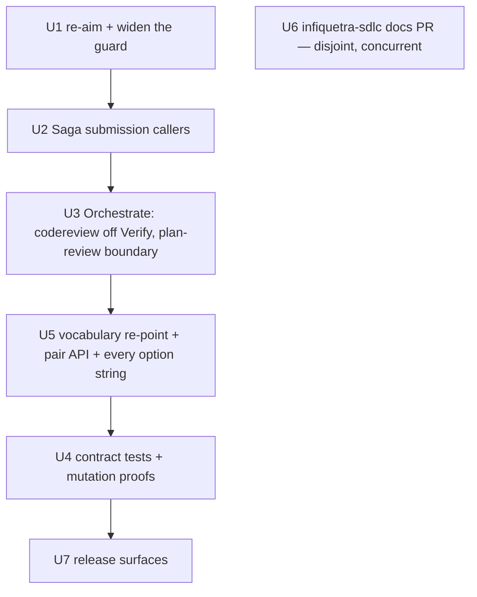

# WK1 — Finish the Mission Control board-submission path across Plan, Work, and Orchestrate

## Summary

Build the caller that closed issue #812 specified and never shipped: Saga's Plan and Work skills must
submit their five lifecycle board moves through Mission Control, Orchestrate must stop mapping code
review to `Verify`, and the zero-direct-write guard must be re-aimed from "names the operation" to
"reaches GitHub without Mission Control" and widened from one plugin to the fleet. One bounded
documentation-only pull request in `infiquetra/infiquetra-sdlc` records the operator's 2026-08-30
supersession by discharging a revisit trigger that has already fired.

Grounding turned up one fact that reshapes the unit and is not in the issue: **Orchestrate's board
vocabulary is stale against the live board, so its writes cannot land at all.** That is unit U5,
which is in scope and ungated — see "The vocabulary decision" below for the derivation and for how to
overturn it.

## Problem Frame

Saga makes none of the six project-board moves. The 0.145.0 change (W7) removed Plan's `Shaping` and
`Ready` moves and Work's `Active`, `Verify` and `Done` moves; `/loop` only detects drift against a
value already asserted; Mission Control is a write interface, not a watcher. The mechanism to submit
a move exists and is intact — `plugins/saga/scripts/board_progression.py:381` `default_board_writer`
builds `sdlc_manager.py flow set-field … --correction`, gated at `:443` by
`authorize_correction_field` against `CORRECTION_FIELDS = frozenset({"Status", "Stage"})`
(`plugins/saga/scripts/reversibility_certificate.py:59`). What never shipped is a caller.

**Five rungs, not six.** Both issues say Saga makes none of "the six" project-board moves, but only
five are ever named: Plan's `Shaping` and `Ready`, Work's `Active`, `Verify` and `Done`. The sixth is
identified nowhere in either issue. This plan builds the five that are named and does not invent a
sixth.

The operator superseded W7's broad reading on 2026-08-30. Deciding and submitting is not writing.
Mission Control alone executes; no path may compose or execute a direct field write; `Ready` must
gain a real first-move path.

## Pinned bases — fetch before work, re-resolve every line number

| Repository | Ref | Commit |
|---|---|---|
| `infiquetra/infiquetra-claude-plugins` | `origin/main` | `1c1c04a9` |
| `infiquetra/infiquetra-sdlc` | `origin/main` | `222fcdd34b0fff5146a50cc50d89fd4214ba4aca` |

Installed Saga `0.150.0` and Orchestrate `3.0.8` in both plugin roots, agreeing with
`.claude-plugin/marketplace.json`. The installed `skills/plan/SKILL.md` is byte-identical to the
repository copy (md5 `9b28d1ff5c75452ca5df8864daacfcff`).

**Self-referential hazard.** This unit edits the Plan and Work skills that the run itself executes,
and the board writer the run uses to report its own progress. The versions above are the pin; do not
let a unit be driven by the version it is modifying.

## The vocabulary decision — derived, and reversible

This was open question Q1 in the reviewed revision. It is now resolved **by derivation from the
run's own settled contract, not by a new operator ruling.** Both halves are recorded here as
assumptions the operator can overturn; each names exactly what would have to change.

**The live facts, re-queried against the Operations board on 2026-08-31** (this session, not the
schema alone — it also discharges the review's residual risk that the board had drifted from the
`222fcdd3` pin; it has not):

| Field | Options | Bare `Ready` present |
|---|---|---|
| `Stage` | 6: Intake / Shaping / Planning / Active / Verify / Retro | no |
| `Status` | 26, including `Ready for Active`, `Ready for Planning`, `Ready to merge`, `Ready to close` | no |

### Decision A — the write shape is the live `(Stage, Status)` pair

**Derivation.** The run's settled contract requires a real first-move path to `Ready`. `Ready` is a
valid option on **neither** live field. A single-field write therefore cannot express the required
move under any field choice, so the pair from issue #919's own board transition table is the only
shape that satisfies the contract. That table is already written in live vocabulary and matches the
schema exactly, which is independent evidence the pair was always the intended target.

**What this forecloses.** The field-retarget-alone reading — pass `field: "Stage"` and keep the
existing ladder — is **foreclosed, not deferred**. It resolves three of six ladder names by
coincidence (`Shaping`, `Active`, `Verify` are Stage options) and leaves `Idea`, `Ready` and `Done`
unresolvable. It cannot deliver `Ready`, which is the one rung the contract names. It also cannot
express the parent's pair table, and it fights KTD4.

**To overturn.** Name a single field that carries a valid option for every one of the five rungs
including `Ready`. If such a field existed the derivation would collapse, but neither live field
does, so overturning this realistically means changing the board's options — a board change, outside
this run.

### How a pair is actually submitted — one invocation, two assignments, not atomic

This is the shape every unit below must implement, and getting it wrong is the plan's sharpest
remaining false-green risk. Three verified facts, in order:

**1. Mission Control already carries both halves in one invocation.** `flow set-field` declares
`--field` and `--option` with `action="append"` (`sdlc_manager.py:7045-7056`, help text: "repeat with
--option to set multiple fields"), validates `len(args.field) == len(args.option)` at `:7292`, and
routes a multi-assignment call through `flow_set_fields_bulk` at `:7301`. Exercised live by the
orchestrator on 2026-08-31 moving issues #927–#930 to `Planning` / `Designing`: one call returned
**two identity records** — `set-field:Stage` with authorization `correction-field:Stage` and retry
identity `set-field-status:infiquetra-claude-plugins#927:Stage:Planning`, and the matching pair for
`Status`.

**2. The narrowing is on the Saga side, and it is THREE layers deep, not one.** The reviewed
revision said "widen `_reconcile_call`" and that is not sufficient — the argv is not built there, so
no change at that layer can make a one-field writer emit two flags:

| Layer | File | Today | Why it must widen |
|---|---|---|---|
| caller | `orchestrate.py:1949-1958` | one `target_state`, `payload=None` | must pass both assignments |
| gate + key | `reconcile_controller.py:231-262` | lifts one `field`, defaults to `Status`, mints one key | must authorize **every** field and key the pair |
| **argv** | `board_progression.py:440-511` | builds one `--field`/`--option` pair | **the only place the argv is built** |

**The minimal cut rides the existing `payload`.** `payload` is `dict[str, Any]` and already flows
`_reconcile_call` → controller → `authorize_and_write` → `board_writer`. Carrying an `assignments`
list in it changes **no function signature**, and every existing single-field caller keeps working
because an absent `assignments` falls back to today's `field` / `target_state` behaviour. That
backward compatibility is what keeps this widening small.

**It does not pass through untouched, and that matters.** `authorize_and_write` *reads and rewrites*
the payload on the way past — at `:215-225` it lifts `field`, writes it back into `pay`, authorizes
it, and mints the replay key from it. So there is a **fourth** widen site inside the third layer, and
it is the one that owns the ledger identity. It is named in U5's file table below.

**3. The pair is NOT atomic, and the plan must not pretend otherwise.** `flow_set_fields_bulk` loops
`for number in numbers: for field_name, option_name in lifecycle_assignments:` and calls
`_set_lifecycle_field_cross_board` **once per assignment**. Each call is all-or-none *across boards*
(R67), but the two assignments are independent: a `RuntimeError` on the second appends a `failed` row
and **does not roll back the first**. Only `LifecycleMutationHaltError` propagates. So a `Stage` write
can land while `Status` fails, leaving a half-applied pair on the board.

**4. Detection already works; the evidence is what gets thrown away.** `flow_set_fields_bulk` calls
`_out(result, fmt)` — printing `updated`, `failed`, and the per-assignment `identity` block to
**stdout** — and only *then* raises `RuntimeError` for a non-empty `failed`. So a half-applied pair
already exits non-zero, and `default_board_writer`'s existing `if returncode != 0: raise` already
fails loud. What is lost is *which half landed*: the writer's error message carries only `stderr`,
and the evidence is on stdout, discarded. The board is left half-written with no record of which
field to repair.

**What follows.** Submit both assignments in one invocation — cheapest, one discovery pass — and
**parse stdout on failure** so the surfaced error names the landed and the unlanded assignment. This
is a smaller change than the reviewed revision implied: the writer does not need to *decide* success
from the records, only to stop throwing them away. Two separate reconcile calls were considered and
rejected: they double the discovery cost, widen the half-applied window, and split the ledger into
two independent keys so a re-drive can re-land one half alone.

**Why this is a false-green trap and not a detail.** `Ready for Active` is a valid live `Status`. A
worker who submits only the `Status` half writes a legal value, gets a clean record, and leaves
`Stage` at whatever it was — `Shaping`, say, where `Ready for Active` is not a member of
`stage_statuses` at all. A test that asserts one captured argv passes. The board is wrong. Every
assertion in this plan therefore checks **both** fields.

### Decision B — the vocabulary re-point lands inside WK1 (U5 is in scope, ungated)

**Derivation.** The alternative was a separate fifth child. Issue #919 fixes run membership at
exactly four native children and admits a fifth only by an explicit operator membership amendment
recorded on that issue. No such amendment exists. Filing one would itself trip the run's stop
condition on widening beyond the four children. Keeping the re-point inside WK1 is therefore the only
disposition available without an operator action nobody has taken.

**To overturn.** Record a membership amendment on issue #919 admitting a fifth child. That is a
deliberate operator act, and it is the single thing that moves U5 out of this unit.

### What follows from A and B

- **The pair needs an API change.** `DEFAULT_STATUS_MAP` is `dict[str, str]` and `mapped_status`
  returns one string (`orchestrate.py:1919`). A pair-write cannot be stored or announced through
  that shape. The retype belongs to U5, together with the ladder it replaces.
- **The ladder-membership test changes with it.** `tests/test_orchestrate_board_writeback.py`
  `test_the_defaults_never_leave_the_ladder` asserts
  `set(DEFAULT_STATUS_MAP.values()) <= set(STATUS_LADDER)`. A live pair cannot enter the map while
  that assertion stands in its current form. It is a U5 edit.
- **The pair-versus-single question is answered.** It was Q2 in the reviewed revision, marked
  non-blocking. It was load-bearing, and Decision A settles it: pairs.
- **Option strings belong to U5 alone.** U3 keeps only the structural change. No other unit writes a
  live option name.

## Requirements

**R1.** Plan and Work each submit their lifecycle moves through Mission Control at five named
boundaries, each as the live `(Stage, Status)` pair per Decision A, and each naming the actor, the
trigger, and a runnable submission:

| Boundary | Skill section | Live pair submitted | Source |
|---|---|---|---|
| Plan start | `plan/SKILL.md` §0.6 | `Planning` / `Designing` | #919 table row 2 |
| Plan committed and reviewed | `plan/SKILL.md` §5.0 | `Planning` / `Ready for Active` | schema terminal exception |
| Work start | `work/SKILL.md` §1.3b | `Active` / `Implementing` | #919 table row 3 |
| Post-merge, deploy-or-artifact verified | `work/SKILL.md` §4.4 | `Verify` / `Awaiting verification` | #919 table row 5 |
| Delivered terminal | `work/SKILL.md` §4.4 | `Retro` / `Ready to close` | #919 table row 6 |

Every pair above is a live option combination present in `workflows.stage_flow.stage_statuses`.
**No retired token — `Idea`, `Ready`, `Done`, or a bare `Shaping`/`Active`/`Verify` submitted as a
`Status` — survives in any submission, map entry, prose sentence, or verification command.**

**Two notes on the mapping, because it is not one-to-one with the parent table.** First, Plan §5.0's
`Planning` / `Ready for Active` has no row in issue #919's table: the table's `Planning` / `Designing`
row covers "a plan document exists", which is the §0.6 boundary, and it carries no row for planning
*complete*. `Ready for Active` is the schema's own named terminal exception for the Planning stage —
one of exactly two options `entry_option_rule` says "preserve recorded progress" — so it is the
derived rung, not an invented one. Second, the parent's `Active` / `Code review` row is a
**coordinator** move at pull-request open. It is not one of Saga's five skill boundaries and no unit
here implements it.

**R2.** `Ready` has a real first-move path that fires on a standalone run, not only under
Orchestrate.

**R3.** No path under `plugins/` composes or executes a direct board-field write. Mission Control
remains the only executor.

**R4.** The guard in `tests/test_saga_no_direct_write.py` asserts the submit-versus-execute contract,
not the superseded names-no-operation rule, and scans the whole fleet rather than `plugins/saga/`.

**R5.** `codereview` maps to `Verify` nowhere, and no pre-merge path writes `Verify` under any
condition.

**R6.** Orchestrate's announce behaviour is unchanged apart from the lifecycle-field mapping: it
still posts its progress comment, still dedups on its idempotency discriminator, still degrades
silently when `reconcile_controller` is absent.

**R7.** The `AUTO_CORRECT_OP_KINDS` allowlist stays empty, and `config/sdlc-schema.json` is not
changed in either repository.

**R8.** The `infiquetra-sdlc` change is documentation only, in one pull request, and records the
supersession as the discharge of an already-fired revisit trigger.

**R9.** Every new regression guard carries a three-step mutation proof: RED under a deliberate
mutation, the mutation restored exactly, then GREEN.

**R10.** `bash scripts/gate.sh` exits 0 at the closing head.

## Key Technical Decisions

**KTD1 — The re-aimed guard discriminates on reaching GitHub, not on naming the operation.**
The current guard's discriminator is lexical presence of `set-field-status`
(`tests/test_saga_no_direct_write.py`, `assert "set-field-status" not in plan_skill`). Under W-D1
that discriminator is inverted: the submission it forbids is now mandatory. The replacement asks a
different question — *does this path reach GitHub without passing through Mission Control's
executor?* Legal: a fenced `reconcile_controller.py reconcile --op set-field-status` invocation, or a
Python call into `board_progression.authorize_and_write` / `default_board_writer`. Illegal anywhere
under `plugins/` except `plugins/mission-control/`: `updateProjectV2ItemFieldValue`, `gh project
item-edit`, a hand-built `optionId` payload, or any `gh api graphql` naming a `projectV2` field
mutation. Rejected: merely widening the existing lexical scan, which would forbid the sanctioned
submission fleet-wide and is itself a defect under W-D1.

**KTD2 — `Ready`'s first move belongs to Plan's Phase 5.0, with Orchestrate's map entry as a
complement, not a substitute.** Plan §5.0 already owns the moment in prose — "the plan exists and is
committed, so the card is no longer being shaped, it is ready to build" — and already holds the
derived state the move reads from. One actor, one trigger, no new machinery. Orchestrate
additionally gains the rung so an orchestrated run's plan-review boundary lands the same move.
Rejected: **Orchestrate alone** (fires only under an orchestrated run, so the standalone-run
acceptance criterion fails); **`/loop`** (W-D1 keeps it correction-only); **a watcher or daemon**
(the proportionality guardrail forbids it, and this is a single-operator suite).

**KTD2 decides the actor and the trigger only.** What option string the rung carries is not settled
here — it is settled once, in "The vocabulary decision" above, and implemented once, in U5. KTD2 says
*who* moves the card and *when*; Decision A says *what value*. Keeping those apart is what stops two
units writing the same option string.

**KTD3 — Orchestrate's writer was never the W-D1 violation; its `Verify` mapping and its missing
`Ready` were.** `announce_units` already routes every write through Saga's `reconcile_controller`
(`orchestrate.py:2064`), which reaches `board_progression` and then Mission Control. It composes
nothing and executes nothing directly. Under W-D1 that path is a legal submission, so Orchestrate's
writer is retained, not removed. This materially reduces the sequencing hazard the issue warns about:
nothing is being taken away that would have to be replaced first. The submission-first ordering is
still honoured because U1 and U2 precede U3.

**KTD6 — The pair-write is an API change to Orchestrate's map, and it belongs to exactly one unit.**
Decision A requires a `(Stage, Status)` pair, and Orchestrate cannot carry one today:
`DEFAULT_STATUS_MAP` is `dict[str, str]`, `mapped_status` returns a single string
(`orchestrate.py:1919`), `announce_units` skips any value not in `STATUS_LADDER` (`:2034-2041`), and
`test_the_defaults_never_leave_the_ladder` pins map values to that ladder. Those four facts move
together or not at all, so the retype, the re-point, the ladder replacement and the test change are
one unit — U5. Rejected: threading a pair through as a delimited string, which recreates the
stringly-typed vocabulary this decision exists to remove, and would pass the ladder test while still
submitting an unresolvable option.

**KTD4 — The board-vocabulary re-point resolves the schema; it does not hard-code a second ladder.**
`sdlc_manager.py` already resolves the canonical vocabulary through `_resolve_sdlc_schema()` (GitHub
main → vendored → local) and `_stage_flow_rules()` (`:376`) / `_stage_entry_options()` (`:390`). Orchestrate must not grow a
parallel copy. Rejected: hard-coding the current option names into `orchestrate.py`, which recreates
exactly the staleness U5 exists to fix.

**KTD5 — The `infiquetra-sdlc` amendment discharges a fired revisit trigger; it does not reverse a
decision.** Two facts make this clean, both verified at `222fcdd3`. First, the entry's own Decision
paragraph already separates authority from mechanism: "What R30 forbids is therefore not the
transport but Saga's autonomous authority to *initiate* a lifecycle-field move." Second, the entry's
`Revisit when` trigger — "W6 (#87) merges and its constrained mutation's real interface is known" —
has fired: issue #87 is closed (2026-08-29T07:00:53Z), and `verify_entry.recording_operation` in
`config/sdlc-schema.json` names W6's contract as landed 2026-08-28 with `flow set-field --correction`
as today's live mechanism. The amendment therefore supersedes the rejected alternative *"Giving
`/plan` and `/work` a submitting path"* in writing, citing the fired trigger and the first-move hole
as the evidence.

## High-Level Technical Design

The submission chain, verified end to end at `1c1c04a9`:

`Saga skill or Orchestrate --> reconcile_controller.py reconcile --op set-field-status --> board_progression.default_board_writer --> sdlc_manager.py flow set-field --correction --> _set_lifecycle_field_cross_board --> GitHub`

Only the last hop touches GitHub, and it lives in Mission Control. Every earlier hop is a submission.
That is the shape KTD1's guard encodes.

## Implementation Units

Seven units, all authorized. U1 through U5 and U7 share `plugins/saga/`, `plugins/orchestrate/` and
`tests/`, so they serialize. U6 has disjoint custody in a second repository and may run concurrently
from its own worktree.

**Where every live option string lives.** U5 owns all of them. U2 takes its five pairs from R1's
table; U3 writes none at all. That single-ownership rule is what keeps two units from writing the
same vocabulary, and it is the direct repair for the review's D3 and D8.

### U1. Re-aim and widen the zero-direct-write guard

**Why first:** the existing guard asserts `"set-field-status" not in plan_skill`. The moment U2 adds
a submission to `plan/SKILL.md`, that assertion goes red. The guard must be re-aimed before the
callers land, or the tree is red between units.

**Files:** `tests/test_saga_no_direct_write.py`.

**Scope:** replace the two lexical-absence assertions with submit-versus-execute assertions per KTD1.
Widen the scan root from `SAGA_ROOT` to `ROOT / "plugins"`, excluding `plugins/mission-control/`.
Preserve the three structural properties the file already carries and that are worth keeping: the
constant-resolution false-green guard (`_PY_CONSTANT_COMPOSE_RE`), the nested-run-artifact false-red
exclusion, and the `OP_KIND_CORE_FILES` / `OP_KIND_READ_SIDE_FILES` allowlists.

**Test scenarios** (`tests/test_saga_no_direct_write.py`):
- A fenced `reconcile_controller.py reconcile --op set-field-status` block in a Saga skill is
  reported as a legal submission, not an offense.
- A seeded module composing `updateProjectV2ItemFieldValue` under `plugins/orchestrate/` IS reported.
- The same composition under `plugins/mission-control/` is NOT reported.
- The existing nested-artifact and constant-resolution fixtures still behave as they do today.

**Mutation proof:** narrow the scan root back to `plugins/saga/`, prove the fleet-wide test goes RED,
restore the root exactly, prove GREEN.

**Tier:** `opus / high`.

**Lenses:** `correctness` — the guard's discriminator is inverted and a wrong inversion is silently
permissive; `testing` — this unit is entirely test code and a false-green here disarms the whole run;
`adversarial` — a guard is exactly the artifact worth attacking for a way past it.

### U2. The Saga submission callers — five boundaries across Plan and Work

**Files:** `plugins/saga/skills/plan/SKILL.md` (§0.6, §5.0),
`plugins/saga/skills/work/SKILL.md` (§1.3b, §4.4 `Verify`, §4.4 `Done`).

**Scope:** correct the superseded prose at each of the five boundaries. Each currently carries the
sentence "Do not run a reconcile tick, a `flow set-field` submission, or any other lifecycle-field
write from here" — that clause is what the operator superseded and it is what must go. Each
replacement names the actor, the trigger, and the runnable submission, and states plainly that
Mission Control still executes.

**Each fenced invocation carries BOTH assignments.** Per Decision A's submission shape, a boundary
submits its `(Stage, Status)` pair in one call — both `--field`/`--option` assignments present, not a
`Status` write alone. A single-assignment fenced block in any of the five sections is the same false
green U4's proof exists to catch: `Ready for Active` is a legal `Status` on its own, so the half-write
looks like success and leaves `Stage` behind. The prose must also say that both halves are checked,
because Mission Control does not roll the pair back.

**Two renames the prohibition removal does not cover, and that a worker will otherwise miss.** The
existing prose does not merely forbid the submission — it names the *wrong field* for it. Today's
text reads `Status → Ready`, `Status → Active`, `Status → Verify` and `Status → Done`. Every one of
those four is a retired token, and `Verify` and `Active` are `Stage` options being described as
`Status` moves. Deleting the prohibition while leaving the name still submits a value Mission Control
cannot resolve. **Each of the five boundaries takes its live pair from R1's table**, and Work §4.4's
Verify sentence in particular must stop calling the move a `Status` move: the live pair there is
`Verify` / `Awaiting verification`. W-D2's post-merge-plus-deployment rule is preserved verbatim;
only the field names change.

**Explicitly unchanged:** the `cc-workflows` driver seam at §1.5, the second-opinion machinery at
`work/SKILL.md:90-126`, Phase 3's hard-gate section, and the two surviving non-field operations
(`issue-progress-comment`, `sub-issue-close`) that R30 never governed.

**Test scenarios** (`tests/test_saga_no_direct_write.py`, extending U1):
- Each of the five boundaries names a submission — present and provable, not merely permitted.
- No boundary reintroduces the superseded prohibition sentence.
- Each boundary names the live pair R1 assigns it, and **no boundary names a retired token**
  (`Idea`, `Ready`, `Done`, or `Shaping`/`Active`/`Verify` written as a `Status` value).
- **Each fenced submission block carries two `--field`/`--option` assignments, not one.** A block
  with a single assignment fails this scenario even when the option it names is live.
- The two non-field operations survive.

**Mutation proof:** delete the submission from Plan §5.0, prove the first-move test goes RED, restore
it exactly, prove GREEN.

**Tier:** `opus / high`.

**Lenses:** `correctness` — five boundaries and a wrong one writes a lifecycle field at the wrong
time; `agent-usability` — these files are executable prose an agent must follow without re-asking;
`documentation-clarity` — the replacement text is the contract's only statement of who moves the card.

### U3. Orchestrate — take `codereview` off `Verify`, and establish the plan-review boundary

**Custody note, and the reason this unit is deliberately small.** U3 writes **no option string.**
Every live value in Orchestrate's map is U5's, because a live pair cannot enter the map until U5
retypes it (KTD6). U3's job is structural: delete one entry, and establish which unit-name prefix
carries the plan-complete boundary. If U3 tried to add the rung's *value* it would have to invent
either a dead literal the local ladder accepts or a pair the map cannot hold — the two failure modes
that motivate this split.

**Files:** `plugins/orchestrate/skills/orchestrate/scripts/orchestrate.py`
(`DEFAULT_STATUS_MAP` at `:1861-1868` — the `codereview` key only).

**Scope:** remove the `"codereview": "Verify"` entry at `:1866`, which closed `infiquetra-sdlc` #89
forbids. Establish `docreview` as the plan-complete boundary. Retain the writer per KTD3 — it is a
legal submission, not a violation. Change nothing else in the announce path, and do not touch
`STATUS_LADDER`.

**Which boundary carries the plan-complete rung.** `docreview`, currently mapped at `:1863`. That is
where the plan has been written *and* reviewed, which is what makes the card ready to build — the
same trigger Plan §5.0 uses standalone. `plan` stays on the plan-in-progress rung: a plan being
written is still being shaped. This reading follows the existing `mapped_status` semantics, where the
map records where a unit's boundary *lands* the card, not where it started. The pair each of those
two boundaries resolves to is R1's table, applied by U5.

**Test scenarios** (`tests/test_orchestrate_board_writeback.py`, extending `TestStatusMapping` and
`TestALandedUnitAnnounces`, reusing the existing `FakeReconcileController`):
- `mapped_status("codereview-…")` returns no `Verify` for any unit name.
- `docreview` and `plan` resolve to distinct rungs — asserted structurally, against the map's own
  keys, not against a hard-coded option string U5 owns.
- Announce still posts its progress comment, still dedups on its
  `orchestrate:{run}:{unit}:{status}` discriminator, still degrades silently with no controller
  (`R6`).

**Mutation proof:** restore `"codereview": "Verify"`, prove the map test goes RED, restore the
removal exactly, prove GREEN.

**Tier:** `opus / high`.

**Lenses:** `correctness` — a wrong rung writes a lifecycle field pre-merge, the exact defect this
unit removes; `api-contract` — `DEFAULT_STATUS_MAP` is a published contract consumers override key by
key; `reliability` — the announce path must keep degrading silently rather than costing a run.

### U4. Contract tests — pin what must not come back

**Files:** `tests/test_saga_board_first_move.py` (new — the first-move positive proof and the
pre-merge `Verify` negative) and `tests/test_orchestrate_status_map_contract.py` (new — the
`codereview` pin). Named here because "new tests under `tests/`" left a worker to invent both the
file and the seam.

**Scope:** the pins that survive this unit and block reintroduction. A fixture may not stand in for
the behaviour being proven; a green suite that never exercises the real submission path proves
nothing.

**What counts as proving the real path, stated exactly.** The proof is the **recorded `sdlc_manager.py`
argv**: build the writer with `board_progression.default_board_writer` and an **injected runner**
(the `runner` keyword it already accepts at `:385`, consumed at `:402`), drive the boundary, and
assert on the captured command. That exercises the real composition, the real certificate gate, and
the real field identity, and stops at the process boundary. This is the house pattern, not a new one:
the function's own docstring says "Tests inject a recording fake … the nested `gh` child runs ONLY
under a real `--autonomous` campaign."

**The assertion checks BOTH fields, and that is the whole point.** Asserting a single
`--field <Stage|Status> --option <live option>` is itself a false green: `Ready for Active` is a
valid live `Status`, so a `Status`-only submission passes such a test while `Stage` silently stays
where it was. **Assert both `(field, option)` assignments are present in the captured argv and that
together they equal the pair R1 assigns that boundary.** A test that passes when only one half landed
has not proven the first move; it has proven half of it.

**Also assert the half-applied case fails — and note what shape that test can actually take.** One
argv carrying both `--field Stage` and `--field Status` is **one** `subprocess.run` with **one**
returncode. No injected runner can succeed on `Stage` and fail on `Status` inside it; a test written
that way is unimplementable, and a worker who makes it pass has silently reintroduced the
two-invocation path Decision A rejected.

The observable proof against a one-argv writer is **one runner call returning a single
`CompletedProcess`** with `returncode=1` and stdout carrying Mission Control's own report — the
`Stage` assignment in `updated`, the `Status` assignment in `failed`, and an `identity` block built
from `updated` only. Assert two things: the boundary reports failure rather than `written` or
`skipped`, **and** the surfaced error names both the landed and the unlanded assignment. The second
half is the one that fails today, because the writer raises with `stderr` and drops stdout.

**`FakeReconcileController` is not sufficient for this one test.** It is the right fixture for U3's
announce behaviour, and it stays there. It stands *above* the seam this test exists to prove, so
using it here would assert the fake and claim the path.

**A live project-field write from pytest is forbidden.** No test in this unit may mutate a real
board. The injected runner is the boundary; nothing crosses it.

**Test scenarios:**
- A standalone run makes a first board move at each permitted boundary, submitted through Mission
  Control, proven by the recorded argv above. This is the defect's direct disproof and the most
  important test in the unit.
- `codereview` maps to `Verify` nowhere in the tree, pinned so it cannot be reintroduced.
- No pre-merge path writes `Verify` under any condition.
- `AUTO_CORRECT_OP_KINDS` is still empty.

**Mutation proof:** all three named mutations run here as one suite — restore the map entry, narrow
the guard, remove the submission call; each proves RED against its own test, is restored exactly, and
proves GREEN.

**Tier:** `opus / high`.

**Lenses:** `correctness` — these are the pins the whole unit rests on; `testing` — a fixture
substituted for real behaviour would make the suite green and the claim false; `adversarial` — the
question worth asking is what mutation these tests would miss.

### U5. Re-point Orchestrate's board vocabulary to the live schema, and carry the pair

**Status: in scope and authorized** by Decision B. This is the unit that makes a board write land,
and it owns **every live option string in the run**.

**Files.** The retype reaches further than the reviewed revision's list admitted. Everything below is
U5's, and a worker who changes only the map will leave four call sites and four assertions on the old
string shape.

`plugins/orchestrate/skills/orchestrate/scripts/orchestrate.py`:

| Site | Line | What changes |
|---|---|---|
| `Run.status_map` | `:420` | `dict[str, str]` → pair-valued, **and its docstring**, which currently says values "are still checked against the board's Status ladder" |
| `STATUS_LADDER` | `:1854` | deleted; replaced by schema resolution |
| `DEFAULT_STATUS_MAP` | `:1861-1868` | retyped and refilled per the rung table below |
| `mapped_status` | `:1919` | return type becomes the pair; longest-key override semantics preserved |
| `_reconcile_call` | `:1949-1958` | widened to carry both assignments (Decision A's submission shape) |
| ladder-membership skip | `:2034-2041` | validate against resolved `stage_statuses`; **fail loud, not skip** |
| submission call | `:2064` | names both fields; reads both identity records |
| announce discriminator | `:2071` | `f"orchestrate:{run}:{unit}:{status}"` interpolates a pair — pin a stable rendering or the idempotency key changes shape |
| `announce_comment_body` | `:1932` | renders the status into prose; must render a pair |

`tests/test_orchestrate_board_writeback.py` — four clusters, not one:

| Test | Line | Why it breaks |
|---|---|---|
| `test_the_defaults_never_leave_the_ladder` | `:239-240` | asserts map values ⊆ `STATUS_LADDER`; re-aim at resolved `stage_statuses` |
| `test_the_status_map_overrides_key_by_key` | `:230-233` | overrides with the retired string `"Ready"` |
| `test_a_specific_name_beats_a_shorter_prefix` | `:235-237` | overrides with retired `"Done"` / `"Verify"` |
| `status_writes` assertions | `:309-310`, `:362`, `:410`, `:429` | assert `len(...) == 1` and exact single-field records; a pair changes both the count and the shape |
| `FakeReconcileController` capture | `:94`, `:116` | records one status write per call; must capture both assignments |

**The new override shape, stated so a worker does not invent one.** A `Run.status_map` override is a
`(Stage, Status)` pair validated against resolved `stage_statuses` — not a leftover string, and not a
string that happens to parse. An override remains "a way to re-route a phase, not a way to invent a
status", which is the existing docstring's promise and survives the retype.

**Two Saga files U5 also owns — the widening the reviewed revision left unowned.** Without these,
`_reconcile_call` can pass a pair that nothing downstream can emit:

| File | Site | Minimal scope |
|---|---|---|
| `plugins/saga/scripts/board_progression.py` | `default_board_writer`, `:440-511` | Read an optional `assignments` list from `payload`; emit one `--field`/`--option` per assignment; run `authorize_correction_field` for **every** field, not just the first; on non-zero, parse stdout and name the landed and unlanded assignments in the raised error instead of reporting `stderr` alone. Absent `assignments` → today's exact single-field behaviour |
| `plugins/saga/scripts/board_progression.py` | `authorize_and_write`, **`:215-225`** | The **ledger-identity site**, and it mints its own key — it independently lifts `pay.get("field") or "Status"` at `:217`, authorizes that one field at `:222`, and builds the replay key at `:225` with `field=field_kw`. Widen the same three steps to the assignments list, so the key names the pair. Absent `assignments` → today's exact single-field key |
| `plugins/saga/scripts/reconcile_controller.py` | `:231-262` | Authorize every field in the pair (today it gates on one `field_kw` and defaults to `Status`); carry the pair into `cert.idempotency_key` so the ledger identity names the pair, not one half |

**Why the ledger identity must move with the writer, said plainly.** There are **two** key-minting
sites, not one: the controller at `reconcile_controller.py:244` and `authorize_and_write` at
`board_progression.py:225`. Widening only the controller leaves the writer minting
`set-field-status:{repo}#{n}:Status:{value}` — a **single-field** identity for a **two-field**
operation. The consequence is not merely a missed skip:

- **A pair write and a Status-only write to the same value collide on one ledger key.** Both mint
  `set-field-status:repo#927:Status:Ready for Active`. Whichever runs second is **skipped** as
  already-applied, so a pair whose `Stage` half never landed is recorded `skipped` — a success-shaped
  record for a move that did not happen.
- **In the other direction**, a re-announce misses the pair-key and re-drives a write that already
  landed. Board-side that rewrite is idempotent, which is why this is P2 rather than P1.

Two semantically different operations sharing one replay identity is exactly the property closed
issue #812 exists to protect, and it breaks silently — no error, no drift record, just a `skipped`.

**Remedy chosen, and the one rejected.** The review offered two: name `:215-225` in this row, or
declare the controller's pair-key the sole ledger identity and have `authorize_and_write` consume it.
**This plan takes the first.** `authorize_and_write` has **three** callers —
`reconcile_controller.py:252`, `outcome_board_sync.py:339`, and `board_progression.py:581`'s own
`write` subcommand — and only one of them is the controller. Making the key caller-supplied would
break the other two or force each to mint its own, duplicating the minting logic at three sites
instead of one, and it would reach into `/outcome`, which this run is explicitly barred from
touching. Widening the existing self-sufficient logic keeps every caller working and keeps the blast
radius inside this unit.

**No new op-kind.** `set-field-status` carries the pair. Creating `set-field-pair` would repeat the
mistake DECISIONS `{#812-correction-field-named-identity}` already rejected for `set-field-stage`:
dead API surface needing its own certificate registry entry, reversibility tier and inverse
descriptor, when the existing op-kind's payload already carries the shape.

**Rejected: widen `_reconcile_call` alone.** This was the reviewed revision's position and it cannot
work — `board_progression` builds the argv, so a one-field writer emits one flag no matter what the
caller passes.

**Rejected: two `default_board_writer` calls, one per field.** Reintroduces the two-invocation path
Decision A rejected, and splits one logical move into two ledger keys so a re-drive after a
half-applied write can re-land one half alone.

**Rejected: call `sdlc_manager.py` directly from Orchestrate.** Violates W-D1 outright and discards
the certificate gate, the idempotency ledger, and the replay key.

**Issue #927's "Files expected to change" list must grow by exactly two paths** — it names
`orchestrate.py`, the two skill files, the guard test, new tests, the release surfaces and the two
`infiquetra-sdlc` documents, and none of the widening above:

```
plugins/saga/scripts/board_progression.py      — default_board_writer: emit N assignments, parse stdout on failure
plugins/saga/scripts/reconcile_controller.py   — authorize every field in the pair; key the pair
```

Nothing else changes in that list. Both files are already inside the guard's `OP_KIND_CORE_FILES`
allowlist (`test_saga_no_direct_write.py`), so widening them does not trip U1's fleet-wide scan —
they are the submission core the guard has always exempted, which is also why they are the right
place for this change rather than a new module.

No schema file in either repository is edited.

**Why it exists:** `STATUS_LADDER = ("Idea", "Shaping", "Ready", "Active", "Verify", "Done")` is
stale on both live fields. Verified against the live Operations board (project 3) and against
`workflows.stage_flow` in `config/sdlc-schema.json` at `222fcdd3`, which agree exactly:

| Field | Live options |
|---|---|
| `Stage` | Intake / Shaping / Planning / Active / Verify / Retro |
| `Status` | stage-scoped; 26 options, none of them `Idea`, `Ready`, or `Done` |

Orchestrate submits `--field Status` (the default when `payload=None`,
`reconcile_controller.py:232`) with a target drawn from that ladder. Zero of the six values is a live
`Status` option, and `_set_lifecycle_field_cross_board` halts before the first write on an
unresolvable option. **Every Orchestrate board write currently halts.** Three of the six values
(`Shaping`, `Active`, `Verify`) happen to be live `Stage` options, which is coincidence, not design.

**Scope — five changes that move together (KTD6):**

1. **Retype the map.** `DEFAULT_STATUS_MAP` becomes a mapping to a `(Stage, Status)` pair, and
   `mapped_status` returns that pair. This is the API change; `Run.status_map`'s per-key override
   contract is preserved in the new shape.
2. **Replace the ladder with a resolved vocabulary.** Delete `STATUS_LADDER` as a hard-coded tuple.
   Validate a rung against `workflows.stage_flow` resolved through Mission Control's existing
   `_resolve_sdlc_schema()` / `_stage_flow_rules()` (`sdlc_manager.py:376`) (KTD4 — do not grow a second copy in Orchestrate).
3. **Fill in every rung, named explicitly.** R1's table covers Saga's five *skill* boundaries and
   does not map one-to-one onto Orchestrate's six *unit-prefix* keys — it has no `fix` row and two
   Work §4.4 rows. Guessing the remainder is how `landed` ends up on `Retro`. The six keys are:

   | Orchestrate key | Live pair | Stage index | Why |
   |---|---|---|---|
   | `plan` | `Planning` / `Designing` | 2 | a plan is being designed |
   | `docreview` | `Planning` / `Ready for Active` | 2 | planning complete — the rung U3 established |
   | `work` | `Active` / `Implementing` | 3 | building |
   | `fix` | `Active` / `Implementing` | 3 | repair is still pre-merge Active |
   | `codereview` | `Active` / `Code review` | 3 | **pre-merge stays Active — this is the W-D2 repair** |
   | `landed` | `Verify` / `Awaiting verification` | 4 | post-merge, W-D2's own entry condition |

   All six were validated against resolved `stage_statuses`: every pair is live, and the stage
   indices are monotonic (2, 2, 3, 3, 3, 4), so no rung moves a card backwards.

   **`landed` is `Verify`, not `Retro`.** `Retro` / `Ready to close` is the parent's row for *child
   closed and gate green*. Orchestrate's `landed` is a unit-landed announce — the post-merge side of
   W-D2, not close-out. Mapping it to `Retro` would move `Stage` past `Verify` and skip the
   merge-plus-deploy-or-artifact rule **this very child is enforcing on Orchestrate**. `Retro` /
   `Ready to close` stays on Work's delivered-terminal skill boundary (R1 row 5) and on the
   coordinator. It is not an Orchestrate rung.

   **`codereview` is remapped, not deleted.** U3 removes its `Verify` *value*; U5 fills in `Active` /
   `Code review`, which is the parent table's own row and satisfies W-D2's "pre-merge stays Active".
   Deleting the key outright would silently stop announcing at a boundary that announces today — a
   behaviour regression beyond the mandate, and one that `mapped_status` would report as "no status
   mapped for this unit's prefix" rather than as an error.

   **Rejected: `fix` → `Active` / `Repairing`.** `Repairing` is a live Active status and is
   semantically sharper. It is still rejected here: today `work` and `fix` both map to the same rung,
   and splitting them is a phase-semantics change, not a vocabulary re-point. Out of mandate. Worth
   revisiting once the re-point has landed.
4. **Change the ladder-membership test with it.** `test_the_defaults_never_leave_the_ladder` asserts
   `set(DEFAULT_STATUS_MAP.values()) <= set(STATUS_LADDER)`. Re-aim it: every map value is a pair
   present in the resolved `stage_statuses`. The assertion is not deleted — it is re-pointed at the
   live authority, so it still fails on an invented rung.
5. **Carry both assignments end to end, and stop discarding the evidence.** `_reconcile_call` passes
   `payload=None` today, which is why the field silently defaults to `Status`
   (`reconcile_controller.py:233`). Put both assignments in the payload, authorize both at the
   controller, emit both flags at the writer, and — because `flow_set_fields_bulk` is **not** atomic
   across assignments — **parse the writer's stdout on failure** so the raised error names which
   half landed. Detection itself is already correct: a non-empty `failed` raises, so the exit code is
   already non-zero and the existing `if returncode != 0: raise` already catches it. The defect is
   that the error reports `stderr` while the `updated`/`failed`/`identity` evidence sits on stdout.
   Extend the existing all-or-none reasoning beside the announce writes at `:2065-2069` to cover a
   two-assignment pair: today it reasons about one status write plus a comment.

**Test scenarios** (`tests/test_orchestrate_board_writeback.py`):
- Every one of the six rungs resolves to a `(Stage, Status)` pair present in the schema's
  `stage_statuses`, and the stage indices are non-decreasing across the ladder order.
- **A half-applied pair fails and names which half landed.** One runner call returning
  `returncode=1` with stdout carrying `Stage` in `updated` and `Status` in `failed`; the unit's
  record must be a failure, not a success, and must name both assignments. Not two runner outcomes —
  one argv is one returncode.
- **A single-assignment payload is refused.** A boundary whose payload carries one assignment where
  R1 assigns a pair fails at the writer rather than submitting a legal half.
- **The replay key names the pair, and a pair does not collide with a Status-only write.** Mint the
  key for a `(Stage, Status)` pair and for a `Status`-only write to the same option; assert the two
  keys differ. Without this the second operation is `skipped` as already-applied — the silent
  replay-safety break that closed issue #812 exists to prevent.
- **Both key-minting sites agree.** The controller (`reconcile_controller.py:244`) and
  `authorize_and_write` (`board_progression.py:225`) produce the same identity for the same pair, so
  a re-announce meets the key the first write left.
- **An unresolvable rung fails loud.** Today `announce_units` *skips* an off-ladder value with a
  `skipped` record (`:2034-2041`) — a silent no-op that is exactly how this defect stayed invisible.
  A rung naming an option the schema does not carry must produce a failure record, not a skip.
- `landed` does not resolve to any `Retro` pair, pinned so a later edit cannot skip `Verify`.
- A `Run.status_map` override still wins key-by-key and longest-key-first, in the new pair shape.
- No retired token (`Idea`, `Ready`, `Done`) survives anywhere in the module.

**Mutation proof:** reintroduce a retired option name in the map, prove the vocabulary test goes RED,
restore exactly, prove GREEN.

**Tier:** `opus / high`.

**Lenses:** `correctness` — this is the unit that decides whether any board write lands at all;
`api-contract` — the vocabulary is a cross-repository contract with a schema as its authority;
`reliability` — a halting writer must stay loud, never degrade to a silent skip.

### U6. The `infiquetra-sdlc` documentation pull request — disjoint custody, may run concurrently

**Repository:** `infiquetra/infiquetra-sdlc` at `222fcdd3`, its own worktree and branch.

**Files:** `docs/process/saga-board-write-authority.md` (the "What was removed (W7)" section) and
`docs/engineering-journal/DECISIONS.md` (the W7 entry).

**Scope:** documentation only, and it is **three corrections, not one.**

1. **Supersede the rejected alternative.** In `DECISIONS.md:635`, the bullet *"Giving `/plan` and
   `/work` a submitting path"* is superseded in writing per KTD5 — citing the entry's own
   authority-versus-mechanism sentence (`:606-607`), the fired revisit triggers, and the first-move
   hole as the evidence.

2. **Cite BOTH fired triggers, not just one.** The entry's `Revisit when` clause (`:651-654`) names
   three conditions. Two have fired: W6 (issue #87) merged — closed 2026-08-29, its contract landed
   2026-08-28 and is named in `verify_entry.recording_operation` — **and W13 created the `Stage`
   field**, which the same clause says "makes the certificate's currently-dead `Stage` authorization
   live." `Stage` is live on Operations today with six options, verified this session. Citing only
   W6 would leave the second discharge unrecorded.

3. **Delete the two now-false statements in the process document.** `saga-board-write-authority.md`
   still says `Stage` is "allowed, not live on any board" (`:58-59`) — false since the W13 migration
   — and still lists the retired phase-boundary moves as `Status → Shaping / Ready / Active / Verify
   / Done` (`:29-31`), every one of which is a dead token. A pull request that supersedes the
   rejected alternative and leaves those two sentences standing re-teaches the stale model in the
   same file.

**Explicitly not in scope:** any change under `config/`. The acceptance check is
`git -C ../infiquetra-sdlc diff --stat origin/main -- config/` returning empty.

**Test expectation:** none — documentation-only, in a repository this run may not implement in. The
acceptance check above is the verification.

**Tier:** `opus / high`.

**Lenses:** `documentation-clarity` — the two repositories must state one rule in words a cold reader
cannot misread, and it also covers the journal supersession. The always-on four still run.

`previous-comments` was named here in the reviewed revision and is **withdrawn**: its roster guidance
is "select only when the reviewed pull request has prior review comments or unresolved threads that
apply to the current revision." U6 opens a *new* pull request in a second repository, so that lens
would resolve non-applicable and read as a miss in the integrated review.

### U7. Release surfaces — Saga and Orchestrate

**Files:** `plugins/saga/.claude-plugin/plugin.json`, `plugins/saga/CHANGELOG.md`,
`plugins/orchestrate/.claude-plugin/plugin.json`, `plugins/orchestrate/CHANGELOG.md`,
`.claude-plugin/marketplace.json`.

**Scope:** bump both plugins and align the marketplace registry, per the repository's release-surface
rule. Sibling units in this run bump the same Saga surface, so re-bump at merge time if a sibling
lands first.

**Test expectation:** the existing version and metadata drift-guard tests.

**Tier:** `opus / high`.

**Lenses:** `correctness` — a registry that disagrees with the plugin manifest ships a broken install.

## Unit tiers

Every unit runs at `opus / high` on the company account, session `cp919-worker-1`. This is an
**operator binding from the run's approved roster, not a work-shape derivation** — the shared policy
would propose `sonnet / medium` for the mechanical units (U7 especially). The binding overrides it
and may not be substituted.

| Unit | Tier | `worth_it_because` | `cheaper_fallback` |
|---|---|---|---|
| U1 | `opus / high` | Inverting a guard's discriminator wrong fails permissively and silently | `sonnet / high` |
| U2 | `opus / high` | Five lifecycle boundaries in executable prose; a wrong one writes a field at the wrong time | `sonnet / high` |
| U3 | `opus / high` | Removes the entry that violates a closed cross-repository contract | `sonnet / high` |
| U4 | `opus / high` | These pins are what stop the defect returning | `sonnet / high` |
| U5 | `opus / high` | Decides whether any board write lands at all | `sonnet / high` |
| U6 | `opus / high` | Supersedes a recorded decision across two repositories | `sonnet / high` |
| U7 | `opus / high` | Operator binding; mechanical work carried at the bound tier | `sonnet / medium` |

No `Estimate` column is rendered: `spend_estimate.py estimate` reads an `ExecutionSpec`, and this
plan's backend is `inline`, so no spec exists. Fabricating figures without one would be worse than
omitting the column.

## Sequencing — what serializes, and why

Execution order is `U1 --> U2 --> U3 --> U5 --> U4 --> U7`, with U6 concurrent. Unit identifiers are
stable from the reviewed revision and deliberately not renumbered; U5 moved in the order, not in its
name.



**The whole main lane serializes on real overlapping-file custody**, not on a lane budget. U1, U2,
U4 and U5 all edit `tests/`; U2 and U7 both touch `plugins/saga/`; U3, U5 and U7 all touch
`plugins/orchestrate/`; U3 and U5 edit the same map.

**Three orderings are load-bearing.** U1 before U2, because the current guard asserts
`"set-field-status" not in plan_skill` (`test_saga_no_direct_write.py:165`) and goes red the moment
U2 adds a submission. U3 before U5, because U3 removes a key and U5 retypes what remains — the
reverse order retypes an entry that is about to be deleted. **U5 before U4**, because U4's pins must
assert against the final shape; running U4 first would pin the stale vocabulary and then have to be
rewritten by the unit it was supposed to guard.

**U6 may run concurrently in its own worktree.** It is the only genuinely disjoint custody in this
unit: a second repository, no shared file, no shared release surface, and its acceptance check is
independent. It is the one place parallelism is demonstrated rather than assumed.

**On the sequencing hazard.** The issue warns that removing Orchestrate's writer before the
submission path exists makes every run go stale. Under W-D1 and KTD3 the writer is *not* removed —
it is already a legal submission — so nothing is taken away that must be replaced first. The
submission-first ordering is still honoured: U1 and U2 land the Saga callers before U3 touches
Orchestrate's map.

## Risk analysis

| Risk | Treatment |
|---|---|
| The re-aimed guard fails permissively — it stops catching real composed writes | U1's mutation proof plus the seeded-offense scenarios; the guard must report a seeded `updateProjectV2ItemFieldValue` under `plugins/orchestrate/` |
| A test fixture substitutes for the real submission path, making the suite green and the claim false | U4 scenario 1 exercises the real path; named as a run-level obligation in the parent issue |
| A sibling unit in run cp919 bumps the same Saga release surface first | U7 re-bumps at merge time; this collision is known and recurrent in this repository |
| The run reports its own progress through the writer it is changing | Versions pinned above; do not drive a unit with the version it modifies |
| U3 and U5 both edit `DEFAULT_STATUS_MAP` | U3 writes no option string and touches only the `codereview` key; U5 owns the retype and every value. Serialized U3 → U5 |
| Decision A or B is overturned after U5 lands | Both name their reversal explicitly. A needs a board option change; B needs a membership amendment on issue #919. Neither is silent |
| The pair retype breaks `Run.status_map`'s per-key override for existing runs | U5's file table names `Run.status_map` at `:420` with its docstring, both `TestStatusMapping` override cases, all four `status_writes` assertions, and the `FakeReconcileController` capture. The override contract is preserved in the new shape |
| **A half-applied pair leaves the board half-written with no record of which half** | Detection works — a non-empty `failed` raises, so the exit is non-zero — but the writer raises with `stderr` while the `updated`/`failed`/`identity` evidence sits on discarded stdout. U5 parses stdout; U4 asserts the error names both assignments |
| A worker satisfies the half-applied test by looping two runner calls | That silently restores the two-invocation path Decision A rejected. U4 states the proof is **one** runner call with one returncode, and U5's rejected-alternatives list names the two-call shape explicitly |
| **The writer emits a pair while the replay key still names one field** | Two key-minting sites exist (`reconcile_controller.py:244`, `board_progression.py:225`); widening only the first lets a pair and a Status-only write collide on one identity, so the second is `skipped` — success-shaped, for a move that never landed. Both sites are in U5's file table, with a test asserting the two keys differ and that both sites agree |
| A single-assignment submission passes the first-move test | `Ready for Active` is a legal `Status` alone, so this looks green. Every assertion in the plan checks both fields — U4's proof, U2's fenced blocks, and U5's rung test |

## Scope Boundaries

**Out of scope — do not touch.** The `cc-workflows` driver seam at `work/SKILL.md` §1.5; the
second-opinion machinery at `work/SKILL.md:90-126` (owned by the Saga Code Review parent);
`config/sdlc-schema.json` in either repository; the `AUTO_CORRECT_OP_KINDS` allowlist, which stays
empty; `engine-registry.yaml`; Phase 3's hard-gate section; merge confirmation, the four typed review
outcomes, and the rule that a programmatic review writes nothing.

**Not implemented anywhere but `infiquetra-claude-plugins`.** The `infiquetra-sdlc` surface is one
documentation-only pull request.

**In scope, and why it is not deferred.** The stale-vocabulary repair is U5 in this plan rather than
a separate issue, per Decision B: issue #919 fixes membership at four native children, and admitting
a fifth needs an operator amendment that does not exist. It is also the difference between a board
write that lands and one that halts, so deferring it would ship a caller that still cannot move a
card.

**Deferred to follow-up work.** The two stale journal entries in this repository named in Q3. They
are outside this unit's file custody and no unit here corrects them.

## Verification

### The `Ready` check in both issues is a false green — replace it

Issues #919 and #927 both verify the first-move rung with:

```bash
grep -rnE '"Ready"' plugins/orchestrate plugins/saga     # DO NOT USE
```

That command **passes today, before any work is done**, because it matches the retired literal in
`STATUS_LADDER` at `orchestrate.py:1854`. It would also pass if a unit added a dead `"Ready"` map
entry, which is the precise failure this unit exists to prevent. It cannot pass or fail on the thing
that matters, because bare `Ready` is not a live option on either field, so the rung it is supposed
to prove will never contain the string it greps for.

**Replacement — one positive resolution check plus two scoped negative sweeps.** The positive proves
the rung resolves to a pair the schema actually carries; the negatives prove no retired token
survived. A single literal grep cannot do either, which is why the replacement is three commands.

```bash
# POSITIVE — every rung resolves to a live (Stage, Status) pair. Fails loud on an invented rung.
python3 -c "
import json, sys
sys.path.insert(0, 'plugins/orchestrate/skills/orchestrate/scripts')
import orchestrate as o
sf = json.load(open('plugins/mission-control/config/sdlc-schema.json'))['workflows']['stage_flow']
live = {(st, s) for st, ss in sf['stage_statuses'].items() for s in ss}
bad = [(k, v) for k, v in o.DEFAULT_STATUS_MAP.items() if tuple(v) not in live]
assert not bad, f'rungs not live on the board: {bad}'
print('all rungs live:', len(o.DEFAULT_STATUS_MAP))"

# NEGATIVE A — no retired token survives in Orchestrate's board vocabulary. Expect no output.
grep -nE '^(STATUS_LADDER|DEFAULT_STATUS_MAP)|^\s+"(plan|docreview|work|fix|codereview|landed)":' \
  plugins/orchestrate/skills/orchestrate/scripts/orchestrate.py | grep -E '"(Idea|Ready|Done)"'

# NEGATIVE B — no Saga board-move prose still names a retired token. Expect no output.
grep -nE 'Status *(->|→) *(Idea|Ready|Active|Verify|Done)\b' \
  plugins/saga/skills/plan/SKILL.md plugins/saga/skills/work/SKILL.md
```

**All three were run against the tree at `1c1c04a9`, and all three are RED today** — which is the
whole difference from the command they replace. The positive exits 1 with
`AssertionError: rungs not live on the board: [('plan', 'Shaping'), ('docreview', 'Shaping'),
('work', 'Active'), ('fix', 'Active'), ('codereview', 'Verify'), ('landed', 'Done')]` — all six
rungs named. Negative A returns two lines (`STATUS_LADDER`, `"landed": "Done"`); negative B returns
four (`plan/SKILL.md:312`, `work/SKILL.md:253`, `:780`, `:787`). All three must be clean when the
unit is done. The retired `grep -rnE '"Ready"'`, by contrast, passes on this same tree with no work
done at all.

The scoping matters: an unscoped
`grep -rnE '"(Idea|Ready|Done)"'` false-reds on three unrelated files — a lifecycle diagram label in
`render_docs_visuals.py:143` and two board-unrelated uses of `"Done"` — which is why the sweeps are
anchored to the map, the ladder, and the `Status →` prose form.

**One honest limit.** Negative B catches the four boundaries written in `Status → X` form. Plan §0.6
names its move in prose without the arrow, so the grep does not reach it; the positive check and
U2's own test scenario cover that fifth boundary. The sweeps are a backstop, not the proof.

### The rest of the block

```bash
grep -nE '"codereview"' plugins/orchestrate/skills/orchestrate/scripts/orchestrate.py
grep -nE 'DEFAULT_STATUS_MAP' -A 12 plugins/orchestrate/skills/orchestrate/scripts/orchestrate.py
grep -rnE "set-field-status|set_field_status" plugins/ | grep -v mission-control
grep -nE "compose|execute|submit" tests/test_saga_no_direct_write.py
grep -rnEi "submit|flow set-field|mission control" plugins/saga/skills/plan/SKILL.md plugins/saga/skills/work/SKILL.md
git -C ../infiquetra-sdlc diff --stat origin/main -- config/

uv run pytest tests/ -q -k "no_direct_write or board or status_map or orchestrate"
GATE_LOG_DIR=/tmp/gate-run bash scripts/gate.sh > /tmp/gate.log 2>&1
cat /tmp/gate-run/result.txt
```

## Open questions

**Q1 and Q2 are resolved.** Both are now recorded in "The vocabulary decision" above — Q1 as
Decisions A and B, Q2 as the pair-versus-single half of Decision A. Neither was resolved by a new
operator ruling; both were derived from the run's own settled contract and from issue #919's
membership rule, and both carry a stated way to overturn them. They are kept named here so a reader
of the reviewed revision can find where they went.

**Q3 — non-blocking, and now two entries rather than one.** The journal entry
`{#812-status-only-no-stage-field}` in this repository states the live boards have no `Stage` field;
its sibling `{#812-correction-field-named-identity}` says `Stage` "remains a name on the allowlist
only" and sets its own revisit trigger as "a Stage project field is actually created on Operations,
Asgard, or CAMPPS". Both were true on 2026-08-25 and both are false now — that trigger has fired.
Neither is in this unit's file custody, so I did not touch them. U6 corrects the equivalent
statements in `infiquetra-sdlc`; these two want the same correction from whoever next edits this
repository's journal.

**Q4 — non-blocking, for the operator rather than the worker.** Two acceptance criteria on issues
#919 and #927 read oddly once the stale vocabulary is known. "Orchestrate never went dark: the
submission path existed and was exercised before its writer was removed" describes a risk that did
not occur in the direction stated — Orchestrate's writer is not removed (KTD3), and its writes are
already halting. The criterion is satisfiable as written but proves less than it appears to. Worth a
wording pass when the issues are next amended; nothing in this plan depends on it.

---

## Revision record — document-review repair pass, 2026-08-31

Repairs the ten findings in
`docs/reviews/2026-08-30-cp919-wk1-board-submission-path-plan-doc-review.md` (BLOCKED: three P1,
five P2, two P3). Every finding was verified against the tree before repair rather than accepted on
report; two of the review's own facts were corrected in doing so.

| Finding | Priority | Disposition |
|---|---|---|
| D1 | P1 | Repaired. Q1 replaced by "The vocabulary decision" — Decisions A and B, each derived, each with a stated reversal. The field-retarget reading is recorded as **foreclosed**, with the reason |
| D2 | P1 | Repaired. R1 now carries a five-row live-pair table; U2 gains the two field renames the prohibition removal did not cover; U3 writes no option string |
| D3 | P1 | Repaired. The live-pair decision moved out of KTD2 into Decision A. KTD2 now decides actor and trigger only. KTD6 added for the map retype |
| D4 | P2 | Repaired. Q2 promoted out of "non-blocking" and answered by Decision A: pairs |
| D5 | P2 | Repaired. Dead vocabulary swept from R1, U2's prose scope, U3's custody, and the verification block; the retired-token sweeps are new |
| D6 | P2 | Repaired. U6 restated as three corrections: supersede the bullet, cite **both** fired triggers (W6/#87 and W13/`Stage`), and delete the two now-false sentences at `:29-31` and `:58-59` |
| D7 | P2 | Repaired. Both test files named; the proof seam is the recorded `sdlc_manager.py` argv via `default_board_writer`'s injected `runner`; live board writes from pytest forbidden |
| D8 | P2 | Repaired. U3 keeps the `codereview` deletion and the boundary; U5's file list gains `STATUS_LADDER`, `mapped_status`, the announce skip, and the ladder-membership test |
| D9 | P3 | Repaired. `previous-comments` withdrawn from U6 with the roster guidance quoted |
| D10 | P3 | Repaired. `:440` corrected to `:443`; "five named Saga rungs" replaces "six", and the missing sixth is called out as unidentified in both issues |

**Nothing was rejected.** All ten findings were actionable and all ten are repaired.

**Two corrections to the review itself**, neither changing any finding:

1. The review's residual-risk note says the live Operations board was not re-queried. It was
   re-queried during this repair pass, on 2026-08-31. The board still agrees with the schema at
   `222fcdd3`: `Stage` 6 options, `Status` 26 options, no bare `Ready` on either. The residual risk
   is discharged.
2. The live `Status` option count is **26**, not 25. Both figures appear in the run's correspondence;
   26 is what the board returns. Nothing downstream depends on the count.

**Ordering changed, identifiers did not.** Execution order is now `U1 → U2 → U3 → U5 → U4 → U7` with
U6 concurrent. U5 moved ahead of U4 so the contract pins assert the final shape. No U-ID was
renumbered.

---

## Revision record — round-3 repair pass, 2026-08-31

Round 2 confirmed D1–D10 repaired, none partial, and confirmed both Part A and Part B derivations
sound. It raised three new findings against the repair itself. All three are repaired here; D1–D10
were not reopened.

| Finding | P | Disposition |
|---|---|---|
| N1 | P1 | Repaired. New section "How a pair is actually submitted" states the shape once; U2's fenced blocks, U5 item 5, and U4's proof all now require **both** assignments, and U4 additionally asserts the half-applied case fails |
| N2 | P2 | Repaired. U5's file list replaced by two tables naming nine `orchestrate.py` sites and five test clusters, with the new override shape stated |
| N3 | P2 | Repaired. All six Orchestrate rungs named explicitly in a table, validated live and stage-monotonic; `landed` pinned to `Verify`, never `Retro` |

**What changed on N1, beyond what the review suggested.** The review proposed two reconcile calls,
Stage then Status, and said not to touch `board_progression.py`. The orchestrator's live evidence —
one `flow set-field` call returning two identity records — plus the code says otherwise, and the plan
follows the code: `--field`/`--option` are `action="append"` (`sdlc_manager.py:7045-7056`), so one
invocation carries both. Two calls would double the discovery pass and *widen* the half-applied
window rather than close it.

> **Superseded in round 4.** The "do not touch `board_progression.py`" half of this paragraph was
> wrong, and round 3's N4 caught it: Mission Control accepts the pair, but the Saga writer cannot
> *emit* it, and the argv is built in `board_progression.py`. Keeping that file out of custody made
> the one-invocation pair unimplementable. See the round-4 record below. The one-invocation decision
> itself stands.

**One fact neither the review nor the orchestrator's note stated, and it changes the repair.** The
pair is **not atomic even in one invocation.** `flow_set_fields_bulk` loops one
`_set_lifecycle_field_cross_board` call per assignment; each is all-or-none across boards, but a
`RuntimeError` on the second appends a `failed` row and leaves the first written. Only
`LifecycleMutationHaltError` propagates. So "submit both" is necessary and not sufficient — the caller
must **read both identity records** and treat a half-applied pair as a failure. That is now U5 item 5
and a U4 assertion, and the review's instinct to extend the all-or-none reasoning at `:2065-2069` was
right for a reason it did not state.

**Two sub-decisions taken inside N3, both recorded with reasons.** `codereview` is **remapped** to
`Active` / `Code review` rather than deleted — the parent table's own row, it satisfies W-D2's
pre-merge rule, and deleting the key would silently stop announcing at a boundary that announces
today. And `fix` → `Active` / `Repairing` was **rejected** despite being semantically sharper: `work`
and `fix` share a rung today, and splitting them is a phase-semantics change rather than a vocabulary
re-point.

**Residual notes from round 2, both cleared.** `_stage_flow()` is `_stage_flow_rules()` at
`sdlc_manager.py:376`; corrected at both citations. The live Operations board re-query is dated
2026-08-31 and returned 6 Stages, 26 Statuses, no bare `Ready` on either field.

---

## Revision record — round-4 repair pass, 2026-08-31

Round 3 confirmed N1, N2 and N3 repaired, the six-rung table validated live and monotonic, and the
`codereview` remap-over-delete accepted with its R6 reasoning. It raised one new P1, N4, which
invalidated part of the round-3 repair and the acceptance criterion drafted from it.

| Finding | P | Disposition |
|---|---|---|
| N4 | P1 | Repaired. Custody widened to `board_progression.py` and `reconcile_controller.py`; the half-applied proof rewritten for a one-argv writer; issue #927's Files list named as needing exactly two new paths |

**What I widened, and why each is required.** The pair needs an owned path end to end, and the
reviewed revision owned only the middle of it:

| File | Why it must widen |
|---|---|
| `orchestrate.py` `_reconcile_call` | passes the assignments — already in custody |
| `reconcile_controller.py` `:231-262` | authorizes one `field_kw` and defaults to `Status`; a pair needs both fields authorized and both in the idempotency key, or the gate is half-applied and the ledger identity names one half |
| `board_progression.py` `default_board_writer` `:440-511` | **the only place the `sdlc_manager.py` argv is built.** A one-field writer emits one flag regardless of what the caller passes |

**The cut is smaller than it looks.** `payload` is `dict[str, Any]` and already flows caller →
controller → `authorize_and_write` → writer untouched, so the pair rides it with **no signature
change**, and an absent `assignments` key falls back to today's exact single-field behaviour. Every
existing caller keeps working. Both files are already in the guard's `OP_KIND_CORE_FILES` allowlist,
so the widening does not trip U1's fleet-wide scan — they are the submission core the guard has
always exempted, which is the strongest argument that this is where the change belongs.

**Rejected, with reasons recorded:** widening `_reconcile_call` alone (the argv is built elsewhere —
this is N4 itself); two `default_board_writer` calls, one per field (restores the two-invocation path
Decision A rejected, and splits one logical move across two ledger keys so a re-drive can re-land one
half alone); calling `sdlc_manager.py` directly from Orchestrate (violates W-D1 and discards the
certificate gate, ledger and replay key); a new `set-field-pair` op-kind (dead API surface needing
its own certificate registry entry, reversibility tier and inverse descriptor — the same reasoning
that rejected `set-field-stage` in DECISIONS `{#812-correction-field-named-identity}`).

**One fact that makes the repair smaller than round 3 assumed.** `flow_set_fields_bulk` calls
`_out(result, fmt)` — printing `updated`, `failed` and the per-assignment `identity` block to
stdout — and only *then* raises on a non-empty `failed`. So **detection already works**: the exit is
non-zero and `default_board_writer`'s existing `if returncode != 0: raise` already catches a
half-applied pair. The writer does not need to *decide* success from the records. It needs to stop
throwing them away: it raises with `stderr` while the evidence is on stdout, so the board is left
half-written with no record of which field to repair. "Parse stdout on failure" is the whole fix.

**Why the round-3 acceptance criterion was unimplementable.** It assumed a runner that succeeds on
`Stage` and fails on `Status`. One argv carrying both is one `subprocess.run` with one returncode, so
those outcomes cannot exist. A worker could only satisfy it by looping two runner calls — silently
restoring the path Decision A rejected. The replacement asserts against one runner call returning one
`CompletedProcess`, with the split visible in its stdout rather than in its exit code.

---

## Revision record — round-4 P2 repair (N5), 2026-08-31

Round 4 returned **not blocked** and READY. One non-blocking P2 remained; it is repaired here. N1–N4
and D1–D10 were not reopened.

| Finding | P | Disposition |
|---|---|---|
| N5 | P2 | Repaired. `authorize_and_write` `:215-225` named explicitly in U5's `board_progression.py` custody as the ledger-identity site, with the collision consequence stated and two new test scenarios |

**Remedy chosen: name `:215-225` in U5's row.** The review offered two. The rejected one — declare
the controller's pair-key the sole ledger identity and have `authorize_and_write` consume it — reads
cleaner but is wrong here: `authorize_and_write` has **three** callers (`reconcile_controller.py:252`,
`outcome_board_sync.py:339`, and `board_progression.py:581`'s own `write` subcommand) and only one is
the controller. Making the key caller-supplied would break the other two or force each to mint its
own, putting the minting logic at three sites instead of one, and it would reach into `/outcome`,
which this run may not touch. Widening the existing self-sufficient logic keeps every caller working
and holds the blast radius inside this unit.

**The consequence, stated rather than implied.** `authorize_and_write` mints the replay key itself at
`:225` from a single `field`. If the writer emits a pair while the key still names one field, a
`(Stage, Status)` pair and a `Status`-only write to the same option produce the **same** identity —
`set-field-status:{repo}#{n}:Status:{value}` — so whichever runs second is `skipped` as
already-applied. A pair whose `Stage` half never landed is then recorded success-shaped. In the other
direction a re-announce misses the pair-key and re-drives a landed write, which is board-idempotent
and is why this is P2. Two semantically different operations sharing one replay identity is precisely
what closed issue #812 exists to protect, and it fails silently — no error, no drift record.

**Lines changed in this pass:** U5's `board_progression.py` custody gains a second row naming
`authorize_and_write` `:215-225`; Decision A's minimal-cut paragraph is corrected — the payload does
**not** pass through untouched, `authorize_and_write` reads and rewrites it, which is why a fourth
widen site exists inside the third layer; a "why the ledger identity must move with the writer"
subsection states the collision and records the rejected remedy; U5 gains two test scenarios (the
pair key differs from the Status-only key; both minting sites agree); the risk table gains the
matching row.

**Issue #927's Files list is unchanged by this repair** — both new sites are inside
`plugins/saga/scripts/board_progression.py`, already named in the round-4 two-path addition.

---

## Revision record — cycle-2 review repair, 2026-08-31

The cycle-1 integrated Saga Code Review returned `repairs_requested` at
`844c38e6fc7afb57643567f8ad649c236888bd22` with forty findings consolidated into twenty-three fix
requests and `can_proceed` false. Twenty-six findings sit on this plan's surfaces and are repaired on
`work/cp919-saga-work-improvement`; twelve sit on the WK2–WK4 surfaces and are repaired on the
stacked branch. This record covers the one that changes a decision this plan made.

### F-04 — the `landed` rung is RETIRED, superseding U5's rung table row

**What the plan said.** U5's six-rung table assigned `landed` → `Verify` / `Awaiting verification`,
with the reasoning that `landed` is "a unit-landed announce — the post-merge side of W-D2, not
close-out", and explicitly rejected `Retro` / `Ready to close` for it.

**What the review found.** `landed`'s boundary fires in `cmd_land` immediately after the run branch
advances, and `announce_units` checks only three things — an issue is mapped, the ref parses, the
rung is live. None is a merge state, a deployment record, or an artifact verification, so **both
W-D2 conjuncts are unchecked**. The contrast is inside this same plan: Work §4.4 gates the identical
rung on "merged, plus the applicable deployment or artifact verification". Issue #919 says the run
"must not violate it itself", and the map entry is the violation independently of today's unit names.

**Disposition: retire the key.** Not gated, not remapped. The ruling is derived rather than an
operator decision, and it is reversible; the reasoning is recorded here so a later reader can
reverse it cleanly.

*Gating is infeasible, measured against the module.* `cmd_land` merges unit branches onto the **run**
branch `orch/<run-id>`, never the default branch, so a `landed` boundary is not a merge in W-D2's
sense at all. And the tokens `deployment`, `deployed`, `non-production` and `nonprod` appear **once
combined** across the whole of `orchestrate.py` — in a comment quoting the rule. Orchestrate can
check neither conjunct, so any gate would be permanently false: a dead key with extra code around
it, which reads like a safeguard and is not one.

*Remapping is out of this plan's mandate.* `Active` / `Integrating` would be better behaviour and
was considered. Issue #919's approved board transition contract carries no `Integrating` row, so
adding one **extends** a contract the operator approved — his call, not this plan's. Retiring only
**removes** a violation and adds nothing, which keeps it inside the approved contract. That is the
whole difference between repair and extension here.

*Two safety facts.* Before this run, `landed` mapped to `Done`, which is not a live `Status` option,
so every write the rung ever made halted before reaching a card — it has never once worked and
retiring it loses nothing that functioned. And no unit in the repository is named `landed-*`, so
live impact is zero; such a unit now takes the ordinary "no status mapped for this unit's prefix"
skip.

*The pin is on the stage, not the key.* A test asserts that **no** rung in `DEFAULT_STATUS_MAP`
reaches the `Verify` stage, so the violation cannot return through the `codereview` door that
carried it before this plan or the `landed` door that carried it during. A second asserts the same
for `Retro`.

**To reverse.** Restore the key with whatever rung the operator approves. If that rung is
`Active` / `Integrating`, the board transition contract on issue #919 needs the matching row first.
The operator may do this at any time before merge.

### The rest of the cycle-2 repair, in one line each

U5's `landed` row above is the only plan **decision** the cycle changed. The remaining repairs are
defects in the implementation of decisions this plan already made, and are recorded in the two
plugins' changelogs and in `docs/engineering-journal/`: the pair is verified from the executor's own
record rather than the caller's intent (F-01), the level-triggered drift check is restored for a pair
submission (F-02), an unresolvable schema fails loud instead of skipping silently (F-03), and the
five submission blocks state what a record actually proves (F-05, F-17, F-18, F-24).
