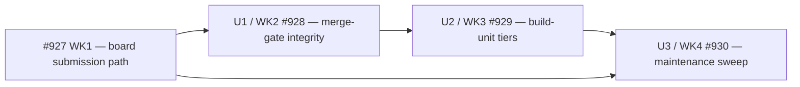

# Saga Work — merge-gate integrity, build-unit tier resolution, and the maintenance sweep (issues #928, #929, #930)

## Summary

Three serialized units close the last three merge-gate integrity holes in Saga Work, give its directly
launched build units an explicit model-and-effort tier instead of an inherited one, and correct the
prose contracts that no longer describe the system. Every unit lands after issue #927 (WK1) and edits
the same primary file, so the three run strictly in order.

No unit changes what the merge gate decides. Each one makes the gate's inputs and waivers legible at
the moment they are recorded, rather than reconstructible afterwards from a tree that may have moved.

---

## Problem Frame

Saga Work is the only Saga capability that merges. Everything it records at the save boundary becomes
a fact a later gate trusts, so a value written without being checked is worse than a value never
written: it is an unearned assurance.

Three such gaps survive at `1c1c04a9`. A gate verdict is stored without being parsed even though the
parser exists. The `change_kinds` value that decides which tests the hard gate demands is derived and
then discarded. And one override flag carries two different gate waivers, so the issue comment that
records a waiver names the wrong gate whenever the code-review gate was the one waived.

A fourth gap is adjacent and cheaper: Work's own direct build-unit dispatch is the single spawn site
in the fleet that names no tier, so a build unit's depth is decided by whichever model the operator
happened to be running. The tier machinery to fix it already shipped under closed issues #369 and
#373; only the call is missing.

The maintenance sweep runs last because several of its sentences describe machinery the units ahead of
it are still building.

**Upstream artifacts.** The settled WHAT arrives from GitHub issues #928, #929 and #930 under parent
issue #919 (amended 2026-08-30 by operator ruling), plus the design record
`docs/operations/saga-work-evidence-package.md` in `infiquetra/infiquetra-agent-operations` — candidates
W3, W4, W5, W6, W8c, W9 and W14, which that package marks ADAPT except W14 (DEFER). The `origin:`
frontmatter field is deliberately omitted: it takes a path relative to *this* repository, and every
upstream artifact for this plan is either a GitHub issue or a document in a different repository.
Writing a same-repo path that does not exist would be worse than the omission.

---

## Run custody and bindings

These are fixed by the operator's launch approval recorded in issue #919 and may not be substituted.

| Binding | Value |
|---|---|
| Repository | `infiquetra/infiquetra-claude-plugins` |
| Worktree | `orch-claude-plugins-919` |
| Branch | `work/cp919-saga-work-improvement`, based at `1c1c04a9` |
| Baseline versions | Saga 0.150.0, Orchestrate 3.0.8, cc-workflows 1.0.0 — verified equal in the repository, in `.claude-plugin/marketplace.json`, and in both installed plugin roots |
| Executing worker | `cp919-worker-2` — OpenCode Go running **Muse Spark 1.2 Contributor**, **Extra High** reasoning, **Build Auto** mode |
| Execution backend | `inline` for all three units |
| Document reviewer | `cp919-plan-review` — Cursor running Grok 4.6, Extra High reasoning, Fast mode, performing an installed Saga document review |
| Hard predecessor | Issue #927 (WK1). All three units start from WK1's merged result |
| Second repository | None. `infiquetra/infiquetra-sdlc` is WK1's bounded documentation-only unit and is outside this plan |

**On the tier binding.** The executor is not a Claude runtime, so the Claude tier palette
(`fable`/`opus`/`sonnet`/`haiku` × `low`/`medium`/`high`/`xhigh`) does not name it. Extra High
reasoning is the ordinal equivalent of `xhigh`, recorded here for comparison only. The binding above is
the authoritative tier for all three units and is not translated into the palette at dispatch.

**Unit-to-issue map.** U-IDs are local to this document; the run labels them WK2 through WK4.

| U-ID | Run label | Issue | Delivers |
|---|---|---|---|
| U1 | WK2 | #928 | Three merge-gate integrity holes |
| U2 | WK3 | #929 | Explicit build-unit tier resolution |
| U3 | WK4 | #930 | The maintenance sweep |

---

## Preflight findings that change the work

Four facts resolved against the worktree at `1c1c04a9` contradict something a unit would otherwise
have trusted. Each is recorded here so the implementer does not rediscover it, and so the document
reviewer can check it rather than assume it.

**The verdict parser already raises; the reader swallows it.** `parse_gate_verdict` at
`plugins/saga/scripts/saga.py:1324` raises `ValueError` both for a malformed shape and for a state
outside the six canonical values. `plugins/saga/scripts/status_card.py:278` calls it inside a
`try` whose `except ValueError: continue` at line 279 discards the entry. That is the mechanism behind
the "silently dropping the verdict" sentence at `plugins/saga/skills/work/SKILL.md:726` — the failure is
real, it just happens at render time, hours after the operator could have acted on it.

**The dual-purpose flag is `--doc-review-override`, and the mislabel is provable.** The doc-review gate
routes its waiver through that flag at `plugins/saga/skills/work/SKILL.md:243`; the code-review and
staleness gate routes *its* waiver through the same flag at
`plugins/saga/skills/work/SKILL.md:889-890`. `plugins/saga/scripts/issue_progress.py:85` renders it as a
single line labelled `doc review override`. So a merge that waived the code-review gate publishes an
issue comment stating that the doc-review gate was waived.

**`artifact_pointer.py`'s path was corrected in both parent and child, and this plan follows the
amended text.** Issues #919 and #930 were both amended on 2026-08-30: each Files row now names
`plugins/team-execution/skills/team-execution/scripts/artifact_pointer.py` and records the former
`plugins/saga/scripts/artifact_pointer.py` as a correction. **No file exists at that former path at any
commit**, and nothing in this plan recreates it. Amended issue #930 additionally records where the bare
references live — one in `plugins/saga/skills/work/SKILL.md` and three in
`plugins/saga/skills/resume/SKILL.md` — with `resume/SKILL.md:190` as the already-correct precedent, and
its verification grep now filters on the true path. Verified live at `1c1c04a9`: the bare name is at
`work/SKILL.md:730` and at `resume/SKILL.md:185`, `:186` and `:199`. `CLAUDE.md:39` and
`tools/canary_registry.json:44` already use the true path and are **not** this unit's to edit.

**The deferred lease prose is not present to be preserved.** Issue #930's boundary check
`grep -cEi "binds nothing" plugins/saga/skills/work/SKILL.md` returns 0, and the phrase appears nowhere
under `plugins/saga/`. The nearest surviving text is `binds no leases` at
`plugins/saga/skills/work/SKILL.md:342` — one occurrence, not four. This is recorded as an open
question rather than acted on, because settled decision W-D7 in issue #919 says no child implements the
collapse, and a unit that cannot find the thing it must not touch has satisfied that constraint
already.

---

## Requirements

Grouped by unit; R-IDs run continuously across groups.

**Merge-gate integrity (U1).**

R1. `saga.py save` refuses a `--gate-verdict` value that `parse_gate_verdict` rejects and writes
nothing — neither the tick envelope nor the state index. The refusal surfaces the parser's own message
verbatim through the **existing** `error: <message>` / exit-2 path, not as an uncaught traceback:
`main()` at `plugins/saga/scripts/saga.py:1683-1690` catches `SagaSaveError` and
`SagaTickIndexWriteError` only, so the parser's `ValueError` must be caught and re-raised as
`SagaSaveError` carrying its text unchanged.

R2. A well-formed `--gate-verdict` saves exactly as it does today, including a ref containing colons.

R3. The Work save path records the derived `change_kinds` in the work-session writeup, and the skill
names that same recorded list as the one passed into `requires_hard_test_gate`. No Python function
derives `change_kinds` today (`lifecycle_state.py:111` only consumes a sequence; the derivation is
prose at `references/test-and-gates.md:73-74`), so the guard pins the writeup field and the skill's
single-source wording — it does not attempt to re-derive the value or compare a derivation to itself.

R4. An override cannot be recorded without identifying the gate it waives; a waiver naming no gate is
refused.

R5. The issue comment for an overridden merge names which gate was waived, under a label that matches
that gate.

**Build-unit tiers (U2).**

R6. A plan unit carrying an explicit `{model, effort}` tier dispatches at that tier.

R7. A plan unit carrying no tier dispatches at the tier the shared work-shape policy resolves, read
through `tier_resolver`, never a literal at the spawn site.

R8. The dispatch never inherits the host session's model or effort, proven in two parts because Work's
dispatch is skill prose with no spawn call (see KTD11): (a) `resolve_build_unit_tier` accepts a
`host_tier` argument and returns the resolved tier regardless of it, asserted with a host set to
something different from both the plan tier and the policy default; and (b) the Phase 2 dispatch prose
names that resolver and contains no instruction to inherit, reuse, or carry forward the session's model
or effort.

R9. The resolved tier is recorded in execution evidence in both the explicit and the defaulted case.

R10. The premium-choice approval boundary is left exactly where it fires today — in `/plan` and in
`execution_spec.py`'s `validate(require_receipts=True)`. Work has no premium-choice trigger and gains
none here, so R10 is satisfied by **not** editing those surfaces, never by adding a Work-side check.

**Maintenance (U3).**

R11. Work's post-merge ceremony prose names all five calls including `teardown`, and the test derives
the expected five as the **post-merge slice** of `ship_ceremony.TRANSITIONS` —
`TRANSITIONS[TRANSITIONS.index("request_review") + 1 :]` — rather than a hand-maintained list. The
tuple is eight items at `plugins/saga/scripts/ship_ceremony.py:153-162`; asserting the whole of it
against prose that names only the tail is a self-failing test.

R12. `/loop` no longer claims the first-time board move belongs to `/work`, and describes the
submission path as U1 of the WK1 plan actually built it.

R13. The stale `/qa` preamble, the Phase 4.4 gated-versus-allowlisted conflation, the stale certificate
comment, the command stub, and the orphaned "skip silently" line are each corrected or removed. Issue
#930 requires all six items resolved, so U3 does not close on three repairs plus three silent
non-findings — see OQ3 for the close condition.

R14. Every bare `artifact_pointer.py` reference **under `plugins/saga/`** is replaced by its true
repository-relative path, matching amended issue #930's verification grep. Live at `1c1c04a9` that is
four references: `work/SKILL.md:730` and `resume/SKILL.md:185`, `:186`, `:199`. Files outside
`plugins/saga/` that already use the true path — `CLAUDE.md`, `tools/canary_registry.json`,
team-execution's own documents and tests — are out of scope and are not edited.

**Run-wide (all three units).**

R15. Merge confirmation, the four typed review outcomes, and the rule that a programmatic review writes
nothing are intact at the end of every unit, pinned by test.

R16. No new saga state field, store, validation framework, or routine operator question is added by any
unit.

R17. Each unit bumps `plugins/saga/.claude-plugin/plugin.json`, `plugins/saga/CHANGELOG.md` and
`.claude-plugin/marketplace.json` together, from whatever version WK1 left — never from the literal
0.150.0 recorded above.

R18. `bash scripts/gate.sh` exits 0 at each unit's head.

---

## Key Technical Decisions

**KTD1 — Validate the verdict inside `saga.py save`, by calling the parser that already exists, and
refuse the whole save.** The alternative, asserting the rule in `work/SKILL.md` prose only, leaves every
other caller of `saga.py save` unguarded and is unenforceable by test. Validating at read time is what
`status_card.py` already does, and its swallowed exception is the defect rather than the fix. Rejected
outright: building new validation machinery, which issue #928 forbids by name.

**KTD2 — Record `change_kinds` in the work-session writeup, not on the saga.** Issue #928 forbids a new
saga state field or store, and the work-session is already the durable artifact a resuming thread reads
(`handoff_envelope.py` classifies it resume-ready, per `plugins/saga/skills/work/SKILL.md:702-703`).
Rejected: a `--change-kinds` save flag, which is precisely the new state field the issue rules out.

**KTD3 — Split the override flag rather than parsing the rationale for a gate name.** Issue #928 permits
either and says splitting is cleaner. Splitting is also the only one of the two that satisfies R5:
requiring the rationale to name its gate leaves `issue_progress.py:85` still rendering the line under
the label `doc review override`, so the comment would name one gate in its label and a different one in
its body. Validating prose for a gate name is additionally fragile in a way a flag is not. Cost
accepted: one new command-line flag and one new rendered line.

**KTD4 — The unnamed-waiver refusal lives in one small helper, not in each call site.** A module-level
gate registry in `issue_progress.py` plus a single `_override_line(gate, rationale)` that raises on an
absent or unknown gate gives R4 exactly one place to be true and exactly one line to mutate for the
mutation proof. Rejected: duplicating the check at each flag, which makes the mutation proof
ambiguous about what it proved.

**KTD5 — Resolve tiers through the existing `tier_defaults` / `tier_resolver` chain; add no new
resolution path.** The precedence is already built and documented: repo overlay
(`.saga/tier-defaults.json`) beats the issue-carried band, which beats the shared registry
`plugins/fleet-core/scripts/fleet_commons/tier_policy.json`. In this repository at `1c1c04a9` there is
no overlay file and none of issues #928, #929 or #930 carries a `Recommended Tier Band` section, so the
live path is the shared registry — which is exactly the "documented default" issue #929 asks for.
Rejected: rebuilding any part of what closed issues #369 and #373 shipped.

**KTD6 — The tier values stay in the shared registry; only the work-shape *selection* rule is written
into Work's own reference.** Issue #929 states the values are the operator's call and not this unit's
to change. Selecting which work shape a build unit maps to is Work's logic, so it belongs in
`plugins/saga/skills/work/references/execution-strategy.md`, while the `{model, effort}` pair keeps
coming from `tier_policy.json`. This satisfies "read from the shared policy rather than hard-coded at
the spawn site" without editing a value the unit has no authority over.

**KTD7 — A build unit whose plan declares neither a tier nor a work shape resolves the `mechanical`
shape.** `/work` executes a settled plan and is forbidden from re-deciding product behaviour
(`plugins/saga/skills/work/SKILL.md:36-40`), so an undeclared build unit is by construction bounded,
specified work rather than open design. `mechanical` is also the middle rung, so it bounds the size of
the error in either direction rather than eliminating it — under-tiering genuinely specified work is
still one of the two failure modes issue #929 names, and this default does not make it impossible, only
smaller than the current inheritance. This is a value, so it is carried as Open Question OQ1 for
operator confirmation; the mechanism does not depend on the answer.

**KTD8 — Record the resolved tier in the same work-session writeup KTD2 establishes.** Reusing the
artifact U1 already extended avoids a second new record for the same class of fact, and it is why U2
genuinely depends on U1 rather than merely following it in the queue.

**KTD9 — The `teardown` test asserts against the post-merge *slice* of `ship_ceremony.TRANSITIONS`,
never a literal list and never the whole tuple.** The tuple at
`plugins/saga/scripts/ship_ceremony.py:153-162` is eight items —
`commit`, `open_pr`, `request_review`, `merge`, `checkout_main`, `pull`, `branch_delete`, `teardown` —
and Work's Phase 5.4 prose describes only what happens after review is requested. The expected set is
therefore `TRANSITIONS[TRANSITIONS.index("request_review") + 1 :]`, which evaluates today to the five
the prose must name. Prefer that index form over `TRANSITIONS[-5:]`: both are correct now, but a
transition appended after `teardown` would silently drop `merge` from the negative slice while the
index form keeps the whole tail. Issue #930 requires the check be made against the actual ceremony, and
a hand-maintained list in a test would reintroduce the same drift the unit is repairing.

**KTD11 — U2 creates one small resolver seam in `lifecycle_state.py`, because Work's dispatch is prose
and prose cannot host the no-inheritance experiment.** There is no `Agent(`, `Task(`, `model:` or
`subagent_type` anywhere in `plugins/saga/skills/work/SKILL.md`, and no Python function spawns a Work
build unit; Phase 2 dispatch is instructions to an agent at lines 644-648. A pytest therefore cannot set
a host session model or observe a dispatched option, so R8 as originally written described an
experiment the tree cannot run.

The seam is `resolve_build_unit_tier(*, plan_tier, work_shape, host_tier=None)` added to
`plugins/saga/scripts/lifecycle_state.py` — the existing home of Work's policy helpers
`requires_hard_test_gate` and `recommend_execution_backend`, chosen over a new module to respect issue
#919's proportionality guardrail. It **delegates** to the chain KTD5 names and computes no tier itself,
so issue #929's ban on rebuilding tier machinery holds.

`host_tier` is accepted and deliberately never read. That is the whole point of the parameter and its
docstring says so: a guarantee that something is *not* consulted is only provable if the test can hand
it in. Without the parameter the test can assert the resolver returns the right answer but cannot
distinguish that from inheritance.

One function cannot prove the *dispatch site* ignores the host, so the proof is two-part per R8, with
the prose half following the precedent already in this repository: `tests/test_work_review_contract.py`
opens with "Work is a Markdown skill, so these tests read the shipped skill text directly. They do not
use a fixture that merely repeats the intended review behavior." Rejected: a grep-only pin, which
cannot vary a host and so proves nothing about inheritance; and letting the worker invent a resolver,
which is the failure mode #929 forbids by name.

**KTD10 — U3 re-resolves all six stale sentences at its own preflight, and repairs only what it can
still see.** Three are located now and cited below. Three are not located by name, and one candidate for
a fourth was checked and found accurate. U3 lands after two behavioural units and after WK1, any of
which may have already corrected or moved a sentence, so a fixed line list authored today would be
wrong by the time it is read.

---

## Implementation Units

### U1. Merge-gate integrity — validate the verdict, record the change kinds, split the override (WK2, issue #928)

Make the three facts Work records at the save boundary either true or refused, using machinery that
already exists.

**Goal:** A malformed gate verdict fails loudly where the operator can still see it; the input that
chose the gate's scope is durably recorded; and a waiver names the gate it waived.

**Requirements:** R1, R2, R3, R4, R5, R15, R16, R17, R18.

**Dependencies:** Issue #927 (WK1) merged. No unit in this document.

**Files:**

- `plugins/saga/scripts/saga.py` — call `parse_gate_verdict` on each `--gate-verdict` value before the
  save payload is built at line 1527, and refuse the save on `ValueError`.
- `plugins/saga/scripts/issue_progress.py` — the gate registry, the `_override_line` helper, and the new
  `--review-gate-override` flag beside the existing `--doc-review-override` at line 134.
- `plugins/saga/skills/work/SKILL.md` — the save-time validation contract near lines 718-726, the
  change-kinds record in Phase 4.1, and both override sites at lines 241-243 and 889-890.
- `tests/test_work_gate_integrity.py` — new.
- `tests/test_work_review_contract.py` — extended with the merge-confirmation and
  programmatic-review pins; it already carries
  `test_work_names_exactly_the_four_typed_review_outcomes` at line 54.
- `plugins/saga/.claude-plugin/plugin.json`, `plugins/saga/CHANGELOG.md`, `.claude-plugin/marketplace.json`.

**Approach:** The refusal is a guard in `_build_save_saga`, the save argument-assembly path, not a new
layer. Each `--gate-verdict` value passes through `parse_gate_verdict` before `save()` is reached, so
neither the envelope nor the `state.json` index is written.

The parser raises a bare `ValueError`, and `main()` at `plugins/saga/scripts/saga.py:1683-1690` catches
only `SagaSaveError` and `SagaTickIndexWriteError` — so an unwrapped raise would surface as a traceback
at exit 1 rather than the `error: <message>` / exit-2 shape every other save refusal uses. **Catch the
parser's `ValueError` and re-raise it as `SagaSaveError` with its text unchanged**, so the existing
exit-2 path carries the six canonical state names to the operator verbatim. This is the unstated CLI
contract change the guard implies; state it in the changelog entry.

Refusing a value that is written today is a behaviour change to a command-line interface shared beyond
`/work`, so the unit's first action is to establish that no current caller passes a non-canonical
verdict — a repository-wide search for `--gate-verdict` producers, recorded in the work-session.

The change-kinds record is one field in the Phase 4.1 writeup carrying the same list the skill tells the
reader to pass into `requires_hard_test_gate` at `plugins/saga/scripts/lifecycle_state.py:111`. No
Python derives `change_kinds` — that function only consumes a sequence, and the derivation is prose at
`references/test-and-gates.md:73-74` — so the unit adds no derivation helper and the guard does not
compare a derivation to itself. What is pinned is that the writeup carries the field and that the skill
names one list feeding both the record and the gate.

The override split adds `--review-gate-override` and routes both flags through a single helper that
raises when the gate is absent or unknown. Work's prose at line 889 stops naming
`--doc-review-override` for the review gate and names the new flag instead.

**Patterns to follow:** `plugins/saga/scripts/saga.py:1324` for the parser's existing error shape;
`plugins/saga/scripts/issue_progress.py:85` for the rendered-line convention;
`tests/test_work_review_contract.py` for how this repository pins a Work prose contract by test.

**Test scenarios:**

- Happy path — `saga.py save --gate-verdict "tests:done:abc123"` saves, and the stored value is byte-identical to the input.
- Happy path — a verdict whose ref contains colons, such as `tests:done:https://github.com/o/r/pull/9`, survives intact, proving the guard did not narrow what is legal.
- Error path — `--gate-verdict "tests:pass:abc123"` (a non-canonical state) exits **2** with `error: ` on standard error naming the six canonical states, and leaves no tick envelope and no `state.json` entry. Assert the exit code and the message, not merely that the command failed — a traceback at exit 1 also refuses the write and must not pass this test.
- Error path — `--gate-verdict "garbage"` (no colon) is refused the same way, at exit 2.
- Happy path — the work-session writeup for a phase records `change_kinds`, and the skill's Phase 4.1 text names that recorded list as the same one passed into `requires_hard_test_gate`. Pin the field and the single-source wording; do not construct a second derivation to compare against.
- Error path — recording an override with a rationale but no gate is refused by `_override_line`.
- Happy path — a code-review-gate waiver renders under a label naming the review gate, and a doc-review waiver renders under its own label; the two are distinguishable in the comment body.
- Anti-regression — merge confirmation, the four typed review outcomes (`accepted`, `repairs_requested`, `cycle_cap_best_available`, `review_incomplete`), and the programmatic-review-writes-nothing rule are all still asserted.
- Mutation proof — deleting the `parse_gate_verdict` call must turn the two refusal scenarios red; deleting the `raise` in `_override_line` must turn the unnamed-waiver scenario red.

**Verification:** A non-canonical verdict is refused at the command line with the parser's own message
and no saga state is written. The work-session names the change kinds the gate used. An overridden
merge's issue comment identifies its gate. `bash scripts/gate.sh` exits 0.

---

### U2. Resolve an explicit tier for directly launched build units (WK3, issue #929)

Give Work's own build-unit dispatch the tier it is the last spawn site in the fleet to lack.

**Goal:** A build unit's depth is decided by the plan or by written policy, never by whichever model the
operator happened to be running.

**Requirements:** R6, R7, R8, R9, R10, R15, R16, R17, R18.

**Dependencies:** U1 — the execution-evidence record R9 writes into is the work-session field U1
establishes.

**Files:**

- `plugins/saga/scripts/lifecycle_state.py` — **the testable seam**: add
  `resolve_build_unit_tier(*, plan_tier, work_shape, host_tier=None)` beside the existing Work policy
  helpers `requires_hard_test_gate` (line 111) and `recommend_execution_backend` (line 183). It
  delegates and computes no tier of its own (KTD11).
- `plugins/saga/skills/work/SKILL.md` — the direct build-unit dispatch in Phase 2, the Execution-strategy bullet at lines 644-648, which must name the resolver.
- `plugins/saga/skills/work/references/execution-strategy.md` — the work-shape selection rule; the file
  currently names a tier only for the mechanical executor at line 81 and none for build units.
- `tests/test_work_build_unit_tier.py` — new.
- `plugins/saga/.claude-plugin/plugin.json`, `plugins/saga/CHANGELOG.md`, `.claude-plugin/marketplace.json`.

**Approach:** The dispatch resolves in one documented order. When the plan unit carries `{model, effort}`,
that wins unchanged. Otherwise the unit's work shape is selected per KTD6 and KTD7 and passed to the
existing resolution chain, which reads the repo overlay, then the issue band, then
`plugins/fleet-core/scripts/fleet_commons/tier_policy.json`. The resolved pair is then written into the
work-session field U1 added.

**Build the seam before writing the test, and do not invent anything wider.** Work's Phase 2 dispatch is
skill prose — there is no `Agent(`, `Task(`, `model:` or `subagent_type` in `work/SKILL.md` and no
Python function that spawns a build unit — so a pytest can neither set a host session model nor observe
a dispatched option. `resolve_build_unit_tier` is the one new callable this unit adds; it wraps the
chain above and is the single place the mutation proof deletes. It is **not** a new resolver: it must
call `tier_defaults` / `tier_resolver` and must not compute a `{model, effort}` pair itself, because
issue #929 forbids rebuilding the machinery closed issues #369 and #373 already shipped.

The no-inheritance guarantee is then proven in two parts, because one function cannot speak for a prose
dispatch site. Part (a): the seam accepts `host_tier` and never reads it, asserted with a host set to
something different from both the plan tier and the policy default. Part (b): the Phase 2 prose names
`resolve_build_unit_tier` and contains no instruction to inherit, reuse or carry forward the session's
model or effort — a text assertion in the same style
`tests/test_work_review_contract.py` already uses for Work's other prose contracts.

Consuming the existing chain also means no tier value is authored here — `tier_policy.json` is read and
not written, which is what keeps R16 and issue #929's non-goals true.

**Patterns to follow:** `plugins/saga/scripts/tier_defaults.py` for the documented precedence and its
halt-not-degrade posture on a malformed overlay; `plugins/fleet-core/scripts/fleet_commons/tier_resolver.py`
`resolve()` for the call shape; `tests/test_tier_resolver.py` and `tests/test_tier_defaults.py` for how
this repository already tests tier resolution.

**Test scenarios:**

- Happy path — `resolve_build_unit_tier(plan_tier={"model": "opus", "effort": "high"}, work_shape=None)` returns exactly that pair.
- Happy path — `resolve_build_unit_tier(plan_tier=None, work_shape=None)` returns the shared registry's tier for `mechanical`, read from `tier_policy.json` rather than appearing as a literal in `lifecycle_state.py`.
- Happy path — `resolve_build_unit_tier(plan_tier=None, work_shape="judgment")` returns that shape's registry default, proving the shape argument is honoured rather than ignored.
- Error path, part (a) of R8 — with `host_tier={"model": "fable", "effort": "xhigh"}` (differing from both the plan tier and the `mechanical` default), the returned tier is unchanged in both the explicit and the defaulted case. This is the assertion the `host_tier` parameter exists to make possible.
- Error path, part (b) of R8 — the Phase 2 dispatch text in `work/SKILL.md` names `resolve_build_unit_tier` and matches none of `inherit`, `the session's model`, `the host's model`, or `carry forward the .* effort`. Read the shipped skill text, following `tests/test_work_review_contract.py`.
- Edge case — a malformed `.saga/tier-defaults.json` raises `TierDefaultsError` through the seam rather than falling back silently, proving the seam delegates to the existing overlay contract instead of reimplementing it.
- Happy path — the resolved tier appears in execution evidence for both the explicit and the defaulted case.
- Negative, R10 — U2's diff touches neither `plugins/saga/scripts/execution_spec.py` nor `plugins/saga/skills/plan/SKILL.md`, and `execution_spec.py validate --require-receipts` still refuses the same premium inputs it refuses today. The premium-choice boundary lives there, not in Work; this scenario proves it was left alone, and no Work-side premium check is added.
- Negative — no new operator question exists on the dispatch path.
- Mutation proof — replacing the delegation inside `resolve_build_unit_tier` with `return host_tier` must turn part (a) red.

**Verification:** A plan tier is honoured; an absent one resolves from the shared policy; neither reads
the host, proven by the seam's ignored `host_tier` and by the dispatch prose naming the seam. Both cases
leave the resolved tier in execution evidence. `execution_spec.py` and `plan/SKILL.md` are untouched.
`bash scripts/gate.sh` exits 0.

---

### U3. The maintenance sweep — name teardown, repair the stale prose, fix the module path (WK4, issue #930)

Correct the sentences that tell a reader something untrue, changing no behaviour.

**Goal:** Work's and `/loop`'s prose describe the system as it is after WK1, U1 and U2 have landed.

**Requirements:** R11, R12, R13, R14, R15, R17, R18.

**Dependencies:** U1, U2, and issue #927 (WK1). U3 is last by design: its edits would otherwise conflict
with every behavioural change ahead of it, and R12 describes a mechanism WK1 builds.

**Files:**

- `plugins/saga/skills/work/SKILL.md` — `teardown` in the ceremony list at lines 913-918; the Phase 4.4
  gated-versus-allowlisted conflation at line 820; the orphaned "skip silently" line at 258; the bare
  `artifact_pointer.py` at line 730; and the `/qa` preamble, certificate comment and command stub
  located at U3's own preflight. **Section 1.5 (`work/SKILL.md:317` to the Phase 2 heading) is off
  limits** — it is the `cc-workflows` driver seam W-D5 forbids rewriting, and it is dense with bash
  blocks, so it is the one place the hunt for the unlocated "command stub" could wander into a
  forbidden surface. Do not edit it, and if the stub appears to live there, record that and stop.
- `plugins/saga/skills/loop/SKILL.md` — the first-time-move sentence at line 188.
- `plugins/saga/skills/resume/SKILL.md` — three bare `artifact_pointer.py` references at lines 185,
  186 and 199. Line 190 already carries the full path and is the working precedent to copy; do not
  touch it. Amended issue #930 names this file explicitly.
- `tests/test_work_prose_contracts.py` — new.
- `plugins/saga/.claude-plugin/plugin.json`, `plugins/saga/CHANGELOG.md`, `.claude-plugin/marketplace.json`.

**Approach:** Begin with a preflight that re-locates all six stale items against the current tree and
records the result in the work-session, including any item a preceding unit already fixed. Three are
cited above. The `/qa` preamble, the stale certificate comment and the command stub are not yet located
by name; note that the certificate description at `plugins/saga/skills/work/SKILL.md:754` was checked
against `plugins/saga/scripts/reversibility_certificate.py` and found **accurate** — `issue-progress-comment`
really is tier `additive` with `always_operator=False` — so it is not the stale one and must not be
"corrected".

**The preflight has a close condition, not just an output.** Issue #930's acceptance criteria require
all six items corrected or removed, and parent issue #919 requires each child to meet its own criteria.
So U3 does not close on three repairs plus three silent non-findings. Either the preflight names all six
sentences and repairs them, or the residue goes to the operator as an explicit non-finding list for
acceptance before the child closes (OQ3). Recording a non-finding is honest; closing the issue on one
is not U3's call.

The Phase 4.4 repair separates two mechanisms the sentence at line 820 names as one. *Gated* is the
reversibility certificate's verdict; *allowlisted* is membership in `AUTO_CORRECT_OP_KINDS`, which is an
empty `frozenset` at `plugins/saga/scripts/reconcile_controller.py:90`. The controller's own docstring at
lines 33-34 says an op outside the allowlist **halts**, which the SKILL sentence currently reports as
`gated`. Correct the prose to the controller's actual behaviour; do not change the controller.

The board-move sentences in Phase 4.4 and section 1.3b belong to WK1 and are not edited here. The
orphaned "skip silently" line at 258 sits immediately below section 1.3b, so U3's preflight must
establish whether WK1 already resolved it before touching it.

**Patterns to follow:** `plugins/saga/scripts/ship_ceremony.py:153-162` as the ceremony's real contract;
`tests/test_saga_doc_formatting.py` and `tests/test_saga_docs_coverage.py` for how this repository already
tests documentation contracts.

**Test scenarios:**

- Happy path — the post-merge ceremony prose names all five calls, with the expected set computed in the test as `TRANSITIONS[TRANSITIONS.index("request_review") + 1 :]` and never written out literally. Do not assert against the whole eight-item tuple: `commit`, `open_pr` and `request_review` are not post-merge calls and the Phase 5.4 prose correctly does not name them, so a whole-tuple assertion fails a correct edit.
- Negative — no file under `plugins/saga/` claims a first board move belongs to `/work`.
- Negative — `grep -rnE "artifact_pointer" plugins/saga/ | grep -v "plugins/team-execution/skills/team-execution/scripts/artifact_pointer.py"` returns nothing, which is amended issue #930's own verification command. Scope the assertion to `plugins/saga/`; `CLAUDE.md`, `tools/canary_registry.json` and team-execution's own files already use the true path and are not this unit's to police.
- Mutation proof — removing `teardown` from the ceremony prose must turn the five-call scenario red; reinstating the first-time-move claim in `loop/SKILL.md` must turn the first-board-move scenario red. Both are named in the protocol's mutation list below and both use its commit-first restore.

**Verification:** The ceremony prose names five calls and the test derives them from the post-merge
slice of the code. `/loop` describes the submission path WK1 built. Amended issue #930's
`artifact_pointer` grep returns nothing. No behaviour changed — the diff touches Markdown and tests
only, apart from the release surfaces. `bash scripts/gate.sh` exits 0.

---

## Predeclared Saga Code Review lenses

Each unit's applicable lenses, with the dimension that makes it applicable. The four always-on lenses
run on every review without approval; the conditionals named here are the ones this plan asserts have a
real applicable dimension, and each still needs the operator's batched approval at review time.

Issue #919 sets the review topology to **one integrated Saga Code Review** over the integrated result,
so this table is the per-unit applicability record and the integrated review runs the union of the
three rows.

| Lens | Class | U1 | U2 | U3 | Why applicable |
|---|---|---|---|---|---|
| `architecture-maintainability` | always-on | ✓ | ✓ | ✓ | Runs on every review by contract. |
| `correctness` | always-on | ✓ | ✓ | ✓ | Runs on every review by contract; for U3 it is the lens that checks prose against built behaviour. |
| `security` | always-on | ✓ | ✓ | ✓ | Runs on every review by contract. |
| `testing` | always-on | ✓ | ✓ | ✓ | Runs on every review by contract; every unit here carries a mutation proof to inspect. |
| `api-contract` | conditional | ✓ | ✓ | — | U1 adds a refusal and a flag to two command-line interfaces; U2 changes the execution-evidence record's shape. U3 changes no interface. |
| `adversarial` | conditional | ✓ | ✓ | — | U1 changes a merge gate and a waiver path; U2 makes a no-inheritance guarantee load-bearing. Both are policy and state-machine surfaces. |
| `agent-usability` | conditional | ✓ | ✓ | ✓ | All three edit skill files an agent executes; a wrong instruction misroutes the executor rather than a reader. |
| `documentation-clarity` | conditional | — | — | ✓ | U3's whole deliverable is operator- and maintainer-facing prose. |
| `previous-comments` | conditional | ~ | ~ | ~ | Select only where the child pull request carries prior unresolved threads; not predictable now. |

Lenses deliberately **not** predeclared: `deployment-infrastructure` (nothing deploys),
`reliability` (no asynchronous, retry or recovery surface changes), `privacy` (no personal data),
`accessibility-human-usability` (no human-operated visual or interactive surface), and `performance`.

`performance` was predeclared on U2 in the first draft and is withdrawn. That lens's trigger is the
latency, throughput or computational cost of the changed path; U2 changes which model a policy resolves
to, which is model spend rather than execution cost. An integrated review that launched it would mark
the dimension non-applicable or score the wrong one. `adversarial` and `agent-usability` carry the
no-inheritance guarantee instead.

---

## Serialization and custody

All three units edit `plugins/saga/skills/work/SKILL.md` and all three bump the same three Saga release
surfaces, so the overlap is real rather than notional and the lane serializes.



`plugins/saga/skills/work/SKILL.md` --> `U1` --> `U2` --> `U3`

**Does U3's disjoint work earn its own worktree?** No, and the answer is not close. U3 owns two files
the other units never touch — `plugins/saga/skills/loop/SKILL.md` and the `artifact_pointer.py`
references — but it also owns six edits inside `work/SKILL.md`, which is the contended file, and it
depends on U1, U2 and WK1 all having landed. A second worktree would isolate roughly two files out of
eight while adding a merge seam on the file that carries the actual conflict risk. Issue #919 asks for a
demonstration of genuinely disjoint, independently owned custody before spending a worker; this is not
one. **The lane runs serial in the single run worktree, one unit at a time.**

**Release-surface sequencing.** Each unit bumps the Saga version from whatever the preceding unit left,
not from the 0.150.0 baseline. Three sibling pull requests against the same three release files is the
exact shape that has previously produced same-version collisions which auto-merge resolves silently, so
each unit re-checks its version against the merge head immediately before merging and re-bumps if the
head moved.

---

## Anti-regression pins

These three behaviours were verified intact at `1c1c04a9` and are retained by settled decision W-D6.
Every unit edits the file that owns all three, so each unit runs the pins.

| Behaviour | Where it lives | How it is pinned |
|---|---|---|
| Merge confirmation | `plugins/saga/skills/work/SKILL.md:913-918` and the hard boundary at 929-931 | Extend `tests/test_work_review_contract.py` to assert `--operator-confirmed` on both `merge` and `branch_delete` |
| The four typed review outcomes | `plugins/saga/skills/work/SKILL.md:860` and `references/test-and-gates.md` | Already pinned by `tests/test_work_review_contract.py:54`; keep it green, do not rewrite it |
| A programmatic review writes nothing | `plugins/saga/skills/code-review/SKILL.md` §5.7 | Extend `tests/test_work_review_contract.py` with the assertion |

---

## Mutation-proof protocol

Mandatory for every new regression guard in this plan, and not satisfied by a passing test alone. The
three required steps are prove **red**, restore **exactly**, prove **green** — with a pinning step
before them that makes the restore safe.

### The hazard this protocol is written around

**`git restore` and `git checkout --` with no `--source` target `HEAD`.** On an uncommitted unit, `HEAD`
is the pre-unit base — `1c1c04a9` plus WK1 — so a bare restore does not undo the mutation, it deletes
the whole feature the worker just wrote. Worse, the verifying `git diff` then reports clean, because the
tree really does match `HEAD`. It is clean for the wrong reason, and the guard's subsequent green proves
nothing.

Reproduced concretely while repairing this plan: with an implementation uncommitted,
`git restore --worktree -- f.py` removed the implementation line and `git diff --quiet` exited 0.

**Never run a mutation proof on an uncommitted tree.** Step 0 is not optional and not a suggestion.

### The exact sequence, per mutation

Substitute the unit's own values for `<unit>` and `<test path>`. **`<paths>` is not a placeholder for
"everything you changed" — it is exactly the unit's own Files list from its `### U<N>.` heading above,
and nothing else.** Set it once at the top and let every later command read it. Run one mutation at a
time.

```bash
# ── STEP 0 — pin the implementation as a real ref BEFORE touching anything ──────────────
PATHS="<this unit's own files, space-separated, from its Files list>"
BASE=cp919-<unit>-premutation                # e.g. cp919-u1-premutation

git status --porcelain -- $PATHS             # inspect: the unit is complete and its suite is green
git add -- $PATHS                            # NEVER `git add -A` — see the custody note below
git commit -m "fix(saga): <conventional message for this unit>"
git tag "$BASE"
git diff --quiet "$BASE" -- $PATHS && echo "PINNED: unit paths == $BASE"   # must print before continuing

# ── STEP 1 — prove RED. Edit the ONE named location by hand; do not script the edit. ────
uv run pytest <test path> -q                 # MUST fail; copy the failure text into the work-session

# ── STEP 2 — restore EXACTLY, against the pin, and prove the restore ────────────────────
git restore --source="$BASE" --worktree -- $PATHS
git diff --exit-code "$BASE" -- $PATHS       # MUST exit 0 and print nothing
git status --porcelain -- $PATHS             # MUST be empty — catches untracked residue IN UNIT PATHS

# ── STEP 3 — prove GREEN ───────────────────────────────────────────────────────────────
uv run pytest <test path> -q                 # MUST pass

# ── STEP 4 — release the pin once every mutation for this unit is proven ───────────────
git tag -d "$BASE"
```

### Custody: why every git command here carries `-- $PATHS`

**This run worktree is shared.** Both planners' documents and every review artifact live in
`orch-claude-plugins-919` alongside the implementation. `git add -A` stages the entire worktree, so it
would sweep the other planner's plan file and the review artifacts into this unit's pre-mutation commit
— a custody violation, and one that survives into the unit's own pull request.

Demonstrated while repairing this plan: with one unit file edited and two unrelated documents present,
`git add -A --dry-run` reported `add 'plugins/saga.py'`, `add 'docs/plans/other-planner.md'` and
`add 'docs/plans/review.md'`. The scoped `git add -- plugins/saga.py` committed only the first and left
the others untracked and untouched.

The same reasoning scopes the two status checks. An unscoped `git status --porcelain` in this worktree
prints `?? docs/` for work that is not yours and never will be empty, so a literal reading of an
unscoped "MUST be empty" halts the proof for the wrong reason. Scoped to `$PATHS` it is empty exactly
when the mutation left no residue in the unit's own files, which is the property being checked.

**If a file outside `$PATHS` needs to change, that is a scope finding, not a wider `git add`.** Stop
and record it; widening the pathspec to make a commit succeed is how a unit silently grows.

Three properties do the work. `--source="$BASE"` makes the restore read from the **implementation**
commit rather than from `HEAD`; `git diff --exit-code "$BASE"` compares against that same
implementation commit rather than against the pre-unit base; and `-- $PATHS` keeps every one of these
commands inside the unit's own files in a worktree it shares with other work.

All three are mandatory together. A bare `git restore` or a bare `git diff` anywhere in this sequence
is the defect that destroys the implementation, and an unscoped `git add` is the defect that captures
somebody else's.

**A named stash is deliberately not offered as an alternative.** It is a second path with a different
command shape and its own ordering trap, and this protocol is executed by a Build Auto worker reading
literally. One safe path beats two.

### The named mutations

Each runs the full sequence above. The first three are required by issues #928 and #929; the last two
are required by this protocol because U3 adds new regression guards, though issue #930 does not itself
demand a mutation proof.

| # | Unit | Mutation | Guard that must go red | Source |
|---|---|---|---|---|
| 1 | U1 | Delete the `parse_gate_verdict` call in `_build_save_saga` | the two verdict-refusal scenarios | issue #928 |
| 2 | U1 | Delete the `raise` in `_override_line` | the unnamed-waiver scenario | issue #928 |
| 3 | U2 | Replace the delegation in `resolve_build_unit_tier` with `return host_tier` | R8 part (a), the no-inheritance scenario | issue #929 |
| 4 | U3 | Remove `teardown` from the Phase 5.4 ceremony prose | the five-call scenario | this protocol |
| 5 | U3 | Reinstate the first-time-move claim in `loop/SKILL.md` | the first-board-move scenario | this protocol |

Record all four steps for every row in the work-session writeup with the command output, including the
`PINNED` line and the empty `git diff --exit-code` result. A row whose evidence lacks the pin is not an
accepted proof.

---

## Scope Boundaries

**Out of scope — not this run's to touch.**

- The board-move sentences in `work/SKILL.md` section 1.3b and Phase 4.4, and in `plan/SKILL.md`. WK1 owns them.
- The `cc-workflows` driver seam at `work/SKILL.md` section 1.5. Settled decision W-D5; a factual error inside it may be corrected without restructuring, and this plan corrects none.
- The second-opinion machinery at `work/SKILL.md:90-126`. The Saga Code Review parent owns it.
- `config/sdlc-schema.json`. Both `verify_entry` branches already exist; no schema change is in scope.
- `infiquetra/infiquetra-sdlc`. WK1's bounded documentation-only pull request; this plan opens none.
- Phase 3's hard-gate section, which is not expanded (W-D6).
- `plugins/saga/references/engine-registry.yaml`, which is not deleted (W-D6).
- `AUTO_CORRECT_OP_KINDS`, which is not re-widened (W-D6). U3 corrects prose *about* it and changes no value.
- Which tests the risk gate selects. U1 records the input; it does not re-tune the policy.
- The tier values in `tier_policy.json`, which U2 reads and never writes.
- The premium-choice boundary in `plugins/saga/scripts/execution_spec.py` and `plugins/saga/skills/plan/SKILL.md`. R10 is satisfied by leaving both untouched; Work gains no premium check of its own.
- Files outside `plugins/saga/` that already reference `artifact_pointer.py` correctly — `CLAUDE.md`, `tools/canary_registry.json`, and team-execution's own documents and tests. R14 is bounded to `plugins/saga/`, matching amended issue #930's verification grep.

**Deferred to follow-up work.**

- Collapsing the lease protocol's "this binds nothing" explanations (W-D7). The trigger has not fired by the parent issue's ruling, and the phrase is additionally not present — see OQ2.
- Any change to `status_card.py`'s swallowed `ValueError` at line 279. U1 moves the failure earlier so the swallow stops mattering; removing the swallow is a separate change to a shared renderer with its own blast radius.

---

## Risks

**A current caller passes a non-canonical gate verdict.** U1 turns a silent degradation into a hard
refusal on a command-line interface shared beyond `/work`. If any live caller depends on the current
leniency, U1 breaks it at the worst moment — a save. Mitigation: U1's first action is the
repository-wide producer search recorded in its Approach, before the guard is written.

**U3's fixed line numbers go stale.** Three of U3's six items are cited by line here, and three units
plus WK1 edit the same file ahead of it. Mitigation: KTD10 makes re-resolution U3's first step, and the
citations in this document are anchors for that search rather than instructions.

**Three sibling pull requests collide on the same three release files.** This has happened before in
this repository and auto-merge resolved it silently at the same version. Mitigation: the
re-check-and-re-bump rule under Serialization, applied at each merge head rather than at authoring time.

**U3 edits a sentence WK1 owns.** The orphaned "skip silently" line sits directly beneath section 1.3b,
which is WK1's. Mitigation: U3's preflight establishes WK1's final text first and skips any item WK1
already resolved.

**Hunting the unlocated command stub could wander into the `cc-workflows` driver seam.** Section 1.5
begins at `work/SKILL.md:317` and is dense with bash blocks, so it looks like where a "command stub"
would live — and it is the one surface W-D5 forbids rewriting. Mitigation: the explicit off-limits line
in U3's file list, and the instruction to record and stop rather than edit if the stub appears to be
there.

**An edit introduces a `P0`/`P1` token into `work/SKILL.md` and fails an existing pin.**
`tests/test_work_review_contract.py:101-105` asserts that `\bP0\b`, `\bP1\b`, `Priority 0`, `Priority 1`
and `P-level` appear nowhere in that file, case-insensitively — the obsolete priority acceptance rule
W16 retired. All three units edit that file and this plan's own review used P1/P2/P3 language freely.
Mitigation: named here so the worker does not carry review vocabulary into the skill text; describe
findings by name, never by priority token, in anything written into `work/SKILL.md`.

---

## Open Questions

Recorded for the operator; none of them blocks the plan, and each names what happens if no answer
arrives.

**OQ1 — Is `mechanical` the right default work shape for an undeclared build unit?** KTD7 pins it, and
issue #929 says the values are the operator's call while the mechanism is not. If no answer arrives, U2
ships the mechanism with `mechanical` as the documented selection rule, which is changed later by
editing one rule in `execution-strategy.md` rather than by touching the dispatch.

**OQ2 — The deferred lease prose does not exist to be preserved.** Issue #930's own boundary check
returns 0 and the phrase "binds nothing" appears nowhere under `plugins/saga/`; only `binds no leases`
survives, once, at `work/SKILL.md:342`. The design record defers W14 until "a session that halts treating
`reserve` as a real lease, **or the Phase 1.5 move**" — and the Phase 1.5 Workflow extraction did land
under closed issue #925. So the evidence package's second trigger appears to have fired while issue
#919's W-D7 states it has not. This plan follows W-D7 and implements nothing. If no answer arrives, U3
treats the four explanations as already gone and asserts nothing about them.

**OQ3 — Which sentences are the stale `/qa` preamble, the stale certificate comment, and the command
stub?** The design record names all six items at the same level of abstraction the issue does, and the
one certificate sentence checkable today (`work/SKILL.md:754`) was verified **accurate**, so it is not
one of the six.

The no-invention default stands: U3 resolves the three at its preflight, repairs what it can evidence,
and never fabricates a correction for a sentence it cannot locate.

**What changed after review: that default alone does not close issue #930.** Its acceptance criteria
require all six corrected or removed, and parent issue #919 requires each child to meet its own
criteria, so three repairs plus three silent non-findings would ship the child with its criteria unmet.
The close condition is therefore explicit — **either** U3's preflight names and repairs all six,
**or** the unlocated residue goes to you as a written non-finding list and the child closes only on
your acceptance of it. If no answer arrives, U3 finishes every located item, files the residue list,
and leaves the child open rather than closing it on its own judgement.

**OQ4 — Should `--doc-review-override` keep its name after the split?** KTD3 adds
`--review-gate-override` beside it. Keeping the existing name preserves compatibility for any caller
already passing it; renaming it to `--doc-review-gate-override` would make the pair symmetrical at the
cost of a breaking flag change. If no answer arrives, U1 keeps the existing name and adds only the new
flag.

---

## Journal obligation

The KTDs above land in `docs/engineering-journal/DECISIONS.md` **in the commit that ships each unit**,
per this repository's `CLAUDE.md`. The planner deliberately does not write that file: it is shared, and
a second planner is working in this same worktree on the WK1 plan. Writing a shared journal file from
two planning sessions is the collision the run's custody rule exists to prevent.

---

## Routing

This plan goes to the installed Saga document review performed by `cp919-plan-review`, and every
actionable finding is repaired before implementation begins. Implementation then runs on
`cp919-worker-2` in dependency order U1, U2, U3, after issue #927 has merged.
