# Issue 907 terminal-validation repair plan — all 91 findings against dd3593ab

## Summary

One serial run of fourteen implementation units repairs every in-scope finding of the terminal validation review bound to `dd3593ab`, records the rest with evidence and custody, and reaches exactly one fresh terminal Saga Code Review. Every unit writes its failing proof before its edit, names the invariant that must hold on both sides of the rule it changes, and carries a counter-case for the side it is not fixing.

The plan covers the Agent Launcher plugin (`plugins/agent-launcher/`) and the Orchestrate plugin (`plugins/orchestrate/`) in the `infiquetra-claude-plugins` repository, on branch `work/cp907-launcher-session-contract`. Four decisions sit above the planner's authority and are recorded as open questions; no unit assumes an answer.

---

## Problem Frame

Two repair rounds on this branch satisfied a finding by building its mirror image, and every lens scored lower on `dd3593ab` than on the revision it set out to improve. The staged-input stop that once orphaned a session now wedges the unit forever, and the version floor that once killed `--help` now lets a below-floor companion reach pane writes.

The terminal validation artifact holds 91 findings: 18 P1, 43 P2, 30 P3, 15 marked pre-existing. Fifteen of the eighteen P1 findings are attributed to edits `dd3593ab` itself made, and ten of those carry an executed before-and-after comparison against `2fe7c954`.

The mechanism to change is the verification order. The one fix that was mutation-tested before commit, positional last-block selection in the composer, survived every review; the fixes that were committed before anything tried to break them did not.

---

## Grounding evidence gathered for this plan

This section records what I verified on 2026-09-01 against the worktree at `HEAD` (`0b7eb0c0`, source-identical to `dd3593ab` under `plugins/`). Each unit below cites this evidence rather than the artifact's prose alone.

| Check | Method | Result |
|---|---|---|
| Composer shapes at the frozen revision | Loaded `composer.py` directly and ran ten constructed panes through `inspect_composer` | CORR-01 pane → `unclassifiable`; CORR-02 pane → `unclassifiable`; TEST-01 pane → `unclassifiable`; Codex three-row draft → `staged` with 22 of 41 characters; the mutation C23 and C2 distinguishing inputs reproduce the artifact's values |
| Live Claude composer geometry | `herdr pane read <pane> --source visible --format ansi` on the two idle Claude sessions in workspace wEV (`wEV:pM`, `wEV:p6`), Herdr 0.8.2 | Both classify `empty`. Neither draws a border. The marker row `❯\xa0` sits between two horizontal-rule rows, and three two-space-indented status rows follow the lower rule. The horizontal-rule clause at `composer.py:232` is what keeps these panes `empty` |
| Fixture contents | `json.load` of `plugins/agent-launcher/tests/fixtures/composer-panes.json` | Two entries, `claude_echo_above_empty` and `codex_closed_placeholder`, neither containing a box-drawing character |
| Launcher names each Orchestrate subcommand reaches | AST walk over both scripts, transitive to depth six | `status`, `check`, `wait`, `settle`, `adopt` reach `live_agents`; `clean` and `land` reach `close_run_session`; `land` and `review-result` reach `say`; `go` reaches `launch`; the stub roster at `orchestrate.py:1690-1713` is complete today |
| Floor enforcement sites | `grep -n 'assert_agent_launcher_available()'` | Five call sites: `orchestrate.py:2257,2366,2383,2560,2670` inside `cmd_start`, `cmd_saga`, `cmd_roster`, `cmd_expand`, `cmd_go` |
| Tab identity assignment in Orchestrate | `grep -n 'tab_id = '` over `orchestrate.py` | Zero assignment sites |
| Prior revision | `git show 2fe7c954` of both scripts and the contract test file | The staged-input branch cleared six fields at `orchestrate.py:2648-2657`; the resend guard read `if used_pane:` at `launcher.py:1412`; the deleted test is at `test_launcher_contract.py:671` |
| Release surfaces on `origin/main` | `git show origin/main:` of the orchestrate manifest, README and command document | Orchestrate 4.0.1 with three dependencies; README line 96 and `commands/orchestrate.md` line 504 state the floor is unverified |
| Version pins the release unit must move | `grep` over `tests/` and `plugins/agent-launcher/tests/` | `tests/test_agent_launcher_plugin.py:96,309` and the derived floor at `:120`; cache-directory names at `:164,182,273,291,317,363,389` |
| Worktree reuse on a retried `go` | Read `make_worktree` in `orchestrate.py` | An existing path prints `worktree already there` and is reused; a retry through `cmd_go` needs no worktree change |
| Transcript recency without a creation time | Read `transcript_account` at `launcher.py:993` | With `since=None` every transcript for the worktree is admitted; the receipt records no creation time, so a redelivery's preflight has no floor (U6 states the trade) |
| Tests that pin the number of composer reads | `grep` for `--format` over `plugins/agent-launcher/tests/test_launcher_contract.py` and `tests/test_orchestrate_launch_and_land.py` | Only `test_empty_reused_box_is_prompted_exactly_as_today` (`:619-633`, exactly one ANSI read, unowned Claude) and `test_freshly_created_pane_takes_no_inspection_path` (zero reads, owned); the Orchestrate OpenCode tests count no reads |

I did not capture a live multi-row draft, because staging text in another session's composer is a pane write into a session this planner does not own. The styling assumption inside CORR-01 therefore stays unverified live; the truncation half of the same finding is proven without it.

---

## Requirements

Grouped by concern; identifiers are stable and never restart.

**Composer classification**

- R1. A pane holding operator text never classifies `empty` or `unclassifiable` when the repository's captured shapes can prove it is a draft, and an idle pane in any captured shape never classifies `staged`.
- R2. The row rule is one classification per physical row, stated in one place, and every clause of it has a test whose failure names the clause.
- R3. Both real fixture captures and the two live Claude captures from workspace wEV are regression fixtures with recorded provenance.
- R4. Every border glyph in both roster sets is exercised by a test, and a paired trailing border strips at most one glyph.

**Guard placement**

- R5. Every pane write into a session the launcher did not create, every resend after a first send that typed into the pane, and every write of a redelivery into a pane whose staged text stopped an earlier attempt, is immediately preceded by an inspection.
- R6. The receipt's `input_box_text_chars` has one documented definition that a test binds to the number the code records.

**Orchestrate run state**

- R7. A unit stopped for staged input keeps its session identifiers and receipt in the run record, and a later `go` re-prompts the same pane without creating a second session and without hand-editing state.
- R8. `clean` and `land --clean` report one true reason for every unit they keep, never report `closed` for a tab they did not close, and record a close failure exactly once.

**Companion floor**

- R9. A companion below the declared floor never reaches a pane write, a session or worktree creation, or a tab close; the commands that may run against a stale or unusable companion are an explicit, tested allowlist.
- R10. `--help`, `status` and `check` survive a stale companion and an unusable companion while a unit is running.
- R11. Every companion fault message names its own cause and the remedy for that cause.
- R12. A partial launcher ingest leaves Orchestrate's namespace exactly as it was before the attempt, and Orchestrate's own docstring survives a successful ingest.

**Records and release**

- R13. Every engineering-journal claim about issue 907 either cites evidence reproducible from the tree or says it is not reproducible.
- R14. Every finding identifier quoted from an earlier review names its artifact in the same sentence.
- R15. Release surfaces for both plugins change once, in one commit before the gate, with every version pin in the test tree moved in the same commit.
- R16. The run ends at exactly one fresh terminal Saga Code Review; no unit assumes a further repair loop.

---

## Key Technical Decisions

- KTD1. **One row classification with containment, not borders, as proof of continuation.** A row directly below an open block continues it when it is bordered, or when it is unbordered and indented past the marker column; a blank row, a horizontal rule, a marker row, or a row at or left of the marker column ends the block and separates it. Rationale: both real captures and both live captures are unbordered, so a border requirement (`composer.py:193`) can never fire for Claude or Codex, and the shapes vendors actually draw below a composer are separated by a rule (Claude, live) or a blank spacer (Codex, `LEARNINGS.md:28`). The accepted asymmetry is written down: an unbordered indented row with no separator is read as input, because no capture shows chrome there.
- KTD2. **`ambiguous_empty` narrows to the footer-after-spacer shape; `adjacent_to_previous` stays.** An empty marker block followed by a blank row and then an indented unbordered row is `unclassifiable`, because that shape is either a Codex footer or a draft with a leading blank line. Trailing blank rows alone read `empty`. Rationale: CORR-05's ordinary shapes regress to `unclassifiable` only because a blank row today neither separates nor settles; the glyph-led adjacency case is mutation-proven and must not move.
- KTD3. **`input_box_text_chars` is the visible length of what the parser absorbed.** The documents say what the code computes: visible characters after border stripping, rows joined without a separator, a lower bound when the draft contains a blank line, one short per wrapped row boundary. Rationale: the parser positively recognises only unstyled characters, but the operator wants the size of the withheld draft, and computing the unstyled count would report `2` for a thirty-character draft.
- KTD4. **The write predicate is `not session_owned(unit) or used_pane`, evaluated immediately before every pane write.** Rationale: ownership says who created the tab; `used_pane` says whether the pane is known to hold or to have held text. It is false before the first write of a fresh launch, true after the launcher itself typed into the pane, and true from the start of a redelivery, because the stop that made the redelivery necessary was an inspection that found text. Either half alone is the defect this run already shipped twice, and the predicate is one expression so the first send, the resend and the redelivery cannot drift apart.
- KTD5. **The inspection that authorises a pane write is taken immediately before that write.** Rationale: at `launcher.py:1396` one inspection precedes a picker, a preflight and a send that together can take fifty seconds of declared bounds; a person typing during that window defeats the guard. On every vendor but OpenCode the repair is a move and the read count stays one; on an unowned OpenCode launch the picker is a write of its own, so that path reads twice, once before the picker and once before the send.
- KTD6. **A staged-input stop is a retryable state marked by the receipt, and the retry re-prompts the same pane through a launcher entry that never creates.** A `PENDING` unit whose `launch_receipt["input_box"]` is `staged` is redelivered by `go` through a new launcher function `redeliver(unit, backend, *, review_elsewhere)`, which repeats everything `launch()` does after the wrapper create against the pane the unit already records; the `already has tab` skip applies only to units without that marker; the stop message is appended to the note so earlier identifiers survive. Rationale: both prior repairs broke one of the two invariants in brief section 4-C. Calling `launch()` again would run the wrapper create, overwrite `tab_id` from the new receipt and drop the first owned tab off the unit, which is the prior validation artifact's finding REL-03 rebuilt through the retry door. Re-prompting the recorded pane satisfies both invariants without a new run-file field, which API-05 shows would break every older reader.
- KTD7. **Floor policy is a command-by-state matrix, not a bound-function side effect.** Below floor: the launcher is ingested so read-only commands keep their Herdr reads, and every command that writes a pane, creates a session or worktree, or closes a tab refuses with an update remedy. Missing or unusable: nothing is ingested, and `status` and `check` degrade to liveness-unknown rather than dying. Rationale: my reachability map shows `status`, `check`, `wait`, `settle` and `adopt` all reach `live_agents`, so a naive fail-closed recreates the prior validation's dead-`status` finding; `clean` on a 1.0.0 companion loses evidence, so it cannot be a survivor.
- KTD8. **Ingest is atomic and the stub roster is test-bound, not derived at runtime.** The module namespace is snapshotted before the exec and restored on any failure; a test compares the roster against the launcher names Orchestrate references. Rationale: the exec-into-globals seam is what lets tests patch `run` and `launch`, so it stays; deriving the roster at runtime would need the failed launcher's names, which is the thing that failed.
- KTD9. **Run files tolerate unknown unit keys with a named notice.** Rationale: `permission_declared` already breaks every cached older reader; this branch cannot repair old readers, so it stops the next field from repeating the break and states the compatibility floor in the CHANGELOG.
- KTD10. **Repairs land against the frozen revision; `origin/main` merges after them and before the release commit.** Recorded as Decision 4 for the operator. The alternative order is not free: it moves U11 first, and every unit's evidence-before-edit must then be re-run on the merged tree with each cited line re-resolved by symbol, because every probe and mutation in the artifact was measured against `dd3593ab` (Decision 4's cost table is the accurate statement of that cost).
- KTD11. **Pre-existing findings outside the seven children are recorded with proposed custody, not repaired, unless the repair is one line inside a function a unit already rewrites.** Applied to ARCH-08 and ARCH-09 (repaired) and to ARCH-11, SEC-06, SEC-07, CORR-07, TEST-14 (follow-ups).

---

## High-Level Technical Design

### The row rule (U1)

One function classifies each physical row of the viewport, in this precedence, and `_composer_blocks` consumes only that classification.

| Row shape (after ANSI stripping, `\xa0` as space) | Class | Effect on the open block |
|---|---|---|
| Vendor glyph is the first printable after an optional leading border | `marker` | Starts a new block; `adjacent_to_previous` is set when no `separator` row has occurred since the previous block |
| Only whitespace | `blank` | Ends the block; acts as a separator; if the block is empty and the next non-blank row is `indented`, the block becomes `ambiguous_empty` |
| Only horizontal-rule glyphs | `rule` | Ends the block; separator |
| Leading border glyph, not `rule`, not `marker` | `bordered` | Continues the block by containment, whatever its column |
| Unbordered, content column greater than the marker column, not led by any vendor glyph | `indented` | Continues the block when it directly follows the block; makes an empty block `ambiguous_empty` only when a `blank` intervened |
| Anything else (content at or left of the marker column, or led by another vendor's glyph) | `terminator` | Ends the block; separator |

Paired borders: when a leading border glyph was consumed, at most one trailing border glyph is removed from the right after whitespace trimming.

### Guard placement in `launch()` and `redeliver()` (U3, U4, U6)

Both entries share one delivery helper. `guard?` is the KTD4 predicate `not session_owned(unit) or used_pane`; `used_pane` starts false on a fresh launch and true on a redelivery, and `send` sets it when it types into the pane.

```
launch: create --> identity read if unowned --> [opencode: guard? --> picker] --> preflight --> guard? --> send --> [idle? guard? --> resend]
```

```
redeliver: await ready --> identity read if unowned --> [opencode: guard? --> picker] --> preflight --> guard? --> send --> [idle? guard? --> resend]
```

### The floor matrix (U8)

| Subcommand | Companion loaded and at floor | Below floor (ingested) | Missing or unusable (not ingested) |
|---|---|---|---|
| `--help`, `diff`, `park`, `resume`, `announce`, `collect` | runs | runs | runs |
| `status`, `check` | runs | runs | runs with liveness `unknown` and the companion fault printed once |
| `wait`, `settle`, `adopt` | runs | runs | refuses with the missing or unusable message |
| `roster`, `saga` | runs | refuses with the update message | refuses with the missing or unusable message |
| `start`, `expand`, `go`, `review-result`, `land`, `clean` | runs | refuses with the update message | refuses with the missing or unusable message |

### Staged-input stop state (U6)

```mermaid
stateDiagram-v2
    [*] --> PENDING
    PENDING --> RUNNING: launch delivered
    PENDING --> PENDING_staged: StagedInputError (identifiers and receipt kept, note appended)
    PENDING_staged --> RUNNING: go redelivers into the same pane, composer now empty
    PENDING_staged --> PENDING_staged: go redelivers, composer still holds text (identifiers kept, note unchanged when the message repeats)
    PENDING_staged --> reaped: clean (owned tab closed by Orchestrate; unowned tab never closed, reported left open)
```



---

## Implementation Units

Serial order is U1 through U14 as listed; the dependency table after the units states the real graph. Each unit is one commit carrying its tests, its journal touch where named, and nothing else.

### U1. Composer row rule: one classification per row, proven against real captures

Rewrite the continuation, termination and ambiguity rules in `composer.py` as the single row classification of KTD1 and KTD2, and restore the deleted counter-cases.

**Goal:** A multi-row unbordered draft is absorbed whole and stops the launch; an idle pane in every captured shape reads `empty`; the horizontal-rule and blank-row clauses are each bound by a real capture.

**Findings closed:** CORR-01, CORR-02, TEST-01, TEST-02, TEST-07, CORR-04, CORR-05, CORR-06, SEC-04, TEST-08, TEST-09, ARCH-03, ARCH-04, ARCH-17, CORR-08, CORR-10 (with ARCH-16 as a duplicate of CORR-04).

**Requirements:** R1, R2, R3, R4.

**Dependencies:** none.

**Files:** `plugins/agent-launcher/skills/agent-launcher/scripts/composer.py`, `plugins/agent-launcher/tests/test_launcher_contract.py`, `plugins/agent-launcher/tests/fixtures/composer-panes.json`.

**Root cause:** `_is_continuation` at `composer.py:193` requires a leading border that no captured vendor draws, so a block is always one row for Claude and Codex; the ambiguity test at `composer.py:227` and the `separated` assignment at `composer.py:231` re-decide the same row with different geometry, and a blank row neither separates nor settles.

**Invariant, both sides:** A pane holding operator text must never be written into, and an idle pane must never stop a launch. The rule must be expressed against shapes the repository can produce: two fixture captures, two live Claude captures, and the Codex footer-after-spacer shape recorded at `LEARNINGS.md:28`.

**Evidence before edit:** Write the following tests first and watch them fail at the frozen revision: the Codex three-row draft returns all three rows (currently 22 of 41 characters); the CORR-02 pane classifies `staged` (currently `unclassifiable`); the deleted test `test_a_blank_marker_row_with_continuation_rows_is_one_block` restored verbatim from `2fe7c954:plugins/agent-launcher/tests/test_launcher_contract.py:671`; `test_menu_marker_terminates_the_composer_block` expecting `draftcontinuation`; the echo-blank-empty-marker pane classifies `empty` (currently `unclassifiable`).

**Approach:** Introduce one row classifier returning the six classes in the design table and rewrite `_composer_blocks` to consume it, so the ambiguity flag and the separator state are derived from the class rather than recomputed. Bound the trailing strip in `_without_border` to one glyph after a consumed leading border. Correct the roster comment at `composer.py:19-21` to say which vendors have a checked-in capture. Add the two live Claude captures to the fixture file under keys naming vendor, date and Herdr version, and note in the file's sibling test that they were read from `wEV:pM` and `wEV:p6` on 2026-09-01.

**Patterns to follow:** The positional last-block selection at `composer.py:288-302` is mutation-proven and stays. `_prepare_guard_launch` at `test_launcher_contract.py:446` stubs `run` at the Herdr boundary and leaves `verify_unit_preflight` real; new guard-level tests use it.

**Prohibited overreach:** No change to `launcher.py`, to the receipt schema, to `COMPOSER_GLYPH_BY_VENDOR`, or to `inspect_composer`'s selection of the last block. No continuation-row cap. No new `ComposerState` member. No attempt to distinguish an in-frame bordered footer from a wrapped row (CORR-07 is a recorded residual).

**Counter-cases that must stay green:** `test_glyph_led_last_visual_row_never_turns_a_staged_draft_into_empty`, `test_adjacent_staged_and_empty_marker_rows_are_ambiguous`, `test_ambiguous_composer_geometry_never_records_affirmative_empty`, `test_echo_above_a_closed_span_placeholder_does_not_false_stop`, `test_status_footer_after_blank_is_not_counted_as_staged_input`, `test_unstyled_status_footer_after_empty_box_cannot_create_a_false_stop`, `test_blank_then_indented_text_is_ambiguous_not_affirmatively_empty`, `test_first_noncontinuation_terminates_the_composer_block`, `test_marker_must_be_the_first_printable_character_after_a_border`, `test_a_weak_marker_under_a_decorated_box_is_content`, and every existing bordered-composer test.

**Test scenarios:**

- Happy path: unbordered two-row and three-row Claude and Codex drafts classify `staged` with the full joined text; bordered wrapped rows classify `staged` including a styled second row.
- Idle shapes: both live Claude captures classify `empty`; the Claude fixture classifies `empty`; an empty marker followed by two blank rows classifies `empty`; an echo, a blank row and an empty marker classify `empty`.
- Ambiguity: Codex `› ` then blank then indented footer classifies `unclassifiable`; the glyph-led last-row shape classifies `unclassifiable`.
- Edge: a bordered draft ending in a box-drawing character keeps that character; a bordered box whose only content is one border glyph is `staged`, not `empty`; a bordered row flush at the marker column continues the block.
- Border rosters: a parametrised test over every glyph in `_LEADING_BORDER_GLYPHS` and `_TRAILING_BORDER_GLYPHS`, so removing any one glyph fails a named case.
- Direct unit tests for `_unstyled_text` with a two-row input whose join is observable, so changing the separator fails.
- Integration through the real `guard_pane_before_write` with `run` stubbed: the CORR-01 and CORR-02 panes raise `StagedInputError`; both live captures prompt with receipt `input_box = "empty"`.

**Mutation or behavioural proof:** Before commit, apply and confirm killed: C23 (`ambiguous_empty` on any blank), C2 (blank row continues), C18 (drop the rule clause), C20 (drop the column comparison), C13 (drop pre-marker separation), C21 and C22 (shrink either border roster), the `_unstyled_text` join separator, and the trailing-strip loop restored to unbounded. Each must fail at least one test whose name says which clause it pins. Record the kill list in the commit message.

**Verification:** The eleven counter-cases pass unchanged; every restored test passes; the plugin test module and `tests/test_agent_launcher_plugin.py` pass; the kill list is complete.

### U2. Receipt count and Agent Launcher documents: one definition, bound by a test

Make `SKILL.md` and `README.md` say what the receipt records and derive the documented vocabulary from the code.

**Goal:** `input_box_text_chars` has one definition (KTD3), the receipt paragraph says the key is absent for an owned session, the vendor-chrome overclaim is removed, the Agy flag sentence sits with the permission guidance, and the parity test derives its value set from `ComposerState`.

**Findings closed:** DOCC-01, DOCC-02, DOCC-10, DOCC-11, API-06, TEST-05 (with SEC-08 as a duplicate of DOCC-01).

**Requirements:** R6.

**Dependencies:** U1, because the number the document describes depends on the block the parser absorbs.

**Files:** `plugins/agent-launcher/skills/agent-launcher/SKILL.md`, `plugins/agent-launcher/README.md`, `plugins/agent-launcher/tests/test_launcher_contract.py`; `launcher.py:811-815` is read, not changed.

**Root cause:** The repair rewrote an accurate sentence into a false one at `SKILL.md:41` and `README.md:34-36`, and the parity test at `test_launcher_contract.py:517` pins a copy of the vocabulary, not the enum.

**Invariant, both sides:** The document describes the recorded number, and the recorded number is the one the document describes; no draft content reaches any record.

**Evidence before edit:** Write the binding test first: a two-row unbordered draft of known visible length recorded through the real guard, asserting the count equals the joined visible length; a same-row draft with a styled remainder asserting the count is the visible length, not the unstyled length. Add a documentation assertion that the definition sentence is present. Confirm the vocabulary test passes today with a renamed enum member (it does, per the artifact), then make it fail by deriving from `ComposerState`.

**Approach:** Replace the two sentences with the KTD3 definition, including the lower-bound and wrap-boundary caveats and the owned-session absence. Move the Agy sentence from `SKILL.md:91` into the permission paragraph at `SKILL.md:36-39`. Remove the clause claiming vendor chrome is never treated as a draft and replace it with the accepted asymmetry sentence from KTD1. Rename or docstring `test_ambiguous_composer_geometry_never_records_affirmative_empty` so its `len(sends) == 1` assertion is stated as the fail-open pin the DECISIONS trade requires.

**Patterns to follow:** `test_release_and_journal_record_the_composer_contract` at `test_launcher_contract.py:2333` is the existing document-binding shape.

**Prohibited overreach:** No change to what the guard records; no new receipt keys; no change to the stop message format beyond what the count definition requires (none expected).

**Counter-cases that must stay green:** `test_documented_input_box_receipt_schema_is_complete` (rewritten, still asserting every value appears in both surfaces), `test_documented_opencode_permission_flag_matches_the_runtime_table`.

**Test scenarios:**

- Happy path: count equals visible joined length for a two-row unbordered draft and for a bordered draft.
- Edge: a draft with an internal blank row records the length of the absorbed first block, and the document's lower-bound sentence is present.
- Failure: renaming any `ComposerState` value fails the parity test.
- Documentation: `SKILL.md` and `README.md` each contain the definition sentence and the owned-session absence sentence.

**Mutation or behavioural proof:** Change `len(staged)` at `launcher.py:814` to the unstyled length and confirm the binding test fails; rename `NOT_FOUND`'s value and confirm the parity test fails.

**Verification:** Both documents agree with each other and with the recorded number; the plugin test module passes.

### U3. Resend guard: inspect when unowned or when the launcher typed into the pane

Restore the pane-typing half of the resend condition and bind both directions.

**Goal:** A resend into a launcher-created pane after a first send that fell back to typing is inspected; a resend into a launcher-created pane whose first send went through `herdr agent prompt` is not; a resend into an unowned pane is always inspected.

**Findings closed:** SEC-01, TEST-11 (resend half; the floor-regex half lands in U8), with CORR-09 as a duplicate of SEC-01.

**Requirements:** R5.

**Dependencies:** none; sequenced after U2 only because both touch the plugin test module.

**Files:** `plugins/agent-launcher/skills/agent-launcher/scripts/launcher.py` (the resend loop at `launcher.py:1415-1424`), `plugins/agent-launcher/tests/test_launcher_contract.py`.

**Root cause:** `launcher.py:1419` reads `if not session_owned(unit):` where `2fe7c954:launcher.py:1412` read `if used_pane:`; `used_pane` is assigned at `launcher.py:1408` and `1421` and never read.

**Invariant, both sides:** Ownership is about who created the tab, never who last typed; any write after a first send that typed into the pane re-inspects. The direction not being fixed: an owned session whose first send never touched the pane is not inspected on resend, and makes zero guard calls in the whole launch, which is the launch-time rule at `launcher.py:1394` applied consistently.

**Evidence before edit:** Rebuild the artifact's `probe_resend.py` as a test: owned tab (receipt tab absent from the pre-existing set), vendor whose `herdr agent prompt` is refused so `say` types into the pane, `took_the_task` false, `agent_row` idle, pane read returning a bordered composer with text. Assert one guard call and a `StagedInputError` on the resend. It fails at the frozen revision with three pane writes and zero guard calls.

**Approach:** Change the condition to KTD4's disjunction and read `used_pane` where it is assigned.

**Patterns to follow:** `test_pane_fallback_resend_rechecks_for_staged_input` at `test_launcher_contract.py:1448` stubs at the Herdr boundary and counts guard calls; extend that shape with an `owned=True` variant.

**Prohibited overreach:** No change to the first-send guard placement (U4 owns that), to `session_owned`, or to `send` and `say`.

**Counter-cases that must stay green:** `test_pane_fallback_resend_rechecks_for_staged_input`, `test_agent_prompt_resend_rechecks_before_it_can_fall_back_to_the_pane`.

**Test scenarios:**

- Happy path: owned, first send typed into the pane, second send guarded and stopped when the composer holds text.
- Direction not fixed: owned, first send through agent prompt, second send unguarded; guard call count zero in total, none before the first send and none from the loop. At the frozen revision this scenario already makes zero calls, and it stays at zero under KTD4; the test exists so the `if True:` mutant has something to fail.
- Count on the fixed side: owned, first send typed into the pane, two resends while idle; guard calls zero before the first send and exactly one per resend.
- Unowned, first send through agent prompt, second send guarded (existing test).
- Failure: the guard raising on the resend propagates `StagedInputError` out of `launch()` with `tab_id`, `pane_id`, `agent_name` and `owned` intact and `launch_receipt["input_box"] == "staged"`; mapping that exception to `PENDING` is `cmd_go`'s side and is proven in U6.

**Mutation or behavioural proof:** Confirm killed: revert to `if used_pane:` (the unowned-after-agent-prompt test fails), revert to `if not session_owned(unit):` (the owned-typed test fails), replace with `if True:` (the owned-agent-prompt test fails, because the loop now makes one call where the test expects zero), delete the guard (the three guarded scenarios fail).

**Verification:** Every resend scenario above has a passing test; the `if True:` survivor from the artifact is dead because the zero-call test now exists.

### U4. Inspect immediately before each pane write on an unowned session

Move the authorising inspection next to the write it authorises, one read per write.

**Goal:** On an unowned session, the pane read that permits a write is taken immediately before that write: after the preflight for the send, and before the picker for OpenCode; an owned fresh session is still never inspected before its first send.

**Findings closed:** REL-08, with SEC-09 as a duplicate.

**Requirements:** R5.

**Dependencies:** U3 (same predicate, same function, same harness).

**Files:** `plugins/agent-launcher/skills/agent-launcher/scripts/launcher.py` (`launch()` at `launcher.py:1390-1408`), `plugins/agent-launcher/tests/test_launcher_contract.py` (including the rewrite of `test_opencode_guard_reads_before_the_picker_types` at `:926`).

**Root cause:** One inspection at `launcher.py:1396` precedes the OpenCode picker, `verify_unit_preflight` and the send; the declared bounds between them sum to about fifty seconds.

**Invariant, both sides:** Every pane write on an unowned session is immediately preceded by an inspection, so on that path the read count equals the write count: one on Claude and every other vendor, two on OpenCode. An owned fresh session is inspected zero times before its first send (unchanged).

**Evidence before edit:** Two tests, both failing at the frozen revision. Ordering, Claude path: `_prepare_guard_launch` with `verify_unit_preflight` wrapped, not replaced, so it records `preflight` into the same order list the guard stub records `guard` into; assert `["preflight", "guard"]`. At the frozen revision the order is `["guard", "preflight"]`. Second read, OpenCode path: a `run` stub whose ANSI pane read returns an empty composer on the first read and a staged draft on the second, `drive_opencode_variant_selection` stubbed, `send` stubbed; assert `StagedInputError` and no send. At the frozen revision there is one read, it is empty, and the send is made. The empty-then-staged sequence reproduces only on the OpenCode path, because only there does the repair add a read; on the Claude path the repair is a move and the read count stays one, so a sequence stub there sees one empty read before and after the edit.

**Approach:** Keep the identity read where it is. Under the OpenCode branch keep the inspection immediately before the picker. Remove the inspection at `launcher.py:1396` and place it immediately before the first `send`, after `verify_unit_preflight`, under the KTD4 predicate U3 restored for the loop (`used_pane` is false before the first send of a fresh launch, so this reads `not session_owned(unit)` there). Document in the `launch()` docstring that an unowned OpenCode launch reads twice and why. Rewrite the assertion in `test_opencode_guard_reads_before_the_picker_types` to `["guard", "picker", "guard"]` in this unit; its name still holds.

**Patterns to follow:** `_make_fake_run` at `test_launcher_contract.py:424`, extended with a sequence of pane dumps for the OpenCode test; the order-list shape of `test_opencode_guard_reads_before_the_picker_types`.

**Prohibited overreach:** No re-inspection after `took_the_task` reports the task was taken; no lock; no staleness timestamp in the receipt; no change to the OpenCode picker; no inspection on the owned fresh path; no second read on any vendor but OpenCode.

**Counter-cases that must stay green:** `test_empty_reused_box_is_prompted_exactly_as_today` (exactly one ANSI read on the unowned Claude path), `test_freshly_created_pane_takes_no_inspection_path` (zero ANSI reads when owned), and every other `_prepare_guard_launch` test (one read, one send, same receipt values).

**Test scenarios:**

- Happy path: unowned Claude, one read taken after the preflight, one send, receipt `empty`.
- Failure: unowned OpenCode, empty then staged, send refused, receipt `staged` with the count, note appended.
- Ordering: `preflight` then `guard` on Claude; `guard`, `picker`, `guard` on OpenCode, with the two OpenCode inspections both recorded and the picker between them.
- Owned session: zero inspections before the first send.

**Mutation or behavioural proof:** Move the send inspection back above the preflight and confirm the Claude ordering test fails; remove the pre-send inspection and confirm the OpenCode empty-then-staged test fails; remove the pre-picker inspection and confirm the OpenCode ordering test fails; drop the ownership half of the predicate so an owned fresh session is inspected, and confirm `test_freshly_created_pane_takes_no_inspection_path` fails.

**Verification:** Both ordering assertions pass; the Claude read count stays one; no existing receipt assertion changes.

### U5. Launcher load seam: one named failure contract and a stable module name

Make the standalone launcher fail the same way Orchestrate does when `composer.py` is broken, and make the seam's obligations explicit.

**Goal:** Any exception raised while loading `composer.py` becomes the named `SystemExit` in both entry modes; the synthetic module name is stable across processes; the source-grep test is replaced by behaviour.

**Findings closed:** ARCH-05, ARCH-12, ARCH-09, with TEST-12, API-08 and ARCH-10 as duplicates, plus the composer exec-error line of TEST-10.

**Requirements:** R11.

**Dependencies:** none; sequenced after U4 because it edits `launcher.py`.

**Files:** `plugins/agent-launcher/skills/agent-launcher/scripts/launcher.py` (`_load_composer_module` at `launcher.py:30-46`), `plugins/orchestrate/skills/orchestrate/scripts/orchestrate.py` (one comment at the compile site `orchestrate.py:1678`), `plugins/agent-launcher/tests/test_launcher_contract.py`, `tests/test_agent_launcher_plugin.py`.

**Root cause:** `launcher.py:44` catches three exception types while `orchestrate.py:1679` catches everything; `launcher.py:36` names the module by a per-process hash; `test_launcher_contract.py:145` asserts a source string.

**Invariant, both sides:** A broken composer is a named stop in both modes; a healthy composer loads identically in both modes and the ingested launcher still resolves `composer.py` beside itself.

**Evidence before edit:** Write the standalone subprocess test first: copy the plugin, replace `composer.py` with a module that raises `RuntimeError`, run `launcher.py --help`, assert exit code and the named message and no traceback. It fails at the frozen revision with a traceback.

**Approach:** Catch `Exception` in the loader and raise the named `SystemExit` carrying the exception type and message. Derive the module name from a digest of the resolved path. Replace the source-grep test with a behavioural one: load `launcher.py` through a compile whose filename is a placeholder and assert the named stop names the wrong directory, then through the real path and assert success. Write the caller obligation as a comment beside the `compile` call in `orchestrate.py`. State in the loader docstring that identity comparisons on `ComposerState` and `StagedInputError` are valid only inside one load.

**Patterns to follow:** `test_standalone_launcher_missing_composer_is_a_named_stop` at `tests/test_agent_launcher_plugin.py:338` and `test_internal_launcher_failure_uses_the_same_deferred_named_contract` at `:360`.

**Prohibited overreach:** No shared-module registry, no single-load assertion, no change to how Orchestrate ingests.

**Counter-cases that must stay green:** `test_orchestrate_ingests_this_script`, `test_missing_composer_is_deferred_and_reported_without_a_traceback`, `test_internal_launcher_failure_uses_the_same_deferred_named_contract`.

**Test scenarios:**

- Happy path: standalone and ingested loads succeed and the module name is identical across two processes.
- Failure: a `RuntimeError`, a `ValueError`, and a failed module-level assertion in `composer.py` each produce the named stop standalone and through Orchestrate.
- Edge: a placeholder compile filename produces the named stop naming the wrong path.

**Mutation or behavioural proof:** Narrow the handler back to three types and confirm the standalone `RuntimeError` test fails; restore `abs(hash(path))` and confirm the two-process name test fails.

**Verification:** Both subprocess tests pass; the source-grep assertion is gone.

### U6. Staged-input stop is retryable through the same pane and keeps its evidence

Satisfy both invariants of brief section 4-C at once with one retry mechanism that never creates a second session, and give the operator a runbook.

**Goal:** After a staged-input stop the unit keeps `tab_id`, `pane_id`, `agent_name`, `owned`, `reused` and the receipt; a later `go` re-prompts the same pane through a launcher entry that never runs the wrapper create; the earlier stop message survives in the note; the orchestrate skill tells the operator what to do.

**Findings closed:** REL-01, REL-12, with API-01, CORR-03 and REL-10 as duplicates of REL-01.

**Requirements:** R7, and R5 for the redelivery's first write.

**Dependencies:** U3 and U4. The post-create sequence they finalise is the one this unit moves into a shared helper, so their tests are the regression net for the move.

**Files:** `plugins/orchestrate/skills/orchestrate/scripts/orchestrate.py` (`cmd_go` at `orchestrate.py:2669-2710`; the stub roster at `:1687-1715` gains `redeliver`), `plugins/agent-launcher/skills/agent-launcher/scripts/launcher.py` (`launch()` at `launcher.py:1350-1433` split into the create step and a delivery helper; new `redeliver`; the `withheld` note line at `launcher.py:815`), `tests/test_orchestrate_launch_and_land.py`, `plugins/agent-launcher/tests/test_launcher_contract.py`, `plugins/orchestrate/skills/orchestrate/SKILL.md`.

**Root cause:** The `except StagedInputError` branch at `orchestrate.py:2697-2700` keeps the identifiers, and the loop guard at `orchestrate.py:2681-2683` treats any `tab_id` as already launched; nothing in the file assigns `tab_id` back. The only launcher entry that delivers a task is `launch()`, and it always runs the wrapper create first (`launcher.py:1359`) and overwrites `tab_id` from the new receipt (`launcher.py:1385`), so no retry through it can keep the first tab. That is why the plan's first draft, which forbade touching the launcher, could not prove invariant (1) after a retry: the boundary was wrong, and this unit redraws it.

**Invariant, both sides:** (1) A session the wrapper genuinely created stays reachable after the stop and after every retry: the unit's `tab_id` is the tab the wrapper created, the receipt stays on the unit, the stop message with the pane id is appended and never overwritten, and no retry creates a second session. (2) The unit is relaunchable by `go` once the composer is cleared, without editing `.orchestrate/run.json`, and the retry prompts the pane the operator just cleared. The prior validation artifact `docs/code-reviews/2026-08-31-issue-907-validation-review-result.v1.json` finding REL-03 is invariant (1); this artifact's REL-01 is invariant (2). A retry that runs `launch()` again satisfies (2) and breaks (1) through a different door.

**Evidence before edit:** Rewrite `test_staged_input_stop_returns_the_unit_to_retryable_pending` at `tests/test_orchestrate_launch_and_land.py:426` to drive the real `launch()` with `run` stubbed at the Herdr boundary (the `_make_fake_run` shape from `test_launcher_contract.py:424`, recording every command, with `launcher` stubbed to `agents` and `await_ready` and `took_the_task` stubbed true): the wrapper create returns tab `w1:t1` and pane `w1:p1`, `herdr tab list` already holds `w1:t1` so the tab is unowned, and the ANSI pane read returns a staged Claude composer on the first `go` and an empty one on the second. Assert after the first `go`: status `PENDING`, `tab_id == "w1:t1"`, exactly one wrapper create recorded, the note contains the stop message naming `w1:p1`. Assert after the second `go`: status `RUNNING`, `tab_id` still `w1:t1`, still exactly one wrapper create, one `herdr agent prompt` recorded, the first stop message still in the note. At the frozen revision the second `go` prints `already has tab` and records no prompt.

**Approach:** In the launcher, split `launch()` where the wrapper receipt has been recorded: the create step stays in `launch()`, and everything from `await_ready` to the resend loop moves into one helper `_deliver(unit, pane_id, backend, *, review_elsewhere, argv, since, used_pane)` that `launch()` calls with `used_pane=False` and `since=created_at`. Add `redeliver(unit, backend="inline", *, review_elsewhere=False)`: it requires `unit.pane_id` (a named `SystemExit` otherwise), never calls the wrapper, and calls `_deliver` with `argv=agent_argv(unit)` (the same function of the unit the create used), `since=None` and `used_pane=True`, so the KTD4 predicate inspects the first write whatever the ownership. The helper reaches every collaborator through module globals (`guard_pane_before_write`, `verify_unit_preflight`, `send`, `took_the_task`, `agent_row`, `await_ready`) so every existing stub still applies. In `cmd_go`, define the staged marker as status `PENDING`, a `pane_id`, and `launch_receipt["input_box"] == "staged"`; the `already has tab` skip excludes a marked unit; a marked unit goes through `redeliver` with a printed line naming the pane, everything else through `launch`; `make_worktree` already reuses an existing path. The stop branch appends the message with `append_unit_note` when it is not already a substring of the note (the message itself contains `; `, so a split on the separator can never match it), and the guard's own `staged input withheld` line at `launcher.py:815` is appended under the same substring test. Add `redeliver = _agent_launcher_required` to the stub roster. Add a runbook section to the orchestrate skill: what the stop means, that the unit is `PENDING` with its tab recorded, the two exits (clear the composer and rerun `go`, which re-prompts that same pane and creates nothing; or give the unit up, where `clean` closes a tab Orchestrate owns and reports a tab it does not own as left open), and that `already has tab` never applies to a staged unit.

**Redelivery trade, stated:** the receipt records no creation time, so the redelivery's preflight passes `since=None` and the transcript fallback of the account check has no recency floor. This cannot turn a true mismatch into a confirmation: the first attempt's preflight ran with the floor against the same pane, the statusline stays the primary evidence, and a session does not change account between attempts. The OpenCode picker is repeated on redelivery in the same way `send` already repeats the `setup` lines on every resend; a repeated selection of the same variant is untested live and sits with SEC-06 and SEC-07's custody.

**Patterns to follow:** `_make_fake_run` and `_prepare_guard_launch` at `test_launcher_contract.py:424,446` for Herdr-boundary stubs; `_write_run` and `_unit` at `tests/test_orchestrate_launch_and_land.py:177,193`; the runbook prose shape of the existing floor paragraph at `SKILL.md:78-89`.

**Prohibited overreach:** No change to the create step, to `record_wrapper_identity`, to `send`, `say`, `session_owned`, the composer classification, or the resend predicate U3 restored; no second create under any branch of `cmd_go`; no closing of any tab from `cmd_go`; no new `Unit` field, no new status value, no `requeue` subcommand, no change to `Run.eligible()`; no new receipt key.

**Counter-cases that must stay green:** every U3 and U4 test, unchanged (the move must not relocate a guard or add a read); `test_freshly_created_pane_takes_no_inspection_path`; the `already has tab` skip still applies to a `PENDING` unit carrying a tab without the staged marker (write this test if it does not exist); `test_cmd_go_marks_unit_account_mismatch_on_verified_mismatch` in `tests/test_orchestrate_account.py`; every test in `TestExpansionAndCentralLauncher`; every test in `TestOpenCodeLaunchAndVariantRecipe`, which drive the real `launch()` through Orchestrate.

**Test scenarios:**

- Happy path, unowned: the evidence test above; one create, same tab, `RUNNING` after the second `go`.
- Happy path, owned: `herdr tab list` empty before the create so `w1:t1` is owned; `herdr agent prompt` refused so the first send types into the pane; the row stays idle; the resend guard from U3 finds text and stops. Second `go`: composer empty, one create in total, `tab_id` still `w1:t1`, `RUNNING`.
- Repeated stop: the composer still holds text on the second `go`; the unit stays `PENDING`, keeps its identifiers, the note gains nothing when the message is identical and gains one line when the count differs.
- Direction not fixed: a `PENDING` unit with a tab and no staged marker is skipped with `already has tab`; a fresh `PENDING` unit without a tab goes through `launch`, never `redeliver`.
- Launcher level, `redeliver`: records no wrapper create and leaves `tab_id` unchanged; inspects before the first write on an owned unit, so a still-staged pane raises `StagedInputError` with no send; with an empty pane sends once and sets `RUNNING` and `prompt_delivered`; without a `pane_id` raises the named stop.
- Evidence: after the relaunch, the note still names the first pane id and carries the `withheld` line once.
- Runbook: a documentation test that the orchestrate skill contains the staged-input recovery section, says in plain words that the retry prompts the same pane and creates no session, and states the owned-versus-unowned `clean` outcome.

**Mutation or behavioural proof:** Confirm killed: restore identity clearing from `2fe7c954` (the first-`go` assertions on `tab_id` fail); restore the unconditional skip (the second-`go` assertions fail); make `cmd_go` call `launch` for a marked unit (the one-create assertion fails in both happy paths); make `redeliver` seed `used_pane=False` (the owned still-staged launcher test sends instead of stopping); make `redeliver` call the wrapper (the launcher-level no-create test fails); replace the substring membership with a `split("; ")` test (the repeated-stop test fails).

**Verification:** Both invariants have a passing test at the Orchestrate level with the real create path; `redeliver` has its own launcher-level tests; the runbook exists; every U3 and U4 test is unchanged and green.

### U7. Cleanup reporting: one dedup owner, a reason for every keep, no false `closed`

Make `clean` and `land --clean` truthful and drive the real close function in tests.

**Goal:** A close failure is recorded once whatever Herdr's stderr contains; every kept unit prints its true reason; an unowned tab is reported as left open, not closed.

**Findings closed:** REL-04, ARCH-01, REL-06, REL-05, REL-07, with CORR-12 as a duplicate of REL-06 and the launcher-side dedup line of TEST-10.

**Requirements:** R8.

**Dependencies:** U6 (same file; U6 makes a unit reach cleanup holding a borrowed tab).

**Files:** `plugins/orchestrate/skills/orchestrate/scripts/orchestrate.py` (`reap` and `cmd_clean` at `orchestrate.py:4088-4278`, the `land --clean` reader), `plugins/agent-launcher/skills/agent-launcher/scripts/launcher.py` (`close_run_session` at `launcher.py:891-916`), `tests/test_orchestrate_review_loop.py`, `tests/test_orchestrate_land_clean.py`, `plugins/agent-launcher/tests/test_launcher_contract.py`.

**Root cause:** The dedup rule exists twice (`launcher.py:914`, `orchestrate.py:4136`) and both split the note on the separator the note uses; `kept_reasons` has one writer; `reap` reads `None` from `close_run_session` as success.

**Invariant, both sides:** A failed close keeps the worktree and records the failure exactly once; a successful close removes the worktree; a tab the launcher does not own is never closed and never reported closed.

**Evidence before edit:** Drive the real `close_run_session` with `run` stubbed to return exit 1 and stderr containing `; `, then the real `reap`; assert one copy of the note. At the frozen revision there are two. Drive `cmd_clean --all` over a `PENDING` unit with an unowned tab; assert the output says left open. At the frozen revision it says `closed`.

**Approach:** Leave the recording in `close_run_session` and remove the duplicate in `reap`, or the reverse, but one owner. Test membership without splitting the note. Populate `kept_reasons` for every keep cause (`fix request outstanding`, `not done`, `not on the run branch`, `conflict worktree`, `landing worktree`, `tab close failed`, `tab left open (not owned)`). Print `closed` only for tabs a non-`None` close result closed.

**Patterns to follow:** `test_clean_keeps_worktree_when_owned_tab_close_fails` at `tests/test_orchestrate_review_loop.py` for the assertion shape; replace its `close_run_session` lambda with a `run` stub so the real function executes.

**Prohibited overreach:** No change to which units `reap` keeps; no change to the `--merged` predicate `reapable`; no note-format migration.

**Counter-cases that must stay green:** Every test in `tests/test_orchestrate_land_clean.py` and `TestCleanCanReapDuringARun`, with the two `close_run_session` stubs replaced by `run` stubs.

**Test scenarios:**

- Happy path: close succeeds, worktree removed, `closed: <unit>`.
- Failure: close fails with `; ` in stderr, one note, worktree kept, `kept <unit>: tab close failed …`.
- Edge: unowned tab, no Herdr call, `left open (not owned): <unit> tab <id>`, worktree handled per the merged rule, run state retained under `--all`.
- Reasons: one unit per keep cause, each printed with its own reason and none under the aggregate sentence.

**Mutation or behavioural proof:** Delete the dedup guard in the surviving owner and confirm the `; ` test fails; make `reap` treat `None` as closed again and confirm the unowned test fails; remove the `session_owned` check at the top of `close_run_session` and confirm the unowned test's no-Herdr-call assertion fails.

**Verification:** No test stubs `close_run_session`; the L4 survivor from the artifact is dead.

### U8. Companion floor: fail closed on anything that writes, survive on anything that reads

Replace the five-call-site gate with the KTD7 matrix and give each companion fault its own message and remedy.

**Goal:** A below-floor companion cannot reach a pane write, a creation, or a tab close; `--help`, `status` and `check` survive stale and unusable companions with a running unit; every fault message names its cause and the right command.

**Findings closed:** SEC-03, API-02, TEST-03, TEST-04, REL-03, API-04, ARCH-02, ARCH-06, and the floor-regex half of TEST-11, with DOCC-03, ARCH-13, REL-02, API-03, DOCC-08 and SEC-10 as duplicates.

**Requirements:** R9, R10, R11.

**Dependencies:** U7 (same file); U6 and U7 must be in place so the matrix tests exercise the final `clean`.

**Files:** `plugins/orchestrate/skills/orchestrate/scripts/orchestrate.py` (`_declared_agent_launcher_floor` at `orchestrate.py:1508-1530`, `_agent_launcher_script` at `:1557-1599`, the fault contract at `:1626-1648`, `_ingest_agent_launcher` at `:1650-1684`, the five call sites, `cmd_review_result`, `cmd_land`, `cmd_clean`, and the liveness fetches `status` and `check` reach: `orchestrate.py:1852` inside the poll helper `cmd_status` calls at `:2770`, and `orchestrate.py:4325` inside `cmd_check`), `tests/test_agent_launcher_plugin.py`, `plugins/orchestrate/skills/orchestrate/SKILL.md`, `plugins/orchestrate/CHANGELOG.md` (the 4.0.2 wording, folded into U14's entry).

**Root cause:** `orchestrate.py:1667-1672` records a floor failure and still executes the launcher; the gate is a side effect of which five commands happen to call `assert_agent_launcher_available`; one remediation string serves four states.

**Invariant, both sides:** A companion below the floor never reaches a pane write, a creation or a close (this artifact's SEC-03); read-only commands never die at import or on liveness because the companion is stale or broken (the prior validation artifact's API-02). The matrix in the design section is the invariant written out.

**Evidence before edit:** Build the installed-layout matrix test first: three companion states (at floor, below floor, unusable) times every registered subcommand, run as subprocesses through `_run_installed_orchestrate` with a run file holding one `RUNNING` unit and a fake `herdr` on `PATH` that records calls. At the frozen revision `review-result`, `land` and `clean` run against the below-floor launcher and `status` exits 1 against the unusable one.

**Approach:** Keep the ingest of a below-floor launcher but record the floor fault separately from a load fault. Gate the eight matrix commands on either fault at their first statement, before any worktree, session, save or pane write. Make both liveness fetches (the poll helper for `status`, the direct call in `cmd_check`) substitute an empty set and print the fault once when the companion is not loaded. Compose messages per cause: below floor names the installed and required versions and prescribes `claude plugin update agent-launcher@infiquetra-plugins`; missing prescribes install; unusable names the exception type, message and file. Cover the `CLAUDE_PLUGIN_ROOT` discovery branch by passing it through `env_overrides`, and the `AGENT_LAUNCHER_ROOT` failure contract. Test the malformed-requirement path of `_declared_agent_launcher_floor` with an explicit manifest. Rewrite the floor paragraph at `SKILL.md:84-89` to the matrix and update `test_orchestrate_skill_matches_the_deferred_floor_failure_contract` to assert the full gated list and the update remedy.

**Patterns to follow:** `test_installed_cache_discovery_selects_and_validates_the_highest_numeric_version` at `tests/test_agent_launcher_plugin.py:384` is the only test that reaches discovery; `_install_plugin` and `_set_plugin_version` at `:30-49`.

**Prohibited overreach:** No import-time enforcement; no removal of the exec-into-globals seam; no change to the launcher; no dependency on the Claude plugin client's auto-update behaviour; no renaming of `assert_agent_launcher_available` (its docstring states the predicate instead).

**Counter-cases that must stay green:** `test_installed_orchestrate_expand_and_go_fail_before_worktree_creation`, `test_installed_orchestrate_with_discoverable_launcher_passes_preflight`, `test_installed_cache_discovery_selects_and_validates_the_highest_numeric_version`; `--help` exits 0 in every state.

**Test scenarios:**

- Matrix: eighteen subcommands times three states, asserting exit code, the message class, and that the fake `herdr` recorded no `pane run`, `agent prompt` or `tab close` for a gated command.
- Direction not fixed: `status` and `check` with a `RUNNING` unit exit 0 in all three states; `--help` exits 0 in all three states.
- Discovery: `CLAUDE_PLUGIN_ROOT` sibling and grandparent layouts select the highest numeric version; a bad `AGENT_LAUNCHER_ROOT` exits with its named message.
- Floor parsing: a caret range and a bare version in the manifest each exit with the named message.
- Messages: below floor contains `update` and does not contain `not found`; missing contains `install`; unusable contains the exception type.

**Mutation or behavioural proof:** Confirm killed: O5 (return `False` on floor failure — `status` degrades where it should run), O16 and O17 (first-match and lexical selection), O18 (delete the `CLAUDE_PLUGIN_ROOT` branch), O21 (drop the `AGENT_LAUNCHER_ROOT` exit), O3 (`re.search`), removing any one command from the gated set, and adding `status` or `check` to the gated set (the direction-not-fixed test fails).

**Verification:** The matrix passes; the three surviving mutants named in the artifact are dead; the skill paragraph and the test agree.

### U9. Ingest hygiene: atomic exec, docstring preserved, roster bound, layout named once, run files tolerant

Close the remaining seam findings inside the function U8 already touches.

**Goal:** A failed exec leaves the namespace untouched; `orchestrate --help` describes Orchestrate; the stub roster cannot silently drift; the plugin layout depth is written once; an unknown unit key is reported, not tracebacked.

**Findings closed:** CORR-11, ARCH-18, ARCH-07, API-05, ARCH-08, with REL-11, API-09 and DOCC-12 as duplicates, plus the stub-roster line of TEST-10.

**Requirements:** R12.

**Dependencies:** U8.

**Files:** `plugins/orchestrate/skills/orchestrate/scripts/orchestrate.py` (`_ingest_agent_launcher`, the stub roster at `orchestrate.py:1687-1715`, the five `parents[N]` sites at `:1511,1536,1543,1570,1984`, `read_unit` at `:881`), `tests/test_agent_launcher_plugin.py`, `tests/test_orchestrate_launch_and_land.py`, `plugins/orchestrate/CHANGELOG.md` (folded into U14's entry).

**Root cause:** `orchestrate.py:1677-1683` catches a partial exec and leaves whatever was bound; `__doc__` is rebound by the exec; the roster is hand-maintained; the layout depth is five bare integers; `Unit(**raw)` rejects unknown keys.

**Invariant, both sides:** A successful ingest binds every launcher name into Orchestrate's globals so test patches still apply (unchanged); a failed ingest binds nothing and the failure stub covers every referenced name.

**Evidence before edit:** Append a division by zero to a copied launcher, import through the installed layout, and assert `run` is the fallback and no launcher name is live; at the frozen revision eight names are live. Run `--help` and assert the description is Orchestrate's; at the frozen revision it is the launcher's. Write a run file with an unknown key and assert a named notice; at the frozen revision it is a `TypeError`.

**Approach:** Snapshot the module namespace before the exec and restore it on failure; save and restore `__doc__` around a successful exec. Add a test that walks both scripts with `ast` (the reviewer's method) and asserts every launcher-provided name Orchestrate references is in the roster. Replace the five integer indexes with one helper that names the layout. Make `read_unit` drop unknown keys with a one-line notice naming the unit, the key and the reading Orchestrate version, taken from Orchestrate's own manifest (the file `_declared_agent_launcher_floor` already reads); nothing about the writer is known or recorded, and no version is written into the run file. State in the CHANGELOG that run files written by this release need this release or later.

**Patterns to follow:** `test_orchestrate_ingests_this_script` in the plugin test module for the ingest shape.

**Prohibited overreach:** No change to the exec-into-globals mechanism; no run-file version field; no migration of old run files; no attempt to make older Orchestrate versions read new files.

**Counter-cases that must stay green:** All plugin tests that monkeypatch `run`, `launch`, `live_agents`; `test_internal_launcher_failure_uses_the_same_deferred_named_contract`.

**Test scenarios:**

- Failure: mid-file exception in the launcher leaves no launcher name live and `run` as the fallback.
- Happy path: `--help` description equals Orchestrate's own docstring after a successful ingest.
- Roster: removing any roster line fails the binding test.
- Layout: the helper resolves both the repository and the installed-cache layout.
- Run file: an unknown key loads with a notice that names the unit, the key and the reading version; a known key set loads silently; a load-and-save round trip writes no version key.

**Mutation or behavioural proof:** Delete the snapshot restore and confirm the mid-file test fails; delete `tab_close_failure = _agent_launcher_required` and confirm the roster test fails (the O13 survivor).

**Verification:** The three named survivors are dead; `--help` is Orchestrate's.

### U10. Guard `review-result` and `land` pane writes (Decision 1, executed only on a yes)

Extend the composer inspection to the two Orchestrate dispatch paths.

**Goal:** `dispatch_review_routing` and `_resubmit_one` inspect the target pane before `say` when the unit is not owned by the launcher, and refuse with the same stop and the same receipt keys as `launch`.

**Findings closed:** SEC-02, with REL-09 as a duplicate. If the operator declines Decision 1 the two rows become `pre-existing-followup` with custody proposed as a new issue, and this unit is skipped.

**Requirements:** R5.

**Dependencies:** U3, U4 (the guard contract), U8 (the commands are gated first).

**Files:** `plugins/orchestrate/skills/orchestrate/scripts/orchestrate.py` (`orchestrate.py:1387`, `:1492`), `tests/test_orchestrate_review_loop.py`.

**Root cause:** The guard was only ever wired into `launch()`; both default senders call `say` directly.

**Invariant, both sides:** A pane write into a session the launcher does not own is inspected; an owned worker's resubmit is not inspected (consistent with the launch rule), and an inconclusive inspection still sends (the documented trade).

**Evidence before edit:** A test driving `dispatch_review_routing` with a stubbed `run` whose pane read holds a draft and a unit whose receipt says `owned: false`; assert no `agent prompt` and a `StagedInputError`-class stop recorded on the unit.

**Approach:** Wrap the default sender with the ownership-scoped inspection; on a stop, leave the request outstanding and the unit's status unchanged, append the stop to the note, and print it.

**Prohibited overreach:** No inspection for owned workers; no change to `say`; no retry loop.

**Test scenarios:** unowned with draft refuses; unowned empty sends; owned sends without a read; adopted unit (no receipt) is treated as unowned.

**Mutation or behavioural proof:** Remove the inspection and confirm the unowned-draft test fails; inspect regardless of ownership and confirm the owned-sends-without-a-read test fails.

**Verification:** Both dispatch paths are covered; no owned-worker test gains a pane read.

### U11. Merge `origin/main` and resolve the release conflicts (Decisions 3 and 4)

Bring the branch level with `origin/main` as its own merge commit, resolving the two known conflicts per the operator's Decision 3 answer.

**Goal:** The branch contains main's 42 commits; `plugins/orchestrate/.claude-plugin/plugin.json` carries the dependency set the operator chose; `plugins/orchestrate/CHANGELOG.md` carries main's 4.0.0 and 4.0.1 entries beneath the branch's entry.

**Findings closed:** API-07, DOCC-09.

**Requirements:** R15.

**Dependencies:** U1 through U9 (and U10 if taken), per KTD10; if the operator picks merge-first in Decision 4, this unit runs before U1 and every unit's evidence-before-edit is re-run on the merged tree.

**Files:** the merge touches `.claude-plugin/marketplace.json`, both engineering-journal files, `plugins/orchestrate/.claude-plugin/plugin.json`, `plugins/orchestrate/CHANGELOG.md`, `plugins/orchestrate/skills/orchestrate/scripts/orchestrate.py`, `plugins/orchestrate/skills/orchestrate/SKILL.md`.

**Approach:** `git merge origin/main` with no rebase and no history rewrite; resolve the manifest to the operator's dependency set and the CHANGELOG to a superset of both histories; re-run the full plugin test subset on the merged tree before committing.

**Prohibited overreach:** No squash, no rebase, no amend, no force-push; no edits outside conflict resolution in this commit.

**Test scenarios:** `Test expectation: none -- merge commit; the gate and the terminal review cover the merged tree`.

**Verification:** `git log --oneline HEAD..origin/main` is empty; the plugin test subset passes on the merged tree.

### U12. Engineering journal: reproducible evidence, named artifacts, anchors bound to code

Make every issue-907 journal claim followable and record this plan's decisions.

**Goal:** The 43-pane citations become a transparent residual; the wrong test name is corrected; every quoted finding identifier names its artifact; the four anchors are referenced from the code that implements them; the ambiguity-states-change-the-record fact is written down; the uncaptured-vendor and in-frame-footer residuals are named.

**Findings closed:** DOCC-06, DOCC-05, DOCC-07, ARCH-14, ARCH-19, SEC-05, with TEST-06 and ARCH-15 as duplicates; custody entries for CORR-07, CORR-08's capture gap and API-10.

**Requirements:** R13, R14.

**Dependencies:** U1 through U9 (records their final rules); U11 (avoids a second conflict pass on the journal files).

**Files:** `docs/engineering-journal/LEARNINGS.md` (lines 24-64), `docs/engineering-journal/DECISIONS.md` (lines 5-51 plus new entries), `plugins/agent-launcher/skills/agent-launcher/scripts/composer.py` and `plugins/orchestrate/skills/orchestrate/scripts/orchestrate.py` (comments pointing at anchors), `plugins/agent-launcher/tests/test_launcher_contract.py` (`test_release_and_journal_record_the_composer_contract` at `:2333`).

**Approach:** Rewrite `LEARNINGS.md:59` and `:62` and `DECISIONS.md:47` to say the 43-pane sweep was a one-off against captures outside the repository, not reproducible from the tree, with the two fixture entries and the two live captures as the reproducible evidence. Replace the named test at `LEARNINGS.md:62` with the five tests the artifact's mutation actually fails. Prefix every finding identifier in the two 2026-08-31 entries with its artifact path. Correct the `staged` clause at `DECISIONS.md:10`. Rewrite `{#907-composer-structural-continuations}` and `{#907-agent-launcher-floor-owner}` to the KTD1, KTD2 and KTD7 rules, with a `Revisit when` naming Grok, Agy and Qwen captures and a bordered-vendor capture. Add a DECISIONS entry for KTD6 and one for KTD3. Add a LEARNINGS entry on the verification-order lesson from brief section 11, with evidence pointing at the two mirror-image repairs. Reference the four anchors from `_composer_blocks`, `_is_continuation`'s successor, `_ingest_agent_launcher` and the gate function, and extend the drift test to pin all four.

**Prohibited overreach:** No deletion of history; no edit to any review artifact, cycle state, criteria file or ledger entry; no attribution lines.

**Test scenarios:** the drift test pins six anchors; a documentation test asserts the 43-pane sentences carry the not-reproducible wording; `Test expectation` for prose beyond that: none -- journal text.

**Verification:** `grep -rn '43' docs/engineering-journal` returns only the residual wording; every issue-907 Origin line names an artifact path.

### U13. Correct the two `origin/main` orchestrate documents (Decision 2, executed only on a yes)

Make README and the command document say the agent-launcher floor is enforced at runtime.

**Goal:** `plugins/orchestrate/README.md` line 96 and `plugins/orchestrate/commands/orchestrate.md` line 504 on the merged tree describe the KTD7 matrix in one sentence each.

**Findings closed:** DOCC-04. If the operator declines Decision 2 the row becomes `out-of-scope-followup` with custody proposed as a docs issue, and this unit is skipped.

**Requirements:** R11.

**Dependencies:** U11 (the files exist only on the merged tree), U8 (the sentence describes U8's behaviour).

**Files:** `plugins/orchestrate/README.md`, `plugins/orchestrate/commands/orchestrate.md`.

**Approach:** Replace each false sentence with one that names the enforced companion floor and the surviving commands; leave the mission-control and saga floor sentences as they are unless the operator's Decision 3 changes them.

**Prohibited overreach:** No other edits to either file.

**Test scenarios:** extend the skill-contract test in `tests/test_agent_launcher_plugin.py` to assert neither document contains `nothing verifies them` or `no code checks`.

**Verification:** Both documents agree with `SKILL.md`.

### U14. Release surfaces once, then the gate

Bump both plugins, move every pin, and commit before the gate runs.

**Goal:** `plugins/agent-launcher/.claude-plugin/plugin.json`, `plugins/orchestrate/.claude-plugin/plugin.json`, `.claude-plugin/marketplace.json` and both `CHANGELOG.md` files tell the same story as the diff; every version pin in the test tree is moved; the installed-layout tests name their cache directories from the manifest.

**Findings closed:** ARCH-20; carries the CHANGELOG wording for U8 and U9.

**Requirements:** R15, R16.

**Dependencies:** everything above.

**Files:** the five release surfaces; `tests/test_agent_launcher_plugin.py` (`:96`, `:120`, `:309`, and the cache-directory names at `:164,182,273,291,317,363,389`); `tests/test_plugin_manifest_loader_contract.py` if it pins the floor.

**Approach:** Recommended numbers, subject to Decision 3: agent-launcher `1.2.2`, orchestrate `4.1.0`, floor `>=1.2.2`. The orchestrate entry states the new refusals (below-floor gating of eight commands, the staged-input retry) and the run-file compatibility floor; the agent-launcher entry states the row rule, the resend condition, the adjacent inspection, and the count definition. Name the installed-layout cache directories from each plugin's manifest through `_set_plugin_version` or a helper that reads the version. Commit, then run the full gate in the background with a phase-unique `GATE_LOG_DIR`, per the repository `CLAUDE.md`.

**Prohibited overreach:** No version bump before the last code unit lands; no attribution lines; no edits to any review artifact.

**Test scenarios:** `tests/test_release_surface_parity.py`, `tests/test_release_triad.py`, the moved pins, and the diff-aware bump guard through the gate.

**Verification:** `GATE GREEN` in the phase's `result.txt`; then the coordinator dispatches exactly one terminal Saga Code Review.

---

## Sequence and dependencies

```
U1 --> U2 --> U3 --> U4 --> U5 --> U6 --> U7
U7 --> U8 --> U9 --> U10 --> U11 --> U12 --> U13 --> U14
```

| Unit | Depends on | Reason |
|---|---|---|
| U1 | — | composer only |
| U2 | U1 | the count depends on the absorbed block |
| U3 | — | serial only; same test module as U2 |
| U4 | U3 | same predicate, same function, same harness |
| U5 | — | serial only; edits `launcher.py` after U4 |
| U6 | U3, U4 | moves the post-create sequence they finalise into the shared delivery helper; first Orchestrate unit |
| U7 | U6 | same file; U6 makes a borrowed tab reach cleanup |
| U8 | U7 | same file; matrix tests run the final `clean` |
| U9 | U8 | same function |
| U10 | U3, U4, U8 | guard contract and gating; only on Decision 1 yes |
| U11 | U1–U10 | Decision 4 default; moves to first on merge-first |
| U12 | U1–U9, U11 | records final rules; after the merge |
| U13 | U11, U8 | files exist only on the merged tree; only on Decision 2 yes |
| U14 | all | release once, then the gate |

Real independence is narrower than the region map suggests. U1 and U3 touch disjoint files and could be built in either order; nothing else could. U6 needs U3 and U4's final `launch()`; U8's matrix test exercises the final `clean` from U7 and the staged-input `go` path from U6; U9 rewrites the function U8 gates. The serial order is normative: a worker follows the dependency table, not the region map.

---

## Verification discipline for every unit

1. Write the reproducer test and run it: it must fail at the current tree with the failure the artifact describes. If it passes, stop and record the row as disproven with the output.
2. Edit until it passes.
3. Run the counter-cases named in the unit; they must pass unchanged.
4. Apply every mutation in the unit's proof list; each must fail at least one named test. Record the kill list in the commit message.
5. Run the plugin test subset (`plugins/agent-launcher/tests` and the `tests/test_agent_launcher_plugin.py`, `tests/test_orchestrate_*.py` modules).
6. Commit the unit alone, with its tests, journal touch and nothing else.

The full gate runs once, after U14, backgrounded with a phase-unique `GATE_LOG_DIR`, after checking `pgrep -fl "scripts/gate.sh"` and killing only a pid provably from this checkout. Then exactly one fresh terminal Saga Code Review through `cp907-code-review`. If it accepts, the run proceeds to the already-authorised integration. If it does not, its typed result goes to the operator and the run stops. No unit plans a further repair loop.

---

## Open Questions — genuine operator decisions

The plan does not assume an answer to any of these. The worker does not resolve them either.

### Decision 1 — extend the composer guard to `review-result` and `land`? (SEC-02, REL-09; unit U10)

**Recommendation:** Yes, bounded to unowned targets exactly as `launch` is bounded. It is the highest-value item in the artifact, the mechanism already exists, and the window (a resubmit minutes or hours after creation) is worse than the launch window.

| Branch | Cost |
|---|---|
| Yes | One unit (U10), one pane read per unowned dispatch, and the diff widens into two Orchestrate functions the seven children never named; the review will score it as new capability |
| No | Two ledger rows become `pre-existing-followup` with a proposed issue; the operator's unsent draft in an adopted worker's pane stays exposed on every review resubmit until that issue ships |

### Decision 2 — edit the two orchestrate documents that live only on `origin/main`? (DOCC-04; unit U13)

**Recommendation:** Yes, after the merge. The branch's own behaviour makes both sentences false and the merge is silent about it.

| Branch | Cost |
|---|---|
| Yes | Two one-sentence edits to files outside the seven children, only possible after U11 |
| No | Main ships two false sentences beside a `SKILL.md` that says the opposite; one ledger row becomes `out-of-scope-followup` with a docs issue |

### Decision 3 — which version numbers and which dependency set ship? (API-07, DOCC-09; units U11, U14)

**Recommendation:** Keep main's three dependencies (`agent-launcher`, `mission-control >=2.15.1`, `saga >=0.151.0`), raise the agent-launcher floor to the new companion version, and number orchestrate `4.1.0` and agent-launcher `1.2.2`; carry main's 4.0.0 and 4.0.1 CHANGELOG entries beneath the branch's entry.

| Branch | Cost |
|---|---|
| As recommended | The merged release refuses on this machine until `claude plugin update agent-launcher` runs (API-11); the CHANGELOG must say so |
| Keep the branch's single dependency | Two declared floors are silently withdrawn from the published plugin |
| Patch numbers (`4.0.3`, `1.2.2`) | Understates a release that adds new refusal paths; the diff-aware bump guard accepts either |

### Decision 4 — merge `origin/main` before or after the repairs? (unit U11's position)

**Recommendation:** After the repairs and before the release commit (KTD10). Every probe and mutation in the artifact was measured against `dd3593ab`; repairing there keeps each unit's evidence-before-edit reproducible against the revision it was measured on.

| Branch | Cost |
|---|---|
| Repair first, merge later | The merge lands on a tree with thirteen new commits; the known conflicts stay the same two files, but `orchestrate.py` and `SKILL.md` gain a second three-way merge over regions U6 through U9 edit |
| Merge first | Every reproducer must be re-verified on the merged tree before any edit, and any artifact line number may have moved; the repairs are then built on what ships |

---

## Scope Boundaries

**Non-goals (not this work's identity):** the external `agents` wrapper; Herdr behaviour; multi-tenant or authentication controls of any kind; a composer coordinate or cursor protocol; a run-file version scheme; a dead-letter queue; run-level counters; renaming public functions.

**Deferred to follow-up work, with proposed custody (issues are proposed here, not filed; `mission-control` owns creation):**

| Finding rows | Proposed custody |
|---|---|
| SEC-06, SEC-07 | Issue: `OpenCode picker: pane-derived words reach stop messages and pane writes; composer unguardable` |
| ARCH-11 | Issue: `agent-launcher hard-codes Orchestrate paths and carries an Orchestrate-shaped override hook` |
| CORR-07, CORR-08 capture gap | Issue: `capture Grok, Agy, Qwen and one bordered-vendor composer viewport`; named residual in DECISIONS `{#907-composer-structural-continuations}` (U12) |
| TEST-14 | Issue: `orchestrate cleanup tests leave an undeletable temporary directory` |
| API-10 | Named residual in DECISIONS `{#907-styled-composer-trade}` (U12) |
| API-11 | The run's post-merge installed-state verification step (handoff section 9, step 6) updates the companion before declaring the install verified |
| DOCC-04, SEC-02 on a declined decision | Docs issue for the orchestrate plugin; new issue for the dispatch guard |

---

## Risks and mitigations

| Risk | Mitigation |
|---|---|
| The row rule reads a real vendor's chrome as input where no capture exists (Grok, Agy, Qwen) | KTD1 states the asymmetry; U12 names the capture gap as the revisit condition; the stop is fail-safe |
| A unit's reproducer passes at the frozen revision | Step 1 of the discipline: stop and record the row as disproven with output; do not edit |
| U8's degrade path for `status` hides a real Herdr fault | The fault is printed once per invocation with its cause; only liveness is substituted |
| The merge moves line numbers cited here | Every citation is paired with a symbol name; the worker re-resolves by symbol |
| The gate goes red on the bump guard | U14 commits before the gate, as the repository `CLAUDE.md` requires |
| A second repair-review loop is improvised after the terminal review | R16 and the topology: the run stops on a non-accepting review |
| Redelivery repeats the OpenCode picker on a session that already holds the variant | Untested live and recorded as such in U6; the picker is a setup step and `send` already repeats `setup` lines on every resend; SEC-06 and SEC-07 hold custody of the picker's composer interaction |
| Moving the post-create sequence into a shared helper relocates a guard or a read | U3 and U4's tests stub collaborators by module name and count reads and guard calls; U6 lists them as counter-cases that must pass unchanged |

---

## Traceability ledger — 91 rows

Keyed exclusively on `finding_id` from `docs/code-reviews/2026-08-31-issue-907-terminal-validation-result.v1.json`. Identifiers collide with the prior validation artifact; every reference to that artifact in this plan names it. Dispositions: `repair-unit:U<n>`, `duplicate-of:<finding_id>` (the target is always a repair row), `disproven`, `pre-existing-followup`, `out-of-scope-followup`.

Totals: 60 repair rows across fourteen units, 23 duplicates, 5 pre-existing follow-ups, 2 out-of-scope follow-ups, 1 disproven. Per unit: U1 16, U2 6, U3 2, U4 1, U5 3, U6 2, U7 5, U8 8, U9 6, U10 1, U11 2, U12 6, U13 1, U14 1.

| # | finding_id | sev | pre-existing | where | disposition | evidence and reason |
|---|---|---|---|---|---|---|
| 1 | `API-01` | P1 | no | `orchestrate.py:2697` | `duplicate-of:REL-01` | Same defect as REL-01 and CORR-03: the `except StagedInputError` branch at `orchestrate.py:2697-2700` keeps `tab_id`, and the loop guard at `orchestrate.py:2681-2683` skips any unit with a tab. Repaired in U6. |
| 2 | `API-02` | P1 | no | `orchestrate.py:4132` | `repair-unit:U8` | Upheld: `orchestrate.py:4132-4133` guards the close-failure branch with `close_result is not None`, and a 1.0.0 companion's `close_run_session` returns `None`, so `clean` on the machine's installed pair force-removes evidence. Under U8 `clean` and `land` refuse on a below-floor companion with an update remediation. |
| 3 | `CORR-01` | P1 | no | `composer.py:193` | `repair-unit:U1` | Upheld at the frozen revision by re-execution on 2026-09-01: the constructed pane (fixture Claude marker bytes, a styled at-mention on row 1, two-space-indented unstyled text on row 2) classifies `unclassifiable`, and `guard_pane_before_write` at `launcher.py:801-806` returns on that state, so the prompt is written. The styling assumption stays unverified live, but the truncation half is proven without it: the Codex three-row draft returns `first row of the draft` (22 chars) because no unbordered row can ever continue a block at this revision. Both live idle Claude captures taken in workspace wEV are unbordered. |
| 4 | `CORR-02` | P1 | no | `composer.py:227` | `repair-unit:U1` | Upheld by re-execution: the Claude marker alone on row 1 followed by an indented row classifies `unclassifiable` and the guard writes. The same bytes classify `staged` at `2fe7c954` (artifact evidence). Same root as CORR-01: the continuation rule requires a border the captured vendors do not draw. |
| 5 | `CORR-03` | P1 | no | `orchestrate.py:2697` | `duplicate-of:REL-01` | Same defect as REL-01; this row adds the observation that `grep 'tab_id = '` over `orchestrate.py` returns no assignment site, which I reproduced (zero matches). Repaired in U6. |
| 6 | `DOCC-01` | P1 | no | `SKILL.md:41` | `repair-unit:U2` | Upheld by re-execution: `│ ❯ ok<styled remainder> │` classifies `staged` with text length 30 while only `ok` is unstyled; `launcher.py:814` records `len(staged)` of the visible text. U2 pins one definition and rewrites `SKILL.md:41` and `README.md:34-36` to it. |
| 7 | `DOCC-04` | P1 | no | `orchestrate.md:503` | `repair-unit:U13` | Upheld by `git show origin/main:plugins/orchestrate/README.md` line 96 and `commands/orchestrate.md` line 504, both read on 2026-09-01; the branch's README has no floor paragraph (grep returns nothing). U13 is gated on Decision 2; if the operator declines, this row becomes `out-of-scope-followup` with custody proposed as a docs issue against the orchestrate plugin. |
| 8 | `DOCC-06` | P1 | yes | `LEARNINGS.md:62` | `repair-unit:U12` | Upheld at HEAD: `LEARNINGS.md:59`, `LEARNINGS.md:62` and `DECISIONS.md:47` still cite the 43-pane harness; the checked-in fixture holds two entries. U12 records the transparent residual the brief prescribes. |
| 9 | `REL-01` | P1 | no | `orchestrate.py:2697` | `repair-unit:U6` | Upheld: `2fe7c954:orchestrate.py:2648-2657` cleared six identity fields; the frozen revision clears none; `tests/test_orchestrate_launch_and_land.py:426` never attempts the retry. U6 rebuilds the two-`go` probe with `run` stubbed at the Herdr boundary so the wrapper create is real and counted, and satisfies both invariants of brief section 4-C by re-prompting the recorded pane through a new launcher entry rather than a second `launch()`. |
| 10 | `SEC-01` | P1 | no | `launcher.py:1419` | `repair-unit:U3` | Upheld by reading `launcher.py:1419` (`if not session_owned(unit):`) against `2fe7c954:launcher.py:1412` (`if used_pane:`), and `used_pane` is assigned at `launcher.py:1408` and `1421` and never read. The artifact's end-to-end probe (three unguarded writes, zero guard calls, owned=True) is the reproducer U3 rebuilds as a test before editing. |
| 11 | `SEC-02` | P1 | yes | `orchestrate.py:1387` | `repair-unit:U10` | Upheld by reading `orchestrate.py:1387` and `:1492`: both default senders call `say` with no inspection, and `guard_pane_before_write` has no caller in `orchestrate.py`. Marked pre-existing by the reviewer. U10 is gated on Decision 1; if declined, this row becomes `pre-existing-followup` with custody proposed as a new issue. |
| 12 | `SEC-03` | P1 | no | `orchestrate.py:1667` | `repair-unit:U8` | Upheld by reading `orchestrate.py:1667-1684`: the floor failure is recorded and the stale launcher is still executed into globals, and only five commands (`orchestrate.py:2257,2366,2383,2560,2670`) call `assert_agent_launcher_available`. `review-result` and `land` reach `say` (my reachability map). U8 gates every pane-writing, creating, or closing command. |
| 13 | `TEST-01` | P1 | no | `composer.py:193` | `repair-unit:U1` | Upheld: `❯\n  wrapped draft continuation` classifies `unclassifiable` at the frozen revision; the deleted test `test_a_blank_marker_row_with_continuation_rows_is_one_block` is absent from the reviewed test file (grep count 0) and present at `2fe7c954:…test_launcher_contract.py:671`. U1 restores it as a counter-case. |
| 14 | `TEST-02` | P1 | no | `composer.py:227` | `repair-unit:U1` | Upheld by the artifact's mutation record (C23 and C2 survive at 317 and 6613 passed) and by my re-run of the distinguishing inputs at the frozen revision (`❯ \n  indented footer` → `unclassifiable`; `❯ draft\n\n│   wrapped │` → `staged` text `draft`). U1 makes both mutations killable by the new row-rule tests. |
| 15 | `TEST-03` | P1 | no | `orchestrate.py:1574` | `repair-unit:U8` | Upheld: `_run_installed_orchestrate` at `tests/test_agent_launcher_plugin.py:74` strips `CLAUDE_PLUGIN_ROOT` and never sets it, so `orchestrate.py:1574-1586` is unexecuted by every installed-layout test. U8 adds the branch's test through `env_overrides`, plus the `AGENT_LAUNCHER_ROOT` failure contract. |
| 16 | `TEST-04` | P1 | no | `orchestrate.py:1666` | `repair-unit:U8` | Upheld: the only stale-companion test asserts `--help` exits 0 and `roster` fails, which the O5 mutant also satisfies. U8 replaces the single test with a command-by-state matrix that distinguishes ingested-below-floor from not-ingested. |
| 17 | `TEST-06` | P1 | yes | `LEARNINGS.md:62` | `duplicate-of:DOCC-06` | Same three citations, same fixture count; the testing lens states the same missing-evidence defect. Repaired in U12. |
| 18 | `TEST-07` | P1 | no | `composer-panes.json:2` | `repair-unit:U1` | Upheld: `json.load` of `composer-panes.json` yields two entries, neither containing a box-drawing character; the rewritten bordered test and the changed `draft` expectation are in `git show dd3593ab -- …test_launcher_contract.py`. U1 restores the unbordered wrapped-row cases and adds the two live Claude captures as real fixtures. |
| 19 | `API-03` | P2 | no | `orchestrate.py:1636` | `duplicate-of:ARCH-02` | Same message; the reviewer verified `claude plugin update --help` exists. Repaired in U8. |
| 20 | `API-04` | P2 | no | `SKILL.md:85` | `repair-unit:U8` | Upheld: my reachability map shows `status`, `check` and `wait` reach `live_agents`, so an unusable companion kills them while a unit is running, and five commands enforce the floor. U8's matrix test binds the true survivor set and the prose is rewritten to it. |
| 21 | `API-05` | P2 | no | `orchestrate.py:881` | `repair-unit:U9` | Upheld: `read_unit` at `orchestrate.py:881` is `Unit(**raw)` with no tolerance for unknown keys, and `permission_declared` was added by this branch. U9 makes `read_unit` tolerate and report unknown keys and the CHANGELOG states the run-file compatibility floor; older readers cannot be repaired from this branch. |
| 22 | `API-06` | P2 | no | `test_launcher_contract.py:517` | `repair-unit:U2` | Upheld: the test body at `test_launcher_contract.py:520-528` lists seven literals and never imports `ComposerState`. U2 derives the set from the enum. |
| 23 | `ARCH-01` | P2 | no | `orchestrate.py:4136` | `repair-unit:U7` | Upheld: two copies of the dedup rule at `launcher.py:914` and `orchestrate.py:4136`. U7 leaves one owner. |
| 24 | `ARCH-02` | P2 | no | `orchestrate.py:1633` | `repair-unit:U8` | Upheld by reading `orchestrate.py:1626-1635`: every fault gets the not-found remediation. U8 gives each companion state its own message and remedy (`claude plugin update` for a stale install). |
| 25 | `ARCH-03` | P2 | no | `composer.py:231` | `repair-unit:U1` | Upheld by the artifact's 168-passed survivor; my live captures show the horizontal-rule clause is load-bearing on real Claude panes (rule row directly under the marker, indented status rows below it), so U1 binds it with a real capture. |
| 26 | `ARCH-04` | P2 | no | `composer.py:225` | `repair-unit:U1` | Upheld by reading `composer.py:206-235`: one row triggers `_is_continuation`, the ambiguity test and the `separated` assignment with three answers. U1 replaces them with one row classification. |
| 27 | `ARCH-05` | P2 | no | `launcher.py:44` | `repair-unit:U5` | Upheld by reading `launcher.py:44` (`except (OSError, ImportError, SyntaxError)`) against `orchestrate.py:1679`. U5 makes the standalone loader raise the same named stop for any exception and covers it with a subprocess test. |
| 28 | `ARCH-06` | P2 | no | `orchestrate.py:1642` | `repair-unit:U8` | Upheld: one module string carries four conditions and the assert raises while the launcher is loaded. U8 separates the load fault from the floor fault and states the predicate the gate enforces in its docstring. |
| 29 | `ARCH-08` | P2 | yes | `orchestrate.py:4826` | `repair-unit:U9` | Upheld and pre-existing: `orchestrate.py:4826` uses `__doc__`, which the exec rebinds. Repaired in U9 because it is one line inside the ingest function U9 already rewrites, and `--help` is the documented survivor of a broken companion. |
| 30 | `ARCH-11` | P2 | yes | `launcher.py:462` | `pre-existing-followup` | Upheld and pre-existing at the diff base `3b2b7083` (the reviewer's grep). Outside the seven children. Custody: proposed follow-up issue `agent-launcher hard-codes Orchestrate paths (.orchestrate/tasks, ~/.config/orchestrate/models.json, normalize_task hook)`. |
| 31 | `CORR-04` | P2 | no | `composer.py:244` | `repair-unit:U1` | Upheld: the unbordered two-row draft is truncated to its first row by the border rule, and the row join drops the wrap boundary. U1 restores absorption; U2 documents the join. |
| 32 | `CORR-05` | P2 | no | `composer.py:231` | `repair-unit:U1` | Upheld for the constructed shapes; partially contradicted live: both idle Claude panes classify `empty` because Claude draws a horizontal rule directly under the marker. U1 keeps `empty` for a blank row that merely separates, and the live captures become the regression fixture. |
| 33 | `CORR-06` | P2 | no | `composer.py:158` | `repair-unit:U1` | Upheld by reading `composer.py:158-161`: an unbounded trailing-glyph loop. U1 strips at most one paired trailing glyph. |
| 34 | `CORR-07` | P2 | yes | `composer.py:221` | `pre-existing-followup` | Upheld and pre-existing (the reviewer confirms the false stop at `2fe7c954`). No captured vendor draws an in-frame footer, so a rule that distinguishes it would be speculative. Custody: named residual in DECISIONS `{#907-composer-structural-continuations}` rewritten by U12, and the proposed capture follow-up issue named there. |
| 35 | `CORR-08` | P2 | no | `composer.py:22` | `repair-unit:U1` | Upheld: only Claude and Codex have checked-in captures; the two live captures taken in wEV are both Claude. U1 corrects the roster comment and `SKILL.md` wording to say which vendors have a capture; the Grok, Agy and Qwen capture gap is a named residual in U12 and a proposed follow-up issue (no session of those vendors exists in this workspace, and other workspaces are off limits). |
| 36 | `CORR-09` | P2 | no | `launcher.py:1419` | `duplicate-of:SEC-01` | Same site, same condition swap, same dead store. Repaired in U3. |
| 37 | `DOCC-02` | P2 | no | `composer.py:193` | `repair-unit:U2` | Upheld by the artifact's probe (a bordered indented chrome row reads `staged`). The behaviour is CORR-07's pre-existing shape; the prose overclaim at `SKILL.md:41` is corrected in U2. |
| 38 | `DOCC-03` | P2 | no | `SKILL.md:86` | `duplicate-of:API-04` | Same paragraph, same miscount (five enforcing commands, `saga` omitted). Repaired in U8. |
| 39 | `DOCC-05` | P2 | no | `DECISIONS.md:12` | `repair-unit:U12` | Upheld: `DECISIONS.md:12-13` names six identifiers from the 2026-08-31 validation artifact without naming that artifact, which is the collision hazard in brief section 5. The commit message cannot be edited; U12 names the artifact on every Origin line and records the miscount in the journal. |
| 40 | `DOCC-07` | P2 | yes | `LEARNINGS.md:62` | `repair-unit:U12` | Upheld by the artifact's re-run (five tests fail under last-classifiable selection; the named test is not among them). U12 names the tests that actually fail. |
| 41 | `DOCC-08` | P2 | no | `orchestrate.py:1636` | `duplicate-of:ARCH-02` | Same message read from the SKILL side; the test at `tests/test_agent_launcher_plugin.py:309` pins the contradiction and is rewritten in U8. |
| 42 | `DOCC-09` | P2 | no | `CHANGELOG.md:3` | `repair-unit:U11` | Upheld: the branch CHANGELOG jumps 3.2.0 → 4.0.2 and `origin/main` carries 4.0.0 and 4.0.1 entries. The merge in U11 carries main's entries into the branch; the version and dependency set are Decision 3. |
| 43 | `DOCC-12` | P2 | yes | `orchestrate.py:4826` | `duplicate-of:ARCH-08` | Same `--help` docstring leak. Repaired in U9. |
| 44 | `REL-02` | P2 | no | `orchestrate.py:1633` | `duplicate-of:ARCH-02` | Same composed message; adds the bare-`SystemExit()` and traceback-less cases, which U8's per-cause messages cover by including the exception type and location. |
| 45 | `REL-03` | P2 | no | `orchestrate.py:1673` | `repair-unit:U8` | Upheld by my reachability map (`cmd_land` → `say`, `close_run_session`; `cmd_review_result` → `say`) and by `orchestrate SKILL.md:85-87`. U8 gates both commands and rewrites the paragraph. |
| 46 | `REL-04` | P2 | no | `launcher.py:909` | `repair-unit:U7` | Upheld by reading `launcher.py:914` and `orchestrate.py:4136`: both split the note on `; `, the separator `append_unit_note` uses. U7 gives the note a membership test that does not split. |
| 47 | `REL-05` | P2 | no | `test_orchestrate_review_loop.py:783` | `repair-unit:U7` | Upheld: `tests/test_orchestrate_review_loop.py:780` and `tests/test_orchestrate_land_clean.py:568` both replace `close_run_session` with a lambda. U7 drives the real function with `run` stubbed at the subprocess boundary. |
| 48 | `REL-06` | P2 | no | `orchestrate.py:4273` | `repair-unit:U7` | Upheld by reading `orchestrate.py:4273-4277`: only the close-failure branch populates `kept_reasons`. U7 records a reason for every keep. |
| 49 | `REL-08` | P2 | no | `launcher.py:1396` | `repair-unit:U4` | Upheld by reading `launcher.py:1394-1408`: one inspection precedes the picker, the preflight and the first send. U4 re-inspects immediately before the first pane write on an unowned session. Same window as SEC-09. |
| 50 | `REL-09` | P2 | no | `orchestrate.py:1387` | `duplicate-of:SEC-02` | Same two send sites with no inspection; adds the adopted-unit angle (`rebuild_unit` leaves `owned` unset). Resolved with SEC-02 under Decision 1 in U10. |
| 51 | `REL-12` | P2 | no | `orchestrate.py:2682` | `repair-unit:U6` | Upheld: grep for `staged input` and `already has tab` over both SKILL files returns nothing. U6 adds the staged-input recovery runbook to the orchestrate SKILL. |
| 52 | `SEC-04` | P2 | no | `composer.py:158` | `repair-unit:U1` | Upheld: both shapes fall through the strict `column > marker_column` test at `composer.py:193` and the trailing loop at `:158-161`. U1 makes a bordered row a continuation by containment and bounds the trailing strip. |
| 53 | `SEC-05` | P2 | no | `launcher.py:801` | `repair-unit:U12` | Upheld and accurate: `unclassifiable` and `empty` both return from the guard. The defect is the commit message's framing, which cannot be edited; U12 records in the journal that the ambiguity states change the record, not the write decision. |
| 54 | `SEC-06` | P2 | yes | `launcher.py:1392` | `pre-existing-followup` | Upheld and pre-existing: `COMPOSER_GLYPH_BY_VENDOR` maps `muse` and `opencode` to `None`. DECISIONS `{#907-styled-composer-trade}` already names this as a revisit condition. Custody: the shared OpenCode follow-up issue proposed under SEC-07. |
| 55 | `SEC-07` | P2 | yes | `launcher.py:742` | `pre-existing-followup` | Upheld and pre-existing; OpenCode picker parsing is outside the seven children and the reviewer's fix needs a vendor-specific picker contract. Custody: proposed follow-up issue `OpenCode picker: pane-derived words reach stop messages and pane writes`, shared with SEC-06. |
| 56 | `SEC-08` | P2 | no | `launcher.py:811` | `duplicate-of:DOCC-01` | Same defect: the recorded number is the visible length, not the positively recognised count. Repaired in U2. |
| 57 | `TEST-05` | P2 | no | `launcher.py:801` | `repair-unit:U2` | Upheld: `test_ambiguous_composer_geometry_never_records_affirmative_empty` asserts `len(sends) == 1`. U2 keeps that assertion and names it as the fail-open pin the DECISIONS trade requires, so a reader of the test name knows the write still happens. |
| 58 | `TEST-08` | P2 | no | `composer.py:37` | `repair-unit:U1` | Upheld by the artifact's C21 and C22 survivors. U1 parametrises the border-glyph tests over every glyph in both sets. |
| 59 | `TEST-09` | P2 | no | `composer.py:191` | `repair-unit:U1` | Upheld by the artifact's C18, C20 and C13 survivors. U1's rule table gives each clause a distinguishing input; the four unobservable `_unstyled_text` survivors are recorded as accepted in U12 because the public parser consumes only truthiness. |
| 60 | `TEST-10` | P2 | no | `launcher.py:914` | `repair-unit:U9` | Upheld by the artifact's L3, L4 and O13 survivors. Split: the three untested lines land in three units, and this row closes only when all three have landed. U5 carries the composer exec-error branch, U7 the launcher-side dedup, U9 the stub-roster entry through its roster-binding test; remaining slices in U5 and U7. |
| 61 | `TEST-11` | P2 | no | `orchestrate.py:1524` | `repair-unit:U3` | Upheld by the artifact's L6 survivor (`if True:`) and O3 survivor (`re.search`). Split: U3 binds the owned-and-not-typed direction with a zero-call test; remaining slice in U8, which binds the malformed-floor path. This row closes only when both have landed. |
| 62 | `API-07` | P3 | no | `plugin.json:20` | `repair-unit:U11` | Upheld by `git show origin/main:plugins/orchestrate/.claude-plugin/plugin.json` (4.0.1, three dependencies) against the branch (4.0.2, one). Resolved in the merge unit under Decision 3. |
| 63 | `API-08` | P3 | no | `launcher.py:36` | `duplicate-of:ARCH-09` | Same synthetic-module seam; the per-load class identity is latent and is recorded, not engineered around. Resolved with ARCH-09 in U5. |
| 64 | `API-09` | P3 | yes | `orchestrate.py:4825` | `duplicate-of:ARCH-08` | Same `--help` docstring leak, marked safe_auto. Repaired in U9. |
| 65 | `API-10` | P3 | no | `launcher.py:608` | `out-of-scope-followup` | Upheld and advisory: `read_timeout` is documented fail-open. A run-level counter is observability the single operator has not asked for. Custody: named residual in DECISIONS `{#907-styled-composer-trade}`, which U12 rewrites. |
| 66 | `API-11` | P3 | no | `marketplace.json:1` | `out-of-scope-followup` | Upheld and advisory: the machine's cache holds agent-launcher 1.0.0, so the merged release is below floor on day one. Custody: the run's already-authorised post-merge installed-state verification step (handoff section 9, step 6), which must update the companion before declaring the install verified; U8's remediation text tells the operator the same. |
| 67 | `ARCH-07` | P3 | no | `orchestrate.py:1511` | `repair-unit:U9` | Upheld: `grep 'parents\['` returns five sites (`orchestrate.py:1511,1536,1543,1570,1984`). U9 names the layout once. |
| 68 | `ARCH-09` | P3 | yes | `launcher.py:36` | `repair-unit:U5` | Upheld and pre-existing: `launcher.py:36` names the module by `abs(hash(path))`, randomised per process. Repaired in U5 with a path-derived stable name, one line in the loader U5 already touches. |
| 69 | `ARCH-10` | P3 | no | `launcher.py:49` | `duplicate-of:ARCH-09` | Same seam; identity comparisons stay inside one load, which U5 records in the loader's docstring. |
| 70 | `ARCH-12` | P3 | no | `launcher.py:32` | `repair-unit:U5` | Upheld: `test_launcher_contract.py:145-150` greps source text. U5 replaces it with a behavioural test and writes the caller obligation as a comment at the compile site in `orchestrate.py:1678`. |
| 71 | `ARCH-13` | P3 | no | `SKILL.md:86` | `duplicate-of:API-04` | Same paragraph; the three documents describe a four-command gate where five commands enforce. Repaired in U8 and the journal wording in U12. |
| 72 | `ARCH-14` | P3 | no | `DECISIONS.md:3` | `repair-unit:U12` | Upheld by the artifact's grep (zero references outside the journal). U12 references the anchors from the functions that implement them and extends the drift test at `test_launcher_contract.py:2333`. |
| 73 | `ARCH-15` | P3 | no | `launcher.py:801` | `duplicate-of:SEC-05` | Same observation from the architecture lens: the ambiguity states change the record, not the write. Recorded in U12. |
| 74 | `ARCH-16` | P3 | no | `composer.py:193` | `duplicate-of:CORR-04` | Same truncation; after U1 an unbordered multi-row draft is absorbed, and U2 documents the remaining wrap-boundary caveat. |
| 75 | `ARCH-17` | P3 | no | `composer.py:226` | `repair-unit:U1` | Upheld by reading `composer.py:226` and `:229`. The duplication disappears in U1's single row classification. |
| 76 | `ARCH-18` | P3 | no | `orchestrate.py:1690` | `repair-unit:U9` | Upheld: the roster at `orchestrate.py:1690-1713` is hand-maintained; my AST walk confirms it is complete today (referenced minus roster is empty). U9 adds the test that keeps it so. |
| 77 | `ARCH-19` | P3 | no | `DECISIONS.md:8` | `repair-unit:U12` | Upheld by reading `composer.py:274-278`: the ambiguity flags are consulted only when the block is empty. U12 rewrites the sentence. |
| 78 | `ARCH-20` | P3 | no | `test_agent_launcher_plugin.py:291` | `repair-unit:U14` | Upheld: `tests/test_agent_launcher_plugin.py:164,182,273,291,317,363,389` name cache directories 3.0.1 and 3.2.1 for a plugin declaring 4.0.2. U14 names them from the manifest. |
| 79 | `CORR-10` | P3 | no | `composer.py:269` | `repair-unit:U1` | Upheld by the artifact's survivor (join changed to a space). U1 gives `_unstyled_text` a direct test with a two-row input whose join is observable. |
| 80 | `CORR-11` | P3 | no | `orchestrate.py:1679` | `repair-unit:U9` | Upheld by reading `orchestrate.py:1677-1683`: a partial exec leaves whatever was bound. U9 snapshots the module namespace before the exec and restores it on failure. |
| 81 | `CORR-12` | P3 | no | `orchestrate.py:4139` | `duplicate-of:REL-06` | Same `kept_reasons` single-writer. Repaired in U7. |
| 82 | `DOCC-10` | P3 | no | `SKILL.md:43` | `repair-unit:U2` | Upheld: `launch_receipt_shape` has no `input_box` key and the guard runs only under `not session_owned`. U2 states the key is absent for an owned session. |
| 83 | `DOCC-11` | P3 | no | `SKILL.md:91` | `repair-unit:U2` | Upheld: the Agy sentence sits at `SKILL.md:91` inside the read-back section. U2 moves it into the permission paragraph at `SKILL.md:36-39`. |
| 84 | `REL-07` | P3 | yes | `orchestrate.py:4132` | `repair-unit:U7` | Upheld and pre-existing: `close_run_session` returns `None` for an unowned tab and `reap` reports `closed`. Repaired in U7 because U6 makes a unit reach cleanup holding a borrowed tab. |
| 85 | `REL-10` | P3 | no | `orchestrate.py:684` | `duplicate-of:REL-01` | Same wedge described as a poison message. U6's retry marker is the requeue verb. |
| 86 | `REL-11` | P3 | no | `orchestrate.py:1680` | `duplicate-of:CORR-11` | Same partial-exec state, measured live by the reviewer (eight launcher names live after a failed import). Repaired in U9. |
| 87 | `SEC-09` | P3 | yes | `launcher.py:1396` | `duplicate-of:REL-08` | Same guard-to-write window, marked pre-existing. Closed by U4's re-inspection before the first write. |
| 88 | `SEC-10` | P3 | no | `orchestrate.py:1633` | `duplicate-of:ARCH-02` | Same self-contradicting floor message. Repaired in U8. |
| 89 | `TEST-12` | P3 | no | `test_launcher_contract.py:152` | `duplicate-of:ARCH-12` | Same shape: four tests assert on source text or markdown. U5 replaces the co_filename grep with behaviour; the three documentation-parity tests stay as parity tests, and U2 makes the receipt-schema one derive its vocabulary from `ComposerState` so it pins code, not a copy. |
| 90 | `TEST-13` | P3 | no | `CHANGELOG.md:1` | `disproven` | Not a defect: the finding records that the claimed 7070-passed result reproduces (7067 passed plus three environment-bound failures outside a git checkout). Nothing to repair; the row closes on the reviewer's own confirmation. |
| 91 | `TEST-14` | P3 | yes | `test_orchestrate_land_clean.py:1` | `pre-existing-followup` | Upheld and pre-existing: pytest `rm_rf` warnings under `test_real_removal_failure_neve…` in `tests/test_orchestrate_land_clean.py`. Outside the seven children. Custody: proposed follow-up issue `orchestrate cleanup tests leave an undeletable temporary directory`. |

---

## Sources

- `docs/handoffs/2026-09-01-issue-907-planner-handoff.md` — the brief; sections 2, 4, 5, 6, 7 and 9 constrain this plan.
- `docs/code-reviews/2026-08-31-issue-907-terminal-validation-result.v1.json` — the 91 findings, their evidence and the eighteen fix requests.
- `docs/code-reviews/2026-08-31-issue-907-validation-review-result.v1.json` — the prior validation, named wherever one of its identifiers is quoted.
- `plugins/agent-launcher/skills/agent-launcher/scripts/composer.py:149-302`, `launcher.py:30-56,788-826,891-916,1350-1430`.
- `plugins/orchestrate/skills/orchestrate/scripts/orchestrate.py:221-275,881,1312,1381-1394,1486-1497,1500-1715,2669-2710,4088-4278,4825-4826`.
- `plugins/agent-launcher/tests/test_launcher_contract.py:145-150,415-488,517-530,671 (at 2fe7c954),687-830,1448-1539,2333-2345`.
- `tests/test_agent_launcher_plugin.py:30-140,286-310,384`, `tests/test_orchestrate_launch_and_land.py:177-193,426-445`, `tests/test_orchestrate_review_loop.py:775-795`, `tests/test_orchestrate_land_clean.py:560-575`.
- `docs/engineering-journal/LEARNINGS.md:22-64`, `docs/engineering-journal/DECISIONS.md:1-51`.
- Live captures: `herdr pane read wEV:pM --source visible --format ansi` and the same for `wEV:p6`, 2026-09-01, Herdr 0.8.2.
