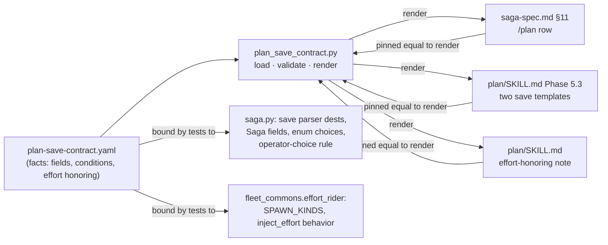

# Saga Plan maintenance — issue 926 unit P5, structured documentation contract (cycle 3 redesign)

## Summary

Replace the natural-language drift classifier that failed two Saga Code Review cycles with one
machine-readable contract, `plugins/saga/references/plan-save-contract.yaml`, that states what the
Plan skill writes to the saga and how resolved effort is honored. The specification row, the Plan
skill's two save templates, and the Plan skill's effort note are rendered from that contract and
pinned to it; the contract itself is pinned to the engine's save parser, the `Saga` dataclass, the
enum domains, and `effort_rider`'s observable behavior. Prose is never parsed and never the thing
under test. The source-derived consumer-row check survives in its sound form: derived from the
contract, bound to code, never a document agreeing with itself. Every one of the 55 cycle-2 findings
carries an explicit disposition below.

## Problem Frame

Issue 926 asked for four documentation corrections and two cheap checks. The corrections shipped at
`d64e0dc9` and are not in question. The two checks are. The negative check tried to classify
free prose — "any span pairing an effort token with a not-honored claim" — and cycle 2 measured
what that costs: across 32,262 spans in the Saga plugin's Markdown, 126 carry an effort token, 261
carry a "dead-end adjective", and exactly zero carry both, so the check was green on a zero-span
margin; 10 of 12 natural rewordings of the banned claim escaped it; it rejected 24 correct sentences
including two that instruct the reader to honor effort; its escape hatch, a `drift-check-opt-out`
substring, could be spelled as a file path and silenced an unbounded HTML comment; and its failure
message accused a document of "claiming effort is emitted but unhonored" when the document said the
opposite. The adversarial lens scored `load-bearing-assumptions` at 4.0 and
`failure-amplification-silent-green` at 3.5. Those two scores are the reason the unit failed, and
they are structural: a prose classifier cannot have a margin, because prose has no schema.

The operator rejected both another line-by-line repair and a narrow exact-phrase tripwire, and
decided the replacement: a structured, machine-readable documentation contract. This plan is that
design, complete enough that the worker decides nothing.

Two baselines apply and they differ. The **finding baseline** is the cycle-2 review of `337710f3`
(typed outcome `repairs_requested`, 47 distinct defects). The **implementation baseline** is the live
tree at `a736c166` on `work/cp918-p5-maintenance`, clean, gate green. One commit of later work sits
between them; the next section reconciles it.

---

## Reconciliation of `a736c166` — verified, not reported

The interim commit `a736c166` ("share Plan contract parser and repair interim review findings")
claimed six repairs. Each was re-verified in a scratch extract of that commit, never in the live
tree. The verdicts below are mine.

| Claimed repair | Verdict | My evidence |
|---|---|---|
| D1 — one shared Phase 5.3 parser, titled fences visible to both checks | **Genuinely fixed.** | Inserted a third save template under a titled bash fence omitting `--phase-status`; `tests/test_saga_plan_save_and_routing.py::test_plan_phase_status_agrees_end_to_end` went red with "every save variant must pass --phase-status exactly once; counts per variant: [1, 1, 0]". The routing test and the consumer-row test both import `tests/saga_plan_contract.py`. |
| D2 — the false "auto-derived on every save" universal, four files | **Genuinely fixed.** | A grep for the universal across `plugins/saga/`, `tests/`, and `docs/engineering-journal/` finds it only in `ARCHIVE.md`'s superseded record. The replacement wording matches `plugins/saga/scripts/saga.py:1481-1485` (explicit choice wins; otherwise an explicitly passed `--orchestration-mode`; otherwise carry-forward or empty). |
| D3 — the command card links to the row instead of copying it | **Genuinely fixed.** | `plugins/saga/docs/commands.md:108` is now a pointer; its relative path `../references/saga-spec.md` resolves from `plugins/saga/docs/`, and its anchor `#11-consumer-contract-rebuild-targets` is the GitHub slug of the heading at `saga-spec.md:506`. |
| D4 — the decision record's three false statements | **Fixed as stated, and about to be superseded.** | The record at `docs/engineering-journal/DECISIONS.md:5-55` now says bare `advisory` matches, says the every-save derivation claim was false, and hedges the self-guard to "sensitivity to its added option, not immunity to every rewrite". I built an argument-aware tautology (return the row when handed the real section): the suite stayed green, and adding a smuggled flag still went red only because the probe's honest path disagreed with the tautological one — an incidental catch, which the hedged record now describes correctly. This plan replaces the record's subject entirely. |
| D5 — quoted hashes and comment boundaries in flag harvesting | **Genuinely fixed.** | Direct calls to `flags_of`: a `--decisions "… #926"` value followed by `--issue-ref` harvests both; a column-0 comment and a tab-indented comment are stripped; a trailing comment with a continuation does not swallow the next line. |
| D6 — the forged probe flag was a real engine flag | **Genuinely fixed.** | `tests/test_saga_spec_consumer_row.py:254` allocates `saga-test-only-nonexistent-field` and extends it until absent from both documents and `saga.py`. |

Also verified at `a736c166`, because cycle-2 findings sit on them: renumbering the `### 5.3` heading
now fails with a message naming the file and the heading (`tests/saga_plan_contract.py:25`); an inline
triple-backtick in prose no longer shifts fence pairing; tilde fences are read. A four-space-indented
save block is still invisible to the shared reader — the redesign closes that a different way
(requirement R14).

Two things `a736c166` did not do, both re-demonstrated: deleting `tests/test_saga_spec_consumer_row.py`
leaves 115 neighboring tests green with no message; and adding `--risk-tier low` to a Phase 5.3
template plus `risk_tier` to the row leaves nine tests green while `saga.py save --risk-tier low`
exits with "unrecognized arguments". Requirements R9 and R20 close these.

---

## The structured documentation contract

### The one-sentence source of truth

`plugins/saga/references/plan-save-contract.yaml` is the only place that states which saga fields
the Plan skill writes, under what condition, and how resolved effort is honored; every document that
shows those facts is rendered from it, and every fact in it is checked against the engine.

### Shape of the design



Two directions, never a loop: facts flow **out** to documents by rendering, and facts are checked
**against** code by binding. A document is never read to learn a fact. That is what makes the
validation non-tautological — the contract can be wrong about the engine (binding goes red), and a
document can be wrong about the contract (pin goes red), but no check compares a source to itself.

### Element 1 — canonical source of truth

`plugins/saga/references/plan-save-contract.yaml`, schema token `plan_save_contract.v1`. YAML,
because the reference directory's human-edited structured files are YAML (`engine-registry.yaml`,
`effort-policy.yaml`, `benchmark-suite.yaml`) and PyYAML is a runtime dependency; JSON is used in
that directory only for machine-loaded policy (`lens-roster.json`, `bridge-signatures.json`).

### Element 2 — schema and ownership

Owner: the Plan skill, `plugins/saga/skills/plan/SKILL.md`; the file is edited when Plan's save
changes and at no other time. The shape, stated in full so the worker copies rather than designs:

```yaml
schema: plan_save_contract.v1
producer: /plan
owner: plugins/saga/skills/plan/SKILL.md
reads: '`scan` (offer "resume existing?" before minting — §2.3)'   # free text, rendered verbatim

identity:                       # name the saga; never written as fields, never in the row
  - name: kind
    placeholder: "<issue|task>"
  - name: id
    placeholder: "<issue-number-or-task-slug>"

writes:                         # order is rendering order
  - name: lifecycle_phase
    value: plan
    when: always
  - name: phase_status
    value: complete
    when: always
  - name: plan_path
    placeholder: docs/plans/YYYY-MM-DD-<topic>-plan.md
    when: always
  - name: destination
    placeholder: "<plan-only|pr|merge|nonprod-deploy>"
    when: always
  - name: deploy_autonomy
    placeholder: "<gate|auto>"
    when: {field: destination, equals: nonprod-deploy}
    note: Phase 5.1 follow-up; omit otherwise
  - name: adr_refs
    placeholder: '"ADR-NNNN|ADR-MMMM"'
    when: always
  - name: decisions
    placeholder: '"KTD1: rationale. KTD2: rationale."'
    when: always
    note: the KTD mirror; renders as the tick's `## Decisions` section
  - name: orchestration_mode
    placeholder: "<inline|team-execution|cc-workflows-ultracode>"
    when: always
  - name: orchestration_recommended
    placeholder: "<recommend_execution_backend() output>"
    when: always
  - name: orchestration_ref
    placeholder: docs/workflows/YYYY-MM-DD-<topic>-spec.json
    when: {field: orchestration_mode, equals: cc-workflows-ultracode}

stored_without_flag:            # written by the engine on a Plan save, not by a Plan flag
  - name: orchestration_operator_choice
    rule:
      explicit_flag: orchestration_operator_choice   # wins when passed
      else_from_flag: orchestration_mode             # when that flag is explicitly passed
      else: preserve-prior-or-empty                  # new saga: empty; resumed saga: prior value

templates:                      # the Phase 5.3 save templates, in document order
  - id: default
    fixed: {}
    omit: [orchestration_ref]
  - id: cc-workflows-ultracode
    fixed: {orchestration_mode: cc-workflows-ultracode}
    omit: [deploy_autonomy]

effort_honoring:
  seam: fleet_commons.effort_rider.inject_effort
  parameters: [prompt, effort, spawn_kind]
  spawn_kinds:
    workflow: native
    external-engine: native
    agent: proxy
  reference: plugins/fleet-core/references/effort-convention.md
  notes:                        # free text, rendered verbatim, never validated
    - the per-unit "proposed tier" cell is a `<model>/<effort>` pair, both halves sourced verbatim from `tier_resolver.resolve(...)`, never a bare model literal with effort omitted
    - Team Execution's A7 worker table (`plugins/team-execution/skills/team-execution/SKILL.md`) carries the same cell shape and its parser splits the cell on `/`; its own copy of this note still carries the pre-#363 wording and is tracked by issue #993
```

Keys and their rules, enforced by `load()`:

- `schema` must equal `plan_save_contract.v1` exactly. Any other token in the
  `plan_save_contract` family is refused whole — no key is applied — mirroring
  `plan_pre_answers.v1`'s rule. Unknown top-level keys are an error.
- `writes[]`: required `name`, `when`; exactly one of `value` (a literal the template passes) or
  `placeholder` (the angle-bracket text the template shows); optional `note` (free text). Any other
  key is an error. The flag is derived: `--` plus the name with underscores as hyphens. A stored
  `flag` key would be a second thing to drift.
- `when`: the literal `always`, or a mapping `{field, equals}` where `field` names another entry
  in `writes` and `equals` is a member of that field's engine choices. Two conditions exist today;
  the grammar has no third form and the loader rejects any other shape.
- `identity[]`, `stored_without_flag[]`: `name` required; `stored_without_flag[].rule` requires
  exactly the three keys shown.
- `templates[]`: `id` unique; `fixed` keys name `writes` entries that have engine choices and values
  in those choices; `omit` names only conditioned `writes` entries; a template may not both fix
  and omit one field.
- `effort_honoring.spawn_kinds` values are `native` or `proxy`; `parameters` is a list of strings;
  `reference` is a repo-relative path that exists.
- **Duplicates**: a `name` appearing twice anywhere across `identity`, `writes`, and
  `stored_without_flag`, or a template `id` appearing twice, is an error naming both positions.
- **Every error** is a `ContractError` whose message is
  `<repo-relative path>: <section>[<index>] (<name or id>): <what is wrong and what was expected>`.
  A malformed contract never renders and never half-renders.
- Free text (`reads`, `note`, `notes`) is rendered verbatim and is declared free text in the file's
  header comment; it is the only part of the contract a human may reword without touching a fact.

### Element 3 — machine-readable facts and conditions

A fact is one `writes` entry: field name (a `Saga` dataclass field), its writer (the file's
`producer`), the value or placeholder the template passes, and the condition (`always` or
`field == value`). A checker reads all four without parsing prose. `stored_without_flag` states the
engine-side derivation as three named cases, not as a sentence. `effort_honoring` states the seam,
its parameters, and one mechanism class per spawn kind.

### Element 4 — participating producers and consumers

Producer: `/plan` only. The contract covers the one row issue 926 names, and **does not extend to
the other five consumer rows now**. Reasons: those rows (`/work`, `/code-review`, `/qa`, `/resume`,
`/loop`) are byte-identical to the merge base, are written as informal prose that never claimed
exhaustiveness, and were named out of scope at cycle 1; the cycle-2 api-contract lens itself lowered
that gap to a pre-existing repository condition that does not block. Extending is a scope change this
plan declines to make. The extension path is recorded so the decision is reversible without redesign:
a `plan_save_contract.v2` schema would carry a `producers` list and the renderer would locate each
producer's row by its `| **/<command>** |` prefix, which is how it locates the `/plan` row today.

Consumers of the rendered facts, all enumerated so none retains stale behavior: the `/plan` row
(rendered); the two Phase 5.3 templates (rendered); the effort note (rendered); the routing test
`tests/test_saga_plan_save_and_routing.py`, which reads `phase_status=complete` from the row by regex
and reads the templates through the shared reader (unchanged, and the rendering keeps the
`name=value` form it depends on — R17); `plugins/saga/docs/commands.md:108`, a pointer (unchanged);
`plugins/saga/docs/model/saga-docs-model.yaml:269`, which gets the same pointer sentence (R25).

### Element 5 — how human documentation refers to or renders the facts

Three rendered regions, all marked with the repository's existing generated-block idiom
(`plugins/saga/skills/plan/SKILL.md:479` and `plugins/fleet-core/scripts/fleet_commons/render_tier_table.py`):

1. **The `/plan` row** in `plugins/saga/references/saga-spec.md` §11 — the whole table row, located
   by its `| **/plan** |` prefix. The Reads cell is rendered from the contract's `reads` free text
   verbatim, so no second copy of that sentence survives anywhere. Rendering of the Writes cell:
   for each write, `` `name=value` `` when a literal value,
   else `` `name` ``; a conditioned write appends `(only when `field=value`; <note>)`; a write with a
   note but no condition appends `(<note>)`; then `; also stored: `orchestration_operator_choice`
   (<rule sentence>)`, where the rule sentence is rendered from the three cases by a fixed mapping.
   An HTML comment cannot sit inside a Markdown table, so the annotation is the sentence immediately
   after the table, which replaces the current "How to read the `/plan` Writes cell" paragraph
   (`saga-spec.md:520-526`) and reads: the `/plan` row is rendered from
   `plugins/saga/references/plan-save-contract.yaml` by `plugins/saga/scripts/plan_save_contract.py
   render --write`; `tests/test_saga_spec_consumer_row.py::test_saga_spec_plan_consumer_row_matches_contract`
   fails when they differ; edit the contract, not the row.
2. **The two Phase 5.3 templates** in `plugins/saga/skills/plan/SKILL.md`, each wrapped in
   `<!-- BEGIN GENERATED PLAN SAVE TEMPLATE: <id> (rendered from references/plan-save-contract.yaml
   by scripts/plan_save_contract.py — do not hand-edit; a divergence fails
   tests/test_saga_spec_consumer_row.py::test_plan_docs_generated_regions_match_contract) -->` and
   `<!-- END GENERATED PLAN SAVE TEMPLATE: <id> -->`. Inside: the fenced `bash` block containing
   `python3 plugins/saga/scripts/saga.py save \` followed by one continued line per identity flag
   and per unconditioned or fixed write, in contract order; then, when the template has any
   conditioned write whose condition field is not fixed, a bullet list headed "Add when the condition
   holds:" with one bullet per such write: `` `--deploy-autonomy <gate|auto>` — only when
   `--destination nonprod-deploy`; Phase 5.1 follow-up; omit otherwise ``. Conditioned flags never
   appear inside the block, because bash cannot carry a comment inside a backslash-continued
   command (KTD6, finding arch08).
3. **The effort-honoring note** in `plugins/saga/skills/plan/SKILL.md`, replacing the
   `EFFORT-EMISSION MARKER` comment at `:544-552`. It stays one HTML comment so the agent reads it
   and the rendered page does not; its first line is `<!-- BEGIN GENERATED EFFORT HONORING NOTE
   (rendered from references/plan-save-contract.yaml … do not hand-edit; pinned by …)` and its last
   line is `END GENERATED EFFORT HONORING NOTE -->`. The body names the seam and its parameters,
   lists each spawn kind with `native` rendered as "carries effort on a real control" and `proxy` as
   "prepends an `EFFORT_RIDER` directive, a labeled proxy, because the Agent tool has no per-call
   effort parameter", cites the reference, then renders each free-text note verbatim.

**What a human editor may change freely**: any byte outside the three marked regions and outside
the `/plan` row, including every sentence around the templates, the Reads column of every other
row, and the annotation sentence itself. Inside a region: nothing — edit the contract and re-render.

### Element 6 — validation direction

Two directions, both away from documents. **Contract → engine** (binding): every `writes` and
`identity` name is a `Saga` dataclass field; every derived flag is an option of the `save` parser
built by calling `saga._add_save_parser` on a throwaway `argparse` subparser; every `value` is in
that option's `choices`; every `when.equals` is in the condition field's `choices`;
`effort_honoring.spawn_kinds` equals `effort_rider.SPAWN_KINDS` and each mechanism is proved by
calling `inject_effort` (a `native` kind returns the prompt unchanged; the `proxy` kind returns
`EFFORT_RIDER[effort] + "\n\n" + prompt`); `parameters` equals the seam's signature; the
`stored_without_flag` rule is proved by three real `saga.py save` subprocess runs (R21).
**Contract → documents** (pin): each rendered region on disk equals a fresh render. Neither
direction reads a document to obtain a fact, so a document agreeing with itself satisfies nothing:
the row could be hand-edited to match a wrong contract and the binding would still fail; the contract
could be edited to match a wrong row and the binding would still fail.

### Element 7 — actionable diagnostics

Every failure names the file, the region or entry, and the remedy; none characterizes what a document
"claims".

| Failure | Message shape |
|---|---|
| Malformed or duplicate contract entry | `plugins/saga/references/plan-save-contract.yaml: writes[4] ('deploy_autonomy'): when.equals 'nonprod' is not a choice of --destination; expected one of ['plan-only', 'pr', 'merge', 'nonprod-deploy']` |
| Contract names a field or flag the engine lacks | `…plan-save-contract.yaml: writes[10] ('risk_tier'): --risk-tier is not an option of `saga.py save`; the engine's save options are […]` |
| Row differs from rendering | `plugins/saga/references/saga-spec.md: the /plan consumer row differs from its rendering from plugins/saga/references/plan-save-contract.yaml. Edit the contract and run `python3 plugins/saga/scripts/plan_save_contract.py render --write`; do not hand-edit the row.` followed by a two-line on-disk/rendered diff |
| Generated region differs, missing, or duplicated | `plugins/saga/skills/plan/SKILL.md: generated region 'PLAN SAVE TEMPLATE: default' <differs from its rendering / not found / found 2 times>. …same remedy…` |
| A save command outside a generated region | `plugins/saga/skills/plan/SKILL.md Phase 5.3: a `saga.py save` command appears outside a generated template region (line N); add it to the contract's `templates` and re-render, or remove it` |
| `render --write` on an anomalous document | refuses before writing, with the region diagnostic above; exit 2; the file is untouched |

### Element 8 — migration from the current prose

Order, each step proved before the next:

1. Author the contract by transcribing the two current templates and the current row (U1). Proof:
   `render_consumer_row()` carries the same ten backticked field names in the same order as the
   current row at `saga-spec.md:513`; every remaining difference is a restatement of a condition,
   a note, or the also-stored tail from the structured rule, whose phrasing Element 5 fixes (the
   `deploy_autonomy` and `orchestration_ref` conditions and the operator-choice tail are all
   reworded, not just one trailing parenthetical). The rendered default template equals the
   current block at `SKILL.md:621-634` **except** that `--deploy-autonomy` moves from a commented
   line inside the block to the conditional bullet under it. The worker shows the full
   render-vs-disk diff as the proof (R31); any difference outside a parenthetical, the
   also-stored tail, or the permitted bullet move is a defect in the renderer, and the unit stops.
2. Run `render --write` (U2), then `git diff` and confirm the hunks are exactly: the marker lines,
   the two template regions, the effort note, the row, and the annotation sentence. Anything else in
   the diff is a defect in the renderer, and the unit stops.
3. Replace the row-parsing positive check with the render pin and delete the classifier (U2). At no
   commit does the tree lack a consumer-row check.
4. Lossless proof: the set of field names in the old row (parsed once, by hand, into the migration
   note in the commit message) equals the contract's `writes` names — ten fields; the two conditions
   survive as `when`; the operator-choice rule survives as three cases; the effort facts survive as
   `effort_honoring`. Nothing the old prose asserted is dropped, and one thing it got wrong (a
   comment swallowing a shell continuation) is corrected.

### Element 9 — removal of the classifier and the sentinel

Both go: `_EFFORT_TOKEN`, `_EMISSION_ONLY`, `_OPT_OUT`, `_NEGATION`, `_VERB`,
`_NEGATION_GOVERNS_UNHONORED`, `_UNPREFIXED_DENIAL`, `_DEAD_EFFORT`, `_CLAUSE_SPLIT`,
`_claim_spans`, `_unhonored_effort_match`, `test_plan_docs_reject_unhonored_effort_claims`, and the
`drift-check-opt-out` parenthetical in `plugins/saga/CHANGELOG.md:38`. After U3, `grep -rn
drift-check-opt-out` over the tree returns nothing (R12).

What replaces the protection each nominally provided:

- The classifier nominally guarded "no Saga document claims effort is unhonored". Its real coverage
  was the subset of relapses sharing one comma-delimited clause with an effort token, at the cost of
  rejecting correct prose. The replacement is stronger where it matters and honest where it is not:
  the one place Saga states the effort-honoring fact is rendered from a contract bound to
  `effort_rider`'s behavior, so it cannot go stale silently — renaming or moving the seam turns the
  binding red (finding testing05). A stale claim written elsewhere in free prose is **not** caught,
  and this plan says so rather than pretending a regex would. The fleet's own rule is that plugins
  link to `effort-convention.md` rather than restate it (`effort-convention.md:5-6`); the one known
  restatement, Team Execution's, is tracked by open issue 993.
- The sentinel nominally let the matcher's own description opt out. With no matcher, nothing needs
  an opt-out; the changelog bullet describes the contract in ordinary prose.

---

## Requirements

Grouped by concern; numbering is continuous.

*The contract and its loader*

R1. `plugins/saga/references/plan-save-contract.yaml` exists, carries `schema: plan_save_contract.v1`,
and states the ten `writes`, two `identity` entries, one `stored_without_flag` entry, two
`templates`, and the `effort_honoring` block exactly as shown under Element 2.

R2. `plugins/saga/scripts/plan_save_contract.py` loads the contract, validates every rule under
Element 2, and raises `ContractError` with the message shape under Element 7 on any violation.

R3. A contract whose `schema` token is any other member of the `plan_save_contract` family is
refused whole; a file with a foreign schema token is not a contract and is reported as such, not
applied.

R4. Duplicate names across `identity`, `writes`, and `stored_without_flag`, and duplicate template
ids, are rejected naming both positions.

R5. The script exposes `render_consumer_row(contract)`, `render_template(contract, template_id)`,
`render_effort_note(contract)`, and a CLI: `validate` (prints a JSON outcome, exit 0 clean / 2
invalid), `render --check` (exit 0 when every region matches, 1 with a diff when not), and
`render --write` (rewrites only the regions, refusing with exit 2 and no write when a region is
missing or duplicated). Rendering is deterministic and idempotent: rendering twice yields identical
bytes, and `render --write` on a clean tree produces no diff.

*Binding to the engine*

R6. Every `identity`, `writes`, and `stored_without_flag` name is a field of `saga.Saga`.

R7. Every `writes` entry's derived flag is an option of the `save` subparser obtained by calling
`saga._add_save_parser` on a throwaway subparser; the test builds that parser rather than reading
`saga.py` as text.

R8. Every `writes.value` is a member of its option's `choices`; every `when.equals` is a member of
the condition field's option `choices`; a condition may only target a field whose option has
`choices`.

R9. Adding a `writes` entry that the engine's save parser lacks fails R7's test naming the entry and
the flag. This is the check the cycle-2 review found absent (arch01, adv05).

R10. `effort_honoring.spawn_kinds` equals `set(effort_rider.SPAWN_KINDS)`; for each kind, the
mechanism is proved by calling `inject_effort` and comparing the returned prompt; `parameters`
equals the seam's signature; `reference` exists and mentions `inject_effort`. Moving or renaming
`plugins/fleet-core/scripts/fleet_commons/effort_rider.py` or `effort-convention.md` fails this test.

R11. The `stored_without_flag` rule is proved by three real `saga.py save` subprocess runs in a
temporary saga directory: no orchestration flag → the stored choice is empty; `--orchestration-mode
team-execution` alone → the stored choice is `team-execution`; `--orchestration-mode inline
--orchestration-operator-choice team-execution --orchestration-downgrade "<reason>"` → the stored
choice is `team-execution`. The test reads the written tick envelope, not `state.json`.

*Removal*

R12. After U3, no file in the tree contains `drift-check-opt-out`, and
`tests/test_saga_spec_consumer_row.py` contains no regular expression over prose.

R13. The only reader of Phase 5.3 templates that remains is the shared `tests/saga_plan_contract.py`,
used by the routing test and by R14; it is never used to derive a field set.

*Rendered documents*

R14. Phase 5.3 of `plugins/saga/skills/plan/SKILL.md`, with its generated regions removed, contains
no text matching `saga\.py\s+save`. A save command in any shape — fenced, tilde-fenced, titled,
indented, or inline — outside a generated region fails with the Element 7 message.

R15. Each of the three generated regions occurs exactly once in its file and equals a fresh render.

R16. The `/plan` row at `plugins/saga/references/saga-spec.md` §11 equals `render_consumer_row`,
and the annotation sentence after the table names the contract, the renderer command, and the
pinning test.

R17. The rendered row contains the literal `` `phase_status=complete` ``, because
`tests/test_saga_plan_save_and_routing.py::_spec_plan_write_phase_status` reads it by regex; R16's
test asserts this so the cross-file dependency is visible where it is created.

R18. The rendered default template contains no `#` character, so no comment can swallow a shell
continuation (finding arch08); the conditioned `--deploy-autonomy` flag appears only in the bullet
under the block.

R19. A wording-only change to any prose outside the generated regions and the row — proved on
in-memory copies of both documents in the test — leaves every pin green.

*Falsifiability*

R20. Deleting `tests/test_saga_spec_consumer_row.py`, `plugins/saga/scripts/plan_save_contract.py`,
or `plugins/saga/references/plan-save-contract.yaml` fails `tests/test_saga_plugin.py`, which pins
their existence and the six test function names by parsing the test module's AST (three added
in U1, three in U2).

R21. `tools/canary_registry.json` carries two entries whose mutations must be `caught`: a hand-edit
of the on-disk `/plan` row (guard: R16's test) and a contract entry naming a flag the engine lacks
(guard: R7's test). The canary runs on its schedule (`.github/workflows/mutation-canary.yml`), not
in the gate; the gate-time layers are R20 and the inline mutation proofs of R22.

R22. Each of the six tests carries an inline mutation proof on in-memory inputs that its own
assertion goes red with the expected message: a malformed and a duplicate contract for R2/R4; a
phantom flag for R7; a mechanism swapped from `native` to `proxy` for R10; a hand-edited row for
R16; a hand-edited template body and a save command outside a region for R14/R15.

*Prose corrections carried from cycle 2*

R23. `plugins/saga/skills/plan/SKILL.md:662-669` no longer enumerates the ten flags; it says the
flags in the templates above are the `/plan` consumer row, both rendered from the same contract,
and keeps the `--phase-status complete` routing sentence.

R24. `plugins/saga/skills/plan/SKILL.md:389` no longer asserts that Plan commits the plan document;
it says the document travels with the work because the executor commits it alongside the changes.

R25. `plugins/saga/docs/model/saga-docs-model.yaml:269` carries the same pointer sentence as the
command card, and `:271` together with `plugins/saga/docs/commands.md:110` list the four exits Phase
5.4 offers: `/doc-review`, `/work`, `/handoff`, `/brainstorm`.

R26. The rendered effort note carries the two free-text notes under Element 2, so the tier-cell
shape instruction and the Team Execution pointer with issue 993 are present in the file an agent
reads.

*Protected surfaces*

R27. Sections 0.6 and 5.0 of `plugins/saga/skills/plan/SKILL.md` — every byte recorded in the
operator's protected baseline — are byte-identical to `a736c166`.

R28. `plugins/saga/skills/plan/SKILL.md:492`, `:514`, and `:538-542` (the model-and-effort
confirmation, decision P-D5) are byte-identical to `a736c166`.

R29. The five non-`/plan` consumer rows at `saga-spec.md:514-518` are byte-identical to `a736c166`.

R30. No version string changes; `plugins/saga/.claude-plugin/plugin.json`,
`.claude-plugin/marketplace.json`, and the `0.156.0` heading stay as they are, and the integrator
sets the heading's date at merge.

*Evidence*

R31. The worker's U2 commit message carries the `git diff --stat` and the full render-vs-disk
diff, confirming every difference is a rule-derived restatement or the permitted bullet move
under Element 8; the U3 commit message carries the output line of each mutation
proof run red.

R32. `uv run pytest tests/ -q -k "saga_spec or plan_docs or consumer_row"` selects the six tests
in `tests/test_saga_spec_consumer_row.py` (all match by module name) and passes;
`bash scripts/gate.sh` exits 0.

---

## Key Technical Decisions

KTD1. **One YAML contract is the source; documents are rendered from it; the contract is bound to
code — never the reverse.** Rejected: deriving the field set from the templates and comparing to
the row (cycle 1 and 2's design), because it certifies document-to-document agreement and blesses a
flag the engine rejects; deriving from `saga.py`'s parser alone, because the parser knows every
field any command may write and cannot say which ones Plan passes (the a736c166 record already
states this); generating the contract from the row, which is the tautology cycle 2 filed.

KTD2. **The row and the templates are generated regions, not parsed prose.** Rejected: keeping a
parse of the row with a nesting-aware parenthesis stripper, because every parse of prose the unit
has shipped acquired a new edge case per review (non-nesting parens, quoted hashes, titled fences,
inline backticks, indented blocks), and the repository already owns the generated-block idiom that
ends that class (`SKILL.md:479`, `render_tier_table.py`).

KTD3. **The effort-honoring fact is structured and bound to `effort_rider`'s public behavior, and
the prose note is rendered from it.** Rejected: a narrow exact-phrase tripwire (rejected by the
operator; catches only the sentence it names); repairing the classifier (rejected by the operator;
a prose matcher has no margin); dropping the effort fact from Saga entirely and pointing at
`effort-convention.md` (rejected because the agent executing Plan's tier table reads the skill file,
and a pointer would drop the cell-shape instruction that is Plan's own). Binding is to `SPAWN_KINDS`
and `inject_effort`'s return values, not to the module's underscore-prefixed constants, so an
internal refactor that preserves behavior does not go red.

KTD4. **Validation is hand-written with named errors, not `jsonschema`.** `jsonschema` is a dev-only
dependency, the renderer runs at edit time from `plugins/saga/scripts/` like every other reference
loader (`engine_registry`, `effort_ledger`, `plan_pre_answers`), and hand-written checks produce the
entry-and-key diagnostics Element 7 requires, which schema validators phrase poorly.

KTD5. **Templates declare `fixed` and `omit` explicitly rather than deriving variant membership.**
A derivation rule ("render every conditioned write whose field is not fixed") would change both
templates' content relative to today — the default template would gain an `orchestration_ref`
bullet and the ultracode template a `deploy_autonomy` bullet. Explicit lists reproduce today's two
templates exactly, which makes the migration provable by diff. The lists are validated (omit ⊆
conditioned writes; fixed values ∈ choices) and live in the single source, so they are not a second
copy.

KTD6. **Conditioned flags render as a bullet under the block, never as a comment inside it.** Bash
joins a backslash-continued line to the next before it sees `#`, so a comment on any line of a
continued command ends the command there; the current template's `--deploy-autonomy … # ONLY when …
\` truncates the documented command at that flag (finding arch08, reproduced by the lens). The
rendered block therefore contains no `#` at all (R18).

KTD7. **Property 4 is three layers with stated limits.** An AST-based inventory pin in an existing
loud test (R20) makes deletion red in the gate; two canary registry entries (R21) make a
short-circuited checker `toothless` on the scheduled canary; inline mutation proofs (R22) make a
short-circuited assertion fail its own test unless the saboteur also deletes the proof. No single
layer is claimed to be complete; the plan says which layer catches what.

KTD8. **The other five consumer rows stay prose.** See Element 4. Rejected: extending the contract to
all six rows now, because it is a scope change issue 926 does not authorize, would touch 33 stored
fields across four skills, and the api-contract lens itself classed the gap as pre-existing and
non-blocking.

KTD9. **The cycle-1 plan document is retained unedited.** It is the artifact the review scored; this
plan supersedes it through its own `origin` field and the saga tick's `plan_path`. Editing it would
break the reviewer's ability to map findings to the revision they were filed against.

KTD10. **The `orchestration_operator_choice` rule is proved by subprocess, not by reading
`saga.py`.** Three real `save` runs in a temporary directory exercise `saga.py:1481-1485` through the
CLI the skill actually invokes (R11). Rejected: constructing an `argparse.Namespace` and calling
`_build_save_saga`, which would prove a private function rather than the command.

---

## Falsifiable properties and mutation matrix

| Property | Mutation | Test that goes red | Expected message names |
|---|---|---|---|
| 1. Real field or condition drift fails | Add `- name: risk_tier` with `when: always` to the contract | `test_plan_save_contract_binds_to_engine` | contract path, `writes[10] ('risk_tier')`, `--risk-tier is not an option of saga.py save` |
| 1. | Change `deploy_autonomy.when.equals` to `pr` | same test | `when.equals 'pr'` is a choice but the rendered row then differs → `test_saga_spec_plan_consumer_row_matches_contract` red until re-rendered; naming `saga-spec.md`, remedy |
| 1. | Hand-edit the on-disk row: drop `` `adr_refs` `` | `test_saga_spec_plan_consumer_row_matches_contract` | `saga-spec.md`, "differs from its rendering", remedy command |
| 1. | Hand-add `--issue-ref x \` to the default template on disk | `test_plan_docs_generated_regions_match_contract` | `SKILL.md`, `PLAN SAVE TEMPLATE: default`, remedy |
| 1. | Add a third fenced (or indented) `saga.py save` block outside the markers | same test (R14 assertion) | `SKILL.md Phase 5.3`, line number, "outside a generated template region" |
| 1. | Swap `agent: proxy` to `agent: native` in the contract | `test_plan_save_contract_binds_to_engine` | `effort_honoring.spawn_kinds ('agent')`, "inject_effort prepends a rider; contract says native" |
| 2. Wording-only prose change does not fail | In memory, reword every sentence of Phase 5.3 outside the regions and the annotation sentence under the table | `test_plan_docs_wording_changes_do_not_fail` stays green | — (the test asserts green) |
| 3. Malformed or duplicate facts fail safely | `when: {field: destination}` (missing `equals`); `writes` with both `value` and `placeholder`; two entries named `plan_path`; `schema: plan_save_contract.v2` | `test_plan_save_contract_loads_and_rejects_malformed_entries` | contract path, `writes[<i>] ('<name>')`, the missing or duplicate key, the expected form; for v2, "refused whole" |
| 4. Bypassed or self-derived validator is caught | Delete the test module or the script | `tests/test_saga_plugin.py` (R20) | the missing path and the five expected test names |
| 4. | Short-circuit `render_consumer_row` to return the on-disk row | canary entry `plan-save-contract-row` reports `toothless`; the inline proof for R16 fails because a hand-edited in-memory row no longer differs | the canary id; the test's own proof message |
| 4. | Short-circuit the engine binding to `pass` | canary entry `plan-save-contract-engine-binding` reports `toothless`; R22's phantom-flag proof fails | same |

---

## Review-dimension map — how this unit will be judged, and what a 10 looks like

Acceptance per `plugins/saga/references/lens-roster.json`: `derived_overall >= 9.0` and every
applicable dimension `>= 7.0`, combiner `all`; finding priority and confidence are not gates.
Always-on: `architecture-maintainability`, `correctness`, `security`, `testing`. Conditional lenses
judged applicable, with the reason:

| Lens | Applies | Why |
|---|---|---|
| `previous-comments` | yes | third cycle; 55 prior findings, each mapped to this revision in the ledger below |
| `adversarial` | yes | the prior design failed on this lens's two lowest dimensions; the unit exists to change that |
| `documentation-clarity` | yes | every changed byte outside `tests/` and one script is documentation read by an agent at run time |
| `agent-usability` | yes | the rendered note, the row, and the renderer's diagnostics are consumed by agents; the CLI prints machine-readable outcomes |
| `api-contract` | yes | the contract is a versioned schema (`plan_save_contract.v1`) with a refusal rule, and the row is the rebuild contract for `/plan` |
| `deployment-infrastructure`, `reliability`, `performance`, `privacy`, `accessibility-human-usability` | no | no deployed resource, no fallible remote call, no hot path, no personal data, no human UI is touched |

The map: dimension → design choice → evidence → prior findings it answers. A 10 is stated per
dimension in the roster's own words where the anchor is short enough to quote.

| Lens / dimension (cycle-2 score) | Design choice | Evidence or test | Prior findings |
|---|---|---|---|
| adversarial / load-bearing-assumptions (4.0) — 10: "all assumptions explicitly stated and verifiably correct" | Every assumption is written down and each has a check: the save parser is the authority for flags (R7 builds it); the two templates are the only save commands in Phase 5.3 (R14); each marker occurs once (R15); `effort_rider`'s public behavior is the seam (R10); PyYAML preserves key order so rendering is deterministic (R5 idempotence); the routing test's regex still finds `phase_status=complete` (R17) | R5, R7, R10, R14, R15, R17 tests | adv09, adv07, adv02, adv11, adv05, adv12, adv13 |
| adversarial / failure-amplification-silent-green (3.5) — 10: "all failure paths handled gracefully; errors are informative" | No prose scan exists, so no false green from a missed clause and no false red from a matched adjective; every anomaly (missing marker, duplicate marker, missing row, empty writes, unknown key, phantom flag) has a named error; `render --write` refuses before writing; guard deletion is red in the gate; short-circuits are `toothless` on the canary | Element 7 table; R2, R4, R14, R15, R20, R21, R22 | agentusab04, adv03, testing04, arch01, adv06, agentusab08 |
| adversarial / abuse-edge-cases (4.0) | Nested parentheses, quoted hashes, titled and tilde fences, inline backticks, indented blocks: none is parsed for facts any more; the only reader of templates is the shared reader, used for a presence check (R14) that no fence shape can evade because it matches the command text, not the fence | R14 test with an indented-block mutation | adv02, adv15, corr03, corr04, arch02 |
| adversarial / recovery (4.5) — 10: "explicit, bounded, idempotent, verified" | `render --write` is idempotent and only touches marked regions; every failure message states the one command that repairs it | R5 idempotence assertion; Element 7 | doc-clarity10 |
| adversarial / scope-creep-risk (5.5) | The five rows, Team Execution, Python-file scanning, and `jsonschema` are all explicitly not done, with reasons | KTD4, KTD8; Scope Boundaries | api-contract03 |
| adversarial / alternatives-considered (6.5) | Each KTD names what was rejected and why | KTD1–KTD10 | arch05 |
| adversarial / environment-operator-failure (5.5) | The CLI reports a missing or unreadable contract, a missing marker, and an unwritable target as distinct exit-2 outcomes with the path | R5 | agentusab08, testing07 |
| testing / negative-edge (5.0) — 10: "all meaningful negative and boundary classes exercised with explicit expected outcomes" | Malformed, duplicate, wrong-schema, phantom-flag, out-of-enum condition, missing marker, duplicated marker, stray save block, hand-edited row, wording-only change | R22 inline proofs; mutation matrix | testing01, testing09, testing10, testing12, testing02 |
| testing / behavior-sensitive-assertions (6.5) | The operator-choice rule and the effort mechanism are proved by observed behavior (subprocess ticks; `inject_effort` return values), never by reading source text | R10, R11 | testing05, corr06, api-contract04 |
| testing / realistic-seams (7.0) | Real parser build, real subprocess saves, real files; no monkeypatch stands in for the engine | R7, R11 | — |
| testing / determinism-diagnostics (6.5) | No clock, no network, no shared state; every assertion message names file and entry | Element 7 | adv06, agentusab08 |
| testing / requirements-regression (7.0) | Each of R1–R32 names its test; each cycle-2 finding names its requirement in the ledger | this document | all |
| architecture / single-sources (6.0) — 10: "follows the established patterns in neighboring files" | One contract; the generated-block idiom already used at `SKILL.md:479`; a runnable validator script like `plan_pre_answers.py` and `plan_artifact_conformance.py`; YAML in `references/` like its neighbors | KTD1, KTD2, KTD4 | arch07, corr07, doc-clarity11, doc-clarity07 |
| architecture / simplicity-duplication (5.0) | Roughly 200 lines of regex classifier and its proofs deleted; one 60-line YAML file, one script, five tests; no field list exists anywhere but the contract | Element 9; R12 | arch07, testing11, corr02 |
| architecture / readability-error-contracts (6.5) | `ContractError` with one message shape; markers name renderer and test; the annotation sentence names the test | Element 7; R16 | arch04, arch06 |
| architecture / decision-documentation (6.5) | A DECISIONS entry supersedes the a736c166 record with rejected alternatives and revisit conditions; a LEARNINGS entry records the zero-span measurement | U3 | arch05 |
| architecture / conventions (6.5) | Schema-token refusal mirrors `plan_pre_answers.v1`; generated-block markers mirror `render_tier_table.py`; test naming keeps the `-k` filter working | R3, Element 5, R32 | — |
| correctness / intent-completeness (7.5) | Every issue-926 acceptance criterion maps to a requirement (see Scope Boundaries) | R-table | — |
| correctness / caller-consumer-completeness (7.5) | Every consumer of the row and templates enumerated and either unchanged or updated | Element 4 | adv04, agentusab05 |
| correctness / side-effects (8.0) | `render --write` is the only writer, touches only the marked regions, refuses on anomaly | R5 | — |
| documentation-clarity / parity (7.5) — 10: "every material statement matches verified shipped behavior" | Rendered from facts that tests bind to the engine | R6–R11, R15–R16 | corr06, agentusab07, doc-clarity08, doc-clarity09 |
| documentation-clarity / generated-drift (7.0) | Markers name source, renderer, and test | Element 5 | arch04, doc-clarity06 (rejected, see ledger) |
| documentation-clarity / cross-document consistency (7.0) | Model, card, spec, and skill agree because three of the four render from one source and the fourth points at it | R25 | adv04 |
| agent-usability / machine-readable output (6.5) — 10: "deterministic, versioned, parseable, routes the next safe action" | `validate` prints JSON; every error carries the remedy command; the schema token is versioned | R5, Element 7 | agentusab04, agentusab06 |
| agent-usability / discoverability (8.5) | The markers in the skill file tell an agent where the facts live and how to change them | Element 5 | doc-clarity10 |
| api-contract / spec-doc parity (7.5) | The row is the rendering of the contract, and the contract is bound to the parser | R7, R16 | api-contract04, api-contract06 |
| api-contract / serialization-errors (7.0) | `ContractError` shape; JSON outcome from `validate` | Element 7 | — |
| api-contract / versioning (9.0) | `plan_save_contract.v1`; non-v1 refused whole | R3 | — |
| previous-comments / resolution-completeness — 10: "every prior thread mapped to the current revision with direct evidence" | The ledger below, one row per finding, with the verifying evidence or the requirement that closes it | Finding ledger | all 55 |
| security (all dimensions) | No new input beyond repository files; no shell invocation with user text; the renderer writes two declared files; expected to find nothing | — | — |

---

## Finding ledger — 55 cycle-2 findings and two carried cycle-1 security findings

Categories: **repair** (this plan fixes it, where and how), **already-fixed** (the live tree fixes
it, verified by me), **resolved-by-redesign** (the defect's subject no longer exists),
**duplicate-of** (same defect, same fix, filed by another lens), **rejected** (not a defect of this
unit, with evidence). Counts: repair 11, already-fixed 10, resolved-by-redesign 18, duplicate-of 14,
rejected 2 — 55 cycle-2 rows. The two separately identified cycle-1 carry-forward rows below
bring this ledger to 57 rows; they were omitted from the original heading and tally.
The controller deduplicated cycle 2 to 47; this ledger marks 14 duplicates because
several lenses filed one defect from distinct angles, and every row still gets its own line.

| Id | Sev | Lens | Disposition | Where and how, or evidence |
|---|---|---|---|---|
| cycle1-sec01 | P3 | security | resolved-by-redesign, rechecked in cycle 4 | The quadratic prose scanner is deleted. v1's replacement alias traversal also earned nothing; v2 rejects YAML alias tokens before object construction. `test_plan_save_contract_loads_and_rejects_malformed_entries` exercises recursive and shared aliases. |
| cycle1-sec02 | P3 | security | rejected for P5 scope, carried disposition | Marketplace license/category validation is a Wave One residual terminalized by the parent. The cycle-4 dispatch explicitly forbids reopening it. Marketplace bytes stay identical to `a736c166`; this row records custody, not a claim of repair. |
| adv07 | P1 | adversarial | already-fixed | `a736c166`; my titled-fence mutation omitting `--phase-status` turned the routing test red ("counts per variant: [1, 1, 0]") |
| adv09 | P1 | adversarial | resolved-by-redesign | the sentinel and the classifier are deleted (Element 9, R12); no prose is scanned |
| adv02 | P2 | adversarial | resolved-by-redesign | tilde fences are read at `a736c166` (my probe); an indented block outside a region fails R14, which matches the command text rather than a fence shape |
| adv03 | P2 | adversarial | repair | R20 inventory pin in `tests/test_saga_plugin.py`; R21 canary entries; R22 inline proofs; KTD7 states each layer's limit |
| adv04 | P2 | adversarial | repair | R25: model `saga_state_behavior` gets the card's pointer sentence; model and card `routes_out` list Phase 5.4's four exits; `render_docs_visuals.py` reads neither key, so no visual regenerates |
| adv05 | P2 | adversarial | duplicate-of arch01 | — |
| adv11 | P2 | adversarial | already-fixed | `a736c166`; `flags_of('--decisions "… #926" --issue-ref …')` returns both |
| adv12 | P2 | adversarial | resolved-by-redesign | no matcher rejects prose |
| agentusab04 | P2 | agent-usability | resolved-by-redesign | no message characterizes a document's claim; Element 7 messages name file, region, remedy |
| agentusab05 | P2 | agent-usability | already-fixed | `a736c166`; the card is a pointer with a resolving path and anchor |
| agentusab06 | P2 | agent-usability | resolved-by-redesign | no sentinel, no criterion to state |
| api-contract04 | P2 | api-contract | already-fixed | `a736c166` wording matches `saga.py:1481-1485`; the redesign renders the rule from three structured cases proved by R11 |
| arch01 | P2 | architecture | repair | R7/R9: every derived flag must be an option of the parser built from `saga._add_save_parser`; my `--risk-tier` reproduction is the mutation-matrix case |
| arch03 | P2 | architecture | duplicate-of adv07 | — |
| arch05 | P2 | architecture | already-fixed | `a736c166` corrected the three statements (verified against the code and by my tautology probe); U3 supersedes the record |
| arch06 | P2 | architecture | resolved-by-redesign | no suppression convention exists |
| arch07 | P2 | architecture | duplicate-of agentusab05 | — |
| corr02 | P2 | correctness | resolved-by-redesign | no adjective branch exists |
| corr06 | P2 | correctness | duplicate-of api-contract04 | — |
| doc-clarity09 | P2 | documentation | resolved-by-redesign | the changelog bullet describes the contract, not a matcher (U3) |
| doc-clarity10 | P2 | documentation | resolved-by-redesign | no escape hatch to document |
| testing01 | P2 | testing | resolved-by-redesign | no prose coverage to measure |
| testing04 | P2 | testing | repair | the comparison is contract→engine and contract→document (Element 6); KTD7's three layers for a short-circuit |
| testing05 | P2 | testing | repair | R10 binds the effort note's facts to `effort_rider`; moving the module or the reference goes red |
| testing09 | P2 | testing | resolved-by-redesign | no matcher |
| testing11 | P2 | testing | duplicate-of agentusab05 | — |
| adv06 | P3 | adversarial | already-fixed | `a736c166` line 243 names both paths; superseded by Element 7 |
| adv08 | P3 | adversarial | resolved-by-redesign | no file is scanned; the fact is bound to code, which covers Python by construction |
| adv13 | P3 | adversarial | resolved-by-redesign | no negation class |
| adv14 | P3 | adversarial | already-fixed | `a736c166` line 254 synthetic name; the probe itself is replaced by R22 |
| adv15 | P3 | adversarial | already-fixed | `a736c166` line-start fence rule; my probe with an inline ``` mention found both real blocks |
| agentusab03 | P3 | agent-usability | repair | R26: the rendered note carries the Team Execution pointer, the slash-split coupling, and issue 993 |
| agentusab07 | P3 | agent-usability | duplicate-of api-contract04 | — |
| agentusab08 | P3 | agent-usability | already-fixed | `a736c166`; renumbering `### 5.3` fails naming the file and heading (my probe) |
| api-contract03 | P3 | api-contract | rejected | the five rows are byte-identical from `c84af7ad` to `a736c166` (that diff touches only the `/plan` row and the convention paragraph), never claimed exhaustiveness, and the lens itself classed the gap as pre-existing and non-blocking; extension path recorded in Element 4 and Deferred |
| api-contract05 | P3 | api-contract | duplicate-of agentusab03 | — |
| api-contract06 | P3 | api-contract | duplicate-of agentusab05 | — |
| api-contract07 | P3 | api-contract | repair | R30: the integrator sets the `0.156.0` heading date at merge; the worker does not touch it |
| arch02 | P3 | architecture | duplicate-of corr04 | — |
| arch04 | P3 | architecture | resolved-by-redesign | the convention paragraph is deleted; the annotation sentence names renderer and test (R16) |
| arch08 | P3 | architecture | repair | KTD6/R18: conditioned flags render as bullets; the block carries no `#` |
| corr03 | P3 | correctness | resolved-by-redesign | the row is rendered, never parsed |
| corr04 | P3 | correctness | already-fixed | `a736c166`; column-0, tab, and quoted-hash cases verified by direct calls |
| corr05 | P3 | correctness | repair | U3 rewords the changelog sentence to say the dropped condition is one Plan cannot observe at 5.0; the "weakened gate" half is rejected: Plan has no commit step (grep), and section 0.6's own rule at `SKILL.md:129-134` requires a trigger observable where the move is made |
| corr07 | P3 | correctness | duplicate-of agentusab05 | — |
| corr08 | P3 | correctness | duplicate-of adv14 | — |
| doc-clarity05 | P3 | documentation | duplicate-of agentusab03 | — |
| doc-clarity06 | P3 | documentation | rejected | `CLAUDE.md` is untouched by this unit and the registry's only touch is the 0.156.0 release version line — the generated-source marker question itself is untouched and owned by whoever next edits the registry; the lens says "out of this unit's frame"; recorded under Deferred |
| doc-clarity07 | P3 | documentation | repair | R23 de-enumerates the paragraph |
| doc-clarity08 | P3 | documentation | repair | R24 rewords line 389 |
| doc-clarity11 | P3 | documentation | duplicate-of agentusab05 | — |
| testing02 | P3 | testing | resolved-by-redesign | no span builder |
| testing07 | P3 | testing | duplicate-of agentusab08 | — |
| testing10 | P3 | testing | resolved-by-redesign | no verb class |
| testing12 | P3 | testing | resolved-by-redesign | no escape hatch |

---

## Implementation Units

One worker, serial, inline backend. Three units so each lands green on its own and each has a
single rollback point. The recommender returned `team-execution` for twelve files across three
phases; the operator's pre-answer fixed `inline`, and the tick records the override.

### U1. The contract, its loader, its renderer, and the engine binding

Create the single source of truth and prove it against the engine, adding nothing to the documents
yet.

**Goal** — `plan-save-contract.yaml` exists, loads, validates, renders in memory, and every fact in
it is bound to `saga.py` and `effort_rider`.

**Requirements** — R1–R11, R22 (the proofs for R2, R4, R7, R10).

**Dependencies** — none.

**Files**

- `plugins/saga/references/plan-save-contract.yaml` — create, exactly the Element 2 content
- `plugins/saga/scripts/plan_save_contract.py` — create
- `tests/test_saga_spec_consumer_row.py` — add three tests; leave the existing two untouched in this
  unit

**Approach** — Transcribe the contract from the current templates and row (Element 8 step 1).
Write the script with four public functions (`load`, `render_consumer_row`, `render_template`,
`render_effort_note`) and the CLI under Element 7 and R5; load YAML with `yaml.safe_load`; keep
rendering pure (no file access) so tests render in memory. Write
`test_plan_save_contract_loads_and_rejects_malformed_entries`,
`test_plan_save_contract_binds_to_engine`, and `test_operator_choice_rule_matches_engine`. Load
`saga.py` the way `tests/test_saga_plan_save_and_routing.py:42-58` does, and `effort_rider` the way
`tests/test_effort_rider.py:19-22` does. Prove Element 8 step 1 in this unit: assert in a temporary
test (removed in U2) that `render_consumer_row` equals the on-disk row up to the trailing
parenthetical and that the rendered default template equals the on-disk block up to the
`--deploy-autonomy` line.

**Patterns to follow** — `plugins/saga/scripts/plan_pre_answers.py` (runnable validator, JSON outcome,
exit codes, whole-carrier refusal); `plugins/fleet-core/scripts/fleet_commons/render_tier_table.py`
(BEGIN/END markers, `render_block`); `plugins/saga/scripts/effort_ledger.py` (hand-validated YAML
policy with named defaults); `tests/test_saga_plan_save_and_routing.py` (module loading, subprocess
saves in `tmp_path`).

**Test scenarios**

- Happy path — the shipped contract loads; `render_consumer_row` contains ten backticked names in
  contract order and the literal `` `phase_status=complete` ``.
- Malformed — missing `equals`; both `value` and `placeholder`; unknown key `flag`; `when: sometimes`;
  `spawn_kinds.agent: maybe`: each raises `ContractError` naming the path, the section index, the
  entry name, and the expectation.
- Duplicate — two `plan_path` entries; two templates `default`: each names both positions.
- Wrong schema — `plan_save_contract.v2` refused whole; `bridge_signatures.v1` reported as not a
  contract.
- Engine binding — phantom `risk_tier` entry names the flag and lists the parser's options;
  `value: done` for `phase_status` names the choices; `when.equals: staging` for `destination` names
  the choices; `agent: native` names `inject_effort`'s observed behavior.
- Operator-choice rule — the three subprocess cases of R11, reading the tick envelope from the
  temporary saga directory.
- Idempotence — `render_*` twice yields identical strings.
- Error path — a contract file that does not exist: `validate` exits 2 with a JSON outcome naming
  the path.

**Verification** — the three new tests pass; the two existing tests still pass; the script's
`validate` prints a clean JSON outcome on the shipped contract; `git diff --stat` names exactly the
three files.

**Rollback** — `git checkout -- tests/test_saga_spec_consumer_row.py && git rm -q plugins/saga/references/plan-save-contract.yaml plugins/saga/scripts/plan_save_contract.py`.

### U2. Render the three regions, pin them, delete the classifier

Move the documents onto the contract and replace both old checks with pins.

**Goal** — the row, the two templates, and the effort note are generated regions equal to their
rendering; the classifier and the row parse are gone; the prose corrections carried from cycle 2
land.

**Requirements** — R12–R19, R23–R29, R22 (the proofs for R14–R16), R31.

**Dependencies** — U1.

**Files**

- `plugins/saga/references/saga-spec.md` — the `/plan` row rendered; `:520-526` replaced by the
  annotation sentence
- `plugins/saga/skills/plan/SKILL.md` — markers and rendered regions around `:621-652` and
  `:544-552`; `:662-669` de-enumerated (R23); `:389` reworded (R24)
- `plugins/saga/docs/model/saga-docs-model.yaml` — `:269` pointer sentence; `:271` four exits (R25)
- `plugins/saga/docs/commands.md` — `:110` four exits (R25)
- `tests/test_saga_spec_consumer_row.py` — delete the classifier, its constants, and
  `test_plan_docs_reject_unhonored_effort_claims`; replace
  `test_saga_spec_plan_consumer_row_matches_skill` and the row parse with
  `test_saga_spec_plan_consumer_row_matches_contract`; add
  `test_plan_docs_generated_regions_match_contract` and
  `test_plan_docs_wording_changes_do_not_fail`; remove U1's temporary migration assertion
- `tests/saga_plan_contract.py` — unchanged; its docstring already says it reads templates, and it
  gains no new caller except R14's presence check

**Approach** — Insert the six marker lines by hand once (three BEGIN/END pairs); run
`plan_save_contract.py render --write`; inspect `git diff` and stop if any hunk lies outside the
enumerated set (Element 8 step 2). Then apply R23, R24, R25 by hand. Then rewrite the test module:
keep the module constants, add the pins with Element 7 messages, and write the property-2 test on
in-memory copies (reword every prose sentence outside the regions and the row in Phase 5.3 and the
annotation sentence — preserving headings, markers, and fence lines as structure, since
`plan_phase_53` needs its heading boundary — then assert the pins still pass on the altered text). R14's presence check uses
`tests/saga_plan_contract.plan_phase_53`, removes the marked regions, and searches the remainder
for `saga\.py\s+save`.

**Patterns to follow** — `tests/test_tier_resolver.py:281-303` (marker presence, live-equals-fresh,
seeded divergence); `plugins/saga/skills/plan/SKILL.md:479` (marker wording).

**Test scenarios**

- Happy path — all three regions and the row equal their rendering; `render --check` exits 0.
- Hand-edited row, hand-edited template, hand-edited note — each fails naming the file and region
  with the remedy.
- Missing marker, duplicated marker — each fails naming the marker; `render --write` refuses with
  exit 2 and leaves the file unchanged (assert file bytes before and after).
- Stray save command — a fenced, a tilde-fenced, and a four-space-indented `saga.py save` outside
  the regions each fail R14 with the line number.
- Wording-only change — altered prose everywhere outside the regions leaves every pin green.
- Routing dependency — the rendered row contains `` `phase_status=complete` `` (R17), and
  `tests/test_saga_plan_save_and_routing.py` passes unchanged.
- Protected bytes — sections 0.6 and 5.0, the P-D5 confirmation lines, and the five other rows are
  byte-identical to `a736c166` (`git diff a736c166 -- <file>` shows no hunk touching those ranges;
  the worker records the hunk list in the commit message).

**Verification** — `uv run pytest tests/ -q -k "saga_spec or plan_docs or consumer_row"` selects five
tests and passes; `grep -rn 'drift-check-opt-out' tests/ plugins/saga/skills plugins/saga/references`
returns nothing; the commit message carries the diff hunk list and the two permitted content
differences (R31).

**Rollback** — `git checkout a736c166 -- plugins/saga/references/saga-spec.md plugins/saga/skills/plan/SKILL.md plugins/saga/docs/ tests/test_saga_spec_consumer_row.py` restores the U1 state for the documents while keeping U1's contract and script; U1's tests still pass on that state.

### U3. Journal, changelog, canary, inventory pin, final proofs

Record the decision, close the falsifiability layers, and run every proof once more on the final
tree.

**Goal** — the repository explains the design, the gate catches a deleted checker, the canary
catches a short-circuited one, and every mutation in the matrix has been run red once on the tree
that ships.

**Requirements** — R12 (the changelog sentinel), R20, R21, R22 (all proofs re-run), R30, R32.

**Dependencies** — U2.

**Files**

- `docs/engineering-journal/DECISIONS.md` — new top entry
  `{#926-plan-save-contract-single-source}` superseding the a736c166 record
- `docs/engineering-journal/ARCHIVE.md` — the a736c166 record moved under "Superseded" with the
  pointer
- `docs/engineering-journal/LEARNINGS.md` — new top entry: a prose classifier over documentation
  has a zero-span margin and inverts under copy-editing; evidence is the cycle-2 measurement
  (32,262 spans; 126 effort; 261 adjective; 0 both)
- `plugins/saga/CHANGELOG.md` — the `0.156.0` "Added" bullet rewritten to describe the contract
  (no sentinel); the "Fixed" bullet about the row reworded (rendered from the contract); the
  board-move sentence reworded per corr05; date left for the integrator
- `tools/canary_registry.json` — two `replace_text` entries (R21)
- `tests/test_saga_plugin.py` — R20 inventory pin beside the existing `scripts/*.py` existence loop

**Approach** — Write the DECISIONS entry with Decision, Date, Why, Rejected (repair the classifier;
exact-phrase tripwire; drop the check; derive from the parser alone; `jsonschema`; extend to six
rows now), and Revisit-when (a second producer needs a contract → `v2` with `producers`; the Agent
tool gains a native effort knob → `agent` becomes `native` and the note re-renders; issue 993 lands
→ drop the Team Execution note). Add the canary entries with `guard` set to the two test node ids
and `mutation.find` anchored on `` `orchestration_recommended` `` in the row and `name: adr_refs` in
the contract. Extend `tests/test_saga_plugin.py`'s script-existence loop with `plan_save_contract.py`
and add an assertion that parses `tests/test_saga_spec_consumer_row.py` with `ast` and finds the
five test function names. Run every mutation-matrix row once against a scratch extract (never the
live tree) and paste each red line into the commit message (R31). Run the canary locally against
the two new entries: `uv run python tools/wiring_canary.py --target plan-save-contract-row` and
`--target plan-save-contract-engine-binding`, both must report `caught`.

**Patterns to follow** — `docs/engineering-journal/DECISIONS.md:5-55` (entry shape);
`docs/engineering-journal/LEARNINGS.md:1-20` (entry shape, newest first);
`tools/canary_registry.json` (entry shape); `tests/test_saga_plugin.py:149` (existence loop).

**Test scenarios**

- Inventory — deleting the test module, the script, or the contract in a scratch extract fails
  `tests/test_saga_plugin.py` naming the path.
- Canary — both new entries report `caught`; a scratch extract with `render_consumer_row`
  short-circuited to return the on-disk row reports `toothless` for the row entry.
- Journal order — `scripts/lint_journal_order.py` passes (newest first).
- Test expectation for the changelog and journal prose: none — documentation; the gate's changelog
  grammar lint and the release-triad guard are the checks.

**Verification** — `grep -rn drift-check-opt-out .` over the tree returns nothing;
`GATE_LOG_DIR=/tmp/gate-p5-c3 bash scripts/gate.sh` backgrounded, `cat /tmp/gate-p5-c3/result.txt`
reads green; the commit message carries the mutation-proof lines and the canary outcomes.

**Rollback** — `git checkout a736c166 -- docs/engineering-journal tools/canary_registry.json tests/test_saga_plugin.py plugins/saga/CHANGELOG.md`; U1 and U2 remain landable without U3.

### Coordinator gate, after U3

The integrator, not the worker: sets the `0.156.0` changelog heading date at merge (R30);
confirms no version string moved; runs the Saga Code Review against the frozen integrated revision
with the lens set declared above.

---

## Scope Boundaries

Issue 926's acceptance criteria, each mapped: derived-state sentence (shipped at `d64e0dc9`,
protected by R27); committed-plan clause (shipped, R27); model-and-effort confirmation unchanged
(R28); emission-only comments gone and native-versus-proxy accurate (R10, R26, rendered);
consumer row lists the fields the skill declares, checked derivedly (R7, R16 — derived from the
contract that both render from, bound to the engine, never a hand list); no board-move sentence
edited (R27); no behaviour changed (no `saga.py`, `effort_rider.py`, or enum edit anywhere in the
three units); duplicated lifecycle-position prose left alone (untouched); gate green and release
surfaces aligned (R30, R32).

**Non-goals**

- Extending the contract to the `/work`, `/code-review`, `/qa`, `/resume`, or `/loop` rows (KTD8).
- Correcting Team Execution's copy of the effort note (issue 993).
- Scanning prose, in any file type, for stale claims.
- Any change to `saga.py`, `effort_rider.py`, `_add_save_parser`, or an enum domain. If a test needs
  one, the test is wrong.
- Editing the cycle-1 plan document (KTD9), any board-move sentence, the P-D5 confirmation, the
  five other rows, or any version string.
- Reopening Wave One residuals.
- Adding `jsonschema` as a runtime dependency.

### Deferred to Follow-Up Work

- **Contract coverage for the other five consumer rows** — `plan_save_contract.v2` with a
  `producers` list; 33 stored fields across four skills; api-contract03's evidence is the inventory.
- **Team Execution's effort note** — issue 993; when it lands, drop the second free-text note from
  `effort_honoring.notes` and re-render.
- **A generated-source marker on `.claude-plugin/marketplace.json` and a `CLAUDE.md` correction**
  — doc-clarity06; owned by whoever next touches the registry.

---

## Open Questions

**One question for the operator, not blocking.** The plan takes the defensible option and records
why.

1. **Should the templates be generated at all, or only checked?** This plan generates them (KTD2),
   because every parse of a template the unit has shipped acquired a new edge case per cycle, and
   because generation is the only way the arch08 continuation defect is fixed by construction. The
   cost is six marker lines in the skill file and a rule that inside a marker nothing is hand-edited.
   If the operator prefers the templates to stay hand-written, U2 keeps the shared reader as the
   deriver for the *templates* only, compares its per-template flag set to the contract's per-template
   set, and the arch08 fix becomes a hand edit; R14, R18, and the property-2 test are unchanged. The
   row stays generated under either answer.

Nothing else in the brief is left open: the extension question (Element 4), the removal question
(Element 9), and the a736c166 reconciliation are decided above.

---

## Sources / Research

All line numbers resolved against `a736c166` unless stated.

- `plugins/saga/references/saga-spec.md:513` — the `/plan` row; `:520-526` — the parse-convention
  paragraph this plan deletes; `:514-518` — the five protected rows.
- `plugins/saga/skills/plan/SKILL.md:389`, `:544-552`, `:621-652`, `:662-669` — the sites U2 edits;
  `:479` — the generated-block idiom; `:129-134` — the observable-trigger rule; `:685-693` — the four
  exits.
- `plugins/saga/scripts/saga.py:75-79` (enum domains), `:151-227` (`Saga` fields), `:718-780`
  (provenance guard), `:1481-1485` (operator-choice derivation), `:1551` (`_add_save_parser`).
- `plugins/fleet-core/scripts/fleet_commons/effort_rider.py:42-95` — `SPAWN_KINDS`, `EFFORT_RIDER`,
  `inject_effort`; `plugins/fleet-core/references/effort-convention.md:47-66`.
- `plugins/fleet-core/scripts/fleet_commons/render_tier_table.py:29-34, 101-103` and
  `tests/test_tier_resolver.py:281-303` — the generated-block pattern and its pin.
- `plugins/saga/scripts/plan_pre_answers.py` — runnable validator with whole-carrier refusal.
- `tests/saga_plan_contract.py` — the shared template reader from `a736c166`.
- `tests/test_saga_plan_save_and_routing.py:42-58, 434-441` — module loading; the regex R17 protects.
- `tools/wiring_canary.py` and `tools/canary_registry.json` — the mutation canary and its four entries;
  `.github/workflows/mutation-canary.yml` — its schedule.
- `plugins/saga/docs/model/saga-docs-model.yaml:269-271`, `plugins/saga/docs/commands.md:108-110`,
  `tests/test_saga_docs_coverage.py:185-193` — the model, the card, and the only test that reads them.
- `plugins/saga/references/lens-roster.json` — the acceptance rules and dimension anchors quoted above.
- The cycle-2 finding ledger and per-lens artifacts in the coordinator's scratchpad — the finding
  baseline; every measurement quoted in the Problem Frame is theirs.
- Issue 926 (contract), issue 993 (Team Execution note), parent issue 918 (decisions P-D5, P-D7).
