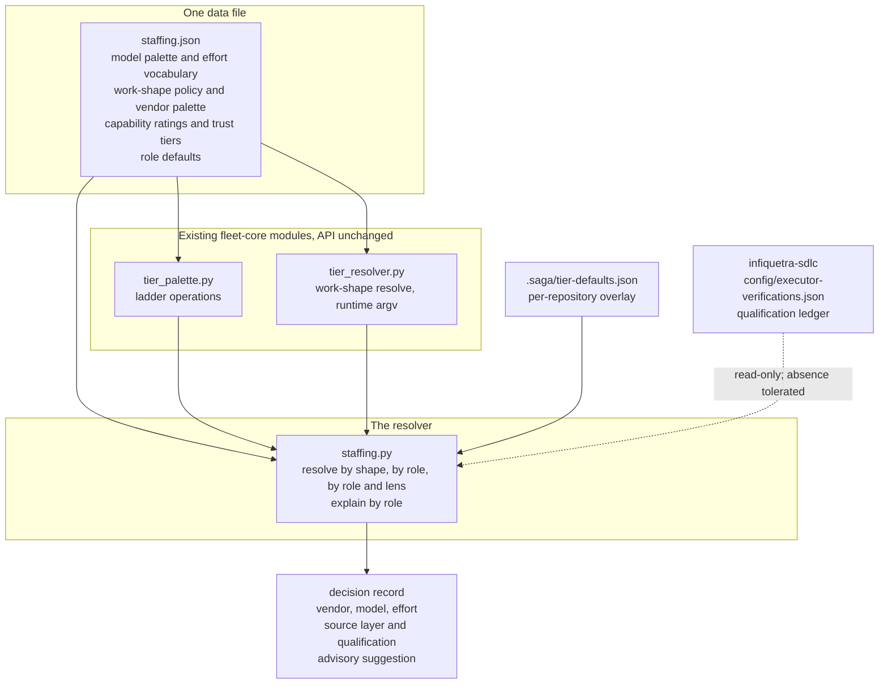

# One staffing component in fleet-core for subagents, workflow units, and herdr roles

## Summary

Merge the four places that today answer "which model, which effort, which vendor for this piece of
work" into one data file and one resolver inside the `fleet-core` plugin, so that a Claude Code
session, a herdr role session, and a workflow unit all read the same defaults instead of
re-deriving them.

The four places are the work-shape tier policy and model palette in `fleet-core`, the
per-repository tier overlay in `saga`, the per-model capability ratings and trust tiers in saga's
external-engine registry, and the software-development-lifecycle repository's ledger of which
executor has been qualified against which review lens.

---

## Problem Frame

Choosing the model for a subagent, the tier for a workflow unit, and the vendor and model for a
herdr role session are one decision, and its inputs are scattered across four files in two
repositories. A session that needs an answer today has to read all four and reconcile them by hand,
which means every session re-derives the same policy and any two sessions can disagree.

The operator's global instruction file already states the rule in prose: classify every launch by
work shape, pick the least costly setting that reliably completes, send judgment work to Opus, and
respect the concurrency cap. This card makes that prose executable. It does not change the rule and
it does not change the instruction files.

The decision was taken on 2026-09-19 and is recorded as recommendation R29 in
`docs/analysis/2026-09-19-saga-simplification-review.md` section 6G. Two sibling cards bound this
one: issue #1030 removes the `/tier` and `/engines` commands and their families, and issue #1033
adds an advisory typed-judgment tier suggestion that this component accepts as an input.

---

## Requirements

**The single data file**

R1. `plugins/fleet-core/scripts/fleet_commons/staffing.json` is the one authoring source for the
model palette, the effort vocabulary, the work-shape tier policy, the per-vendor palette, the
capability ratings, the trust tiers, and the per-role staffing defaults.

R2. `plugins/fleet-core/scripts/fleet_commons/models.json` and
`plugins/fleet-core/scripts/fleet_commons/tier_policy.json` are deleted, and their content lives in
`staffing.json` with the same field names and the same load-bearing ordering semantics (model
`rank` 0 is the strongest model, effort `rung` 0 is the weakest effort).

R3. The public Python surface of `fleet_commons.tier_palette` and `fleet_commons.tier_resolver` is
unchanged — the same module-level names (`MODELS`, `EFFORTS`, `SCALAR_EFFORTS`, `CHEAP_MODELS`,
`ENGINE_INTENTS`) and the same function signatures (`resolve`, `resolve_for_runtime`,
`adapt_runtime_argv`, `load_policy`, `collapse_effort_for_runtime`, `cheaper_fallback`, the ladder
operations) — so that the files in this repository that reference the tier vocabulary do not move in
this card. The scale, measured at commit `2044c363` with
`grep -rln "tier_resolver\|tier_palette\|tier_policy\|tier_defaults" plugins/ tests/ scripts/`: 61
files, of which 19 are test modules. The number is context for the size of the blast radius, not a
figure any unit is checked against.

**The resolver**

R4. `plugins/fleet-core/scripts/fleet_commons/staffing.py` answers three questions and nothing
else: by work shape, by role, and by role together with a review lens. It returns a decision record
and prints it; it dispatches nothing and launches nothing.

R5. The command `resolve --shape <work-shape>` returns the tier for that work shape. The eight work
shapes in today's policy keep their names and their tiers: `judgment` resolves to `opus` at `high`
effort and `read-only-survey` resolves to `sonnet` at `low` effort.

R6. The per-repository overlay at `.saga/tier-defaults.json` wins over the shared policy
default for the work shapes it names, and the resolver reports which layer supplied the answer.

R7. The command `resolve --role <role>` returns a vendor, a model, and an effort. The command
`resolve --role lens-reviewer --lens <lens>` additionally returns the qualification status read
from the software-development-lifecycle repository's executor-verification ledger.

R8. The command `explain --role <role>`, with an optional `--lens <lens>`, lists the candidate
executors in rating order with their ratings, so the operator can see why a candidate was chosen
rather than only what was chosen. The optional lens is required because the card's own verification
block runs `explain --role lens-reviewer --lens correctness`; without it that command is an
unrecognised-argument error.

**The vendor palette**

R9. Every vendor in the agent-launcher plugin's code-level kind list has a palette entry naming its
models, the efforts it accepts, how a requested effort collapses onto an accepted one, whether the
effort is applied on the command line or by an in-session command, and whether the resolver treats
it as a supported runtime. `opencode` is the one entry whose supported-runtime flag is false, for
the reason KTD11 records.

R10. The per-vendor effort-collapse table and the per-vendor model translation currently written as
Python literals in `tier_resolver.py` move into `staffing.json`, so the data file is the only place
that names a vendor's models.

**Ratings, trust tiers, and lens qualification**

R11. The capability ratings per model family and per engine variant, and the trust tier per engine
variant, are copied from `plugins/saga/references/engine-registry.yaml` into `staffing.json` with
their three-value rating vocabulary (`STRONG`, `MODERATE`, `WEAK`) preserved.

R12. A review lens with no qualified executor in the ledger resolves to the lens catalogue's
documented-policy outcome — the lens reports findings without establishing a threshold — rather
than to a scoring executor.

R13. An absent software-development-lifecycle checkout produces the same documented-policy outcome
as an empty ledger, with the reason stated in the decision record. It never raises, because a
missing sibling repository must not break every subagent spawn.

**Failing loud**

R14. A model outside the palette, an effort a model does not support, an unknown work shape, an
unknown role, and an unknown vendor each raise a named error with the offending value in the
message. None of them silently degrades to a default.

**The advisory input**

R15. The resolver accepts an optional advisory tier suggestion as a parameter and records it beside
the answer it chose, whether or not the two agree. It never calls a suggestion service itself.

**Documentation and release**

R16. `plugins/fleet-core/references/staffing.md` is the one reference document for this knowledge
and supersedes `tier-palette.md` and `effort-convention.md`. Every live pointer at those two
documents — including the path constant in `plugins/saga/scripts/plan_save_contract.py` and the
generated block it renders into the plan skill — names `staffing.md` instead, and no test that
guards a path at those documents is left asserting a file that no longer exists.

R17. `tests/test_tier_vocab_single_source.py` points its single-source assertions at
`staffing.json`, and its repository-wide guard against a second copy of the model vocabulary still
passes.

R18. The four release surfaces are updated in the same pull request:
`plugins/fleet-core/.claude-plugin/plugin.json`, `.claude-plugin/marketplace.json`,
`plugins/fleet-core/CHANGELOG.md`, and any version-drift guard test.

### Acceptance criteria trace

The card carries four acceptance criteria. Each maps to a requirement, the unit that delivers it,
and the test scenario that proves it, so a reviewer and an implementer reach the same verdict from
the card's text alone.

| Card acceptance criterion | Requirement | Unit | Proving scenario |
|---|---|---|---|
| `staffing.py resolve --shape judgment` prints `opus/high`, `--shape read-only-survey` prints `sonnet/low` | R5 | U2 | U2 first happy-path scenario |
| `staffing.py resolve --role lens-reviewer --lens security` prints a vendor, model, effort, and the ledger's qualification status | R7, R12, R13 | U5 | U5 first and second happy-path scenarios |
| `staffing.py explain --role functional-tester` lists candidates in rating order with their ratings | R8, KTD10 | U4 | U4 first happy-path scenario |
| `pytest tests/test_staffing.py tests/test_tier_vocab_single_source.py` passes | R17 and every unit's scenarios | U1 through U6 | the whole test file, plus U1's integration scenario |

The card's Verification block runs one command the acceptance criteria do not: `explain --role
lens-reviewer --lens correctness`. R8 carries the optional `--lens` for exactly that reason, and U4
proves it with a named scenario.

### Prerequisites and downstream work

No card blocks this one. Recommendation R29 in the review document states that the staffing
component "depends on nothing", and every input it merges already exists on disk.

Three cards consume it once it lands: the admission questionnaire in issue #1023 reads it for the
per-role staffing answers, the roles library in issue #1022 reads it for per-role defaults, and the
roster helper in issue #1024 reads it when it creates herdr panes. Two cards follow it: issue #1030
deletes `engine-registry.yaml` and the `/tier` and `/engines` commands whose knowledge lands here,
and issue #1033 supplies the advisory tier suggestion this component accepts as a parameter.

### A note on size

The plan names about twenty-seven distinct files across two plugins and mixes one
data-consolidation refactor (U1) with four units of new behavior. That is larger than a typical single pull request, and it is
deliberate: the card's central requirement is *one* data file, so the consolidation and the
resolver that reads it cannot land in separate releases without leaving two sources alive in
between.

If the pull request needs splitting anyway, U1 is the clean cut — it is independently landable,
changes no behavior, and leaves the test suite green on its own. Two caveats come with that cut.
Splitting will trigger this repository's diff-aware release-surface guard, which demands a second
version bump when one release spans two stacked pull requests. And U1 alone leaves
`plugins/fleet-core/references/tier-palette.md` describing a file U1 deleted: its body names
`models.json` at `:4`, `:24`, `:35`, `:44` and `:49`, and `test_onboarding_guard` keeps passing only
because it asserts that literal string is present — the guard passes *because* the document is
stale. A split at U1 must therefore carry the `tier-palette.md` body edit with it, even though the
file is not deleted until U6.

---

## Key Technical Decisions

**KTD1 — One data file, achieved by repointing the path constants rather than by rewriting
consumers.** `staffing.json` absorbs `models.json` and `tier_policy.json` literally, as the card
asks. This is affordable because the readers by path are few and enumerated, not because they are
absent. There are two production modules holding three path constants — `tier_palette.py:26`, and
`tier_resolver.py:57` and `:72` — and four test modules: `tests/test_tier_vocab_single_source.py:22` reads `models.json`,
`tests/test_tier_resolver.py` reads `tier_policy.json` at `:19`, `:41`, `:47` and `:506`,
`tests/test_work_build_unit_tier.py:32` parses `tier_policy.json`, and
`tests/test_fleet_core_execution_classes.py:54` parses `models.json`. `render_tier_table.py` reads
neither by path — it calls `load_policy()` — but its generated-marker text names `tier_policy.json`
in a string literal, so it changes too. Everything else that touches the tier vocabulary imports
the derived Python names. *Rejected:* leaving three data files side by side, which fails the card's
central requirement; and rewriting every file that references the vocabulary, which is out of
proportion to this card and overlaps the removals issue #1030 owns.

**KTD2 — `staffing.py` composes `tier_palette` and `tier_resolver`; it does not replace them.**
The new resolver is the one place that answers a staffing question, and it answers it by calling
the existing ladder and policy functions rather than reimplementing them. *Rejected:* folding
`tier_resolver.py` into `staffing.py`, which would move runtime command-line adaptation, the
execution classes and the effort-collapse table in the same change as the new role and lens
behavior, and whose consumers issue #1030 has not yet removed.

**KTD3 — The role table holds staffing defaults keyed by role name; the role vocabulary itself
belongs to the software-development-lifecycle repository.** Issue #1022 defines the roles library.
This card ships the two roles its acceptance criteria name (`lens-reviewer` and
`functional-tester`) plus the roles the run chain already uses, and an unknown role name fails
loud rather than falling back to a work shape. *Rejected:* inventing a role taxonomy here, which
would guarantee a second authority to reconcile when #1022 lands.

**KTD4 — The executor-verification ledger is read from the sibling repository through the
environment-variable ladder mission-control already uses, and its absence is a documented-policy
outcome rather than an error.** The resolution order is the `INFIQUETRA_SDLC_PATH` environment
variable, then the default checkout at `~/workspace/infiquetra/infiquetra-sdlc`, then absent. This
mirrors `plugins/mission-control/scripts/sdlc_manager.py:135`. The ledger's `entries` array is
empty on purpose today, and its own note says so, therefore raising on an unqualified lens would
make every lens resolution fail on day one. *Rejected:* vendoring a copy of the ledger into this
repository — it is a live record of qualification runs, and a stale copy would grant qualification
that was never performed; and fetching it over the network on each resolution — this is a code
path every spawn reads.

**KTD5 — The authoritative vendor kind list is the agent-launcher plugin's code-level
`VENDOR_FLAGS` table, which names seven vendors; the eighth documented kind, `hermes`, is excluded
with a recorded reason.** `VENDOR_FLAGS` in
`plugins/agent-launcher/skills/agent-launcher/scripts/launcher.py:192` names `claude`, `codex`,
`grok`, `muse`, `agy`, `qwen`, and `opencode`, and the launcher already cross-checks that table
against the composer's glyph table at import time. `hermes` appears only in the skill's prose,
where the topology table describes it as reconciling a profile workspace and owning its own
routing — so it has no model and effort for this component to choose. The exclusion is pinned by a
test so it cannot rot into an oversight. *Rejected:* taking the eight names from the skill's
frontmatter description, which would require inventing a palette entry for a kind that does not
take one.

**KTD6 — Ratings are copied into `staffing.json` while `engine-registry.yaml` stays on disk, and a
test pins the two against each other until #1030 deletes the YAML.** Thirteen scripts under `plugins/saga/scripts/`
read the YAML, and twenty-two files across the plugin name it; removing them is the removals card's
scope.
*Rejected:* deleting the YAML in this card, which would break those consumers; and reading the
YAML at resolution time, which keeps two sources alive permanently and pulls a YAML parser into a
hot path.

**KTD7 — Per-vendor effort collapse and model translation move from Python literals into the data
file.** The `_EFFORT_COLLAPSE` table and the `_translate_model` function in `tier_resolver.py` are
exactly the second source of vendor vocabulary that `tests/test_tier_vocab_single_source.py`
exists to prevent, and the card asks for a palette covering every vendor. The Python functions
stay as the reading interface; only the literals move. *Rejected:* leaving them in code, which
means a new vendor is a code change in two files rather than a data row.

**KTD8 — The resolver returns a decision record and prints it; persisting it belongs to the run
record.** The card's non-goals forbid dispatch, bridge, calibration, and promotion machinery, and
say the component "answers a question and logs the answer". The record carries the inputs, the
chosen vendor, model and effort, the layer that supplied the answer, the qualification status where
a lens was named, and any advisory suggestion. Writing it into a durable run record is issue
#1023's scope. *Rejected:* a log file owned by this component, which would be a second evidence
store beside the run record.

**KTD9 — The advisory typed-judgment suggestion is a parameter, never a call.** Issue #1033 owns
the suggestion. Passing it in keeps this component free of a network dependency and keeps the
suggestion advisory by construction: the resolver cannot be made to prefer it. *Rejected:*
importing the TypeSafe client here, which would make every staffing question depend on an external
service.

**KTD10 — The seven roles this card ships, and the capability each one needs.** The registry rates
ten capabilities, and none of them is called "testing", so a role table has to say which rated
capability each role draws on or `explain` has nothing to order. The mapping is: `planner` and
`plan-reviewer` need `long-form-writing`; `worker` needs `code-generation`; `lens-reviewer` needs
`adversarial-review`; `functional-tester` needs `debug`, because functional testing against a real
environment is iterative, tool-driven diagnosis, which is what the registry's `debug` rating
measures; `release-worker` and `merging-worker` need `code-generation`. These are the roles the run
chain in `docs/analysis/2026-09-19-saga-simplification-review.md` section 5 names. *Rejected:*
inventing a `testing` capability and rating engines against it, which would fabricate ratings no
benchmark or practitioner evidence supports; and leaving `functional-tester` unmapped, which would
make the card's third acceptance criterion print an empty list.

**KTD11 — `opencode` gets a palette entry but does not join the resolver's supported-runtime
list.** The card requires a palette entry for every vendor the launcher can start, and
`VENDOR_FLAGS` names seven. `tier_resolver.py` knows six: `SUPPORTED_RUNTIMES` at `:73`,
`_RUNTIME_MODELS` at `:87`, and `_RUNTIME_ACCEPTED_EFFORTS` at `:122` all stop at `claude`,
`codex`, `grok`, `muse`, `qwen`, and `agy`, and `_translate_model`, `collapse_effort_for_runtime` and
`adapt_runtime_argv` raise or have no branch for anything else. So `opencode`'s row in
`staffing.json` carries `runtime_supported: false` with the reason recorded in the row: nobody has
verified its launch-time effort and model arguments, and the launcher's own note says its model
identifier must be in `provider/model` form, which no other vendor requires.
`SUPPORTED_RUNTIMES` is derived from the rows whose `runtime_supported` is true, so
`adapt_runtime_argv` behaves exactly as it does today and U3's before-and-after comparison has a
before for every vendor it covers. *Rejected:* adding `opencode` to the supported runtimes with an
invented argument shape, which would ship an untested launch path on the hot staffing seam;
and omitting `opencode` from the palette entirely, which fails the card's acceptance criterion that
every launcher vendor has an entry.

---

## High-Level Technical Design

The precedence for a work-shape answer is the repository overlay first, then the shared
policy in `staffing.json`. The precedence for a role answer is the role's own entry in
`staffing.json`, which names a work shape and may pin a vendor; where it names only a work shape,
the work-shape precedence above applies. A lens answer starts from the role answer and then
consults the ledger, which can only downgrade a scoring executor to the documented-policy outcome —
it never promotes.

---

## Implementation Units

### U1. The merged data file and the repointed loaders

Move the model palette and the work-shape policy into one file and make the existing loaders read
it, with no change to what any importer sees.

**Goal:** `staffing.json` exists and is the only data file the tier vocabulary comes from.

**Requirements:** R1, R2, R3, R17.

**Dependencies:** none.

**Files:** create `plugins/fleet-core/scripts/fleet_commons/staffing.json`; modify
`plugins/fleet-core/scripts/fleet_commons/tier_palette.py`,
`plugins/fleet-core/scripts/fleet_commons/tier_resolver.py`,
`plugins/fleet-core/scripts/fleet_commons/render_tier_table.py`; delete
`plugins/fleet-core/scripts/fleet_commons/models.json` and
`plugins/fleet-core/scripts/fleet_commons/tier_policy.json`; regenerate the tier-table block in
`plugins/saga/skills/plan/SKILL.md`; modify `tests/test_tier_vocab_single_source.py`,
`tests/test_tier_resolver.py`, `tests/test_work_build_unit_tier.py`, and
`tests/test_fleet_core_execution_classes.py`.

**Approach:** `staffing.json` keeps `schema_version`, `models`, `efforts`, `scalar_efforts`,
`execution_classes`, and `root_orchestration_profiles` under the same names they have in
`models.json`, and adds the eight work shapes from `tier_policy.json` under a new `work_shapes`
key. `MODELS_REGISTRY_PATH`, `TIER_POLICY_PATH`, and `MODELS_JSON_PATH` all point at the new file;
`load_policy` reads the `work_shapes` key rather than the whole document. No caller anywhere in the
repository passes `load_policy`'s optional `path` argument, so narrowing what it reads breaks
nothing. The explanatory `_comment` that `models.json` carries is carried forward and extended,
because it is the thing that tells a future editor which keys are load-bearing.

The generated tier table in the plan skill needs care. `render_tier_table.TIER_TABLE_BEGIN` at
`render_tier_table.py:30` is a string literal that names `tier_policy.json`, and that literal is
embedded verbatim in `plugins/saga/skills/plan/SKILL.md:478`. The table *body* stays correct on its
own, because `render_rows` reads whatever `load_policy()` returns and the eight work shapes come
across unchanged — but the *marker* goes stale the moment `tier_policy.json` stops existing. The
marker text changes to name `staffing.json` and the block is regenerated by the renderer, never
hand-edited, or three tests red:
`tests/test_tier_resolver.py::test_skill_md_has_generated_tier_table_markers`,
`tests/test_tier_resolver.py::test_skill_registry_sync`, and
`tests/test_tier_vocab_single_source.py::test_plan_table_render_synced`.

**Patterns to follow:** the derive-from-explicit-index pattern in
`plugins/fleet-core/scripts/fleet_commons/tier_palette.py` (`_derive_ordered`), which refuses
duplicate and gapped indices rather than inferring order from file position.

**Test scenarios:**

- Happy path: importing `fleet_commons.tier_palette` yields `MODELS == ("fable", "opus", "sonnet",
  "haiku")` and `EFFORTS == ("low", "medium", "high", "xhigh")`, read from `staffing.json`.
- Happy path: `tier_resolver.load_policy()` returns the eight work shapes with the tiers they have
  today, so `judgment` is `opus`/`high` and `read-only-survey` is `sonnet`/`low`.
- Edge case: a `staffing.json` whose model ranks are duplicated, gapped, or missing an
  `effort_ceiling` raises `TierPaletteError` naming the offending row — the three existing
  rejection tests keep passing against the new path.
- Error path: `staffing.json` absent or unparseable raises at import with the file named, rather
  than falling back to built-in defaults.
- Integration: the repository-wide guard `test_no_bare_model_literals_outside_module` still finds
  no second copy of the vocabulary, and `test_plan_table_render_synced` still matches the generated
  tier table in the plan skill against the work-shape data.
- Integration: the four test modules that read the two deleted files by path — the single-source
  test, the resolver test, the build-unit-tier test, and the execution-classes test — all read
  `staffing.json` and assert the same things they assert today.
- Integration: the two marker tests in `tests/test_tier_resolver.py` pass against the regenerated
  block in the plan skill.

**Verification:** every test that read the two deleted files now reads `staffing.json` and asserts
what it asserted before, and `models.json` and `tier_policy.json` no longer exist. The baseline to
hold is
measured, not assumed: `tests/test_tier_vocab_single_source.py`, `tests/test_tier_defaults.py`, and
`tests/test_tier_resolver.py` together pass 76 tests at commit `2044c363`, and that count must not
fall.

### U2. The resolver core: work shape, repository overlay, and failing loud

Add the resolver and its first question, so a session can ask for a work shape's tier from one
place.

**Goal:** `resolve --shape judgment` prints `opus/high`, honouring the per-repository overlay.

**Requirements:** R4, R5, R6, R14, R15.

**Dependencies:** U1.

**Files:** create `plugins/fleet-core/scripts/fleet_commons/staffing.py`; create
`tests/test_staffing.py`.

**Approach:** a `resolve_shape(work_shape, root=None, suggestion=None)` function returning a frozen
decision record with the vendor (`claude` by default), the model, the effort, the source layer
(`overlay` or `policy`), and the advisory suggestion when one was passed. The overlay reader reads
`.saga/tier-defaults.json` relative to the repository root, validating each entry against the
palette exactly as `plugins/saga/scripts/tier_defaults.py:48` does today. The command-line interface
uses `argparse` with `resolve` and `explain` subcommands, matching the shape of
`tier_resolver.py`'s own `build_parser`.

Its default output is the short human form the card's acceptance criteria name — `opus/high` for a
work shape, and a vendor, model, effort and qualification line for a role — because the card
asserts that exact text. A `--json` flag prints the whole decision record for a caller that needs
the source layer and the advisory suggestion. The short form is therefore a projection of the
record, never a second answer computed separately.

**Patterns to follow:** `plugins/saga/scripts/tier_defaults.py` for the overlay validation and its
`TierDefaultsError`; `plugins/fleet-core/scripts/fleet_commons/tier_resolver.py` for the command-line shape — its
`build_parser` for the parser and `_cli_resolve` at `:430` for a subcommand handler.

**Test scenarios:**

- Happy path: `resolve --shape judgment` prints exactly `opus/high` and `resolve --shape
  read-only-survey` prints exactly `sonnet/low`, matching the card's first acceptance criterion
  character for character.
- Happy path: the same two commands with `--json` carry model, effort, and source layer `policy`,
  and the short form is the same pair the record holds.
- Happy path: with a `.saga/tier-defaults.json` pinning `mechanical` to `haiku`/`low`, resolving
  `mechanical` returns `haiku`/`low` with source `overlay`, while `judgment` still returns the
  policy default.
- Edge case: an overlay file that is absent resolves cleanly from the policy; an overlay naming a
  work shape the policy does not know raises with that shape name in the message.
- Error path: an overlay naming a model outside the palette, or an effort above the model's
  ceiling, raises a named error carrying the offending pair; a malformed overlay raises rather than
  being ignored.
- Error path: `resolve --shape not-a-shape` exits non-zero with the unknown shape named.
- Happy path: an advisory suggestion passed in appears in the decision record beside the chosen
  tier, both when it agrees with the chosen tier and when it differs, and never changes the choice.

### U3. The vendor palette as data

Move the per-vendor model and effort knowledge out of Python literals and cover every launchable
vendor.

**Goal:** every vendor in the agent-launcher kind list has a palette entry, and the effort-collapse
table lives in the data file.

**Requirements:** R9, R10, R14, and the supported-runtime flag from KTD11.

**Dependencies:** U1, U2.

**Files:** modify `plugins/fleet-core/scripts/fleet_commons/staffing.json`,
`plugins/fleet-core/scripts/fleet_commons/tier_resolver.py`,
`plugins/fleet-core/scripts/fleet_commons/staffing.py`; modify `tests/test_staffing.py`,
`tests/test_tier_resolver.py`.

**Approach:** a `vendors` object in `staffing.json`, one entry per vendor, each carrying its
models, the efforts it accepts, a collapse map from a requested effort to an accepted one, and the
effort-application mode (`argv` or `in_session` with the command to send), and a
`runtime_supported` flag. `SUPPORTED_RUNTIMES`, `_RUNTIME_MODELS`, `_RUNTIME_ACCEPTED_EFFORTS` and
`_EFFORT_COLLAPSE` in `tier_resolver.py` derive from that object instead of their module-level
literals.

Behavior is unchanged for the six vendors the resolver supports today: `grok` and `muse` collapse
`max` to `xhigh`, `agy` collapses both `max` and `xhigh` to `high`, `qwen` applies effort by the
in-session `/effort` command, and `claude`, `codex`, and `qwen` pass `max` through. The seventh
vendor, `opencode`, gets a palette row with `runtime_supported: false` per KTD11, and
`SUPPORTED_RUNTIMES` derives only from the rows whose flag is true — so the resolver still knows six
runtimes and nothing about its launch behavior changes.

**Patterns to follow:** the decision record already in the journal under the heading about the
per-vendor collapse table being explicit rather than a silent clamp — the collapse must stay a
declared table, and `strongest-supported` must stay that vendor's last accepted rung.

**Test scenarios:**

- Happy path: the palette's vendor keys equal `VENDOR_FLAGS` exactly — a set comparison, so adding
  a kind to the launcher reds this test rather than passing silently. Every entry names at least one
  model, and every entry whose `runtime_supported` is true also names at least one accepted effort.
  The effort half is deliberately scoped to the supported rows, because KTD11 refuses to invent an
  accepted-effort list for `opencode`.
- Happy path: `collapse_effort_for_runtime` returns the same value for every vendor and effort pair
  as it does before the move — a table-driven comparison against the values recorded in the
  existing resolver tests.
- Edge case: `hermes` has no palette entry, and the data file records why. The forcing function is
  the set comparison above, not an assertion of absence — an assertion that `hermes` is missing
  would keep passing after `hermes` was added.
- Edge case: `opencode` has a palette entry, its `runtime_supported` flag is false, and it is absent
  from `SUPPORTED_RUNTIMES`; `collapse_effort_for_runtime("opencode", …)` still raises exactly as it
  does today. The test names the flag, so promoting `opencode` later is a deliberate edit rather
  than a silent drift.
- Error path: a vendor name absent from the palette raises with the name in the message;
  requesting an effort a vendor does not accept and cannot collapse raises rather than clamping.
- Integration: `adapt_runtime_argv` produces the same argument list for each of the six supported
  vendors as it does before the data move.

### U4. Capability ratings, trust tiers, and the explain view

Bring the per-model and per-engine ratings across so the resolver can say why a candidate was
chosen.

**Goal:** `explain --role functional-tester` lists candidates in rating order with their ratings.

**Requirements:** R8, R11, R14, and the role-to-capability mapping in KTD10.

**Dependencies:** U1, U2, U3.

**Files:** modify `plugins/fleet-core/scripts/fleet_commons/staffing.json`,
`plugins/fleet-core/scripts/fleet_commons/staffing.py`; modify `tests/test_staffing.py`; create
the ratings-parity assertion in `tests/test_staffing.py` reading
`plugins/saga/references/engine-registry.yaml`.

**Approach:** `staffing.json` gains a `capability_ratings` object carrying the four model families
and the thirteen engine variants with their `capability_profile` maps and `trust_tier`, and a
`roles` object mapping each role to a work shape, the capability it needs, and an optional pinned
vendor. The seven roles and their capabilities are fixed by KTD10: `planner` and `plan-reviewer` on
`long-form-writing`, `worker`, `release-worker` and `merging-worker` on `code-generation`,
`lens-reviewer` on `adversarial-review`, and `functional-tester` on `debug`.

`explain` orders candidates by rating first (`STRONG` above `MODERATE` above `WEAK`) and breaks
ties on the cheaper cost-and-speed rank, which is the tie-break rule the registry's own header
states. A parity test reads the YAML while it still exists and asserts every migrated
rating matches.

**Patterns to follow:** the registry header in `plugins/saga/references/engine-registry.yaml:12`
for the tie-break rule, and its `last_validated` field, which is carried across so staleness stays
visible.

**Test scenarios:**

- Happy path: `explain --role functional-tester` resolves through the `debug` capability and lists
  at least two candidates, strongest rating first, each line carrying the rating and the trust
  tier.
- Happy path: each of the seven roles named in KTD10 resolves to a capability the registry rates,
  so none of them produces an empty candidate list.
- Happy path: two candidates with an equal rating are ordered by the cheaper cost-and-speed rank.
- Edge case: a role whose capability no engine rates at all produces an empty candidate list with
  a stated reason, not an exception.
- Happy path: `explain --role lens-reviewer --lens correctness`, the command in the card's own
  verification block, runs and lists candidates for the `adversarial-review` capability; the lens
  narrows the listing rather than being rejected as an unrecognised argument.
- Error path: `explain --role not-a-role` exits non-zero naming the unknown role; `explain --role
  worker --lens security` exits non-zero saying a lens applies only to a reviewing role.
- Integration: every rating in `staffing.json` equals the rating for the same model family or
  engine variant and capability in `engine-registry.yaml`, so the copy cannot drift while both
  files exist.

### U5. Lens staffing and the qualification ledger

Answer the review-lens question, and make an unqualified or unreachable ledger a documented-policy
outcome rather than a failure.

**Goal:** `resolve --role lens-reviewer --lens security` prints a vendor, model, effort, and the
qualification status.

**Requirements:** R7, R12, R13.

**Dependencies:** U1, U2, U4.

**Files:** modify `plugins/fleet-core/scripts/fleet_commons/staffing.py`; modify
`tests/test_staffing.py`.

**Approach:** a ledger reader resolving the software-development-lifecycle checkout through
`INFIQUETRA_SDLC_PATH`, then `~/workspace/infiquetra/infiquetra-sdlc`, then reporting absence. A
lens resolution returns the role's vendor, model, and effort together with a qualification field
that is `qualified` only when an entry matches the lens, that exact vendor, model, and effort, and
the current lens-catalogue version with all fixtures passed. Every other case — no entry, a partial
fixture pass, a stale catalogue version, an unreadable ledger, an absent checkout — returns
`documented-policy` with the reason named. The four always-on lenses are scorable in the catalogue
and the eleven conditional ones are not, so a lens the catalogue marks unscorable returns
`documented-policy` without consulting the ledger at all.

**Patterns to follow:** `plugins/mission-control/scripts/sdlc_manager.py:135` for the checkout
resolution ladder.

**Test scenarios:**

- Happy path: with a ledger fixture carrying a full-fixture entry for the `security` lens at the
  resolved vendor, model, effort, and current catalogue version, the record reads `qualified`.
- Happy path: against the real ledger, whose `entries` array is empty, every lens reads
  `documented-policy` and the reason names the empty ledger.
- Edge case: an entry whose `fixtures_passed` is below `fixtures_total` reads `documented-policy`,
  never rounded up.
- Edge case: an entry recorded against an older `catalogue_version` reads `documented-policy`, not
  carried forward.
- Edge case: a lens the catalogue marks `scorable: false` reads `documented-policy` and the ledger
  is not read.
- Error path: `INFIQUETRA_SDLC_PATH` pointing at a directory with no ledger, and an unparseable
  ledger file, both read `documented-policy` with the path and the reason named, and neither
  raises.
- Error path: `resolve --role lens-reviewer` with no `--lens` exits non-zero asking for the lens.

### U6. The saga shim, the reference document, and the release surfaces

Leave one implementation behind by making saga's overlay module delegate, and ship the plugin
metadata in the same change.

**Goal:** `plugins/saga/scripts/tier_defaults.py` keeps its public functions but holds no second
copy of the logic, and `fleet-core` releases with a reference document that supersedes the two it
replaces.

**Requirements:** R6, R16, R18.

**Dependencies:** U1, U2, U3, U4, U5.

**Files:** modify `plugins/saga/scripts/tier_defaults.py`; create
`plugins/fleet-core/references/staffing.md`; delete
`plugins/fleet-core/references/tier-palette.md` and
`plugins/fleet-core/references/effort-convention.md`; repoint the four live pointers at those two
documents — `plugins/saga/scripts/plan_save_contract.py` (its `EFFORT_REFERENCE` constant),
`plugins/saga/scripts/plan_save_proof.py`, `plugins/fleet-core/scripts/fleet_commons/tier_palette.py`
(its module docstring), and `plugins/fleet-core/scripts/fleet_commons/cost_weights.json` (its
`_comment`); re-render the generated effort-honoring block in `plugins/saga/skills/plan/SKILL.md`;
modify `plugins/fleet-core/.claude-plugin/plugin.json`, `.claude-plugin/marketplace.json`,
`plugins/fleet-core/CHANGELOG.md`, `plugins/fleet-core/README.md` (its module tree lists
`tier_palette.py` and must list `staffing.py`), `docs/engineering-journal/DECISIONS.md`; modify
`tests/test_tier_defaults.py`, `tests/test_tier_vocab_single_source.py`,
`tests/test_saga_spec_consumer_row.py`.

**Approach:** the five public functions of `tier_defaults.py` (`load_tier_defaults`,
`resolve_tier_with_overlay`, `resolve_tier_for_plan`, `parse_tier_band`, `write_tier_default`) and
`TierDefaultsError` remain importable and keep their signatures, each delegating to `staffing.py`
through the fleet-commons shim that saga already uses. The issue-band parsing stays in saga,
because it parses a GitHub issue body and that is saga's concern, not fleet-core's. `staffing.md`
carries the sections the two superseded documents carried — how to add a model, how to add an
effort, the execution classes, the effort vocabulary and its three-layer cascade, and the honoring
seam — plus the new role, lens and vendor sections, and it keeps the `{#tier-vocab-ordering}`
anchor the onboarding guard test looks for.

Deleting `effort-convention.md` is not a documentation change — it trips a live runtime gate, and
this is the single most likely way to break the plugin while following this plan.
`plugins/saga/scripts/plan_save_contract.py:36` holds the path in an `EFFORT_REFERENCE` constant,
and `:217` checks that the file exists and calls `fail("reference", …)` when it does not, so every
`plan_save_contract.load()` raises the moment the file is gone. `tests/test_saga_spec_consumer_row.py:72`
copies that same path into its fixture tree, so that whole suite dies on a missing source. The
constant is repointed at `plugins/fleet-core/references/staffing.md` in the same change as the
deletion, never after it.

Two further pointers ride on that constant. `plugins/saga/scripts/plan_save_proof.py:314` emits it
into operator prose, and it is rendered into a generated block in the plan skill at
`plugins/saga/skills/plan/SKILL.md:550`, which
`tests/test_saga_spec_consumer_row.py::test_plan_docs_generated_regions_match_contract` fails on
when the rendered block and the contract disagree. The block is re-rendered by the renderer; the
generated region is never edited by hand.

The onboarding guard asserts more than one thing about the reference document, and all of them move.
`tests/test_tier_vocab_single_source.py:350` holds the path in `TIER_PALETTE_RUNBOOK`, and
`test_onboarding_guard` at `:399` asserts the file exists and that its text contains `.index(`,
`{#tier-vocab-ordering}`, and the literal string `models.json` — the last of which names a file R2
deletes. So `staffing.md` carries the `.index(` guidance and the `{#tier-vocab-ordering}` anchor
forward, the constant is repointed, and the `models.json` assertion becomes `staffing.json`.

Three surviving comments also name the deleted documents and are repointed by hand:
`plugins/fleet-core/scripts/fleet_commons/tier_palette.py:18` in its module docstring,
`plugins/fleet-core/scripts/fleet_commons/cost_weights.json:2` in its `_comment`, and the `_comment`
that moves into `staffing.json` from `models.json`.

**Patterns to follow:** the fleet-commons import shim already used at the top of
`plugins/saga/scripts/tier_defaults.py`; the release-surface rule in the repository's own
`CLAUDE.md` step 6.

**Test scenarios:**

- Happy path: every existing assertion in `tests/test_tier_defaults.py` passes against the
  delegating shim without changing what it asserts about behavior.
- Happy path: `parse_tier_band` still parses a `### Recommended Tier Band` section and still
  ignores fenced code blocks.
- Edge case: `write_tier_default` still read-merge-writes, leaving other keys in
  `.saga/tier-defaults.json` untouched.
- Error path: a malformed overlay still raises `TierDefaultsError` from the saga entry point, so
  callers that catch it keep working.
- Integration: the onboarding guard test finds the `{#tier-vocab-ordering}` anchor in
  `staffing.md`, and no live file names `tier-palette.md` or `effort-convention.md`. "Live" is
  scoped, not repository-wide: `plugins/*/scripts/`, `plugins/*/skills/`, `plugins/*/references/`,
  and `tests/`. Changelogs, the engineering journal, `docs/plans/`, `docs/code-reviews/`,
  `docs/work-sessions/`, and `docs/sdlc-issue-drafts/` are historical records and keep their
  original wording — five such files name the two documents today and must not be rewritten.
- Integration: `test_plan_docs_generated_regions_match_contract` passes, which proves the
  regenerated effort-honoring block in the plan skill names `staffing.md` and matches the
  contract's constant.
- Error path: `plan_save_contract.load()` succeeds after the deletion, which is the direct proof
  that the existence gate at `plan_save_contract.py:217` was repointed rather than left dangling.
- Integration: `test_onboarding_guard` passes against `staffing.md`, asserting the file exists and
  carries `.index(`, `{#tier-vocab-ordering}`, and `staffing.json`.
- Integration: `tests/test_saga_spec_consumer_row.py` passes as a whole — its fixture tree copies
  the reference path, so a dangling constant reds the suite rather than one test.
- Integration: the plugin manifest version, the marketplace entry version, and the changelog's
  newest heading all name the same new `fleet-core` version.

---

## Risks & Dependencies

**A wrong default mis-tiers every launch.** This is the card's own stated risk and it is real,
because the component sits on a path every spawn reads. The mitigations are the single-source test
that forbids a second copy of the vocabulary, the fail-loud rule on an off-palette model or an
unsupported model-and-effort pair, and U1's requirement that the eight existing work-shape tiers
come across byte-identical, so the merge cannot quietly change a tier while it changes a file.

**The sibling repository is not there.** The executor-verification ledger lives in
`infiquetra-sdlc`, not in this repository. KTD4 makes absence a documented-policy outcome rather
than an error, and U5's test scenarios exercise the absent, unreadable, and empty cases explicitly.

**Two data sources live side by side until #1030.** The engine registry YAML stays on disk through
this card. The parity test in U4 is what stops the copy drifting; when #1030 deletes the YAML, that
test is deleted with it.

**A stacked pull request may need a second version bump.** This repository's release-surface guard
is diff-aware and has previously demanded a second version bump when one release was split across
two stacked pull requests. If this card's work lands stacked on the integration branch, expect
that and bump again rather than arguing with the guard.

**A reference document is load-bearing at runtime, not just in prose.** Deleting
`effort-convention.md` without repointing `plan_save_contract.py`'s `EFFORT_REFERENCE` constant
makes every `plan_save_contract.load()` raise, which takes the saga plan skill's save contract down
with it. U6 names the constant, the existence check, and the four files that ride on it, and its
error-path scenario is a direct `load()` call after the deletion.

**The plugin installs into two separate trees.** `~/.claude` and `~/.claude-company` hold separate
plugin registries and have diverged on six previous releases. Verifying the release means checking
both roots, not one.

---

## Divergences the review introduced

The plan is the decision record as it stood before execution; these are the places the shipped code
went past it, each forced by a review finding and recorded in the fleet-core changelog.

- **`resolve_shape` gained a fourth keyword, `vendor`.** U2 specified
  `resolve_shape(work_shape, root=None, suggestion=None)`. The architecture and testing lenses
  found that a role's vendor and its model came from unconnected places, so both entry points now
  render the tier for the named vendor and `resolve_shape` takes it.
- **A reviewing role requires its lens.** U5's error path asked for this on the command line; it is
  enforced in the function, with `explain` opting out because its subject is the candidate list.
- **`tier_resolver.canonical_work_shape` became public.** KTD2 said this module composes the
  resolver rather than replacing it; the alias mapper had to be shared rather than copied when a
  membership check in front of it silently lost three aliases.

---

## Open Questions

**Is the per-repository tier overlay meant to be committed, and if so, should this repository stop
ignoring it?** The card and the review document both call `.saga/tier-defaults.json` the
"committed" overlay, and this repository's own copy of the plan skill says in as many words that
"the file is **tracked** — commit the dirtied overlay with the run's changes"
(`plugins/saga/skills/plan/SKILL.md:539`). That is the repository's copy, not an installed tree —
this machine carries two divergent installed plugin roots, so checking an installed copy would
answer a different question. In this repository it is not:
`.gitignore:70` ignores `.saga/` outright, with a comment explaining that the blanket entry exists
so that a `git add -A` can never sweep saga runtime artifacts into a commit. So an overlay written
here today is local to one checkout and does not travel, and there is no overlay file in this
worktree at all — U2's overlay scenarios therefore build their own fixture rather than migrating
anything.

Nothing in this card depends on the answer — the resolver reads a path and does not care whether
git tracks it — so the work proceeds either way. But the discrepancy should not be papered over,
and narrowing a repository-wide ignore rule is a policy change this card has no mandate to make.
The implementer must not edit `.gitignore` as part of this work. If the overlay is meant to travel,
that is a separate decision and a separate change.

---

## Scope Boundaries

**Out of scope — true non-goals**

- Dispatch, bridge, calibration, and promotion machinery. The component answers a question and
  returns the answer; it launches nothing.
- Automatic promotion of an advisory suggestion into a choice. The typed-judgment input from issue
  #1033 is recorded beside the choice and never becomes it.
- Any change to the operator's global instruction files. They state the rule; this component is the
  rule's executable defaults.
- Removing the `/tier` and `/engines` commands, deleting `engine-registry.yaml`, and removing the
  saga scripts that consume it. That is issue #1030.
- Defining the role vocabulary. That is issue #1022.
- Building the TypeSafe client or the `jev` command-line tool. That is issue #1032.
- Persisting the decision record into a durable run record. That is issue #1023.

**Deferred to follow-up work**

- Deleting `plugins/saga/scripts/tier_defaults.py` outright once no caller imports it. The shim
  stays until #1030's removal sweep.
- Deleting the ratings-parity test together with `engine-registry.yaml`, in #1030.
- Filling the executor-verification ledger by running qualifications. That is an execution
  activity, and the ledger's own note says so.

---

## Questions answered from the card

The plan skill asks the operator several questions from known sets. The interactive question tool
was unavailable in this session, so each answer below was taken from the card, from
`docs/analysis/2026-09-19-improve-claude-plugins-objective-plan.md` section 7 subsection A3, or
from `docs/analysis/2026-09-19-saga-simplification-review.md` sections 5 and 6G, and every question
is recorded whether or not it changed anything.

**Resume an existing plan saga, or mint a new one?** Mint a new one. `saga.py scan` returned zero
candidates, so there is no prior plan thread for issue #1021 to resume.

**Is a plan document warranted at all?** Yes. The work spans six units across two plugins, deletes
two data files, and carries eleven load-bearing technical decisions. It fails every clause of the
skip test.

**What is the scope class — lightweight, standard, or deep?** Deep. The component is cross-cutting
by construction: 61 files in this repository reference the vocabulary it consolidates, it reads a
sibling repository, and the card rates the risk medium because every spawn reads the result.

**What is the destination — plan only, pull request, merge, or non-production deploy?** Pull
request. The structured pre-answer carrier from the run driver supplied `destination: pr`, and the
plan skill's own rule is that a valid carried destination is applied rather than re-asked. No
deploy-autonomy question follows, because that question is asked only for a non-production deploy
destination.

**Which execution backend — inline, team execution, or dynamic workflows?** Inline. The carrier
supplied `backend: inline`, and a carried backend is applied rather than re-offered.

The recommender disagreed and the divergence is recorded rather than hidden. Run with this work's
shape — twenty-seven files, six units, a second repository read, four release surfaces —
`lifecycle_state.recommend_execution_backend` returned `team-execution` on its size-and-risk
signal, with `inline` as the alternative. The dynamic-workflows backend was reported unavailable
from a live probe, not an assumption: a `ToolSearch` for the Workflow tool in this session found
nothing. Inline stands, for two reasons beyond the carrier: the work is six dependency-ordered
units in one repository with no gated consensus and no broad independent fan-out, and the
team-execution plugin is archived by issue #1030 in the same release train.

**Does a consensus verdict need to block a merge or persist as evidence, or are the votes
advisory?** Not applicable and therefore not asked. The backend was already settled as inline by
the carrier, and this card produces no consensus verdict.

**Which per-unit model and effort tiers, and does the operator confirm them?** Not asked. That
question belongs to the dynamic-workflows backend only, which requires explicit operator invocation
and was not invoked.

**Should `opencode` become a supported runtime in the resolver, or only a palette entry?** Only a
palette entry, with its supported-runtime flag false. Recorded as KTD11. Neither document settles
it, so the documented default was taken: preserve current behavior and record the gap rather than
invent a launch argument shape nobody has verified.

**Which vendor kind list is authoritative — the seven in code or the eight in the skill
description?** The seven in code. Recorded as KTD5 with the reason and pinned by a test. Neither
analysis document settles this, so the documented default was taken: prefer the executable list
over prose, and record the divergence rather than paper over it.

**Which rated capability does each role draw on?** Taken from the card's own acceptance criteria
and the registry's capability list, and recorded as KTD10. Neither analysis document maps roles to
capabilities, and the registry rates no capability called "testing", so the documented default was
taken: map each role to the closest rated capability rather than invent a new one, and say so in
the decision.

**What happens when the software-development-lifecycle checkout is missing?** Documented-policy
outcome, never an error. Recorded as KTD4. The review document's section 5 states that the
conditional lenses "report findings as documented policy until fixtures exist", and the ledger's
own note states that it is empty on purpose, so the unqualified path is the normal path today.

---

## Sources / Research

- The card body: issue #1021, and `docs/analysis/2026-09-19-improve-claude-plugins-objective-plan.md`
  section 7 subsection A3.
- `docs/analysis/2026-09-19-saga-simplification-review.md` section 5 (the target run shape), section
  6G recommendation R29 (this component), section 7 (what is removed and by which card), and
  section 9 (the operator's answered questions).
- `plugins/fleet-core/scripts/fleet_commons/tier_policy.json` — the eight work shapes and their
  tiers.
- `plugins/fleet-core/scripts/fleet_commons/models.json` — the model palette, the effort rungs, the
  scalar effort superset, the seven execution classes, and the root orchestration profile.
- `plugins/fleet-core/scripts/fleet_commons/tier_palette.py:26` and
  `plugins/fleet-core/scripts/fleet_commons/tier_resolver.py:57` and `:72` — the three path
  constants that make the data-file merge a two-module change — three constants in two modules.
- `plugins/fleet-core/scripts/fleet_commons/tier_resolver.py:134` — the `_EFFORT_COLLAPSE` table
  that moves into data; `:73` — `SUPPORTED_RUNTIMES`, the six runtimes the resolver knows, against
  the launcher's seven kinds; `:122` — the per-vendor accepted-effort table.
- `plugins/saga/scripts/plan_save_contract.py:36` and `:217` — the `EFFORT_REFERENCE` constant and
  the existence check that makes deleting `effort-convention.md` a runtime failure rather than a
  documentation change.
- `tests/test_tier_vocab_single_source.py:350` and `:399` — `TIER_PALETTE_RUNBOOK` and the
  onboarding guard's four assertions about the reference document, one of which names `models.json`.
- `.gitignore:70` — the blanket `.saga/` entry that makes the per-repository tier overlay untracked
  in this repository.
- `plugins/saga/scripts/tier_defaults.py` — the five public functions the shim preserves and the
  per-repository overlay at `.saga/tier-defaults.json`, which `.gitignore:70` ignores in this
  repository.
- `plugins/saga/references/engine-registry.yaml` — 584 lines, ten capabilities, four model
  families, thirteen engine variants across four engine identifiers, one composed role, and the
  cost-and-speed tie-break rule in its header.
- `plugins/agent-launcher/skills/agent-launcher/scripts/launcher.py:192` — the `VENDOR_FLAGS`
  table naming the seven vendor kinds, cross-checked at import against the composer's glyph table.
- `plugins/mission-control/scripts/sdlc_manager.py:135` — the environment-variable-then-default
  checkout resolution ladder this component follows.
- `~/workspace/infiquetra/infiquetra-sdlc/config/executor-verifications.json` — schema
  `executor_verifications.v1`, `entries` empty on purpose, five rules including the refusal to round
  a partial fixture pass up.
- `~/workspace/infiquetra/infiquetra-sdlc/config/lens-catalogue.json` version 1.0.0 — fifteen
  lenses, of which four are always on and scorable and eleven are conditional and not scorable.
- `tests/test_tier_vocab_single_source.py` — 410 lines, the repository-wide guard against a second
  copy of the model vocabulary and the generated-table sync check.
- `docs/engineering-journal/DECISIONS.md` — the decision that per-vendor effort collapse stays an
  explicit table rather than a silent clamp, and the decision that the engine registry is
  non-transport capability metadata.
