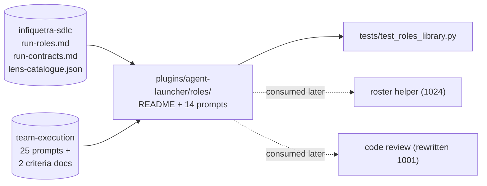

# Roles library in the sdlc's role vocabulary (issue 1022)

## Summary

Add `plugins/agent-launcher/roles/`: one reusable prompt per role that the software development lifecycle (the SDLC, kept in the sibling repository `infiquetra-sdlc`) names, plus a README stating the contract every prompt follows and a structural test that holds the set honest.

The prompts are content only. Nothing spawns, orders, gates, or aggregates them in this issue; the roster helper (issue 1024) and the run chain (issues 1026 through 1028) consume them later.

## Problem Frame

Roles already run today as named terminal panes in Herdr across seven kinds of coding agent, but the prompt each pane receives is hand-written at dispatch time. That makes a run's staffing unrepeatable and makes every role's output shape a matter of whatever the dispatcher remembered.

The SDLC already settles the vocabulary. `docs/roles/run-roles.md` in `infiquetra-sdlc` names fifteen roles with stable identifiers and authority boundaries, `docs/process/run-contracts.md` fixes the handoff comment each role emits, and `config/lens-catalogue.json` fixes the fifteen code-review lenses. What is missing is a durable prompt per role written in exactly that vocabulary.

The source material already exists in this repository as the 25 agent prompts and two criteria documents of the `team-execution` plugin — 2,570 lines by `wc -l` across `plugins/team-execution/agents/*.md` plus `plugins/team-execution/skills/team-execution/references/review-criteria.md` and `validator-criteria.md`. Those files are written in `team-execution`'s own vocabulary of base reviewers, optional reviewers, scanners, testers and monitors, which the SDLC does not use.

---

## Requirements

R1. A directory `plugins/agent-launcher/roles/` exists holding one Markdown prompt per SDLC role that can be staffed as an agent session, plus `README.md`.

R2. Every role prompt states four things the card names: the role, its inputs from the run record, its output contract, and its stop rule. Each appears under a stable heading so a machine can check for it.

R3. Every role prompt carries the heading `### Stop rule` verbatim, so the card's acceptance grep passes.

R4. Every role prompt names its SDLC role identifier (the `role_id` column of the role catalogue) and, as a list, every SDLC handoff contract identifier it emits. The list is never a bare string: the Planner emits two contracts and the Delivery Manager five.

R5. The Lens Reviewer prompt carries one section per lens identifier in the SDLC lens catalogue — all fifteen — keyed so a consumer can select by catalogue identifier.

R6. No **role prompt** references the `team-execution` plugin, its agent names, its gate-status vocabulary, or its criteria files. The README is deliberately exempt, because R10 requires it to account for where each retired `team-execution` prompt went; it is the one file in the directory allowed to name them.

R7. No prompt exists for a role the SDLC does not name, and no prompt exists for the scanner, validator or monitor shapes that `team-execution` invented.

R8. `tests/test_roles_library.py` enforces R1 through R7 mechanically and fails when any of them is violated.

R9. The `agent-launcher` release surfaces tell the same story as the diff: the plugin manifest version, the marketplace registry entry, and a dated changelog heading all agree and all advance past 1.5.2.

R10. The substance of the 25 `team-execution` agent prompts is either carried into a role prompt or explicitly accounted for in the README as belonging to another issue, so nothing is silently dropped before issue 1030 deletes the originals.

---

## Key Technical Decisions

**KTD1 — Fourteen role prompts, not thirteen.** The card enumerates thirteen roles. The SDLC's own catalogue at `docs/roles/run-roles.md:180-194` names fifteen, and the card's non-goal is only "no new role the sdlc does not name". The two the card's list omits are **Human Operator** (`operator`), which is a person and needs no prompt, and **Initial Implementation Worker** (`implementer`), which is the build loop's worker and which the roster helper (issue 1024) and the build loop (issue 1027) must both be able to staff. Shipping thirteen would leave the build loop as the one step still needing a hand-written prompt, which is the exact problem this issue exists to remove. The card's acceptance criterion is a floor ("at least 14"), so fourteen prompts plus the README (fifteen files) satisfies it. Rejected: thirteen prompts, which is literal fidelity to the card's list at the cost of the capability the card is for.

**KTD2 — Files are named for the human-readable role, and record the identifier in frontmatter.** `architect.md` and `delivery-manager.md`, not `orchestrator.md` and `controller.md`. Two of the SDLC's identifiers are historical: the Architect's identifier is `orchestrator` and the Delivery Manager's is `controller`, both kept for tooling stability and both actively misleading as filenames. The identifier still has to survive, so each prompt's frontmatter carries `role_id`. This also matches how the staffing component in issue 1021 is specified to be called — `--role lens-reviewer`, `--role functional-tester` — which is the kebab-case of the readable name. Rejected: naming files by identifier, which would make `orchestrator.md` the Architect and guarantee a future misread.

**KTD3 — One Lens Reviewer prompt with fifteen per-lens sections, not fifteen files.** The downstream consumer is already specified: the rewritten code-review card lists `plugins/agent-launcher/roles/lens-reviewer.md`, singular, in its files-expected-to-change. One parameterized prompt also keeps the shared reviewer behaviour (read-only, score against the catalogue's own dimensions, never decide acceptance) in one place while the lens-specific part varies. Rejected: one file per lens, which would be fifteen copies of the shared half and would break the named consumer.

**KTD4 — The output contract is the SDLC handoff comment, quoted from the SDLC, not re-specified here.** `docs/process/run-contracts.md:89-107` fixes the shape: a header line `### Handoff: <contract name> (<contract-id>)`, then the four common fields every one of the sixteen contracts carries — `**Revision.**`, `**Artifact.**`, `**Assigned.**`, `**Next.**` — then that contract's own required fields. Each role prompt names its contract identifier and reproduces that contract's field list. Rejected: inventing a plugin-local output schema, which would put the plugin ahead of the source of truth, the failure architecture decision record ADR-001 in `infiquetra-sdlc` exists to prevent.

**KTD5 — The heading is `### Stop rule`; the authority is the SDLC's `stop_condition`.** The SDLC's term is the field `stop_condition`, a required field of the `dispatch` contract (`docs/process/run-contracts.md:357`), meaning the deadline or condition on which a dispatched role stops. The card's acceptance criterion greps for the literal string `### Stop rule`, so that is the heading; its body says what the role's stop condition is and cites the SDLC field. Recording the mismatch here prevents a later editor "fixing" the heading and silently breaking the card's own check.

**KTD6 — The shared presentation preamble is referenced, never copied.** All 25 `team-execution` prompts open with a byte-identical 40-line house-style block. This repository already keeps exactly one canonical copy at `plugins/house-style/references/subagent-presentation-preamble.md`. Each role prompt carries a one-line pointer to it instead of a fourteenth and fifteenth copy. Rejected: duplicating the block per prompt, which is the drift this migration is undoing.

**KTD7 — Minimal frontmatter, and no model or effort field.** Each prompt carries `role`, `role_id`, `emits` (a YAML list, never a bare string — see R4) and `source`. It does **not** carry `model:` or `effort:`, because choosing a role's vendor, model and effort is the staffing component's job in issue 1021, and a tier written here would be a second place to change it. This also keeps the files outside the repository's agent-definition lints, which glob `plugins/*/agents/*.md` (`tests/test_agent_spec_lint.py`, `tests/test_agent_tier_lint.py`) and would otherwise apply an Agent-tool contract these prompts are not.

**KTD8 — Copy the substance; delete nothing.** The `team-execution` files stay on disk after this issue. The card assigns their removal to issue 1030, and deleting them here would strand every other card that still reads them. The README records where each of the 25 prompts went, including the four that go to another issue entirely.

**KTD9 — Repair implementers reuse the `implementation-result` contract, and the prompt says so out loud.** The SDLC's contract catalogue names `implementation-result` with the Initial Implementation Worker as its producer, and names no separate contract for a repair batch's return, even though the two repair roles plainly return one. Rather than invent a contract identifier, both repair prompts emit `implementation-result` and carry a line saying the catalogue names no distinct repair-result contract as of `infiquetra-sdlc` revision `67845cdd` (the `main` tip, equal to `origin/main` when read on 2026-09-19). If the SDLC amendment in the sibling issue adds one, the prompts follow it.

**KTD10 — A minor version bump, and the marketplace entry regenerated rather than hand-edited.** Adding `roles/*.md` under `plugins/agent-launcher/` makes the change a bump-required path for `tools/release_surface_diff_guard.py` (`is_bump_required_path`, line 193: anything under the plugin that is not `README.md`, not `CHANGELOG.md`, not under a `docs/` prefix and not under a `tests/` prefix), which requires the manifest version to be strictly greater than the base ref's. This is additive capability, so 1.5.2 becomes 1.6.0. The marketplace entry is regenerated with `scripts/sync_marketplace.py` so the three-way parity check in `scripts/check_release_surface_parity.py` cannot drift.

**The regenerator has no per-plugin scope, so check before writing.** `scripts/sync_marketplace.py` takes only `--check` and `--category`; it rewrites the whole of `.claude-plugin/marketplace.json` from every plugin manifest. If any other plugin's manifest is already ahead of the committed registry, a bare run sweeps that unrelated drift into this change. Run `--check` first, and after writing, confirm the diff touches the `agent-launcher` entry and nothing else; if it touches more, that is a separate repair and does not belong in this issue's pull request.

---

## High-Level Technical Design

The library is three layers, and only the innermost varies per file.

The **README** states the contract: the required headings, the frontmatter keys, the role-to-file map, and the accounting of where each retired `team-execution` prompt went. It is the document a human reads to add a role later, and the document the test is written against.

Each **role prompt** is self-contained enough to be the entire text sent to a fresh agent session that has never seen the run. It carries the role and its authority boundary, the inputs it reads from the run record, the handoff contract it emits, and its stop rule.

The **Lens Reviewer prompt** adds one more layer: a shared reviewer half, then fifteen lens sections keyed to catalogue identifiers, so a consumer selects `#### security` or `#### previous-comments` and sends the shared half plus that one section.

### Where the 25 team-execution prompts land

| `team-execution` prompt group | Count | Destination |
|---|---|---|
| Reviewers (security, architecture, devil's advocate, code quality, testing, API, infra, privacy, clarity, AI usefulness) | 10 | Lens sections of `lens-reviewer.md` |
| Testers (scenario, smoke, contract, UI regression, performance, concurrency, event flow, SDK regression) | 8 | Named strategies inside `functional-tester.md` |
| Scanners (security, dependency, API compatibility, infrastructure cost) | 4 | Not a role — mechanical baseline checks, issue 1027 |
| Monitors (GitHub Actions, runtime) and the deploy watcher | 3 | Wait steps inside `release-worker.md` |

The two criteria documents follow the same rule. `review-criteria.md` already delegates every dimension, anchor and acceptance rule to a roster file and asserts no policy of its own, so its substance becomes the Lens Reviewer's instruction to read dimensions and anchors from the SDLC catalogue. `validator-criteria.md`'s gate-status vocabulary (`pass`, `warn`, `hard-fail`, `skipped-by-config`, `blocked`) is `team-execution`'s invention and is deliberately not carried; the SDLC's pass-or-fail evidence recording replaces it, and R6 forbids reintroducing it.

---

## Implementation Units

### U1. The roles directory contract

Write the README that every later unit is checked against, so the contract exists before the prompts do.

**Goal.** Establish `plugins/agent-launcher/roles/README.md` as the contract: required headings, frontmatter keys, the role-to-file map for all fourteen roles, and the accounting table for the 25 retired prompts.

**Requirements.** R1, R2, R4, R10.

**Dependencies.** None.

**Files.** `plugins/agent-launcher/roles/README.md` (new).

**Approach.** State the four required headings by their exact spelling (`## Role`, `## Inputs from the run record`, `## Output contract`, `### Stop rule`) and the four frontmatter keys (`role`, `role_id`, `emits` as a list, `source`). Include the destination table for the retired prompts and a line naming the house-style preamble path from KTD6. Name the SDLC revision the contract was read from so a future reader can tell whether the source moved. State both README exemptions explicitly: it carries no `### Stop rule`, and it is the one file allowed to name `team-execution`.

**The role-to-file map is machine-read, so pin its shape.** U6's test reads the expected role set from this map rather than hard-coding fourteen names, so the map needs an anchor and a fixed shape, not just a table somewhere in the prose. Put it under the exact heading `## Role to file map`, as the first Markdown table after that heading, with three columns in this order: readable role name, SDLC `role_id`, filename. KTD2's two historical identifiers (`orchestrator` for the Architect, `controller` for the Delivery Manager) are then visible in column two rather than surprising.

**Patterns to follow.** `plugins/agent-launcher/README.md` for register and length; `plugins/team-execution/skills/team-execution/references/review-criteria.md` for the "this file holds no policy, the source of truth does" stance.

**Test scenarios.** `Test expectation: none -- the README is the contract the U6 test enforces; the test asserts every other file conforms to it, and asserts the README itself is the one file exempt from the `### Stop rule` requirement.`

**Verification.** The README names all fourteen roles, both historical identifiers, and all 25 retired prompts.

---

### U2. The nine shaping, planning and control role prompts

Write the prompts for the roles that decide, review documents, and run the run.

**Goal.** Nine self-contained prompts: Product, Issue Reviewer, Planner, Architect, Delivery Manager, Plan Reviewer, Review Controller, Investigator, and Initial Implementation Worker.

**Requirements.** R1, R2, R3, R4, R6, R7.

**Dependencies.** U1.

**Files.** `plugins/agent-launcher/roles/product.md`, `issue-reviewer.md`, `planner.md`, `architect.md`, `delivery-manager.md`, `plan-reviewer.md`, `review-controller.md`, `investigator.md`, `implementer.md` (all new).

**Approach.** Take each role's authority boundary and primary responsibility verbatim in substance from the role catalogue's detailed section (`docs/roles/run-roles.md`, sections beginning at lines 205, 251, 346, 433, 524, 566, 589, 773, and the Issue Reviewer's own section at 832). Take each output contract's field list from the matching contract in `docs/process/run-contracts.md`: Product emits `product-ruling`, Issue Reviewer `issue-review-result`, Planner `planner-to-orchestrator` and, in the repair phase, `repair-amendment`, Architect `technical-context`, Delivery Manager `orchestrator-to-controller` plus `dispatch`, `investigation-request`, `release-handoff` and `run-record`, Plan Reviewer `plan-review-result`, Review Controller `code-review-result`, Investigator `diagnosis`, and the Initial Implementation Worker `implementation-result`. Each stop rule cites the `dispatch` contract's `stop_condition` and names the role's own terminal condition.

**Patterns to follow.** `plugins/team-execution/agents/devils-advocate-reviewer.md` for the depth of a judgment prompt; the SDLC's own role prose for the authority-boundary wording.

**Test scenarios.** Covered by U6: each of the nine files parses as frontmatter plus body; each carries all four required headings; each `role_id` matches the README's map; every entry in each file's `emits` list is a contract identifier the SDLC catalogue lists; none of the nine contains the string `team-execution`.

**Verification.** Nine files exist, each naming a role, its inputs, its contract, and its stop rule, with no invented role and no `team-execution` vocabulary.

---

### U3. The repair and release role prompts

Write the three prompts that fix and ship, folding the monitors and the deploy watcher into the release role's waiting.

**Goal.** Three prompts: Standard Repair Implementer, Expert Repair Implementer, Release Worker — the last absorbing the two `team-execution` monitors and the deploy watcher as wait steps.

**Requirements.** R1, R2, R3, R4, R6, R10.

**Dependencies.** U1.

**Files.** `plugins/agent-launcher/roles/standard-repair-implementer.md`, `expert-repair-implementer.md`, `release-worker.md` (all new).

**Approach.** Both repair prompts take their briefing model from the role catalogue's own statement that a repair session's inputs arrive as two comments — the Planner's `repair-amendment` and the Delivery Manager's `dispatch` — and both carry the catalogue's hard limits: never write your own repair plan, never redefine scope, never weaken a rubric or lower a threshold, never trigger a review cycle mid-batch. Both emit `implementation-result` with the KTD9 caveat line, and both carry it as a single-entry `emits` list. The Expert prompt adds the escalated phase's own allowance and the record of the standard-tier attempt. The Release Worker emits `release-result`, consumes `release-handoff`, and gains a "wait for required checks" section that carries the substance of the GitHub Actions monitor, the runtime monitor and the deploy watcher: wait on the exact head revision, report a non-green check rather than re-running it, and never test its own release.

**Patterns to follow.** `plugins/team-execution/agents/deploy-watcher.md` and `github-actions-monitor.md` for the wait-step substance being folded in.

**Test scenarios.** Covered by U6, plus two specific to this unit: the Release Worker prompt contains a wait-step section, and neither repair prompt claims authority to change scope or thresholds (asserted as the presence of the limiting sentences).

**Verification.** Three files exist; the three retired monitor and watcher prompts are accounted for in the README's destination table.

---

### U4. The Lens Reviewer prompt with all fifteen lens sections

Write the one parameterized reviewer prompt the rewritten code review consumes.

**Goal.** `lens-reviewer.md` with a shared reviewer half and fifteen sections, one per lens identifier in the SDLC catalogue.

**Requirements.** R1, R2, R3, R4, R5, R6, R10.

**Dependencies.** U1.

**Files.** `plugins/agent-launcher/roles/lens-reviewer.md` (new).

**Approach.** The shared half states the role's boundary from the catalogue — score the one assigned lens, verify prior findings, strictly read-only, report evidence and never decide acceptance — and instructs the session to read that lens's dimensions and anchors from the SDLC lens catalogue rather than from any text in the prompt. The fifteen sections use `#### <lens-id>` headings spelled exactly as the catalogue spells them: the four always-on lenses `architecture-maintainability`, `correctness`, `security`, `testing`, then the eleven conditional lenses `deployment-infrastructure`, `reliability`, `performance`, `api-contract`, `adversarial`, `privacy`, `documentation-clarity`, `agent-usability`, `previous-comments`, `accessibility-human-usability`, `experience`. Each section says what the lens looks at and names its `floor_level` (`standard` for the always-on four, `baseline` for the eleven). Ten sections carry substance migrated from the matching `team-execution` reviewer per the destination table; the remaining five — `correctness`, `reliability`, `previous-comments`, `accessibility-human-usability`, `experience` — have no `team-execution` source and are written from the catalogue alone. The prompt states that the eleven conditional lenses report findings without scores until the SDLC's fixtures exist, which is the review's own recorded position.

**Patterns to follow.** `plugins/team-execution/agents/security-reviewer.md` for a lens section's depth; `review-criteria.md` for the delegate-all-policy stance.

**Test scenarios.** Covered by U6, with the load-bearing one specific to this unit: every lens identifier read live from `config/lens-catalogue.json` has a matching `#### <lens-id>` section, and the prompt contains no scoring thresholds of its own (no bare `8.0`, `9.0` or `9.5` derived-overall values), because the catalogue owns the strictness ladder.

**Verification.** Fifteen sections exist whose headings match the catalogue identifiers exactly, and the file names no threshold value.

---

### U5. The Functional Tester prompt with the eight tester strategies

Write the post-merge testing role, folding the eight `team-execution` testers into named strategies.

**Goal.** `functional-tester.md` carrying the role's boundary and eight named strategies derived from the retired tester prompts.

**Requirements.** R1, R2, R3, R4, R6, R10.

**Dependencies.** U1.

**Files.** `plugins/agent-launcher/roles/functional-tester.md` (new).

**Approach.** The role half comes from the catalogue: execute the prescribed post-merge scenario tests in the target environment, record pass or fail evidence, read-only, emit `functional-qa-result`. The strategies are named sections carrying the substance of the scenario, smoke, API contract, UI regression, performance, concurrency, event flow and SDK regression testers — what each exercises and what evidence it records — without `team-execution`'s gate-status vocabulary. The stop rule cites the `dispatch` contract's `stop_condition` and the SDLC's four early-stop conditions for the post-merge repair extension, which `docs/process/functional-qa.md:133` states.

**Patterns to follow.** `plugins/team-execution/agents/scenario-tester.md` and `smoke-tester.md` for strategy substance.

**Test scenarios.** Covered by U6, plus one specific to this unit: the prompt contains none of `team-execution`'s five gate-status words as status vocabulary (`hard-fail`, `skipped-by-config` are the discriminating two, since `pass`, `warn` and `blocked` are ordinary English).

**Verification.** All eight retired tester prompts are accounted for in the README's destination table and represented as strategies.

---

### U6. The structural test

Make the contract mechanical, so the set cannot rot.

**Goal.** `tests/test_roles_library.py` enforcing R1 through R7.

**Requirements.** R8.

**Dependencies.** U1, U2, U3, U4, U5.

**Files.** `tests/test_roles_library.py` (new).

**Approach.** Follow the repository's existing structural-test convention: glob the directory into a module-level list, assert the glob is non-empty before parametrizing, then parametrize one assertion per file, exactly as `tests/test_agent_tier_lint.py:33,46` and `tools/agent_spec.py:306` do over `plugins/*/agents/*.md`. Parse frontmatter with a small `---`-delimited parser, the same shape as the helper in `tests/test_agent_launcher_plugin.py`. Read the expected role set from the README's `## Role to file map` table, per U1's pinned shape, rather than hard-coding fourteen names, so adding a role is one edit.

**Two exemptions and one path rule the test has to encode.** `README.md` is excluded from the per-prompt rules — both the `### Stop rule` requirement and the forbidden-`team-execution` rule (R6) — and the test states that exclusion once, by filename, rather than scattering conditionals. For the lens identifiers, resolve the SDLC checkout in this order: the environment variable `INFIQUETRA_SDLC_ROOT` when set, else a directory named `infiquetra-sdlc` beside this repository's root. When neither resolves, fall back to a pinned list committed in the test, carrying the `infiquetra-sdlc` revision it was taken from (`67845cdd`) in a comment beside it, so the test still runs on a continuous-integration runner that has no sibling checkout. Never hard-code an absolute path.

**Patterns to follow.** `tests/test_agent_tier_lint.py` for the glob-and-parametrize shape and its seeded red/green fixtures; `tests/conftest.py` for shared fixtures.

**Test scenarios.**
- Happy path: the real `roles/` directory passes every rule — the glob finds fifteen files, each non-README file carries all four required headings, each `role_id` is in the README's map, and no non-README file contains `team-execution`.
- Coverage: every role in the README's map has a file, and every file is in the map — both directions, so neither an orphan file nor a missing role passes.
- Lens coverage: every lens identifier has a `#### <lens-id>` section in `lens-reviewer.md`; a seeded copy with one section removed fails.
- Stop-rule rule: a seeded prompt written to `tmp_path` without `### Stop rule` fails; the README without it passes, because the README is the one exemption.
- Forbidden-vocabulary rule: a seeded prompt containing `team-execution` fails; a seeded prompt containing `hard-fail` as a status word fails; the real README, which names `team-execution` by design, passes.
- Frontmatter rule: a seeded prompt missing `emits` fails; a seeded prompt whose `emits` is a bare string rather than a list fails; a seeded prompt one of whose `emits` entries names a contract the SDLC catalogue does not list fails. The real `planner.md` with two entries and `delivery-manager.md` with five both pass.
- Error path: an empty `roles/` directory fails the non-empty glob assertion rather than passing vacuously — the failure mode the repository's own journal records for glob-driven tests.

**Verification.** `uv run pytest tests/test_roles_library.py -q` passes, and each seeded negative fixture fails when its rule is removed.

---

### U7. Release surfaces and the engineering journal

Ship the metadata in the same change, because the repository's guard requires it and the journal rule requires it.

**Goal.** `agent-launcher` release surfaces agree at 1.6.0, and the decisions above are captured in the journal.

**Requirements.** R9.

**Dependencies.** U1 through U6.

**Files.** `plugins/agent-launcher/.claude-plugin/plugin.json`, `.claude-plugin/marketplace.json`, `plugins/agent-launcher/CHANGELOG.md`, `docs/engineering-journal/DECISIONS.md`.

**Approach.** Bump the manifest from 1.5.2 to 1.6.0, add a dated `## [1.6.0] - 2026-09-19` heading to the changelog in the canonical grammar `scripts/changelog_heading_lint.py` enforces, and regenerate the marketplace entry with `scripts/sync_marketplace.py` rather than editing it by hand — running `--check` first and confirming the resulting diff touches only the `agent-launcher` entry, per KTD10. Record KTD1 (fourteen roles, not thirteen), KTD2 (the two historical identifiers), KTD3 (one lens file), KTD6 (reference the preamble, do not copy it) and KTD9 (no repair-result contract exists) as `DECISIONS.md` entries with their rejected alternatives and a revisit condition tied to the SDLC amendment.

**Patterns to follow.** The most recent dated heading in `plugins/agent-launcher/CHANGELOG.md`; the existing entry format in `docs/engineering-journal/DECISIONS.md`.

**Test scenarios.** `Test expectation: none -- metadata and journal prose; the behaviour is asserted by the existing guards tests/test_release_surface_parity.py and tests/test_release_surface_diff_guard.py, which this unit exists to satisfy rather than to extend.`

**Verification.** `uv run pytest tests/test_release_surface_parity.py tests/test_changelog_heading_lint.py -q` passes, and the three surfaces all read 1.6.0.

---

## Scope Boundaries

### Non-goals

- **No spawning, ordering, gating or aggregation.** Nothing in this issue launches a session, decides an order, enforces a gate, or combines results. That is the roster helper (issue 1024) and the run chain (issues 1026 through 1028).
- **No scanner, validator or monitor role.** Those are `team-execution` shapes the SDLC does not name. Scanners become mechanical baseline checks in issue 1027; monitors become the Release Worker's wait steps here.
- **No new role the SDLC does not name.** The fourteen are exactly the SDLC's fifteen minus the Human Operator. The optional UI/UX Designer and the not-yet-stood-up research specialist that `docs/roles/run-roles.md:877` describes are outside the fifteen and get no prompt.
- **No deletion of `team-execution`.** Issue 1030 removes it.
- **No staffing decision.** No prompt names a vendor, model or effort; issue 1021 owns that.
- **No SDLC edit.** The sibling repository's amendment is its own card.

### Deferred to follow-up work

- A Human Operator prompt, if the roster ever needs to brief a person the way it briefs a session.
- A distinct repair-result handoff contract, if the SDLC amendment adds one (KTD9).
- Scoring fixtures for the eleven conditional lenses, which the SDLC owns and which gate whether those lenses score or only report.

---

## Risks and Dependencies

**The SDLC moves under this issue.** The sibling card amends `docs/roles/run-roles.md` and the lens catalogue's surrounding documents in the same window. *Mitigation:* the prompts cite the `infiquetra-sdlc` revision they were written from (`67845cdd`), the README names it, and U6's fallback lens list carries it, so a later divergence is visible rather than silent.

**The card's thirteen-role list and the SDLC's fifteen disagree.** *Mitigation:* KTD1 states the resolution and its reasoning explicitly, and the acceptance criterion is a floor that fourteen satisfies. If the operator wants literally thirteen, deleting `implementer.md` and its README row is the whole reversal.

**A structural test can pass vacuously.** A glob that matches nothing makes every parametrized assertion trivially true. *Mitigation:* U6 asserts the glob is non-empty first and checks role coverage in both directions, which is the pattern the existing agent lints already use.

**Continuous integration has no sibling SDLC checkout.** A test that reads `config/lens-catalogue.json` from `infiquetra-sdlc` would fail on a runner. *Mitigation:* U6 reads live when present and falls back to a pinned, revision-stamped list otherwise.

**Prompt quality is not testable.** The structural test proves headings exist, not that a prompt is good. *Mitigation:* accepted; the card's own acceptance criteria are structural, and the first real run under issue 1024 is the behavioural test.

---

## Sources

- `docs/analysis/2026-09-19-improve-claude-plugins-objective-plan.md` section 7, card A4 — the card body.
- `docs/analysis/2026-09-19-saga-simplification-review.md` sections 5 and 6B — the target shape and recommendation R12.
- `infiquetra-sdlc` `docs/roles/run-roles.md:180-194` — the fifteen roles and their identifiers.
- `infiquetra-sdlc` `docs/process/run-contracts.md:89-107, 161-217, 357` — the handoff comment shape, the sixteen contracts, the `stop_condition` field.
- `infiquetra-sdlc` `config/lens-catalogue.json` — the fifteen lens identifiers, `floor_level`, and the strictness ladder.
- `infiquetra-sdlc` `docs/process/functional-qa.md:133` — the four early-stop conditions.
- `plugins/team-execution/agents/` (25 files) and `.../references/review-criteria.md`, `validator-criteria.md` — 2,570 lines of source material.
- `tools/release_surface_diff_guard.py:193` (`is_bump_required_path`) and `scripts/check_release_surface_parity.py` — why U7 is mandatory.
- `scripts/sync_marketplace.py:158-171` — the regenerator's only two flags, `--check` and `--category`, and its whole-file scope.
- `tests/test_agent_tier_lint.py:33,46` and `tools/agent_spec.py:306` — the structural-test convention U6 follows, including the non-empty-glob assertion.
- `plugins/house-style/references/subagent-presentation-preamble.md` — the single canonical copy KTD6 points at.

---

## Questions answered from the card

The plan skill asks the operator several questions from known sets. The operator answered them up front in the card and the two analysis documents, or the carrier supplied them, so none was put to a person. Each is recorded with the answer taken and where it came from.

| Question | Answer taken | Source |
|---|---|---|
| Destination (plan only / pull request / merge / non-production deploy) | **pull request** | The structured pre-answer carrier, validated clean by `plan_pre_answers.py`, caller "improve-claude-plugins run driver" |
| Execution backend (inline / team execution / dynamic workflows) | **inline** | The same carrier. The recommender was still consulted and its output recorded, as the skill requires |
| Deploy-autonomy posture | **not asked** | The skill asks it only for a non-production-deploy destination |
| Resume an existing plan saga, or mint a new one | **mint** | `saga.py scan` returned zero candidates |
| Is a plan document warranted | **yes** | Ten decisions with rejected alternatives, seven units, and a cross-repository dependency; far from atomic |
| Scope class (lightweight / standard / deep) | **standard** | Low risk and content-only, but fourteen prompts, fifteen lens sections and a migration of 2,570 lines put it above lightweight. Seven units is one above the standard band's usual six, which the unit boundaries earn |
| Does the verdict need to block or persist (gated versus advisory) | **not reached** | That question only arises when escalating to the team-execution backend, which the carrier settled as inline |
| Where does the roles library live — saga or agent-launcher | **agent-launcher** | Card objective, and review question 2, answered 2026-09-19 |
| Thirteen roles as the card lists, or the SDLC's full set | **fourteen** — the SDLC's fifteen minus the Human Operator | KTD1; the card's acceptance criterion is a floor, and its non-goal forbids only inventing roles |
| One lens-reviewer file or one per lens | **one file, fifteen sections** | The rewritten code-review card names `roles/lens-reviewer.md` singular as its consumed input |
| Do the `team-execution` files get deleted here | **no** | The card assigns removal to issue 1030 |
