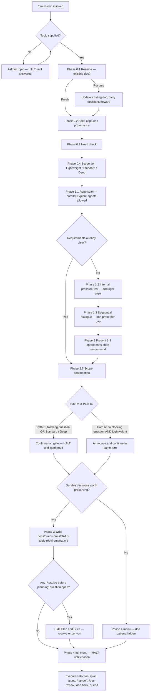

# Saga Brainstorm — Current Behavior Review

- **date:** 2026-08-27
- **subject:** the `/brainstorm` command shipped by the `saga` plugin
- **kind:** as-is behavior review (not a change proposal, plan, or code review)
- **saga version reviewed:** 0.143.0
- **repository commit:** `8269f84b` (`main`, up to date with `origin/main`, 0 commits behind)

---

## 1. Executive summary and current purpose

Brainstorm is the Saga lifecycle command that turns **one already-chosen idea** into a written
requirements document. It answers the question *"what exactly should this idea mean?"* and stops
there. It does not decide how the thing gets built, and it does not write code.

The whole command is **prompt text**. There is no Python script, no hook, no template engine, and no
state file behind it. Three Markdown files define every behavior described in this review: a
13-line command stub, a 371-line skill that scripts the conversation, and a 163-line contract that
describes what the output document must contain. The Claude session reads those files and runs the
dialogue itself.

Because the engine is a conversation rather than a program, its "control flow" is a sequence of
instructions the session is told to follow in order: assess the topic, scan the repository, probe the
operator's reasoning for specific named weaknesses, propose two or three approaches, confirm scope,
write one Markdown file, then offer a menu of next commands.

The command's **only durable side effect is a single Markdown file** written under
`docs/brainstorms/`. It creates no issue, no board card, no branch, no commit, no pull request, and
no Saga work-state record. Every point at which it needs an operator decision is a hard stop: the
skill declares that silence is never consent.

**The single most important thing an operator should know:** Brainstorm's output contract is written
down carefully but is not enforced by anything. Five of the twenty-six documents currently in
`docs/brainstorms/` do not follow the metadata contract the skill declares, including both of the
two most recently written ones. The resume feature depends on that metadata, so those five documents
cannot be found by the command's own resume scan.

---

## 2. Authoritative source inventory, with installed-versus-source status

The Claude session running this review has `saga` version 0.143.0 installed at
`/Users/jefcox/.claude/plugins/cache/infiquetra-plugins/saga/0.143.0`. The plugin registry at
`~/.claude/plugins/installed_plugins.json` records that install as pinned to repository commit
`8269f84b01065ac96d162431ce00ebd42003dd5f`, last updated `2026-08-28T01:44:25.485Z` (Coordinated
Universal Time).

That commit is the current tip of `main` in this repository, and the repository working tree is up to
date with `origin/main`.

### The three files that define Brainstorm's behavior

| Path | Lines | Bytes | Role | Installed vs. source |
|---|---|---|---|---|
| `plugins/saga/commands/brainstorm.md` | 13 | 478 | Slash-command stub; declares the command name, description, and argument hint, then tells the session to load the skill | Byte-identical |
| `plugins/saga/skills/brainstorm/SKILL.md` | 371 | 22,712 | The engine — interaction rules, phases 0 through 4, gate declarations | Byte-identical |
| `plugins/saga/skills/brainstorm/references/requirements-sections.md` | 163 | 10,266 | The output contract — what the requirements document must contain and how to size it | Byte-identical |

**Drift status: none.** All three installed files are byte-identical to the repository source. Verified
by `diff` against `/Users/jefcox/.claude/plugins/cache/infiquetra-plugins/saga/0.143.0/`.

A caveat worth recording: the plugin cache retains sixteen older version directories alongside
0.143.0, from 0.131.1 through 0.142.1. Those older copies carry materially different Brainstorm text —
the difference between the 0.131.1 copy and the 0.143.0 copy is 179 lines added, 185 removed, and 117
modified, including the complete replacement of an "Engine Offer" section with the current
"Reviewer-session transport" section. Only the version named in `installed_plugins.json` is live; the
rest are inert history. If a session were ever pinned to an older cached version, its Brainstorm
behavior would differ substantially from what this review describes.

### There are no scripts and no hooks

`find plugins/saga/skills/brainstorm -type f` returns exactly the two files listed above. The skill
directory contains no `scripts/` subdirectory.

The `saga` plugin does register eleven hooks in `plugins/saga/hooks/hooks.json`, covering session
start, session end, pre-compaction, pre-tool-use, stop, and post-tool-use events. **None of them is
specific to Brainstorm.** They fire for every Saga session regardless of which command is running.
Three of them will observe a Brainstorm run incidentally: `validate_json_hook.py` and
`delegation_tripwire_hook.py` inspect every file write, and `journal_nudge_hook.py` inspects every
shell command. None gates or alters Brainstorm's behavior.

### Shared files Brainstorm depends on

These are not part of the Brainstorm skill but are loaded or cited by it, and their content shapes
the output:

| Path | What Brainstorm uses it for |
|---|---|
| `plugins/saga/references/formatting-style.md` | The shared prose and table formatting rules the generated requirements document must follow |
| `plugins/saga/references/gate-divergence-instrumentation.md` | The optional telemetry convention for recording which option an operator picked at a decision point |
| `plugins/saga/skills/ideate/references/convergence-and-partnership.md` | The SURVIVOR SCHEMA — the field shape Brainstorm reads when the topic arrives as a handoff from `/ideate` |
| `plugins/saga/references/operator-choice.md` | Cites Brainstorm as the canonical source for the channel-inline question convention; does not constrain Brainstorm |
| `plugins/saga/references/saga-spec.md` | Defines `brainstorm` as a lifecycle phase and maps it to the `requirements-ready` handoff maturity |
| `plugins/saga/docs/model/saga-docs-model.yaml` | The curated documentation card for `/brainstorm`, used to generate Saga's docs and visuals |

All six exist and were read during this review.

---

## 3. User-visible entry points and prerequisites

### How an operator starts a brainstorm

There are three entry paths:

1. **The slash command.** `/saga:brainstorm [topic]` — the argument is optional. Declared in
   `plugins/saga/commands/brainstorm.md:1-5` with `argument-hint: "[topic]"`.
2. **Skill activation by description.** The skill is listed to the session as *"Deep-dive one chosen
   Infiquetra idea into a right-sized requirements doc before planning"*, so a natural-language ask
   matching that shape can activate it.
3. **Routed in from another Saga command.** `/office-hours` routes a settled frame here
   (`plugins/saga/skills/office-hours/SKILL.md:24-36`), `/ideate` positions Brainstorm as its
   downstream step (`plugins/saga/skills/ideate/SKILL.md:12-17`), and `/loop` lists `/brainstorm` as
   one of its seventeen routable commands, selected when the operator has one chosen idea whose WHAT
   is not yet pinned (`plugins/saga/skills/loop/references/dispatch-table.md:9-11, 50`).

### Prerequisites

There are very few, and none of them is checked programmatically.

- **A topic is mandatory.** If no topic arrives from arguments, an `/ideate` survivor reference, or
  the active artifact, the skill asks *"What would you like to dig into? Name the feature, problem, or
  `/ideate` survivor."* and explicitly refuses to proceed without one
  (`plugins/saga/skills/brainstorm/SKILL.md:66-70`).
- **A repository is assumed.** The Phase 1.1 scan reads `AGENTS.md`, `CLAUDE.md`, root `STRATEGY.md`,
  and `docs/engineering-journal/`. All are read best-effort; the skill says to move on if they add
  nothing (`SKILL.md:146-153, 166`).
- **A writable `docs/brainstorms/` directory** is needed only if the run reaches Phase 3 and a
  document is warranted.
- **`AskUserQuestion` availability** shapes how questions are asked but is not a hard prerequisite —
  see section 8.

There is no prerequisite that `/ideate` has run first. A direct topic is a first-class entry
(`SKILL.md:98-99`).

---

## 4. Step-by-step current workflow, invocation to terminal outcome

The skill defines five phases. What follows is the actual instructed sequence.

### Phase 0 — Resume, assess, route (`SKILL.md:72-133`)

**0.1 Resume.** If the operator names an existing brainstorm topic, or a recent matching
`docs/brainstorms/*-requirements.md` exists, the session reads it and asks: *"Found an existing
requirements doc for [topic]. Continue from this, or start fresh?"* If resuming, it continues from
that document's decisions and open questions and **updates that file rather than creating a
duplicate**.

**0.2 Seed capture.** If the topic came from `/ideate`, the session ingests the survivor using the
SURVIVOR SCHEMA defined in `plugins/saga/skills/ideate/references/convergence-and-partnership.md:88`:
title, description, axis, basis, rationale, downsides, confidence (0-100), complexity, status. Two
rules bind here. The survivor's basis and rationale are treated as *starting context, not settled
requirements* — Brainstorm still pressure-tests them. And any schema field absent from the handoff is
treated as unstated: the skill forbids fabricating a basis, axis, or confidence the survivor did not
carry.

The session also captures **provenance** — the ideation document's repository-relative path and the
survivor reference — so Phase 3 can fill the `source` metadata field. If the handoff did not name the
ideation document path, the session asks once; if it is still unavailable, provenance is recorded as
unstated rather than invented.

For a direct topic with no `/ideate` handoff, the operator's opening becomes the seed and `source` is
left unset.

**0.3 Need check.** The session scans for signals that requirements are already clear — specific
acceptance criteria, a referenced pattern to follow, exact expected behavior, constrained scope. If
they are clear, it skips the Phase 1 *dialogue probes* but **still runs the Phase 1.1 repository
scan**, because that scan's verify-before-claiming rule holds regardless. It then jumps to Phase 2.5.

**0.4 Scope assessment.** The work is classified into one of three tiers from the seed plus a light
repository scan:

- **Lightweight** — small, well-bounded, low ambiguity.
- **Standard** — a normal feature or bounded refactor with real decisions to make.
- **Deep** — cross-cutting, strategic, or highly ambiguous.

If scope is unclear, the session asks one targeted question, then proceeds.

Deep scope carries a further split. **Deep — feature** (the default) means the existing product shape
anchors the decisions. **Deep — product** means the brainstorm must *establish* product shape:
primary actors, core outcome, positioning, or end-to-end flows are materially unresolved. The skill
notes that existing code lowers the odds of product-tier but does not rule it out — *"a half-built
tool with ambiguous shape is still product-tier."* Product tier adds extra probes in Phase 1.2 and
extra sections in the output document.

### Phase 1 — Understand the idea (`SKILL.md:135-243`)

**1.1 Existing-context scan.** This runs before substantive dialogue and is the only place in the
whole command where parallel work is allowed — the skill permits parallel `Explore` agents here and
requires everything after it to be sequential.

Depth matches the tier. Lightweight is a single topic search. Standard and Deep run two passes: a
*constraint check* reading `AGENTS.md`, `CLAUDE.md`, and root `STRATEGY.md`; and a *topic scan*
searching relevant terms, reading the most relevant existing artifact, and checking
`docs/engineering-journal/LEARNINGS.md` and `DECISIONS.md`.

Two rules govern the scan. **Verify before claiming**: any assertion that something is *absent* — a
missing table, a nonexistent endpoint, an undeclared dependency — must be checked against the actual
source first, and anything unverified must be labeled an unverified assumption. **Defer design to
planning**: schemas, migration strategy, endpoint structure, and deploy topology belong to `/plan`
unless the brainstorm is itself about that technical decision.

**1.2 Product pressure-test (internal).** The session reads the operator's opening and privately notes
which rigor gaps actually exist. This is explicitly *not* a user-facing checklist and explicitly *not*
fired as a pre-flight gauntlet — the skill says a fuzzy opening may earn three or four probes and a
well-framed one may earn zero.

The Standard gap list is four named gaps:

| Gap | What it means |
|---|---|
| **Evidence** | The opening asserts a need but points to nothing anyone has already done about it |
| **Specificity** | The beneficiary is so abstract you could not design without inventing who they are |
| **Counterfactual** | The opening does not show what people do today, nor what changes if nothing ships |
| **Attachment** | The opening treats a solution shape as the thing being built, rather than the value it delivers |

Deep adds one question — is this a local patch, or does it move the broader system toward where it
wants to be? Deep-product adds a **durability** gap (the value proposition rests on a world-state that
may shift) plus two more: what adjacent product could we accidentally build instead, and what would
have to be true in the world for this to fail.

**1.3 Collaborative dialogue.** Sequential, one question per turn. The session asks what the operator
is already thinking *before* offering its own ideas, starts broad and narrows, and probes only the gaps
Phase 1.2 actually found — open-ended, one probe per gap. The skill states a hard condition: *"Phase 1
cannot end with an un-probed rigor gap that is present."* The attachment probe fires last of the rigor
probes when present.

Before exiting, an **integration check**: the session combines what the operator has said and surfaces
any non-obvious downstream consequence the one-question-at-a-time dialogue would not have exposed.

**Exit condition:** the idea is clear and no integration-check question is pending, or the operator
explicitly wants to proceed.

### Phase 2 — Explore approaches (`SKILL.md:245-281`)

If multiple plausible directions remain, the session proposes **two to three concrete approaches**
grounded in the scan and the dialogue. Otherwise it states the recommended direction directly.

At least one approach must use a **non-obvious angle** — inversion, constraint removal, or analogy
from another domain — because "the first approaches that come to mind are usually variations on the
same axis."

The presentation order is fixed: **all approaches first, evaluation second.** Leading with a
recommendation is called out as anchoring the conversation prematurely.

Each approach gets a 2-3 sentence description, pros and cons, key risks or unknowns, and when it is
best suited. Optionally one deliberately higher-upside challenger is included alongside the baseline —
omitted when the work is already over-scoped.

A granularity rule binds the whole phase: name **mechanism and product-shape distinctions**, never
column names, table names, file paths, class names, or JSON shapes. The stated reason is that bringing
architecture forward forces architectural decisions onto intentionally shallow research, and the next
phase then has to filter the leak back out.

After presenting, the session states its recommendation and explains why, and where relevant calls out
whether the choice is reuse, extension, or net-new.

### Phase 2.5 — Scope-confirmation synthesis (`SKILL.md:283-303`)

This is the operator's **last chance to correct scope before the artifact lands**. Each bullet must
pass two tests: the *affirmability test* (can the operator evaluate it without reading code?) and the
*detail test* (1-2 lines, conversational). Over-share and over-detail are named as the failure modes.

Two paths, chosen by whether any blocking question fired **and** the Phase 0.4 tier:

- **Path A — announce mode.** Requires *both* that no blocking question fired *and* the tier is
  Lightweight. Emits a 1-3 sentence "What we're building" summary and proceeds to Phase 3 **in the
  same turn**, with no confirmation question and no wait.
- **Path B — full synthesis with a confirmation gate.** Fires when at least one blocking question
  fired, **or** the tier is Standard, Deep-feature, or Deep-product. Surfaces what is being built,
  what is in scope, what is explicitly out, and the open questions, then **confirms before writing**.
  The skill makes this confirmation unconditional even when zero call-outs survive, on the reasoning
  that the operator invested answer-time and the substance earns a real checkpoint.

The tier guard exists to distinguish a genuinely tight one-liner from a richly pre-loaded ask that
needed no dialogue only because everything was pre-stated.

### Phase 3 — Capture the requirements (`SKILL.md:305-322`)

The session writes or updates a requirements document **only when the dialogue produced durable
decisions worth preserving**. The output contract at
`plugins/saga/skills/brainstorm/references/requirements-sections.md:30-46` gives the skip test: skip
the document when both the dialogue produced no novel scope or framing worth preserving in identified
shape, **and** any durable decision can flow straight to `/plan`, a commit message, or `docs/`.

When a document is warranted, the session loads the section contract and composes from it. The file
goes to `docs/brainstorms/YYYY-MM-DD-<topic>-requirements.md` using today's date and a kebab-case
topic slug. Paths inside the document must be repository-relative; the completion message quotes the
absolute path so it is clickable.

### Phase 4 — Handoff (`SKILL.md:324-364`)

The artifact carries handoff maturity **`requirements-ready`**. The session presents a menu of next
steps and executes the operator's selection. Options that do not apply are hidden and the remaining
ones renumbered to stay contiguous.

| # | Option | Shown when |
|---|---|---|
| 1 | **Plan it with `/plan`** (recommended) | No "Resolve before planning" question remains |
| 2 | **Sharpen with `/spec`** | A requirements document exists and needs precision |
| 3 | **Hand off via `/handoff`** | A requirements document exists |
| 4 | **Review with `/doc-review`** | A requirements document exists |
| 5 | **More clarifying questions** (returns to Phase 1.3) | Always |
| 6 | **Back to `/office-hours`** | Always |
| 7 | **Done for now** | Always |

A blocking rule governs the menu: while any "Resolve before planning" question remains open, **Plan**
and **Build it now** are hidden. The operator resolves those first, one at a time; or, if they proceed
anyway, each remaining item is converted into an explicit decision, assumption, or "Deferred to
planning" question. If they pause instead, the handoff is presented as **paused, not complete**.

Rendering rule: `AskUserQuestion` when four or fewer options are visible, a numbered list when five or
more. Never silently skipped.

### The flow

---

## 5. Inputs, outputs, durable artifacts, and side effects

### Inputs consumed

| Input | Source | Required |
|---|---|---|
| Topic | Command arguments, `/ideate` survivor reference, or the active artifact | Yes — the run stops without one |
| Ideation survivor record | `/ideate` handoff, shaped by the SURVIVOR SCHEMA | No |
| Ideation document path | Named in the handoff, or asked for once | No — recorded as unstated if unavailable |
| Existing requirements document | `docs/brainstorms/*-requirements.md` matched by topic | No — triggers the resume prompt when found |
| Project instruction files | `AGENTS.md`, `CLAUDE.md` | No — read best-effort |
| Strategy anchor | Root `STRATEGY.md` | No — read when present |
| Engineering journal | `docs/engineering-journal/LEARNINGS.md`, `DECISIONS.md` | No — checked at Standard and Deep tiers |
| Repository source | Whatever the topic scan finds | No — but absence claims must be verified against it |
| Operator answers | The Phase 1.3 dialogue and the Phase 2.5 and Phase 4 gates | Yes at the gates |

### Outputs and durable artifacts

**Exactly one durable artifact:** a Markdown file at
`docs/brainstorms/YYYY-MM-DD-<topic>-requirements.md`.

Its declared metadata contract (`requirements-sections.md:63-76`) is Markdown frontmatter with four
stable fields:

- `date` — ISO 8601, ASCII digits, matching the filename.
- `topic` — kebab-case slug, matching the filename, and **used as the resume-detection key** when
  Phase 0.1 scans `docs/brainstorms/`.
- `maturity` — always `requirements-ready`.
- `source` — the ideation document path plus survivor reference, when the topic came from `/ideate`.

The contract explicitly states *"There is no `status` field — a requirements doc is a one-time output,
not a lifecycle artifact."*

The body has a **hard floor** of two sections that are always present when a document is written:
**Summary** (1-3 lines, forward-looking) and **Requirements** (stable `R#` identifiers, grouped by
concern when they span distinct concerns, identifiers continuous across groups). Nine further
sections are included only when material: Problem Frame, Key Decisions, Actors, Key Flows, Acceptance
Examples, Success Criteria, Scope Boundaries, Dependencies / Assumptions, Outstanding Questions, and
Sources / Research.

Four identifier namespaces are permitted and no others: `R#` for requirements, `A#` for actors, `F#`
for flows, `AE#` for acceptance examples.

Document depth is sized to the Phase 0.4 tier: Lightweight may be a handful of bullets without
identifiers; Standard adds Key Decisions, grouped Requirements, Scope Boundaries, Success Criteria;
Deep-feature adds Key Flows, Acceptance Examples, Dependencies; Deep-product adds an explicit product
thesis and splits Scope Boundaries into "Deferred for later" and "Outside this product's identity".

### Side effects that do NOT occur

Nothing in the command surface creates or modifies any of the following. This is a statement about
what the instructions direct, verified by reading all 371 lines of the skill and the 163-line
contract:

- No GitHub issue, project board card, label, or milestone.
- No git branch, commit, tag, pull request, or push.
- No Saga work-state record. The curated command card in
  `plugins/saga/docs/model/saga-docs-model.yaml` states this directly:
  *"Produces requirements-ready artifacts; does not store maturity in saga state."*
- No release, deployment, or agent session.
- No file outside `docs/brainstorms/`, other than optional scratch.

**Scratch:** the skill's closing note states that scratch work, when needed, goes under
`.claude/saga/`, never `/tmp` (`SKILL.md:371`).

---

## 6. Decision points, approval boundaries, and stop conditions

Brainstorm is a heavily gated command. The governing rule is stated once and applies everywhere.

### The operator-absence contract

`SKILL.md:52-57` declares it:

> **Operator-absence contract (#371).** Every known-set gate above declares what happens on silence,
> and the declaration above this line is the contract. `HALT` here: stop and wait. A timeout, a widget
> error, or a dropped session is never consent — do not proceed on a default and do not invent an
> answer.

Two gates carry machine-readable declarations, both `absence=HALT`:

| Gate identifier | Location | Fires at | On silence |
|---|---|---|---|
| `brainstorm-interrogation-choice` | `SKILL.md:52` | Any single-select dialogue question | HALT |
| `brainstorm-handoff-routing` | `SKILL.md:356` | The Phase 4 next-step menu | HALT |

Both markers are machine-checked — see section 11.

### Every point where the run stops for the operator

1. **No topic supplied.** Asks and refuses to proceed (`SKILL.md:66-70`).
2. **Resume-or-fresh.** When an existing matching document is found (`SKILL.md:76-79`).
3. **Scope disambiguation.** One targeted question when the tier is unclear (`SKILL.md:119`).
4. **Every dialogue question in Phase 1.3.** One at a time, never stacked (`SKILL.md:28-29`).
5. **Provenance ask.** Once, when an `/ideate` handoff did not name its ideation document
   (`SKILL.md:94-96`).
6. **Phase 2.5 Path B confirmation.** The scope gate before the artifact is written — unconditional
   at Standard and Deep tiers, and at Lightweight whenever a blocking question fired
   (`SKILL.md:296-300`).
7. **The Phase 4 routing menu.** Never silently skipped (`SKILL.md:353-354`).
8. **Blocking-question resolution.** While a "Resolve before planning" item is open, Plan and Build
   are hidden and the operator resolves, converts, or pauses (`SKILL.md:330-333`).

### The approval boundary

The operator approves **scope** (Phase 2.5) and **destination** (Phase 4). The session decides tier,
which rigor gaps exist, which approaches to present, and — subject to the warranted-document test —
whether a document is written at all. Notably, the decision to *write* the file is the session's, made
against the contract's skip test; the operator's confirmation at Phase 2.5 is about scope content, not
about whether a file lands.

### Where the session is told to stop rather than improvise

- **Reviewer sessions.** `SKILL.md:59-64` states that Orchestrate owns cross-vendor session transport,
  forbids running `engine_offer.py` and `engine_session_runner.py`, and directs the session to
  **HALT** if a reviewer session is required and is not in the Orchestrate run record — *"rather than
  inventing a custom review or falling back to the retired runner."*
- **Unverified absence claims.** Must be labeled unverified assumptions rather than asserted
  (`SKILL.md:157-161`).
- **Missing handoff fields.** Treated as unstated, never fabricated (`SKILL.md:88-90`).

---

## 7. Agent and reviewer delegation behavior, model and session assumptions

### Delegation is narrow and explicitly bounded

The skill states the rule in its opening: *"The engine is **orchestrator-side dialogue**: the steps
below run sequentially, in this session, one question at a time. The only parallel work allowed is the
Phase 1 context scan (`Explore` agents)"* (`SKILL.md:16-17`). Phase 1.1 repeats it: *"This scan may
run parallel `Explore` agents; the dialogue that follows is sequential"* (`SKILL.md:139-140`).

So Brainstorm delegates in exactly one place, to one agent type, for one purpose: read-only repository
search during the context scan.

### No reviewer panel, no verification agents

Brainstorm dispatches no adversarial verifier, no review panel, and no external engine. The
Reviewer-session transport section is a **prohibition**, not a capability: it tells the session what
not to run and directs it to halt rather than improvise a review.

### Model and effort tier

**Nothing in the Brainstorm command surface specifies a model, an effort level, or a tier for the
`Explore` agents it may spawn.** There is no `model:` field, no tier annotation, and no reference to
the tier resolver. Tier selection for the scan agents falls to whatever the calling session decides.

### Session-mode assumption

One environmental branch exists. `SKILL.md:43-44`: in a channel session with `redis-channel` active,
`AskUserQuestion` must not be called; the choices are inlined in reply text instead
(*"Which? A) ... B) ... C) ..."*). This convention is treated as canonical Saga-wide — `/plan`,
`/spec`, `/office-hours`, and `plugins/saga/references/operator-choice.md` all cite Brainstorm's
wording rather than duplicating it.

`SKILL.md:31-32` also instructs the session to call `ToolSearch` with `select:AskUserQuestion` first
if that tool's schema is not loaded.

---

## 8. Error handling, recovery, resume, cancellation, and idempotency

### Resume

Phase 0.1 is the resume mechanism. It triggers on an operator reference to an existing topic, or on
finding a recent matching `docs/brainstorms/*-requirements.md`. On resume the session summarizes
current state, continues from the document's recorded decisions and open questions, and **updates that
file rather than creating a duplicate** (`SKILL.md:76-79`).

The match key is the `topic` frontmatter field (`requirements-sections.md:69-70`).

Phase 4's "Done for now" option is the intended pause: *"the requirements doc is saved and resumable
later"* (`SKILL.md:351`).

### Cancellation and pausing

A paused run has a defined shape. If the operator pauses with blocking questions still open, the
session must present *"the handoff as paused, not complete"* (`SKILL.md:333`) and close by stating
that planning is blocked by those questions and that the operator can resume with `/brainstorm`
(`SKILL.md:362-364`).

There is no cancellation procedure beyond ending the conversation. Because nothing outside the single
Markdown file is mutated, an abandoned run leaves no partial state to clean up — unless Phase 3
already wrote the file, in which case the file simply persists.

### Idempotency

**Partly idempotent, by convention rather than by mechanism.**

Re-running Brainstorm on the same topic on the **same day** produces the same target filename
(`docs/brainstorms/YYYY-MM-DD-<topic>-requirements.md`), so a second run overwrites or updates the
first. Re-running on a **different day** produces a different filename, so the resume prompt is the
only thing preventing a duplicate document for the same topic. That prompt depends on the session
noticing the earlier file and on that file carrying a matching `topic` field.

### Error handling

There is essentially none, because there is no code to fail. The observable failure-adjacent behaviors
are all instructions to the session:

- **Scan finds nothing:** *"If nothing obvious appears after a short scan, say so and continue"*
  (`SKILL.md:166`).
- **Constraint files add nothing:** *"If they add nothing, move on"* (`SKILL.md:149`).
- **Provenance unavailable:** noted as unstated rather than invented (`SKILL.md:95-96`).
- **A probe reveals genuine uncertainty:** recorded as an explicit assumption in the document rather
  than skipped (`SKILL.md:229-230`).
- **Reviewer session missing from the Orchestrate record:** HALT (`SKILL.md:63-64`).
- **A widget error or timeout at a gate:** HALT — explicitly *not* consent (`SKILL.md:54-56`).

There is no retry logic, no timeout handling, no validation of the written file, and no rollback.

---

## 9. Interaction with the wider Saga lifecycle

### Position

Brainstorm sits third in the Think phase. Four skills state the same ordering independently
(`SKILL.md:8-9`, `plugins/saga/skills/ideate/SKILL.md:12-17`,
`plugins/saga/skills/office-hours/SKILL.md:24-30`, `plugins/saga/skills/plan/SKILL.md:18-23`):

`"/office-hours: what is the right frame?" --> "/ideate: which ideas are strongest?" --> "/brainstorm: what exactly should this one idea mean?" --> "/plan: how should it be built?" --> "/doc-review: is the plan ready?" --> "/work: build it"`

### Routes in

- **`/ideate`** — hands over a chosen survivor with its SURVIVOR SCHEMA fields.
- **`/office-hours`** — routes a settled frame here once it has one.
- **`/loop`** — dispatches here for "one chosen idea, WHAT not yet pinned"
  (`plugins/saga/skills/loop/references/dispatch-table.md:50`).
- **Direct invocation** by the operator.

### Routes out

- **`/plan`** — the recommended path; `/plan` reads the requirements document first and is instructed
  not to re-litigate product scope, actors, or success criteria (`plugins/saga/skills/plan/SKILL.md:44-45, 145`).
- **`/spec`** — the convergent counterpart. `/spec` describes the seam explicitly: Brainstorm is
  divergent exploration producing a requirements document across candidate directions; `/spec` is
  convergent and relentless on the one decided direction
  (`plugins/saga/skills/spec/SKILL.md:25-27`).
- **`/handoff`** — routes the artifact to `mission-control` as a prepared issue draft.
- **`/doc-review`** — a readiness pass before planning.
- **`/office-hours`** — the bounce-back when the topic turns out to be open thought-partner work.

### The bounce-back handshake

The `/plan` ↔ `/brainstorm` relationship is deliberately one-way. When `/plan` finds the WHAT
unsettled, it *recommends* the operator run `/brainstorm` first, and the skill is explicit that this is
a forward route only — `/plan` points there but **does not claim `/brainstorm` "accepts" a handoff**
(`plugins/saga/skills/plan/SKILL.md:25-28`). That distinction is asserted by a test, and by a negative
assertion that the phrase `` `/brainstorm` "accepts" a handoff `` appears in the skill document.

### Issues, boards, and milestones

Brainstorm touches none of them directly. The only path to an issue is Phase 4 option 3, which routes
the artifact to `/handoff`, which in turn routes to `mission-control`. `/handoff`'s maturity mapping
(`plugins/saga/skills/handoff/SKILL.md:89-92`) recognizes the directory:

| Artifact directory | Derived maturity |
|---|---|
| `docs/ideation/` | `idea-ready` |
| `docs/brainstorms/` | `requirements-ready` |
| `docs/specs/` | `requirements-ready` |
| `docs/plans/` or `docs/reviews/` | `plan-ready` |

When the recipient has `saga` installed, the issue may suggest `/plan <issue>` for a
`requirements-ready` artifact (`handoff/SKILL.md:100-103`).

### Saga work-state

`plugins/saga/references/saga-spec.md:171-174` lists `brainstorm` as one of seven `lifecycle_phase`
values, and line 191 maps it to `requirements-ready`. But that mapping is applied **at `/handoff`
time**, and maturity is described as *"DERIVED, NEVER STORED."* Brainstorm itself writes no Saga
record; the curated docs model confirms it.

### Shaping

No Saga command named "Shaping" exists in this repository. The command surface is the seventeen
routable commands enumerated at `plugins/saga/skills/loop/references/dispatch-table.md:9-11`. The
shaping-adjacent work — establishing frame and product shape before requirements — is carried by
`/office-hours` upstream and by Brainstorm's own Deep-product sub-tier. Recorded here so the absence is
explicit rather than inferred.

---

## 10. Tests and observable evidence supporting each behavior claim

Four test files touch Brainstorm. **All 89 tests across them pass** — run read-only during this review
with `uv run pytest tests/test_lint_gate_absence_contract.py tests/test_orchestrate_review_transport.py
tests/test_saga_doc_formatting.py tests/test_saga_docs_coverage.py -q`, result `89 passed in 3.16s`.

| Test file | What it actually asserts about Brainstorm |
|---|---|
| `tests/test_lint_gate_absence_contract.py` | Lists `plugins/saga/skills/brainstorm/SKILL.md` among six migrated gate sites (line 27) and runs the production lint against the real tree, requiring every gate mention to carry a well-formed `absence=` declaration |
| `tests/test_orchestrate_review_transport.py` | Includes the Brainstorm skill in `STAGE_SKILLS` (line 30) and asserts it contains none of the retired launch strings `engine_session_runner.py launch`, `engine_offer.py offer`, `engine_offer.py remember` (lines 32-36) |
| `tests/test_saga_doc_formatting.py` | Maps `brainstorm` to `references/requirements-sections.md` (line 47) and checks that file cites `saga/references/formatting-style.md` and contains no stacked bold-label collapses |
| `tests/test_saga_docs_coverage.py` | Requires the adjacent routing pairs `("/ideate", "/brainstorm")` and `("/brainstorm", "/spec")` in the docs model (lines 45-46), and requires the `/brainstorm` card to carry all documented fields |

### Independently reproducible evidence gathered for this review

| Claim | Command run | Result |
|---|---|---|
| Installed bytes match source | `diff` of all three files against `~/.claude/plugins/cache/infiquetra-plugins/saga/0.143.0/` | Identical on all three |
| Live version is 0.143.0 at commit `8269f84b` | Read `~/.claude/plugins/installed_plugins.json` | `"version": "0.143.0"`, `"gitCommitSha": "8269f84b..."` |
| Repository is current | `git fetch` then `git rev-list --count HEAD..origin/main` | `0` |
| Two gate-records exist, both HALT | `grep -n "gate-record:" plugins/saga/skills/brainstorm/SKILL.md` | Lines 52 and 356, both `absence=HALT transport=ask-user-question` |
| The gate lint passes on Brainstorm | `python3 plugins/saga/scripts/lint_gate_absence_contract.py --scan plugins/saga/skills` | Exit 0, both Brainstorm sites listed |
| No scripts in the skill | `find plugins/saga/skills/brainstorm -type f` | Two Markdown files only |
| The prohibited scripts are gone | `ls plugins/saga/scripts/engine_offer.py plugins/saga/scripts/engine_session_runner.py` | Both `No such file or directory` |
| Brainstorm writes no Saga state | Read `plugins/saga/docs/model/saga-docs-model.yaml` | `saga_state_behavior: Produces requirements-ready artifacts; does not store maturity in saga state.` |
| Frontmatter conformance in produced artifacts | Scripted scan of all 26 files in `docs/brainstorms/` | 21 conforming, 5 non-conforming |

### What is NOT covered by tests

No test asserts anything about Brainstorm's phase structure, its tier classification, its rigor-gap
list, the Phase 2.5 Path A / Path B split, the Phase 4 menu, or the requirements-document metadata
contract. The four tests above check: that gate markers are well-formed, that retired script names are
absent, that the output contract cites the shared formatting file and has no stacked labels, and that
the docs model's routing pairs are present. **The behavioral core of the command is unverified by any
automated check.**

---

## 11. Observed pain points, ambiguity, duplication, and missing safeguards

These are observations about current behavior. **No fixes are proposed here** — that is deliberate.

### 11.1 The metadata contract is unenforced, and the two newest documents violate it

`requirements-sections.md:63-76` declares four stable frontmatter fields and states plainly that
*"There is no `status` field."*

A scan of all 26 files in `docs/brainstorms/` finds **5 that do not carry the declared frontmatter**:

- `2026-05-29-infiquetra-loop-doc-review-requirements.md`
- `2026-05-30-infiquetra-loop-sdlc-handoff-requirements.md`
- `2026-05-30-sdlc-manager-issue-prepare-requirements.md`
- `2026-08-12-orchestrate-requirements.md`
- `2026-08-12-orchestrate-codex-phase-requirements.md`

The first three predate the current contract, so their divergence is historical. The last two are the
**most recently written brainstorm documents in the repository**, and both open with a heading plus a
bullet-list metadata block that includes `- **status:** requirements, pre-plan` — the exact field the
contract says does not exist. For contrast,
`docs/brainstorms/2026-08-07-output-styles-requirements.md` (five days earlier) carries the contract's
frontmatter exactly.

Nothing checks this. No lint, no test, and no hook validates a written brainstorm document against its
own contract.

### 11.2 Resume cannot find the non-conforming documents

Phase 0.1's resume detection keys on the `topic` frontmatter field
(`requirements-sections.md:69-70`). The five documents above have no `topic` field, so a scan of
`docs/brainstorms/` cannot match them by that key. A later `/brainstorm` run on the `orchestrate`
topic would have to notice the file by filename or operator reference; the declared mechanism would
not find it.

### 11.3 A telemetry instruction with no carrier

`SKILL.md:46-50` instructs the session to record gate-divergence telemetry *"on the next `saga.py save`
call."* But Brainstorm never calls `saga.py`. It writes no Saga state — confirmed by the docs model
and by the absence of any other `saga.py` reference in all 371 lines of the skill.

The instruction is marked optional, so it does not break anything. But as written it names a carrier
call the command does not make, which leaves it ambiguous whether the telemetry is expected to ride on
some other command's later save, or simply never fires.

### 11.4 The Phase 2.5 confirmation gate carries no gate-record marker

Two gate-record markers exist, at `SKILL.md:52` and `SKILL.md:356`. The Phase 2.5 Path B confirmation
(`SKILL.md:296-300`) is described as *"a confirmation gate"* with an unconditional confirm-before-writing
requirement — behaviorally a third gate — but it carries no `<!-- gate-record: -->` declaration and no
identifier. Whether it is covered by the general `brainstorm-interrogation-choice` gate or is simply
undeclared is not stated. The lint at
`plugins/saga/scripts/lint_gate_absence_contract.py` reports only the two declared sites.

### 11.5 A vestigial prohibition naming deleted files

`SKILL.md:59-64` forbids running `engine_offer.py` and `engine_session_runner.py`. Both were verified
absent from `plugins/saga/scripts/`. The prohibition names files that no longer exist. It is enforced
by `tests/test_orchestrate_review_transport.py`, so the guard is real; the ambiguity is that a reader
encountering the section cannot tell from the skill alone whether these are current capabilities being
withheld or removed ones being fenced off.

### 11.6 The no-document path collapses the Phase 4 menu without saying so

Phase 3 permits skipping the document entirely (`SKILL.md:307-309`). Phase 4 gates options 2, 3, and 4
on *"when a requirements doc exists"*, and option 1 is described as the recommended path for a
requirements document. When no document is written, four of seven options disappear and the menu
reduces to "More clarifying questions", "Back to `/office-hours`", and "Done for now" — a menu with no
forward route to planning. The skill does not describe this outcome, so the terminal state of a
no-document run is left to be derived from the visibility rules rather than stated.

### 11.7 Duplicated lifecycle-position prose across four skills

The same four-line lifecycle ordering appears in `brainstorm/SKILL.md:8-9`, `ideate/SKILL.md:12-17`,
`office-hours/SKILL.md:24-30`, and `plan/SKILL.md:18-23`. `tests/test_saga_docs_coverage.py` checks
adjacency pairs in the docs model but does not check that these four hand-written copies agree.

Related: the channel-inline convention is deliberately **not** duplicated — three skills and one
reference file cite `saga/skills/brainstorm/SKILL.md` as canonical instead. So the codebase already
applies the single-source discipline in one place and not the other.

### 11.8 A stale line count in the dispatch table

`plugins/saga/skills/loop/references/dispatch-table.md:25` records `/brainstorm` as *"shipped (342L)"*.
The file is 371 lines. Cosmetic, and it affects no routing decision, but it is a fact in a reference
document that no longer matches the source.

### 11.9 No model or effort tier for the delegated scan

Brainstorm may spawn parallel `Explore` agents in Phase 1.1 and specifies nothing about their model,
effort, or count. The repository's own delegation guidance calls for an explicit tier on every spawn.
The behavior is therefore whatever the calling session happens to choose, which makes the depth and
cost of the context scan unpredictable between runs.

### 11.10 Sixteen stale plugin versions in the live cache

`~/.claude/plugins/cache/infiquetra-plugins/saga/` holds sixteen version directories beyond the active
0.143.0, from 0.131.1 onward. Only the version named in `installed_plugins.json` is live, so this is
not currently a behavioral risk. It is recorded because the Brainstorm text differs substantially
across that range — 179 lines added, 185 removed, 117 modified between 0.131.1 and 0.143.0 — so a
session pinned to a stale version would run a meaningfully different command.

---

## 12. Open questions for the operator

These would benefit from an answer before any improvement discussion, because each one changes what
"correct current behavior" means.

1. **Are the two 2026-08-12 orchestrate documents intended as brainstorm artifacts?** They live in
   `docs/brainstorms/` and are named `*-requirements.md`, but they follow a different metadata shape
   and carry a `status` field the contract forbids. If they were written by a Brainstorm run, the
   contract is being ignored in practice. If they were hand-authored or produced by a different
   process, then `docs/brainstorms/` holds two artifact kinds and the resume scan's assumptions are
   wrong. **This is the one question that most changes the picture.**

2. **Is the `saga.py save` telemetry instruction (`SKILL.md:46-50`) live or vestigial?** Brainstorm
   makes no such call. Whether the gate-divergence data is expected to reach a later command's save or
   was never wired determines whether section 11.3 is a defect or a documentation artifact.

3. **Should the Phase 2.5 confirmation be a declared gate?** It behaves as one but has no gate-record.
   Knowing whether that is deliberate — because it is covered by the general interrogation gate — or
   an oversight changes whether the gate inventory is complete.

4. **What is the intended terminal state of a no-document run?** With four of seven Phase 4 options
   hidden, the operator gets no forward route to `/plan`. Is that the intent (the decisions flow
   verbally), or should the no-document path route differently?

5. **Is "Shaping" a Saga concept?** The review request names it alongside requirements, planning,
   issues, and boards. No command by that name exists in `plugins/saga/`. Section 9 records the
   absence and describes what carries the adjacent work, but if Shaping refers to something specific
   the operator has in mind, that interaction is currently unmapped.

6. **Is the unspecified tier for Phase 1.1 `Explore` agents deliberate?** Leaving it to the calling
   session is a defensible choice for a read-only scan, but it is currently undocumented either way.

---

## 13. Current-state behavior ledger

Every substantive claim in this review, mapped to the source that supports it.

| # | Claim about current behavior | Evidence |
|---|---|---|
| 1 | Brainstorm is defined entirely by three Markdown files; no scripts | `find plugins/saga/skills/brainstorm -type f` → 2 files; `plugins/saga/commands/brainstorm.md` |
| 2 | Installed bytes are identical to repository source | `diff` against `~/.claude/plugins/cache/infiquetra-plugins/saga/0.143.0/`, all three files identical |
| 3 | The live version is 0.143.0 pinned to commit `8269f84b` | `~/.claude/plugins/installed_plugins.json`; `.claude-plugin/marketplace.json` records saga 0.143.0 |
| 4 | A topic is mandatory; the run stops without one | `SKILL.md:66-70` |
| 5 | Three scope tiers, with a feature/product split at Deep | `SKILL.md:111-133` |
| 6 | Parallel `Explore` agents are permitted only in Phase 1.1 | `SKILL.md:16-17`, `SKILL.md:139-140` |
| 7 | Absence claims must be verified against source or labeled unverified | `SKILL.md:157-161` |
| 8 | Four named rigor gaps at Standard; durability added at Deep-product | `SKILL.md:180-203` |
| 9 | Phase 1 cannot end with an un-probed rigor gap that is present | `SKILL.md:216-217` |
| 10 | Two to three approaches, presented before the recommendation | `SKILL.md:247-255` |
| 11 | Approaches stay at mechanism level; no schemas, paths, or class names | `SKILL.md:271-275` |
| 12 | Path A requires no blocking question AND Lightweight tier | `SKILL.md:293-295` |
| 13 | Path B confirmation is unconditional at Standard and Deep | `SKILL.md:296-300` |
| 14 | The document is written only when durable decisions warrant it | `SKILL.md:307-309`; `requirements-sections.md:30-46` |
| 15 | Output path is `docs/brainstorms/YYYY-MM-DD-<topic>-requirements.md` | `SKILL.md:320-322` |
| 16 | Metadata is four fields; there is no `status` field | `requirements-sections.md:63-76` |
| 17 | Hard floor is Summary plus Requirements; nine sections are conditional | `requirements-sections.md:78-128` |
| 18 | Only `R#`, `A#`, `F#`, `AE#` identifier namespaces are permitted | `requirements-sections.md:138-139` |
| 19 | The artifact carries maturity `requirements-ready` | `SKILL.md:326-327`; `saga-spec.md:191` |
| 20 | Two gate-records exist, both `absence=HALT` | `SKILL.md:52`, `SKILL.md:356`; lint scan exit 0 |
| 21 | Silence, timeout, or widget error is never consent | `SKILL.md:53-57` |
| 22 | Plan and Build are hidden while a blocking question remains | `SKILL.md:330-333` |
| 23 | A paused run is presented as paused, not complete | `SKILL.md:333`, `SKILL.md:362-364` |
| 24 | Resume updates the existing file rather than duplicating it | `SKILL.md:76-79` |
| 25 | Resume matches on the `topic` frontmatter field | `requirements-sections.md:69-70` |
| 26 | Brainstorm writes no Saga work-state record | `plugins/saga/docs/model/saga-docs-model.yaml`, `saga_state_behavior` field; no `saga.py` call in `SKILL.md` |
| 27 | Maturity is derived at handoff time, never stored | `saga-spec.md:183-184` |
| 28 | Scratch goes under `.claude/saga/`, never `/tmp` | `SKILL.md:371` |
| 29 | Channel sessions inline choices instead of calling `AskUserQuestion` | `SKILL.md:43-44`; cited by `plan/SKILL.md:54-56`, `spec/SKILL.md:75-77`, `office-hours/SKILL.md:65-67`, `references/operator-choice.md:204, 381` |
| 30 | `/plan` reads the requirements document and does not re-litigate the WHAT | `plan/SKILL.md:44-45`, `plan/SKILL.md:145` |
| 31 | The `/plan` bounce to `/brainstorm` is one-way | `plan/SKILL.md:25-28` |
| 32 | `/handoff` maps `docs/brainstorms/` to `requirements-ready` | `handoff/SKILL.md:89-92` |
| 33 | `/doc-review` tie-breaks `docs/brainstorms/` to the requirements review kind | `doc-review/SKILL.md:46-48` |
| 34 | `/spec` is the convergent counterpart to divergent Brainstorm | `spec/SKILL.md:25-27` |
| 35 | `/loop` routes "one chosen idea, WHAT not pinned" here | `loop/references/dispatch-table.md:50` |
| 36 | No Brainstorm-specific hook exists | `plugins/saga/hooks/hooks.json` — eleven hooks, none command-scoped |
| 37 | `engine_offer.py` and `engine_session_runner.py` are absent from the repository | `ls` → `No such file or directory` for both |
| 38 | Their absence from the skill text is test-enforced | `tests/test_orchestrate_review_transport.py:30-36` |
| 39 | The gate lint covers Brainstorm and passes | `tests/test_lint_gate_absence_contract.py:27`; lint scan exit 0 |
| 40 | The output contract is formatting-checked | `tests/test_saga_doc_formatting.py:47` |
| 41 | Docs-model routing pairs include ideate→brainstorm and brainstorm→spec | `tests/test_saga_docs_coverage.py:45-46` |
| 42 | All 89 Brainstorm-touching tests pass | `uv run pytest` on the four files → `89 passed in 3.16s` |
| 43 | No test covers phases, tiers, gap lists, the Path A/B split, or the metadata contract | Reviewed all Brainstorm assertions in the four test files |
| 44 | 5 of 26 artifacts in `docs/brainstorms/` violate the metadata contract | Scripted frontmatter scan; files named in section 11.1 |
| 45 | The two newest artifacts carry a forbidden `status` field | `docs/brainstorms/2026-08-12-orchestrate-requirements.md:1-8`; `docs/brainstorms/2026-08-12-orchestrate-codex-phase-requirements.md:1-8` |
| 46 | The dispatch table's line count for Brainstorm is stale | `loop/references/dispatch-table.md:25` says 342 lines; `wc -l` says 371 |
| 47 | No model or effort tier is specified for the scan agents | No `model:` field or tier reference anywhere in the three Brainstorm files |
| 48 | Sixteen stale saga versions sit in the plugin cache | `ls ~/.claude/plugins/cache/infiquetra-plugins/saga/` |

---

## Sources inspected

**Brainstorm's own definition**
- `plugins/saga/commands/brainstorm.md`
- `plugins/saga/skills/brainstorm/SKILL.md`
- `plugins/saga/skills/brainstorm/references/requirements-sections.md`

**Installed bytes**
- `/Users/jefcox/.claude/plugins/installed_plugins.json`
- `/Users/jefcox/.claude/plugins/cache/infiquetra-plugins/saga/0.143.0/` (all three Brainstorm files)
- `/Users/jefcox/.claude/plugins/cache/infiquetra-plugins/saga/0.131.1/skills/brainstorm/SKILL.md` (drift comparison)

**Shared Saga references**
- `plugins/saga/references/saga-spec.md`
- `plugins/saga/references/gate-divergence-instrumentation.md`
- `plugins/saga/references/operator-choice.md`
- `plugins/saga/references/formatting-style.md`
- `plugins/saga/docs/model/saga-docs-model.yaml`
- `plugins/saga/hooks/hooks.json`
- `plugins/saga/scripts/lint_gate_absence_contract.py`
- `plugins/saga/CHANGELOG.md`
- `plugins/saga/.claude-plugin/plugin.json`
- `.claude-plugin/marketplace.json`

**Neighbouring skills**
- `plugins/saga/skills/ideate/SKILL.md`
- `plugins/saga/skills/ideate/references/convergence-and-partnership.md`
- `plugins/saga/skills/office-hours/SKILL.md`
- `plugins/saga/skills/plan/SKILL.md`
- `plugins/saga/skills/spec/SKILL.md`
- `plugins/saga/skills/handoff/SKILL.md`
- `plugins/saga/skills/doc-review/SKILL.md`
- `plugins/saga/skills/loop/references/dispatch-table.md`

**Tests**
- `tests/test_lint_gate_absence_contract.py`
- `tests/test_orchestrate_review_transport.py`
- `tests/test_saga_doc_formatting.py`
- `tests/test_saga_docs_coverage.py`
- `tests/test_saga_plugin.py`

**Produced artifacts**
- All 26 files in `docs/brainstorms/`, scanned for metadata conformance; three read in detail
  (`2026-08-07-output-styles-requirements.md`, `2026-08-12-orchestrate-requirements.md`,
  `2026-08-12-orchestrate-codex-phase-requirements.md`)

No Brainstorm run was invoked. No issue, board record, branch, commit, session, or lifecycle artifact
was created or modified during this review.
