# Saga Code Review — Current Behavior Review

**Date:** 2026-08-27
**Subject:** the Saga plugin's `/code-review` command, as it actually behaves today
**Repository:** `infiquetra/infiquetra-claude-plugins`
**Reviewed revision:** commit `8269f84b01065ac96d162431ce00ebd42003dd5f` (`main`, verified equal to `origin/main`)
**Saga plugin version:** 0.143.0
**Scope of this document:** description only. It records how the command works now. It contains no
recommendations, no proposed changes, and no design work.

---

## 1. Executive summary and current purpose

`/code-review` is Saga's **pre-merge code-quality gate**. It answers one question — *is this code safe
to merge?* — at the boundary between building code and opening a pull request. It reads a diff, audits
what was built against what was planned, fans out a set of review lenses, merges and validates their
findings, scores the result through a shared controller, writes a durable artifact, and routes. It is
explicitly a **reporter, not a fixer**: it never edits code, never commits, never pushes, never opens or
updates a pull request, and never files issues (`SKILL.md:34-38`, `SKILL.md:513-518`).

The engine has four load-bearing parts, and they live in different places:

| Part | Where it actually lives | What it owns |
|---|---|---|
| The **skill prose** | `plugins/saga/skills/code-review/SKILL.md` (540 lines) | Phase order, gates, operator interaction, saga and ledger commands |
| The **executable policy** | `plugins/saga/references/lens-roster.json` (1,375 lines) | 14 lenses, their dimensions, score anchors, the acceptance thresholds, the selection contract |
| The **controller** | `plugins/saga/scripts/review_consensus.py` (2,728 lines) — a pure library, not a command-line tool | Scoring, cycle state, delta-check validation, fix consolidation, the `review_result.v1` serializer |
| The **custody store** | `plugins/saga/scripts/evidence_ledger.py` (704 lines) | Frozen criteria, write-once content-addressed artifacts, the hash chain |

Five facts characterise the command's present behavior more than any others:

1. **Acceptance is numeric and roster-driven, not finding-driven.** A review is accepted when the derived
   overall score is at least 9.0 **and** every applicable dimension is at least 7.0
   (`lens-roster.json` `acceptance.rules`). Finding priority and confidence are explicitly *not* gates
   (`finding_priority_is_gate: false`, `finding_confidence_is_gate: false`).
2. **There are exactly four terminal outcomes**, and `outcome` is the sole decision field in the
   serialized result: `accepted`, `repairs_requested`, `cycle_cap_best_available`, `review_incomplete`
   (`findings-schema.md:202-205`).
3. **Freshness is not Code Review's job.** `/code-review` has no staleness concept at all. The
   "is this review still current?" check is computed by `/work`, from a commit SHA `/work` captured
   itself (`work/references/test-and-gates.md:89-105`).
4. **The four always-on lenses run without asking; every conditional lens needs one batched approval**
   bound to the reviewed commit and review cycle, and silence pauses rather than consents
   (`SKILL.md:209-244`).
5. **Two of the command's own downstream consumers do not speak its outcome vocabulary.** The
   `/outcome` closure gate and the shared status card both classify all four typed outcomes as
   unrecognized. Both were measured for this review; see §11 and §12.

### The eight subjects this review was asked to cover

| Subject | Where it is described | One-line current state |
|---|---|---|
| Target and revision freezing | §4 Phase 0, §4 Phase 1.5 | Merge-base diff after a fetch; criteria frozen write-once per `(check_id, reviewed_sha)`; interactive mode only |
| The review controller | §4 Stage C, §8 | `review_consensus.py` owns scoring, cycles, and the typed result; Orchestrate separately owns a per-lifecycle *session* controller of the same name |
| Lens fan-out | §4 Phase 2-3 | 4 always-on + up to 10 conditional, spawned as generic sandboxed agents, one batched approval gate |
| Scoring and typed results | §4 Stage C, §6 | Derived overall ≥ 9.0 and applicable dimension ≥ 7.0; serialized as `review_result.v1` |
| Repair cycles | §4 Stage C, §9 | Three completed scoring cycles maximum; delta checks retain accepted lenses at older revisions |
| Stale-review freshness | §10 | Not implemented in Code Review; owned by `/work` and computed from `/work`'s captured SHA |
| Saga review tracking | §4 Phase 5.4, §6 | Scan-first, never-mint, never advance the phase; writes `review_paths` and `orchestration_mode` |
| Terminal outcomes | §4 Phase 5.6, §6 | Four values, each with exactly one allowed resume transition |

---

## 2. Authoritative source inventory, with installed-versus-source status

### The files that define Code Review's behavior

| File | Lines | Role |
|---|---|---|
| `plugins/saga/commands/code-review.md` | 18 | The slash-command front door; frontmatter name/description, one-paragraph brief, `$ARGUMENTS` |
| `plugins/saga/skills/code-review/SKILL.md` | 540 | The engine: principles, interaction contract, Phases 0-5, reference index |
| `plugins/saga/skills/code-review/references/lens-catalog.md` | 132 | How to execute the roster contract; the `roster-scoring-lens` procedure |
| `plugins/saga/skills/code-review/references/findings-schema.md` | 255 | Per-finding fields, severity, confidence anchors, routing, output and artifact contract |
| `plugins/saga/skills/code-review/references/validator.md` | 75 | The independent per-finding validator: three questions, mode-based right-sizing, return contract |
| `plugins/saga/skills/code-review/references/built-vs-planned.md` | 95 | Scope-drift detection and the five-state plan-completion audit |

### Shared plugin files Code Review depends on but does not own

| File | Lines | What Code Review takes from it |
|---|---|---|
| `plugins/saga/references/lens-roster.json` | 1,375 | The 14 lenses, dimensions, anchors, acceptance rules, selection contract, participant defaults |
| `plugins/saga/scripts/review_consensus.py` | 2,728 | Scoring, cycle state, delta checks, fix consolidation, `review_result.v1` |
| `plugins/saga/scripts/evidence_ledger.py` | 704 | `freeze-criteria`, write-once artifact custody, the hash chain |
| `plugins/saga/scripts/saga.py` | — | `scan` / `restore` / `save` for the work-thread saga tick |
| `plugins/saga/scripts/status_card.py` | 964 | The `project_code_review` operator status header |
| `plugins/saga/scripts/manifest_reader.py` | — | Provenance manifests read in Stage B.0 |
| `plugins/saga/references/operator-choice.md` | — | The narrowed execution-backend offer (issue 808) |
| `plugins/saga/references/sandbox-spawn-sites.md` | — | The read-only-verifier + worktree spawn requirement |

### The skill has no scripts and no hooks of its own

`plugins/saga/skills/code-review/` contains exactly `SKILL.md` and `references/` — no `scripts/`
directory. Every executable it calls is a plugin-root shared script. Saga's `hooks/hooks.json` registers
four `SessionStart` hooks, one `SessionEnd` hook, and a `PreCompact` hook; **none of them is
code-review-specific**, so nothing fires automatically on this command's behalf.

### Installed bytes versus repository source: no drift

The installed plugin was compared file by file against the repository source. All six Code Review files
match by SHA-256 and by line count.

| File | SHA-256 (installed and repo, identical) | Lines | Status |
|---|---|---|---|
| `commands/code-review.md` | `0ed75a91e0a1015dfc7c6730243b97c8e0e36c44de1e50c6a06f035dd0df6c8f` | 18 | same |
| `skills/code-review/SKILL.md` | `4f9fca5da230345dc02820ccfb3c471349b6581618ffd633d8469ea25e620d92` | 540 | same |
| `skills/code-review/references/built-vs-planned.md` | `2c13e72be45608e3e50336bf756e29c4cd54a9377d7b8010bfa36ccfff2fc4b8` | 95 | same |
| `skills/code-review/references/findings-schema.md` | `7eafe9513bcea8c147d01ad90199f5a5672d706473ca55f29a5296174cc260e1` | 255 | same |
| `skills/code-review/references/lens-catalog.md` | `f0ffe7482e699e9a21eae122e3405992d3ca02c161e17da6e54604e2128683a3` | 132 | same |
| `skills/code-review/references/validator.md` | `e4003e6cdf9dea5644db0343f8b577627d04644cc9be7d2e1e35751bca8af729` | 75 | same |

The file lists also match — neither side carries a file the other lacks.

**Version agreement across all three declaration points:**

| Source | Version |
|---|---|
| Installed `.claude-plugin/plugin.json` at `~/.claude/plugins/cache/infiquetra-plugins/saga/0.143.0/` | 0.143.0 |
| Repository `plugins/saga/.claude-plugin/plugin.json` | 0.143.0 |
| Repository `.claude-plugin/marketplace.json` saga entry | 0.143.0 |

**Provenance chain.** The installed directory is a plain extracted copy with no `.git`. Its recorded
`gitCommitSha` in `~/.claude/plugins/installed_plugins.json` is
`8269f84b01065ac96d162431ce00ebd42003dd5f`. The marketplace clone it was generated from,
`~/.claude/plugins/marketplaces/infiquetra-plugins`, is a real checkout whose `HEAD` is that same
commit. After a fresh `git fetch origin main`, the remote's `main` also resolves to that commit. The
installed plugin, the marketplace clone, the operator's local checkout, and the GitHub remote are all
four at the same revision.

**One name collision worth recording.** Two other genuinely installed plugins on this machine also use
the phrase "code review":

| Plugin | Installed path | Relationship to Saga's command |
|---|---|---|
| `code-review@claude-code-plugins` v1.0.0 (Anthropic) | `~/.claude/plugins/cache/claude-code-plugins/code-review/1.0.0/` | Independent implementation: takes a pull-request number, fans out Haiku and Sonnet subagents, posts a summary with `gh pr comment`. No lens roster, no findings schema, no validator, no code overlap |
| `superpowers@claude-plugins-official` | its `skills/requesting-code-review/`, `skills/receiving-code-review/` | Workflow guidance about asking for and responding to reviews; no code overlap |

They are separate systems that share a phrase. The Saga command's unambiguous name is
`/saga:code-review`.

---

## 3. User-visible entry points and prerequisites

### How an operator starts a review

| Entry point | Form | What happens |
|---|---|---|
| Slash command | `/saga:code-review [target]` | Loads `saga/skills/code-review/SKILL.md` and runs the engine; `$ARGUMENTS` carries the target |
| Natural language | "review this PR", "code review", "check my diff", "pre-PR review" | The SKILL frontmatter `description` lists these as triggers |
| From `/work` | `/work` Phase 5 calls it programmatically | Report-only mode; `/work` reads the typed outcome and owns persistence |
| From Orchestrate | a unit whose task text names `/code-review` | Orchestrate routes it to a review-controller seat |

### The four accepted target forms

Parsed in Phase 0.1 (`SKILL.md:122-123`):

1. **Working tree** — the default when no target is given.
2. **A branch name.**
3. **A pull-request number or URL.**
4. **`base:<ref>`** — an explicit diff base.

Recognised mode tokens are stripped before the remainder is treated as a target.

### The two modes

| Mode | Who uses it | Behavioral difference |
|---|---|---|
| `interactive` (default) | the operator directly | Freezes criteria, asks the lens/backend questions, skips the pre-dispatch validator pass because the operator *is* the validator, writes through the evidence ledger, appends the saga tick |
| `programmatic` / `report-only` | `/work`, Orchestrate, any skill-to-skill call | Zero file writes to reviewed code, zero ledger writes, no criteria freeze, no saga tick, no operator prompts; spawns up to 15 validators; returns `review_result.v1` to the caller |

### Prerequisites

| Prerequisite | Why it is needed | What happens without it |
|---|---|---|
| A git repository with a reachable `origin` | Phase 0.2 fetches the base before diffing | The stale-base guard cannot run |
| A non-empty diff against the merge base | The whole engine operates on a diff | Stops with "Nothing to review — no changes against `<base>`" (`SKILL.md:145-146`) |
| `plugins/saga/references/lens-roster.json`, parseable and schema-valid | It is the executable policy | Review startup blocks; a consumer must not fall back to a private list (`lens-catalog.md:21-22`) |
| Python 3 on `PATH` | Every persistence and scoring call is a `python3` invocation | The ledger, saga, and consensus steps cannot run |
| `gh`, for a pull-request target | `gh pr view` supplies the base ref and the PR body | Falls back to the default branch and to commit messages for intent |
| A plan under `docs/plans/` | Grounds the built-vs-planned audit | The completion audit is skipped with "No plan file detected"; scope drift still runs on intent alone (`built-vs-planned.md:93-95`) |
| An existing work-thread saga | Only for the Phase 5.4 tick | The tick is skipped and the skill says so; the ledger write still happens under an `adhoc-` id |

---

## 4. Step-by-step current workflow, invocation to terminal outcome

Six phases run in order. Phase numbering below follows the skill's own headings.

### Phase 0 — Enter and scope (`SKILL.md:116-148`)

**0.1 Parse target and mode.** Mode tokens are stripped first; the remainder is the target. Default
target is the working tree; default mode is `interactive`.

**0.2 Determine the diff scope, with a stale-base guard.** The skill fetches *before* diffing so a stale
local base cannot manufacture false positives:

```bash
git fetch origin <base> --quiet
DIFF_BASE=$(git merge-base origin/<base> HEAD)
git diff "$DIFF_BASE"
```

`<base>` is the pull request's base branch (`gh pr view --json baseRefName -q .baseRefName`) when a
pull request exists, otherwise the repository default branch. Diffing against the merge base includes
committed and uncommitted changes while excluding commits that landed on the base after the branch was
cut.

Three scoping rules follow:

- **Untracked files are out of scope.** They do not appear in `git diff`, so the skill notes them as
  excluded rather than reviewing them.
- **An empty diff is a terminal stop.** "Nothing to review — no changes against `<base>`."
- **A trivial diff may short-circuit** to a quick read-and-report — but only in interactive mode.
  Programmatic callers always run the full pass.

### Phase 1 — Intent and the built-vs-planned audit (`SKILL.md:152-203`)

**1.1 Discover intent** from the pull-request body, the branch name, the calling context, and
`git log origin/<base>..HEAD --oneline`. Because the command runs *before* a pull request is opened in
the normal case, commit messages plus the plan usually carry the intent.

**1.2 Plan discovery** locates the active artifact under `docs/plans/` and the relevant
`docs/engineering-journal/` entries. When a saga exists, its `plan_path` is the most reliable pointer.

**1.3 Scope-drift detection** emits `Scope Check: [CLEAN / DRIFT DETECTED / REQUIREMENTS MISSING]` with
one-line Intent and Delivered summaries. It is informational — it produces findings, it does not itself
change the numeric outcome.

**1.4 Plan-completion audit** classifies each plan requirement into five states — **DONE / PARTIAL /
NOT-DONE / CHANGED / UNVERIFIABLE** — using three verification modes and an explicit honesty rule.

| Verification mode | What it can prove | Rule |
|---|---|---|
| DIFF | a code change in this repository | Cross-reference against `git diff origin/<base>...HEAD` and the commit log |
| CROSS-REPO | a file in a sibling repository | If reachable, `[ -f <path> ]` must resolve to DONE or NOT-DONE; UNVERIFIABLE is only valid for an abstract target or an unreachable root |
| EXTERNAL-STATE | state in an external system | The diff cannot prove it, so it is UNVERIFIABLE with the specific check named |

The honesty rule is stated plainly: *code that handles a deliverable is not the deliverable*, and when
torn between DONE and UNVERIFIABLE, prefer UNVERIFIABLE (`built-vs-planned.md:76-82`). The audit always
runs and always emits findings. Items are capped at roughly 50, and explicitly deferred items
("Future:", "Out of scope:", "P2:"/"P3:") are ignored.

**1.5 Freeze the review criteria.** In interactive mode only, before the Phase 3 fan-out, the pass/fail
contract for this reviewed commit is pre-registered so a later attempt cannot redefine what counts as
clean:

```bash
python3 plugins/saga/scripts/evidence_ledger.py --repo-root . --saga-id <issue-N|task-slug> \
  freeze-criteria --check-id code-review --reviewed-sha "$(git rev-parse HEAD)" \
  --criteria-file <criteria.json>
```

The criteria file captures the scope (`<base>...HEAD`), the blocking rule (`review_result.v1 outcome`),
and the policy source (`lens-roster.json`). The freeze is **one-time per `(check_id, reviewed_sha)`**:
`evidence_ledger.freeze_criteria` raises `EvidenceLedgerError("criteria already frozen for
(check_id, reviewed_sha) — freeze is one-time")` on a second attempt at the same pair
(`evidence_ledger.py:317-332`). The skill instructs the session to treat that rejection as expected on a
retry and continue. **The step is skipped entirely in programmatic mode** — that mode owns no
persistence.

### Phase 2 — Select lenses (`SKILL.md:207-252`)

The roster carries **14 lenses**: four always-on and ten conditional.

| Lens | Class | Dimensions |
|---|---|---|
| `architecture-maintainability` | always-on | 7 |
| `correctness` | always-on | 5 |
| `security` | always-on | 5 |
| `testing` | always-on | 5 |
| `deployment-infrastructure` | conditional | 5 |
| `reliability` | conditional | 5 |
| `performance` | conditional | 6 |
| `api-contract` | conditional | 7 |
| `adversarial` | conditional | 7 |
| `privacy` | conditional | 6 |
| `documentation-clarity` | conditional | 6 |
| `agent-usability` | conditional | 5 |
| `previous-comments` | conditional | 1 |
| `accessibility-human-usability` | conditional | 6 |

The eight rules that govern selection:

1. **The always-on four auto-run** with no operator question. Omitting any one is a defect. They are the
   only lenses permitted an Agent call before an approval record exists.
2. **Conditionals are recommended by judgment**, each with one plain-language reason naming the material
   review surface. Filename or keyword matching is explicitly insufficient. A lens with no applicable
   dimension must not be recommended; overlap with another lens is not a reason to omit one.
3. **One batched question, before any conditional launch**, whose choices are exactly
   `accept-recommended` (default), `always-on-only`, and `customize`. It may share a widget with the
   backend question.
4. **A caller- or Orchestrate-supplied selection is approval** and is not re-asked.
5. **The approval record is keyed by reviewed commit plus review cycle** and is persisted on the
   existing `review_cycle_state.v1` payload — not a parallel store.
6. **Repair cycles reuse the approval.** If applicability is unchanged, do not re-ask. If the diff newly
   makes a conditional applicable, ask once about only that delta. Conditionals that are no longer
   applicable are dropped without asking.
7. **Dismissal or silence pauses.** No default to `accept-recommended`, no conditional launch, no
   persisted approval. The always-on four may already be running and are not rolled back.
8. **No hidden lenses.** Only `launch_approved_lenses`'s return value may be spawned.

Four high-signal checklist categories ground the always-on checks: enum-and-value completeness — which
explicitly requires reading code *outside* the diff — the language-model output trust boundary, SQL and
shell injection, and race conditions (`SKILL.md:246-248`).

### Phase 3 — Review fan-out (`SKILL.md:256-295`)

Only the approved launch set is spawned, as **generic agents** (`Explore` / `Task`). Every review or
verify-class lens spawn carries `subagent_type: saga:readonly-verifier` (read-only toolset) and
`isolation: "worktree"` (disposable worktree), per `plugins/saga/references/sandbox-spawn-sites.md`.
Each lens returns findings in the `findings-schema.md` shape.

**Execution backend.** The default offer, narrowed by issue 808, presents exactly two backends:
`inline` and `team-execution`. `cc-workflows-ultracode` remains a recorded enum value but is available
only by explicit invocation or an already-approved recorded plan choice, and is never pre-selected. The
skill reads the work shape and pre-selects the cheapest correct option — `inline` for small diffs,
`team-execution` for multi-reviewer gated consensus. When the Phase 2 question is still open, the
backend choice rides in the same interaction.

**The backend changes transport, never policy ownership.** Whichever backend executes the lenses,
evidence returns to the same Code Review controller. Team Execution supplies worker coordination; it
never recomputes the score and never owns a second acceptance rule (`SKILL.md:282-290`).

**Search-before-recommending.** Before citing a fix pattern, the session verifies it is current best
practice for the version in use. If web search is unavailable, that is noted and the pass proceeds.

### Phase 4 — Merge and validate (`SKILL.md:299-407`)

#### Stage A — merge

1. **Dedup by fingerprint** `path:line:category`; cross-reviewer agreement is recorded.
2. **Conservative route on disagreement** — a finding may move `safe_auto -> gated_auto -> manual`,
   never the other way without stronger evidence.
3. **Confidence admission** — suppress below anchor 75, except a P0 at anchor 50 or above. This controls
   report evidence only; it never decides the outcome.
4. **Sort and number** by severity, then confidence anchor descending, then file, then line, and assign
   stable monotonically increasing finding numbers across the full set, reused wherever a finding
   reappears.

#### The external whole-diff advisory seat

The seat receives the full revision-bound diff and may raise findings no native lens raised. Orchestrate
launches and collects it as a named Herdr session with `role: external-reviewer`. Code Review owns the
reviewer identity, request digest, typed evidence, adjudication, and lifecycle. The claim is persisted
before launch, and its states behave as follows:

| Claim state | Behavior |
|---|---|
| `requested` that never launched | Visible as `unavailable`; never implicitly retried |
| `pending` | Collected with the stored handle; never relaunched, never treated as an empty review |
| `ran-empty` or `died` | Produces `review_incomplete` **without consuming a scoring cycle** |
| `available` | Every typed finding gets one `keep` / `downgrade` / `dismiss` adjudication before active survivors merge through Stage A |

The seat is cross-vendor, request-bound, and non-scoring. Its confidence, severity, and opinion enter
neither the denominator, the roster thresholds, nor the outcome. In programmatic mode the skill never
prompts or dispatches; it consumes only external evidence the caller explicitly supplied.

Three of those properties are enforced in code by `ExternalAdvisoryReview.__post_init__`: cross-vendor
(`review_consensus.py:642-643`), whole-diff-and-request-bound (`:644-645`), and non-scoring — the last
three ways over, by a structural raise (`:646-647`), by seat identity (`:650-651`), and decisively by
`ReviewResult.__post_init__` skipping external findings before score reconciliation (`:1111-1112`).
Adjudication is bijective and severity-coherent (`:652-671`).

**The claim lifecycle in the table above is not implemented in the controller.** Grepping
`review_consensus.py` for `claim`, `requested`, `available`, `unavailable`, `ran-empty`, and `died`
finds no claim record, no handle storage, and no relaunch guard. What exists is
`ReviewCycleState.handle_runner_delivery` (`:1660-1699`), a **generic** runner-delivery mapper with no
reference to the external seat: it accepts `session_outcome` in
`{pending, ran, ran-empty, died, not-started}`, forwards `pending` to a caller-supplied collector with
the caller's own stored handle (it stores nothing itself), maps `ran` to a ready resolution, and maps
the three terminal values to `mark_review_incomplete` — which is exactly why they consume no scoring
cycle, since `_cycle_history` is left untouched. Note that `not-started` is a fifth accepted value that
`SKILL.md:329` does not list.

#### Stage B — validator pass

**B.0 — skip re-verifying adjudicated-verified claims.** When the diff carries delegated output with a
provenance manifest, `manifest_reader.py` is read first. A survivor whose underlying claim already has
an attested Claude adjudication landing `AdjudicatedStatus.VERIFIED` needs no fresh validator pass. This
is described as a **skip, never a suppress**: a missing or absent manifest tree changes nothing, and no
manifest field ever raises or lowers a severity or confidence anchor.

**The validator itself** asks three questions per surviving finding: is the issue real in the code as
written, is it introduced by *this* diff, and is it not already handled elsewhere. It returns only
`{"validated": <bool>, "reason": "<one sentence>"}` and is operationally read-only.

| Mode | Validator behavior |
|---|---|
| Programmatic / report-only | One validator per Stage-A survivor, **capped at 15**, ordered P0 to P3 by anchor; the over-budget count is recorded in Coverage. A reject or a failure **drops** the finding |
| Interactive | The pre-dispatch validator pass is **skipped** — the operator is the per-finding validator, and their routing decisions are the validation |

Conservative bias is explicit: when in doubt, reject. A validator failure — unreadable file, agent error,
ambiguous result — drops the finding. There is no severity carve-out; the suppress-below-75 gate plus
the 15-cap are the whole cost control.

#### Stage C — score, repair, and terminate

The scoring path is a fixed sequence of controller calls:

1. Build a `FindingEvidence` value for every recorded finding owned by a scoring lens, carrying the same
   finding and dimension identifiers, its critical and resolved evidence state, and its priority and
   confidence metadata.
2. Pass those, with each selected lens's applicable dimensions, recorded non-applicable causes, and
   reported overall, to `review_consensus.score_lens_review`.
3. Build `IndependentGateResult` values for the built-versus-planned audit and every applicable scanner,
   test, deployment, casualty, and operational-safety gate.
4. Call `review_consensus.evaluate_review_readiness` with the scores and those gate results, and enforce
   `ReviewReadiness.can_proceed`. **A failed independent gate blocks readiness even when numeric
   acceptance passes.** A gate result never changes a dimension score, a derived overall, an accepted
   flag, or a failing-dimension list.
5. Create `ReviewCycleState` with the selected roster identifiers and call `record_cycle` **only after
   the candidate revision was successfully integrated**.

**Acceptance thresholds**, read from `lens-roster.json` `acceptance`:

| Rule id | Metric | Operator | Value |
|---|---|---|---|
| `derived-overall-minimum` | `derived_overall` | `>=` | 9.0 |
| `applicable-dimension-floor` | `applicable_dimension` | `>=` | 7.0 |

The combiner is `all`, `only_acceptance_thresholds` is true, and both `finding_priority_is_gate` and
`finding_confidence_is_gate` are false. The score scale runs 0 to 10 with anchor bands `10`, `9`, `7-8`,
`5-6`, `0-4`.

**Cycle behavior.** The first cycle attempts every selected lens; later cycles attempt exactly
`state.next_lenses`. Accepted lenses retain the revision they actually reviewed. When a repaired
revision would otherwise finish the loop, every accepted lens retained from an older revision is
delta-checked: a passing delta-check keeps the original reviewed revision without a full rerun, a
failing one returns that lens to the failing set. **After the third completed scoring cycle the loop
stops**, emitting `cycle_cap_best_available` for the third cycle's successfully integrated revision and
reporting every final lens score, unresolved fix request, and score regression. There is never a fourth
cycle, and scores are never ranked across revisions.

**Serialization.** Only `ReviewResult.to_json()` is serialized. Its schema is `review_result.v1` and
`outcome` is its sole decision field. A consumer must load it with `ReviewResult.from_json()` so an
unknown schema or an undefined resume transition fails closed rather than being guessed.

#### What the controller enforces, and what it leaves to the session

`review_consensus.py` is a **pure library** — no `argparse`, no `__main__`, no `sys.argv`, no
subcommand table. Its only input/output is three `read_text` calls on the roster; it writes nothing
anywhere. Two module-level constants are computed at import time
(`DEFAULT_SCORING_POLICY`, `ALWAYS_ON_LENSES`, `review_consensus.py:2727-2728`), so a malformed or
missing `lens-roster.json` makes the import itself raise `ReviewScoringError`.

Knowing what the module does *not* do matters as much as knowing what it does, because everything in
the second column is carried by the session following prose rather than by code:

| Behavior | Enforced in `review_consensus.py`? | Evidence |
|---|---|---|
| Acceptance thresholds | **Yes** — `accepted = derived_overall >= policy.overall_minimum and not failing_dimensions` | `review_consensus.py:2504` |
| Thresholds read from the roster, not hard-coded | **Yes**, and the loader fails closed on any other shape | `:2324-2417` |
| Three-cycle cap | **Yes** — enforced at seven independent sites | `:1551-1552`, `:1096-1097`, `:774-779`, `:886-888`, `:860-861`, `:1469-1470`, `:2150-2151` |
| Selective rerun (`next_lenses`) | **Yes** — `record_cycle` requires `set(lens_scores) == set(next_lenses)` | `:1433-1437`, `:1555-1558` |
| Unknown result schema fails closed | **Yes** — `UnsupportedReviewResultSchemaError` | `:1234-1236` |
| Undefined resume transition fails closed | **Yes**, at both deserialization and consumption | `:1282-1289`, `:1197-1200` |
| A legacy `verdict` key is refused on load | **Yes** — "outcome is the only decision field" | `:1232-1233` |
| External seat cannot score | **Yes**, three independent ways | `:646-647`, `:650-651`, `:1111-1112` |
| Adjudication coherence (`keep`/`downgrade`/`dismiss`) | **Yes** — bijective, and severity rank is enforced | `:652-671` |
| Fix consolidation grouping | **Yes** — `(owner, autofix_class)` plus a non-empty path intersection | `:1323-1346` |
| Fingerprint dedup by `path:line:category` | **No.** `_merge_findings` dedups by `finding_id` and **raises** on a duplicate rather than merging | `:1932-1933` |
| Conservative route promotion | **No.** Nothing ever mutates `autofix_class` | grep `conservative|promote`: zero hits |
| Confidence admission (suppress below 75) | **No.** A confidence-25 finding routes identically to a confidence-100 one | grep `suppress|admission`: zero hits |
| Stable monotonic finding numbering | **No.** Sorting exists; no number is assigned or carried | `:1934-1946` |
| The validator 15-cap | **No.** Grep `\b15\b`: zero hits | — |
| Built-vs-planned as a gate | **No.** The module offers only the generic `IndependentGateResult`; the caller constructs it | `SKILL.md:383-385` |
| "Only after successful integration" | **No.** `revision` is validated only as a non-empty string | `:1553` |

**Three consequences of that division are worth stating plainly.**

*The delta-check compares nothing.* `DeltaCheckResult` is **caller-asserted evidence** — `lens_id`,
`reviewed_revision`, `checked_revision`, `passed`, a non-empty cause, and non-empty evidence
references. The module validates only that the revision binding is coherent
(`review_consensus.py:1608-1612`) and that a check is supplied exactly when the cycle would be terminal
with an accepted lens bound to an older revision (`:1596-1604`). A failing check returns that lens to
the failing set, so a cycle whose every supplied score passes can still return `repairs_requested`.

*The revision is never checked against git.* `record_cycle` accepts any non-empty string. A revision
that was never integrated, the same revision twice, or a revision that goes backwards all record
successfully. `SKILL.md:390-391`'s "only after the candidate revision was successfully integrated" has
no code behind it.

*Readiness never reaches the serialized result.* `evaluate_review_readiness` is computed entirely
outside `ReviewCycleState`. `IndependentGateResult` is not a parameter of `record_cycle` and does not
appear anywhere in `review_result.v1`. A failed independent gate therefore leaves
`ReviewResult.outcome == "accepted"` and `next_action == "continue"` — enforcing `can_proceed` is the
**caller's** job, exactly as `SKILL.md:386-387` instructs. The typed result alone cannot tell a
consumer that a gate failed.

**One coupling the prose does not mention.** `SKILL.md:46` and `:66-67` say priority "never decides
review acceptance", and that is literally true — `accepted` is computed only from the mean and the
floor. But `_normalize_findings` raises `ContradictoryReviewEvidenceError` when an unresolved critical
finding sits on a dimension that scored at or above the floor (`:2666-2676`), and
`_score_with_typed_findings` marks every active, non-pre-existing, non-advisory P0 as critical
(`:1038-1039`). So a single such P0 forces the caller to score that dimension below 7.0 or
`record_cycle` will not record at all. Marking the finding `pre_existing: true` restores acceptance.
The word "critical" appears once in `SKILL.md`, at line 376, without this consequence attached.

### Phase 5 — Report, route, and saga (`SKILL.md:411-518`)

**5.1 Scan the saga first.** `python3 plugins/saga/scripts/saga.py scan`, matching on `issue_ref`,
`plan_path`, or branch, confirming with the operator when ambiguous, and capturing the exact `kind` and
`id` for verbatim reuse. If no saga is found there is no saga write.

**5.2 Present findings.** The operator status header renders through `status_card.py`'s
`project_code_review` projection. Below the card, findings lead by severity, grouped, as a
pipe-delimited table per severity: `# | File | Issue | Reviewer | Confidence | Route`, with the
built-vs-planned summary, the scope-check result, the suppressed count, and coverage.

**5.3 Write the durable artifact through the evidence ledger.** In interactive mode:

```bash
REVIEWED_SHA=$(git rev-parse HEAD)
python3 plugins/saga/scripts/evidence_ledger.py --repo-root . \
  --saga-id <issue-N|task-slug|adhoc-work-<slug>> \
  write --check-id code-review --reviewed-sha "$REVIEWED_SHA" --producer code-review-gate \
  --verdict "<review-result outcome>" --artifact-file <path-to-composed-review.md>
```

`--verdict` is the ledger's generic command-line field and stores the Code Review `outcome`; the typed
result never gains a second `verdict` field. The ledger prints an `artifact_path` under
`docs/evidence/<saga-id>/artifacts/` — deliberately **not** `docs/reviews/`, which the handoff
classifiers tag as plan-ready. When no saga was found, an `adhoc-<branch-slug>` id keeps the custody
entry; only the tick is skipped. In programmatic mode: zero file writes to reviewed code and zero ledger
writes; the caller owns persistence.

**5.4 Append the saga tick**, only when a saga exists and only in interactive mode:

```bash
python3 plugins/saga/scripts/saga.py save \
  --kind <issue|task> \
  --id <the-existing-saga-id> \
  --review-paths "<the ledger artifact_path from 5.3>" \
  --orchestration-mode <inline|team-execution|cc-workflows-ultracode>
```

`--lifecycle-phase` is deliberately omitted so the existing phase carries forward. The tick is never
`git add`ed — saga state is git-ignored and machine-local. When no saga was found the command is skipped
entirely and the session says so; `saga.py save` mints unconditionally, so the scan-first, never-mint
guard lives in prose rather than in the tool.

**5.5 Offer fixer dispatch, never auto-run.** On `repairs_requested`, the consolidated
`safe_auto` / `gated_auto` / `manual` fix requests route to `/work`. `advisory` findings are report-only.

**5.6 Route by terminal outcome.**

| Outcome | Route |
|---|---|
| `accepted` | Continue to the caller's next independent gate |
| `repairs_requested` | Hand structured fix requests to `/work`; resubmit only after landing |
| `cycle_cap_best_available` | Continue with the cycle-three revision and surface all residuals |
| `review_incomplete` | Report that delivery did not establish a review; invent no score, relaunch no terminal request |
| (any) | `/handoff` when the work should become or update an SDLC issue |

**5.7 Hard boundary.** Review, classify, route. No fixes, no commits, no pushes, no pull-request
mutation, no SDLC issues. Interactive mode ends after routing; programmatic mode ends at the returned
`review_result.v1`.

---

## 5. The workflow as a diagram

The phases, gates, and four terminal outcomes described above, in one view.

```mermaid
flowchart TD
    START["/saga:code-review [target]"] --> P01["Phase 0.1<br/>parse target and mode"]
    P01 --> P02["Phase 0.2<br/>git fetch origin base<br/>merge-base diff"]
    P02 --> EMPTY{"diff empty?"}
    EMPTY -->|yes| STOP1(["STOP<br/>Nothing to review"])
    EMPTY -->|no| P1["Phase 1.1-1.4<br/>intent, plan discovery,<br/>scope drift, 5-state audit"]

    P1 --> MODE{"mode?"}
    MODE -->|interactive| FREEZE["Phase 1.5<br/>freeze-criteria<br/>write-once per commit"]
    MODE -->|programmatic| P2
    FREEZE --> P2["Phase 2<br/>auto-run always-on four"]

    P2 --> REC{"conditionals<br/>recommended?"}
    REC -->|no| FAN
    REC -->|yes| APPR{"approval record<br/>for this commit+cycle?"}
    APPR -->|"caller / Orchestrate<br/>supplied, or reused"| FAN
    APPR -->|none| ASK["one batched question:<br/>accept-recommended /<br/>always-on-only / customize"]
    ASK -->|"dismissed or<br/>no answer"| PAUSE(["PAUSE<br/>always-on four only<br/>no approval persisted"])
    ASK -->|answered| FAN["Phase 3<br/>spawn approved set as<br/>saga:readonly-verifier<br/>+ worktree isolation"]

    FAN --> SEAT{"external<br/>advisory seat?"}
    SEAT -->|"ran-empty / died"| INC
    SEAT -->|"available / none"| SA["Stage A<br/>dedup, conservative route,<br/>suppress under 75,<br/>sort + stable numbering"]

    SA --> SB["Stage B<br/>manifest skip, then<br/>validators (15-cap) or<br/>operator as validator"]
    SB --> SC["Stage C<br/>score_lens_review<br/>evaluate_review_readiness<br/>record_cycle"]

    SC --> GATE{"independent<br/>gate failed?"}
    GATE -->|yes| BLOCKED["readiness blocked<br/>outcome unchanged"]
    GATE -->|no| ACC{"derived_overall >= 9.0<br/>AND every applicable<br/>dimension >= 7.0?"}
    BLOCKED --> ACC

    ACC -->|yes| OUT_A(["accepted"])
    ACC -->|no| CYC{"third completed<br/>scoring cycle?"}
    CYC -->|no| OUT_R(["repairs_requested"])
    CYC -->|yes| OUT_C(["cycle_cap_best_available"])
    INC(["review_incomplete<br/>no cycle consumed"])

    OUT_A --> P5
    OUT_R --> P5
    OUT_C --> P5
    INC --> P5

    P5["Phase 5.1<br/>saga.py scan"] --> P52["Phase 5.2<br/>status card + findings tables"]
    P52 --> M2{"mode?"}
    M2 -->|programmatic| RET(["return review_result.v1<br/>zero writes"])
    M2 -->|interactive| LED["Phase 5.3<br/>evidence_ledger.py write<br/>docs/evidence/id/artifacts/"]
    LED --> SAGA{"saga found<br/>in 5.1?"}
    SAGA -->|no| SKIP["skip tick, say so"]
    SAGA -->|yes| TICK["Phase 5.4<br/>saga.py save --review-paths<br/>no --lifecycle-phase"]
    SKIP --> ROUTE
    TICK --> ROUTE["Phase 5.5-5.6<br/>offer fixer dispatch, route"]
    ROUTE --> DONE(["STOP<br/>hard boundary:<br/>no fix, commit, push,<br/>PR, or issue"])
```




---

## 6. Inputs, outputs, durable artifacts, and side effects

### Inputs consumed

| Input | Source | How it is used |
|---|---|---|
| The diff | `git diff $(git merge-base origin/<base> HEAD)` | The subject of the entire review |
| Base branch name | `gh pr view --json baseRefName` or the repository default | Defines the merge base |
| Stated intent | Pull-request body, branch name, commit log, calling context | Grounds scope-drift detection |
| The plan | `docs/plans/`, located via the saga's `plan_path` or by content match | Grounds the five-state completion audit |
| The journal | `docs/engineering-journal/` DECISIONS and QUEUED | Context on what was intentionally deferred |
| The lens roster | `plugins/saga/references/lens-roster.json` | Lens identifiers, dimensions, anchors, acceptance rules, selection contract |
| Provenance manifests | `manifest_reader.py --root <saga-manifests-dir>` | Stage B.0 validator-skip decisions |
| The work-thread saga | `saga.py scan` / `restore` | `plan_path`, `issue_ref`, branch, and the exact `kind`/`id` for the tick |
| Caller selection | `/work` or an Orchestrate run record | Substitutes for the operator lens-approval question |
| Operator answers | `AskUserQuestion`, or inline text in a channel session | Lens approval, backend choice, fixer routing |

### Outputs and durable artifacts

| Artifact | Path | Written when | Written by |
|---|---|---|---|
| Frozen criteria | `docs/evidence/<saga-id>/criteria-code-review-<sha>.json` | Interactive only, Phase 1.5, once per `(check_id, reviewed_sha)` | `evidence_ledger.py freeze-criteria` |
| The review artifact | `docs/evidence/<saga-id>/artifacts/<content-hash>.md` | Interactive only, Phase 5.3 | `evidence_ledger.py write` |
| Ledger entry | `docs/evidence/<saga-id>/ledger.jsonl` plus `ledger.head` | Alongside each of the two writes above | `evidence_ledger.py` |
| Saga tick | `.claude/saga/sagas/<kind>-<id>/<timestamp>.md` (git-ignored) | Interactive only, and only when a saga already exists | `saga.py save` |
| The typed result | Returned in-session, not written | Always | `ReviewResult.to_json()` |
| Terminal rendering | The session transcript | Always | The skill |

The review artifact composed for the ledger carries the target and reviewed revision, the complete
`review_result.v1` JSON, selected and attempted lenses with their actual revisions and scores and delta
checks, cycle history, failing lenses, consolidated fix requests, residuals, the next action, finding
priorities and statuses, plan-completion results, independent-gate state, coverage statistics, and
linked issue, plan, and work-session paths (`SKILL.md:437-446`).

### Observed artifact practice differs from the documented path

The repository contains **77 files under `docs/code-reviews/`**, including one `review_result.v1` JSON
(`docs/code-reviews/2026-08-24-issue-652-review-result.v1.json`). The skill's own §5.3 directs the
durable artifact to `docs/evidence/<saga-id>/artifacts/` and the command front door
(`commands/code-review.md:8`) says the command "writes a durable `docs/code-reviews/` artifact". Both
locations are in live use. See §12.3.

A real `review_result.v1` on disk confirms the serialized shape:

| Field | Observed value in `2026-08-24-issue-652-review-result.v1.json` |
|---|---|
| `schema` | `review_result.v1` |
| `outcome` | `accepted` |
| `next_action` | `continue` |
| `resume_transitions` | `["continue"]` |
| `selected_lenses` / `attempted_lenses` | 10 lenses each, identical lists |
| `failing_lenses` | `[]` |
| `cycle_history` | 2 entries |
| `findings` | 5 |
| `fix_requests` | 2 |
| `external_advisory_reviews` | 0 |
| `revision_binding.lens_revisions` | **two distinct commits** — `44946060…` and `6c3588f0…` |

That last row is the delta-check mechanism visible in production data: lenses accepted at the earlier
revision `6c3588f0` retained it while the repaired revision `44946060` became
`best_available_revision`.

### Side effects that do NOT occur

The command's hard boundary is stated four separate times — in the command front door, in core principle
1, in the Phase 5.7 heading, and in the reference index. None of the following happens:

- No edit to any reviewed file. Programmatic mode is described as "ZERO file writes to reviewed code".
- No `git add`, `git commit`, `git push`, or branch mutation. The saga tick is explicitly never staged.
- No pull request opened, updated, closed, or commented on.
- No SDLC issue filed, labelled, or moved. No project-board write.
- No fix applied. Fixer dispatch is *offered* and routed to `/work`, never auto-run.
- No `lifecycle_phase` advance. Code Review is not the lifecycle `review` slot.
- No saga minted. If none exists, the tick is skipped and the omission is stated.
- No deployment, no release.

The only writes are: the two evidence-ledger writes under `docs/evidence/`, and the git-ignored saga
tick.

---

## 7. Decision points, approval boundaries, stop conditions, and authority limits

### The operator-absence contract

`SKILL.md:81` carries a machine-readable gate record:

```
<!-- gate-record: id=code-review-interaction absence=HALT transport=ask-user-question -->
```

and `SKILL.md:209` carries a second one for the lens gate:

```
<!-- gate-record: id=code-review-conditional-lens-approval absence=HALT transport=ask-user-question -->
```

The declaration above each gate *is* the contract. `HALT` means stop and wait. A timeout, a widget
error, or a dropped session is **never consent** — the skill must not proceed on a default and must not
invent an answer. The decision is read from the operator's actual answer, never from a widget's raw
return value. On the conditional-lens gate specifically, dismissal or silence **pauses**: the always-on
four run, no conditional launches, and no approval record is persisted.

### Every point where the run stops or asks

| # | Point | Kind | Behavior on silence |
|---|---|---|---|
| 1 | Empty diff | Terminal stop | Not a question — the run ends |
| 2 | Ambiguous saga match in Phase 5.1 | Question | Confirm with the operator |
| 3 | Conditional-lens approval (Phase 2.3) | Gated question | **Pause** — always-on four only, no approval persisted |
| 4 | Execution-backend selection (Phase 3) | Question, may share the lens widget | HALT |
| 5 | A requested reviewer absent from the Orchestrate run record | Terminal halt | HALT — do not invent a custom review, do not fall back to the retired runner, do not dispatch a substitute |
| 6 | Fixer-dispatch routing (Phase 5.5) | Question | Never auto-run |
| 7 | Roster parse, schema, uniqueness, or parity failure | Startup block | Review startup blocks; no private-list fallback |

### The approval boundary

Approval in this command means exactly one thing: **an approval record for a specific reviewed commit
and review cycle**, persisted on `ReviewCycleState` through `record_lens_approval`. Three things count
as that approval, and nothing else does:

1. An operator answer to the batched question.
2. A caller-supplied selection (`source: caller`) — for example from `/work`.
3. An Orchestrate run record naming the conditional set (`source: orchestrate`).

Issue 418's selection adapter may produce candidates and reasons but **cannot approve a launch**
(`SKILL.md:213-214`, `lens-catalog.md:43`, and the roster's
`selection_contract.selection_adapter_cannot_approve: true`).

Three details of how that record actually behaves are worth recording, because none of them is stated
in the skill prose:

- **The record lives in memory only.** `ReviewCycleState._lens_approvals` is a tuple attribute
  (`review_consensus.py:1421`). It serializes into the `review_cycle_state.v1` dictionary under
  `lens_approvals` (`:1789`) and restores at `:1861-1870`, but **the module never writes that anywhere
  on disk** — it has no file path and no write call. Durability is entirely the caller's problem, and
  no Saga skill currently names where the cycle state is persisted between sessions.
- **The reuse path carries an approval forward across different commits, not only later cycles.**
  `resolve_lens_selection` falls back to `latest_lens_approval()` — the most recent approval on the
  state object, regardless of which commit it was granted for (`:2181`). Approving a conditional at
  commit A cycle 1 and then resolving for a **different commit** at cycle 2 returns
  `paused=False, reused=True` with the original conditional set, and writes a new record keyed to the
  new commit. `SKILL.md:236-239` describes this only as reuse "on a later cycle".
- **`launch_approved_lenses` does not raise when no approval exists.** With no decision and no stored
  approval it returns the always-on four (`:2302-2309`). It raises only when a *conditional* is
  requested without approval:
  `ReviewConsensusError("refusing Agent spawn for unapproved conditional lens …")` (`:2261-2264`). A
  `paused` decision sets the allowed conditional set to empty and suppresses the approval transcript
  event (`:2297-2298`, `:2313`).

### Authority limits

| Authority | Who holds it | What cannot override it |
|---|---|---|
| The acceptance rule | `lens-roster.json` `acceptance` | Finding priority, finding confidence, the external seat, a backend |
| The scoring computation | `review_consensus.py` | Team Execution, a workflow, or any transport |
| The typed outcome | `ReviewResult.outcome` — the sole decision field | The independent `ReviewReadiness` state is carried *alongside*, never rewritten into the outcome |
| Reviewer-session launch | Orchestrate | The retired `engine_session_runner.py` / `engine_offer.py`; `engine-registry.yaml` is capability metadata only and "cannot override the live Orchestrate/Herdr roster" |
| Applying a fix | `/work` | `/code-review` never applies one |
| Advancing `lifecycle_phase` | `/work` and the lifecycle `review` slot (`/doc-review`) | Code Review never advances it |
| Persistence in programmatic mode | The caller | The skill writes nothing |

### Where the session is told to stop rather than improvise

- **A reviewer not in the Orchestrate run record** — HALT, with three named substitutes explicitly
  forbidden: a custom review, the retired runner, and a subagent / hidden subprocess / unowned terminal
  session (`SKILL.md:101-104`).
- **A selected lens with no applicable dimension** — refuse the lens rather than score it
  (`lens-catalog.md:55`).
- **An unknown roster schema** — refuse rather than guess at compatibility (`lens-catalog.md:15`).
- **An unknown `review_result.v1` schema or an undefined resume transition** — fail closed on load
  rather than guessing (`SKILL.md:406-407`).
- **A `pending` external claim** — collect with the stored handle; never relaunch, never treat as an
  empty review.
- **Prose in external output** — `PASS`, shell syntax, or a path-like string "remains opaque evidence:
  it cannot select a route, execute, or decide the outcome" (`findings-schema.md:252-254`).

---

## 8. Delegation and reviewer behavior, model and session assumptions

### Two different things are called "the review controller"

This is worth stating plainly because the two are easy to conflate:

| Name in use | What it actually is | Where |
|---|---|---|
| The Code Review controller | The scoring and cycle state machine — `review_consensus.py`. It owns thresholds, cycle state, delta checks, fix consolidation, and `review_result.v1` | `plugins/saga/scripts/review_consensus.py` |
| A review controller (Orchestrate) | A **session seat** in an Orchestrate run: one agent tab that runs `/saga:code-review` for one target | `plugins/orchestrate/skills/orchestrate/scripts/orchestrate.py` |

Since Orchestrate 3.0.8 (2026-08-27) a run may declare **several** review controllers, each scoped to
its own child lifecycle, each keeping typed state — `review_outcome`, `review_resubmit_pending`,
`operator_fix_requests` — in `review_states`, read through `review_slot` so one target's state can never
be read as another's.

### The lens fan-out

| Property | Current behavior |
|---|---|
| Agent kind | **Generic** `Explore` / `Task` agents. Named `ce-*` lens personas are explicitly forbidden |
| Sandbox | Every review/verify-class lens spawn passes `subagent_type: saga:readonly-verifier` and `isolation: "worktree"` |
| Launch authority | `launch_approved_lenses`'s return value only; a conditional spawn is refused while `state.lens_approval_for(commit, cycle)` is missing |
| Return contract | `findings-schema.md` form, carrying the roster lens and dimension identifiers unchanged |
| Count | 4 always-on, plus 0 to 10 approved conditionals |

### The validator agents

A **fresh** agent per surviving finding, with no commitment to the original lens's analysis. Read-only:
Read, Grep, Glob, and `git blame` only. It returns strictly
`{"validated": <bool>, "reason": "<one sentence>"}` and no prose. It never invents findings — anything
else it notices is surfaced as a no-vote with a reason. Cap: 15 in programmatic mode; the pass is
skipped entirely in interactive mode.

### The external reviewer seat

Cross-vendor, request-bound, non-scoring, and launched **only** by Orchestrate as a named Herdr session
with `role: external-reviewer`. In a standalone run with no Orchestrate run, "the operator is the
transport": the skill asks them to add reviewer seats through Orchestrate `expand`/`go`, or proceeds
without an external seat. It must never prompt via `.saga/engine-prefs.json`.

The roster's `participant_defaults` enforce the non-scoring property declaratively:

```json
"external_advisory_seat": {"id": "external-reviewer", "scoring": false,
                           "consensus_denominator": false, "applies_acceptance_rules": []},
"custom_reviewer":        {"scoring": false, "consensus_denominator": false,
                           "applies_acceptance_rules": [],
                           "voting_authority": "requires-explicit-policy-grant"}
```

### Model and effort tier

**The skill names no model and no effort tier anywhere.** Neither `SKILL.md` nor any of its four
reference files specifies a model for the lens agents, the validator agents, or the external seat.
Lens spawns therefore inherit whatever the session or the calling backend supplies. The one exception
is indirect and weak: `sandbox-spawn-sites.md:29` records the Phase 3 lens fan-out with resolver
work-shape `judgment`, and `plugins/saga/agents/readonly-verifier.md:3` declares `model: sonnet` as
that agent's default — which the caller's per-call options are documented to override. Nothing in the
Code Review skill supplies such an option, so in practice every lens agent and every validator agent
runs at the `readonly-verifier` default unless the backend chooses otherwise.

### Session-mode assumptions

| Assumption | Behavior when it does not hold |
|---|---|
| `AskUserQuestion` is available | In a `redis-channel` session it cannot be called; the skill inlines choices in reply text, following the canonical convention in `brainstorm/SKILL.md` |
| `ToolSearch` can load `AskUserQuestion` | The skill is told to call `ToolSearch` with `select:AskUserQuestion` first if the schema is not loaded |
| The Workflow tool is present | `cc-workflows-ultracode` is omitted from the offer when the tool is "observably absent" |
| WebSearch is available | Noted as unavailable, and the pass proceeds on in-distribution knowledge |
| The client supports multi-question widgets | If not, lens selection is asked first, then backend separately |

One question per turn is the rule, with a single documented exception: the lens gate may share its
widget with backend selection, and that still counts as one interaction.

---

## 9. Error handling, recovery, resume, cancellation, and idempotency

### There is no resume verb

`/code-review` has no `resume`, `continue`, or `--from-cycle` entry point. Recovery is structural rather
than command-driven, and it works through three mechanisms:

1. **The frozen criteria** pin the pass/fail contract to `(check_id, reviewed_sha)`, so a second attempt
   at the same revision cannot redefine "clean".
2. **Cycle state** (`ReviewCycleState`, `review_cycle_state.v1`) carries the selected roster
   identifiers, the per-lens revision bindings, and the lens-approval record — so a repair cycle picks
   up `state.next_lenses` rather than starting over.
3. **The typed result** names exactly one allowed resume transition per outcome, and
   `ReviewResult.require_resume_transition()` rejects any other value.

Forensic reconstruction of a lost thread is `/resume`'s job, not this command's.

### Repeat-invocation behavior

| Repeated step | Behavior on a second run at the same revision |
|---|---|
| `freeze-criteria` | **Rejected by design.** The skill instructs the session to treat the rejection as expected and continue (`SKILL.md:198-201`) |
| `evidence_ledger.py write` | Content-addressed and write-once; a later pass cannot silently overwrite an earlier outcome. Custody is logged |
| The lens-approval record | Reused when applicability is unchanged; only the delta is asked about |
| Accepted lens scores | Retained at the revision they actually reviewed, subject to a delta check |
| `saga.py save --review-paths` | **Snapshot-replace, not append** — see §12.1 |

### Cancellation

Cancellation is the operator-absence contract, not a distinct code path. Dismissing the widget or
letting it time out **pauses** the conditional fan-out and leaves the always-on four running to
completion; they are explicitly not rolled back. No approval is persisted, so a later run asks again
cleanly. There is no cleanup step for a partially executed fan-out, and no orphan-worktree reclamation
specific to Code Review — the `saga:readonly-verifier` worktrees are auto-cleaned by the harness when
unchanged.

### Failure modes and how each is handled

| Failure | Handling |
|---|---|
| Empty diff | Terminal stop, stated plainly |
| No plan file | Completion audit skipped with "No plan file detected"; scope drift still runs on intent alone |
| No saga found | Tick skipped, said aloud; ledger write still happens under an `adhoc-` id |
| Roster parse / schema / uniqueness / parity failure | Review startup blocks; no fallback to a private list, the historical catalog prose, or the old keyword registry |
| A requested reviewer absent from the run record | HALT; three substitutes named and forbidden |
| External claim `ran-empty` or `died` | `review_incomplete`, **without consuming a scoring cycle** |
| External claim `requested` that never launched | Visible `unavailable`; never implicitly retried |
| Validator error, unreadable file, ambiguous result | **Drop the finding** — conservative bias |
| Over 15 survivors in programmatic mode | Validate the top 15 by severity then anchor; drop the rest and record the over-budget count in Coverage |
| Missing or absent provenance manifest | Ordinary Stage-B path runs unchanged; nothing is suppressed |
| Unknown result schema on load | Fails closed via `ReviewResult.from_json()` |
| Web search unavailable | Noted; proceeds on in-distribution knowledge |
| Third cycle reached without acceptance | `cycle_cap_best_available`; never a fourth cycle |

### Idempotency

The command is idempotent in the parts that matter and non-idempotent in one place:

| Aspect | Idempotent? |
|---|---|
| Criteria freeze | Yes — enforced by rejection |
| Ledger artifact write | Yes — content-addressed and write-once |
| Lens approval | Yes — keyed by commit and cycle, reused |
| Reviewed code | Trivially yes — nothing is written |
| `review_paths` on the saga | **No** — the documented command replaces rather than appends (§12.1) |

---

## 10. Interaction with other Saga commands, lifecycle stages, issues, and boards

### Position in the lifecycle

`saga.py:75` defines the lifecycle phases:

```python
LIFECYCLE_PHASES = ("ideation", "brainstorm", "plan", "review", "work", "qa", "retro")
```

**`/code-review` is not the `review` phase.** That slot belongs to `/doc-review`, whose question is
"is this plan ready to execute?". `/code-review` is a *within-work* gate that fires downstream of
execution, so it never advances `lifecycle_phase` at all.

| Command | Question it answers |
|---|---|
| `/plan` | How should it be built? |
| `/doc-review` (the `review` phase) | Is this plan ready to execute? |
| `/work` | Build it — and call `/code-review` before opening a PR |
| **`/code-review`** | **Is the built code safe to merge?** |
| `/qa` | Does the shipped thing actually work? |

### Routes in

| From | How |
|---|---|
| `/work` Phase 5 | Programmatic call; `/work` reads the typed outcome and owns persistence |
| `/loop` | Dispatch-table routing: "code at the work→PR boundary → `/code-review`" |
| `/investigate` | An applied inline fix routes to `/work` or `/code-review` to ship it |
| `/founder-review` | Hands scope decisions **back** to `/doc-review` (readiness) and `/code-review` (code) — the documented closed loop |
| `/optimize` | A confirmed win routes to `/handoff`, `/work`, or `/code-review` |
| Orchestrate | A unit whose task text matches `is_code_review_task()` is routed to a review-controller seat |
| `/outcome` | A leaf saga runs the native `/plan → /work → /code-review → /qa`; the coordinator never runs leaf work itself |

### Routes out

`accepted` → the caller's next gate. `repairs_requested` → `/work`. `cycle_cap_best_available` →
continue with residuals surfaced. `review_incomplete` → report, invent nothing. `/handoff` → when the
work should become or update an SDLC issue.

### Saga work-state tracking

`saga-spec.md:500` records the consumer contract verbatim:

> **/code-review** | the diff + `scan`/`restore` (the existing work-thread) | review-track consumer:
> appends `review_paths` (append-only, never mints); **never advances `lifecycle_phase`** (preserves
> it).

Two of those three properties were verified executably (§12.1): phase preservation holds; append-only
does not.

`/work` is the primary saga writer and is responsible for having set the identity keys — `issue_ref`,
`plan_path`, branch — that a standalone `/code-review` needs in order to find the thread at all
(`work/SKILL.md:17-18`, `work/SKILL.md:43`).

### Freshness is `/work`'s, not Code Review's

This is the clearest ownership split in the whole engine, and it is stated in three places.
`work/references/test-and-gates.md:89-105`:

> `/code-review` in programmatic mode writes no durable artifact (the caller owns persistence) and the
> saga has no `reviewed_sha` field — so `/work` captures the reviewed commit **itself** at review time
> and computes staleness directly, with no dependency on `/code-review`'s output format

```bash
git rev-list <REVIEWED_SHA>..HEAD --count
```

A count above zero means commits landed since the review, so the review is **stale** and PR-ready stays
blocked until `/code-review` is re-run with a fresh `REVIEWED_SHA`. `work/SKILL.md:802-805` states the
distinction explicitly: staleness "is a freshness decision, not an acceptance decision". An override is
allowed only with a recorded rationale, flowing into the issue comment through
`issue_progress.py --doc-review-override`; a silent skip is forbidden. The pull-request continuation
loop repeats the rule: never merge on a review that predates the current HEAD
(`work/references/pr-continuation-loop.md:36`).

**A grep of `plugins/saga/scripts/review_consensus.py` for `stale` and `fresh` returns no matches.**
There is no staleness concept inside Code Review at all.

### GitHub issues and project boards

`/code-review` performs **no** GitHub write. It reads `gh pr view` for the base ref and body; that is
its entire GitHub surface. Board movement belongs to `/work` (`work/SKILL.md:817-830` moves the card to
Verify through `reconcile_controller.py`), and issue creation belongs to `/handoff` and
`mission-control`.

The one place Code Review evidence reaches a board-adjacent decision is the `/outcome` closure gate:
`closure_gate.py:14` takes `required_checks` values such as `["qa", "code-review"]`, and an intent
envelope with `ceremony_gates.reviews_required == "gate"` implies `code-review`
(`closure_gate.py:209`). A merged-but-unreviewed leaf stays undone until code-review evidence is
recorded at the close SHA. That coupling is where the vocabulary mismatch in §12.2 becomes
consequential.

---

## 11. Tests and observable evidence supporting each behavioral claim

### Test suites run first-hand for this review

Thirteen review-relevant suites were executed against the reviewed revision. **349 tests, all passing.**

| Command | Result |
|---|---|
| `uv run pytest tests/test_review_consensus.py tests/test_review_consensus_cycles.py tests/test_lens_selection.py tests/test_review_consensus_docs.py -q` | **78 passed** |
| `uv run pytest tests/test_lens_roster.py tests/test_review_loop_end_to_end.py tests/test_review_second_opinion.py tests/test_closure_gate.py tests/test_evidence_ledger.py tests/test_status_card.py -q` | **151 passed** |
| `uv run pytest tests/test_orchestrate_review_loop.py tests/test_orchestrate_review_transport.py tests/test_orchestrate_scoped_review_controllers.py -q` | **120 passed** |

The full 24-step `scripts/gate.sh` was **not** run — this review changes no plugin code, and a full
gate run is outside its remit. The green signal above covers the review-relevant suites only.

### What the tests actually cover

Tests of the **Python engine**:

| Suite | Tests | What it guards |
|---|---|---|
| `tests/test_review_consensus.py` | 19 | The 9.0-mean / 7.0-floor contract, contradiction detection, exact dimension accounting |
| `tests/test_review_consensus_cycles.py` | 20 | Cycle state, the cap (`test_a_fourth_cycle_is_never_attempted:331`), delivery mapping, serialization |
| `tests/test_lens_selection.py` | 18 | Approval records, pause semantics, `test_hidden_supplemental_lens_is_refused_before_agent_call:309` |
| `tests/test_lens_roster.py` | 13 | Roster schema, uniqueness, implementation-mapping parity |
| `tests/test_closure_gate.py:201,220` | 2 | The closure gate on a `check_id: code-review` record |
| `tests/test_evidence_ledger.py:155-414` | several | Write, latest, verify-chain, and close lifecycle for code-review records |
| `tests/test_status_card.py:599-663` | 7 | The `project_code_review` projection |
| `tests/test_review_loop_end_to_end.py:88` | 1 | The real roster, scoring engine, and git repository, with only transport faked |
| `tests/test_outcome_*.py` | several | The DAG closure gate when a code-review record is present or missing |

Tests of the **skill prose** — nine files read `code-review/SKILL.md` or a reference as text:

| Test | What it pins |
|---|---|
| `tests/test_saga_plugin.py:394` `test_code_review_engine_merge_contract` | A "richness floor": the 5 completion states, 3 verification modes, 5 confidence anchors, 4 autofix classes and owners, the always-on four, the bolded hard-boundary negatives, and a ≥60-line minimum on each reference file. Its own docstring calls this calibrated to catch a thin stub, not a semantic check |
| `tests/test_team_execution_consensus_advisory.py:173` | **The only section-scoped prose test found** — slices the text between the Stage C heading and Phase 5, and asserts six substrings inside that slice |
| `tests/test_saga_second_opinion.py:72` | Parses the literal `gate-record` marker out of `SKILL.md:81` and pins its field values, plus the phrase "never consent" |
| `tests/test_lens_selection.py:350` | The always-on ids, the three choice strings, "pauses", "caller"/"Orchestrate" |
| `tests/test_lens_roster.py:484` | That `lens-catalog.md` does **not** contain the literals `9.0` or `7.0` — a guard against copying policy into prose |
| `tests/test_operator_choice_drift.py:33` | That the skill names both §3.2 backend-offer purposes |
| `tests/test_sandbox_spawn_sites.py:25,34` | That the skill is named in `sandbox-spawn-sites.md` and contains `readonly-verifier` |
| `tests/test_saga_plugin.py:176`, `:42`, `:3190` | Frontmatter name, the `code-review` keyword and pinned version `0.143.0`, and a repo-wide scan for retired three-backend phrasing |
| `tests/test_evidence_ledger.py:524` | The shallowest of the set — only that the literal `evidence_ledger.py` appears somewhere in the 540-line file |

**Repo-wide guards that reach the skill without naming it:**
`plugins/saga/scripts/lint_gate_absence_contract.py` recursively scans every `.md` and `.py` under
`plugins/saga` and `plugins/team-execution`, requiring a compliant `gate-record` marker wherever
gate-absence prose appears. `tools/release_surface_diff_guard.py:193` forces a saga version bump on any
edit to `code-review/SKILL.md` — documentation under `docs/` is exempt, this file is not.

**Three guards that do not reach it at all:**

- `scripts/validate_plugins.py`'s per-file section checker globs `plugins_dir.glob("*.md")`
  (`scripts/validate_plugins.py:104`); `ls plugins/*.md` returns nothing, so that checker is a
  **no-op** for every skill file in the repository. The step's real work is release-surface parity.
- The Mermaid syntax check never touches the skill — `plugins/saga/skills/code-review/` contains zero
  mermaid fences.
- No markdown line-length or file-size upper bound exists anywhere in `scripts/`, `tools/`, or
  `tests/`. The only size guard runs the other way: a ≥60-line **minimum** on each reference file
  (`tests/test_saga_plugin.py:454`). Nothing caps the skill's 454-character frontmatter `description`.

### Independently reproducible evidence gathered for this review

Every claim below was produced by a command run during this review, against the reviewed revision. All
are read-only except the saga probe, which ran inside a throwaway git repository in the session
scratchpad, outside this worktree.

| # | Claim | How it was established |
|---|---|---|
| E1 | The installed plugin has zero drift from source | `shasum -a 256` and `wc -l` on all six Code Review files, installed versus repo — all identical |
| E2 | The installed, marketplace, local, and remote copies are at one commit | `installed_plugins.json` `gitCommitSha`, marketplace clone `rev-parse HEAD`, `git cat-file -t`, and `git fetch origin main` all resolve to `8269f84b…` |
| E3 | The acceptance thresholds are 9.0 and 7.0, roster-owned | Parsed `lens-roster.json` `acceptance.rules` directly |
| E4 | The roster carries 4 always-on and 10 conditional lenses | Enumerated `lenses[]` with their `selection_class.class` |
| E5 | `freeze-criteria` is one-time per `(check_id, reviewed_sha)` | Read `evidence_ledger.py:317-332`; the raise path is explicit |
| E6 | The four typed outcomes classify as `unrecognized` in the closure gate | Executed `closure_gate._classify_verdict` on each of the four; all returned `"unrecognized"` |
| E7 | The four typed outcomes render as `not-reached` in the status card | Executed `status_card.project_code_review` on each; Verdict and Merge rows both `not-reached`, while a literal `APPROVED` control returned `done` |
| E8 | 60 of 76 real code-review artifacts have no parseable verdict | Ran `_parse_verdict_state` over every `docs/code-reviews/*.md`: 60 `not-reached`, 12 `done`, 4 `blocked` |
| E9 | 3 of the 4 `blocked` parses are false positives | Printed the matched verdict lines: two read `PASS — no P0/P1. Not blocked; PR-ready.` and one reads `CLEAN after round 2 — the round-1 verdict was BLOCKED…` |
| E10 | The saga tick replaces `review_paths` rather than appending | Two `saga.py save` calls in a scratch repository, each with one `--review-paths` value; the final state held only the second path |
| E11 | Omitting `--lifecycle-phase` does preserve the phase | The same probe: `lifecycle_phase` stayed `work` across both ticks |
| E12 | 20 of 23 real code-review ledger rows carry an off-contract verdict | Tallied every `check_id: code-review` row across `docs/evidence/*/ledger.jsonl`: `clean` 16, `accepted` 3, `blocked` 2, `PASS` 1, `CLEAN` 1 |
| E13 | Both `code-review-gate` and `work-gate` write code-review evidence | The same tally: producers `code-review-gate` 14, `work-gate` 9 |
| E14 | A real `review_result.v1` shows lenses bound to two distinct revisions | Parsed `docs/code-reviews/2026-08-24-issue-652-review-result.v1.json` `revision_binding.lens_revisions` |
| E15 | The status-card tests use only the legacy vocabulary | Read `tests/test_status_card.py:377-380`: the fixture is `**Verdict:** **CLEAN** — approved for merge.` |
| E16 | Code Review contains no staleness concept | Grepped `review_consensus.py` for `stale` and `fresh`: no matches |
| E17 | The Mermaid diagram in this document parses | Ran the repository's own `scripts/check_mermaid.py` parser over this file: 1 fence, 0 syntax failures |
| E18 | Saga has an `agents/` directory | `ls plugins/saga/agents/` returns `mechanical-executor.md` and `readonly-verifier.md` |
| E19 | `validate_plugins.py`'s per-file checker never reaches any skill | It globs `plugins_dir.glob("*.md")` (`scripts/validate_plugins.py:104`); `ls plugins/*.md` returns "No such file or directory" |
| E20 | Stage A and Stage B have no behavior tests | Grepping `tests/` for `Stage B` returns zero matches; `Stage A` returns one, `test_saga_plugin.py:796`, which asserts a *retired* heading string as a compatibility marker |
| E21 | The closure-gate tests pin the legacy vocabulary as "real" | Read `tests/test_closure_gate.py:201-228`: the test name contains `real_code_review_verdict_vocab` and it writes `verdict="blocked"`, its sibling `verdict="clean"` |
| E22 | The closure-gate check id is a shared constant | `intent_envelope.py:93` declares `REVIEW_CHECK_ID = "code-review"` |
| E23 | 349 review-relevant tests pass at the reviewed revision | Three `uv run pytest` invocations covering 13 suites, tabulated above |

### What is NOT covered by tests

| Section of the skill | Coverage |
|---|---|
| Phase 0.2, the stale-base guard | **None.** The one test with matching language (`test_saga_plugin.py:1563`) belongs to `test_retro_engine_merge_contract` and tests `/retro`'s guard, not this one |
| Phase 1.1-1.5, including the criteria freeze | **None section-scoped.** Only whole-document substring checks, satisfiable by the string appearing anywhere in 540 lines |
| Phase 2, lens selection | Good — behavior-linked and prose-linked |
| Reviewer-session transport (lines 92-114) | **Thin.** Three isolated substrings; a change to who the operator is asked, or removal of the standalone carve-out, would pass |
| Stage A, merge | **None.** Grepping the whole `tests/` tree for `Stage A` returns one hit, `test_saga_plugin.py:796`, and it asserts the presence of a *retired* heading string as a compatibility marker — not merge behavior |
| Stage B, the validator pass | **None.** Grepping for `Stage B` returns zero hits |
| `references/validator.md` in full | **None.** Only existence and a ≥60-line floor. The 15-cap, the P0-first tie-break, the conservative-bias rule, and the exact `{"validated", "reason"}` return contract could all change and pass every test in the repository |
| Stage C, score and terminate | Good — the only section-scoped prose test |
| Phase 5.2, 5.4-5.7 | **None section-scoped** |

Two structural weaknesses follow.

**Every prose test but one is an unanchored substring check.** A rewrite that preserves the pinned
tokens — `HALT`, `docs/evidence/`, `AskUserQuestion` — while changing the logic connecting them passes
the whole suite. The single exception is the Stage C slice.

**A green suite can coexist with a broken consumer, and currently does — twice.**
`tests/test_status_card.py` passes while `project_code_review` misreads the real artifacts (E7-E9),
because its fixture is `**Verdict:** **CLEAN** — approved for merge.`
(`tests/test_status_card.py:377-380`). And `tests/test_closure_gate.py:201` is *named*
`test_closure_gate_real_code_review_verdict_vocab_blocked_halts`, with the docstring
"The real `/code-review` verdict vocabulary (`clean`/`blocked`)" — pinning the legacy vocabulary as
"real" while `SKILL.md:456` instructs the typed one. In both cases the test agrees with the consumer
and both disagree with the producer's current instruction.

---

## 12. Observed pain points, ambiguity, duplication, and missing safeguards

**This section describes what is true. It contains no recommendations.** Each item names what was
observed, what evidence establishes it, and what follows from it as currently built. Nothing here
proposes a change.

### 12.1 The documented saga tick replaces `review_paths` rather than appending

Three places describe the behavior as append-only: the command front door
(`commands/code-review.md:12-13`, "it appends the artifact path to `review_paths`"), core principle 6
(`SKILL.md:60-61`), and the saga specification's consumer table
(`saga-spec.md:500`, "appends `review_paths` (append-only, never mints)").

`saga.py` merges list fields by snapshot replacement:

```python
        if name in _LIST_FIELDS:
            if isinstance(inc_value, _Absent):
                # Carry the prior tick's list forward (or [] for a new saga).
                data[name] = _materialize(getattr(prior, name)) if prior else []
            else:
                # Snapshot-replace: populated list replaces, [] clears.
                data[name] = list(inc_value)
```

— `saga.py:635-641`. `review_paths` is in `_LIST_FIELDS` (`saga.py:316`). The saga specification's own
field table already labels it `snapshot` (`saga-spec.md:135`), which contradicts the consumer row 365
lines further down.

**Measured (E10/E11).** Two `saga.py save` calls in a throwaway repository, each in the exact
Phase 5.4 shape — one `--review-paths` value, no `--lifecycle-phase`:

| Tick | Command | Resulting `review_paths` |
|---|---|---|
| 1 | `--review-paths docs/evidence/x/artifacts/first.md` | `['docs/evidence/x/artifacts/first.md']` |
| 2 | `--review-paths docs/evidence/x/artifacts/second.md` | `['docs/evidence/x/artifacts/second.md']` |

The first path is gone. A second review on the same work thread erases the pointer to the first. The
phase-preservation half of the same instruction is correct: `lifecycle_phase` stayed `work` across both
ticks, so `SKILL.md:480-482`'s parenthetical "(verified: …)" holds.

### 12.2 The `/outcome` closure gate recognises none of the four typed outcomes

`closure_gate.py` classifies a ledger verdict against a closed vocabulary:

```python
_FAIL_VERDICTS = frozenset({"FAIL", "no-ship", "blocked"})
_PASS_VERDICTS = frozenset({"PASS", "ship", "ship-with-deferred", "clean"})
```

— `closure_gate.py:87-88`. Anything outside both sets returns `"unrecognized"` (`:97`), and an
unrecognized verdict at the close SHA yields
`CheckResult(satisfied=False, halt_reason="unrecognized-verdict:code-review")` (`:177-180`).

`SKILL.md:456-457` instructs the ledger write to pass `--verdict "<review-result outcome>"`, and the
outcome is one of exactly four values. **Measured (E6)** — every one of them classifies as
unrecognized:

| Verdict written per `SKILL.md:456` | `_classify_verdict()` | Closure-gate effect |
|---|---|---|
| `accepted` | `unrecognized` | HALT `unrecognized-verdict:code-review` |
| `repairs_requested` | `unrecognized` | HALT |
| `cycle_cap_best_available` | `unrecognized` | HALT |
| `review_incomplete` | `unrecognized` | HALT |
| `clean` (legacy) | `pass` | satisfied |
| `blocked` (legacy) | `fail` | `unresolved-fail:code-review` |
| `CLEAN` (observed once, uppercase) | `unrecognized` | HALT |

`closure_gate.py:48` and `:82` both cite "`code-review/SKILL.md` Phase 5.3" as the authority for
`clean` / `blocked` — the section that now says the opposite. The check id itself is a constant
elsewhere: `intent_envelope.py:93` declares `REVIEW_CHECK_ID = "code-review"` with the comment "the id
`/code-review` records in the evidence ledger (closure_gate's vocabulary)".

The consequence as built: an `/outcome` code leaf whose intent envelope carries
`reviews_required: "gate"` (`closure_gate.py:209`) and whose Code Review followed the current
instruction cannot close; it halts on an unrecognized verdict. Three such `accepted` rows already exist
in the repository's ledgers (E12).

The test suite pins the legacy side of the gap rather than detecting it.
`tests/test_closure_gate.py:201` is named
`test_closure_gate_real_code_review_verdict_vocab_blocked_halts` and its docstring reads
"The real `/code-review` verdict vocabulary (`clean`/`blocked`)". Its sibling at `:220` asserts `clean`
satisfies the gate. No test exercises any of the four typed outcomes against the gate, so the suite is
green in both directions while producer and consumer disagree.

### 12.3 Three different durable-artifact locations are named, and both are in live use

| Source | Location it names |
|---|---|
| `commands/code-review.md:9` | "write a durable `docs/code-reviews/` artifact" |
| `SKILL.md:463-465` | `docs/evidence/<saga-id>/artifacts/`, explicitly "**not** `docs/reviews/`" |
| `founder-review/SKILL.md:205-206` | treats `docs/code-reviews/` as the code-review directory |

On disk, both are populated: 77 files under `docs/code-reviews/` (the newest dated 2026-08-24), and 23
code-review evidence entries across `docs/evidence/*/ledger.jsonl` pointing at content-addressed
artifacts under `docs/evidence/<saga-id>/artifacts/`. A consumer looking for "the code review for this
work" has two places to look and no rule that says which is authoritative. The command front door and
the skill it loads disagree in the first paragraph either of them presents.

### 12.4 The status card cannot read the artifacts it is asked to render

`SKILL.md:425-427` says to "render the operator status header through the shared `status_card.py`
renderer's `project_code_review` projection, **using the typed outcome and independent-gate state as
inputs**". The function's actual signature takes neither:

```python
def project_code_review(artifact_text: str, *, ref: str) -> CardSpec:
```

— `status_card.py:452`. It parses free text. Its verdict recogniser matches only substrings:

```python
    if "BLOCK" in fragment:  return CardState.BLOCKED
    if "FAIL" in fragment:   return CardState.FAILED
    if "APPROVE" in fragment or "CLEAN" in fragment or "READY" in fragment: return CardState.DONE
    return None
```

— `status_card.py:443-449`.

**Measured (E7).** All four typed outcomes written as `**Verdict:** <outcome>` yield Verdict
`not-reached` and Merge `not-reached`, while a literal `APPROVED` control yields `done` for both.

**Measured (E8/E9).** Run over all 76 real artifacts in `docs/code-reviews/`:

| Parsed Verdict state | Count | Note |
|---|---|---|
| `not-reached` | 60 | 79% of real artifacts render no verdict and no merge state |
| `done` | 12 | correct |
| `blocked` | 4 | **3 are false positives** |

The three false positives are substring collisions: two artifacts reading
`PASS — no P0/P1. Not blocked; PR-ready.` and one reading
`CLEAN after round 2 — the round-1 verdict was BLOCKED on finding #1…`. Because the Merge row derives
from the Verdict row (`status_card.py:505-511`), each of those three clean reviews also renders Merge
as blocked. `tests/test_status_card.py` passes throughout, because its fixture is
`**Verdict:** **CLEAN** — approved for merge.` (`tests/test_status_card.py:377-380`).

### 12.5 The ledger's verdict field has drifted in production

**Measured (E12/E13)** across every `check_id: code-review` row in `docs/evidence/*/ledger.jsonl` —
30 rows, 23 evidence and 7 criteria:

| Verdict value | Count | In the typed vocabulary? |
|---|---|---|
| `clean` | 16 | no |
| `accepted` | 3 | yes |
| `blocked` | 2 | no |
| `PASS` | 1 | no |
| `CLEAN` | 1 | no |

Twenty of twenty-three evidence rows carry a value outside `review_result.v1`'s `outcome` enum, and the
five distinct values span three casings and two vocabularies. Producers are split too:
`code-review-gate` wrote 14 and `work-gate` wrote 9, so the same `check_id` is written by two callers
whose instructions about the verdict field differ. Nothing validates the field at write time —
`evidence_ledger.py`'s `--verdict` is documented as "the evidence ledger's generic command-line field"
(`SKILL.md:460`).

### 12.6 Five behaviors the skill prose specifies are not enforced by the controller

The division of labour is legitimate — these are the session's job — but the effect is that a
correctly-importing, fully-green controller will happily accept input violating all five:

| Prose rule | Source | Controller behavior |
|---|---|---|
| Fingerprint dedup by `path:line:category`, merging duplicates | `SKILL.md:303-304`, `findings-schema.md:150-151`, roster `finding_policy.duplicate_action: "merge"` | `_merge_findings` dedups by `finding_id` and **raises** `"duplicate finding identifier"` (`review_consensus.py:1932-1933`). Nothing reads `finding_policy`. Two lenses reporting the same `path:line:category` under different ids both survive |
| Conservative route on disagreement | `SKILL.md:305-307`, `findings-schema.md:152-153` | Nothing ever mutates `autofix_class`; grep `conservative|promote` returns zero hits |
| Suppress below confidence anchor 75, except a P0 at 50+ | `SKILL.md:308-309`, `findings-schema.md:87-89` | No filter exists; a confidence-25 finding routes identically to a confidence-100 one |
| Stable monotonically increasing finding numbers | `SKILL.md:310-312`, `findings-schema.md:155-156` | Sorting exists (`:1934-1946`); no number is assigned or carried |
| Validator cap of 15 in programmatic mode | `SKILL.md:364-365`, `validator.md:31-35` | Grep for `15` returns zero hits |

### 12.7 `record_cycle` cannot tell whether the revision was integrated

`SKILL.md:390-391` says to "call `record_cycle` **only after the candidate revision was successfully
integrated**". The parameter is validated only as a non-empty stripped string
(`review_consensus.py:1553`). A revision that does not exist, the same revision recorded twice in a
row, or a revision that moves backwards all record successfully. There is no `subprocess`, no
`rev-parse`, and no git invocation anywhere in the module.

### 12.8 Independent-gate state never reaches the serialized result

`ReviewReadiness` is computed by `evaluate_review_readiness` entirely outside `ReviewCycleState`.
`IndependentGateResult` is not a parameter of `record_cycle` and appears nowhere in the 18 top-level
keys of `review_result.v1`. A failed built-vs-planned gate therefore leaves
`ReviewResult.outcome == "accepted"` and `next_action == "continue"`. The skill instructs the session
to "carry the independent `ReviewReadiness` state alongside" the outcome (`SKILL.md:393-394`), but the
durable artifact contract lists "independent-gate state" as narrative prose
(`SKILL.md:444`) rather than a typed field. **A consumer reading only `review_result.v1` cannot
discover that a gate failed.**

### 12.9 A Priority-0 finding does force a failing score, despite "Priority is never a gate"

`SKILL.md:46` and `:66-67` both say priority never decides review acceptance, and that is literally
true of the `accepted` computation. But `_score_with_typed_findings` marks every active,
non-pre-existing, non-advisory P0 as `critical` (`review_consensus.py:1038-1039`), and
`_normalize_findings` then raises `ContradictoryReviewEvidenceError` —
`"unresolved critical finding {id} contradicts passing score for dimension {dim}"` — when that
dimension scored at or above the floor (`:2666-2676`). A single such P0 makes `record_cycle` raise
unless the caller scores the dimension below 7.0. The practical rule is therefore "an unresolved P0
forces a failing dimension", which is not what the prose says and appears nowhere in `SKILL.md`; the
word "critical" occurs there once, at line 376, without the consequence attached.

### 12.10 The external-seat claim lifecycle exists only in prose

`SKILL.md:327-331` specifies persisting the request-bound claim before launch, a `requested` claim that
never launched being visible as `unavailable` and never implicitly retried, and a `pending` claim
collected with the stored handle and never relaunched. Grepping `review_consensus.py` for `claim`,
`requested`, `available`, `unavailable`, `ran-empty`, and `died` finds no claim record, no handle
storage, and no relaunch guard. What exists is `handle_runner_delivery` (`:1660-1699`), a **generic**
runner-delivery mapper with no reference to the external seat: it forwards `pending` to a
caller-supplied collector using the caller's own handle and stores nothing. There is no code that
prevents a relaunch. It also accepts a fifth terminal value, `not-started` (`:1693`), that
`SKILL.md:329` does not list.

### 12.11 The lens-approval record has no documented durable home, and reuse crosses commits

`SKILL.md:233-235` says to persist the record "so the record is keyed by reviewed commit and review
cycle" and to "round-trip it with the existing `review_cycle_state.v1` payload". The module holds it in
an in-memory tuple (`review_consensus.py:1421`), serializes it into the state dictionary
(`:1789`, `:1861-1870`), and **never writes that dictionary anywhere** — it has no file path and no
write call. No Saga skill names where `review_cycle_state.v1` is persisted between sessions, so across
a session boundary the approval is simply gone and the operator is asked again.

Separately, the reuse path keys on `latest_lens_approval()` — the most recent approval on the state
object, irrespective of commit (`:2181`). Approving a conditional at one commit and then resolving for
a **different** commit at a later cycle returns `reused=True` with the original set and writes a new
record under the new commit, with no operator interaction. `SKILL.md:236-239` describes this only as
reuse "on a later cycle" and says nothing about crossing a commit boundary.

### 12.12 A stale line-number citation has propagated to three files

`sandbox-spawn-sites.md:29` records the Code Review spawn site as "Phase 3 lens fan-out (~line 164)".
The Phase 3 fan-out with the `saga:readonly-verifier` instruction is at `SKILL.md:256-264`. Line 164 is
`### 1.2 Plan discovery`. Two further files instruct a reader to "mirror `/code-review` SKILL line 164"
— `resume/SKILL.md:252` and `resume/SKILL.md:331` — so a reader following any of the three lands on
plan discovery instead of the sandbox contract.

### 12.13 The skill denies an `agents/` directory four lines before requiring an agent from it

`SKILL.md:258-259` reads "this plugin has no `agents/` dir for lens-specific personas, so do **not**
reference named `ce-*` agents". `plugins/saga/agents/` exists and holds `mechanical-executor.md` and
`readonly-verifier.md` (E18). `SKILL.md:262`, four lines later, requires
`subagent_type: saga:readonly-verifier` — an agent from that directory. The intent (no lens-specific
personas) is discernible, but the literal statement is false and is duplicated verbatim in
`resume/SKILL.md:250-251`.

### 12.14 No model or effort tier is specified for any spawned agent

Neither `SKILL.md` nor any of its four reference files names a model or an effort level for the lens
agents, the validator agents, or the external seat. The only tier signal is indirect:
`plugins/saga/agents/readonly-verifier.md:3` declares `model: sonnet` as that agent's default, and its
own description says the per-call options a caller passes override it. Code Review passes none. A
diff's review depth therefore depends on whichever backend is selected rather than on any stated
policy, and the `judgment` work-shape recorded for this spawn site
(`sandbox-spawn-sites.md:29`) has no consumer in the skill.

### 12.15 Built-vs-planned is described as both blocking and non-blocking

`built-vs-planned.md:6-7` says the typed outcome "is the sole acceptance decision; **neither half
blocks**". `SKILL.md:383-387` says to construct an `IndependentGateResult` for the built-versus-planned
audit and that "a failed independent gate **blocks readiness** even when numeric review acceptance
passes". Both are true under the §12.8 split — the audit does not change the outcome, but it can block
`can_proceed` — and neither document explains the split to a reader of the other. A session reading
only `built-vs-planned.md` would conclude the audit is purely informational.

### 12.16 Two different things are called "the review controller"

`SKILL.md:284` names "the same Code Review controller" (the scoring library). Orchestrate's command
documentation names a "`/code-review` controller" meaning a session seat
(`orchestrate.md:26`, `:160`), and since Orchestrate 3.0.8 a run may hold several of them, each scoped
to a child lifecycle. The two concepts share a name, are documented in different plugins, and are not
cross-referenced from either side.

### 12.17 A second, unrelated `/code-review` command is installed on this machine

`code-review@claude-code-plugins` v1.0.0 is installed at
`~/.claude/plugins/cache/claude-code-plugins/code-review/1.0.0/` and implements an entirely different
workflow — take a pull-request number, fan out Haiku and Sonnet subagents, post a summary with
`gh pr comment`. `superpowers@claude-plugins-official` additionally ships
`skills/requesting-code-review/` and `skills/receiving-code-review/`. Nothing in Saga's own
documentation mentions the collision or tells an operator that the unambiguous invocation is
`/saga:code-review`.

### 12.18 Duplicated lifecycle-position prose across four skills

The five-line "which command answers which question" ladder appears near-verbatim in
`code-review/SKILL.md:21-25`, `qa/SKILL.md:18-22`, `founder-review/SKILL.md:11-13` and `:34`, and
`loop/SKILL.md:28-31`. Each copy is maintained by hand.

---

## 13. Open questions for the operator

These are questions this review could not answer from the code and artifacts alone. They are recorded,
not answered.

1. **Which durable location is authoritative for a code review** — `docs/code-reviews/` (what the
   command front door promises and what 77 files on disk use) or
   `docs/evidence/<saga-id>/artifacts/` (what the skill's Phase 5.3 instructs and what 23 ledger rows
   point at)? Both are in live use today.

2. **Which verdict vocabulary should reach the evidence ledger** — the four typed outcomes, or the
   `clean` / `blocked` pair the closure gate and 20 of 23 existing rows already use? The two consumers
   currently disagree with the producer's instruction and with each other.

3. **Is `review_paths` intended as a history or as a pointer to the latest review?** The specification
   table says `snapshot`; three other places say append-only; the tool implements snapshot. Which of
   the two behaviors matches how the operator actually reads a saga?

4. **Where is `review_cycle_state.v1` meant to be persisted between sessions?** No skill names a path,
   and the controller writes nothing. Without one, a repair cycle in a new session re-asks the lens
   question rather than reusing the approval.

5. **Was the cross-commit approval carry-forward (§12.11) intended?** The prose describes reuse across
   *cycles*; the code reuses across *commits*.

6. **Should the review depth be pinned to a tier?** Every lens agent and every validator currently runs
   at whatever the backend supplies, with `model: sonnet` on the verifier agent as the only default in
   the chain.

7. **Which of the five unenforced prose rules in §12.6 are load-bearing enough to want a guard?** They
   are currently carried entirely by the session's compliance with instructions, and no test detects a
   violation.

8. **Is the `/outcome` closure gate coupling exercised today?** The gate reads `code-review` evidence
   for any leaf whose envelope carries `reviews_required: "gate"`. Whether any live outcome DAG is
   currently in that configuration determines whether §12.2 is a latent defect or an active one.

9. **Is the standalone (non-Orchestrate) external-reviewer path used at all?** In that mode the skill
   asks the operator to add seats through Orchestrate `expand`/`go` or to proceed without one, so the
   seat may in practice only ever exist inside an Orchestrate run.

---

## 14. Current-state behavior ledger

Every material claim in this document, mapped to the evidence that establishes it. "Executed" means a
command was run during this review and its output read; the evidence identifiers refer to the table in
§11.

| # | Claim | Evidence |
|---|---|---|
| B1 | `/code-review` is a gate that never mutates code, commits, pushes, opens pull requests, or files issues | `commands/code-review.md:11-13`; `SKILL.md:34-38`; `SKILL.md:513-518` |
| B2 | The installed plugin is byte-identical to repository source across all six Code Review files | Executed `shasum -a 256` and `wc -l` on both trees (E1) |
| B3 | Installed, marketplace, local, and remote copies are all at commit `8269f84b…` | `installed_plugins.json` `gitCommitSha`, marketplace `rev-parse HEAD`, `git cat-file -t`, `git fetch origin main` (E2) |
| B4 | Saga is version 0.143.0 in all three declaration points | `plugin.json` installed and repo, `marketplace.json` saga entry |
| B5 | The skill has no scripts and no code-review-specific hooks | `ls` of the skill directory; `hooks/hooks.json` registers six hooks, none for this command |
| B6 | Four target forms are accepted; working tree is the default | `SKILL.md:122-123` |
| B7 | The base is fetched before the merge-base diff, as a stale-base guard | `SKILL.md:130-137` |
| B8 | Untracked files are excluded from review | `SKILL.md:143-144` |
| B9 | An empty diff is a terminal stop | `SKILL.md:145-146` |
| B10 | Criteria are frozen write-once per `(check_id, reviewed_sha)`, interactive mode only | `SKILL.md:185-203`; `evidence_ledger.py:317-332` raises on the second freeze (E5); 7 `criteria` rows observed in real ledgers |
| B11 | The built-vs-planned audit always runs and always emits findings | `SKILL.md:57-59`, `:183`; `built-vs-planned.md:5-7` |
| B12 | The completion audit uses five states and three verification modes, preferring UNVERIFIABLE | `built-vs-planned.md:41-82` |
| B13 | The roster carries 14 lenses: 4 always-on, 10 conditional | Parsed `lens-roster.json` `lenses[]` (E4) |
| B14 | The always-on four auto-run with no operator question | `SKILL.md:216-218`; roster `selection_contract.always_on_auto_run: true` |
| B15 | No conditional lens launches before an approval record for this commit and cycle | `SKILL.md:224-232`; `review_consensus.py:2261-2264` raises on an unapproved conditional |
| B16 | Dismissal or silence pauses; it never defaults to accept-recommended | `SKILL.md:82-87`, `:240-241`; roster `pause_on_dismissal_or_no_answer: true`; `review_consensus.py:2212-2213`, `:2235-2236` |
| B17 | A caller- or Orchestrate-supplied selection is approval and is not re-asked | `SKILL.md:229-232`; `review_consensus.py:2163-2175` |
| B18 | The selection adapter cannot approve a launch | `SKILL.md:213-214`; roster `selection_adapter_cannot_approve: true` |
| B19 | Lens agents are generic `Explore`/`Task`, spawned read-only in a disposable worktree | `SKILL.md:258-263`; `sandbox-spawn-sites.md:29` |
| B20 | The default backend offer is `inline` and `team-execution` only | `SKILL.md:266-275`; `operator-choice.md:31`; saga CHANGELOG 0.143.0 |
| B21 | The backend changes transport, never policy ownership | `SKILL.md:282-290` |
| B22 | Findings below anchor 75 are suppressed except a P0 at 50 or above | `SKILL.md:308-309`; `findings-schema.md:87-89` — **prose only; not in the controller** |
| B23 | The validator is capped at 15 in programmatic mode and skipped in interactive mode | `validator.md:31-38`; `SKILL.md:364-368` — **prose only; grep for `15` in the controller returns zero hits** |
| B24 | A validator failure drops the finding (conservative bias) | `validator.md:43-48` |
| B25 | Acceptance is derived overall ≥ 9.0 and every applicable dimension ≥ 7.0 | `lens-roster.json` `acceptance.rules` (E3); `review_consensus.py:2504` |
| B26 | Thresholds are roster-owned, and the loader fails closed on any other shape | `review_consensus.py:2324-2417` |
| B27 | Finding priority and confidence are not acceptance gates | roster `finding_priority_is_gate: false`, `finding_confidence_is_gate: false`; `SKILL.md:46`, `:66-67` |
| B28 | An unresolved P0 nonetheless forces a failing dimension, or `record_cycle` raises | `review_consensus.py:1038-1039`, `:2666-2676` |
| B29 | The three-cycle cap is enforced in code at seven sites | `review_consensus.py:1551-1552`, `:1096-1097`, `:774-779`, `:886-888`, `:860-861`, `:1469-1470`, `:2150-2151` |
| B30 | `next_lenses` is the selective-rerun set and must be supplied exactly | `review_consensus.py:1433-1437`, `:1555-1558` |
| B31 | The delta-check is caller-asserted evidence; only its revision binding is validated | `review_consensus.py:710-743`, `:1596-1612` |
| B32 | A failing delta-check returns a lens to the failing set | `review_consensus.py:1614-1617` |
| B33 | `record_cycle` accepts any non-empty revision string and never consults git | `review_consensus.py:1553`; no `subprocess` or `rev-parse` in the module |
| B34 | `outcome` has exactly four values, each with one allowed resume transition | `review_consensus.py:102-107`, `:113-120`, `:1176-1178`; `findings-schema.md:202-205` |
| B35 | An unknown schema or a contradicted routing field fails closed on load | `review_consensus.py:1234-1236`, `:1282-1289`, `:1197-1200` |
| B36 | A legacy `verdict` key is refused on load | `review_consensus.py:1232-1233` |
| B37 | `review_result.v1` serializes 18 top-level keys | `review_consensus.py:1203-1225`; confirmed against the real artifact (E14) |
| B38 | A failed independent gate blocks `can_proceed` but leaves `outcome` unchanged and unrecorded | `review_consensus.py:2578-2589`; `IndependentGateResult` is not a `record_cycle` parameter and appears nowhere in the serialized keys |
| B39 | The external seat is cross-vendor, request-bound, and non-scoring, enforced three ways | `review_consensus.py:642-651`, `:1111-1112`; roster `participant_defaults` |
| B40 | Adjudication is bijective and severity-coherent | `review_consensus.py:652-671` |
| B41 | `ran-empty`, `died`, and `not-started` map to `review_incomplete` without consuming a cycle | `review_consensus.py:1693-1698`; `_cycle_history` untouched |
| B42 | The external-seat claim lifecycle has no implementation in the controller | Greps for `claim`, `requested`, `available`, `unavailable` return no claim record, handle storage, or relaunch guard |
| B43 | Fix requests group by `(owner, autofix_class)` plus a non-empty path intersection | `review_consensus.py:1323-1346`; `findings-schema.md:112-114` |
| B44 | `autofix_class` is caller-supplied and never derived | `review_consensus.py:465`, `:484-485`, `:1334`, `:1357` |
| B45 | Fingerprint dedup, conservative route promotion, confidence admission, and stable numbering are not in the controller | `review_consensus.py:1932-1933` raises on a duplicate id; greps for `fingerprint`, `conservative`, `suppress` return zero hits |
| B46 | The controller is a library with no command-line interface and no writes | Grep for `argparse`, `__main__`, `sys.argv` returns zero; the only I/O is three roster `read_text` calls |
| B47 | A malformed roster makes importing the controller raise | `review_consensus.py:2727-2728` compute constants at import time |
| B48 | The lens-approval record is in-memory and is never written to disk by the controller | `review_consensus.py:1421`, `:1789`, `:1861-1870`; no file path in the module |
| B49 | Approval reuse carries across different commits, not only later cycles | `review_consensus.py:2181` keys on `latest_lens_approval()` |
| B50 | The saga is scanned first and never minted | `SKILL.md:413-421`, `:493-496`; `saga-spec.md:500` |
| B51 | Omitting `--lifecycle-phase` preserves the existing phase | Executed two ticks in a scratch repository; `lifecycle_phase` stayed `work` (E11) |
| B52 | The documented tick replaces `review_paths` rather than appending | `saga.py:635-641`; executed — the first path was gone after the second tick (E10) |
| B53 | The saga tick is never `git add`ed | `SKILL.md:483` |
| B54 | Code Review never advances `lifecycle_phase` and is not the lifecycle `review` slot | `SKILL.md:17-30`; `saga.py:75`; `saga-spec.md:500` |
| B55 | The durable artifact goes to `docs/evidence/<saga-id>/artifacts/` per the skill, and to `docs/code-reviews/` per the command | `SKILL.md:463-465`; `commands/code-review.md:9`; both populated on disk |
| B56 | Programmatic mode makes zero file writes and zero ledger writes | `SKILL.md:469-471` |
| B57 | The ledger `--verdict` field carries the outcome; 20 of 23 real rows carry something else | `SKILL.md:456-461`; tallied every code-review ledger row (E12) |
| B58 | Both `code-review-gate` and `work-gate` write code-review evidence | The same tally (E13); `work/SKILL.md:779-783` |
| B59 | The closure gate classifies all four typed outcomes as unrecognized and halts | Executed `_classify_verdict` on each (E6); `closure_gate.py:87-88`, `:97`, `:177-180` |
| B60 | The closure-gate tests pin `clean`/`blocked` as the "real" vocabulary | `tests/test_closure_gate.py:201-228` (E21) |
| B61 | The status-card projection takes free text, not the typed outcome | `status_card.py:452`, `:443-449`; `SKILL.md:425-427` asks for typed inputs |
| B62 | All four typed outcomes render as `not-reached` in the status card | Executed the projection on each (E7) |
| B63 | 60 of 76 real artifacts render no verdict; 3 of the 4 `blocked` parses are false positives | Executed the parser over every artifact and printed the matched lines (E8, E9) |
| B64 | Freshness is `/work`'s, computed from `/work`'s own captured SHA | `work/references/test-and-gates.md:89-105`; `work/SKILL.md:802-812` |
| B65 | Code Review contains no staleness concept at all | Grep for `stale` and `fresh` in the controller returns no matches (E16) |
| B66 | A stale review blocks PR-ready and can be overridden only with a recorded rationale | `work/SKILL.md:814-815`; `work/references/test-and-gates.md:107-111` |
| B67 | Code Review performs no GitHub write; its whole GitHub surface is `gh pr view` | `SKILL.md:139`, `:159`; the hard boundary at `:513-518` |
| B68 | Orchestrate carries the four typed outcomes verbatim | `orchestrate.py:185-187` `REVIEW_OUTCOMES` |
| B69 | Orchestrate scopes several review controllers per run since 3.0.8 | orchestrate CHANGELOG 3.0.8; `orchestrate.py:428`, `:437`, `:611-617` |
| B70 | Orchestrate matches a code-review unit by an anchored command-position regex | `orchestrate.py:896-905` |
| B71 | A Work unit is told to skip its own Phase 5 gate only when the run has a code-review phase | `orchestrate.py:120-132`, `:559` |
| B72 | 349 review-relevant tests pass at the reviewed revision | Three `uv run pytest` runs (E23) |
| B73 | Stage A, Stage B, and `validator.md` content have no tests | Grep of `tests/` for `Stage B` returns zero; `Stage A` returns one retired-heading marker (E20) |
| B74 | `validate_plugins.py`'s per-file checker is a no-op for every skill | `scripts/validate_plugins.py:104`; `plugins/*.md` does not exist (E19) |
| B75 | Editing the skill forces a saga version bump | `tools/release_surface_diff_guard.py:193` — `docs/` is exempt, the skill is not |
| B76 | A second, unrelated `/code-review` command is installed on this machine | `~/.claude/plugins/cache/claude-code-plugins/code-review/1.0.0/`, plus two `superpowers` skills |
| B77 | A stale "line 164" citation reaches three files | `sandbox-spawn-sites.md:29`; `resume/SKILL.md:252`, `:331`; `SKILL.md:164` is `### 1.2 Plan discovery` |
| B78 | The skill denies an `agents/` directory four lines before requiring an agent from it | `SKILL.md:258-259` versus `:262`; `ls plugins/saga/agents/` (E18) |
| B79 | No model or effort tier is named for any spawned agent | Absent from `SKILL.md` and all four references; `agents/readonly-verifier.md:3` is `model: sonnet` |
| B80 | The Mermaid diagram in this document parses cleanly | Ran `scripts/check_mermaid.py`'s parser over this file: 1 fence, 0 failures (E17) |

---

## Sources inspected

**Repository, at commit `8269f84b01065ac96d162431ce00ebd42003dd5f`:**

- `plugins/saga/commands/code-review.md`
- `plugins/saga/skills/code-review/SKILL.md`
- `plugins/saga/skills/code-review/references/{built-vs-planned,findings-schema,lens-catalog,validator}.md`
- `plugins/saga/references/lens-roster.json`, `operator-choice.md`, `sandbox-spawn-sites.md`, `saga-spec.md`, `evidence-write-sites.md`
- `plugins/saga/scripts/{review_consensus,evidence_ledger,saga,status_card,closure_gate,intent_envelope}.py`
- `plugins/saga/agents/readonly-verifier.md`
- `plugins/saga/hooks/hooks.json`
- `plugins/saga/skills/work/SKILL.md` and `references/{test-and-gates,pr-continuation-loop}.md`
- `plugins/saga/skills/{qa,resume,loop,founder-review,investigate,optimize,outcome,doc-review}/SKILL.md`
- `plugins/saga/skills/loop/references/dispatch-table.md`
- `plugins/saga/CHANGELOG.md`; `plugins/orchestrate/CHANGELOG.md`
- `plugins/orchestrate/commands/orchestrate.md`; `plugins/orchestrate/skills/orchestrate/scripts/orchestrate.py`
- `.claude-plugin/marketplace.json`; `plugins/saga/.claude-plugin/plugin.json`
- `scripts/{gate.sh,check_mermaid.py,validate_plugins.py}`; `tools/release_surface_diff_guard.py`
- `tests/test_{review_consensus,review_consensus_cycles,lens_selection,lens_roster,closure_gate,evidence_ledger,status_card,review_loop_end_to_end,review_second_opinion,saga_plugin,orchestrate_review_loop,orchestrate_review_transport,orchestrate_scoped_review_controllers}.py`

**Live artifacts on disk:**

- 77 files under `docs/code-reviews/`, including `2026-08-24-issue-652-review-result.v1.json`
- 30 `check_id: code-review` rows across `docs/evidence/*/ledger.jsonl`

**Installed plugin bytes:**

- `~/.claude/plugins/cache/infiquetra-plugins/saga/0.143.0/`
- `~/.claude/plugins/marketplaces/infiquetra-plugins/` (git checkout, `HEAD` = `8269f84b…`)
- `~/.claude/plugins/installed_plugins.json`
- `~/.claude/plugins/cache/claude-code-plugins/code-review/1.0.0/` (the unrelated Anthropic plugin)

**Commands executed:** `git fetch` / `log` / `rev-parse` / `cat-file` / `merge-base`, `shasum -a 256`,
`wc -l`, three `uv run pytest` invocations, direct Python execution of
`closure_gate._classify_verdict`, `status_card.project_code_review`,
`status_card._parse_verdict_state`, and `check_mermaid.parse_fences`, plus a two-tick `saga.py save` /
`restore` probe inside a throwaway git repository in the session scratchpad.

**Not done:** the full 24-step `scripts/gate.sh` was not run; no plugin source, test, manifest,
lifecycle state, issue, board, branch, commit, pull request, release, or deployment was modified.
