# Saga Plan — Current Behavior Review

- **date:** 2026-08-27
- **subject:** the `/plan` command shipped by the `saga` plugin
- **kind:** as-is behavior review (not a change proposal, plan, or code review)
- **saga version reviewed:** 0.143.0
- **repository commit:** `8269f84b` (`main`, up to date with `origin/main`, 0 commits behind)

---

## 1. Executive summary and current purpose

Plan is the Saga lifecycle command that turns a **settled WHAT** into a durable, agent-consumable
implementation plan. It answers the question *"how should this be built?"* and stops there. It does
not implement code, it does not file GitHub issues, and it does not run the review gauntlet.

Like Brainstorm, the command is **prompt text**. Four Markdown files define every behavior described
in this review: a 21-line command stub, a 648-line skill that scripts the conversation, a 149-line
interrogation register, and a 266-line contract describing what the plan document must contain. The
Claude session reads those files and runs the dialogue itself.

Unlike Brainstorm, Plan is **not** self-contained. Where Brainstorm names no scripts at all, Plan
names **fourteen executable modules** and invokes several of them by shell command: the saga
recorder, the issue parser, the board reconcile controller, the backend recommender, the
execution-spec validator and emitter, the approval-table renderer, the spend estimator, the effort
ledger, the tier-defaults resolver, and more. Every one of those fourteen exists and every named
function symbol resolves. Plan is therefore the first Saga command in the chain whose correctness
depends on code as well as on prose.

Plan's durable side effects are wider than Brainstorm's. A single run can write:

- one Markdown plan document under `docs/plans/`,
- one saga tick under the git-ignored `.claude/saga/`,
- an engineering-journal decision record,
- a tracked `.saga/tier-defaults.json` overlay,
- and — on the explicitly-invoked Workflow path only — an execution-spec JSON file, an emitted
  `.workflow.js`, and effort-ledger allocations.

It also reaches outside the repository: two phases call the reconcile controller to move a GitHub
project card's Status field from `Idea` to `Shaping` and then to `Ready`.

**The single most important thing an operator should know:** Plan's contracts are documented far more
thoroughly than they are enforced, and the two newest mechanisms are the thinnest on evidence. The
plan document's `backend:` frontmatter field — described in the skill as *"the only place a decision
made here can reliably be read later"* — is present in **4 of 136** documents under `docs/plans/`
(4 of the 6 written since the field shipped on 2026-08-16). The board-status moves at Phase 0.6 and
Phase 5.0 have produced **zero** ledger records in this repository since they shipped on 2026-08-17;
the one plan run since then carried no issue, which is exactly the case the skill tells the session
to skip, so the path has never been exercised rather than having failed. And **59 of 136** plan
documents are not named by any saga's `plan_path`, so the plan-to-saga link that `/work` and
`/doc-review` rely on is a convention, not an invariant.

---

## 2. Authoritative source inventory, with installed-versus-source status

The Claude session running this review has `saga` version 0.143.0 installed at
`/Users/jefcox/.claude/plugins/cache/infiquetra-plugins/saga/0.143.0`. The plugin registry at
`~/.claude/plugins/installed_plugins.json` records that install as pinned to repository commit
`8269f84b01065ac96d162431ce00ebd42003dd5f`, last updated `2026-08-28T01:44:25.485Z` (Coordinated
Universal Time).

That commit is the current tip of `main` in this repository, and the working tree is up to date with
`origin/main`. The version 0.143.0 is stated identically in `plugins/saga/.claude-plugin/plugin.json`
and in the `saga` entry of `.claude-plugin/marketplace.json`.

### The four files that define Plan's behavior

| Path | Lines | Bytes | Role | Installed vs. source |
|---|---|---|---|---|
| `plugins/saga/commands/plan.md` | 21 | 845 | Slash-command stub; declares name, description, argument hint, then tells the session to load the skill | Byte-identical |
| `plugins/saga/skills/plan/SKILL.md` | 648 | 41,671 | The engine — interaction rules, phases 0 through 5, gate declarations, runnable command blocks | Byte-identical |
| `plugins/saga/skills/plan/references/interrogation.md` | 149 | 8,031 | The HOW-interrogation register loaded at Phase 2 | Byte-identical |
| `plugins/saga/skills/plan/references/plan-sections.md` | 266 | 16,940 | The output contract — what the plan document must contain, how to size it, the confidence-pass rubric | Byte-identical |

**Drift status: none.** All four installed files are byte-identical to the repository source. Verified
by `diff` against the installed tree, and the installed `skills/plan/` directory contains exactly
those three files — no extra files, no missing ones.

The same caveat recorded in the Brainstorm review applies here: the plugin cache retains **sixteen**
older version directories beside 0.143.0, from 0.131.1 through 0.142.1. Only the version named in
`installed_plugins.json` is live; the rest are inert history.

### Plan names fourteen executable modules; all fourteen exist

This is the structural difference between Plan and every Saga command upstream of it. The skill text
names these modules and, in eight cases, gives a runnable shell command:

| Module | Lines | How Plan uses it |
|---|---|---|
| `plugins/saga/scripts/saga.py` | 1,719 | Phase 0.3 `scan` (resume offer); Phase 5.3 `save` (the plan tick) |
| `plugins/saga/scripts/parse_issue.py` | 137 | Phase 0.2 — reads the issue's `handoff` object |
| `plugins/saga/scripts/reconcile_controller.py` | 501 | Phase 0.6 and Phase 5.0 — moves the board card's Status |
| `plugins/saga/scripts/lifecycle_state.py` | 553 | Phase 5.2 — `recommend_execution_backend` |
| `plugins/saga/scripts/execution_spec.py` | 4,588 | Phase 5.2a steps 1b, 4, 5 — `spend`, `validate`, `emit` |
| `plugins/saga/scripts/spec_table.py` | 321 | Phase 5.2a step 5 — the operator approval table |
| `plugins/saga/scripts/spend_estimate.py` | 376 | Phase 5.2a step 1 — the Estimate column |
| `plugins/saga/scripts/effort_ledger.py` | 263 | Phase 5.2a step 1b — per-unit effort allocation |
| `plugins/saga/scripts/tier_defaults.py` | 190 | Phase 5.2a step 1 — repo overlay / issue band / write-back |
| `plugins/saga/scripts/spend_authority.py` | 115 | Phase 5.2a step 1c — silent-vs-ask disposition |
| `plugins/saga/scripts/intent_envelope.py` | 260 | Phase 5.2a step 1 — `seeded_tier` for run-start posture |
| `plugins/saga/scripts/engine_resolver.py` | 980 | Phase 5.2a step 1 — advisory engine-resolution preview |
| `plugins/fleet-core/scripts/fleet_commons/tier_resolver.py` | — | The generated tier table's source of truth |
| `plugins/fleet-core/scripts/fleet_commons/render_tier_table.py` | — | Renders the generated tier table into the skill |

Every named function symbol also resolves. Verified by import: `tier_defaults.resolve_tier_with_overlay`,
`parse_tier_band`, `resolve_tier_for_plan`, `write_tier_default`, `TierDefaultsError`;
`spend_authority.resolve_spend_authority`; `execution_spec.adjacent_tier`, `spend_delta`, `SpecError`,
`SpendEnvelope`; `intent_envelope.seeded_tier`; `engine_resolver.resolve`;
`lifecycle_state.recommend_execution_backend`. None is a phantom.

Two of the fourteen live in a different plugin (`fleet-core`), which the skill does not say. The two
`fleet-core` modules appear only inside an HTML comment marking the generated tier table, so a reader
following the skill's own prose would not need to find them.

### There are no scripts inside the skill, and no hooks specific to Plan

`find plugins/saga/skills/plan -type f` returns exactly the three files listed above. The skill
directory contains no `scripts/` subdirectory; every executable it names lives under
`plugins/saga/scripts/` or in `fleet-core`.

The `saga` plugin registers **thirteen** hook commands across seven events in
`plugins/saga/hooks/hooks.json` (`SessionStart`, `SessionEnd`, `PreCompact`, `PreToolUse`, `Stop`,
`SubagentStop`, `PostToolUse`). **None of them is specific to Plan.** Four will observe a Plan run
incidentally:

- `validate_json_hook.py` (`PreToolUse` on `Edit|Write|MultiEdit`) — inspects every file write, so it
  sees the plan document and any hand-edited execution-spec JSON.
- `delegation_tripwire_hook.py` (`PreToolUse` on `Write|Edit|MultiEdit|NotebookEdit`) — inspects every
  file write.
- `team_spawn_residency_hook.py` (`PreToolUse` on `Agent|Task`) — sees the `Explore` agents Plan
  dispatches at Phase 1 and Phase 4.
- `journal_nudge_hook.py` (`PostToolUse` on `Bash`) — sees every shell command Plan runs, which on
  this command is many.

None gates or alters Plan's behavior.

### Shared files Plan depends on

| Path | What Plan uses it for |
|---|---|
| `plugins/saga/references/saga-spec.md` (641 lines) | The saga field table, the `/plan` consumer row (§11), the slug-instability mitigation (§2.3) |
| `plugins/saga/references/operator-choice.md` (383 lines) | The backend decision contract; §3.2 (workflow shapes) and §6 (recording the choice) |
| `plugins/saga/references/formatting-style.md` (73 lines) | The shared render rules the plan document must follow |
| `plugins/saga/references/intent-envelope.md` (154 lines) | The committed run-start posture that seeds proposed tiers |
| `plugins/saga/skills/brainstorm/SKILL.md` | The canonical channel-inline question convention, cited rather than duplicated |
| `plugins/team-execution/skills/team-execution/references/external-engine-workers.md` | §4, the chaperone `substituted-engine` disposition |
| `plugins/saga/docs/model/saga-docs-model.yaml` | The curated documentation card for `/plan` |

All seven exist and were read during this review. Note that `external-engine-workers.md` lives in the
`team-execution` plugin, not in `saga` — the skill says so explicitly ("§4 in team-execution"), so
this is a correct cross-plugin citation rather than a broken one.

---

## 3. User-visible entry points and prerequisites

### How an operator starts a plan

There are three entry paths:

1. **The slash command.** `/saga:plan [issue, requirements doc, or request]` — the argument is
   optional. Declared in `plugins/saga/commands/plan.md:1-5` with
   `argument-hint: "[issue, requirements doc, or request]"`.
2. **Skill activation by description.** The skill's frontmatter description names its triggers
   explicitly: *"Triggers on 'plan this', 'how should we build this', 'create a plan', 'break this
   down', or a handoff issue ready for planning"* (`SKILL.md:3`).
3. **Routed in from another Saga command.** `/loop` lists `/plan` as one of its seventeen routable
   commands and routes to it on four distinct conditions (`skills/loop/references/dispatch-table.md:27,
   52, 71-76`); `/brainstorm` names `/plan` as its recommended next step
   (`skills/brainstorm/SKILL.md:337`); `/spec` routes out to `/plan` when the WHAT is locked
   (`skills/spec/SKILL.md:37`); `/office-hours` routes a settled frame onward to `/plan` among others
   (`skills/loop/references/dispatch-table.md:56`); `/work` bounces bare cross-cutting prompts back to
   `/plan` (`skills/work/SKILL.md:212`) and tells the operator `/plan <issue>` is the right consumer
   for `idea-ready` / `requirements-ready` issues (`skills/work/SKILL.md:156`).

### Prerequisites

Few of them are checked programmatically.

| Prerequisite | Enforced how | What happens when absent |
|---|---|---|
| An input (issue, requirements-doc path, or request) | Prose only (`SKILL.md:69-71`) | The session asks *"What would you like to plan?"* and is told **"Do not proceed without one."** This is the one hard stop at entry. |
| `python3` on PATH | Not checked | Every runnable block in Phases 0.3, 0.6, 5.0, 5.2a, and 5.3 is a `python3 …` invocation. A missing interpreter fails at the shell, not at a guard. |
| A git repository with `.claude/saga/` writable | Not checked | `saga.py scan` at Phase 0.3 would fail. Saga state is git-ignored and machine-local by design. |
| A GitHub issue and a project card | Conditional, prose only | Phases 0.6 and 5.0 say *"Skip it silently when there is no issue"*. Phase 0.2 issue routing only fires when the input is an issue. |
| `AskUserQuestion` tool schema loaded | Prose only (`SKILL.md:50`) | The skill tells the session to call `ToolSearch` with `select:AskUserQuestion` first if the schema is not loaded. |
| A non-channel session | Prose only (`SKILL.md:54-56`) | In a `redis-channel` session `AskUserQuestion` cannot be called; the skill directs the session to inline the choices in reply text, following Brainstorm's convention. |
| An upstream WHAT | Not required | Cold start is a supported path: Phase 1 runs a light 3-5 question Why-frame instead (`interrogation.md:136-149`). |

---

## 4. Step-by-step current workflow, invocation to terminal outcome

The skill defines six phases, numbered 0 through 5. Phase 0 has six sub-steps, Phase 5 has five plus
a nested Workflow-only branch (5.2a) that is itself five steps deep.

### Phase 0 — Enter and warranted-gate (`SKILL.md:63-138`)

**0.1 Capture input.** Take the issue reference, requirements-doc path, or ad-hoc request from
command arguments or the active artifact. If empty, ask and **do not proceed**.

**0.2 Issue handoff routing.** If the input is a GitHub issue, run `scripts/parse_issue.py` and
inspect the `handoff` object. The parser is real and its logic is exact
(`parse_issue.py:68-82`): it reads a `Handoff maturity` section, validates the value against
`HANDOFF_MATURITY_VALUES`, and derives two booleans —
`can_plan = maturity in {"idea-ready", "requirements-ready"}` and
`can_work = maturity in {"plan-ready", "resume-ready"}`. Plan consumes the `can_plan` maturities and,
for `can_work` ones, tells the operator `/work <issue>` is the more direct consumer.

**0.3 Saga scan — offer resume before minting.** Run `python3 plugins/saga/scripts/saga.py scan`
before minting a new plan saga. This exists to mitigate slug instability: a drifting task description
would otherwise fork a second saga for the same work (saga-spec §2.3). The command works live — run
during this review it returned a JSON candidate list. Matching is by `issue_ref` or explicit operator
confirmation; for an issue whose `issue-<N>` directory is absent, the skill directs resolution via
`state.json.sagas[*].issue_ref` ending in `#N`, and says the directory is never renamed.

**0.4 Warranted-gate.** Decide whether a plan document is warranted at all. The skill biases toward
writing one and states the asymmetry: *"a thin plan for small work is mild ceremony, but skipping a
warranted plan costs the implementer real time"* (`plan-sections.md:29-31`). Skipping requires **all
four** conditions: atomic work, no Key Technical Decisions worth recording, no scope boundaries worth
pinning, no upstream artifact needing traceability. The skill supplies a worked rubric of three
looks-atomic-but-is-not cases (caching, package migration, rate limiting) and three genuine skips
(typo fix, mechanical rename, dependency bump). **When skipping, the terminal outcome is a direct
route to `/work` with no document written.**

**0.5 Scope classification.** One of three depths, which sizes the plan and gates the Phase 4
deepening pass: Lightweight (~2-4 units, optional sections omitted), Standard (~3-6 units), Deep (~4-8
units, optional analysis warranted). If depth is unclear, ask one targeted question and continue.

**0.6 Move the card to Shaping.** Run the reconcile controller with
`--op set-field-status --target-state Shaping`. The skill states the design contract: the operations
board ladder is `Idea -> Shaping -> Ready -> Active -> Verify -> Done`, the op is `reversible` with
`always_operator=False`, and `target_state` is part of the idempotency key so a repeated tick collapses
to `skipped`. All three claims check out in code —
`reversibility_certificate.py:178-186` declares `SET_FIELD_STATUS` with `tier=Tier.REVERSIBLE`,
`always_operator=False`, and `key_recipe="{op_kind}:{repo}#{issue_number}:{field}:{target_state}"`.
The skill tells the session to read `written`/`skipped` as success and to fall back to the
operator-prompted path on `halt`/`gated`. **Skip silently when there is no issue.**

### Phase 1 — Ground the HOW (`SKILL.md:140-162`)

Read code before asking. Five instructions, in order: read the upstream artifact (a
`docs/brainstorms/*-requirements.md` doc, the handoff issue, or a linked source) and carry forward its
problem frame, requirements, scope boundaries, KTDs and open questions as constraints; read
`STRATEGY.md` if present and flag decisions that pull away from it; read
`docs/engineering-journal/` for prior learnings and decisions; quantify everything with exact counts
and `path:line` citations; and **dispatch generic `Explore` agents in parallel**.

The skill carries an explicit correction here: *"Use the generic `Explore` agent; the `ce-*` research
agents do **not** exist in this plugin."* That guard is accurate — `plugins/saga/agents/` contains
exactly two agent definitions, `mechanical-executor.md` and `readonly-verifier.md`, and no path
anywhere under `plugins/` matches `ce-*`.

**Cold-start branch.** With no brainstorm doc, no issue, and a bare request, run a light Why-check.
If the WHAT itself is unsettled, **recommend the operator run `/brainstorm` first**. The skill is
careful about the direction of that route: it is one-way forward, the session points there, offers to
continue planning under explicit assumptions if the operator declines, and *"does not claim
`/brainstorm` 'accepts' a handoff."*

### Phase 2 — Interrogate the HOW (`SKILL.md:166-183`, `interrogation.md`)

Load the interrogation register and run it against the grounded evidence. The register has six
sections:

| Register section | What it does |
|---|---|
| Code-grounding rules | Hard rule: before asking **any** Phase-2 question the session must have read real codebase evidence. Cite `path:line`; quantify; do not ask what the code answers; verify before asserting; say so explicitly when a search genuinely found nothing. |
| Failure-mode bank | Six named categories walked per unit — empty, null, huge, duplicate, wrong role, called twice — plus the domain failures the grounded code reveals. *"An unenumerated failure mode is an unwritten test scenario."* |
| Scope-lock patterns | Name out-of-scope explicitly; deflect the new front (*"That's a separate issue — let's finish this one"*); keep `Deferred to Follow-Up Work` distinct from a true non-goal; surface the MVP cut even when not recommending it. |
| KTD-forcing | Surface the fork, demand the rationale, allow no silent open forks. A KTD is `<decision>: <rationale>`; *"We'll cache it"* is not one. |
| Anti-premature-solution | No implementation detail before approach/boundaries/failure modes are pinned; no `RED/GREEN/REFACTOR` micro-steps; no code during planning. |
| Push-twice mechanics | Push on vagueness and ungrounded assumptions, never on the operator's judgment. Push twice, then respect the answer. **3-5 questions per round, max**, numbered, placed at the end of the message. |

The register carries three named **escape hatches** the operator can use at any time: *"Just plan it
with these assumptions"* (record them explicitly and proceed), *"Skip ahead / I trust the default"*
(take the recommended default, note it with rationale, continue), and *"Stop digging"* (synthesize
from what is settled, mark the rest under Open Questions).

It also carries the `/brainstorm` bounce trigger in its own right (`interrogation.md:123-132`), with
the same one-way-route language as Phase 1.

### Phase 3 — Synthesize the plan artifact (`SKILL.md:187-235`)

Write `docs/plans/YYYY-MM-DD-<topic>-plan.md` per the contract, right-sized by the Phase-0.5 scope
class. **Never code during this phase.**

The **hard floor** — six sections every warranted plan carries:

| Section | Contract |
|---|---|
| Summary | What the plan proposes, in 1-3 lines |
| Problem Frame | Why the work is being done; may merge into Summary for compact plans |
| Requirements | Stable `R1.`, `R2.` prefixes; the reviewer's and `/work`'s checklist |
| Key Technical Decisions | Each `<decision>: <rationale>`; mirrors to the saga's `## Decisions` and to the engineering journal, which is canonical |
| Implementation Units | Stable `### U1.` headings, each independently landable, with per-unit test scenarios and repo-relative test-file paths |
| Scope Boundaries | Explicit non-goals, with `Deferred to Follow-Up Work` kept distinct |

**Deep adds, warranted only, never boilerplate:** High-Level Technical Design, Risks & Dependencies,
Alternatives Considered, Success Metrics, Open Questions, System-Wide Impact, Sources / Research.

The frontmatter contract (`plan-sections.md:168-198`) declares seven fields: `title`, `type`,
`status`, `date` required; `origin`, `backend`, `deepened` conditional. Two of them carry explicit
downstream contracts — `origin:` MUST be emitted whenever an upstream artifact exists so the review
phase can trace the plan to its source, and `backend:` carries the execution decision to whoever
executes it. The body MUST use the exact markers `Implementation Units`, `Key Technical Decisions`,
and the `U1` U-ID prefix, because `/doc-review` parses these to recognize the document as a plan.

Three ID-stability rules apply to all IDs: once assigned an ID is never renumbered; reordering leaves
IDs in place; splitting keeps the original U-ID on the original concept and takes the next unused
number; deletion leaves a gap and gaps are fine.

The phase ends with an instruction to **record the KTDs to `docs/engineering-journal/DECISIONS.md`**,
naming the journal as canonical and the saga's `## Decisions` as the mirror.

### Phase 4 — Deepen, a conditional confidence pass (`SKILL.md:239-252`)

Evaluate whether the written plan needs strengthening. **Auto-run** for Deep plans, high-risk topics
(auth, payments, data migration, external APIs, privacy), or thin grounding — defined as Phase 1
having found fewer than about three local patterns. **Skip** for Lightweight, well-grounded plans,
reporting *"Confidence check passed"*.

When it runs, the rubric in `plan-sections.md:214-266` scores each section: trigger count from a
per-section gap checklist, +1 for a high-risk topic where the section is materially relevant, +1 for a
critical section (Key Technical Decisions, Implementation Units, System-Wide Impact, Risks &
Dependencies) in a Standard or Deep plan. A section is a candidate at **2+ total**, or **1+ in a
high-risk domain**. The pass strengthens **only the top 2-5 sections** (capped at 1-2 when deepening a
Lightweight plan under the high-risk exception), dispatching at most about 1-3 generic `Explore` /
`Task` agents per section. It adds `deepened: YYYY-MM-DD` to frontmatter when the plan was
substantively improved, and it must **never renumber existing U-IDs** — the skill names this as
*"the most likely accidental-renumber vector."*

### Phase 5 — Saga, route, and operator-choice (`SKILL.md:256-648`)

This phase is 393 of the skill's 648 lines — 61% of the engine.

**5.0 Move the card to Ready.** The same reconcile-controller tick as Phase 0.6, with
`--target-state Ready`. Skip silently when there is no issue.

**5.1 Ask the destination.** `AskUserQuestion` (or channel-inline) for one of four values —
`plan-only`, `pr`, `merge`, `nonprod-deploy`. This becomes the saga `--destination`.

**Deploy-autonomy follow-up.** Only when the destination is `nonprod-deploy`, ask one more question
capturing the gate-or-auto posture at the saga-to-deploy edge. **Gate is pre-selected** because a
missing or gate posture can never auto-fire, which the skill names as the safe failure direction. The
answer becomes `--deploy-autonomy <gate|auto>`, is authored **once** here, and is read — never
re-asked — by `deploy_handoff.offer` at handoff time. `/handoff` confirms the same contract from its
side (`skills/handoff/SKILL.md:47`). The skill states there is deliberately no way to widen the
posture to `auto` at deploy time. Omit the flag entirely for every other destination; an absent
posture reads as `gate`.

**5.2 Offer the execution backend.** The recorded enum still has three values — `inline`,
`team-execution`, `cc-workflows-ultracode` — but the **default Saga offer is only the first two**.
Claude Code Workflows are explicit-invocation only, per the issue #808 NARROW ruling recorded in
DECISIONS `{#cc-workflows-backend-narrow-808}`. The skill states five prohibitions in a row: never
pre-select `cc-workflows-ultracode`; never launch a Workflow because the recommender returned it;
never silently substitute a Workflow for `inline` or `team-execution`; do not build a
mechanism-neutral backend-switching abstraction around it; and if the recommender returns it,
pre-select `team-execution` when a gated size/risk/consensus trigger fired, otherwise `inline`.

The answer is written into the plan document's `backend:` frontmatter field, **not only** into the
saga tick. The skill gives the reason plainly: the tick is untracked local state that does not survive
a worktree boundary, another machine, or another vendor, while the plan document is committed and
travels with the work. `/work` honours the field and does not ask again
(`skills/work/SKILL.md:269`).

The recommender is real and runs. Invoked live during this review:

```
$ python3 plugins/saga/scripts/lifecycle_state.py recommend-backend --file-count 3 --phase-count 2
{"recommended": "inline", "rationale": "no escalation signal -> the agent does the work itself", ...
 "workflow_availability": {"available": true, "source": "asserted"}}

$ python3 plugins/saga/scripts/lifecycle_state.py recommend-backend --file-count 12 --phase-count 5 \
    --has-security --needs-consensus
{"recommended": "team-execution", "rationale": "size/risk or consensus signal -> review consensus + gates fit", ...}
```

Its CLI accepts every flag the skill names, including `--advisory-consensus`, `--workflow-shape`, and
`--workflow-availability-source {probed,asserted}`. The default availability source is `asserted`,
which is why the skill instructs the session to probe with `ToolSearch` before any explicit Workflow
invocation and pass `--workflow-availability-source probed`.

**KTD4 — the gated-vs-advisory interrogation.** When a consensus, multi-reviewer, or many-attempt
signal is present, the skill forbids silently forcing `team-execution` and requires one question with
the work-shape default pre-selected: does the verdict need to **block** a merge/deploy or **persist**
as evidence (Gated, → `team-execution`), or are these throwaway in-session votes (Advisory, →
`inline`)? Gated is pre-selected when any deploy, security, or persist signal is present; Advisory
otherwise. The skill frames the whole fork as *"GOVERNANCE, not 'review depth'"*, since both paths
have review depth — the question is whether the verdict needs to stick.

**5.2a Author the ExecutionSpec — Workflow path only.** Five steps, entered only after explicit
invocation:

- **Step 1 — Derive per-unit tiers** from a seven-row generated work-shape table (rendered from
   `tier_policy.json`, guarded by `tests/test_tier_resolver.py::test_skill_registry_sync`), seeded by
   the run's committed intent envelope where one exists, resolved through the precedence
   **repo overlay > issue band > shared registry**, and surfaced as a four-column table (U-ID, label,
   proposed tier, Estimate) for operator override. *"Do not lock tiers silently."*
- **Step 1b — Price the plan and set the spend guards** — `execution_spec.py spend`, an optional `cost_budget`
   that HALTs on overrun, an optional `spend_envelope`, and per-unit allocations through
   `effort_ledger.py allocate`.
- **Step 1c — Spend-delta levers** — a three-way relative override (`cheaper` / `as-proposed` / `dearer`);
   worth-it receipts required for a premium tier under `validate --require-receipts`; and a
   silent-vs-ask disposition resolved through `spend_authority.resolve_spend_authority(tier)`.
- **Step 2 — Author thin per-unit prompts** — a one-line pointer at the plan, never a prose transcription.
- **Step 3 — Wire `depends_on` barriers and optional verify panels** — default `n=3`, `pass_rule=majority`,
   capped at `VERIFY_N_CAP`. That constant resolves to **7**, sourced from
   `concurrency_governor.DEFAULT_AGGREGATE_MAX_CONCURRENT` (`execution_spec.py:445`).
- **Step 4 — Validate, a HARD BLOCK on failure.** A non-zero exit means the spec is malformed; do not proceed
   to emit or persist.
- **Step 5 — Emit and surface the approval table.** Run `emit`, then render `spec_table.py` and paste it
   verbatim. The skill is emphatic that the table, not the JSON, is what the operator approves, and
   that its enforceability rows are the decision-relevant part: `cc-workflows-ultracode` enforces
   read-only and disposable-worktree and reaches every model; `team-execution` enforces neither axis
   and cannot reach `fable`. A spec declaring a sandbox axis the backend cannot enforce **HALTs at
   emit** rather than silently downgrading. Concurrent-writer collisions also HALT at emit — the skill
   states plainly that no backend can enforce its way out of one, because concurrent agents share one
   working tree and Claude Code has no cross-agent file lock.

**5.3 Write the saga tick.** Emit a runnable `saga.py save` command — *"never prose like 'write a
saga'"* — and **never `git add` the tick**. Ten flags are named. All ten exist in `saga.py`'s `save`
subparser, at the lines shown:

| Flag | `saga.py` line | Notes |
|---|---|---|
| `--id` | 1503 | The only strictly required flag |
| `--kind` | 1502 | Defaults to `issue` |
| `--lifecycle-phase` | 1508 | Plan passes `plan` |
| `--plan-path` | 1555 | |
| `--destination` | 1516 | |
| `--deploy-autonomy` | 1522 | Only when `--destination nonprod-deploy` |
| `--adr-refs` | 1569 | Pipe-separated; omitting carries forward |
| `--decisions` | 1605 | The KTD mirror |
| `--orchestration-mode` | 1526 | |
| `--orchestration-recommended` | 1528 | R12 override-rate telemetry |
| `--orchestration-ref` | 1539 | Workflow path only; points at the **spec JSON**, not the `.workflow.js` |

**5.4 Route.** Four plural clean exits: `/doc-review` (recommended next, because `/work` gates on it
and blocks on unresolved P0/P1 findings), `/work`, `/handoff`, and `/brainstorm` if interrogation
revealed the WHAT was not settled.

**5.5 Hard boundary.** Plan authors a plan artifact and self-reviews it. It does **not** implement
code, does **not** file SDLC issues (`mission-control` owns issue creation), and does **not** run the
full review gauntlet (`/doc-review` owns that). *"Plan, write the saga, route — then stop."*

### The flow

```mermaid
flowchart TD
    A["/plan invoked<br/>issue · requirements doc · request"] --> B{"0.1 input present?"}
    B -->|no| B1["ask; DO NOT PROCEED"] --> B
    B -->|yes| C{"0.2 input is a GitHub issue?"}
    C -->|yes| C1["parse_issue.py<br/>read handoff.maturity"]
    C1 --> C2{"can_plan or can_work?"}
    C2 -->|"plan-ready / resume-ready"| C3["tell operator /work is the<br/>more direct consumer"]
    C2 -->|"idea-ready / requirements-ready"| D
    C -->|no| D["0.3 saga.py scan<br/>offer resume before minting"]
    D --> E{"0.4 warranted-gate<br/>ALL four skip conditions hold?"}
    E -->|yes: atomic, no KTDs,<br/>no boundaries, no upstream| Z1(["TERMINAL: no doc<br/>route direct to /work"])
    E -->|no: write the plan| F["0.5 classify depth<br/>Lightweight · Standard · Deep"]
    F --> G["0.6 board card → Shaping<br/>reconcile_controller.py<br/>(skip silently: no issue)"]
    G --> H["Phase 1 — Ground<br/>read upstream · STRATEGY.md · journal<br/>quantify · dispatch Explore agents"]
    H --> H1{"WHAT settled?"}
    H1 -->|no| Z2(["TERMINAL: recommend /brainstorm<br/>one-way forward route"])
    H1 -->|yes| I["Phase 2 — Interrogate the HOW<br/>failure modes · scope-lock<br/>KTD-forcing · push twice"]
    I --> I1{"interrogation reveals<br/>the WHAT is unsettled?"}
    I1 -->|yes| Z2
    I1 -->|"no, or escape hatch used"| J["Phase 3 — Write the plan<br/>docs/plans/YYYY-MM-DD-topic-plan.md<br/>hard floor + frontmatter"]
    J --> J1["record KTDs to<br/>docs/engineering-journal/DECISIONS.md"]
    J1 --> K{"Phase 4 deepening gate<br/>Deep · high-risk · thin grounding?"}
    K -->|no| L
    K -->|yes| K1["score sections, strengthen top 2-5<br/>never renumber U-IDs<br/>add deepened: date"]
    K1 --> L["5.0 board card → Ready<br/>(skip silently: no issue)"]
    L --> M["5.1 ASK destination<br/>plan-only · pr · merge · nonprod-deploy"]
    M --> M1{"destination = nonprod-deploy?"}
    M1 -->|yes| M2["ASK deploy autonomy<br/>Gate (pre-selected) · Auto"]
    M1 -->|no| N
    M2 --> N["5.2 recommend + ASK backend<br/>default offer: inline | team-execution"]
    N --> N1{"consensus signal present?"}
    N1 -->|yes| N2["KTD4: ASK gated vs advisory"]
    N1 -->|no| O
    N2 --> O{"operator EXPLICITLY invoked<br/>cc-workflows-ultracode?"}
    O -->|no| P
    O -->|yes| O1["5.2a author ExecutionSpec<br/>tiers → price → prompts → depends_on"]
    O1 --> O2["validate — HARD BLOCK on non-zero exit"]
    O2 -->|fail| O3["fix SpecError, re-validate"] --> O2
    O2 -->|pass| O4["emit + spec_table.py<br/>ASK operator to approve"]
    O4 -->|rejected| O3
    O4 -->|approved| P["5.3 saga.py save<br/>--lifecycle-phase plan --plan-path …<br/>NEVER git add the tick"]
    P --> Q(["5.4 TERMINAL: route<br/>/doc-review (recommended) · /work<br/>/handoff · /brainstorm"])

    style Z1 fill:#4a3728,stroke:#c88,color:#fff
    style Z2 fill:#4a3728,stroke:#c88,color:#fff
    style Q fill:#26402b,stroke:#8c8,color:#fff
    style O2 fill:#4a2a2a,stroke:#c88,color:#fff
```



### The three terminal outcomes

1. **No plan document.** The Phase-0.4 warranted-gate found all four skip conditions true; the session
   routes directly to `/work` and lets decisions land in the commit message.
2. **Bounce to `/brainstorm`.** Phase 1's cold-start check or Phase 2's interrogation revealed the
   WHAT is unsettled. The session recommends `/brainstorm`, offers to continue under explicit
   assumptions if the operator declines, and does not claim `/brainstorm` accepts a handoff.
3. **A written plan, a saga tick, and a route.** The normal path. Phase 5.4 offers four next commands
   and Phase 5.5 stops.

---

## 5. Inputs, outputs, durable artifacts, and side effects

### Inputs consumed

| Input | Where it comes from | Required |
|---|---|---|
| Topic / issue / requirements-doc path | Command argument or the active artifact | Yes — the session is told not to proceed without one |
| The issue's `Handoff maturity` and `Source context` | `parse_issue.py` against the GitHub issue body | Only when the input is an issue |
| The upstream requirements document | `docs/brainstorms/*-requirements.md` or a linked source | No, but read thoroughly when present |
| `STRATEGY.md` | Repository root | No — read if present |
| `docs/engineering-journal/` | Repository | No — read for prior LEARNINGS and DECISIONS |
| Existing sagas | `saga.py scan` | Always run; the result may be empty |
| Repository code | `Explore` agent dispatch and direct reads | Yes in practice — Phase 2 forbids asking before reading |
| A committed intent envelope | `ExecutionSpec.intent` or the parent `OutcomeSpec.intent` | No — seeds proposed tiers when present |
| `.saga/tier-defaults.json` | Repository, tracked | No — a missing file falls back cleanly to the registry |

### Outputs and durable artifacts

| Artifact | Path | Tracked by git | Written when |
|---|---|---|---|
| The plan document | `docs/plans/YYYY-MM-DD-<topic>-plan.md` | Yes | Every warranted run |
| The saga tick | `.claude/saga/sagas/<saga-id>/<timestamp>.md` | **No** — git-ignored, machine-local | Phase 5.3, every run that produced a plan |
| Engineering-journal decisions | `docs/engineering-journal/DECISIONS.md` | Yes | Phase 3, KTD mirror |
| Execution-spec JSON | `docs/plans/<YYYY-MM-DD>-<topic>-spec.json` | Yes | Workflow path only |
| Emitted workflow script | `docs/plans/<YYYY-MM-DD>-<topic>.workflow.js` | Yes | Workflow path only; regenerable from the spec |
| Tier-defaults overlay | `.saga/tier-defaults.json` | **Yes** — tracked; the skill says to commit the dirtied overlay | Workflow path, on an operator-confirmed tier override |
| Effort-ledger allocations | `.claude/saga/effort-ledger.json` | No | Workflow path, step 1b |
| Board-progression ledger record | `.claude/saga/board-progression/set-field-status_<repo>_<N>_<state>.json` | No | Phases 0.6 and 5.0, when an issue exists |

### Side effects outside the repository

Two, both through the reconcile controller, both `reversible` with `always_operator=False`:

- Phase 0.6 sets the GitHub project card's Status field to `Shaping`.
- Phase 5.0 sets it to `Ready`.

Both are idempotent by construction — `target_state` is part of the key recipe, so a repeat collapses
to `skipped`.

### Side effects that do NOT occur

Plan does not create a GitHub issue (`mission-control` owns that), does not create a branch, does not
commit, does not push, does not open a pull request, does not merge, does not deploy, does not write
code, does not run tests, and does not advance the saga past `lifecycle_phase=plan`. Phase 5.5 states
the boundary and the `/plan` row of `references/saga-spec.md:498` confirms the saga contract.

---

## 6. Decision points, approval boundaries, stop conditions, and authority limits

### Every point where the run stops for the operator

| # | Phase | Question | Form | Pre-selection |
|---|---|---|---|---|
| 1 | 0.1 | *"What would you like to plan?"* | Inline | None — hard stop, "do not proceed without one" |
| 2 | 0.5 | Which depth, when unclear | One targeted question | None stated |
| 3 | 2 | 3-5 numbered interrogation questions per round | Inline chat | None; two pushes maximum per point |
| 4 | 5.1 | Destination — plan-only / pr / merge / nonprod-deploy | `AskUserQuestion` or channel-inline | None stated |
| 5 | 5.1 | Deploy autonomy — Gate / Auto | `AskUserQuestion` or channel-inline | **Gate**, explicitly, because a missing posture can never auto-fire |
| 6 | 5.2 | Execution backend — inline / team-execution | `AskUserQuestion` or channel-inline | The cheapest-correct backend the recommender named; **never** `cc-workflows-ultracode` |
| 7 | 5.2 (KTD4) | Gated or advisory consensus | `AskUserQuestion` or channel-inline | Gated when a deploy/security/persist signal is present; Advisory otherwise |
| 8 | 5.2a step 1 | Confirm or override the per-unit tier table | Table, then confirm | The resolved proposal; *"do not lock tiers silently"* |
| 9 | 5.2a step 1c | Relative tier override on an escalation | Three-way `cheaper`/`as-proposed`/`dearer` | A `lateral` or `cheapen` proceeds quietly; only an `escalate` asks |
| 10 | 5.2a step 5 | Approve the emitted spec's tiers and control flow | The rendered `spec_table.py` output, pasted verbatim | None — "R8 approved" is an explicit confirmation |

### Hard blocks and halts

| Guard | Where | Behavior |
|---|---|---|
| No input | 0.1 | Ask; do not proceed |
| Spec validation failure | 5.2a step 4 | **Hard block.** Non-zero exit means malformed; do not emit or persist. Named failure classes: `depends_on` cycle, fan-out unit with no targets, pilot tier mismatch, N above `VERIFY_N_CAP` |
| `cost_budget` exceeded | 5.2a step 1b | `validate`/`emit` HALT — *"never a silent over-spend, per HALT-not-degrade"* |
| Unenforceable sandbox axis | 5.2a step 5 | HALT at emit rather than silent downgrade |
| Concurrent-writer collision | 5.2a step 5 | `emit` HALTs; the skill says no backend can enforce its way out |
| Unrecognized `--workflow-shape` | 5.2 | Rejected loud with `ValueError`, *"never silently downgraded to inline"* |
| Malformed `.saga/tier-defaults.json` | 5.2a step 1 | `TierDefaultsError` — halt and surface, *"never degrade silently"* |
| `halt` / `gated` from the reconcile controller | 0.6, 5.0 | Fall back to the operator-prompted path |

### Authority limits

The skill draws four boundaries explicitly:

1. **`cc-workflows-ultracode` is explicit-invocation only.** The session may never pre-select it,
   launch it because the recommender returned it, silently substitute it, or abstract over it.
2. **Deploy autonomy cannot be widened later.** Authored once at Phase 5.1, read at handoff time,
   with *"deliberately no way to widen it to `auto` at deploy time."*
3. **Tier overrides come only from explicit operator confirmation.** Write-back to
   `.saga/tier-defaults.json` happens only on a confirmed override; *"never auto-promote silently."*
4. **Phase 5.5's hard boundary.** No code, no issues, no review gauntlet.

---

## 7. Delegation and reviewer behavior, model and session assumptions

### Delegation is narrow, and the roster is named correctly

Plan dispatches agents at exactly two points, both for read-only grounding:

- **Phase 1** — *"Dispatch generic `Explore` agents in parallel"* for repo patterns, relevant files,
  existing test conventions, adjacent implementations.
- **Phase 4** — generic `Explore` / `Task` agents at the top-scoring sections only, *"at most ~1-3 per
  section."*

Both sites carry the same guard: use the generic agent, because *"the `ce-*` research agents do
**not** exist in this plugin."* That is accurate — `plugins/saga/agents/` holds two files,
`mechanical-executor.md` and `readonly-verifier.md`, and no `ce-*` path exists anywhere under
`plugins/`.

### No reviewer panel runs inside Plan

Plan self-reviews (the Phase 4 confidence pass) but runs no verification panel of its own. The verify
panels it can configure at Phase 5.2a step 3 are **authored into the spec for `/work` to run later** —
Plan writes `n` and `pass_rule` into JSON; it does not spawn verifiers. The saga plugin's
`readonly-verifier` agent is dispatched by those downstream panels, not by Plan.

### Model and effort tier

**Plan states no model or effort tier for its own agent dispatches.** Neither the Phase 1 `Explore`
dispatch nor the Phase 4 `Explore` / `Task` dispatch names a model or an effort level, so both inherit
whatever the session provides. This is the same gap the Brainstorm review recorded for its single
delegated scan.

The tier machinery Plan carries is entirely about **other** agents — the per-unit tiers it assigns to
`/work`'s future units. That table is generated from `tier_policy.json`, guarded against drift by
`tests/test_tier_resolver.py::test_skill_registry_sync`, and resolved through a three-level precedence
(repo overlay, issue band, shared registry). Its per-unit cell is a `<model>/<effort>` pair, both
fields sourced verbatim from the resolver. An HTML comment in the skill
(`SKILL.md:453-459`) records that this is **emission only**: Plan surfaces the resolver's effort so the
operator can see and override it, *"but no dispatch mechanism honors it yet."*

### Session-mode assumptions

Three assumptions are stated:

1. **`AskUserQuestion` may need loading.** Call `ToolSearch` with `select:AskUserQuestion` first if
   the schema is not loaded.
2. **A channel session cannot call it at all.** In a `redis-channel` session, inline the choices in
   reply text following Brainstorm's canonical convention, which the skill deliberately does not
   duplicate.
3. **The Workflow tool may not exist on this host.** Probe with `ToolSearch` before any explicit
   Workflow invocation and pass `--workflow-availability-source probed`; fall back to the `asserted`
   default only when a live probe is impossible. The recommender's default really is `asserted` —
   confirmed by its live output above.

---

## 8. Error handling, recovery, resume, cancellation, and idempotency

### Resume

Plan has a real resume mechanism, and it is the first step that touches state. Phase 0.3 runs
`saga.py scan` **before** minting, matching on `issue_ref` or explicit operator confirmation. On a
match, Phase 5.3 appends a tick to the existing saga directory rather than minting a new one. The
skill names the failure this prevents: slug instability, where a drifting task description forks a
second saga for the same work.

For an issue whose `issue-<N>` directory is absent, resolution goes through
`state.json.sagas[*].issue_ref` ending in `#N`. The skill states the identity rule plainly: *"the id
is sticky; never rename the directory."*

The scan is live and working — run during this review it returned a candidate list including
`task-review-consensus-ownership` with its `round`, `phase`, `phase_status`, and `status` fields.

### Cancellation

Plan has no cancellation command. The operator's levers are the three interrogation escape hatches
(`interrogation.md:110-119`): *"Just plan it with these assumptions"*, *"Skip ahead / I trust the
default"*, and *"Stop digging"*. The last one is the closest thing to a cancel — it stops the
interrogation and synthesizes the plan from what is settled, marking the rest under Open Questions.
There is no documented path that abandons the run without writing anything, other than the operator
simply not answering.

### Idempotency

| Operation | Idempotent? | Mechanism |
|---|---|---|
| Board status move | Yes | `target_state` is part of the key recipe; a repeat returns `skipped` |
| Saga tick | Append-only, not idempotent | Each `save` writes a new timestamped file; running Plan twice produces two ticks |
| Plan document write | Not addressed | The contract names the path shape but nothing says what happens when the file already exists |
| Spec validate / emit | Yes | `emit` regenerates the `.workflow.js` deterministically from the spec; the skill calls the `.workflow.js` *"regenerable at any time"* |
| Tier write-back | Yes by construction | Read-merge-write, *"never clobbers other keys"* |

### Error handling

The runnable steps have explicit failure semantics; the prose steps mostly do not.

| Step | On failure |
|---|---|
| `reconcile_controller.py` returning `halt` or `gated` | Fall back to the operator-prompted path |
| `execution_spec.py validate` non-zero exit | Hard block; fix the `SpecError` and re-validate |
| `emit` on an unenforceable axis or a writer collision | HALT, not downgrade |
| Malformed tier overlay | `TierDefaultsError`, halt and surface |
| An unrecognized workflow shape | `ValueError`, loud |
| An operator rejecting the approval table | Revise the spec, re-run validate + emit + table |
| `parse_issue.py` failing, `saga.py scan` failing, `saga.py save` failing, an `Explore` agent returning nothing, the plan-document write failing | **Not addressed anywhere in the skill.** |

That last row is the shape of Plan's error handling: the newest machinery (spec, spend, tiers, board)
carries carefully-specified halts, and the oldest steps carry none.

---

## 9. Interaction with other Saga commands, lifecycle stages, GitHub issues, and boards

### Position

Plan sits fourth in a six-stage chain the skill states in full (`SKILL.md:18-23`):

```
/office-hours  →  /ideate  →  /brainstorm  →  /plan  →  /doc-review  →  /work
"right frame?"   "strongest   "what should   "how should   "is this plan  "build it"
                  ideas?"      it mean?"      it be built?"  ready?"
                               (the WHAT)     (the HOW)
```

### Routes in

| From | Condition | Evidence |
|---|---|---|
| `/brainstorm` | The requirements document is written; Plan is the recommended next step | `skills/brainstorm/SKILL.md:337` |
| `/spec` | The WHAT is locked and a HOW must be settled | `skills/spec/SKILL.md:37, 147` |
| `/office-hours` | A settled frame routes onward | `skills/loop/references/dispatch-table.md:56` |
| `/loop` | Four distinct rows: no saga + `idea-ready`/`requirements-ready` issue; `ideation`/`brainstorm` phase; `plan` phase still `pending`/`in_progress`; `review` phase with open P0/P1 findings routes back | `dispatch-table.md:71-76` |
| `/work` | A bare cross-cutting / auth / payments / migration prompt bounces back | `skills/work/SKILL.md:212` |
| `/founder-review` | The expanded-plan path is handed back through `/doc-review` | `tests/test_saga_plugin.py:542-546` pins `"/doc-review docs/plans/"` in both the skill and its modes reference |

### Routes out

Phase 5.4 names four: `/doc-review` (recommended), `/work`, `/handoff`, `/brainstorm`.

### GitHub issues

Plan **reads** issues and **never creates** them.

- Reading: `parse_issue.py` extracts the `handoff` object and its `maturity`, `can_plan`, `can_work`,
  and `requires_clarification` fields.
- The maturities Plan consumes are `idea-ready` and `requirements-ready`; for `plan-ready` and
  `resume-ready` it defers to `/work`. `/work` states the mirror rule
  (`skills/work/SKILL.md:156`), and `tests/test_saga_plugin.py:256-259` pins both halves.
- Issue creation belongs to `mission-control`, stated at Phase 5.5 and again by `/handoff`.

### Boards

Two writes, at Phases 0.6 and 5.0, both through `reconcile_controller.py reconcile --op
set-field-status`. The ladder is `Idea -> Shaping -> Ready -> Active -> Verify -> Done`; Plan owns the
two middle transitions and `/work` Phase 4.4 owns the move to `Done`.

### Saga work-state

Plan is a saga **writer**. The consumer contract at `references/saga-spec.md:498` records its row:

> **/plan** — Reads: `scan` (offer "resume existing?" before minting — §2.3). Writes (`save`):
> `lifecycle_phase=plan`, `plan_path`, `destination`, `deploy_autonomy` (Phase 5.1 follow-up, only
> when `destination=nonprod-deploy`), `adr_refs`; `## Decisions` = KTDs.

Downstream, `/work` restores that saga and advances it; `/code-review` appends `review_paths` without
advancing `lifecycle_phase`; `/qa` writes `qa_paths` and advances `work`→`qa` on PASS.

### `/outcome`

`/outcome` coordinates leaf sagas that each run the usual `/plan → /work → /code-review → /qa` on
their own branch and worktree (`skills/outcome/SKILL.md:20`). It deliberately shows the **same**
approval view Plan shows at step 5 (`skills/outcome/SKILL.md:168`), and it explicitly does not author
graphs from scratch — *"that is `/plan` + the decompose flow (a later unit)"* (`SKILL.md:270`).

---

## 10. Tests and observable evidence supporting each behavior claim

### Tests that cover Plan

Four test files reference the Plan skill. All pass on the reviewed commit.

| Test | What it pins | Result |
|---|---|---|
| `tests/test_saga_plugin.py::test_plan_engine_merge_contract` | Sixteen structural assertions: the HOW positioning string, the three section markers in both SKILL and contract, the `U1` / `U-ID` tokens, the warranted-gate naming, the HOW-interrogation register, the failure-mode language, the `/brainstorm` bounce plus the "accepts a handoff" guard, `saga.py` with `--orchestration-mode` and `--lifecycle-phase plan`, the operator-choice citation with all three backend strings, the confidence pass, and the `/doc-review` + `/work` + `origin:` routing tokens | PASS |
| `tests/test_saga_plugin.py::test_plan_and_work_cc_workflows_explicit_invocation_only` | The #808 NARROW pins on both Plan and Work: "explicit invocation", "never a default", "interchangeable", "do not pre-select", and the absence of a "Never omit `cc-workflows-ultracode`" instruction | PASS |
| `tests/test_saga_plugin.py::test_infiquetra_lifecycle_commands_are_packaged` / `…skills_document_required_lifecycle_behavior` | `commands/plan.md` and `skills/plan/` are packaged | PASS |
| `tests/test_saga_doc_formatting.py` | `plan` is one of nine doc-writing skills whose output-format file (`references/plan-sections.md`) is checked for the fatal bold-label CommonMark collapse and for the shared formatting-contract link | PASS |
| `tests/test_tier_resolver.py` | The generated work-shape rows in `plugins/saga/skills/plan/SKILL.md` stay in sync with `tier_policy.json`; a seeded divergence fails `test_skill_registry_sync` | PASS |

Executed for this review:

```
$ uv run pytest tests/test_saga_plugin.py -k "plan" -q
3 passed, 50 deselected in 0.49s

$ uv run pytest tests/test_saga_doc_formatting.py tests/test_tier_resolver.py -q
60 passed in 0.28s
```

### Independently reproducible evidence gathered for this review

| Claim | How verified | Result |
|---|---|---|
| Installed bytes match source | `diff` on all four files against `~/.claude/plugins/cache/infiquetra-plugins/saga/0.143.0/` | All four byte-identical |
| Installed version and pinned commit | `~/.claude/plugins/installed_plugins.json` | 0.143.0, `8269f84b…`, `2026-08-28T01:44:25.485Z` |
| Every named script exists | Filesystem check of fourteen module paths | All present; two live in `fleet-core` |
| Every named symbol exists | Python import of thirteen `module.symbol` pairs | All resolve |
| Every named `saga.py save` flag exists | `grep` of the `save` subparser | All eleven present |
| `VERIFY_N_CAP` is 7 | `import execution_spec; print(execution_spec.VERIFY_N_CAP)` | `7` |
| `set-field-status` is reversible, non-gated, keyed on `target_state` | `reversibility_certificate.py:178-186` | `tier=Tier.REVERSIBLE`, `always_operator=False`, key recipe includes `{target_state}` |
| `saga.py scan` runs | Executed in this repository | Returned a live candidate list |
| The recommender runs and its flags match the skill | Executed twice with different shapes | `inline` and `team-execution` respectively; `--advisory-consensus`, `--workflow-shape`, `--workflow-availability-source` all accepted |
| Recommender availability default is `asserted` | Live output | `"workflow_availability": {"available": true, "source": "asserted"}` |
| No `ce-*` agents exist | `ls plugins/saga/agents/` and a repo-wide `find` | Two agents, neither `ce-*` |
| Plan-tick corpus | Parsed 752 saga tick files under `.claude/saga/sagas/` | 103 plan ticks across 74 saga directories |
| Plan-document corpus | Parsed 136 files under `docs/plans/` | Detailed in §11 |
| Board-progression ledger | Listed `.claude/saga/board-progression/` | 34 records: 21 `set-field-status` all `Done`, 13 `sub-issue-close`; **zero** `Shaping`, **zero** `Ready` |

### The live plan-tick corpus

Every one of the 103 plan ticks carries a non-empty `plan_path` and a non-empty `adr_refs`; 90 of 103
carry a non-empty `## Decisions` body (the KTD mirror). Destinations break down as `merge` 94, `pr` 4,
`plan-only` 5 — and **`nonprod-deploy` zero**, which means the Phase 5.1 deploy-autonomy follow-up has
never fired in this repository. `deploy_autonomy` is correspondingly absent or empty on all 103.

Recommended-versus-chosen backend, on the 89 ticks that recorded a recommendation:

| Recommender said | Operator chose | Count |
|---|---|---|
| `inline` | `inline` | 43 |
| `team-execution` | `cc-workflows-ultracode` | 15 |
| `team-execution` | `inline` | 12 |
| `team-execution` | `team-execution` | 8 |
| `inline` | `cc-workflows-ultracode` | 6 |
| `cc-workflows-ultracode` | `cc-workflows-ultracode` | 5 |

That is a **37.1% override rate** (33 of 89). Fourteen further plan ticks recorded no recommendation
at all, so the R12 telemetry the flag exists to collect is missing on 14 of 103 runs.

### What is NOT covered by tests

Every test above is a **text-presence assertion** against the skill files, or a sync check between the
skill's generated table and a policy file. Nothing tests:

- that a written plan document actually conforms to the frontmatter contract,
- that the `Implementation Units` / `Key Technical Decisions` / `U1` markers are present in the output,
- that the Phase 0.6 or 5.0 board move fires, or is skipped correctly when no issue exists,
- that the Phase 5.3 saga tick is written at all, or that its `plan_path` names a file that exists,
- that `origin:` is emitted when an upstream artifact exists,
- that the warranted-gate's skip decision is correct,
- any conversational behavior at all — phase ordering, question counts, push-twice, escape hatches.

The gap is the same shape as Brainstorm's, but it costs more here, because Plan's output is consumed
by two downstream programs (`/doc-review`'s classifier and `/work`'s executor) rather than read only
by a human.

---

## 11. Observed pain points, ambiguity, duplication, and missing safeguards

**This section describes what is, not what should change.** No recommendations are made.

### 11.1 The `backend:` field — the one place the decision survives — is present in 4 of 136 plan documents

Phase 5.2 makes a strong claim for this field: the saga tick *"does not survive a worktree boundary,
another machine, or another vendor"*, so the plan document *"is the only place a decision made here
can reliably be read later."* `/work` honours it and does not re-offer.

The field shipped on **2026-08-16** in commit `86608aac`. Measured against the whole corpus it is
present in **4 of 136** documents, all four reading `inline`. Measured fairly — only documents dated
on or after the ship date — it is present in **4 of 6**:

| Plan document | `backend:` |
|---|---|
| `2026-08-16-orchestrate-path-to-first-use.md` | absent |
| `2026-08-19-code-review-consensus-ownership-implementation-plan.md` | `inline` |
| `2026-08-19-review-consensus-ownership-and-orchestrate-defects-plan.md` | absent |
| `2026-08-24-defects-claude-plugins-run-plan.md` | `inline` |
| `2026-08-25-improve-claude-plugins-run-plan.md` | `inline` |
| `2026-08-26-improve-claude-plugins-847-run-plan.md` | `inline` |

Both documents missing it are also the two newest documents with no frontmatter at all (§11.2), so
the two gaps are the same gap. Nothing enforces the field.

### 11.2 Seventeen documents in `docs/plans/` have no frontmatter, and the corpus is not homogeneous

Of 136 files under `docs/plans/`, **17 have no YAML frontmatter at all** — all four required fields
(`title`, `type`, `status`, `date`) missing. Several are visibly not plan documents:
`spectacular-plugins-ideation-prompt.md`, `2026-07-03-phase-e-decision-brief.md`,
`2026-07-04-plugin-fleet-baseline-metrics.md`. Others are plainly plans that simply skipped the
contract: `2026-07-13-400-pulse-live-telemetry-plan.md`,
`2026-08-19-review-consensus-ownership-and-orchestrate-defects-plan.md`.

Because the directory holds both kinds, any conformance figure over the whole directory understates
conformance among real plans and overstates the tidiness of the directory. `/doc-review`'s path
tie-breaker maps `docs/plans/` → plan unconditionally
(`skills/doc-review/SKILL.md:47`), so a brief parked in that directory would be classified as a plan
on path alone.

The `status:` field also drifts: 112 documents use the documented bare `active`, but 3 carry a quoted
`"completed"`, 1 a quoted `"ready"`, and 3 the undocumented value `ready-to-freeze`. The contract
names only `active` on creation and `completed` on ship.

### 11.3 Thirty-three documents lack the marker triple `/doc-review` classifies on

The contract states the body MUST use the exact markers `Implementation Units`,
`Key Technical Decisions`, and the `U1` U-ID prefix, *"`/doc-review` parses these to recognize the
document as a plan."* Across the 136 files, **33 lack at least one** of the three. Eleven have all
three markers missing entirely.

The practical effect is bounded by the path tie-breaker — a file under `docs/plans/` is classified as
a plan regardless — but the content-shape signal `/doc-review` lists first
(`skills/doc-review/SKILL.md:39-40`) fires on only 103 of 136.

### 11.4 Fifty-nine plan documents are not named by any saga's `plan_path`

Across all 752 saga tick files, 77 distinct `plan_path` values appear. **59 of the 136 documents under
`docs/plans/` (43%) are named by none of them**, including the four newest.

A material caveat applies: saga state is git-ignored and machine-local, so a plan authored on another
machine, or in a worktree whose `.claude/saga/` was never merged back, would show as unreferenced here
even though its tick exists somewhere. This figure is therefore an upper bound on the real gap, not a
measurement of it. What it does establish is that **nothing in this repository can verify the
plan-to-saga link**, which is the link `/work` and `/doc-review` both assume.

### 11.5 The Phase 0.6 and 5.0 board moves have never been exercised in this repository

The board-progression ledger at `.claude/saga/board-progression/` holds 34 records: 21
`set-field-status` records, **every one with `target_state` = `Done`**, plus 13 `sub-issue-close`
records. There is **no `Shaping` record and no `Ready` record** — the two states Plan is the sole
writer of.

The board moves shipped on **2026-08-17** in commit `6f27b32e`. Exactly **one** plan tick has been
written since, dated 2026-08-20, and its `issue_ref` is empty. That is precisely the case the skill
tells the session to skip (*"Skip it silently when there is no issue"*), so this is **zero coverage,
not a failure**. The path has never run with an issue attached, in any form — no test exercises it and
no live run has.

### 11.6 Two dangling cross-references to a phase that does not exist in Plan

`SKILL.md:128` and `SKILL.md:265` both say the board move is *"the same reconcile tick Phase 4.4
uses."* Plan's own Phase 4 is "Deepen" and has no numbered subsections. Section 4.4 exists only in
`/work` (`skills/work/SKILL.md:718`, "Autonomous board progression"). A reader following Plan's prose
alone cannot resolve the reference; the paragraph is a verbatim copy from `/work`.

### 11.7 Phase 5.0's premise is a state Plan never establishes

`SKILL.md:260` opens Phase 5.0 with *"The plan exists and is committed, so the card is no longer being
shaped."* Plan never commits anything. Phase 5.5's hard boundary does not list committing among its
capabilities, and Phase 5.3 explicitly forbids `git add` for the saga tick. The board move to `Ready`
is therefore predicated on a condition the command does not bring about and does not check.

### 11.8 The saga-spec consumer row omits four fields Plan writes

`SKILL.md:629-630` states that `--orchestration-mode`, `--orchestration-recommended`, and (for
ultracode) `--orchestration-ref` *"carry the `/plan` consumer row from `references/saga-spec.md`
§11."* The `/plan` row at `saga-spec.md:498` names `lifecycle_phase`, `plan_path`, `destination`,
`deploy_autonomy`, `adr_refs`, and `## Decisions` — **no orchestration field appears in it**. The
fields themselves are real and documented in the frontmatter table at `saga-spec.md:121-126`; it is
the consumer row that is stale, and the skill cites it as if it were not.

### 11.9 The documentation card disagrees with the skill on two points

`plugins/saga/docs/model/saga-docs-model.yaml`'s `/plan` card states
`saga_state_behavior: Writes lifecycle_phase=plan with phase_status complete when the plan is done.`
The `--phase-status` flag exists (`saga.py:1511`) and `/work` passes it, but **Plan's SKILL.md never
mentions `phase_status` at all** — its Phase 5.3 command blocks omit the flag, so the field takes its
`pending` default (`saga-spec.md:118`).

The same card lists `routes_out: [/doc-review, /work]`, where Phase 5.4 offers four: `/doc-review`,
`/work`, `/handoff`, and `/brainstorm`.

### 11.10 Fourteen of 103 plan ticks recorded no backend recommendation

`--orchestration-recommended` exists specifically to record recommended-versus-chosen for R12
override-rate telemetry, and the skill says *"the only added burden is naming the recommendation."*
It is empty on 14 of the 103 plan ticks. On the 89 that carry it the override rate is 37.1%, which is
the number the telemetry exists to produce — computed here over 87% of the runs rather than all of
them.

### 11.11 The tier machinery emits an effort value nothing consumes

An HTML comment at `SKILL.md:453-459` records the state of the `<model>/<effort>` cell plainly:
*"This is emission only: /plan surfaces the resolver's effort so the operator can see and override it
before locking, but no dispatch mechanism honors it yet (that's #363's `EFFORT_RIDER`/cascade)."* The
operator is asked to confirm a value that currently reaches no dispatcher. The comment is honest about
it; the operator-facing table it governs is not, and the comment is invisible in the rendered skill.

### 11.12 An orphaned emitted workflow script

`docs/plans/` holds 20 `-spec.json` files and 21 `.workflow.js` files. One workflow script,
`2026-06-21-saga-tiering-and-execution-campaign.workflow.js`, has no matching spec. The skill's naming
convention states the two share a stem and calls the `.workflow.js` *"regenerable at any time from the
spec"* — which for this one file it is not, since the spec is gone.

### 11.13 Phase 5 carries 61% of the skill, most of it for a path taken 5 times

Phase 5 runs from line 256 to line 648 — 393 of 648 lines. Section 5.2a alone, the
`cc-workflows-ultracode` branch, runs from 375 to 581: **207 lines, 32% of the whole skill**, for a
path the skill itself now says is explicit-invocation only.

Live counts put that in proportion: of the 89 plan ticks with a recorded recommendation, the
recommender proposed `cc-workflows-ultracode` **5 times**. Operators chose it 26 times — always by
overriding a different recommendation. The section is neither dead nor dominant; it is a third of the
engine documenting a branch entered by explicit operator instruction.

### 11.14 Error handling exists only where the newest code was added

Six named halt conditions cover the spec, spend, tier, and board machinery. **Zero** cover the older
steps: what happens when `parse_issue.py` fails, when `saga.py scan` errors, when `saga.py save`
fails after the plan document is already written, when an `Explore` agent returns nothing, or when the
`docs/plans/` write fails. A `save` failure after a successful document write is the most consequential
of these — it produces exactly the unreferenced-document state §11.4 measures.

### 11.15 Duplicated lifecycle-position prose

The six-line lifecycle ladder (`/office-hours` → `/ideate` → `/brainstorm` → `/plan` → review →
`/work`) is written out in full in at least three skills: `plan/SKILL.md:18-23`,
`work/SKILL.md:26-27`, and `loop/references/dispatch-table.md:66`. The board-ladder paragraph is
duplicated four times across `plan` and `work`. Each copy is maintained by hand and the Phase 4.4
reference in §11.6 is what a stale copy looks like.

---

## 12. Open questions for the operator

1. **Should `docs/plans/` hold only plan documents?** Seventeen files there have no frontmatter and
   several are briefs, metrics, or ideation prompts. `/doc-review` classifies on path, so anything in
   that directory is treated as a plan. Is the directory intended as a plans-only corpus, or as a
   general planning-artifacts area?

2. **Is `backend:` meant to be mandatory once a backend is chosen?** The skill's argument for it is
   strong — the tick does not travel, the document does — but 2 of the 6 plans written since it
   shipped omit it, and nothing checks. Is the field a hard contract or a best-effort convenience?

3. **Has a `/plan` run with an attached GitHub issue happened since 2026-08-17?** The board moves have
   produced no `Shaping` or `Ready` ledger record in this repository, and the single plan tick since
   the ship date carries no `issue_ref`. Confirming whether the path has run elsewhere (another repo,
   another machine) would separate "untested" from "tested and working elsewhere."

4. **Should the `--phase-status` flag be part of Plan's Phase 5.3 command?** The documentation card
   claims Plan writes `phase_status=complete`; the skill never mentions it, so the field defaults to
   `pending`. Which is the intended behavior?

5. **Is the 37.1% backend-override rate the signal the telemetry was built to surface, and is it being
   read?** The recommender proposed `team-execution` 35 times and the operator took it 8 times. That
   is a large, consistent divergence, and it is exactly what R12 exists to measure.

6. **Should the `<model>/<effort>` confirmation be asked at all while no dispatcher honours effort?**
   The skill's own comment says nothing consumes the effort field yet. The operator is confirming a
   value that currently has no downstream effect.

7. **Is Phase 5.2a's 207 lines proportionate now that Workflows are explicit-invocation only?** The
   #808 ruling narrowed the path substantially; the section documenting it did not shrink.

8. **Should a `saga.py save` failure after a written plan document be a loud failure?** It is the one
   error in the chain that silently produces the unreferenced-plan state, and it is unhandled.

---

## 13. Current-state behavior ledger

Every material claim in this review, mapped to its evidence.

| # | Claim | Evidence |
|---|---|---|
| 1 | Plan is prompt text across four files, 1,084 lines total | `commands/plan.md` (21), `skills/plan/SKILL.md` (648), `references/interrogation.md` (149), `references/plan-sections.md` (266) |
| 2 | Installed bytes match repository source exactly | `diff` against `~/.claude/plugins/cache/infiquetra-plugins/saga/0.143.0/`; all four identical |
| 3 | Installed version 0.143.0 is pinned to commit `8269f84b…` | `~/.claude/plugins/installed_plugins.json`; matches `plugin.json` and `marketplace.json` |
| 4 | Sixteen stale plugin versions sit beside the live one in the cache | `ls ~/.claude/plugins/cache/infiquetra-plugins/saga/` |
| 5 | The skill contains no scripts of its own | `find plugins/saga/skills/plan -type f` returns three Markdown files |
| 6 | Plan names fourteen executable modules; all fourteen exist | Filesystem check; twelve under `plugins/saga/scripts/`, two under `plugins/fleet-core/scripts/fleet_commons/` |
| 7 | Every named function symbol resolves | Python import of thirteen `module.symbol` pairs; all present |
| 8 | Thirteen saga hooks exist across seven events; none is Plan-specific | `plugins/saga/hooks/hooks.json` |
| 9 | Phase 0.1 is the only hard entry stop | `SKILL.md:69-71` — "Do not proceed without one" |
| 10 | `parse_issue.py` derives `can_plan` from `idea-ready`/`requirements-ready` | `parse_issue.py:68-82` |
| 11 | Phase 0.3 scans before minting, to prevent slug-instability forking | `SKILL.md:84-96`; `saga-spec.md` §2.3; `saga.py scan` run live |
| 12 | The warranted-gate skips only when all four conditions hold | `SKILL.md:98-108`; `plan-sections.md:33-57` |
| 13 | Skipping is a terminal outcome that writes no document | `SKILL.md:107-108`; `plan-sections.md:57` |
| 14 | Phases 0.6 and 5.0 move the card to `Shaping` and `Ready` | `SKILL.md:123-138, 258-275` |
| 15 | `set-field-status` is reversible, non-gated, idempotent on `target_state` | `reversibility_certificate.py:178-186` |
| 16 | The board move is skipped silently when no issue exists | `SKILL.md:138, 275` |
| 17 | Phase 1 dispatches generic `Explore` agents, not `ce-*` | `SKILL.md:153-155`; `ls plugins/saga/agents/` shows two agents, neither `ce-*` |
| 18 | Cold start runs a 3-5 question Why-frame instead of a brainstorm | `interrogation.md:136-149` |
| 19 | The `/brainstorm` bounce is a one-way forward route | `SKILL.md:157-162`; `interrogation.md:123-132`; pinned by `test_plan_engine_merge_contract` |
| 20 | Phase 2 forbids asking before reading code | `interrogation.md:16-33` |
| 21 | Six named failure-mode categories per unit | `interrogation.md:42-47` |
| 22 | Push twice, then respect the answer; 3-5 questions per round | `interrogation.md:103-108` |
| 23 | Three named escape hatches let the operator cut interrogation short | `interrogation.md:110-119` |
| 24 | The plan's hard floor is six sections | `SKILL.md:199-211`; `plan-sections.md:59-77` |
| 25 | IDs are never renumbered once assigned | `plan-sections.md:115-118`; repeated at `SKILL.md:250-252` |
| 26 | `origin:` MUST be emitted when an upstream artifact exists | `SKILL.md:230-232`; `plan-sections.md:194-196` |
| 27 | `/doc-review` classifies a plan on the marker triple plus a path tie-breaker | `skills/doc-review/SKILL.md:39-40, 47` |
| 28 | Phase 4 auto-runs on Deep, high-risk, or thin grounding | `SKILL.md:245-247` |
| 29 | The confidence pass caps at the top 2-5 sections | `plan-sections.md:230-233, 259-266` |
| 30 | The three-value backend enum is offered as two by default | `SKILL.md:306-314`; DECISIONS `{#cc-workflows-backend-narrow-808}` |
| 31 | The five Workflow prohibitions are pinned by test | `test_saga_plugin.py::test_plan_and_work_cc_workflows_explicit_invocation_only`, PASS |
| 32 | The recommender runs and accepts every flag the skill names | `lifecycle_state.py recommend-backend --help`; two live invocations |
| 33 | Workflow availability defaults to `asserted`, so the skill instructs probing | Live recommender output; `SKILL.md:323-328` |
| 34 | `VERIFY_N_CAP` is 7 | `import execution_spec; execution_spec.VERIFY_N_CAP` → `7` |
| 35 | Spec validation is a hard block | `SKILL.md:525-533` |
| 36 | `emit` HALTs on an unenforceable sandbox axis or a writer collision | `SKILL.md:550-563` |
| 37 | The approval artifact is the rendered table, not the spec JSON | `SKILL.md:542-557` |
| 38 | Deploy autonomy is authored once and cannot be widened at deploy time | `SKILL.md:292-296`; `skills/handoff/SKILL.md:47` |
| 39 | Gate is pre-selected as the safe failure direction | `SKILL.md:294-295` |
| 40 | All eleven `saga.py save` flags Plan names exist | `saga.py:1502-1605` |
| 41 | The tick is never `git add`ed | `SKILL.md:584-585` |
| 42 | Phase 5.4 offers four routes | `SKILL.md:636-642` |
| 43 | Phase 5.5 forbids code, issues, and the review gauntlet | `SKILL.md:644-648` |
| 44 | The saga consumer row for `/plan` names six writes | `saga-spec.md:498` |
| 45 | Plan-related tests pass on this commit | `pytest -k plan` → 3 passed; `test_saga_doc_formatting.py` + `test_tier_resolver.py` → 60 passed |
| 46 | Every Plan test is a text-presence or sync assertion; none exercises output | Read of all four test files |
| 47 | 103 plan ticks exist across 74 saga directories; all carry `plan_path` | Parse of 752 tick files under `.claude/saga/sagas/` |
| 48 | Destinations are merge 94, pr 4, plan-only 5; `nonprod-deploy` zero | Same parse |
| 49 | `deploy_autonomy` is unset on all 103 plan ticks | Same parse |
| 50 | The backend override rate is 37.1% (33 of 89 recorded) | Same parse; recommended-versus-chosen pairs tabulated in §10 |
| 51 | 14 of 103 plan ticks recorded no recommendation | Same parse |
| 52 | 136 documents live under `docs/plans/`; 17 have no frontmatter | Corpus parse |
| 53 | `backend:` appears in 4 of 136, and 4 of the 6 since it shipped | Corpus parse; ship commit `86608aac`, 2026-08-16 |
| 54 | 33 of 136 lack the `/doc-review` marker triple | Corpus parse |
| 55 | 59 of 136 are named by no saga `plan_path` (upper bound — saga state is machine-local) | Cross-reference of 77 distinct `plan_path` values against the corpus |
| 56 | `status:` drifts: 112 bare `active`, 3 quoted `"completed"`, 1 quoted `"ready"`, 3 `ready-to-freeze` | Corpus parse |
| 57 | The board-progression ledger has zero `Shaping` and zero `Ready` records | `ls .claude/saga/board-progression/` — 21 `Done`, 13 `sub-issue-close` |
| 58 | Only one plan tick postdates the board-move ship, and it has no `issue_ref` | Tick parse filtered to ≥ 2026-08-17; ship commit `6f27b32e` |
| 59 | "Phase 4.4" is referenced twice in Plan but defined only in `/work` | `SKILL.md:128, 265`; `skills/work/SKILL.md:718` |
| 60 | Phase 5.0 asserts the plan "is committed"; Plan never commits | `SKILL.md:260` versus `SKILL.md:644-648` |
| 61 | The saga-spec `/plan` row omits the orchestration fields the skill cites it for | `SKILL.md:629-630` versus `saga-spec.md:498` |
| 62 | The docs card claims `phase_status complete`; the skill never sets it | `saga-docs-model.yaml` `/plan` card versus `grep phase-status` in `SKILL.md` (no match) |
| 63 | The docs card lists two routes out; the skill offers four | Same card versus `SKILL.md:636-642` |
| 64 | The `<model>/<effort>` effort value reaches no dispatcher yet | `SKILL.md:453-459` (the EFFORT-EMISSION MARKER comment) |
| 65 | One `.workflow.js` has no matching spec | 20 `-spec.json` versus 21 `.workflow.js` under `docs/plans/` |
| 66 | Phase 5 is 393 of 648 lines; §5.2a alone is 207 | Line ranges 256-648 and 375-581 |
| 67 | The recommender proposed `cc-workflows-ultracode` 5 times; operators chose it 26 | Tick parse, §10 table |
| 68 | Six halt conditions cover the newest machinery; none covers the oldest steps | Read of the full skill; no failure semantics for `parse_issue`, `scan`, `save`, agent returns, or the document write |
| 69 | The lifecycle ladder prose is duplicated across at least three skills | `plan/SKILL.md:18-23`, `work/SKILL.md:26-27`, `loop/references/dispatch-table.md:66` |

---

## Sources inspected

**Plan's own files**

- `plugins/saga/commands/plan.md`
- `plugins/saga/skills/plan/SKILL.md`
- `plugins/saga/skills/plan/references/interrogation.md`
- `plugins/saga/skills/plan/references/plan-sections.md`

**Installed copies, for drift**

- `~/.claude/plugins/cache/infiquetra-plugins/saga/0.143.0/` (all four files)
- `~/.claude/plugins/installed_plugins.json`

**Saga scripts Plan invokes or names**

- `plugins/saga/scripts/saga.py`, `parse_issue.py`, `reconcile_controller.py`, `lifecycle_state.py`,
  `execution_spec.py`, `spec_table.py`, `spend_estimate.py`, `effort_ledger.py`, `tier_defaults.py`,
  `spend_authority.py`, `intent_envelope.py`, `engine_resolver.py`, `reversibility_certificate.py`
- `plugins/fleet-core/scripts/fleet_commons/tier_resolver.py`, `render_tier_table.py`

**Shared saga references**

- `plugins/saga/references/saga-spec.md`, `operator-choice.md`, `formatting-style.md`,
  `intent-envelope.md`
- `plugins/saga/hooks/hooks.json`
- `plugins/saga/docs/model/saga-docs-model.yaml`
- `plugins/saga/CHANGELOG.md`
- `plugins/saga/.claude-plugin/plugin.json`, `.claude-plugin/marketplace.json`

**Neighbouring skills, for the routing map**

- `plugins/saga/skills/brainstorm/SKILL.md`, `spec/SKILL.md`, `work/SKILL.md`,
  `doc-review/SKILL.md`, `handoff/SKILL.md`, `outcome/SKILL.md`,
  `loop/references/dispatch-table.md`
- `plugins/team-execution/skills/team-execution/references/external-engine-workers.md` (existence only)

**Tests**

- `tests/test_saga_plugin.py`, `tests/test_saga_doc_formatting.py`, `tests/test_tier_resolver.py`,
  `tests/test_marketplace_hook.py`

**Live state**

- `.claude/saga/sagas/` — 752 tick files, 103 of them `lifecycle_phase=plan`
- `.claude/saga/board-progression/` — 34 ledger records
- `docs/plans/` — 136 Markdown files, 20 spec JSON files, 21 emitted workflow scripts

---

*This document describes current behavior as of saga 0.143.0 at repository commit `8269f84b`. It
proposes no changes.*
