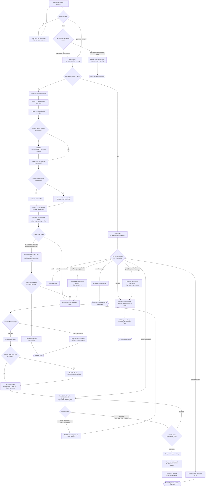

# Saga Work — Current Behavior Review

- **date:** 2026-08-27
- **subject:** the `/work` command shipped by the `saga` plugin
- **kind:** as-is behavior review (not a change proposal, plan, or code review)
- **saga version reviewed:** 0.143.0
- **repository commit:** `8269f84b` (`main`, up to date with `origin/main`, 0 commits behind)

---

## 1. Executive summary and current purpose

Work is the Saga lifecycle command that takes a **settled plan** and builds it. It answers the
question *"build it"* and carries the result all the way to a merged pull request. It does not decide
what the product should do (Brainstorm and the GitHub issue did that), and it does not decide how the
thing should be built (Plan did that). It executes, tests, gates, records, and coordinates.

Work is the widest command in the plugin. Where Brainstorm is a conversation that writes one Markdown
file, Work is a conversation that drives **nineteen Python programs**, writes **five different kinds
of durable artifact**, mutates a GitHub pull request and a project board, and performs a git merge.
It is the only Saga command that both writes the lifecycle work-state record *and* is allowed to merge
code.

The engine itself is still prompt text — 1,430 lines of Markdown across five files, with no hook and
no template engine. What makes Work different from the other Saga commands is that its prose is a
**driver script for real programs**. Almost every instruction is a named command-line call whose
behavior can be run and checked, and this review runs many of them.

Work's durable footprint is large and deliberately split by ownership:

- It **writes** the work-thread Saga record, a work-session Markdown file per phase, and
  (optionally) an evidence-ledger entry for the code review it ran.
- It **drives** GitHub through two mediating programs rather than calling `gh` freehand: a
  reconcile controller for board and issue-comment writes, and a ship ceremony for the
  pull-request lifecycle including merge.
- It **never** deploys, never files issues, and never advances the lifecycle phase past `work`.

Every outward mutation of GitHub is gated. Board status moves and issue progress comments run
without a prompt, but only because they are enumerated in a closed allowlist as reversible or
additive. Merge and branch-deletion are permanently operator-gated and refuse to run without an
explicit `--operator-confirmed` flag naming the exact transition.

**The three things an operator should know first:**

1. **The Claude Code Workflow backend can no longer be recommended, but a quarter of the skill still
   describes what to do when it is.** Section 1.5 of the skill — 247 lines, 27.6 percent of the whole
   file — governs the `cc-workflows-ultracode` backend. The helper that recommends a backend was
   narrowed under issue #808 so that it never returns that backend as `recommended` under any input;
   this review ran eight trigger combinations and got `inline` every time. Several instructions in
   the skill and its execution-strategy reference are written for a branch that can no longer fire.
2. **A mistyped test verdict is accepted at write time and silently disappears at read time.** The
   skill documents this honestly, and this review reproduced it: `saga.py save --gate-verdict
   "tests:pass:..."` exits 0 and persists the value, and the status card then renders the Tests row as
   `not-reached`. There is no save-time validation.
3. **The documented merge sequence stops one transition short of the ceremony's own terminal gate.**
   The ship ceremony's ordered transition table has eight entries ending in `teardown`; the skill
   names four post-merge invocations and does not mention `teardown`, which is the transition the
   ceremony's own `next_transition()` refuses to skip.

---

## 2. Authoritative source inventory, with installed-versus-source status

The Claude session running this review has `saga` version 0.143.0 installed at
`/Users/jefcox/.claude/plugins/cache/infiquetra-plugins/saga/0.143.0`. The plugin registry at
`~/.claude/plugins/installed_plugins.json` records that install as:

```json
"saga@infiquetra-plugins": [
  {
    "scope": "user",
    "installPath": "/Users/jefcox/.claude/plugins/cache/infiquetra-plugins/saga/0.143.0",
    "version": "0.143.0",
    "installedAt": "2026-06-28T16:58:41.591Z",
    "lastUpdated": "2026-08-28T01:44:25.485Z",
    "gitCommitSha": "8269f84b01065ac96d162431ce00ebd42003dd5f"
  }
]
```

That commit is the current tip of `main` in this repository, and the working tree is up to date with
`origin/main`.

### The five files that define Work's behavior

| Path | Lines | Bytes | Role | Installed vs. source |
|---|---|---|---|---|
| `plugins/saga/commands/work.md` | 27 | 1,580 | Slash-command stub; names the command, its description and argument hint, then loads the skill | Byte-identical |
| `plugins/saga/skills/work/SKILL.md` | 895 | 53,622 | The engine — core principles, phases 0 through 5, gate declarations, HALT conditions | Byte-identical |
| `plugins/saga/skills/work/references/execution-strategy.md` | 211 | 14,210 | How work gets executed — complexity triage, task list, subagent dispatch, backend recommendation | Byte-identical |
| `plugins/saga/skills/work/references/pr-continuation-loop.md` | 157 | 11,377 | The round-N pull-request state machine after PR-ready | Byte-identical |
| `plugins/saga/skills/work/references/test-and-gates.md` | 140 | 7,871 | What must pass before PR-ready — test discovery, the hard gate, staleness, the autonomy contract | Byte-identical |

Total: **1,430 lines, 88,660 bytes.**

**Drift status: none.** All five installed files are byte-identical to the repository source,
verified two independent ways — `cmp -s` and a SHA-256 comparison of each pair. Six shared files that
Work depends on (`scripts/saga.py`, `references/saga-spec.md`, `references/intent-envelope.md`,
`skills/code-review/SKILL.md`, `scripts/second_opinion.py`, `scripts/parse_issue.py`) are likewise
byte-identical. A full recursive `diff -rq` between the installed `0.143.0` tree and the repository's
`plugins/saga/` tree surfaced only three differences, none of them content:

```
Only in .../cache/infiquetra-plugins/saga/0.143.0: .in_use
Only in .../plugins/saga/hooks: __pycache__
Only in .../plugins/saga/scripts: __pycache__
```

The `.in_use` marker is the cache's own bookkeeping; the two `__pycache__` directories are local
Python bytecode in the checkout and are not git-tracked. `git status --porcelain -- plugins/saga`
returns empty.

**Sixteen stale saga versions remain in the live cache** beside the active one: 0.131.1, 0.135.0,
0.136.0, 0.138.0, 0.139.0 through 0.139.8, 0.140.0, 0.142.0, and 0.142.1. Only 0.143.0 carries the
`.in_use` marker. This is the same accumulation the Brainstorm review recorded; it is a cache-hygiene
observation, not a correctness one.

### There is no script and no hook that *is* `/work`

Work ships no executable of its own. The skill is prose that instructs the session to call other
programs. Nineteen of the twenty-one programs the skill names exist in the repository:

| Script | Lines | Named by Work for |
|---|---|---|
| `saga.py` | 1,719 | `scan` / `restore` / `save` / `spec-check` — the work-state spine |
| `parse_issue.py` | 137 | Phase 0.2 handoff routing and the risk flags |
| `lifecycle_state.py` | 553 | `recommend_execution_backend()` and `requires_hard_test_gate()` |
| `reconcile_controller.py` | 501 | Board status moves and the issue progress comment |
| `ship_ceremony.py` | 1,714 | Draft-PR start, PR open, review request, merge, branch delete |
| `issue_progress.py` | 173 | Rendering the issue progress comment body |
| `status_card.py` | 964 | The operator-facing `project_work` status card |
| `execution_spec.py` | 4,588 | Workflow emission, lease metadata, settlement metadata, `escalate_tier` |
| `workflow_emitter.py` | 214 | `reserve` / `attest` / `release` / `renew` on the frozen contract |
| `dispatch_settlement.py` | 2,066 | Spawn manifest, settlement receipts, dead-letter queue |
| `effort_ledger.py` | 263 | Per-unit effort escrow — escalate / record / report |
| `second_opinion.py` | 2,076 | The repeated-test-failure advisory second opinion |
| `adjustment_envelope.py` | 540 | The mid-run pause / drain / halt poll at each phase boundary |
| `intent_envelope.py` | 260 | The run-start spend posture resolver |
| `evidence_ledger.py` | 704 | Durable custody for the programmatic code-review result |
| `spec_table.py` | 321 | Rendering the spec table before emitting a workflow |
| `handoff_envelope.py` | 204 | Classifying a work-session path as `resume-ready` |
| `board_progression.py` | 598 | The certificate-gated idempotent board writer |
| `reversibility_certificate.py` | 576 | The closed allowlist that decides authorized-versus-gated |

Two named programs are **absent**, and that absence is correct — the skill names them only to forbid
them:

- `plugins/saga/scripts/engine_offer.py` — MISSING
- `plugins/saga/scripts/engine_session_runner.py` — MISSING

`SKILL.md:81-89` ("Reviewer-session transport") tells the session not to run either one. They were
retired by commit `844c133b`, *"feat(saga)!: retire the external-engine transport (#776)"*. The third
thing that section names, `plugins/saga/references/engine-registry.yaml`, **is still present** at 584
lines; the skill describes it as "capability metadata only", never a launch authority.

One script the skill names lives in a different plugin: `artifact_pointer.py` is at
`plugins/team-execution/skills/team-execution/scripts/artifact_pointer.py`, not under `plugins/saga/`.
`SKILL.md:670` names it bare as `artifact_pointer.py store` without a path.

### How the skill's 895 lines are spent

| Section | Lines | Share |
|---|---|---|
| Preamble and frontmatter | 21 | 2.3% |
| Position in the lifecycle | 14 | 1.6% |
| Core principles | 29 | 3.2% |
| Interaction method | 16 | 1.8% |
| Reviewer-session transport | 9 | 1.0% |
| Second-opinion triggers | 50 | 5.6% |
| Phase 0 — enter, scan, triage, round-N | 77 | 8.6% |
| Phase 1.1–1.4 — setup, task list, doc-review gate, backend and mint | 107 | 12.0% |
| **Phase 1.5 — `cc-workflows-ultracode`** | **247** | **27.6%** |
| Phase 2 — execute | 48 | 5.4% |
| Phase 3 — test gates | 18 | 2.0% |
| Phase 4 — record | 118 | 13.2% |
| Phase 5 — review gate, PR-ready, routing | 128 | 14.3% |
| Reference files | 13 | 1.5% |

The single largest section by a factor of two is the one governing a backend that is never
recommended and is reachable only by explicit invocation. The section that carries the hard test gate
— arguably Work's most consequential safety property — is eighteen lines.

---

## 3. User-visible entry points and prerequisites

### How an operator starts a work run

The slash command is `/work`. Its declared argument hint is `"[plan path or issue]"`, and the three
accepted input shapes are named at `SKILL.md:144-148`:

| Input | Example | What happens |
|---|---|---|
| A plan document path | `/work docs/plans/2026-08-27-thing-plan.md` | Read the plan, build the task list from its Implementation Units |
| A GitHub issue reference | `/work infiquetra/repo#42` | Run `parse_issue.py`, inspect the `handoff` object, route by maturity |
| A resume request | `/work resume` | Scan for a matching saga and restore it |

The command's `description` field also declares natural-language triggers, so a Claude session may
load the skill without the slash command being typed: *"build it"*, *"work this plan"*, *"execute the
plan"*, *"resume work on #N"*, or a `plan-ready` / `resume-ready` handoff issue.

If the input is empty, `SKILL.md:147-148` requires the session to ask — *"What should I build? Point
me at the plan doc, the issue, or say 'resume'."* — and forbids proceeding without an answer.

### Prerequisites

**Required for the command to work at all:**

- A git repository. Every phase past 1.1 assumes a branch, a merge base, and `git rev-parse`.
- Python 3 on the path. The nineteen scripts are invoked as `python3 plugins/saga/scripts/<name>.py`
  with repository-relative paths, so the session's working directory must be the repository root.
  `saga.py` resolves its storage root as `Path.cwd()` (`saga.py:1640`) with no override flag, so a
  run from the wrong directory writes its work-state somewhere else silently.

**Required for the intended entry path:**

- A settled plan. `SKILL.md:238-246` (Phase 1.3) blocks execution unless the plan cleared
  `/doc-review`, either in the same session or as an artifact under `docs/reviews/`. The block is
  overridable, but only with a rationale the session must record.

**Required for specific branches, not for the command:**

- `gh` (the GitHub command-line tool) for anything issue-, board-, or pull-request-shaped. A plan
  with no issue runs fine; `SKILL.md:265` and `SKILL.md:834` both say to skip the board move silently
  when there is no issue.
- The Claude Code `Workflow` tool, only when the operator explicitly invokes the
  `cc-workflows-ultracode` backend. Its absence is one of the two HALT conditions
  (`SKILL.md:466-470`).
- `CLAUDE_CODE_SESSION_ID` in the environment, again only on the workflow branch. `SKILL.md:349`
  requires a HALT if it is absent, and the shell snippet at `SKILL.md:352` enforces that with
  `test -n "$CLAUDE_CODE_SESSION_ID" || { echo "HALT ..."; exit 2; }`.

**Assumed but never checked:** that `AskUserQuestion` is available. `SKILL.md:67-68` says to call
`ToolSearch` with `select:AskUserQuestion` first if the schema is not loaded, and `SKILL.md:76-79`
gives a channel-session fallback in which the choices are inlined in reply text instead. There is no
third fallback for a session where neither path works.

---

## 4. Step-by-step current workflow, invocation to terminal outcome

Work is six phases, numbered 0 through 5. Phase 0 decides the *shape* of the run — in particular
whether this is a fresh build or a re-entry into an already-open pull request. That branch is the
single most important fork in the command.

### Phase 0 — Enter, scan the saga, triage, detect round-N (`SKILL.md:140-216`)

**0.1 Capture input.** Take the plan path, issue reference, or resume request from the command
arguments or the active artifact. Ask if empty; do not proceed without one.

**0.2 Issue handoff routing.** If the input is a GitHub issue, run `parse_issue.py` and read the
`handoff` object. The routing table is:

| Handoff maturity | Work's response |
|---|---|
| `plan-ready` | Proceed — this is what Work consumes |
| `resume-ready` | Proceed — this is what Work consumes |
| `idea-ready` | Tell the operator `/plan <issue>` is the correct upstream step |
| `requirements-ready` | Tell the operator `/plan <issue>` is the correct upstream step |

The upstream bounce is overridable: `SKILL.md:159-160` says *"unless they explicitly override the
missing plan step."* The parsed flags `has_security`, `has_infra`, and `has_api` are carried forward;
they feed both the backend recommendation in Phase 1.4 and the hard test gate in Phase 3.

**0.3 Saga scan — offer resume before minting.** Run `python3 plugins/saga/scripts/saga.py scan`
before creating anything. A candidate matches this thread if it shares the `issue_ref`, shares the
`plan_path`, or the operator says "resume this". For an issue whose `issue-<N>` directory is absent,
resolve through `state.json.sagas[*].issue_ref` ending in `#N`; the identifier is sticky and the
directory is never renamed (`SKILL.md:172-174`, citing saga-spec §2.1). A prior `/plan` run has
usually already minted this thread at `lifecycle_phase=plan`, and Work advances that same thread
rather than forking a second one.

**0.4 Round-N pull-request detection.** This is the fork. If the matched saga has a populated
`pr_refs`, the run is a **re-entry**, not a fresh build. Work reads the complete live pull-request
state in one call:

```bash
gh pr view <N> --json state,reviewDecision,mergeable,mergeStateStatus,statusCheckRollup,isDraft,mergedAt
```

and runs the transition table in `references/pr-continuation-loop.md` (reproduced in section 4.6
below). On a failure row it first runs the between-rounds tier escalation proposal — one rung, gated
on operator confirmation, end-clamped at the ladder top. When the run carries a committed intent
envelope, that escalation ask resolves through the posture registry rather than an ad-hoc question
(see section 7).

**0.5 Complexity triage.** Fresh builds only. `references/execution-strategy.md:9-17` sizes the run:

| Complexity | Signals | Action |
|---|---|---|
| Trivial | 1–2 files, no behavioral change | Implement directly, no task list |
| Small / Medium | Clear scope, under about 10 files | Build a task list from the Implementation Units |
| Large | Cross-cutting, 10+ files, or touches auth / payments / migrations | If it arrived as a bare prompt, recommend `/plan` first; honor the operator's choice |

A plan-document input has already been through `/plan` and `/doc-review`, so it skips the bare-prompt
bounce.

### Phase 1 — Setup, task list, backend (`SKILL.md:217-570`)

**1.1 Read the plan and set up the branch.** Read the plan completely and treat it as a decision
artifact, not an execution script. **Do not edit the plan body during execution** — progress lives in
git commits, the task tracker, and the saga. Decide the branch or worktree; never commit to the
default branch without explicit confirmation. Save the saga *while on the work branch* so the cached
`branch` value is a reliable fallback for a later standalone code review.

**1.2 Build the task list from unit identifiers.** Each of the plan's Implementation Units becomes a
task whose subject is prefixed with the unit's identifier (for example, `U3: add parser coverage`), so
blockers, deferred-work notes, and the final summary all stay anchored to the same identifiers the
plan and the saga use. Each unit carries forward its Goal, Approach, Files, Execution note, Patterns
to follow, Verification field, and Test scenarios.

**1.3 Doc-review gate.** Confirm the plan cleared `/doc-review` before executing from it. Block
execution otherwise, unless the operator explicitly overrides *and gives a rationale*, which flows
into the Phase 4 issue comment through `--doc-review-override`. Two explicit prohibitions:
`SKILL.md:244-246` forbids reinterpreting finding metadata to make that decision, and forbids
treating chat memory alone as durable evidence after a resume.

**1.3b Move the card to Active.** Work is starting, so the board card says so. This runs through the
shared reconcile controller, not through a direct `gh` call:

```bash
python3 plugins/saga/scripts/reconcile_controller.py reconcile \
  --op set-field-status --repo <owner/repo> --number <N> --target-state Active
```

The operations board's ladder is `Idea -> Shaping -> Ready -> Active -> Verify -> Done`. The
`set-field-status` operation is `reversible` with `always_operator=False`, so no prompt fires, and its
`target_state` is part of the idempotency key, so a repeated tick collapses to `skipped`. Read
`written` or `skipped` as success; `halt` or `gated` falls back to the operator-prompted path. Skip
silently when there is no issue.

**1.4 Offer the backend, then mint or advance the saga.** The plan may already have decided this.
`SKILL.md:267-276` says that if the plan carries a `backend:` frontmatter field, honor it and do not
offer — stating in one line which backend the plan chose and recording it exactly as though the
operator had picked it. The stated reason is specific: under `/orchestrate` this runs in a background
tab where an unanswered offer waits forever.

When the field is absent, Work computes a recommendation and offers a choice:

```bash
python3 plugins/saga/scripts/lifecycle_state.py recommend-backend \
  --file-count <N> --phase-count <N> \
  [--has-security] [--has-infra] [--cross-repo] [--deployment-sensitive] \
  [--needs-consensus] [--broad-fanout] [--adversarial-confidence] \
  [--workflow-shape <understand|design|research|review|migrate>]... \
  [--release-surface-file-count <N>] [--no-code-surface] [--no-workflow] \
  [--workflow-availability-source probed|asserted]
```

The offer renders **two** Saga backends, `inline` and `team-execution`. The third,
`cc-workflows-ultracode`, is never a default, never automatic, and never a generic interchangeable
choice; it is entered only by explicit invocation. Section 12.1 records what this review found when it
ran the helper.

Work then mints or advances the work-thread saga to `lifecycle_phase=work`, setting the identity keys
a standalone `/code-review` matches on:

```bash
python3 plugins/saga/scripts/saga.py save \
  --kind <issue|task> --id <issue-number-or-task-slug> \
  --issue-ref <owner/repo#N> --lifecycle-phase work --phase-status in_progress \
  --plan-path docs/plans/YYYY-MM-DD-<topic>-plan.md \
  --destination <plan-only|pr|merge|nonprod-deploy> \
  --orchestration-mode <inline|team-execution|cc-workflows-ultracode> \
  --orchestration-recommended <recommend_execution_backend() output> \
  --rounds-seen "1"
```

Immediately after the mint, when an `issue_ref` is set, Work offers to run `ship_ceremony.py start`,
which pushes the working branch and opens a **draft** pull request carrying the plan link, recording
`pr_refs` right away. Reaching "ship" later then flips that same draft ready instead of opening a
fresh pull request.

**1.5 The workflow backend, or HALT.** Entered only after explicit invocation. This is the skill's
largest section and its full protocol is: check spec freshness, mint an invocation identity, re-emit
the workflow script from the canonical spec, write a manifest and one spawn attempt per unit, launch
the `Workflow` tool, then settle every unit's result into a dispatch ledger. Its two HALT conditions
are the absent `Workflow` tool and any `spec-check` verdict other than `ok`. Section 7 covers the
gates; section 9 covers the recovery lines.

### Phase 2 — Execute phase by phase (`SKILL.md:571-618`)

Execute one meaningful phase at a time. Five behaviors govern the loop:

- **Execution strategy.** Inline, serial subagents, or parallel subagents, chosen from task count and
  dependency structure, and gated by the Parallel Safety Check.
- **Follow existing patterns.** Read the plan's referenced code first; grep for similar
  implementations before inventing.
- **Already shipped means verify, not reimplement.** If a unit's `Verification` is already satisfied
  by the current code, confirm it matches, mark it complete, and move on.
- **Incremental commits** per logical unit, with clean conventional messages and no attribution
  footers.
- **Simplify at phase boundaries**, after a cluster of units rather than after each one.

At each phase boundary the session polls the mid-run adjustment envelope
(`.saga/adjustment-envelope.json`). The poll decision governs the boundary — see section 7.

**The Parallel Safety Check** (`references/execution-strategy.md:57-70`) is a four-step mechanical
rule, not a judgement call:

1. Build a file-to-unit mapping from every candidate unit's `Files:` section.
2. Any path appearing in two or more units is an overlap.
3. Overlap **and** no worktree isolation available → downgrade to serial subagents, logging the
   reason.
4. Overlap **and** worktree isolation available → parallel stays safe; the overlap surfaces as a
   predictable merge conflict resolved in the post-batch merge.

### Phase 3 — Test gates (`SKILL.md:619-636`, `references/test-and-gates.md`)

Five gates, one of them blocking:

- **Test discovery** — find the existing tests for each changed file *before* implementing.
- **Scenario completeness** — confirm each feature-bearing unit covers happy path, edge cases,
  error and failure paths, and integration.
- **System-wide check** — trace two levels out through callbacks, middleware, and observers, and
  write at least one integration test through the real chain with no mocks for the interacting
  layers.
- **The hard gate** — `requires_hard_test_gate(change_kinds)` **blocks** PR-ready without tests when
  any change kind is risky.
- **Merge-base before tests** — fetch the base and run against the merged state, not stale local
  state.

The hard gate is the one mechanical blocker. Its implementation is five lines
(`lifecycle_state.py:111-115`):

```python
def requires_hard_test_gate(change_kinds: Sequence[str]) -> bool:
    """Return whether a change kind requires explicit tests before shipping."""

    risky = {"behavior", "security", "infra", "api", "deployment", "data"}
    return bool(risky.intersection(kind.lower() for kind in change_kinds))
```

### Phase 4 — Record (`SKILL.md:637-754`)

After each meaningful phase, three writes happen.

**4.1 Work-session writeup.** A concise `docs/work-sessions/YYYY-MM-DD-<topic>.md` naming what was
built by unit identifier, the key decisions, the files modified, the checks run, and the single next
step. This is the canonical durable home, and `handoff_envelope.py` classifies it as resume-ready.

**4.2 Save a saga tick.** A per-phase append carrying `lifecycle_phase=work` forward with the phase
number and status, the checks run, the work-session path, the files modified, the observed round set,
the gate verdict, and the one imperative resume anchor. List fields are full snapshots — pass the
complete current set each tick, never a delta.

**4.3 Issue progress.** `issue_progress.py` **renders** the comment; the reconcile controller
**posts** it. `SKILL.md:697-700` is explicit about why this split exists and what went wrong before:

> Rendering is not posting, and "hand it to `mission-control`" was for a long time the only
> instruction here — so nothing ran, and no lifecycle ever updated its issue.

The fix (commit `3d0046e8`, *"fix(saga): actually post the issue-progress comment (#757)"*) routes the
post through the controller rather than calling `mission-control issue comment` directly, because the
verb is a plain POST whose own docstring says the caller owns idempotency, and orchestrate retries
units by design.

**4.4 Autonomous board progression after merge.** Two allowlisted moves — status to Done, then the
sub-issue close — driven through the same reconcile controller with no prompt. The controller's
record JSON is a five-value vocabulary, and each value has a defined operator meaning:

| Record status | Meaning | Work's response |
|---|---|---|
| `written` | The move fired | Success; continue |
| `skipped` | Already applied, or nothing to converge | Success; continue |
| `corrected` | An outside actor moved the saga-owned Status field while Work was at rest; the controller re-asserted the saga-derived value | Reversible drift, handled |
| `halt` | An irreversible outside change (an issue reopened or closed under saga) | Surface the named `halt_reason`; fall back to the operator-prompted path |
| `gated` | The certificate withheld the operation — every merge and deploy, and any non-allowlisted operation | Fall back to the operator-prompted path; this is correct behavior, not a failure |

### Phase 5 — Code-review gate, PR-ready, continuation routing (`SKILL.md:755-882`)

**5.1 Run the code review programmatically and capture the reviewed commit.** Work calls
`/code-review` in `programmatic` / `report-only` mode. In that mode the review returns its structured
findings envelope to the caller and writes nothing durable — **the caller owns persistence**. Work
captures the commit at call time with `REVIEWED_SHA=$(git rev-parse HEAD)`.

**5.2 Read the gate input.** Deserialize the `review_result.v1` envelope. Its `outcome` is the sole
decision field. Optionally persist the result through the evidence ledger so the programmatic-mode
write gets the same no-clobber custody guarantee the interactive mode has.

**5.3 The outcome-driven gate.** Four typed outcomes, and they are the complete set:

| `outcome` | Gate result |
|---|---|
| `accepted` | Proceed to PR-ready even when findings remain, including Priority 2 findings |
| `repairs_requested` | **Block** PR-ready; route the consolidated fix requests through Work |
| `cycle_cap_best_available` | Proceed with the cycle-three best-available revision, surfacing every residual |
| `review_incomplete` | **Block** PR-ready and say the review did not run — do not invent acceptance |

Work does not recompute scores, inspect thresholds, or derive acceptance from findings. Finding
Priority and confidence are reporting metadata only. Separately and independently, a **stale** review
blocks PR-ready — that is a freshness decision, not an acceptance decision, computed directly against
Work's own captured commit with `git rev-list <REVIEWED_SHA>..HEAD --count`. A count greater than zero
means the code moved; re-run the review and capture a fresh commit before any pull-request or merge
offer.

**5.3b Move the card to Verify.** The same reconcile tick as 1.3b, with `--target-state Verify`.

**5.4 Reach PR-ready and present continuation routing.** Four steps:

1. Render the operator status header through `status_card.py` (`project_work`), the single emitter of
   operator-facing status for Work. The card derives its cells on read from durable state
   (`gate_verdicts`, `review_paths`, `pr_refs`, `phase_status`, `destination`) and renders as a
   fixed-position glyph card with an indexed footer pointing at the underlying evidence.
2. Offer to open the pull request and request review through `ship_ceremony.py run` — outward-facing,
   offered and confirmed, never auto-fired. If the operator declines, hand them the prepared body and
   branch.
3. Record `pr_refs`, set `next_step="await review on PR #N"`, and comment the status to the issue.
4. Present continuation routing **and pause**.

**5.5 The hard boundary.** Work builds, tests, gates, records, and coordinates the pull-request loop.
It does **not** silently mutate GitHub, does **not** own deploy or canary, does **not** file issues,
and does **not** advance `lifecycle_phase` past `work`.

### 4.6 The round-N pull-request transition table

On re-entry, the table in `references/pr-continuation-loop.md:29-40` is evaluated **in order** and the
first matching row wins:

| Pull-request condition | Work's action |
|---|---|
| `isDraft` is true | Offer "mark ready" before requesting review; do not request review on a draft |
| Open, `reviewDecision` empty or `REVIEW_REQUIRED` | **Pause** — set `next_step="await review on PR #N"`. No merge offer |
| Open, `CHANGES_REQUESTED` or unresolved threads | **Round N+1** — address the changes, re-run both gates, re-push, re-request review |
| Open, checks pending or failing | **Do not offer merge.** Route to fix if a check is red; pause if checks are still running |
| Open, not mergeable (`CONFLICTING` or `DIRTY`) | **Round N+1** — offer to rebase or resolve, re-run the gates, re-push |
| Open, approved, clean, mergeable, **stale** | **Re-run the code review** before any merge offer |
| Open, approved, clean, mergeable, **fresh** | If destination includes merge → offer the merge ceremony, explicitly confirmed. If destination is `pr` → set `status=done`, route to `/qa` advisorily |
| `MERGED` | Set `phase_status=complete`; route to `/qa` advisorily; leave `lifecycle_phase=work` |
| `CLOSED` unmerged | **Ask the operator** — pause or abandon — and save the chosen `status` |

Round bumps go through `--rounds-seen`, never through `next_round`, which is derived. Each round
re-enters Phases 2 through 5 with the round incremented and re-runs both gates from scratch —
re-verify, do not trust the prior round's evidence.

### 4.7 The flow



### 4.8 Terminal outcomes

Work has six ways to end, and only two of them are "finished":

| Terminal state | How it is reached | Durable marker |
|---|---|---|
| **Routed upstream** | An `idea-ready` or `requirements-ready` issue with no override | No saga write; the operator is told to run `/plan` |
| **Paused awaiting operator** | PR-ready reached, or the awaiting-review transition row | `next_step` set; `phase_status=in_progress` |
| **Paused or abandoned** | The pull request was closed unmerged and the operator chose | `status=paused` or `status=abandoned` |
| **HALT** | Absent `Workflow` tool, a bad `spec-check` verdict, an absent session identifier, a malformed adjustment directive, a settlement error | Named reason plus one recovery line; no silent fallback |
| **Done (destination `pr`)** | Approved, clean, fresh, and merge was not the destination | `status=done`; advisory route to `/qa` |
| **Done (merged)** | The merge ceremony ran under confirmation | `phase_status=complete`; board Done; `lifecycle_phase` **stays** `work` |

---

## 5. Inputs, outputs, durable artifacts, and side effects

### Inputs consumed

| Input | Source | How it is used |
|---|---|---|
| Plan document | `docs/plans/*.md` | Implementation Units, Key Technical Decisions, Requirements, per-unit Test scenarios, Scope Boundaries |
| Plan `backend:` frontmatter | The plan's own header | Honored without an offer when present (`SKILL.md:267-276`) |
| GitHub issue | `parse_issue.py` | Handoff maturity, source context, `has_security` / `has_infra` / `has_api` |
| Prior saga thread | `saga.py scan` / `restore` | Round, phase, checks run, next step, `pr_refs`, `orchestration_ref` |
| Live pull-request state | `gh pr view --json` | The seven fields that drive the transition table |
| Doc-review artifact | `docs/reviews/` or same-session output | The Phase 1.3 gate |
| Code-review envelope | `/code-review` programmatic return | `review_result.v1`, whose `outcome` is the sole gate decision |
| Adjustment envelope | `.saga/adjustment-envelope.json` | Per-boundary pause / drain / halt directive |
| Intent envelope | The run-start `spec.intent` | Spend posture for a tier escalation |
| Execution spec | The path in `orchestration_ref` | Re-emitted into a workflow script on the workflow branch |

### Outputs and durable artifacts

| Artifact | Location | Written by | Git-tracked |
|---|---|---|---|
| Work-session writeup | `docs/work-sessions/YYYY-MM-DD-<topic>.md` | Work, per phase | Yes |
| Saga tick | `.claude/saga/sagas/<saga-id>/<timestamp>.md` | `saga.py save` | **No** — ignored, machine-local |
| Derived saga index | `.claude/saga/state.json` | `saga.py save` | **No** |
| Second-opinion sidecar | `docs/work-sessions/YYYY-MM-DD-<topic>-second-opinion.json` | `second_opinion.py` | Yes |
| Emitted workflow script | `docs/plans/<topic>.workflow.js` | `execution_spec.py emit` | Yes |
| Lease / settlement metadata | `.saga/workflow-lease-*.json`, `.saga/workflow-settlement-*.json` | `execution_spec.py` | **No** |
| Workflow evidence files | `.saga/workflow-evidence-<id>/<unit>.json` | The driver session's adapter | **No** |
| Evidence-ledger entry | Ledger under `.claude/saga/` | `evidence_ledger.py write` | **No** |
| Effort-escrow ledger | Under `.claude/saga/` | `effort_ledger.py` | **No** |
| Git commits | The work branch | Work, per logical unit | Yes |

The repository currently holds **120** files under `docs/work-sessions/`, three of which are
second-opinion sidecars; **136** plan documents under `docs/plans/`, of which **four** carry a
`backend:` frontmatter field; **21** emitted `.workflow.js` scripts; and **20** `-spec.json` execution
specs.

`SKILL.md:673` and `references/execution-strategy.md:129` both forbid `git add` on the machine-local
state: *"never `git add` it."*

### Side effects on GitHub

| Effect | Mechanism | Prompted? |
|---|---|---|
| Board Status → Active | `reconcile_controller.py --op set-field-status` | No — reversible, `always_operator=False` |
| Board Status → Verify | Same, `--target-state Verify` | No |
| Board Status → Done | Same, `--target-state Done` | No |
| Sub-issue close | `reconcile_controller.py --op sub-issue-close` | No |
| Issue progress comment | `reconcile_controller.py --op issue-progress-comment` | No — tier `additive` |
| Draft pull request opened | `ship_ceremony.py start` | **Yes** — offered |
| Pull request opened / marked ready | `ship_ceremony.py run` `open_pr` | **Yes** |
| Review requested | `ship_ceremony.py run` `request_review` | **Yes** |
| **Merge** | `ship_ceremony.py run --operator-confirmed merge` | **Yes — permanently gated** |
| **Branch deleted** | `ship_ceremony.py run --operator-confirmed branch_delete:<branch>` | **Yes — permanently gated** |

### Side effects that do NOT occur

- **No deploy, no canary, no production-health revert.** All three belong to the `deploy` plugin.
  `references/pr-continuation-loop.md:118-127` records that gstack's `land-and-deploy` canary-verify
  and its first-run deploy dry-run were *relocated* to `deploy`, and says so explicitly so that they
  are "relocated knowingly, not dropped silently".
- **No issue creation.** `mission-control` owns that.
- **No lifecycle-phase advance past `work`.** The `work` → `qa` advance belongs to `/qa`.
- **No plan-body edits.** `SKILL.md:222-223` forbids them outright.
- **No undo ledger.** `SKILL.md:616-618` records that the undo ledger and `/undo` were removed in
  issue #666 — "never wired to any producer, never wrote a record" — and points ceremony rollback at
  `/ship --undo` instead.

---

## 6. Decision points, approval boundaries, stop conditions, and authority limits

### The authority ladder

Work's permissions are not a single posture. They are a three-tier ladder implemented in
`reversibility_certificate.py`, whose registry is a **closed allowlist that returns `GATE` by
default-deny** for anything not enumerated (`reversibility_certificate.py:65`).

| Tier | Operations | Behavior |
|---|---|---|
| `additive` | `issue-progress-comment` | Authorized without a prompt; idempotency key includes the leaf transition |
| `reversible` | `set-field-status`, `sub-issue-close`, `open_pr`, `request_review`, `checkout_main`, `pull`, `teardown` | Authorized without a prompt; each has a registered inverse |
| `always_operator` | `merge`, `branch_delete` | **GATE forced regardless of tier** (`reversibility_certificate.py:325`) |
| unenumerated | everything else, including deploy | Default `GATE` |

The comment at `reversibility_certificate.py:270-273` states the reasoning for merge directly: *"A
squash-merge has NO registered inverse — it is irreversible, which is exactly why ... GATEs this entry
unconditionally."*

### Every point where the run stops for the operator

`references/test-and-gates.md:114-124` enumerates the stop-for list, and it is the authoritative
statement of where Work pauses:

1. On the default branch with no branch decision made.
2. Merge conflicts that cannot be auto-resolved — show them.
3. In-branch test failures — fix before proceeding; do not push past a red suite.
4. The hard review gate firing (a blocking typed outcome, or a stale review) with no recorded
   override.
5. The hard test gate firing on a risky change kind with no tests and no recorded rationale.
6. Any outward GitHub mutation: pull-request open, review request, and merge are each explicitly
   confirmed.
7. A pull-request transition needing operator judgement — a closed-unmerged pull request, or an
   ambiguous saga match.

Three further stops live outside that list: the Phase 1.3 doc-review gate (`SKILL.md:238-246`), the
Phase 1.4 backend offer when the plan carries no `backend:` field, and the between-rounds tier
escalation proposal.

### Every point where the run explicitly does NOT stop

The never-stop-for list (`references/test-and-gates.md:126-134`) matters as much, because it is what
keeps the loop from asking fifty questions:

- Uncommitted in-branch changes — include them.
- Incremental-commit message wording — auto-compose conventional messages.
- Work-session content — auto-write.
- Choosing the *subagent* execution strategy (inline / serial / parallel). The reference is careful
  here: that is mechanical judgement, not an operator choice, and it is a different decision from the
  **backend** choice, which is surfaced.
- Re-running a verification step on re-entry, which is idempotent.

### The provenance guard — the single strongest safeguard

`SKILL.md:487-497` describes a mechanical guard inside `saga.py` that exists to catch one specific
failure: an AI substituting its own backend choice and recording it as the operator's. The guard
rejects a tick that newly asserts `orchestration_mode != orchestration_operator_choice` without an
`orchestration_downgrade` note justifying the divergence. The skill names the incident it was built
for — *"exactly the issue-38 shape (an AI swap masquerading as the operator's pick)"* — and describes
the guard as precise rather than blunt: it is a no-op when no operator choice is asserted, and it lets
an unchanged carry-forward of an already-vetted divergence through.

### The spend boundary

When the run carries a committed intent envelope, a tier escalation resolves through a posture
registry rather than an ad-hoc question. This review ran the resolver directly:

```
$ python3 plugins/saga/scripts/intent_envelope.py spend --run-mode attended --spend-increase
error: attended run: a spend increase requires an explicit operator approval token
(approval_token) — refusing to escalate spend silently

$ python3 plugins/saga/scripts/intent_envelope.py spend --run-mode unattended --spend-increase
  "action": "hold-at-default",
  "silent": true,
  "reason": "unattended run: spend increase held at the cache-tight default (no prompt)"
```

Both behaviors match the skill's description at `SKILL.md:200-206` exactly: an attended run needs the
operator's token, and an unattended run holds at the default silently, recording the held escalation
in the round summary instead of prompting.

### The iron law

`references/test-and-gates.md:136-138` closes the autonomy contract with the rule that governs every
claim Work makes:

> **Iron law:** no completion or "PR-ready" claim without fresh verification evidence. If code changed
> after the last test run, re-run before claiming the gate passed. "Should work now" / "I'm confident"
> / "I tested earlier" are not evidence — run it.

---

## 7. Delegation and reviewer behavior, model and session assumptions

### Three distinct delegation surfaces

Work delegates in three different ways, and they are governed by different rules.

**1. Subagent dispatch for build units** (`references/execution-strategy.md:72-101`). Work dispatches
the generic `Explore` and `Task` agents for judgement and code-authoring units, passing each unit's
Goal, Files, Approach, Execution note, Patterns, Test scenarios, and Verification, and preserving the
unit identifier in the dispatch and in everything reported back. Two operational rules apply:

- Named `ce-*` agents must not be referenced.
- The `mode` parameter must be **omitted** so the operator's own permission settings apply: *"do not
  pass `mode: 'auto'`"* (`references/execution-strategy.md:101`).

**2. Mechanical dispatch** (`references/execution-strategy.md:79-90`). Census, file-existence checks,
JSON validation, grep counts, and link checks go to the `mechanical-executor` agent, which is the one
delegation surface in Work that names a model: it "runs on haiku (cheap tier), is Bash-only, and is
op-discriminated". It is dispatched inline rather than as a parallel subagent, and it is inert until
called.

**3. Workflow-tool dispatch** (`SKILL.md:324-570`). On the explicitly-invoked workflow backend,
execution passes to the `Workflow` tool entirely. Phase 2's execution steps are not re-entered for
those units; Work resumes only for the Phase 3 gate, the Phase 4 record, and Phase 5.

### Sandbox posture

`plugins/saga/references/sandbox-spawn-sites.md` classifies every delegated spawn in the plugin into
three classes. Work's build spawns fall into the **default** class:

| Site | Rationale |
|---|---|
| Builder leaves (any unit whose job is to write code or docs) | R1 default: ambient × read-write. A builder leaf must write — sandboxing it would break its own contract. This is today's unsandboxed behavior, unchanged. |

Work is therefore **not** listed among the four in-scope skills (`code-review`, `qa`, `investigate`,
`resume`) that must pass `subagent_type: saga:readonly-verifier` and `isolation: "worktree"`. That
classification is deliberate and internally consistent: those four spawn agents whose job is to
*check*, and Work's spawn agents' job is to *build*.

### Reviewer behavior

Work runs no reviewer panel of its own. Its review gate is a **programmatic call to `/code-review`**,
whose typed `outcome` Work consumes without recomputing anything. The four-value outcome vocabulary is
defined in code at `review_consensus.py:102-107`:

```python
ReviewOutcome = Literal[
    "accepted",
    "repairs_requested",
    "cycle_cap_best_available",
    "review_incomplete",
]
```

`SKILL.md:809-812` draws the division of labor plainly: *"`/code-review` never changes reviewed code.
Work is the only mutator and applies any authorized repairs before resubmitting."*

There is also an **advisory** second-opinion path, triggered only by a repeated test failure. Its
contract is unusually tight: an attempt is recorded only after one applied fix and its following test
run; a rerun must reuse its attempt identifier and is a no-op; a pass resets every streak; a target
missing from a failed run resets only that target. On the first three-fix streak the session prints
exactly one line, which exists verbatim in the code (`second_opinion.py:1127`):

```text
Second opinion available: {target} failed after 3 fix attempts; dispatch an advisory second opinion?
```

`SKILL.md:135` records that there is **no** persisted preference file that suppresses this offer, and
`SKILL.md:126` says never to auto-dispatch. A decline records `declined`; no answer or an unattended
run records `unattended`; both proceed through the existing gates with zero runner calls.

### Reviewer-session transport is retired

`SKILL.md:81-89` is a nine-line prohibition: Orchestrate owns reviewer-session transport. Do not run
`engine_offer.py`, do not launch `engine_session_runner.py`, and do not consult
`engine-registry.yaml` as a launch authority. If a Work unit needs an external reviewer that is not
already a named unit in the Orchestrate run record, **HALT** — do not invent a custom review and do
not fall back to the retired runner. Two of the three named files no longer exist in the repository.

### Model and session assumptions

Work names **one** model tier anywhere in its 1,430 lines: haiku, for the mechanical executor. The
build-unit dispatch at `references/execution-strategy.md:72-78` names no model and no effort level.
The tier machinery Work *does* reference is the between-rounds escalation proposal, which climbs one
rung through `execution_spec.escalate_tier(tier)` — effort first, then model — gated on operator
confirmation and end-clamped when `escalate_tier` returns `None`.

Session assumptions:

- **`CLAUDE_CODE_SESSION_ID` is host-provided** and matches the hooks' trusted session identifier
  (`SKILL.md:349-350`). It arms the delegation tripwire and keys the integrity counter. Its absence is
  a HALT on the workflow branch, and a missing, empty, or control-character-bearing value halts the
  second-opinion path before the wrapper.
- **The saga identifier is never substituted for the session identifier** (`SKILL.md:351`).
- **A channel session cannot call `AskUserQuestion`** (`SKILL.md:76-79`), so choices are inlined in
  reply text following the convention in the Brainstorm skill.

---

## 8. Error handling, recovery, resume, cancellation, and idempotency

### Resume

Resume is Work's first-class path, not an afterthought. `SKILL.md:163-177` runs `saga.py scan` before
minting anything, and matches on `issue_ref`, `plan_path`, or an explicit operator confirmation. If
the matched saga carries `pr_refs`, the run re-enters the pull-request loop rather than rebuilding.
`references/pr-continuation-loop.md:147-151` is explicit that this does not depend on `/resume` being
rebuilt: *"A re-invocation of `/work` on a saga with `pr_refs` re-runs this transition table; that is
the durable loop."*

Three narrower resume mechanisms sit underneath:

- **Workflow spawn manifest.** `SKILL.md:397-402` says the `manifest` command is exact-replay
  idempotent, and that on resume the driver replays it and appends only the spawn attempts the ledger
  report proves are still absent.
- **Invocation identity.** `WORKFLOW_INVOCATION_ID` is minted **once** per logical launch and reused
  *only* after a crash or explicit resume; a later launch of the same unchanged spec must mint a new
  value (`SKILL.md:392-396`).
- **Second-opinion sidecar.** `references/pr-continuation-loop.md:53-60` requires loading and
  validating the sidecar before another fix or dispatch, and states that an existing
  accepted-or-requested identity *"is a replay guard, not permission to rerun the wrapper."*

### Cancellation and pausing

The mid-run adjustment envelope is the cancellation channel, polled at each phase boundary rather than
in a separate loop. `SKILL.md:606-618` maps each directive:

| Directive | Behavior |
|---|---|
| `drain` (operator `quiesce`) | Finish the in-flight unit, dispatch no new phase, surface the resume point |
| `halt` (`andon_halt` / `cancel` / `abort`) | Same stop, stronger precedence |
| `pause` (plan-declared `pause_after: <segment>`) | Halt **exactly** at that boundary; resume only on the explicit `acknowledge_pause(...)` signal; a matching `resume_tier` / `resume_context` amendment is applied to the next phase and recorded in the work-session writeup |
| malformed or unknown | **Fail closed** — halt and name the offending directive |

The implementation matches: `adjustment_envelope.py:268-276` documents the precedence as *"any halting
directive (andon/cancel/abort) beats a drain (quiesce) beats a pause"*, and
`adjustment_envelope.py:443-450` says `acknowledge_pause` *"Fails closed if there is no matching
unacknowledged pause (a continue with nothing to continue is an error, not a silent no-op)."*

Absent any `pause_after`, only irreversible actions pause. Reversible board, label, issue, branch, and
pull-request mutations proceed and are reported to the operator after the fact — and, importantly,
`SKILL.md:616-618` states plainly that they are **not** recoverable by a saga command, because the undo
ledger and `/undo` were removed.

### Idempotency

Work's idempotency guarantees are per-mechanism, and the skill is careful not to overclaim any of
them:

| Mechanism | Guarantee | Evidence |
|---|---|---|
| Reconcile tick | Repeated tick collapses to `{"status":"skipped"}`; `target_state` is part of the key | `SKILL.md:257-262`, `reconcile_controller.py:195` |
| Issue progress comment | Ledger collapses a repeat; `board_progression` stamps a marker into the body | `SKILL.md:701-711` |
| Spawn manifest | Exact-replay idempotent | `SKILL.md:400` |
| Dispatch settlement | **At-least-once, explicitly not exactly-once** | `SKILL.md:566-570` |
| Second-opinion attempt | A rerun reusing `attempt_id` is a no-op | `SKILL.md:100-103` |
| Verification steps on re-entry | Re-verify; only the actions are skip-if-done | `references/test-and-gates.md:134` |
| Ship ceremony | Position recomputed from the transition tuple on every read; no index is persisted | `ship_ceremony.py:31-33` |

The settlement honesty is worth quoting, because it is the sort of claim that is usually inflated
(`SKILL.md:568-570`): *"This is at-least-once and preserves the stable idempotency key; it is never
exactly-once delivery."*

### Error handling

**HALT is Work's primary error posture, and it is always paired with a recovery line.** The skill
lists four HALT recovery messages verbatim (`SKILL.md:472-482`), one per condition:

| Condition | Recovery line |
|---|---|
| `Workflow` tool absent | Resume in a session where the tool is present, or switch the backend to `team-execution` or `inline` |
| `spec-check` verdict `missing` or `file-missing` | Re-run `/plan` to author the spec and record the ref, then resume `/work` |
| `spec-check` verdict `run-id` | Re-record the spec path; the run handle belongs in `--orchestration-run-id` |
| `CLAUDE_CODE_SESSION_ID` absent | Named in the shell guard's own message |

`SKILL.md:483-485` names what HALT explicitly is *not*: it is not the off-host recompile-down path
(`recheck_orchestration_capability` in `lifecycle_state.py`), which is reserved for `/loop` and
`/resume`. The stated reason is that a guarantee-bearing ultracode choice should halt rather than
silently lose its parallel fan-out and refute-N verification.

**Fail-closed conditions in the second-opinion path** (`SKILL.md:104-107`): absolute paths, traversal,
unparseable targets, malformed sidecars, and over-cap history are all *visible* failures — do not offer
and do not dispatch. An unavailable, halted, timed-out, empty, or malformed response records
`unavailable` and lets the current verdict and next-fix decision proceed unchanged.

**Evidence forgery is settled as a no-op, not as success** (`SKILL.md:562-565`): *"Never pass agent
prose or a self-report as evidence: it settles as `silent-no-op`, not success. A missing structured
result is `silent-no-op`: the driver emits `null` and records the casualty."*

### The one place Work is documented to lose data

`SKILL.md:661-666` documents a silent-drop path in its own gate verdict recording:

> A non-canonical value (e.g. `pass`/`skip`) parses to *unknown* and the card renders the Tests cell
> as not-reached, silently dropping the verdict.

This review reproduced that behavior end-to-end. See section 11 and section 12.2.

---

## 9. Interaction with the wider Saga lifecycle

### Position

Work is the loop's execution hub. `SKILL.md:24-30` states the five-command sequence:

```
/plan            -->  "How should it be built?"        (writes plan + a lifecycle_phase=plan saga)
/doc-review      -->  "Is this plan ready to execute?"
/work            -->  "Build it."  + owns the PR loop to merge
/code-review     -->  "Is the built code safe to merge?"
/qa              -->  "Does the shipped thing actually work?"
```

Sixteen of the plugin's twenty-two skills and ten of its commands mention `/work` by name.

### Routes in

| From | Trigger |
|---|---|
| `/plan` | Plan written and doc-reviewed; the plan's own description names routing "to doc-review and /work" |
| `/loop` | A `plan-ready` or `resume-ready` maturity routes to `/work` (`loop/SKILL.md:113`) |
| `/resume` | The common case after forensic reconstruction is `/work` to resume the round-N loop (`resume/SKILL.md:277`) |
| `/handoff` | A `plan-ready` / `resume-ready` handoff issue |
| Direct | An approved ad-hoc request |

`/loop` is explicit that it does not reimplement Work: *"`/loop` never re-implements `/work`, `/plan`,
or a review, and never instructs a routed command's backend (`/work`'s Phase 1.4 offers its own)"*
(`loop/SKILL.md:43-44`).

### Routes out

| To | When | Binding? |
|---|---|---|
| `/plan` | An `idea-ready` / `requirements-ready` issue, or a large bare-prompt build | Overridable |
| `/code-review` | The Phase 5.1 pre-PR gate | **Binding** — its typed outcome is the gate |
| `/qa` | After merge, or on a clean `destination=pr` completion | **Advisory only** |
| `/handoff` | When the destination includes deploy — the ownership-transfer offer | Offered |
| `mission-control` | Issue comments and board moves | Mediated through the reconcile controller |
| `deploy` | Deployment mutation, dry-run, canary, production revert | Hard boundary |

### The qa-deferral, and why the saga sits at `work` after merge

This is the most easily-misread interaction in the lifecycle, and both sides now agree. Work leaves
`lifecycle_phase=work` on merge and routes to `/qa` advisorily
(`references/pr-continuation-loop.md:129-140`). `/qa` is the side that lands the advance: its own
description says it *"advances the saga qa-track on pass"*, and `qa/SKILL.md:60-61` states that it
restores the work thread, writes `qa_paths`, and on PASS advances `lifecycle_phase` from `work` to
`qa`. On FAIL it keeps `lifecycle_phase=work`.

The consequence, spelled out at `references/pr-continuation-loop.md:138-140`: the saga legitimately
sits at `work` after merge until `/qa` runs, and `/handoff` deriving `resume-ready` for that state is
correct — the thread *is* resume-ready-into-qa. That derivation is mechanical:
`handoff_envelope.py:36-37` returns `"resume-ready"` for any path containing `docs/work-sessions/`.

### Issues, boards, and milestones

Work never touches an issue or a board directly. Everything routes through
`reconcile_controller.py`, which composes the certificate-gated idempotent writer with a
level-triggered drift check that re-reads the live board on every tick. The operations board ladder
Work drives is `Idea -> Shaping -> Ready -> Active -> Verify -> Done`, and Work owns three of those
six transitions: Active at Phase 1.3b, Verify at Phase 5.3b, and Done at Phase 4.4.

`SKILL.md:752-754` states the boundary the controller does not widen: *"`/work` still does **not**
merge or deploy autonomously (permanently gated), and the controller never widens the
autonomously-writable set beyond what `board_progression` / `reversibility_certificate` already
establish."*

### Saga work-state

Work is the primary writer of the work-state record. The fields it owns:

| Field | When written |
|---|---|
| `lifecycle_phase=work` | Phase 1.4 mint / advance |
| `issue_ref`, `plan_path`, `branch` | Phase 1.4 — the identity keys a standalone code review matches on |
| `destination` | Phase 1.4 |
| `orchestration_mode`, `orchestration_recommended` | Phase 1.4 — recommended-versus-chosen telemetry |
| `orchestration_run_id` | After a workflow returns — never `orchestration_ref` |
| `phase`, `phase_status`, `checks_run`, `files_modified` | Phase 4.2, per phase |
| `work_session_paths` | Phase 4.2 |
| `gate_verdicts` | Phase 4.2 |
| `artifact_pointers` | Phase 4.2, when a team-execution run stored Layer-2 artifacts |
| `rounds_seen` | Phase 1.4 and every round bump |
| `pr_refs` | Phase 5.4, written by the ceremony's `open_pr` transition |
| `next_step` | Every pause |
| `status` | `done` / `paused` / `abandoned` at thread completion |

Two fields Work is forbidden to write: `next_round`, which is derived from `rounds_seen`, and
`operator_choice`, which it may never write to record its own substitution.

---

## 10. Tests and observable evidence supporting each behavior claim

### Automated tests that assert Work's behavior

The repository's suite collects **6,423 tests**. Forty-four of them target `/work` directly, spread
across seven files. All forty-four pass at commit `8269f84b`; the runs are recorded below.

| Test file | `/work` tests | What it asserts |
|---|---|---|
| `tests/test_work_second_opinion.py` | 9 | The whole second-opinion state machine: three-strike offer debounce, atomic `0o600` sidecar persistence, offer-expiry before any dispatch, one dispatch per accept |
| `tests/test_saga_second_opinion.py` | 5 | `second_opinion.py` no longer imports the retired transport, and `engine_offer.py` / `engine_session_runner.py` / `external_only.py` do not exist |
| `tests/test_saga_plugin.py` | 11 (of 53) | The mechanism floor for the rebuilt engine, plus the explicit-invocation-only backend contract |
| `tests/test_ship_ceremony.py` | 2 (of 104) | No raw ceremony git or `gh` command leaked back into the skill, and the skill still names `ship_ceremony.py` |
| `tests/test_mechanical_executor.py` | 3 (of 13) | The dispatch paragraph names the mechanical executor, its Bash-only scope, and its op-rejection behavior |
| `tests/test_team_execution_consensus_advisory.py` | 1 (of 14) | The gate reference carries all four typed outcomes, bans the obsolete priority vocabulary, and keeps freshness separate |
| `tests/test_saga_issue_progress_is_posted.py` | 4 | Phase 4.3 actually names the `issue-progress-comment` op and invokes the reconcile controller |

**The mechanism floor is the strongest of these.** `test_work_engine_merge_contract`
(`tests/test_saga_plugin.py:586`) asserts that the skill text still carries seven specific
mechanisms, not just the vocabulary describing them: a literal `saga.py save` block carrying both
`--lifecycle-phase work` and `--rounds-seen`; a runnable `recommend-backend` call with flags; a
`gh pr view --json` read containing `state` and `reviewDecision`; a `git rev-list <sha>..HEAD`;
an `issue_progress.py` call with `--commit-sha` and `--checks-run`; `--issue-ref` on the mint
alongside `git rev-parse HEAD`; and a content floor on each reference file
(`tests/test_saga_plugin.py:675-678`):

```python
for ref in ("execution-strategy.md", "test-and-gates.md", "pr-continuation-loop.md"):
    ref_path = work / "references" / ref
    assert ref_path.exists()
    assert len(_read(ref_path).splitlines()) >= 60
```

The comment above it names its purpose: *"Blunt thin-port tripwire — a vibes reskin would leave the
refs as stubs."*

**Two guards police what the skill must not contain.**
`tests/test_ship_ceremony.py:2023-2028` forbids raw ceremony commands from reappearing in the skill:

```python
pattern = re.compile(r"git (checkout|pull|branch -d)|gh pr (create|merge)")
assert not pattern.search(text), "raw ceremony git/gh commands leaked back into work/SKILL.md"
```

`tests/test_team_execution_consensus_advisory.py:187-203` polices the gate reference's vocabulary in
both directions — all four typed outcomes must be present in bold-code form, the obsolete priority
vocabulary (`P0`, `P1`, `Priority 0`, `Priority 1`, `P-level`) must be absent case-insensitively, and
the literal staleness command `git rev-list <REVIEWED_SHA>..HEAD --count` must appear.

**The regression test with the most instructive docstring** is
`tests/test_saga_issue_progress_is_posted.py`, whose header records that the earlier Phase 4.3 text
was *"prose with no command in it"*, and that two real lifecycles merged with zero issue comments
posted as a result.

**What the tests do not cover.** There is no version-or-metadata drift guard over the work skill —
nothing asserts a `work/SKILL.md` field against `CHANGELOG.md`, `plugin.json`, or
`marketplace.json`. There is no Mermaid check that applies, because the work doc set contains no
Mermaid fences. And no test asserts that a *run* of `/work` did anything; every guard listed above
inspects text or exercises a helper in isolation.

**Verification runs for this review:**

```
$ uv run pytest tests/test_work_second_opinion.py tests/test_saga_issue_progress_is_posted.py -q
22 passed in 1.05s

$ uv run pytest tests/test_saga_plugin.py -k "work or backend_offer or cc_workflows" --no-cov -q
11 passed, 42 deselected in 0.33s

$ uv run pytest <the 6 ship-ceremony/mechanical/gate tests> tests/test_saga_second_opinion.py --no-cov -q
11 passed in 0.33s

$ uv run pytest tests/ -q --collect-only
6423 tests collected in 16.65s
```

### Independently reproducible evidence gathered for this review

Every command below was run against the repository at commit `8269f84b`, read-only except for two
`saga.py save` calls executed inside a disposable scratch directory outside the repository (`saga.py`
resolves its storage root as `Path.cwd()`, so this writes nothing to the repository).

**Backend recommendation — the helper never recommends the workflow backend.**

```
$ python3 plugins/saga/scripts/lifecycle_state.py recommend-backend --file-count 2 --phase-count 1
{"recommended": "inline", "rationale": "no escalation signal -> the agent does the work itself", ...}

$ ... --file-count 12 --phase-count 5 --has-security
{"recommended": "team-execution", "rationale": "size/risk or consensus signal -> review consensus + gates fit", ...}
```

Eight further invocations, each naming a trigger the execution-strategy reference associates with the
workflow backend, all returned `inline`:

| Flags passed (with `--file-count 3 --phase-count 2`) | `recommended` |
|---|---|
| `--broad-fanout` | `inline` |
| `--adversarial-confidence` | `inline` |
| `--workflow-shape understand` | `inline` |
| `--workflow-shape design` | `inline` |
| `--workflow-shape research` | `inline` |
| `--workflow-shape review` | `inline` |
| `--workflow-shape migrate` | `inline` |
| all four combined | `inline` |

The function's own docstring (`lifecycle_state.py:225-231`) states this as a deliberate ruling:
*"Per the operator ruling C5 (issue #840), `recommend_execution_backend()` never returns
`cc-workflows-ultracode` with status `recommended` under any trigger."*

**Workflow availability is reported honestly.**

```
$ ... --no-workflow --workflow-availability-source probed
"backends": [..., {"backend": "cc-workflows-ultracode", "status": "unavailable",
                   "note": "Workflow tool unavailable (probed at offer time)."}],
"workflow_availability": {"available": false, "source": "probed"}
```

**An unknown workflow shape is rejected, loudly.** The CLI rejects it at argument-parse time:

```
$ ... --workflow-shape bogus
lifecycle_state.py recommend-backend: error: argument --workflow-shape: invalid choice: 'bogus'
(choose from 'understand', 'design', 'research', 'review', 'migrate')
```

The function raises `ValueError` for the same input when called directly (`lifecycle_state.py:265-268`),
so both entry points fail loud.

**The hard test gate matches its documentation exactly.**

| `change_kinds` | `requires_hard_test_gate` |
|---|---|
| `behavior`, `security`, `infra`, `api`, `deployment`, `data` | `True` (each) |
| `docs`, `config`, `trivial` | `False` (each) |
| `[]` | `False` |
| `["docs", "behavior"]` | `True` |
| `["banana"]` | `False` |

**`next_round` is derived, and cannot be set.**

```
$ python3 plugins/saga/scripts/saga.py save --kind task --id probe3 --next-round 4
saga.py: error: unrecognized arguments: --next-round 4

$ python3 plugins/saga/scripts/saga.py save --kind task --id probe4 --rounds-seen "1|2"
  "next_round": 3
```

**A bad gate verdict is accepted at write and dropped at read.** Two commands, run in sequence:

```
$ python3 plugins/saga/scripts/saga.py save --kind task --id probe2 \
    --lifecycle-phase work --gate-verdict "tests:pass:pytest-run"
{ "saga_id": "task-probe2", ... }        # exit 0 — accepted
```

Restoring that saga and rendering the work card through the shipped renderer:

```
gate_verdicts: ['tests:pass:pytest-run']
CardRow(key='tests', label='Tests', state=<CardState.NOT_REACHED: 'not-reached'>, ref=None)
```

The mechanism is visible in the source: `saga.py:1302-1305` raises `ValueError` for a state outside
the six canonical values, and `status_card.py:277-279` wraps the call in `except ValueError: continue`.
The validation exists; it simply runs at the wrong end of the write.

**`spec-check` reports the documented verdict.**

```
$ python3 plugins/saga/scripts/saga.py spec-check --saga-id task-probe4
{"saga_id": "task-probe4", "found": true, "verdict": "missing",
 "detail": "saga orchestration_ref is empty", "orchestration_run_id": ""}
```

**The ship ceremony's transition table has eight entries, not the four Work names.**

```
TRANSITIONS = ('commit', 'open_pr', 'request_review', 'merge',
               'checkout_main', 'pull', 'branch_delete', 'teardown')
next_transition('branch_delete') -> 'teardown'
next_transition('teardown')      -> None
```

The comment at `ship_ceremony.py:172-177` describes `teardown` as *"the terminal gate. Appended after
`branch_delete` so `next_transition()` structurally refuses to report the ceremony complete until it
has run (AC6 — no configuration bypass)."*

**Merge and branch-delete are gated in code, not only in prose.**

```
$ python3 plugins/saga/scripts/ship_ceremony.py run --help
  --operator-confirmed TRANSITION[:TARGET]
      name the always_operator-tier transition (merge, branch_delete) you are authorizing;
      required when the upcoming transition is always_operator-tier. branch_delete
      additionally requires the branch it will delete (--operator-confirmed
      branch_delete:<branch>, issue #635/KTD6); a bare 'branch_delete' refuses and prints
      the resolved target.
```

**The intent-envelope spend resolver refuses a silent escalation** — output quoted in section 6.

**The review outcome vocabulary is exactly four values**, defined at `review_consensus.py:102-107`
and schema-tagged `review_result.v1` at `review_consensus.py:98`.

### Repository census

| Measure | Value |
|---|---|
| Files under `docs/work-sessions/` | 120 |
| Second-opinion sidecars among them | 3 |
| Plan documents under `docs/plans/` | 136 |
| Plans carrying a `backend:` frontmatter field | 4 |
| Emitted `.workflow.js` scripts | 21 |
| Execution `-spec.json` files | 20 |
| Saga scripts Work names that exist | 19 of 21 |
| Installed-versus-source file differences | 0 |
| Stale saga versions in the plugin cache | 16 |

### What is NOT covered by executable evidence

Several of Work's most consequential behaviors are prose instructions with no mechanical enforcement,
and cannot be demonstrated by running anything:

- **That the session actually calls `/code-review` before opening a pull request.** Nothing blocks a
  pull request opened without the gate; the gate is an instruction.
- **That the session actually captures `REVIEWED_SHA` at review time.** The staleness computation is
  correct if the value is captured, and silently vacuous if it is not.
- **That the doc-review gate is checked.** It is a prose block with an override path.
- **That the plan body is not edited during execution.** A prohibition, not a lock.
- **That work-session writeups are actually written per phase.** The 120 existing files are evidence
  that the practice happens, not that it is enforced.
- **That the Parallel Safety Check runs before parallel dispatch.**

This is the expected shape for a skills-based plugin, and it is the same limitation the Brainstorm
review recorded. What differs here is scale: Work's prose drives real mutations of GitHub, so an
unfollowed instruction has a larger blast radius than an unfollowed instruction in a command whose
only output is a Markdown file.

---

## 11. Observed pain points, ambiguity, duplication, and missing safeguards

**These are observations of current behavior, not proposals.** Nothing in this section recommends a
change; each entry names what is true today and what an operator would experience.

### 11.1 A quarter of the skill governs a branch the recommender can no longer reach

Phase 1.5 is 247 lines, 27.6 percent of the skill, and it governs `cc-workflows-ultracode`. Under
issue #808 that backend became explicit-invocation-only, and under the operator ruling recorded in
`lifecycle_state.py:225-231` the recommender never returns it as `recommended`. Eight probe
invocations confirm this.

Several instructions are therefore written for a condition that cannot occur:

- `SKILL.md:52-53` — *"If the helper recommends it, **do not pre-select** it."*
- `SKILL.md:284-287` — *"If `recommended` is `cc-workflows-ultracode`, **do not pre-select** it —
  pre-select `team-execution` when a gated size/risk/consensus trigger fired, otherwise `inline`."*
- `references/execution-strategy.md:174-177` and `:196-199` — the same conditional, twice more.

`references/execution-strategy.md:180-186` goes further and still describes the *triggers* by which
that backend wins: *"broad-independent-fanout, an adversarial-confidence pass ... advisory consensus,
or any of the five `--workflow-shape` entries ... without elevated risk for `cc-workflows-ultracode`."*
None of those inputs produces that recommendation.

The operational consequence is not a wrong action — the instructions all resolve to "do not
pre-select it", which matches the actual behavior — but a reader cannot tell from the skill which of
these branches is live.

### 11.2 A mistyped test verdict is accepted at write and silently dropped at read

Reproduced in section 10. `saga.py save --gate-verdict "tests:pass:..."` exits 0 and persists the
value; `status_card.project_work` then renders the Tests row as `not-reached`. The validation function
`parse_gate_verdict` exists and is correct, but it runs only on the read side, where two call sites
(`status_card.py:277-279` and `status_card.py:794-797`) swallow its `ValueError` with `continue`.

The skill documents this honestly at `SKILL.md:661-666` — it is a known behavior, not a hidden one.
What is absent is a write-side check: nothing at save time tells the operator the verdict will not
survive.

### 11.3 The documented merge sequence omits the ceremony's terminal gate

`SKILL.md:857-864` and `references/pr-continuation-loop.md:97-101` both describe the post-merge
sequence as **four** `ship_ceremony.py run` invocations: `merge`, `checkout_main`, `pull`,
`branch_delete`. The ceremony's own ordered table has eight entries and ends in `teardown`, which
`next_transition('branch_delete')` returns and which the source comment describes as the terminal gate
that structurally refuses to let the ceremony report complete.

A Work run that follows the skill's four-call sequence literally leaves the ceremony one transition
short of its own definition of done.

### 11.4 Phase 3 carries Work's only hard blocker in eighteen lines

The hard test gate is the one mechanical safety property that blocks PR-ready on risk. Its section in
the skill is eighteen lines, 2.0 percent of the file, and it delegates to a reference. By contrast the
workflow-backend section is 247 lines. This is a proportion observation, not a claim that the gate is
wrong — `requires_hard_test_gate` behaves exactly as documented.

Related: the gate takes `change_kinds`, which the skill says to *derive* from the plan's unit types and
the parsed issue flags, with *"When in doubt, treat it as risky"*
(`references/test-and-gates.md:88-89`). That derivation is a judgement call with no recorded output —
nothing writes down which change kinds were derived, so a later reader cannot audit why the gate did or
did not fire.

### 11.5 Nineteen scripts, one of which is named without a resolvable path

`SKILL.md:670` instructs the session to record artifact pointers *"When a team-execution run stored
Layer-2 artifacts (`artifact_pointer.py store`)"*. Every other script in the skill is named with a
full repository-relative path prefixed `python3 plugins/saga/scripts/`. This one is bare, and the file
lives in a different plugin entirely, at
`plugins/team-execution/skills/team-execution/scripts/artifact_pointer.py`.

### 11.6 The engine-registry file survives its own prohibition

`SKILL.md:81-89` forbids consulting `engine-registry.yaml` as a launch authority and forbids running
two scripts. Both scripts were deleted. The 584-line registry file remains present, described as
"capability metadata only". An operator or agent encountering the file has only the skill's one-line
characterization to tell it apart from a live launch surface.

### 11.7 Board Status ladder prose is duplicated verbatim

The five-line paragraph beginning *"Board Status is part of a phase boundary, not only of the merge"*
appears twice in identical form, at `SKILL.md:249-256` (Phase 1.3b) and `SKILL.md:819-826`
(Phase 5.3b), each followed by the same "Skip it silently when there is no issue" sentence. Both
paragraphs also restate the six-rung ladder and the same `written`/`skipped` versus `halt`/`gated`
reading rule that Phase 4.4 states a third time.

### 11.8 Two named lifecycle mechanisms are described mainly by what they no longer do

Phase 1.5's lease protocol (`SKILL.md:355-375`) still runs `reserve`, `attest`, `release`, and `renew`
against `workflow_emitter.py`, and the skill explains four separate times that since issue #677 none
of them binds a lease: *"it validates the frozen contract and reports the retired, broker-free
outcome"*, *"there is no batch lease to renew ... it reports an empty result"*, and so on. The calls
are retained for protocol continuity. A reader must hold both facts — that the call is required, and
that it does nothing — to follow the section.

### 11.9 Build-unit delegation names no model or effort tier

`references/execution-strategy.md:72-78` dispatches `Explore` and `Task` agents for judgement and
code-authoring units with no model and no effort specified. The only tier named anywhere in Work's
1,430 lines is haiku, for the mechanical executor. The repository's own global instruction is that
every spawn gets an explicit model chosen by work shape and that inheritance is never the default; the
skill neither restates that nor supplies a tier.

### 11.10 The one-directional stop list has no matching "what was skipped" record

The stop-for and never-stop-for lists are clear, and several stops are overridable with a *recorded*
rationale, which flows into the issue comment through `--doc-review-override`. But the flag name is
`doc-review-override` for **both** the doc-review override and the review-gate override
(`references/test-and-gates.md:126-129` routes the review-gate override through the same flag). A
reader of the resulting issue comment cannot tell which gate was overridden.

### 11.11 Sixteen stale plugin versions in the live cache

Sixteen older saga version directories sit beside the active 0.143.0 in
`~/.claude/plugins/cache/infiquetra-plugins/saga/`. Only the active one carries an `.in_use` marker.
This is identical to what the Brainstorm review recorded and is a cache-hygiene observation with no
behavioral effect on the current run.

---

## 12. Open questions for the operator

1. **Is Phase 1.5 still meant to be Work's largest section?** It governs a backend that is
   explicit-invocation-only and never recommended. Is the intent that it stay in the skill at full
   length as the authoritative protocol for the rare explicit invocation, or does it belong in a
   reference file the way execution strategy, test gates, and the pull-request loop already do?

2. **Should `teardown` be part of the merge sequence Work documents?** The ceremony treats it as the
   terminal gate. The skill's four-call sequence does not name it. Which is the intended contract?

3. **Is the gate-verdict silent-drop acceptable as-is?** It is documented and known. The write side
   accepts anything; the read side drops what it cannot parse. Is the documentation the intended
   safeguard, or was a save-time check expected?

4. **Which gate does a `--doc-review-override` rationale in an issue comment refer to?** The flag
   carries both the Phase 1.3 doc-review override and the Phase 5.3 review-gate override.

5. **Should Work's build-unit dispatch name a model and effort tier?** Everything else in the fleet
   does. Work names only haiku, and only for the mechanical executor.

6. **Is `engine-registry.yaml` intended to stay in the repository** now that both scripts that
   consumed it have been deleted, or is its retention specifically about the capability metadata other
   commands read?

7. **Should the derived `change_kinds` be recorded anywhere?** The hard test gate's input is derived
   by judgement at Phase 3 and never written down, so a later reader cannot audit why the gate fired
   or did not.

8. **Four of 136 plan documents carry a `backend:` frontmatter field.** Is the expectation that new
   plans always carry it — making the Phase 1.4 offer the exception rather than the rule — or is the
   offer still the normal path?

---

## 13. Current-state behavior ledger

Every material claim in this review, mapped to the evidence that establishes it. "Executable" means
this review ran the command and observed the output.

| # | Claim | Evidence |
|---|---|---|
| 1 | Work is defined by five Markdown files totaling 1,430 lines | `wc -l` on the five paths |
| 2 | Installed saga 0.143.0 is byte-identical to source for all five files plus six shared dependencies | `cmp -s` and SHA-256 on 11 pairs; recursive `diff -rq` showing only `.in_use` and `__pycache__` |
| 3 | The install is pinned to commit `8269f84b0…`, which is the current `HEAD` | `~/.claude/plugins/installed_plugins.json`; `git log -1` |
| 4 | 16 stale saga versions remain in the plugin cache | `ls` of the cache directory; only 0.143.0 has `.in_use` |
| 5 | Work ships no script of its own and names 21 programs, 19 of which exist | Existence check over the named paths |
| 6 | `engine_offer.py` and `engine_session_runner.py` are absent, and the skill forbids running them | Existence check; `SKILL.md:81-89`; commit `844c133b` |
| 7 | `engine-registry.yaml` is still present at 584 lines | `wc -l plugins/saga/references/engine-registry.yaml` |
| 8 | Phase 1.5 is 247 lines, 27.6 percent of the skill | Heading line numbers from `grep -n '^## \|^### '` |
| 9 | Three input shapes: plan path, issue reference, resume request | `SKILL.md:144-148`; `commands/work.md` argument hint |
| 10 | `idea-ready` / `requirements-ready` issues bounce to `/plan`, overridably | `SKILL.md:150-162` |
| 11 | `saga.py scan` runs before minting, matching on `issue_ref` / `plan_path` / operator confirmation | `SKILL.md:163-177` |
| 12 | A populated `pr_refs` makes the run a re-entry into the pull-request loop | `SKILL.md:178-186` |
| 13 | The transition table is evaluated in order, first match wins | `references/pr-continuation-loop.md:27-40` |
| 14 | A plan's `backend:` frontmatter is honored without an offer | `SKILL.md:267-276`; `plan/SKILL.md:300` |
| 15 | 4 of 136 plan documents carry a `backend:` field | `grep -l '^backend:' docs/plans/*.md \| wc -l` |
| 16 | `recommend_execution_backend()` never returns the workflow backend as recommended | **Executable** — 10 invocations; `lifecycle_state.py:225-231` |
| 17 | An unknown `--workflow-shape` fails loud at both entry points | **Executable** — argparse rejection; `lifecycle_state.py:265-268` |
| 18 | `--no-workflow` marks the workflow backend `unavailable` with probed provenance | **Executable** |
| 19 | `requires_hard_test_gate` returns True for six risky kinds and False otherwise | **Executable** — 11 probes; `lifecycle_state.py:111-115` |
| 20 | `--next-round` is not an accepted flag; `next_round` is derived from `rounds_seen` | **Executable** — argparse rejection; `--rounds-seen "1\|2"` → `next_round: 3` |
| 21 | A non-canonical gate verdict saves successfully and renders as `not-reached` | **Executable** — save exit 0, `project_work` renders NOT_REACHED; `saga.py:1302-1305`; `status_card.py:277-279` |
| 22 | `spec-check` returns verdict `missing` on an empty `orchestration_ref` | **Executable** |
| 23 | The ship ceremony has 8 transitions ending in `teardown`; Work documents 4 post-merge calls | **Executable** — `TRANSITIONS` tuple; `next_transition('branch_delete') -> 'teardown'`; `SKILL.md:857-864` |
| 24 | `merge` and `branch_delete` require `--operator-confirmed`; `branch_delete` also requires the branch name | **Executable** — `ship_ceremony.py run --help`; `ship_ceremony.py:166-171` |
| 25 | The reversibility certificate is a closed allowlist returning GATE by default-deny | `reversibility_certificate.py:65`, `:325` |
| 26 | Merge has no registered inverse and is gated unconditionally | `reversibility_certificate.py:270-273` |
| 27 | The reconcile controller returns five statuses, of which `gated` and `halt` fall back to the operator | `reconcile_controller.py:189-199`; `SKILL.md:735-751` |
| 28 | Board status moves and the issue progress comment run without a prompt | `SKILL.md:257-262`, `:701-711`; `reversibility_certificate.py:182-258` |
| 29 | An attended spend increase refuses without an approval token; unattended holds at default silently | **Executable** — `intent_envelope.py spend`; `SKILL.md:200-206` |
| 30 | The adjustment envelope precedence is halt beats drain beats pause, and unknown fails closed | `SKILL.md:606-618`; `adjustment_envelope.py:268-276`, `:443-450` |
| 31 | The review outcome vocabulary is exactly four values under schema `review_result.v1` | `review_consensus.py:98`, `:102-107` |
| 32 | Staleness is computed against Work's own captured commit, not a stored field | `SKILL.md:757-771`, `:805-808`; `references/test-and-gates.md:100-113` |
| 33 | Dispatch settlement is at-least-once, explicitly not exactly-once | `SKILL.md:566-570` |
| 34 | Agent prose is never accepted as delivery evidence; it settles as `silent-no-op` | `SKILL.md:562-565` |
| 35 | The provenance guard rejects a tick asserting an unexplained backend divergence | `SKILL.md:487-497` |
| 36 | Work's build spawns are classified "default: ambient × read-write" because a builder must write | `references/sandbox-spawn-sites.md:17-19`, `:55` |
| 37 | Work names one model tier — haiku, for the mechanical executor | `references/execution-strategy.md:81`; absence elsewhere |
| 38 | Subagent dispatch omits `mode` so the operator's permission settings apply | `references/execution-strategy.md:101` |
| 39 | The second-opinion offer line exists verbatim in code | `second_opinion.py:1127` |
| 40 | Work leaves `lifecycle_phase=work` after merge; `/qa` lands the advance on PASS | `references/pr-continuation-loop.md:129-140`; `qa/SKILL.md:60-61`, `:332-343` |
| 41 | `handoff_envelope.py` classifies any `docs/work-sessions/` path as `resume-ready` | `handoff_envelope.py:36-37` |
| 42 | The undo ledger and `/undo` were removed; ceremony rollback goes through `/ship --undo` | `SKILL.md:616-618` |
| 43 | Deploy, canary, and production revert were relocated to `deploy`, deliberately | `references/pr-continuation-loop.md:118-127` |
| 44 | The repository holds 120 work-session files, 3 second-opinion sidecars, 21 emitted workflow scripts, 20 execution specs | Directory census |
| 45 | The Board-Status ladder paragraph appears verbatim twice | `SKILL.md:249-256` and `SKILL.md:819-826` |
| 46 | `artifact_pointer.py` is named bare and lives in the team-execution plugin | `SKILL.md:670`; `find plugins -name artifact_pointer.py` |
| 47 | The rendering-is-not-posting defect was real and is fixed | `SKILL.md:697-700`; commit `3d0046e8` |
| 48 | 16 of the plugin's 22 skills and 10 of its commands reference `/work` | `grep -rln '/work'` over skills and commands |
| 49 | The suite collects 6,423 tests; 44 of them target Work, and all 44 pass | **Executable** — three targeted runs (22, 11, 11 passed) plus `--collect-only` |
| 50 | The mechanism floor asserts seven named mechanisms plus a 60-line content floor on each reference | `tests/test_saga_plugin.py:586`, `:675-678` |
| 51 | A regex guard forbids raw ceremony git and `gh` commands from reappearing in the skill | `tests/test_ship_ceremony.py:2023-2028` |
| 52 | The gate reference's vocabulary is policed in both directions, including a ban on the obsolete priority terms | `tests/test_team_execution_consensus_advisory.py:187-203` |
| 53 | No version-or-metadata drift guard covers the work skill, and no test asserts anything about a real run | Absence across `tests/`; every work-targeted guard inspects text or a helper in isolation |

---

## Sources inspected

**Work's own files (all five, in full):**

- `plugins/saga/commands/work.md`
- `plugins/saga/skills/work/SKILL.md`
- `plugins/saga/skills/work/references/execution-strategy.md`
- `plugins/saga/skills/work/references/pr-continuation-loop.md`
- `plugins/saga/skills/work/references/test-and-gates.md`

**Saga scripts inspected in relevant part:**

`saga.py`, `lifecycle_state.py`, `status_card.py`, `ship_ceremony.py`, `reconcile_controller.py`,
`reversibility_certificate.py`, `review_consensus.py`, `intent_envelope.py`,
`adjustment_envelope.py`, `handoff_envelope.py`, `second_opinion.py`, `issue_progress.py`,
`evidence_ledger.py`

**Saga references:**

`saga-spec.md`, `intent-envelope.md`, `adjustment-envelope.md`, `operator-choice.md`,
`sandbox-spawn-sites.md`, `engine-registry.yaml` (existence and size only)

**Test files read and run:**

`tests/test_work_second_opinion.py`, `tests/test_saga_second_opinion.py`,
`tests/test_saga_plugin.py`, `tests/test_ship_ceremony.py`, `tests/test_mechanical_executor.py`,
`tests/test_team_execution_consensus_advisory.py`, `tests/test_saga_issue_progress_is_posted.py`

**Sibling skills consulted for the interaction map:**

`plan/SKILL.md`, `qa/SKILL.md`, `loop/SKILL.md`, `resume/SKILL.md`, `code-review/SKILL.md`,
`handoff/SKILL.md`

**Installed plugin bytes:**

`/Users/jefcox/.claude/plugins/cache/infiquetra-plugins/saga/0.143.0/` (full recursive comparison)
and `~/.claude/plugins/installed_plugins.json`

**Repository state:**

`git log`, `git status --porcelain`, and directory censuses of `docs/work-sessions/`, `docs/plans/`,
and `plugins/saga/scripts/`
