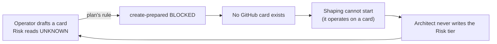

# Mission Control alignment — independent plan document review

> **Current verdict: accepted** (recheck cycle 2, assignment MC-ALIGN-06-RECHECK). The recheck
> findings are at the end of this document, under "Recheck cycle 2". Everything between here and
> that section is the cycle-1 review that produced the revisions-requested verdict, preserved
> unchanged as the record of what was asked for.

## Verdict — cycle 1 (superseded by the recheck)

**revisions-requested.** Two blocking findings, five non-blocking advisories.

Both plans are substantially strong. Every source pin in them is real and current, every code
location they name exists, all twenty-three test scenarios are covered, the required sequencing
(#999 before #1000) is strict, the shared file is serialized under one developer seat, and all five
of Jeff's settled readiness decisions for issue #942 are carried faithfully. Six of the seven oracle
reconciliations the Planner raised for my ruling are correct and well grounded in the pinned source.

The two blocking findings are both narrow and cheap to repair. Neither is a design failure.

1. **Blocking finding 1** — the plan's ruling that a Risk value of `UNKNOWN` blocks GitHub card
   creation contradicts the pinned software development lifecycle (SDLC) source, and makes a state
   that source explicitly documents unreachable. This is the one tradeoff the plan asked the Plan
   Reviewer to adjudicate, so a ruling is owed; my ruling goes against the choice the plan made.
2. **Blocking finding 2** — the finite test plan states that no test calls live GitHub, but its
   harness does not isolate the one seam that reaches the network, and one of its own twenty-three
   rows runs through that seam.

Neither finding can be deferred to implementation. The plan's own risk table forbids repairing an
oracle by weakening a test in code ("Amend plan and finite test oracle together only with a recorded
decision; do not weaken a test in code"), and the Test Author writes the finite tests *before* the
developer touches production. So both must be settled in these documents first.

---

## How this review was verified

Every factual claim below was checked against a current source, not against the plan's own assertions.

| What was checked | How | Result |
| --- | --- | --- |
| Candidate commit freshness | `git fetch origin main` then compared `HEAD` to `origin/main` | `HEAD` = `origin/main` = `ea7963a4`, zero commits behind |
| Pinned SDLC commit is real and current | `git cat-file -t` and `git rev-list --count 67845cdd..origin/main` in `infiquetra-sdlc` | Commit exists and **is the current tip** of `origin/main`, zero commits ahead |
| Schema file integrity | `git show 67845cdd:config/sdlc-schema.json \| shasum -a 256` | `5a8c0c93…65b7`, **matching the plan's claimed hash exactly** |
| Schema content claims | Parsed the schema JSON at the pinned commit | All verified, with one ordinal exception (advisory 1) |
| Every code location named in both plans | `grep` against the working tree at `ea7963a4` | All present |
| Every file path named in the custody ledger | Existence check, file by file | All twenty present; all five new test files correctly absent |
| Scenario coverage | Enumerated scenario headings in the Test Author document | Twenty-three scenarios, and all twenty-three appear in the finite matrix |

The session's start-up hook warned that this checkout was thirty-five commits behind its remote.
That warning was itself stale: after fetching, the working tree is exactly at `origin/main`. The
candidate pin `ea7963a4` is a live, current base, not a stale one.

---

## Blocking finding 1 — blocking card creation on an `UNKNOWN` Risk value contradicts the pinned SDLC source

**Where:** implementation plan, Key Technical Decision 5 (KTD5) and requirement R4; finite test plan,
oracle reconciliation 1 and the required outcome for scenario T1000-04.

**The plain claim:** the plan decides that a prepared card whose Risk field reads `UNKNOWN` may not
be created as a GitHub issue. The pinned SDLC source says the opposite — such a card *is* created and
then sits in the Planning stage until the Architect replaces the placeholder. Adopting the plan's
rule removes the only path by which a card can exist for the Architect to assess, because the
Architect writes the Risk tier during Shaping, and Shaping operates on a card that already exists.

**The evidence.** At the pinned commit `67845cdd`, the file `docs/process/card-schema.md` (lines
302–305) reads:

> **Validation**: Non-empty after placeholder filtering. `UNKNOWN` is the honest answer
> before the Architect has written the assessment, and it is accepted by the template —
> but a card whose Risk reads `UNKNOWN` is **not ready**: the readiness rule refuses to
> guess a tier, so the card stays in Planning until a real value replaces it.

A card that "stays in Planning" is a card that exists. The same file, immediately above that passage,
states that the Risk tier is written during Shaping and that "The Issue Reviewer checks it at the
Shaping exit". The schema's own field definition, in `issue_fields.fields.risk.template.description`
at the same commit, agrees: "Written by the Architect as part of the technical context; UNKNOWN until
then, and the card is not ready while it reads UNKNOWN."

The word doing the work in all three passages is **ready**, and in the SDLC it names the
Planning-to-Active readiness rule — a later, upstream gate interpreted by
`tools/docs/planning_readiness.py` and the home-lab card validator. It does not name Mission
Control's card-creation gate. The Architect's grounding document reached exactly this reading in its
Ruling 1000-5, and it read the source correctly.

**Why this is a real defect and not a preference.** The deadlock is concrete:

Under the plan's rule, Mission Control loses the ability to open the very card that the Architect is
supposed to shape. Under the SDLC's rule, the card is created, carries an honest `UNKNOWN`, and is
held out of Active work by the later readiness gate — which is precisely what that gate is for.

**The plan's own conflict rule resolves this against the plan.** The implementation plan states, in
its Problem Frame: "GitHub issue comments and the pinned source schema govern where old issue body
wording conflicts with Jeff's 2026-09-13 decisions." The wording the plan and the Test Author both
relied on is issue #1000's older acceptance line, "readiness still fails on `UNKNOWN`". The pinned
source schema and its card-schema document govern over that line, and they say the card is created.

**The cost of either option is identical, so correctness decides.** I checked the mechanics rather
than assuming them. The dataclass `PreparedReadiness` (`plugins/mission-control/scripts/sdlc_manager.py:4351`)
already carries a `warnings` list alongside `blocking_gaps`, and `issue_create_prepared` (`:5753`)
refuses only when `readiness.passed` is false. Recording `UNKNOWN` as a warning rather than a
blocking gap is a one-line difference. There is no engineering saving on either side.

**Required repair — either of these closes the finding:**

- **Preferred:** change KTD5 and requirement R4 so that a Risk value of `UNKNOWN` passes field-shape
  validation *and* passes the creation gate while recording a warning naming the missing Architect
  assessment; change scenario T1000-04's required outcome so that its second assertion expects
  creation to proceed with that warning, not to raise. Keep the first assertion — field shape accepts
  `UNKNOWN` — exactly as it is; that half is correct and schema-grounded.
- **Alternative:** keep the blocking rule, but record it in the plan as an explicit operator decision
  by Jeff that knowingly departs from `card-schema.md` at the pinned commit, with the departure and
  its reason written into the plan's Key Technical Decisions. A reviewer cannot grant this on Jeff's
  behalf; the plan asked for an assessment and this is the assessment.

Whichever is chosen, the implementation plan and scenario T1000-04 must move together, as the plan's
own risk table requires.

---

## Blocking finding 2 — the finite test plan's no-live-GitHub guarantee is not secured for the remote-first schema path

**Where:** finite test plan, "Summary and authority" ("No test here calls live GitHub, mutates a
board, or runs label synchronization") and "Pinned inputs and test harness"; scenario T999-04.

**The plain claim:** Mission Control resolves the SDLC schema from the network *first*, before it
reads its own vendored copy. The finite plan's harness names four things to patch, and the schema
resolver is not among them. There is no `conftest.py` covering the Mission Control plugin test
directory to catch it. One of the plan's own twenty-three rows runs straight through that path, so
its result depends on network reachability rather than on the change being tested.

**The evidence.**

- `_resolve_sdlc_schema` (`plugins/mission-control/scripts/sdlc_manager.py:341`) carries the
  docstring "Resolve sdlc-schema.json via GitHub main → vendored → local fallback", and at line 347
  it calls `gh api repos/infiquetra/infiquetra-sdlc/contents/config/sdlc-schema.json?ref=main`.
  `load_config` invokes it at line 277 for every caller.
- The finite plan's harness paragraph names `_rest_post`, `_rest_delete`, `_create_github_issue`, and
  unrelated `flow_set_field` calls. It does not name `_resolve_sdlc_schema`,
  `_VENDORED_SDLC_SCHEMA_PATH`, or the `_gh` helper underneath them.
- A guard fixture named `_no_live_gh` exists at `tests/conftest.py:66`, but that file sits in the
  repository-root `tests/` directory. The Mission Control plugin tests live at
  `plugins/mission-control/tests/`, which has **no** `conftest.py` — I checked. A pytest `conftest.py`
  applies to its own directory and below, so the root guard does not reach the plugin tests where all
  five new test modules are to be written.
- Scenario T999-04 requires "count-only WIP behavior asserted". That behaviour lives in `board_wip`
  (`:1445`), which reads `_wip_limits` (`:463`), which reads `config["sdlc_schema"]` — the
  network-first value.

**Why it matters beyond flakiness.** The pinned SDLC commit is the current tip of that repository's
`origin/main`, which is what the remote-first resolver fetches. So a live resolve today already
returns schema version `2026-09-07.5`, which has no `wip_limits` key at all. A test that reaches the
network can therefore observe the post-change schema *before the re-vendor has happened*, and report
green for a reason unrelated to the work under test. That is the false-green shape this repository
has been bitten by before, and it is worth closing in the plan rather than discovering in a test run.

**Required repair.** Add the schema-resolution seam to the finite plan's pinned-inputs and harness
section: name `_resolve_sdlc_schema` and `_VENDORED_SDLC_SCHEMA_PATH` (and the `_gh` helper) as
patch targets for any row that calls `load_config`, and point the Test Author at the working example
already in the suite — `plugins/mission-control/tests/test_project_mappings_resolution.py:37`
monkeypatches `_VENDORED_SDLC_SCHEMA_PATH`, and lines 160–217 of that same file exercise
`_resolve_sdlc_schema` under full isolation. The implementation plan already cites that file as a
pattern to follow in unit U1; the finite plan simply needs to say so in its harness rules.

---

## Non-blocking advisories

These do not hold the verdict. They are precision and completeness repairs worth making in the same
pass as the blocking findings.

### Advisory 1 — "the schema's fourteenth field is Risk" is an ordinal error

The implementation plan's Problem Frame (line 33) says "The schema's fourteenth field is `Risk`". At
the pinned commit, `issue_fields.fields` holds fourteen entries with `risk` at **position thirteen**
and `lifecycle_origin` at position fourteen. The schema's own migration note is explicit: risk is
"placed after verification and before the lifecycle_origin backpointer".

The *cardinality* claim elsewhere in the plan is correct and I verified it: KTD3's
"thirteen-versus-fourteen-field split" is exactly right, because the vendored copy at schema version
`2026-08-29` has thirteen fields and the source at `2026-09-07.5` has fourteen. Only the ordinal
phrasing is wrong, and the same phrasing appears in the Architect grounding and the Test Author
scenarios, so it is inherited rather than introduced here.

There is no implementation hazard, because field order is data-driven: `_required_contract_field_keys`
(`sdlc_manager.py:3972`) iterates `_CONTRACT_REQUIRED_MATRIX["axes"]["field"]`, which is data inside
the generated module that unit U2 copies wholesale from the pinned source. Order is inherited, never
authored. Suggested wording: "Risk is the field whose addition takes `issue_fields` from thirteen keys
to fourteen; the schema places it after Verification and before Lifecycle Origin."

### Advisory 2 — unit U5 leaves a decision in the conditional mood

Unit U5 says an explicit `--maturity` flag overriding a path-only fallback "**may** win". A plan that
claims to be decision-complete should not leave a modal open. The Architect's Ruling 942-5 is
definite: "Source carries no declaration (path fallback applied) and `--maturity` is given: the
declared value **wins**, classified through the owner." Change "may win" to "wins".

### Advisory 3 — the custody sentence in unit U2 describes a handoff that has no second party

Unit U2 reads: "The Dev holds exclusive `sdlc_manager.py` custody until U3 and then relinquishes it
before U5." The same developer seat, `w86:p9`, writes unit U5, so there is nobody to relinquish
custody to. Serialization is not violated — I checked every unit's writer and all six are `w86:p9` —
but the sentence will read as a contradiction to whoever implements it. Reword to the actual intent:
"#1000's edits to `sdlc_manager.py` complete at U3 before #942's U5 edits begin."

### Advisory 4 — one cell of the card-creation table is left implicit

Requirement R8 dispositions card creation for `pending-confirmation` (creatable, non-routable), for
blank and `unknown:*` declarations (blocked), and by implication for the four ready states. It does
not say whether a `deferred-context` card is creatable. The Architect's Ruling 942-6 table does say
so — draft written yes, `create-prepared` allowed, next action is the existing "clarify current
intent" sentence — and scenario T942-04 parametrizes all six states. Carry that row into R8 so the
implementation plan stands on its own without a reader chasing it into the grounding document.

### Advisory 5 — the fleet-core resolver returns a pair, not a path

Unit U5 says "Resolve the Saga root through
`fleet_commons_shim.load("plugin_resolution").resolve_plugin_root("saga", markers=(...), env_var="SAGA_ROOT")`".
The call itself is exactly right — I verified the signature at
`plugins/fleet-core/scripts/fleet_commons/plugin_resolution.py:130` and every keyword matches. But
the function returns `tuple[Path, int]`, the root paired with the resolution rung it was found on,
not a bare root. One clause naming the pair keeps the sentence accurate.

---

## What was verified and holds

This section records the checks that passed, so the Lead can see the review's coverage rather than
only its complaints.

### Sequencing — #999 strictly precedes #1000: **satisfied**

Requirement R11 states it. The unit table orders U1 (#999) first, U2 (#1000) second with "U1 accepted
at its local gate" as its required preceding unit, and U3 (#1000) third requiring U2. The finite
plan's execution order repeats the same sequence as gates 3 and 4, and gate 4 adds "No #942 writer
edits `sdlc_manager.py` until this phase is complete." The ordering is strict in both documents and
they agree.

The plan also sequences #942 *after* #1000 even though issue #942 does not depend on the schema.
KTD10 gives the reason — both touch the same file on the shared prepare spine. That is stricter than
the workspace plan required and is the safe direction.

### Serialized custody of the shared file: **satisfied**

The workspace plan requires that `plugins/mission-control/scripts/sdlc_manager.py` be serialized
under one developer seat. Every one of the six units names Dev `w86:p9` as sole production writer.
KTD10 forecloses adding a second writer. The one genuinely shared test file,
`tests/test_handoff_envelope_maturity.py`, carries an explicit two-stage custody protocol in unit U4:
the Test Author adds new parity cases first, then hands the file over, and the developer changes only
pre-existing assertions afterwards. Advisory 3 above is a wording problem in this area, not a custody
problem.

### Fidelity to Jeff's settled readiness decisions for #942: **satisfied on all five**

| Jeff's settled decision (workspace plan) | Where the implementation plan carries it | Assessment |
| --- | --- | --- |
| Reuse Saga-owned readiness implementation and vocabulary | R7, KTD7 — Mission Control obtains assessment and routing text from Saga's shared owner; local parser, local vocabulary, and the `requirements-ready` default are eliminated | Faithful |
| Preserve pending-confirmation and invalid/unknown non-routing | R8 — pending-confirmation, blank, undeclared, invalid, malformed, unreadable and other unknown states never produce a live `/plan` or `/work` route | Faithful |
| Saved issue drafts and Saga state files require explicit readiness | R8 and KTD8 — the sidecar JSON key `handoff_maturity` and the Saga state file's top-level `handoff_maturity` are the declaration carriers; absence yields `unknown:undeclared:<published>` | Faithful |
| Named-root containment, explicit external-source choice, consistent source identity | R9, KTD9 — bare out-of-root paths refused; the existing GitHub issue or pull-request URL and branch reference are the explicit external choices; the selected source is the published identity | Faithful |
| Missing or incompatible Saga stops readiness routing with no legacy fallback | R10 — a repairable dependency diagnostic, no legacy fallback, unrelated commands stay usable | Faithful |

I paid particular attention to the fourth decision, because the plan narrows "explicit external-source
choice" to mean a GitHub issue or pull-request URL, a branch reference, or an operator-selected
contained counterpart — and explicitly rules out reading an arbitrary file outside the named root.
That narrowing is not the Planner's invention: the Architect grounding reaches the same conclusion in
its section 4.7, reasoning that a new arbitrary-external-path flag "would be the 'arbitrary external
path' decision 3 forbids". Refusing to add a containment escape hatch is the reading that preserves
the decision rather than weakening it. I endorse it.

### Scenario coverage: **complete, twenty-three of twenty-three**

The Test Author document defines exactly twenty-three scenarios — four for #999, nine for #1000, ten
for #942. Every one of those identifiers appears as a row in the finite plan's closed scenario matrix,
each with a test file, an input and action, and a required outcome. The finite plan also states the
disposition rule correctly: every identifier resolves to `pass`, `fail`, or `blocked`, a blocked row
keeps its cause and owner and is never dropped from the denominator, and a gate timeout without a
terminal result is `blocked` rather than a pass.

Its handling of the one row that cannot pass early is also correct. Scenario T999-03 runs the whole
plugin suite, which is intentionally red during unit U1 because the #1000 and #942 tests are written
before the code they test. The plan defers that row's final disposition to unit U6 and warns against
mistaking it for a #999 failure. That is the right treatment and it is stated in both documents.

### Source pins: **all real, all current, hash-verified**

Both the plugin candidate and the SDLC source pin are live tips, not stale references. The schema's
SHA-256 in the plan matches the bytes at the pinned commit exactly. The plan's claim that the local
SDLC working copy is byte-identical to the pinned commit also holds.

### Oracle reconciliations: **six of seven correct**

The Planner raised seven places where the Test Author's scenarios and the Architect's grounding
disagree, and asked for a ruling on each.

| # | Subject | Ruling |
| --- | --- | --- |
| 1 | `UNKNOWN` at the creation gate | **Rejected** — see blocking finding 1 |
| 2 | The repair-window writer is a dedicated verb, not the project-field writer | **Accepted** |
| 3 | A blank or unknown assessment writes no draft at all | **Accepted** |
| 4 | External source means a GitHub URL, a branch, or a contained twin — not an arbitrary path | **Accepted** |
| 5 | Inject dependency failure at the resolver and the versioned owner interface | **Accepted** |
| 6 | Remove Mission Control's local maturity tuple rather than extending it | **Accepted** |
| 7 | Classification and command liveness are separate assertions | **Accepted** |

Three of these deserve a note on why they hold up.

**Reconciliation 2** redirects the repair-window label away from `flow set-field` to a dedicated
`flow repair-window` verb, against the Test Author's scenario text. The pinned schema settles it: in
`work_hierarchy.parent_stage_derivation.parent_outcome_state.own_verification_failed.repair_window_encoding`
the marker is named `repair-window`, it is a label added to `config/labels.json`, and the schema's own
`why_a_label` note says the encoding exists so there is "no fourth board field, no new Status, and no
parsing of prose". Requirement R5's "Never write a fourth project field for this label" is a direct
restatement of the source. The two cited events in R5 — open on a failing result, close only after a
later deployed version passes — match the schema's wording clause for clause.

**Reconciliation 3** changes scenarios T942-02 and T942-03 from asserting a non-routable next action
inside a draft to asserting that no draft is produced at all. That is not a weakening: it follows from
requirement R8's creation rule, and the original assertions could not be written as stated because
they inspect a draft that must not exist. The behavioural intent — fail closed, and name the class of
source in the diagnostic — is preserved.

**Reconciliation 6** is the strongest of the seven. The Test Author's scenario T942-10 asks that
`_HANDOFF_MATURITY_CHOICES` be extended to include `pending-confirmation`. The plan refuses and
requires the tuple be deleted outright. Extending it would leave Mission Control holding a second
copy of the vocabulary, which is exactly what Jeff's one-owner decision forecloses. I verified the
current state: the tuple at `sdlc_manager.py:4262` holds five values and omits `pending-confirmation`,
while Saga's `HANDOFF_MATURITIES` (`handoff_envelope.py:53`) holds six. Deleting the tuple is the
only repair consistent with the settled decision.

**Reconciliation 7** rests on a claim I checked in both directions, because it looks contradictory at
first reading. Saga's `ROUTABLE_MATURITIES` (`handoff_envelope.py:65`) is defined as every maturity
except `pending-confirmation`, so `deferred-context` is a member — and Saga's own `_suggested_command`
does emit a live `/issue --prepare` command for it. But Mission Control's `_suggested_next_action`
(`sdlc_manager.py:4803`) maps `deferred-context` to "Clarify current intent before planning or working
this issue", with no `/plan` and no `/work`, while the other four states map to live `/plan` or
`/work` commands. So the reconciliation's claim is precise as written: classification membership and
the liveness of a planning or execution command are two different properties, and they must be
asserted separately. The plan is right, and right for a subtle reason.

### Code and file references: **all present**

Every production symbol the plans name exists at the candidate commit: `_wip_limits` with its
hard-coded ten-and-five fallback and its `mount-olympus` legacy branch, `_HANDOFF_MATURITY_CHOICES`,
`_infer_maturity_from_path` with its `requirements-ready` default, `_PREPARED_FIELD_RISK` set to
`"Technical Risk"`, the `--risk` argument, the separate "Missing Asgard risk metadata" gate,
`sync_template_docs.py`, and Saga's `ResolvedSource`, `resolve_source`, `_read_frontmatter_maturity`,
`infer_maturity`, and `_maturity_diagnostic`. All twenty existing files in the custody ledger are
present; all five new test modules are correctly absent. The upstream queued Technical Risk item
exists in `infiquetra-sdlc/docs/engineering-journal/QUEUED.md`, which supports treating it as upstream
custody rather than editing it here.

The two stop-condition findings the plan reports are both real. `_wip_limits` genuinely has a live
reader in `board_view` (`:1232`) and `board_wip` (`:1445`), which is what issue #999 expected not to
exist, and the hard-coded fallback genuinely prints fictional limits. No production code reads
`component_slices`; only the vendored schema JSON still carries the key, which is what requirement R1
says. `work_hierarchy.components` exists in the source schema, as scenario T999-02 expects.

### Release metadata: **accurate**

Mission Control is at version 2.15.2 and Saga at 0.157.1, both in `plugin.json` and in
`.claude-plugin/marketplace.json`, so the plan's proposed bumps to 2.16.0 and 0.158.0 start from the
right place. A version drift guard exists at `tests/test_sync_marketplace.py`. Unit U6 correctly
requires the metadata, changelog, and journal entries to ship inside the same change as the behaviour
rather than being deferred to a separate release writer, which is what this repository's contributor
guidance requires.

### Authority boundaries: **correctly observed**

Both documents repeatedly and correctly state what they do not authorize. The implementation plan's
Summary calls itself "a planning artifact, not implementation approval or a review verdict"; its
holds section states that "Planning acceptance is not implementation, merge, deployment, or GitHub
issue closure"; the finite plan states that "Its accepted verdict is not implementation permission"
and that an implementation pass "never approves the plan retroactively". The separation between this
Plan Reviewer seat and the later Code Review seat is stated in both. Nothing in either document
claims authority it was not granted.

---

## Summary of required repairs

| # | Severity | Document | Repair |
| --- | --- | --- | --- |
| B1 | Blocking | Both | Change KTD5, R4, and scenario T1000-04 so an `UNKNOWN` Risk value warns and allows creation — or record an explicit Jeff override of `card-schema.md` at the pinned commit |
| B2 | Blocking | Finite test plan | Name `_resolve_sdlc_schema` / `_VENDORED_SDLC_SCHEMA_PATH` / `_gh` as harness patch targets; cite `test_project_mappings_resolution.py:37` as the working pattern |
| A1 | Advisory | Implementation plan | Correct "the schema's fourteenth field is Risk" to a cardinality statement plus the schema's stated position |
| A2 | Advisory | Implementation plan | Unit U5: "may win" becomes "wins", per Architect Ruling 942-5 |
| A3 | Advisory | Implementation plan | Unit U2: reword the custody sentence, which describes relinquishing custody to nobody |
| A4 | Advisory | Implementation plan | Requirement R8: state that a `deferred-context` card is creatable and non-routing |
| A5 | Advisory | Implementation plan | Unit U5: note that `resolve_plugin_root` returns a root-and-rung pair |

After the Planner repairs these within its own document custody, the same reviewer seat rechecks, as
the workspace plan requires. No implementation, test authoring, GitHub write, merge, deployment, or
card closure is authorized by this review in either direction.

---

# Recheck cycle 2 — assignment MC-ALIGN-06-RECHECK

**Date:** 2026-09-13 · **Reviewer seat:** `w86:p4` (same seat as cycle 1, as the workspace plan
requires) · **Candidate:** `ea7963a4bbf735b7179bd2d2605af740a1f8c2e7`

## Recheck verdict

**accepted.** Both blocking findings are resolved, all five advisories are resolved, and the repair
pass introduced no regression that I could find.

Both plans are now decision-complete and internally consistent. Every claim I re-verified against a
current source still holds, and the two repairs that mattered most are correct on their merits rather
than merely compliant with what I asked for.

## Pins re-verified before reading the repairs

A repair pass can move the base out from under a review, so I re-checked both pins first rather than
carrying the cycle-1 result forward.

| Pin | Re-check | Result |
| --- | --- | --- |
| Plugin candidate | `git fetch origin main`, compared `HEAD` to `origin/main` | Still `ea7963a4`, zero commits behind — unchanged from cycle 1 |
| SDLC source | `git rev-list --count 67845cdd..origin/main` in `infiquetra-sdlc` | Still the current tip, zero commits ahead |

Both documents grew during the repair pass — the implementation plan from roughly 29 KB to 30.4 KB
and the finite test plan from roughly 19 KB to 20.7 KB — which is consistent with additive repairs
rather than deletions.

## Blocking finding 1 — resolved

**What was required:** stop blocking GitHub card creation on a Risk value of `UNKNOWN`, and keep the
later Planning-to-Active refusal intact.

**What the repair did.** The rule was changed in all eight places it appears, not just the two I
named. I checked every occurrence of `UNKNOWN` in both documents; none of them now says creation is
blocked, and none contradicts another.

| Location | Repaired text |
| --- | --- |
| Requirement R4 | `UNKNOWN` "passes field-shape validation and the issue creation gate"; a warning names the missing Architect assessment; "The card stays in Planning because the later Planning-to-Active readiness gate refuses `UNKNOWN`" |
| Key Technical Decision 5 | "`UNKNOWN` is a valid Risk field value and does not block `create-prepared`", citing the pinned `docs/process/card-schema.md` and this review's blocking finding 1 |
| Unit U2, Approach | "Allow `UNKNOWN` through prepare and create-prepared with a warning … leave the card in Planning until the later Planning-to-Active gate receives a real tier" |
| Unit U2, Test scenarios | now names "the `UNKNOWN` creation-versus-Active-readiness distinction" |
| Unit U2, Verification | "`UNKNOWN` can reach the mocked create path with its warning" |
| Risk table | the old row is replaced by the genuine new residual risk — see below |
| Finite plan, reconciliation 1 | rewritten to follow `card-schema.md`; "This corrects the Test Author's creation-blocking oracle" |
| Finite plan, scenario T1000-04 | "Field shape and creation readiness pass; warning names Risk, UNKNOWN, and missing Architect assessment; mocked create runs once; created body retains UNKNOWN for the later Planning-to-Active gate" |

**The mechanism is right, not just the wording.** Having `_readiness_for_prepared_issue` *pass* with a
warning is what actually lets creation proceed, because `issue_create_prepared`
(`sdlc_manager.py:5753`) refuses only when `readiness.passed` is false. The repair says "passes the
issue creation gate with a warning", which is the correct seam.

**The new residual risk was identified rather than dropped.** The old risk row read "UNKNOWN creation
rule blocks pre-Architect cards" — the risk of the rule I rejected. A mechanical repair would have
deleted it. Instead the row was inverted to the real risk that the new rule creates: "An `UNKNOWN`
card is treated as Active-ready before Architect assessment", contained by asserting that the later
gate refuses it, with the rollback explicitly stating "do not block initial card creation". That is
the right residual risk and the right containment.

**I verified the gate the repair now depends on.** The repaired design leans on an upstream
Planning-to-Active gate refusing `UNKNOWN`, which is a new external dependency introduced by the
repair itself, so I checked it exists rather than assuming it:

- `tools/docs/planning_readiness.py` exists at the pinned SDLC commit `67845cdd`.
- Its line 397 states that "an absent or ``UNKNOWN`` value fails C4", and line 454 carries the
  diagnostic "card body carries the literal UNKNOWN token: an unsettled …".
- The schema's `dispatch_gates.planning_to_active_readiness.risk_scaling` block is `enabled: true`
  and sources the tier from `issue_fields.fields.risk`.

So the two gates are distinct, both real, and the card genuinely is held in Planning. The plan's
Scope Boundaries correctly continue to exclude the home-lab card validator and upstream tooling, so
this is an acknowledged upstream dependency rather than unscoped work.

**Adjacent oracles did not regress.** Scenarios T1000-01 and T1000-02 still require that a *missing*
Risk section blocks prepare and blocks create with `_create_github_issue` never called. Only the
`UNKNOWN` case moved. The two cases are now correctly distinguished rather than conflated.

## Blocking finding 2 — resolved

**What was required:** secure the finite plan's "No test here calls live GitHub" claim for Mission
Control's remote-first schema resolution.

**What the repair did.** A new row was added to the pinned-inputs table, and the harness paragraph was
rewritten. It names all three seams — `_resolve_sdlc_schema`, `_VENDORED_SDLC_SCHEMA_PATH`, and the
`_gh` helper — and applies them to "**every** test that calls `load_config`". Scenario T999-04's row
now carries the patches inline and requires its assertions be made "from worktree vendored bytes,
never live GitHub".

Three details make this a better repair than the one I asked for:

1. **It closes the false-green mechanism explicitly.** The harness now states: "At the red baseline
   this copy is `2026-08-29`; after U1 it must be `2026-09-07.5`. Never substitute the already-current
   remote source for the pre-U1 vendored copy." That is precisely the hazard — the pinned SDLC commit
   is already the remote tip, so an unisolated test could observe the post-change schema before the
   re-vendor happened and report green for the wrong reason. Naming it in the plan is stronger than
   naming the patch targets alone.
2. **It handles the resolver's own test correctly.** "A test of `_resolve_sdlc_schema` itself leaves
   that function real but patches both the vendored path and `_gh` to controlled results." Patching
   the function under test would have been the obvious mistake; the plan avoids it.
3. **It records the coverage gap as a standing rule.** "The repository-root `tests/conftest.py` guard
   does not cover `plugins/mission-control/tests`; these local patches are required even when the root
   suite also runs."

It also cites the working example I pointed at, with line numbers:
`plugins/mission-control/tests/test_project_mappings_resolution.py` line 37 for the vendored-path
patch and lines 160–217 for the resolver cases.

## Advisories A1 through A5 — all resolved

| # | Required repair | Repaired text | Verified |
| --- | --- | --- | --- |
| A1 | Replace the ordinal error with a cardinality statement plus the schema's stated position | "Adding `Risk` takes `issue_fields` from thirteen keys to fourteen; the schema places it after `Verification` and before `Lifecycle Origin`." | Matches the parsed schema exactly: `risk` at position thirteen, `lifecycle_origin` at fourteen. More precise than the upstream schema's own prose, which still calls risk "the fourteenth card-contract field" |
| A2 | "may win" becomes "wins" | Unit U5: "a differing declaration blocks, while an explicit override of path-only fallback **wins**" | Matches Architect Ruling 942-5 |
| A3 | Reword the custody sentence describing a handoff to nobody | Unit U2 Dependencies: "Under the same Dev seat `w86:p9`, #1000 edits to `sdlc_manager.py` complete at U3 before #942 edits begin at U5." | The word "relinquish" no longer appears anywhere in the document; the sentence now states the actual intent |
| A4 | State that a `deferred-context` card is creatable and non-routing | Requirement R8: "a `deferred-context` card is creatable with the existing 'clarify current intent' next action and no live plan/work route" | Matches Architect Ruling 942-6 and scenario T942-04; the creation table is now complete in the plan itself |
| A5 | Note that the fleet-core resolver returns a pair | Unit U5: "The resolver returns `tuple[Path, int]`: use the Path as the Saga root and retain the integer resolution rung as provenance." | Signature confirmed at `plugins/fleet-core/scripts/fleet_commons/plugin_resolution.py:130`. Retaining the rung as provenance goes beyond the fix and matches Saga's own pattern in `board_progression.py` |

## Regression sweep

Repair cycles introduce their own defects, so I checked the structural invariants rather than only the
changed lines.

| Invariant | Result |
| --- | --- |
| Scenario count | `scenario_count: 23` in frontmatter; 23 rows in the closed matrix; all 23 identifiers present and unduplicated |
| Oracle reconciliations | Still exactly seven, numbered 1–7 |
| Implementation units | Still U1–U6, same order, same child mapping |
| Requirements and decisions | Still 12 requirements and 10 Key Technical Decisions |
| Sequencing | Unit table unchanged: U1 (#999) precedes U2 and U3 (#1000), which precede U4 and U5 (#942) |
| Serialized custody | All six units still name Dev `w86:p9` as sole production writer |
| Exit criteria | Still "23/23 `pass`" |
| The no-live-GitHub claim | Retained, and now actually secured by the harness |
| Scope Boundaries | Unchanged, and still correctly exclude the home-lab card validator and upstream tooling |
| Scenarios T1000-01, T1000-02, T999-03 | Unchanged; no collateral movement from the T1000-04 repair |

I found no contradiction introduced by the repair pass, and no requirement or scenario silently
dropped or added.

## What remains true from cycle 1

Everything the cycle-1 review verified and passed still holds and was not re-litigated: the strict
#999-before-#1000 sequencing, the serialization of `plugins/mission-control/scripts/sdlc_manager.py`
under the single Dev seat, fidelity to all five of Jeff's settled readiness decisions for issue #942,
coverage of all twenty-three scenarios, the hash-verified schema pin, the six oracle reconciliations
that were already correct, and the accuracy of every code location and file path named in either
document.

## Recheck disposition

Both plans are **accepted**. No blocking findings remain and no advisories remain open.

Acceptance of these documents is not implementation permission. It does not authorize test authoring,
any GitHub or board write, a merge, a deployment, or the closure of issues #999, #1000, #942, or the
#1004 grouping. The next authorized step is the Lead's report to Jeff and whatever admission Jeff
then grants; the Test Author's finite test authoring and the Dev's production work each remain behind
their own gates, and the later Code Review seat reviews the exact committed revision under its own
separate authority.
