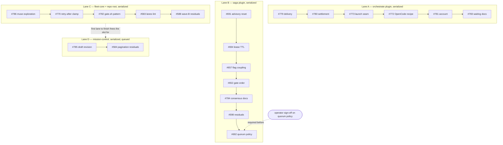

# [ORCHESTRATION] defects-claude-plugins unattended run — execution contract (20 issues, 4 lanes)

### Objective

One unattended Orchestrate run that drives every retained open issue in the Operations-board
Objective `defects-claude-plugins` to merged-and-closed, honoring the dependency graph, the
shared-file collision constraints, and the single operator decision gate below. This card is the
orchestration entry point: invoke `/orchestrate` on this issue.

### Intent

The Objective was audited and curated on 2026-08-24 (51 board members: 31 closed history, 20
retained open issues; #677 verified complete against the live tree and closed with evidence; three
contaminated bodies repaired; six cards refreshed with verified anchors and executable acceptance
criteria). Every retained leaf is decision-complete: problem, impact, evidence, owning surface,
exclusions, acceptance criteria, and verification live in the leaf. This parent adds only what a
single unattended run needs: ordering, lanes, collision rules, gates, and completion evidence.

### Authoritative inventory — the 20 sub-issues

| Lane | Order | Issue | Surface owned |
| --- | --- | --- | --- |
| A | A1 | #779 dispatch delivery confirmation | plugins/orchestrate/** |
| A | A2 | #780 evidence-based settlement | plugins/orchestrate/** |
| A | A3 | #773 single launch seam, no-focus invariant | plugins/orchestrate/** |
| A | A4 | #772 OpenCode variant recipe through Herdr | plugins/orchestrate/** |
| A | A5 | #781 company-account propagation | plugins/orchestrate/** |
| A | A6 | #783 waiting-patterns guidance | plugins/orchestrate/** |
| B | B1 | #691 advisory accumulator reset | plugins/saga/scripts/execution_spec.py |
| B | B2 | #694 workflow lease TTL (post-#677 shape — see its 2026-08-24 comment) | plugins/saga/scripts/execution_spec.py, workflow_emitter.py |
| B | B3 | #657 --workflow-available flag coupling | plugins/saga/scripts/outcome_dispatcher.py, outcome.py |
| B | B4 | #652 gate-before-resolve exit-code contract | plugins/saga/scripts/board_progression.py, reconcile_controller.py |
| B | B5 | #784 review_consensus.py API documentation | plugins/saga/scripts/review_consensus.py |
| B | B6 | #598 #433 re-panel residuals (items 1–2, 5; 3 deferred, 4 revisit hook) | plugins/saga/scripts/outcome_store.py, outcome.py, outcome_intent.py |
| B | B7 | #692 quorum policy at odd n — **OPERATOR DECISION GATE** | plugins/saga/scripts/execution_spec.py |
| C | C1 | #786 muse skills-install contract — **EXPLORATION, runs first** | docs/analysis/ (new), read-only muse CLI |
| C | C2 | #770 negative Retry-After clamp | plugins/fleet-core/scripts/fleet_commons/retry_backoff.py |
| C | C3 | #782 gate.sh long-run pattern | CLAUDE.md, scripts/gate.sh |
| C | C4 | #583 ownership-lanes lint wrapper/GraphQL blindness | scripts/check_ownership_lanes.py |
| C | C5 | #588 wave-B residuals (fixtures, shape lint, bandit scope) | scripts/, tests/, .github/workflows/ci.yml |
| D | D1 | #785 prepared-draft revision append-instead-of-replace | plugins/mission-control/scripts/sdlc_manager.py |
| D | D2 | #584 pagination + live-gate residuals | plugins/mission-control/scripts/sdlc_manager.py, board_census.py, scripts/check_pagination.py |

### Dependency graph



- `serialize` edges within each lane (same files / same plugin release surfaces), `after` only where
  a leaf builds on another's output: #772 builds on #773's enforced launch seam; #783 documents the
  surface A1–A5 finish; #694 follows #691 in the same file; #584 follows #785 because #785's
  validator fix changes the draft machinery #584's tests touch.
- Lanes are mutually independent — no cross-lane `after` edges exist.

### Parallelism, concurrency, and merges

- **Maximum safe concurrency: 3 worker sessions.** Lanes A, B, C start concurrently; Lane D queues
  and launches when the first lane finishes (account rate limits cap concurrent above-Haiku agents
  at 3).
- **Merges are serialized globally, one PR at a time**, in any order lanes produce them. Every
  plugin-touching PR bumps `.claude-plugin/marketplace.json` plus its plugin's `plugin.json` and
  `CHANGELOG.md`; sibling PRs with same-version bumps auto-merge silently — re-resolve the version
  at merge time for every PR (known trap; see repo memory of sibling version collisions).
- Every unit runs in its own worktree per Orchestrate's normal mechanics; no unit edits another
  lane's owned surface.

### Shared-file collision constraints (hard rules)

- `plugins/orchestrate/**` — Lane A only, strictly serialized.
- `plugins/saga/**` release surfaces — Lane B only, strictly serialized (B1/B2 and B7 share
  `execution_spec.py`).
- `plugins/mission-control/scripts/sdlc_manager.py` — Lane D only, D1 before D2.
- `.github/workflows/ci.yml` — #588 (C5) is the sole writer.
- `CLAUDE.md` — #782 (C3) is the sole writer.
- `.claude-plugin/marketplace.json` — every plugin PR touches it; resolved by global merge
  serialization above, never by parallel merge.

### Investigation and decision gates

1. **#692 (B7) is the only true operator gate.** It is a policy decision (odd-n quorum with missing
   refuters) that explicitly requires operator sign-off before any behavior change to the 36
   committed n=3 panels. The unit's task is: draft the DECISIONS entry with options, HALT, and wait.
   If sign-off does not arrive, the run completes 19/20 and parks #692 as awaiting-operator — that
   is a successful run outcome, not a failure.
2. **#786 (C1) is an exploration that runs first in its lane** — read-only against the muse CLI,
   findings doc only. If its verified contract demands a correction in another lane's surface, it
   files that follow-up per its own acceptance criteria; it does not edit other surfaces itself.
3. **#785 (D1) begins with root-cause investigation** (the append-vs-replace mechanism) — embedded
   in the leaf, no separate gate.

### Per-unit execution contract

For every leaf: implement to its own acceptance criteria; run its own Verification block; run the
repo gate (`scripts/gate.sh` — backgrounded per the pattern #782 lands; until C3 merges, background
it manually with output redirection); pass the repo-standard review gate on the PR; merge under the
global merge serialization; close the leaf with its evidence. Journal entries (LEARNINGS/DECISIONS)
ship in the same commit per repo rule where the leaf's mechanism warrants it.

### Completion evidence (run level)

- All 20 sub-issues closed with merged PRs (or 19 + #692 parked awaiting operator, stated in the
  run's closing comment).
- `scripts/gate.sh` exit 0 at the final merged HEAD.
- Operations board: every leaf at Status=Done, Objective unchanged (`defects-claude-plugins`).
- A closing comment on this parent linking every PR, plus per-lane wall-clock and any parked items.

### Review and stop conditions

- Stop a unit on any of its leaf-level stop conditions (#772/#773 carry explicit ones).
- Stop the run on: a cross-lane write to an owned surface; a marketplace version conflict that is
  not a trivial re-bump; the gate red at any merge point; any leaf's acceptance criteria requiring
  scope outside its owned surface.
- Never implement #692's code change without the recorded operator sign-off.
- No leaf is closed on "looks done" — only on its own verification evidence.

### Truthful handling of invalid, superseded, and completed candidates (curation record 2026-08-24)

- #677 closed as completed with live-tree verification (broker deleted, 0 importers, re-add guard
  present); NOT part of this run. Residual flag: #648 (outside this Objective) still needs its
  rewrite against the emit-time mechanism — operator decision.
- #645/#646/#647/#661 remain closed-superseded (their supersessor #677 completed, obligation
  discharged). #680–#683 board statuses corrected Shaping→Done (issues were closed).
- Bodies repaired for draft-front-matter contamination (#770 full dedup; #772/#773 strip) — each
  carries a repair note; originals in edit history. This contamination is live evidence for #785.
- #694 re-scoped by comment to the post-#677 world (broker renewal path no longer exists).
- No open member was found invalid, not-reproducible, or wrong-owner; every anchor re-verified at
  repo HEAD `818fd684` on 2026-08-24.

### Out-of-scope / non-goals

- The 31 closed historical members of this Objective; #648 (outside the Objective); anything under
  other Objectives; Herdr-core and `agents`-wrapper changes (dependency context routed to Home Lab
  System Updates); infiquetra-agent-plugins repo work.
- No new intermediate parent layers: one parent was deliberately chosen over per-lane parents —
  lanes are expressed as serialize edges here, and a second layer would fragment the single
  unattended run without improving file ownership.

### Files expected to change

Coordination card — the parent itself changes no code. The leaves own, exhaustively:

- `plugins/orchestrate/` (skills/orchestrate/scripts/orchestrate.py, SKILL.md, commands/orchestrate.md, release surfaces)
- `plugins/saga/scripts/` (execution_spec.py, workflow_emitter.py, outcome_dispatcher.py, outcome.py, board_progression.py, reconcile_controller.py, review_consensus.py, outcome_store.py, outcome_intent.py) + saga release surfaces
- `plugins/mission-control/scripts/` (sdlc_manager.py, board_census.py) + mission-control release surfaces
- `plugins/fleet-core/scripts/fleet_commons/retry_backoff.py` + fleet-core release surfaces
- `scripts/` (check_ownership_lanes.py, check_pagination.py, lint_test_shape.py, gate.sh), `CLAUDE.md`, `.github/workflows/ci.yml`, `tests/`, `docs/analysis/`
- `.claude-plugin/marketplace.json` (every plugin PR, merge-serialized)

### Tests to add or update

Each leaf carries its own test contract (see leaf bodies). Run-level: the full suite plus
`scripts/gate.sh` green at every merge; no reduction in collected-test count except where a leaf
explicitly deletes tests with its code.

### Acceptance criteria

- [ ] `gh api graphql` sub-issue query on this parent lists exactly the 20 issues in the inventory
      table — no more, no fewer.
- [ ] Every lane executed in its stated order; each leaf closed only with its own verification
      evidence and a merged PR (`gh issue view <n> --json state,closedByPullRequestsReferences`).
- [ ] `bash scripts/gate.sh` exits 0 at the final merged HEAD (run backgrounded; capture the result
      file).
- [ ] Operations board shows Status=Done for every closed leaf (
      `flow set-field`-verified or GraphQL-read), Objective still `defects-claude-plugins`.
- [ ] #692 either closed with the operator-signed DECISIONS entry, or parked awaiting-operator and
      named in this parent's closing comment.
- [ ] This parent's closing comment links every merged PR and records per-lane outcomes.

### Verification

```bash
# hierarchy: exactly the 20 inventory issues as sub-issues
gh api graphql -f query='query { repository(owner:"infiquetra", name:"infiquetra-claude-plugins") { issue(number: PARENT) { subIssues(first: 30) { nodes { number state } } } } }'
# run-level gate at final HEAD
bash scripts/gate.sh
# board state for the inventory
python3 <mission-control>/scripts/sdlc_manager.py flow set-field --help  # read path: GraphQL Status/Objective per leaf
```

### Context library links

- Curation record and source audit: /private/tmp/objective-curation-20260824/ and
  /private/tmp/plugin-transcript-audit-20260823/FINAL-REPORT.md (ephemeral working artifacts; the
  durable record is this issue body plus each leaf's 2026-08-24 curation comment)
- `docs/plans/2026-07-30-issue-677-lease-broker-retirement-plan.md` (completed predecessor campaign
  whose closure re-shaped #694)
- `docs/engineering-journal/DECISIONS.md`, `docs/engineering-journal/LEARNINGS.md` (per-leaf journal
  obligations)

### Handoff maturity

resume-ready

### Suggested next action

Invoke `/orchestrate` on this issue as the single entry point; the operator approves the table once,
then the run proceeds unattended except gate B7.

### Recommended Tier Band

opus/high for the coordinator; per-leaf bands are recorded in each leaf (A-lane and B1/B2/B7
opus/high; the remainder sonnet/high or sonnet/medium per leaf).

## Created Issue

- URL: https://github.com/infiquetra/infiquetra-claude-plugins/issues/787
- Number: 787
- Created at: 2026-08-24T05:09:17.195753+00:00

