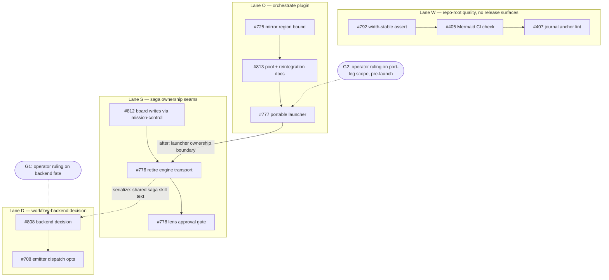

# improve-claude-plugins unattended orchestration execution contract

### Objective

One unattended Orchestrate run that drives every retained open issue in the Operations-board Objective `improve-claude-plugins` to merged-and-closed, honoring the dependency graph, the shared-file collision constraints, and the decision gates below. This card is the orchestration entry point: after the operator resolves every `PENDING OPERATOR DECISION` row below, invoke `/orchestrate` on this issue. **The run must not launch while any decision row is unresolved.**

### Intent

The Objective was audited live on 2026-08-24 against `origin/main` at `d8289513` and the Operations board: exactly eleven open cards carry Objective `improve-claude-plugins` — the eleven sub-issues below, no more, no fewer. These issues were recently curated (amended Phase 2 rulings of 2026-08-24/25); this contract performs no backlog rewrite. Eight bodies (#405, #407, #708, #725, #776, #778, #808, #812) were amended on 2026-08-24 solely to pass the mission-control card validator — section headers normalized, acceptance criteria made executable, scope unchanged, originals in edit history, each amendment documented by an issue comment.

**Hierarchy provenance:** #405 and #407 were native sub-issues of the closed historical parent #342 ("Enforce context-library standards at authoring time"). By operator ruling on 2026-08-24 they were unlinked from #342 and re-parented here so one coherent executable run owns all eleven; a provenance comment on #342 records the move. No duplicate execution-wrapper issues were created.

**Coordinator vs. run configuration — deliberately separate.** This contract was prepared by an already-running coordinator session on Claude Fable 5 at maximum effort on the Claude company account. That is the coordinator's configuration only. It pre-decides **nothing** for the run: every planning, worker, document-review, and code-review assignment is a per-run operator input in the decision table below, and none of them may be inherited from this coordinator, from run `orch-2026-08-24-787`, or from any other prior run.

### Authoritative inventory — the 11 sub-issues

| Lane | Order | Issue | Work | Surface owned | Depends on | Gate |
| --- | --- | --- | --- | --- | --- | --- |
| W | W1 | #792 | width-stable help-text assert (pre-push-gate unblock) | `tests/test_orchestrate_hygiene.py` | — | — |
| W | W2 | #405 | always-on Mermaid syntax check in CI + gate | `.github/workflows/ci.yml`, `scripts/gate.sh`, `scripts/`, `tests/` | serialize: W1 | — |
| W | W3 | #407 | journal lint: duplicate + dangling anchors | `scripts/lint_journal_order.py`, `tests/` | serialize: W2 | — |
| O | O1 | #725 | mirror embedded-region bound false positive | `plugins/orchestrate/**` (mirror.py, bounds docs) | — | — |
| O | O2 | #813 | per-run pool declarations + reintegration docs | `plugins/orchestrate/skills/orchestrate/SKILL.md` | serialize: O1 | — |
| O | O3 | #777 | portable Herdr agent-launcher plugin + Orchestrate refactor | `plugins/agent-launcher/**` (new), `plugins/orchestrate/**` | serialize: O2 | **G2** port-leg scope |
| S | S1 | #812 | Stage/Status corrections via Mission Control set-field | `plugins/saga/scripts/` board writers, `plugins/mission-control/**` | — | — |
| S | S2 | #776 | retire Saga external-engine transport | `plugins/saga/` engine subsystem + stage skills, `plugins/orchestrate/**` | after: O3; serialize: S1 | — |
| S | S3 | #778 | conditional-lens operator approval in Code Review | `plugins/saga/skills/code-review/**`, lens roster/catalog | serialize: S2 (shared code-review skill) | — |
| D | D1 | #808 | Claude Code Workflow backend fit decision | decision record; then `plugins/saga/skills/plan+work`, execution-spec surfaces | evidence phase read-only from start; implementation serialize: S2 (shared work-skill text) | **G1** operator ruling |
| D | D2 | #708 | emitter engine-dispatch opts inert in cc-workflows runtime | `plugins/saga/scripts/workflow_emitter.py`, `execution_spec.py` | after: D1 ruling | **G3** contingent shape |

Lanes W, O, S-head (#812), and D-head evidence (#808 audit) start concurrently at run start. `after` marks a true data/ownership dependency; `serialize` marks shared-file exclusion only.

### Dependency graph



Edges exist only where the issue bodies assert them: #776 is written to be implemented against #777's launcher ownership boundary; #708's implementation shape is contingent on #808's ruling; #776 and #808 both touch saga work-skill text; #776 and #778 share the code-review skill. No other cross-lane dependencies exist — do not invent them.

### Operating context and proportionality

- This repository is a **single-user developer-tool plugin suite operated by Jeff**.
- Do **not** design for multi-tenancy, internet-scale load, high availability, regulated environments, or hostile co-tenants unless a leaf explicitly requires it.
- Choose the **smallest change that fixes the verified defect** and satisfies the leaf's acceptance criteria. Reuse existing repository mechanisms.
- A new abstraction, service, background process, persistent state, lock/lease/retry framework, dependency, compatibility layer, generalized refactor, cross-plugin change, or extra operator workflow is permitted **only when the plan names the current in-scope failure it prevents and why a smaller change cannot work**.
- Security and reliability findings must name the **actual trust boundary or failure mode and its concrete consequence**. Hypothetical scale or enterprise posture is not a finding.
- This does **not** relax justified safeguards around credentials, shell/process execution, filesystem or Git mutation, external input/APIs, privacy, or destructive operations.

Enforcement rides the existing phases: the run-wide plan's per-unit proportionality record, the doc-review finding-disposition ledger, and lens applicability inside the Saga Code Review contract. No new phase, lens, framework, or gate.

### Operator-decision table — every per-run input, required before launch

Nothing below is inherited from run `orch-2026-08-24-787`, from the coordinator session, or from any prior run. Evidence notes are recommendations with their basis; **every row remains PENDING OPERATOR DECISION until the operator records a choice in a comment on this issue** (the launch gate greps for the marker).

| # | Input | Decision | Evidence-based note (not a selection) |
| --- | --- | --- | --- |
| 1 | Saga Plan session: vendor · model · effort · account; cap 1 | **PENDING OPERATOR DECISION** | One run-wide plan covering all 11; precedent shows plan quality upstream of everything (the 787 doc review found 17/17 genuine findings including one P0 misdirection). Cap stays 1 regardless of vendor. |
| 2 | Saga Doc Review: vendor · model · effort · account; exactly one broad review, cap 1 | **PENDING OPERATOR DECISION** | The property that earned its keep in precedent was reviewer independence from the plan's author (different vendor), not any specific vendor. |
| 3 | Work pools, priority-ordered: per pool vendor · model · effort · account · simultaneous cap; deterministic dispatch + overflow-to-next-pool rule | **PENDING OPERATOR DECISION** | With four lanes the steady-state ready-unit count is ≤ 4, so pool 1's cap effectively decides whether lower pools ever engage; 787's pools 2/3 went unexercised (fallback dispatch remains unvalidated, n=1). Declare only pools accepted as real capacity; closeout must state which pools went unexercised. Claude-vendor pools must respect the operator's standing account rate-limit rule (max 3 concurrent above-Haiku Claude sessions; 6 only when all-Haiku). |
| 4 | Saga Code Review: vendor · model · effort · account · **process shape** · max concurrent | **PENDING OPERATOR DECISION** | Installed orchestrate (1.20.7) enforces **exactly one review-controller unit per run**. Process options: (a) one controller reviewing frozen revisions serially — simplest, honest to the driver, throughput-bound; (b) direct validated-template review sessions per frozen revision — 787 ran 20 this way successfully, but it is an improvised pattern outside the driver's ledger; (c) controller + operator-authorized direct seats. Each review must record the frozen SHA it reviewed; one process per frozen revision, never a duplicate. |
| 5 | Herdr workspaces: names · max concurrent sessions per workspace · deterministic overflow rule | **PENDING OPERATOR DECISION** | Orchestrate guidance: one workspace is right below ~6 concurrent units; one lifecycle per workspace above that. Precedent used lane-home workspaces + numbered overflow with a hard per-workspace cap of 6 (total, not per-vendor). |
| 6 | Authority: merge · board-write · cleanup · deployment | **PENDING OPERATOR DECISION** | Recommended shape: merges auto under serialized queue only on typed `accepted` (or the chosen cycle-cap policy) + CLEAN merge state + green CI; board writes exclusively via mission-control `flow set-field` (the single-writer policy #812 enforces; run bookkeeping already conforms); cleanup evidence-gated to run-owned resources; **no deployment authority** — this run ends at merged main + closed issues; the deploy plugin's tag-promotion is out of scope. |
| 7 | Saga review contract for this run + any run-specific override | **PENDING OPERATOR DECISION** | Installed saga is 0.139.7 (includes the #692 missing-aware quorum fix). Precedent contract shape available for adoption: per-lens ≥ 9.0 acceptance with the 7.0 dimension floor, no averaging, ≤ 3 repair-and-review cycles, delta-scoped reruns, typed terminal outcomes with `cycle_cap_best_available` non-blocking but fully disclosed, `repairs_requested`/`review_incomplete` blocking. Adopt, adapt, or replace explicitly — and state the conditional-lens selection the run supplies to each review so it stays unattended (the #778 behavior this run itself ships). |
| 8 | G2 — #777 port-leg run scope (see Gates) | **PENDING OPERATOR DECISION** | Options with consequences under Gates below. Decide before launch; it changes lane O's tail and the run's completion definition for #777. |

Sessions run on the **installed** plugin versions recorded at S0 (mid-run merges to saga/orchestrate/mission-control do not change run behavior unless plugins are updated mid-run, which is a stop condition). Installed-at-audit: orchestrate 1.20.7, saga 0.139.7, mission-control 2.12.2 — identical in both plugin trees (`~/.claude-company` and `~/.claude`) and equal to repo main.

### Owned files and collision surfaces (hard rules)

- `.claude-plugin/marketplace.json` — every plugin-touching PR (O1–O3, S1–S3, D1-impl, D2). Resolved **only** by global merge serialization + version re-resolution at merge time; sibling same-version bumps auto-merge silently (known trap) — re-bump at merge time.
- `plugins/orchestrate/**` — writers #725 → #813 → #777 → #776, strictly in that order. `skills/orchestrate/SKILL.md` is the four-way shared file.
- `plugins/saga/**` — writers #812 → #776 → #778 → #808-impl → #708, serialized merges. Same-file overlaps: code-review skill (#776, #778); plan/work skill text (#776, #808); `execution_spec.py` (#808, #708).
- `plugins/mission-control/**` — #812 sole writer.
- `plugins/agent-launcher/**` — created by #777, sole writer.
- `.github/workflows/ci.yml` and `scripts/gate.sh` — #405 sole writer.
- `scripts/lint_journal_order.py` — #407 sole writer.
- `tests/test_orchestrate_hygiene.py` — #792 sole writer.
- `docs/engineering-journal/LEARNINGS.md` / `DECISIONS.md` — append-only; newest-first ordering guard applies (a PR-only CI step); #808's decision entry plus per-leaf journal obligations.
- `CLAUDE.md` — **no writer in this run.**

### Merge serialization rules

- Merges are **serialized globally, one PR at a time**, in whatever order lanes produce them.
- Each merge requires: the typed review outcome per decision row 7, `mergeStateStatus` CLEAN (treat GitHub merge state as eventually consistent — confirm a suspicious DIRTY with a real local merge before declaring a blocker), and green CI on the PR head.
- **Immediately after every merge**, every surviving branch that shares a changed surface fetches and merges `origin/main` (the run's declared authoritative integration target) and re-resolves release-surface versions before continuing.
- GitHub CI is authoritative over any session-local gate; a local green never overrides red CI. Verify CI **on main at the final merged commit**, not only on the last PR (a lesson the precedent run's closing record missed).
- Lane W's three PRs touch no release surfaces and still merge through the same serialized queue.

### Source pinning and repository freshness

- Audit base: `origin/main` = `d8289513` (2026-08-24). S0 re-records the current pin at launch.
- FIRST ACTION of every unit and reviewer: `git fetch origin && git merge origin/main`; re-anchor file/line references from the merged state.
- Record per unit: base SHA, frozen reviewed SHA(s), merged SHA. A stale or dirty revision is never reviewed or merged.

### Settlement and waiting

Settle only on durable evidence: a commit on the unit branch, an open PR tied to the child issue, a typed review outcome naming its frozen SHA, or a typed park record. Herdr `idle`/`done`/quiet panes locate where to look; they prove nothing (orchestrate `settle`/`wait` are evidence-based since #780). Bounded waits only, via the three supported shapes: `orchestrate.py wait` / `herdr agent wait` / `herdr pane wait-output` with timeouts; `gh pr checks --watch` detached, reading exit status; backgrounded commands whose completion notifies. Never chained sleeps.

### Gates — human decisions, parked durably

1. **G1 (#808, mid-run): Claude Code Workflow backend fate.** The unit gathers the inventory and evidence, drafts the DECISIONS entry with keep / narrow / replace / retire options and costs, then **HALTs**. Park shape: non-terminal artifact (draft PR or decision-record comment), linked `Relates to #808`, never a closing keyword; the needed decision and no-decision consequence stated. Resume only on a recorded operator ruling (a durable comment). If no ruling arrives, the run completes with #808 — and therefore #708 — parked awaiting-operator: **9 of 11 closed is a successful run outcome**, stated in the closing comment.
2. **G2 (#777, pre-launch): port-leg scope.** #777's final criteria include porting the accepted plugin into `infiquetra-agent-plugins` — work outside this repository. Options: (a) **in-run port** — the run gains a cross-repo tail unit in a second checkout (largest scope; precedent runs were single-repo); (b) **Claude-side only** — the run delivers the plugin + Orchestrate refactor and parks #777 open at "Claude side complete, port pending" with evidence (run closes 10 of 11 at best if G1 also parks: state it plainly); (c) **pre-approved smallest amendment** moving the port criterion into a linked `infiquetra-agent-plugins` issue so #777 can close in-run on Claude-side evidence. Decide before launch.
3. **G3 (#708, contingent): post-ruling shape.** If the G1 ruling removes the emitter's engine-dispatch surface, #708's disposition (close-as-mooted vs. narrowed fix) **returns to the operator** — the run parks it with the evidence rather than closing it unilaterally.

### GitHub fields and board writeback

Designated writer: mission-control `flow set-field` (single-writer policy; #812 migrates saga's internal call sites to the same seam). Live Status vocabulary confirmed 2026-08-24: Idea / Shaping / Ready / Active / Verify / Done. Leaf → `Active` at unit launch; → `Done` at merge+close; parent → `Active` at run start and closes with the closing record. Objective stays `improve-claude-plugins` on all twelve cards throughout. Field option IDs rotate — discover live at S0, never cache. Closing GraphQL sweep (issue states + Status + Objective) is the acceptance check.

### Fresh preflight (S0) — mandatory at launch, receipts in the opening comment

Recorded receipts age; S0 re-validates everything immediately before launch and **stops on unexplained drift** (no launcher repair or run redesign inside preflight without separate authorization):

1. **Source pin:** `git fetch origin && git rev-parse origin/main` — record the launch base SHA.
2. **Installed plugins, both trees:** versions of orchestrate / saga / mission-control / fleet-core in `~/.claude-company/plugins/...` AND `~/.claude/plugins/...` (registry-skew check — the trees have diverged before); resolve skew before launch; freeze plugin updates for the run.
3. **Hierarchy + board:** the sub-issue query returns exactly the 11; `flow validate-card` green on parent + children; Objective readback on all twelve; Status options enumerated live.
4. **Launcher:** `which agents`; `agents --help` Tools section lists every chosen vendor (never `--crews`); `orchestrate.py roster` and `roster --probe` clean.
5. **Catalogs + flags per chosen vendor:** pin full model ids from the live catalogs; validate effort tokens against installed help. Per-vendor syntax (installed skill, re-verify at S0): claude `--model`/`--effort`; codex `--model`/`-c model_reasoning_effort=`; grok `-m`/`--reasoning-effort`; muse `--model`/`--reasoning-effort`; agy `--model` (effort encoded in model id); qwen `-m` + `setup`; opencode `-m provider/model` + in-session `/variants`.
6. **Accounts:** for Claude company units, confirm the wrapper still strips `--company-account` (`grep -n company ~/.local/bin/agent-herdr`); orchestrate's post-launch account verification (`account_mismatch` guard) is active in 1.20.7.
7. **Permissions:** per-vendor worktree-write mode emitted by orchestrate (`--permission-mode acceptEdits` for claude, `--sandbox workspace-write` for codex, vendor equivalents).
8. **Herdr:** workspace create/list/close, tab list/close, agent start/prompt/wait/read, pane wait-output; event socket reachable; chosen workspace names unclaimed; capacity per decision row 5.
9. **Board writer armed:** one `flow field-options` read and one `validate-card` run prove the writer path.
10. **Dry-run launch templates** — one per declared role and pool, exact `agents --no-focus --herdr --herdr-control-only --workspace <ws> --task <name> --cwd <repo> <vendor> <model/effort/account flags>` form with `--dry-run`; record the resolved `command=`/receipt lines. **Deferred until the operator resolves decision rows 1–5; template validation is part of S0, not of this setup.**

### Per-unit execution contract

For every leaf: implement to its own body's acceptance criteria (the leaves are the authoritative per-unit contracts; the run-wide plan copies each leaf's dispositions, proportionality constraint, owned files, tests, and stop conditions into its unit brief); run its own Verification block; run the repo gate backgrounded (`GATE_LOG_DIR=... bash scripts/gate.sh`, read `result.txt`); receive exactly one Saga Code Review process per frozen revision under decision row 7; merge only under the serialization rules; close the leaf with its evidence; ship journal entries in the same commit where the leaf's mechanism warrants (newest-first placement).

Known environmental hazard until W1 (#792) merges: the saga pre-push gate's width-brittle assert can false-positive on any in-session push from a narrow pane. W1 is ordered first for exactly this reason. Until it merges, a blocked push may use the disclosed out-of-band path (plain shell pane, CI as arbiter, disclosure in the PR) — the workaround dies when #792 does.

### Resume and interruption

Reconstruct from durable records only: this issue and its comments, child issues, PRs, recorded SHAs, typed review outcomes, `.orchestrate/` run state, Herdr session state. Classify each unit (not started / active / parked / ready to merge / merged / terminal) and resume the **same run**. Never duplicate a completed unit, PR, review process, or operator gate because context was lost. No new recovery machinery.

### Cleanup and closeout

- Every retained child truthfully terminal (closed with merged PR evidence) or parked-and-named in the closing comment with its gate.
- `bash scripts/gate.sh` green at the final merged HEAD **and** GitHub CI green on main at that SHA.
- Closing board sweep: every closed leaf Status=`Done`, Objective unchanged, zero deviations.
- Closing comment on this parent: every PR, per-lane outcomes, typed review outcomes (any cycle-cap residuals disclosed), parked items, operator rulings, unexercised pools, residual risks and follow-ups.
- Journal entries correctly placed (newest-first guard) and documentation checks green.
- Cleanup only of run-created sessions, workspaces, worktrees, and branches, only after their terminal evidence is durable; primary checkout clean and synchronized; pre-existing artifacts and unrelated sessions untouched and reported.

### Stop conditions

- S0 preflight drift that cannot be safely re-derived from installed `--help` output.
- Any cross-lane write to another unit's owned surface.
- A marketplace.json version conflict that is not a trivial re-bump.
- Red CI at any merge point; a blocking typed review outcome (`repairs_requested`, `review_incomplete`) at merge.
- Any leaf's acceptance criteria requiring scope outside its owned surface.
- Implementing #808's chosen direction without the recorded operator ruling (G1), or closing #708 without its G3 disposition.
- An installed-plugin version change mid-run (self-update) — stop, disclose, re-preflight.
- Board writer unavailable — park transitions, reconcile at resume; never hand-write board fields outside mission-control.
- Each leaf's own stop conditions, pasted into its unit brief.

### Out-of-scope / non-goals

- The closed historical members of this Objective; the two board draft cards carrying it; #704's stale board status (closed issue at Status `Idea` — operator hygiene decision, not run work).
- Anything under other Objectives; Herdr-core and `agents`-wrapper changes; `infiquetra-agent-plugins` work **except** the #777 port leg if G2 rules it in-run.
- No deployment or tag promotion; the run ends at merged main + closed issues + clean board.
- No new intermediate parent layers — lanes live in this contract, not as extra parent issues.
- No second broad document review; no new recovery, watcher, or settlement frameworks.

### Inputs inventory

- The eleven child issue bodies (authoritative per-leaf contracts, all card-validator green as of 2026-08-24) and their curation/amendment comments.
- The unattended-orchestration runbook (`infiquetra-agent-operations/docs/operations/unattended-orchestration.md`) — the method this contract instantiates.
- The run-787 retrospective (`docs/retros/issue-787-2026-08-24.md`) — structural precedent only; no vendor, model, account, effort, cap, workspace, or review setting is inherited from it.
- Installed plugin surfaces recorded above (orchestrate 1.20.7, saga 0.139.7, mission-control 2.12.2, both trees).
- Live Operations-board field vocabulary (2026-08-24 readback).
- The operator's decision-table rulings (comments on this issue), which complete this contract.

### Failure modes / pre-mortem

- **Launching with unresolved decisions** — guarded: the launch gate greps this body for the PENDING marker and requires zero.
- **Lane S stalls behind #777's tail** — G2 is decided pre-launch precisely to bound lane O's tail; the plan may further thin the #777→#776 boundary if the evidence supports it.
- **Sibling marketplace version collisions** — serialized merges + re-resolution at merge time + immediate reintegration.
- **Pre-push-gate false positives until W1 merges** — W1 first; disclosed out-of-band push path until then.
- **Mid-run plugin self-update changes coordinator or session behavior** — version freeze + stop condition; S0 records both trees.
- **Review-process shape mismatch** (single-controller limit vs. per-revision processes) — decision row 4 chooses explicitly, with the driver's one-controller enforcement stated.
- **Pane-state false settlements** — evidence-based settlement everywhere; two false settlements in precedent occurred before that switch, zero after.
- **Board writer down mid-run** — stop condition parks transitions rather than inventing a second writer.

### Files expected to change

Coordination card — the parent itself changes no code. The leaves own, exhaustively:

- `plugins/orchestrate/` (mirror.py, SKILL.md, commands/orchestrate.md, scripts/orchestrate.py, release surfaces)
- `plugins/agent-launcher/` (new plugin: plugin.json, skills, scripts, tests)
- `plugins/saga/` (engine_offer.py, engine_session_runner.py, external_only.py, engine-registry.yaml, stage skills, code-review skill + lens surfaces, plan/work skills, workflow_emitter.py, execution_spec.py, board-writer scripts per #812's inventory, release surfaces)
- `plugins/mission-control/` (set-field seam if tightened, release surfaces)
- `.github/workflows/ci.yml`, `scripts/gate.sh`, `scripts/lint_journal_order.py`, new check script under `scripts/`
- `tests/` (test_orchestrate_hygiene.py, test_saga_execution_spec.py, test_lens_roster.py, test_saga_single_writer_guard.py (new), fixtures)
- `docs/engineering-journal/LEARNINGS.md`, `docs/engineering-journal/DECISIONS.md`
- `.claude-plugin/marketplace.json` (every plugin PR, merge-serialized)

### Tests to add or update

Each leaf carries its own test contract (see leaf bodies). Run-level: the full suite plus `scripts/gate.sh` green at every merge point; no reduction in collected-test count except where a leaf explicitly deletes tests with its code.

### Context library links

- `infiquetra-agent-operations/docs/operations/unattended-orchestration.md` — the operating method
- `docs/retros/issue-787-2026-08-24.md` — structural precedent (explicitly not a source of per-run inputs)
- #787 — the previous objective-wide contract (closed; structural evidence only)
- #342 — former parent of #405/#407 (closed; provenance)

### Acceptance criteria

- [ ] Launch gate: `gh issue view 814 --json body -q .body | grep -c "PENDING OPERATOR DECISION"` — expected `0` before `/orchestrate` is invoked, with each decision recorded in an operator comment on this issue.
- [ ] Hierarchy: `gh api graphql -f query='query{repository(owner:"infiquetra",name:"infiquetra-claude-plugins"){issue(number:814){subIssues(first:20){nodes{number state}}}}}'` — expected: exactly #405 #407 #708 #725 #776 #777 #778 #792 #808 #812 #813; at closeout every node `CLOSED`, or named as parked (G1/G2/G3) in the closing comment.
- [ ] S0 receipts recorded in the run's opening comment before any launch: source pin, both-tree plugin versions, roster/probe output, catalogs, dry-run `command=` lines for every declared template, board-writer proof.
- [ ] Per merged leaf: `gh issue view <n> --json state,closedByPullRequestsReferences` shows `CLOSED` with its merged PR; the PR carries the typed review outcome naming the frozen reviewed SHA.
- [ ] `GATE_LOG_DIR=/tmp/gate-run bash scripts/gate.sh` (backgrounded; read `/tmp/gate-run/result.txt`) — expected `GATE GREEN` at the final merged HEAD; GitHub CI green on `main` at that same SHA.
- [ ] Closing board sweep (GraphQL): every closed leaf Status=`Done`, Objective=`improve-claude-plugins` on parent and all children, zero deviations.
- [ ] Closing comment present: every PR, per-lane outcomes, parked items with gates, operator rulings, unexercised pools, residuals.
- [ ] Cleanup verified: no run-created Herdr session or workspace open; no run-owned worktree or branch remaining; primary checkout clean and synchronized.

### Verification

```bash
# hierarchy: exactly the 11 inventory issues as sub-issues
gh api graphql -f query='query{repository(owner:"infiquetra",name:"infiquetra-claude-plugins"){issue(number:814){subIssues(first:20){nodes{number state}}}}}'
# launch gate: zero unresolved decisions
gh issue view 814 --json body -q .body | grep -c "PENDING OPERATOR DECISION"   # expect 0 at launch
# card validation, parent + children
for n in 814 405 407 708 725 776 777 778 792 808 812 813; do \
  python3 plugins/mission-control/scripts/sdlc_manager.py flow validate-card --repo infiquetra-claude-plugins --number $n; done
# run-level gate at final HEAD (backgrounded)
GATE_LOG_DIR=/tmp/gate-run bash scripts/gate.sh > /tmp/gate.log 2>&1 &
cat /tmp/gate-run/result.txt
```

### Notes / conventions

Tier-band stamps on this card and the children are coarse seeds; the operator-decision table above governs every assignment for this run. The run-wide Saga Plan (S1 of the run) refines unit briefs but may not contradict lane ownership, gates, or the decision table without returning to the operator.

### Handoff maturity

requirements-ready

### Suggested next action

Resolve the eight decision rows (operator comments on this issue), then invoke `/orchestrate` on this issue as the single entry point. Do not launch any session before S0 preflight receipts are recorded.

### Recommended Tier Band
opus/high

## Created Issue

- URL: https://github.com/infiquetra/infiquetra-claude-plugins/issues/814
- Number: 814
- Created at: 2026-08-25T03:28:27.083542+00:00

