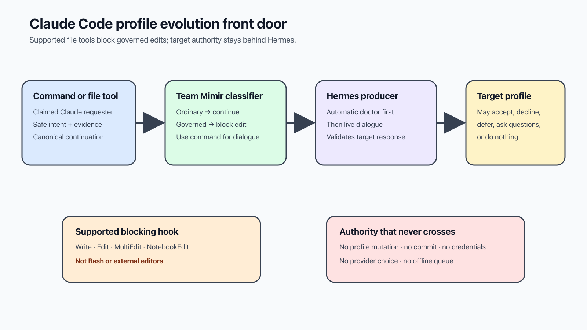

# Use Hermes Profile Evolution in Claude Code

This plugin is the Claude Code front door for proposing a change to one Team
Mimir profile. Its supported file-edit hook blocks governed edits and directs
the operator into target-owned Hermes dialogue.



## Install and verify

Install the repository using one of the methods in the
[repository README](../../../README.md#installation), then restart Claude Code.
Inside an active plugin command, verify the loaded manifest version:

```bash
python3 -c 'import json, pathlib, sys; print(json.loads(pathlib.Path(sys.argv[1]).read_text())["version"])' \
  "${CLAUDE_PLUGIN_ROOT}/.claude-plugin/plugin.json"
```

The released version documented here is `0.1.1`.

Define the adapter for the examples:

```bash
PROFILE_ADAPTER="${CLAUDE_PLUGIN_ROOT}/scripts/profile_request.py"
```

## Start a request

```bash
python3 "$PROFILE_ADAPTER" suggest brokkr \
  "Consider clarifying your review preference" \
  --evidence docs/team/README.md
```

The adapter builds a closed version-1 proposal envelope. The target is the
named profile that owns the proposed behavior. The requester and delegation
hop are both the claimed `claude-code` harness identity; they cannot claim the
target's verified identity.

## Continue or inspect dialogue

Use the exact proposal envelope returned by the first request:

```bash
printf '%s' '<proposal-envelope>' \
  | python3 "$PROFILE_ADAPTER" reply --message "Please explain the tradeoff."

printf '%s' '<proposal-envelope>' \
  | python3 "$PROFILE_ADAPTER" resume

python3 "$PROFILE_ADAPTER" status \
  --proposal-id proposal-0123456789abcdef \
  --revision <64-character-revision-digest> \
  --target brokkr
```

`suggest`, `reply`, and `resume` automatically require a healthy canonical
Hermes response before dialogue. The released Claude adapter deliberately has
no public `doctor` action. For an explicit local diagnostic, run the producer
command it uses:

```bash
hermes profile-request doctor --target brokkr
```

The adapter also exposes the producer-owned `census` read operation.

## Blocking boundary and failures

The `PreToolUse` hook blocks governed or unclassifiable edits made through
Claude Code's `Write`, `Edit`, `MultiEdit`, and `NotebookEdit` tools by exiting
`2`. Ordinary repository edits and paths outside Team Mimir exit `0`. Bash,
external editors, disabled hooks, and same-user access are not intercepted.

The adapter exits `0` after a successful response and `2` for invalid input,
unhealthy or incompatible Hermes service, rejected dialogue, or invalid JSON.
Stop on exit `2`; do not work around the result with a direct profile edit.

## Privacy

Send a short intent and sanitized repository-relative evidence references.
Do not send credentials, tokens, endpoints, logs, sessions, transcripts,
databases, private runtime paths, model or provider overrides, system prompts,
or tool overrides. Continuation envelopes travel on standard input rather than
being interpolated into shell commands.

The [Team Mimir operator hub](https://github.com/infiquetra/team-mimir/tree/main/docs/team/profile-evolution)
explains custody and activation. The
[Hermes producer contract](https://github.com/infiquetra/infiquetra-hermes-plugins/tree/main/docs/profile-evolution)
defines dialogue and compatibility.
