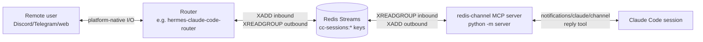

# Architecture — `redis-channel`

## Why

Claude Code's experimental **channels** capability lets a plugin emit `notifications/claude/channel` events into Claude's context and expose an MCP tool that ships replies back out. Channels are the protocol-level mechanism that makes external systems (Discord bots, web UIs, mobile apps) bidirectionally usable as Claude Code surfaces.

`redis-channel` is a generic Redis-Streams channel plugin. It speaks a documented protocol (`PROTOCOL.md`) over Redis and bridges to any consumer that speaks the same protocol on the other side. Decoupling via Redis (rather than HTTP or direct IPC) buys: durability across CC-side restarts, multi-process safety (consumer groups), no port-binding, and the consumer can live on a different machine.

The plugin is **router-agnostic**. One reference consumer is [`hermes-claude-code-router`](https://github.com/infiquetra/hermes-claude-code-router) (Discord-via-Hermes); others are conceivable (Telegram bot, mobile app, CLI test harness). The plugin itself never references a specific consumer in code or descriptions — it's a generic Redis bridge.

## System view



**Flow of a single round-trip:**

1. Remote user sends a message on the user-facing surface (e.g., Discord DM).
2. Router translates → `XADD cc-sessions:<session>:inbound *` with a JSON payload conforming to `Inbound` schema.
3. MCP server's consumer thread does `XREADGROUP GROUP cc:<session> consumer-1 BLOCK 1000 STREAMS ...:inbound >`, gets the message, validates against `Inbound`, emits `notifications/claude/channel` with `{content, meta}`.
4. Claude Code injects the notification into the model's context as a `<channel ...>...</channel>` tag.
5. Claude (the model) calls the `reply` MCP tool with `chat_id`, `text`, `voice`, `in_reply_to`.
6. MCP server validates against `Outbound` and does `XADD cc-sessions:<session>:outbound * payload <JSON>`.
7. Router's `XREADGROUP GROUP <router-name> consumer-1 BLOCK 1000 ...:outbound >` consumes and dispatches to the user-facing surface.

## Components in this plugin

```
plugins/redis-channel/
├── server/
│   ├── __main__.py          # `python -m server` entry point → run()
│   ├── channel.py           # FastMCP app: tools (connect, list, status, reply, setup, configure)
│   ├── presence.py          # Registry HSET + heartbeat thread + lifecycle pubsub
│   ├── redis_client.py      # Redis connection helper + URL-encoded password
│   ├── redis_consumer.py    # XREADGROUP loop in a background thread
│   ├── redis_producer.py    # XADD helper for outbound + permission_request
│   ├── notifier.py          # AsyncNotifier (thread → asyncio bridge for MCP notifications)
│   ├── registry.py          # Loads ~/.claude/channels/redis-channel/registry.json
│   ├── session_id.py        # Auto-name from cwd + 8-hex hash; --session-name override
│   └── protocol.py          # Pydantic models matching PROTOCOL.md
├── commands/                # Claude Code slash commands
├── .mcp.json                # Tells Claude Code how to launch the MCP server
├── scripts/
│   ├── claude-channel.sh    # ~/bin wrapper: env vars + dev flags + exec claude
│   ├── install-claude-channel.sh  # Symlink installer (manual fallback)
│   └── integ_test.py        # Headless full-pipeline integration test
└── PROTOCOL.md              # Canonical Redis wire format
```

## State + lifecycle

### Presence registry (per-session in Redis)

```
HSET cc-sessions:registry <session_name> <JSON {host, cwd, git_branch, started_at, pid, endpoint}>
SET  cc-sessions:hb:<session_name> <last_heartbeat_ts> EX 60      # refreshed every 10s
```

Routers list live sessions by `HGETALL cc-sessions:registry` filtered by `EXISTS cc-sessions:hb:<name>`. Stale entries (process killed without graceful disconnect) get lazily GC'd by `list_live_sessions(gc_stale=True)`.

### Connect/disconnect

- **Connect** (`/redis-channel-connect` OR auto-connect via `CLAUDE_CHANNEL_AUTO_CONNECT=1` env): opens Redis, creates consumer group at `id="$"`, starts presence thread (heartbeat), then attaches consumer thread (XREADGROUP loop) + AsyncNotifier. Single-session-per-process — second connect replaces the first.

- **Disconnect** (`/redis-channel-disconnect`, SIGTERM, atexit): stops consumer thread, stops heartbeat thread, `HDEL cc-sessions:registry <name>`, `DEL cc-sessions:hb:<name>`, `DEL` per-session streams, `PUBLISH cc-sessions:events:<name> {type: "unregistered"}`.

### Auto-connect resolution order

When `CLAUDE_CHANNEL_AUTO_CONNECT=1` (set by the `claude-channel` wrapper):
1. `CLAUDE_CHANNEL_ENDPOINT` env var (explicit per-invocation override).
2. `registry.defaults.auto_connect_endpoint` (registry-wide pin).
3. `Registry.resolve_default_endpoint()` — `defaults.default_endpoint` name, OR single-endpoint convenience fallback when only one endpoint is configured.

Failure modes (registry missing, endpoint unknown, Redis unreachable) → log warning, continue running; manual `/redis-channel-connect` still works.

### Deferred consumer-thread start

`startup_register()` (eager, at MCP boot) creates the consumer group + publishes presence — but does NOT start the consumer thread, because there's no MCP `Context` yet to build an `AsyncNotifier` from. The first MCP tool dispatch (any tool — `list`, `status`, `reply`) calls `ensure_consumer_attached()` which builds the notifier from the live `ctx` and starts the thread. Because the consumer group was created at `id="$"` BEFORE presence published, `XREADGROUP >` later picks up everything the router XADD'd in the gap — no silent drop.

## Config files (per deployment)

```
~/.claude/channels/redis-channel/
├── registry.json     # Endpoint definitions + defaults
└── source-env.sh     # Sourced by .mcp.json launcher; exports env vars (passwords, etc.)
```

- **registry.json** is JSON, NOT a secret store. The Redis password lives in an env var whose name is referenced via `redis_password_env`.
- **source-env.sh** is the per-deployment glue. The plugin doesn't bake env-var names; it reads them via the registry. The user's source-env.sh is responsible for populating those env vars (e.g., sourcing from macOS keychain).

See `docs/registry.example.json` and `docs/source-env.example.sh` for templates. `/redis-channel-setup` scaffolds both from the examples; `/redis-channel-configure` adds/updates endpoints in `registry.json` without touching `source-env.sh`.

## Claude Code integration knobs

| Surface | Mechanism |
|---|---|
| MCP server startup | `.mcp.json` runs `uv run python3 -m server` |
| Plugin-side coaching | `instructions=` field in `FastMCP(...)` — injected into Claude's system prompt at session start (not the `agents/` dir, which is subagent-invocable only) |
| Channel notifications | `notifications/claude/channel` — requires the `claude/channel` experimental capability declared via a monkey-patch on `create_initialization_options`; Claude Code must be launched with `--dangerously-load-development-channels plugin:redis-channel@infiquetra-plugins` for channels to surface |
| Slash commands | Markdown files in `commands/`, each documents a `redis_channel_*` MCP tool to call |
| Wrapper | `~/bin/claude-channel` symlinked to `scripts/claude-channel.sh`; sets `CLAUDE_SESSION_NAME`, `CLAUDE_CHANNEL_ENDPOINT`, `CLAUDE_CHANNEL_AUTO_CONNECT=1`, dev flags, and execs claude |

## Known limitations

- **Channel notifications don't reach `--bg` / `/bg` dispatched sessions.** Claude Code's bg-dispatch carry-through flag set excludes `--dangerously-load-development-channels` (and `--channels`), so dispatched bg-spare processes don't recognize the channel capability and silently drop notifications. Foreground sessions (including tmux-wrapped foreground) work. See `docs/engineering-journal/LEARNINGS.md#cc-channels-bg-not-supported` for details.
- **Local-terminal reply rendering is best-effort.** When Claude calls the `reply` tool, the tool's text content doesn't render as natural chat in the local terminal — Claude Code's UI shows "Called plugin:redis-channel:..." collapsed. The channel user sees the reply correctly; the local terminal user must expand the tool call to see what was sent. This is intended Claude Code Channels design; documented in `LEARNINGS.md#cc-channels-surface-split`.
- **Cross-host kill not supported.** Routers can spawn + monitor sessions only on the same host as the router process. The registry's `host` field is informational; SIGTERM works only when host matches.

## Cross-references

- `PROTOCOL.md` — the canonical wire format (shared verbatim with any compliant router)
- `docs/STATE_MACHINE.md` — router-side routing-target state machine (consumer concern, kept here for completeness)
- `docs/engineering-journal/LEARNINGS.md` — empirical findings from the build
- `docs/engineering-journal/DECISIONS.md` — ADRs that shaped the design
