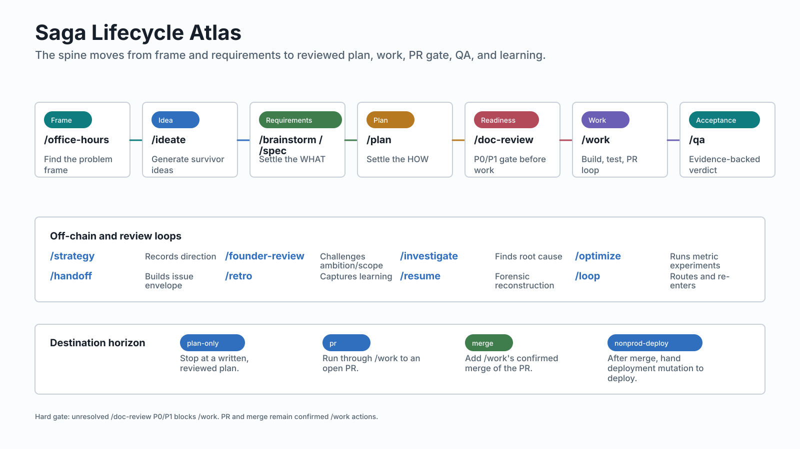

# saga

Saga is the Infiquetra lifecycle spine for turning vague work into reviewed plans, PRs, merges, handoffs, QA evidence, and durable learning.

It is an operating model, not just a command bundle. Saga owns lifecycle choice, local saga state, routing, and handoff envelopes. Adjacent plugins own their own mutation surfaces: `mission-control` owns SDLC issues and board state, `deploy` owns deployment mutation, and `team-execution` owns reviewer/validator orchestration.



## Start Here

Use the situation, not the command list, as the entry point.

| Situation | Command | Next artifact |
|-----------|---------|---------------|
| The ask is still unframed | `/office-hours` | frame note and route |
| You want grounded options | `/ideate` | `docs/ideation/` |
| One idea needs requirements | `/brainstorm` | `docs/brainstorms/` |
| The WHAT is vague | `/spec` | `docs/specs/` |
| The WHAT is settled and needs HOW | `/plan` | `docs/plans/` |
| A plan needs readiness review | `/doc-review` | `docs/reviews/` |
| A reviewed plan should be built | `/work` | `docs/work-sessions/`, PR |
| A built branch needs pre-PR review | `/code-review` | `docs/code-reviews/` |
| Merged or merge-bound work needs evidence | `/qa` | `docs/qa/` |
| Work should move to an SDLC issue | `/handoff` | mission-control issue preparation |
| The thread is cold or confusing | `/resume` | re-entry route |
| You want the fleet's live state (boards, runs, ledger, spend) | `/pulse` | terminal telemetry snapshot |
| Finished work should teach the lifecycle | `/retro` | journal or retro artifact |

The repository contains 23 command files and 22 routable commands. `/ceo-review` is an alias for `/founder-review`, not a separate lifecycle node.

**Above a single work-thread:** `/outcome` is the **OutcomeOrchestrator** — a coordinator that drives a whole *outcome* as a durable DAG of leaf sagas. It runs a level-triggered reconcile loop that dispatches the ready frontier across the full backend menu (inline / fork / subagent / team-execution / cc-workflows-ultracode / `/goal` / manual), auto-merges clean leaves, and pages the operator only at gates, ambiguities, and failures — status is derived on read, completion is canonical on GitHub, and the realized cost rollup proves whether the DAG beat one long thread. The native leaf verbs (`/work`, `/code-review`, `/qa`, `/resume`) are reused on a leaf, never shadowed.

## Manual

The manual pages are the maintained user-facing reference.

| Page | Use it for |
|------|------------|
| [Manual index](docs/README.md) | Documentation map and maintenance path |
| [Lifecycle](docs/lifecycle.md) | Main chain, off-chain routes, gates, and destination horizon |
| [Command selection](docs/commands.md) | Comparable cards for every command |
| [State and readiness](docs/state-readiness.md) | Stored saga state vs derived handoff maturity |
| [Scenarios](docs/scenarios.md) | User-situation journeys and example routes |
| [Boundaries](docs/boundaries.md) | Saga vs adjacent plugin ownership, Claude vs Codex adapter notes |
| [Visuals](docs/visuals.md) | Source model, generated assets, and regeneration workflow |

## Lifecycle In One Pass

The main chain is:

```text
idea/requirements-ready -> /plan -> /doc-review -> /work -> /code-review -> /qa -> /handoff or /retro
```

Off-chain commands are still first-class, but they do not become linear saga phases. `/spec` sharpens WHAT, `/investigate` diagnoses root cause, `/optimize` runs metric experiments, `/strategy` records direction, and `/retro` captures learning after work is complete.

Destination sets the routing horizon:

| Destination | Horizon |
|-------------|---------|
| `plan-only` | stop at a written, reviewed plan |
| `pr` | run through `/work` to an open PR |
| `merge` | add `/work`'s confirmed merge of the PR |
| `nonprod-deploy` | after merge, route deployment mutation to `deploy` |

## State And Readiness

Saga stores three axes in local, git-ignored saga ticks: `lifecycle_phase`, `phase_status`, and `status`.

`maturity` is different. It is derived at handoff time from the source artifact or lifecycle phase and must not be stored as saga state.

| Artifact root | Derived maturity | Consumer |
|---------------|------------------|----------|
| `docs/ideation/` | `idea-ready` | `/plan` |
| `docs/brainstorms/`, `docs/specs/` | `requirements-ready` | `/plan` |
| `docs/plans/`, `docs/reviews/` | `plan-ready` | `/work` |
| `docs/work-sessions/`, branch refs | `resume-ready` | `/work` |

See [state and readiness](docs/state-readiness.md) for the full passport.

## Maintainer Workflow

The visual and coverage source lives at [docs/model/saga-docs-model.yaml](docs/model/saga-docs-model.yaml). Update it when command routes, readiness mappings, ownership boundaries, scenarios, or visual coverage change.

Regenerate visuals:

```bash
uv run python plugins/saga/scripts/render_docs_visuals.py
```

Check drift:

```bash
uv run pytest tests/test_saga_docs_coverage.py tests/test_saga_doc_formatting.py
```

Core implementation contracts still live in canonical references:

- [Saga spec](references/saga-spec.md)
- [Dispatch table](skills/loop/references/dispatch-table.md)
- [Operator choice](references/operator-choice.md)
- [Formatting style](references/formatting-style.md)
